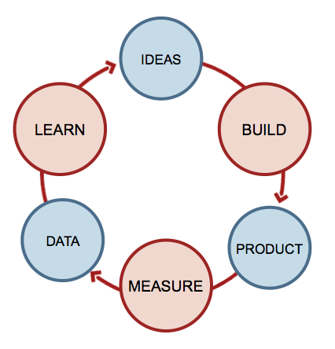
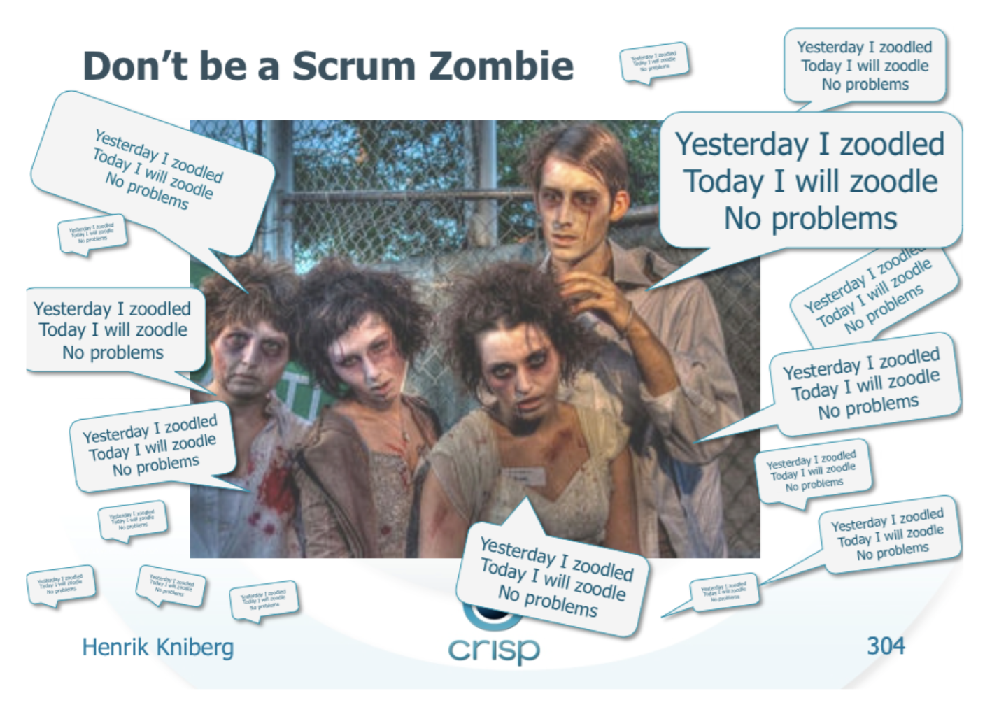
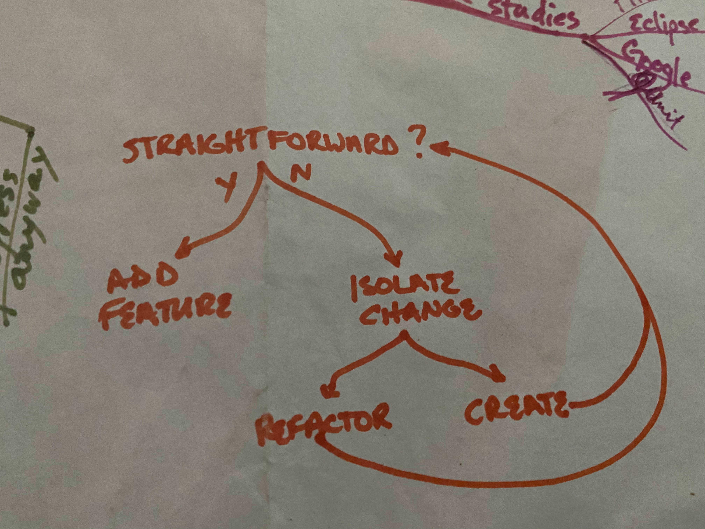
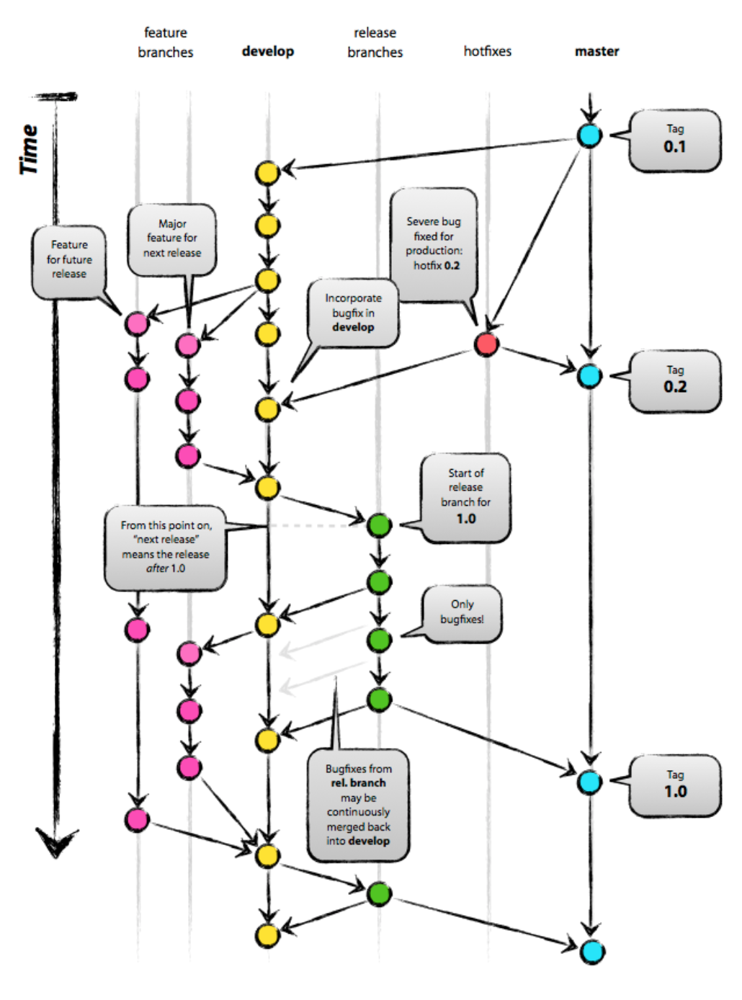

# Introducción a MADS #

En este apartado veremos una introducción a los contenidos de la
asignatura y explicaremos su planificación. Tras leerlo tendrás una
visión general de los temas de teoría y prácticas que vamos a abordar
durante el cuatrimestre y conocerás el sistema de evaluación.

## Datos de la asignatura ##

La asignatura **Metodologías Ágiles de Desarrollo de Software** es
una asignatura optativa de 4º curso del Grado en Ingeniería
Informática. Es una asignatura de la especialidad de **Ingeniería del
Software**.

- **Departamento**: Ciencia de la Computación e Inteligencia Artificial.
- **Créditos ECTS**: 6 créditos ECTS, que se corresponden con 15
  semanas de trabajo y 10 horas por semana, incluyendo clases y
  trabajo en casa (150 horas de dedicación en total).
- [**Ficha UA** de la asignatura](https://cvnet.cpd.ua.es/Guia-Docente/GuiaDocente/Index?wcodest=C203&wcodasi=34037&wlengua=es&scaca=2020-21).

El profesor de la asignatura es [Domingo
Gallardo](http://www.dccia.ua.es/~domingo/). Puedes consultarle
enviándole una tutoría por UACloud o un correo electrónico a
_domingo.gallardo@ua.es_. También puedes encontrarlo en Twitter con
el usuario [@domingogallardo](https://twitter.com/domingogallardo).

## Materiales docentes ##

Todos los materiales de teoría de la asignatura están escritos
en Markdown y publicados en el repositorio de GitHub [domingogallardo/mads-ua](https://github.com/domingogallardo/mads-ua).

Los apuntes de las prácticas también están realizados en Markdown,
subidos al repositorio [domingogallardo/practicas-mads](https://github.com/domingogallardo/practicas-mads),
compilados con la herramienta [Material for MkDocs](https://squidfunk.github.io/mkdocs-material/) y
desplegados en GitHub Pages en [este enlace](https://domingogallardo.github.io/practicas-mads/). El
resultado es un sitio web donde es posible realizar búsquedas y
navegar por secciones.

Utilizaremos Moodle como plataforma docente. Puedes encontrar la
página de la asignatura en [este
enlace](https://moodle2020-21.ua.es/moodle/course/view.php?id=445). Publicaremos
semana a semana los enlaces a los materiales en GitHub. También se
realizarán en la plataforma las entregas finales de las prácticas (que
se deberán ir subiendo también a GitHub). Y utilizaremos el foro para
poner en común dudas que os puedan surgir cuando estáis realizando los
trabajos.

## Evolución de los contenidos de la asignatura ##

La asignatura está en constante evolución. Todos los años se revisan
los contenidos, atendiendo a vuestro _feedback_ y a los cambios en las
tecnologías y en los conceptos impartidos.

Por ejemplo, podemos destacar los siguientes cambios que hemos
introducido en los últimos años:

- Uso del _framework_ Java Spring Boot, mucho más usado en la industria que
  el que utilizábamos anteriormente (_Play Framework_).
- Mayor énfasis en las funcionalidades de GitHub y de Git.
- Mayor importancia a las metodología XP y Kanban y menos tiempo dedicado a
  Scrum, debido a que ya lo habéis visto en otras asignaturas de la
  titulación.

Al final del curso se pasa una encuesta y vuestras observaciones
sirven para mejorar la asignatura.

Por ejemplo:

> "Es confuso usar 3 tableros distintos (GitHub, Trello, Wiki)"

Como respuesta hemos pasado a usar dos únicos tableros, el de
GitHub y el de Trello, y a diferenciar claramente su uso.

> "Algunos temas de teoría se han hecho algo pesados"

Este curso vamos a intentar reducir la duración de las explicaciones
de teoría, intercalando explicaciones y actividades más prácticas.

> "La gestión de configuraciones es demasiado complicada"

Este curso vamos a simplificar las pruebas y el despliegue de la
aplicación desarrollada en prácticas usando las **Actions** de GitHub,
en lugar de Travis. De esta forma se podrá realizar todo el proceso en
una única plataforma.

### Mejora continua y _Kaizen_ ###

</img>

Queremos aplicar en el propio contenido de la asignatura una de las
técnicas de las metodologías ágiles y metodologías _lean_: la **mejora
continua** o **Kaizen**.

> "Perfection is a direction, not a place"

Esta frase de Henrik Kniberg refleja muy bien la filosofía Kaizen de
mejora continua que se aplica en las técnicas _lean_ de gestión de
empresas o en el desarrollo de software basado en entrega
continua. 

Queremos que la asignatura vaya evolucionando y mejorando curso a
curso y que no se estanque en un sitio, por muy _perfecto_ que nos
pueda parecer.

<table markdown="1">
<tr><td style="background-color: #e0e0e0">

**Filosofía Kaizen**

</img>

Kaizen (consultar [Kaizen](https://en.wikipedia.org/wiki/Kaizen) en la
Wikipedia) es una palabra japonesa que significa mejora continua y
cambio incremental. Un "Kaizen" es una pequeña mejora, que introduce
un riesgo pequeño y que puede ser fácilmente implementada.

Las ideas Kaizen aplicadas a la mejora de procesos en la empresa
tienen su origen en Japón en los años 50. En esos años se desarrolla
en la empresa de fabricación de automóviles Toyota una metodología de
gestión y fabricación totalmente distinta a la existente en Estados
Unidos. Se trata del denominado **TPS (_Toyota Production
System_)**. Su aplicación en las empresas japonesas puso a este país
en la cabeza de la producción y venta de automóviles en los años 60 y
70 y constituyó todo un cambio de paradigma en la gestión. Esta nueva
metodología fue analizada profusamente en las más importantes escuelas
de negocios a lo largo de muchas décadas, dando lugar a lo que hoy se
conoce como **métodos lean**.

</img>

En esta filosofía de mejora continua introducida por Toyota también se
utiliza el denominado **ciclo PDSA** (_Plan-Do-Study-Act_) introducido
por el estadístico Edwards Deming.  Este ciclo trata de dirigir los
cambios utilizando una metodología científica, en la que se realiza un
plan definiendo alguna hipótesis, se realiza un experimento, se
estudian los resultados obtenidos y se actúa aceptando o rechazando el
cambio.

Este ciclo es muy utilizado en _startups_ para construir y modificar
el producto o software que se entrega al público.

Un ejemplo práctico de uso de la filosofía Kaizen se muestra en este
[hilo de
Twitter](https://twitter.com/DaniNovarama/status/1213389941243285505)
de Dani Sánchez-Crespo [@DaniNovarama](https://twitter.com/DaniNovarama).

</td></tr></table>

<table markdown="1">
<tr><td style="background-color: #e0e0e0">

**Henrik Kniberg**

</img>

[Henrik Kniberg](https://www.crisp.se/konsulter/henrik-kniberg) es un
divulgador muy importante de las metodologías ágiles. Ha trabajado con
grandes empresas como Spotify y Lego para implantar en ellas estas
metodologías. Le gusta compartir todo lo que hace y muchos de los
libros que ha escrito están en abierto. Vamos a utilizar muchos de sus
materiales (diapositivas, vídeos, libros, artículos) en la asignatura.

Muy recomendable su
[blog](http://blog.crisp.se/author/henrikkniberg). Su Twitter es
[@henrikkniberg](https://mobile.twitter.com/henrikkniberg). 

</td></tr></table>

## Planificación y evaluación ##

La evaluación de la asignatura se divide en un 40% correspondiente a
teoría y un 60% a prácticas.

### Teoría (40%) ###

Los contenidos de la asignatura se dividen en 4 grandes bloques:

1. Valores y principios ágiles para el desarrollo del software 
2. XP  (eXtreme Programming)
3. Integración y entrega continua
4. Metodologías lean y Kanban

La evaluación de los contenidos de teoría se hará de forma continua,
mediante **3 exámenes de tipo test** que ponderarán un 10% cada uno y un
**trabajo individual** de redacción sobre alguno de los temas de la
asignatura que ponderará otro 10%.

Para el trabajo individual deberás proponer un título sobre en tema
relacionado con la asignatura y el profesor dará el visto bueno. En el
trabajo deberás realizar una pequeña investigación bibliográfica en
artículos, blogs, libros, etc. sobre el tema propuesto y escribir un
ensayo con una extensión de alrededor de 3.000 palabras. En el trabajo
deberás incluir:

- Introducción
- Desarrollo
- Conclusiones
- Bibliografía (al menos 3 fuentes bibliográficas)

El trabajo deberá ser original. Se utilizará una herramienta de
detección de plagio para detectar la copia de párrafos sin atribuir la
cita.

### Prácticas (40%) ###

Las prácticas ponderarán un 40% en la nota final de la asignatura.

Se realizarán cinco prácticas a lo largo de la asignatura. Las tres
primeras serán **individuales** y ponderarán la mitad de la nota de
prácticas y las otras dos serán en **equipo de 3 personas** y
ponderarán la otra mitad.

Las 5 prácticas y su ponderación en la nota final de prácticas son las siguientes:

1. (5%) (Individual) Introducción a Spring Boot.
2. (25%) (Individual) Versión inicial de la aplicación ToDoList.
3. (15%) (Individual) Integración continua y TDD en Spring Boot.
4. (15%) (Equipo) Integración continua con GitFlow y despliegue. 
5. (30%) (Equipo) Desarrollo de una iteración usando integración
   continua, Kanban y prácticas ágiles. 

### Examen de prácticas (20%) ###

También se hará un examen práctico individual sobre las tecnologías y
metodologías utilizadas en las prácticas. Tendrá una ponderación de un
20% en la nota final de la asignatura.

### Exámenes ###

Las fechas de los exámenes serán las siguientes:

- Examen 1 de teoría (10%): miércoles 21 de octubre de 11:00 a 11:15
  h. (15 minutos) sobre la teoría vista desde la semana 1 hasta la
  semana anterior incluida.
- Examen 2 de teoría (10%): miércoles 2 de diciembre de 11:00 a 11:15
  h. (15 minutos) sobre la teoría vista desde el examen 1 hasta la
  semana anterior incluida.
- Examen 3 de teoría (10%): En enero, en la fecha y hora en la que se realice
  el examen final de la asignatura. También tendrá una duración de 15
  minutos.
- Examen de prácticas (20%): miércoles 25 de noviembre, de 11:00 a
  13:00 h. (2 horas) en el horario de teoría.

Todos los exámenes serán on-line, aunque se podrán realizar desde
clase para los que tengan docencia presencial ese día. Serán exámenes
de tipo "libro abierto", en el que se podrán consultar apuntes y estar
conectados a Internet.

Los exámenes de teoría serán de tipo test y se usará la herramienta de
cuestionarios de Moodle. En el examen de prácticas se deberá trabajar
con un repositorio GitHub con una aplicación Spring Boot y realizar una
serie de modificaciones sobre ella utilizando la metodología de
trabajo vista en clase de prácticas (commits frecuentes, issues, pull
requests, versiones, etc.).

## Bloque 1: Valores y principios ágiles ##

En la actualidad la palabra "Agile" está muy extendida en el mundo de
los negocios, de las _startups_ y de las empresas de software que
quieren dar apariencia de que hacen las cosas bien. Muchos directivos
y _managers_ intermedios de grandes empresas hablan de "transformación
digital" y de "agile". Abundan los congresos, conferencias y cursos
sobre estos temas.

Sin embargo, cada vez hay más descontento precisamente entre los que
comenzaron esta "revolución agile", entre los equipos de
desarrollo. Tras el interés actual por "agile", ¿hay realmente un
interés en hacer mejor las cosas?  ¿Hay interés en no agotar a los
equipos con jornadas interminables de trabajo? ¿En transferir parte
del poder de decisión a los desarrolladores? ¿En realmente
incorporar a los clientes en el ciclo de desarrollo? ¿En que el
software desarrollado sea probado continuamente y que se entregue en
incrementos pequeños que añaden nuevo valor? ¿En corregir y reordenar
las prioridades conforme se aprende más del dominio?

Para apreciar realmente el significado de las metodologías ágiles hay
que volver al principio, conocer los fundamentos y valores de estas
metodologías. Si nos limitamos a seguir ciegamente unos procedimientos
estándar (el _daily scrum_, el _sprint planning_, etc.) sin entender
los valores y principios subyacentes nos convertiremos en _scrum
zombies_.

Las metodologías _lean_ son también una de las bases más importantes
del cambio hacia una nueva filosofía y forma de trabajar. Son también
una oportunidad de implicar a _managers_ y directivos en la
transformación ágil. Muchas empresas están aplicando con éxito estas
técnicas para conseguir iteraciones rápidas y productos más útiles
para sus clientes.

El bloque tendrá una **duración de 3 semanas** y veremos en él temas
relacionados con los valores y principios ágiles 

- Desarrollo del software, características y modelos, aceptación del cambio.
- Manifiesto ágil, repercusión del manifiesto en las metodologías
  de desarrollo, orígenes y fundamentos de las metodologías
  ágiles.
- Introducción a las metodologías lean.

## Bloque 2: XP (eXtreme Programming) ##

EXtreme Programming (XP) fue una de las primeras metodologías
ágiles. Kent Beck formula el conjunto de valores, principios y
prácticas que constituyen esta metodología a finales de los 90 y
principios del 2000.

A diferencia de otras metodologías, como Scrum o Kanban, la
metodología está muy centrada en el desarrollo de software y muchas
de sus prácticas, como _pair programming_ o _TDD (Test Driven
Design)_, son específicas para desarrolladores.

En este bloque incluiremos también otras técnicas y prácticas de
desarrollo que, no siendo estrictamente parte de XP, son
imprescindibles para poder gestionar el cambio. Un software bien
diseñado y desarrollado debe ser fácilmente modificable y no debe
acumular _parches_ y soluciones parciales que lo van haciendo cada vez
más incomprensible (la denominada _deuda técnica_).

<table markdown="1" align="right">
<tr><td>

</img>

[© Kent Beck](https://twitter.com/KentBeck/status/1218307926818869248?s=20)

</td></tr></table>

Los tests y la refactorización son ideas fundamentales para tratar con
el cambio sin ahogarse en la deuda técnica. Veremos técnicas para
diseñar el software de forma que se facilite el cambio y para aislar
las funcionalidades existentes de forma que las nuevas funcionalidades
no entren en conflicto con las ya existentes.

El bloque tendrá una **duración de 4 semanas** y veremos en él los
aspectos fundamentales de XP. Veremos en profundidad TDD, haciendo
una demostración de este tipo de metodología de desarrollo. Hablaremos
también de _Clean Code_, _Domain Driven Design_ y refactorización.

- Valores y prácticas XP.
- TDD, Desarrollo Dirigido por los Tests.
- Cambio, código y comunicación: Clean Code, Domain Driven Design,
  Refactorización.

<table markdown="1">
<tr><td style="background-color: #e0e0e0">

**Kent Beck**

</img>

[Kent Beck](https://twitter.com/KentBeck) es un ingeniero de software,
escritor, creador y divulgador de metodologías de diseño y desarrollo
de software. Ha sido uno de los principales responsables del auge de
las metodologías ágiles con el desarrollo y la divulgación de XP
(EXtreme Programming).

Además ha escrito sobre patrones de diseño de software, sobre testing,
ha creado prácticas como TDD (_Test Driven Design_) o la más reciente
TCR ([_Test && Commint ||
Revert_](https://medium.com/@kentbeck_7670/test-commit-revert-870bbd756864))
y ha desarrollado la librería de testing en Java jUnit.

Muchas ideas que veremos en la asignatura han sido propuestas o
popularizadas por él.

- [Bibliografía de Kent Beck](https://en.wikipedia.org/wiki/Kent_Beck#Publications)
- [Charlas en YouTube](https://www.youtube.com/results?search_query=kent+beck)

</td></tr></table>

## Bloque 3: Integración y entrega continua ##

Uno de los elementos importantes de las metodologías ágiles es la
entrega continua al cliente de software que funciona. Para poder
realizar esta entrega es fundamental poder añadir funcionalidades
continuamente al software que estamos desarrollando y poder
desplegarlo y ponerlo en manos del cliente en cuestión de minutos.

Los sistemas como Git y las herramientas de integración continua
permiten trabajar con múltiples versiones del producto de forma segura
y automatizar la ejecución de los tests y la construcción y despliegue
de los ejecutables.

Este bloque tendrá una **duración de 4 semanas** y en él estudiaremos en
profundidad Git y la plataforma GitHub con todas las funcionalidades
que proporciona para realizar una integración continua de nuestro
proyecto software: pull requests, revisión de código, scripts de
compilación y despliegue. También estudiaremos la herramienta Docker
que nos permitirá empaquetar nuestra aplicación en un contenedor que
podrá ser desplegado y ejecutado en cualquier lugar.

- Git como sistema de control de versiones, flujos de trabajo con
  Git.
- Principios de la entrega continua de software.
- Herramientas y tecnologías para la integración continua, scripts
  de construcción y despliegue, infraestructura y entornos de
  integración, cloud.

## Bloque 4: Metodologías lean y Kanban ##

Después de ver en el bloque 1 una introducción a las metodologías
lean, en este último bloque las estudiaremos en profundidad. Veremos
cómo aplicarlas al desarrollo de software y nos centraremos en la
metodología Kanban, centrada en la visualización y optimización del
flujo de trabajo y en la detección de cuellos de botella en el las
distintas fases del desarrollo.

Un elemento fundamental en la metodología Kanban es el uso de
tableros en los que visualizar el estado de todas las tareas que está
realizando el equipo.

El bloque tendrá una **duración de 3 semanas** y veremos los siguientes apartados:

- Fabricación lean, empresa lean, desarrollo de software lean.
- Fundamentos de Kanban: visualización, ítems de trabajo, trabajo
  en progreso, flujo, mejora continua, límite en el WIP.
- Kanban vs. Scrum.
- Cultura ágil, metodologías ágiles en la empresa.

## Prácticas ##

### Tecnologías de las prácticas ###

- [Spring Boot](https://spring.io/projects/spring-boot)
    - Framework de desarrollo rápido de aplicaciones web, usado 
en
      producción en múltiples empresas. Uno de los frameworks 
Java más
    demandados por el mercado. 
    - Arquitectura MVC con controladores que responden a 
peticiones
    HTTP y generan vistas basadas en plantillas 
    - Modelo de datos y acceso a BD con JPA
    - Integra la gestión de dependencias Maven
- [GitHub](http://github.com/)
- [Git](https://git-scm.com/book/en/v2)
- [Docker](https://www.docker.com/)

### Prácticas que desarrollaremos ###

- Práctica 1 (5 semanas): **Primera aplicación** y **TodoList** en
  Spring Boot. Spring Boot, Git, GitHub. Metodología de trabajo Git y
  GitHub. 
- Práctica 2 (3 semanas): **Integración continua**. Tests en Spring Boot y
  TDD. Integración continua con GitHub y Docker. 
- Práctica 3 (3 semanas): **Configuración del trabajo en equipo**. Flujo de trabajo Git y
  GitHub modificado para el trabajo en equipo. Uso de pull requests. 
- Práctica 4 (4 semanas): **Iteración de desarrollo**. Seleccionaremos
  las historias de usuario y las desarrollaremos durante una iteración de desarrollo,
  practicando las metodologías vistas en la asignatura. Mejoraremos
  también el tablero de GitHub para acercarlo más a un tablero de
  Kanban.

## Bibliografía ##

A continuación puedes ver un listado de libros en los que ampliar los
contenidos de la asignatura. Se incluye un enlace a O'Reilly para
poder consultarlos con tu ordenador o tablet. Puedes encontrar todos
los libros en la Playlist de O'Reilly [Metodologías
Ágiles](https://learning.oreilly.com/playlists/df91e777-07f6-47ac-a9d0-3f02724af1a2).

La mayoría también está disponible en formato físico en la biblioteca
de la UA. Puedes consultar su ubicación y disponibilidad en el
[catálogo de la
UA](http://gaudi.ua.es/uhtbin/cgisirsi/x/0/x/38/1/X/BLASTOFF).

### Agile en general y Scrum ###

- Green Stellman: [_Learning Agile_](https://learning.oreilly.com/library/view/learning-agile/9781449363819/)
- James Shore: [_The Art of Agile Development](https://learning.oreilly.com/library/view/the-art-of/9780596527679/)
- Jonathan Rasmusson: [_The Agile Samurai_](https://learning.oreilly.com/library/view/the-agile-samurai/9781680500066/)
- Mike Cohn: [_Succeeding with Agile_](https://learning.oreilly.com/library/view/succeeding-with-agile/9780321660534/)
- Mike Cohn: [_Agile Estimating and Planning_](https://learning.oreilly.com/library/view/agile-estimating-and/9780137126347/)
- Mike Cohn: [_User Stories Applied_](https://learning.oreilly.com/library/view/user-stories-applied/0321205685/)
- Kenneth S. Rubin: [_Essential Scrum_](https://learning.oreilly.com/library/view/essential-scrum-a/9780321700407/)
- John Reffries: [_The Nature of Software Development_](https://learning.oreilly.com/library/view/the-nature-of/9781680500721/)
  
### EXtreme Programming ###

- Kent Beck: [_Extreme Programming Explained (Primera edición)_](https://learning.oreilly.com/library/view/extreme-programming-explained/0201616416/)
- Kent Beck: [_Extreme Programming Explained (Segunda Edición)_](https://learning.oreilly.com/library/view/extreme-programming-explained/0321278658/)
- Kent Beck, [_Test Driven Development By Example_](https://learning.oreilly.com/library/view/test-driven-development/0321146530/)
- Henrik Kniberg: [_Scrum and XP from the Trenches (2nd edition)_](https://www.infoq.com/minibooks/scrum-xp-from-the-trenches-2)

### Buenas prácticas de desarrollo ###

- David Thomas; Andrew Hunt: [_The Pragmatic Programmer: your journey to
  mastery, 20th Anniversary Edition, 2nd Edition_](https://learning.oreilly.com/library/view/the-pragmatic-programmer/9780135956977/)
- Scott Millett: [_Patterns, principles, and practices of domain-driven
design_](https://learning.oreilly.com/library/view/patterns-principles-and/9781118714706/?ar)
- Michael Feathers: [_Working Effectively with Legacy Code_](https://learning.oreilly.com/library/view/working-effectively-with/0131177052/)
- Martin Fowler: [_Refactoring_](https://learning.oreilly.com/library/view/refactoring-improving-the/9780134757681/)
- Robert C. Martin: [_Clean Code_](https://learning.oreilly.com/library/view/clean-code/9780136083238/)
- Robert C. Martin: [_Clean Architecture: A Craftsman's Guide to
  Software Structure and Design_](https://learning.oreilly.com/library/view/clean-architecture-a/9780134494272/)

### Lean y Kanban ###

- Mary Poppendieck and Tom Poppendieck: [_Implementing lean Software Development: From Concept to Cash_](https://learning.oreilly.com/library/view/implementing-lean-software/0321437381/)
- Henrik Kniberg: [_Lean from the Trenches_](https://learning.oreilly.com/library/view/lean-from-the/9781941222935/)
- Hammarberg, Sunden: [_Kanban in Action_](https://learning.oreilly.com/library/view/kanban-in-action/9781617291050/)

### Continous delivery, integration and deployment ###

-  David Farley and Jez Humble: [_Continuous delivery_](https://learning.oreilly.com/library/view/continuous-delivery-reliable/9780321670250/)
- Jez Humble, Gene Kim and Nicole Forsgren: [_Accelerate_](https://learning.oreilly.com/library/view/accelerate/9781457191435/)
- Scott Chacon: [_Pro Git_](https://learning.oreilly.com/library/view/pro-git-second/9781484200766/)
- Brent Laster: [_Professional Git_](https://learning.oreilly.com/library/view/professional-git/9781119284970/)
- Jeffrey Nickoloff, Stephen Kuenzli: [_Docker in Action_](https://learning.oreilly.com/library/view/docker-in-action/9781617294761/)

