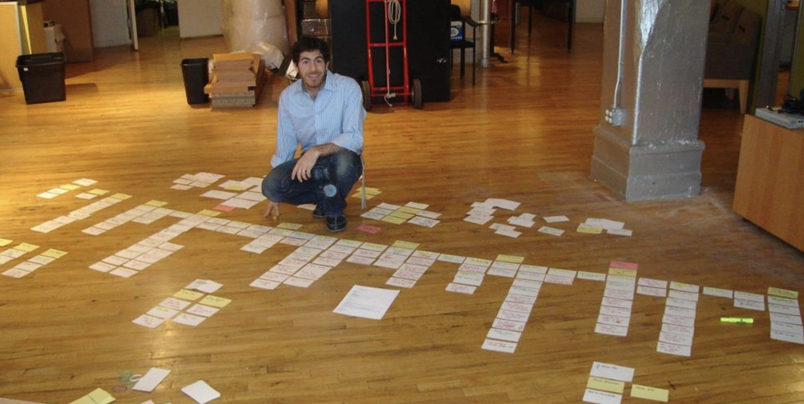

# Historias de usuario #

La práctica de historias de usuario (_Stories_, en la segunda edición
del libro de Beck) tiene que ver con dividir y planificar el trabajo a
realizar utilizando pequeños "trozos" de funcionalidad visibles por el
cliente. Beck denomina estos pequeños trozos "historias"
(_stories_). Después se utilizará el término "historias de usuario"
(_user stories_). 

Por ejemplo, "Proporcionar una forma rápida (dos clicks como máximo)
para que los usuarios puedan llamar a los números usados
frecuentemente". O "Permitir que el usuario pueda visualizar en una
única pantalla todas las asignaturas de las que está matriculado,
incluyendo detalles relevantes de cada una de ellas".

Inicialmente las historias de usuario son frases cortas, descriptivas,
que proporcionan una visión de alto nivel de las funcionalidades a
implementar en el sistema. Están destinadas, más que a definir una
especificación completa, a ser la base de una comunicación efectiva
entre el cliente final y el equipo de desarrollo.

## Características de las historias de usuario ##

El nombre de **historia** se utiliza frente al nombre tradicional de
**requisito**. Un requisito tiene la connotación de algo obligatorio e
inmmutable, cosas incompatibles con abrazar el cambio y con la
realización de un diseño evolutivo. Cuando vemos que implementando el
20% de los requisitos originales obtenemos el 80% del valor nos damos
cuenta que los requisitos no implementados no son tan obligatorios.

Al utilizar el nombre **historia** nos deshacemos de esas
connotaciones dañinas que tenía el nombre de **requisito**.

Una vez que se escribe la historia, se debe intentar estimar el
esfuerzo necesario para implementarla, que se anota en un esquina:

Beck no define un formato para escribir las historias, aunque después
se haría popular el estilo "Como (rol), quiero (acción) para conseguir
(objetivo)":

Cada equipo tiene un estilo de escribir las historias. No hay que ser
demasiado estricto con la idea de usar un formato concreto. A veces la
historia encaja bien en el formato estándar, pero otras no. Si tienes
que darle demasiadas vueltas a cómo formular tu historia con un
formato, no lo uses.

Lo importante es que la descripción de la historia sea corta y que en
ella se especifique alguna funcionalidad visible por el
cliente. También debe tener un título y una estimación del tiempo que
se va a usar para terminarla.

Una vez escritas las historias, las podremos colocar en la pared,
agrupar, seleccionar, hablar sobre ellas, moverlas, etc.

¿Cuándo se especifican las historias con más detalle? Esta es una
diferencia fundamental entre el enfoque tradicional de requisitos y el
enfoque de XP. En XP se usa el principio del "último momento
responsable" y el equipo retrasa la especificación completa de la
historia hasta justo antes de su implementación.

Al comienzo de cada ciclo semanal se definen tests y criterios de
aceptación para las historias de usuario. Las historias se descomponen
en ítems más pequeños. Cada desarrollador escoge un ítem y comienza a
programarlo. Cuando termina, selecciona otro. Así hasta que todos los
tests pasan y la historia tiene un nivel de calidad suficiente para
ponerla en producción y ser usada por los clientes.

## Conversation, Card, Confirmation ##

Jon Jeffries amplía las características de las historias para
responder a las críticas relacionadas con la falta de
concreción, definiendo lo que se conoce como las tres Cs:

- Conversation
- Card
- Confirmation

Las historias son un texto corto escrito en una tarjeta que se
refiere a una conversación con los clientes sobre la funcionalidad
que se quiere incluir y que debe tener una lista larga de criterios de
aceptación en los que se especifican de forma más concreta sus
detalles. Estos criterios de aceptación estarán documentados aparte,
no en la misma tarjeta.

## Lenguaje del dominio ##

Es muy importante usar en las tarjetas un lenguaje y un vocabulario
propio de los clientes y del negocio o dominio que estamos
programando. Es parte de nuestro trabajo conseguir que ese vocabulario
sea preciso y corregir las posibles ambigüedades que pudiera
contener. Cuando escribimos código y tests debemos usar el mismo
vocabulario que el usado por los clientes, de forma que sea posible
entender el programa en términos lo más cercanos posibles al modelo de
negocio.

Por ejemplo, para realizar la asignación de presencialidad a los
estudiantes de una universidad (debido a restricciones de ocupación en
las aulas por, por ejemplo, estar la universidad en una zona en la que
se sufre una pandemia), hay que distinguir entre "grupos", "turnos" y
"actividades". Una asignatura tiene varias actividades: por ejemplo,
teoría y práctica. Cada actividad se divide en grupos de estudiantes
que comparten aula y horario. Y cada grupo se divide en turnos:
presencial y on-line. Estos términos ("grupos", "turnos" y
"actividad") son precisos y es posible utilizarlos para definir reglas
y especificaciones. Pero lo habitual es que no haya sido sencillo
llegar a ellos y que sólo se hayan obtenido después de muchas
confusiones y malentendidos (por ejemplo, hablar de "grupos" cuando
queremos decir "actividad" o "turno").

Es muy importante hacer este esfuerzo de precisión con el lenguaje,
porque ayuda mucho a la hora de especificar las funcionalidades y
también de desarrollar y entender el código de la aplicación.

Existe toda una metodología de diseño que se basa en esta idea. Se
denomina [_Domain Driven Design_](https://martinfowler.com/bliki/DomainDrivenDesign.html).

## INVEST ##

El acrónimo INVEST fue creado por [Bill
Wake](https://xp123.com/articles/invest-in-good-stories-and-smart-tasks/)
para definir seis atributos que debe tener una buena historia de usuario:

- **I**ndependiente: las dependencias entre las historias
crean
  problemas de priorización y estimación. 
- **N**egociable: las historias no son contratos, son recordatorios
de conversaciones.
- **V**aliosa: las historias deben ser valiosas para los que
pagan el software.
- **E**stimable: el tamaño de la historia debe poder ser estimado,
  aunque sea de forma gruesa.
- **S**mall: para poder estimarse correctamente es recomendable que
  la historia sea pequeña. Si la historia es demasiado grande (lo que
  se denomina una épica) hay que refinarla y dividirla en historias
  más pequeñas.
- **T**estable: las historias deben ser probadas y los tests deben poder ser
automatizados.

## Un ejemplo práctico ##

Supongamos que estamos desarrollando el proyecto de software de
control de una flota de vehículos que comentamos al principio de la
asignatura. 

Se trata de una aplicación en la que se quiere proporcionar distintas
funcionalidades de control de la flota:

- Enviar servicios a los vehículos
- Realizar un seguimiento de los recorridos
- Gestionar los conductores que llevan los vehículos

Se quiere hacer un primer _release_ con 20 vehículos de una ciudad y
con un conjunto de funcionalidades básicas. Después se desplegará de
forma sucesiva en distintas ciudades, haciendo un release nuevo por
cada ciudad. La versión final deberá controlar alrededor de 200 vehículos.

A continuación presentamos algunas imágenes reales de la gestión de
las historias de usuarios en el equipo que desarrolla este software.

Las historias son tarjetas y se colocan en un tablero Kanban dividido
en cuatro columnas: _To Do_, _In Progress_, _To Test_ y _Done_.

Una historia tiene un identificador y una descripción. El
identificador sirve para referenciar la historia en el software de
gestión de historias de usuario (Confluence, en este caso).

En Confluence tenemos una descripción completa de la
historia. Contiene una descripción, un detalle, unos criterios de
aceptación y un enlace a unos casos de test.

Y, por último, tenemos el issue en Jira asociado con la implementación.

## Mapa de historias de usuario ##

Jeff Patton propuso en 2015 una técnica muy interesante denominada
**Mapa de Historias de Usuario** (_User Story Mapping_) para diseñar
historias de usuario conjuntamente con los usuarios finales.

Cuando elaboramos todas las historias de usuario de una aplicación es
habitual terminar con una gran cantidad de historias apiladas,
difíciles de manejar y organizar. La técnica del mapa de historias de
usuario proporciona una solución al problema de cómo organizar un gran
número de historias. La idea de Patton es realizar un _workshop_ de
una mañana o un día, en el que los usuarios definan todas las posibles
historias que desean para el producto y, lo más importante, las
organicen de una forma específica, distribuyendo todas las fichas de
historia en un orden concreto.

El proceso de ordenar las historias mejora la comunicación con los
clientes y genera una dinámica que hace más efectiva su generación y
especificación.

### Mapa de historias de usuario ###

En primer lugar Patton propone diferenciar entre lo que denomina
_actividades_ y _tareas_. Las actividades son acciones genéricas que
debe realizar el usuario para satisfacer una necesidad u objetivo
concreto. Son historias de usuario especificadas con un alto nivel de
generalidad (tarjetas azules en la siguiente imagen).

Cada actividad se descompone en historias más concretas que se deben
implementar para conseguir la actividad y que se colocan debajo según
su importancia (las más importantes arriba y las menos abajo).

En segundo lugar tenemos el eje horizontal del mapa, el denominado
_time_ en la figura. Las distintas tarjetas se colocan de izquierda a
derecha representando secuencias temporales que el usuario debe ir
realizando cuando usa la aplicación.

Esto permite contar una línea argumental cuando se describen las
historias: el usuario primero debe hacer _esto_ (lo que hay más a la
izquierda), después _lo siguiente_ (lo que hay a su derecha) y, por
último, termina haciendo _esto otro_ (lo que hay más a la derecha).

Las historias de la parte superior forman la columna vertebral de la
aplicación. Y el siguiente nivel es lo que Patton denomina el
_esqueleto andante_ (_walking skeleton_).

La disposición por nivel de importancia en el eje vertical permite
usar el mapa de historias de usuario para planificar los distintos
releases de la aplicación.

### Un ejemplo: punto de información ###

Supongamos que estamos realizando el mapa de historias de usuario de
la aplicación del punto de información de una tienda tipo Fnac. El
punto de información es una pantalla táctil que estará en algún lugar
de la tienda y que el usuario podrá usar para obtener distintas
informaciones relacionadas con los productos de la tienda y otros
elementos.

Un objetivo del usuario que usa el punto de información podría ser
encontrar la localización en la tienda de un libro que está
buscando. La actividad que resuelve ese objetivo podría ser entonces
"Buscar la localización de un libro", o "Buscar información de un
libro". O podríamos generalizar más todavía y hablar de "Buscar la
localización de un ítem (libro, película, videojuego, etc.)".

Definiríamos entonces una tarjeta azul que pondríamos en la parte
superior de la línea. Debajo de ella especificaríamos más las tareas
que debe hacer el usuario para buscar el libro:

- "La pantalla mostrará varias opciones de ítems de búsqueda
  (libros, videojuegos, películas, etc.) y el usuario pulsará los
  libros"
- "El usuario podrá introducir un título y aparecerán los libros que
  contengan ese título"
- "El usuario pulsará en el libro elegido y se mostrará su
  información"
- "El usuario pulsará la opción de localización y se mostrará dónde
  está situado el libro en la tienda"
  
Estas tarjetas se pondrían debajo de la tarjeta azul de "Buscar
información de un libro" en una misma fila ordenadas de izquierda a
derecha.

Debajo de ellas podríamos poner historias menos necesarias, que
podrían ir en próximas releases de la aplicación:

- "Se mostrarán los libros más vendidos"
- "Se podrá buscar por autor y se mostrarán todos los libros de un
  autor"
- "Se dará la opción de comprar el libro y el cliente no tendrá que
  pasar por caja"
- "Se presentará la información de la localización en forma de
  recorrido que se tiene que hacer desde el punto de información.

## Referencias ##

- Mike Cohn (2004) [User Stories Applied](https://learning.oreilly.com/library/view/user-stories-applied/0321205685/)
- Jeff Patton (2014) [User Story Mapping](https://learning.oreilly.com/library/view/user-story-mapping/9781491904893/)
- Jeff Patton (2015) [It's all in how you slice](http://www.jpattonassociates.com/wp-content/uploads/2015/01/how_you_slice_it.pdf)

