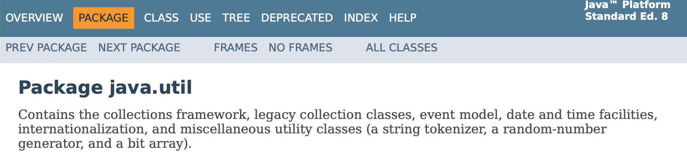
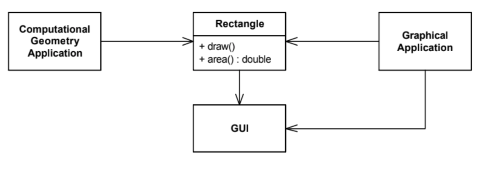
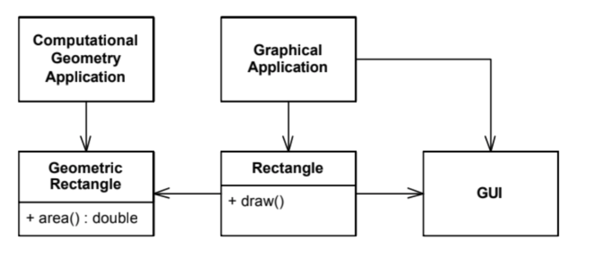
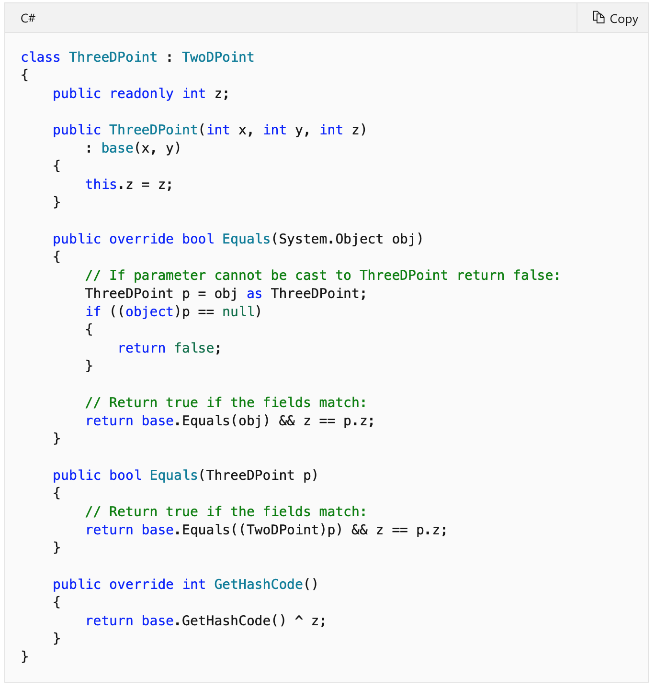

# Diseño de software SOLID #

## Razones para un buen diseño ##

Hemos aprendido en otras sesiones de la asignatura que una de las
características fundamentales del software es el cambio. Los clientes
no han sabido lo que quieren o no han sabido expresarlo. Nosotros
no hemos sabido entender sus necesidades, lo hemos ido aprendiendo
conforme hemos ido entregándoles versiones de la aplicación. Incluso
si la aplicación es perfecta y ha sido un éxito también cambiará,
porque todo el mundo querrá más cosas. El cambio es inevitable,
omnipresente, constante. El único momento en el que una aplicación no
cambia es cuando ha sido un fracaso y nadie la utiliza. 

### Reducir el acoplamiento###

Si nuestra aplicación está mal diseñada será muy difícil de
modificar. La razón principal es el excesivo acoplamiento. Muchas de las
técnicas, patrones, etc. de diseño de software tiene por objeto
reducir las dependencias en nuestro diseño, minimizando el
acoplamiento en nuestra aplicación.

Un ejemplo de un acoplamiento que implica un mal diseño es el siguiente código:

```java
// Clase Database que maneja operaciones de base de datos
public class Database {
    public void connect() {
        System.out.println("Conectado a la base de datos");
    }

    public void executeQuery(String query) {
        System.out.println("Ejecutando consulta: " + query);
    }
}

// Clase User que está altamente acoplada con Database
public class User {
    Database db;

    public User() {
        db = new Database();  // Alto acoplamiento aquí
        db.connect();
    }

    public void saveUser(String username) {
        db.executeQuery("INSERT INTO users VALUES ('" + username + "')");
    }
}

// Clase principal para probar el código
public class Main {
    public static void main(String[] args) {
        User user = new User();
        user.saveUser("JohnDoe");
    }
}
```

Aquí, User está altamente acoplado con Database. Este acoplamiento se evidencia en varios puntos:

- La clase `User` crea una nueva instancia de `Database`, lo que hace que esté
acoplada directamente con esa implementación específica de `Database`. 
- La clase `User` llama directamente a los métodos de `Database`, lo que
significa que cualquier cambio en la API de `Database` requerirá cambios en `User`. 

Este diseño hace que sea difícil probar la clase `User` de manera aislada o
reemplazar `Database` con otra implementación sin modificar `User`. 

Cuando tenemos elementos demasiado acoplados, los cambios nunca se
pueden hacer sólo en una parte del código. El cambio en un objeto
obliga a hacer un cambio en sus colaboradores, lo que a su vez obliga
a cambiar los suyos, y así sucesivamente. 

### Cohesión ###

Frente al acoplamiento, que es un síntoma de un mal diseño, se suele
decir que un término contrario es la cohesión, un síntoma de un buen
diseño.

Es difícil dar una definición exacta del término. Cuando un módulo
está fuertemente cohesionado, existen dependencias, pero siempre
interna al módulo. Todos sus elementos están conectados entre si de
una forma coherente. No hay nada relacionado con ese módulo que esté
fuera de él ni nada que esté dentro del módulo que no debiera
estar. 

Es similar a cuando hablamos de un razonamiento coherente. Es un
razonamiento que tiene todos los argumentos necesarios para
ser convincente y no tiene puntos débiles, ni elementos que desafinen.

> Cohesion is a measure of the strength of association of the elements
> inside a module.  A highly cohesive module is a collection of
> statements and data items that should be treated as a whole because
> they are so closely related. Any attempt to divide them up would
> only result in increased coupling and decreased readability.
> 
> Tom de Marco (1978) _Structured Analysis and System Specification_

Cuando tenemos que modificar un sistema con módulos fuertemente
cohesionados, los cambios se suelen producir en los elementos internos
de los módulos y no afectan a otros módulos. Al diseñar nuestras
clases deberíamos poner juntas características relacionadas, de forma
que cuando cambian lo hacen por la misma razón. Y deberíamos tratar de
separar características si van a cambiar por distintas razones.

### Síntomas de un mal diseño ###

En el artículo _Design Principles and Design Pattern_ de Robert
C. Martin se mencionan los siguientes síntomas del software mal
diseñado, en el que se ha acumulado deuda técnica y en el que es
problemático introducir cambios.

- **Rigidez**. Una aplicación es rígida cuando tiene demasiadas
  dependencias declaradas y es complicado introducir cambios sin tener
  que introducir otros adicionales en cascada. El compilador se queja
  y hay que reescribir mucho código después de un cambio para que
  compile correctamente.

- **Fragilidad**. Una aplicación es frágil cuando tiene demasiadas
  dependencias implícitas y los cambios introducidos no causan
  problemas en la compilación pero sí que producen bugs
  inesperados en ejecución. En muchas ocasiones es complicado rastrear
  el origen de los bugs y se acumulan cada vez más conforme se añaden
  nuevos cambios.
  
- **Inmovilidad**. Una aplicación es inmóvil cuando no se puede reusar
  su código fácilmente. Las clases no se han diseñado de forma
  suficientemente genérica y para cualquier nuevo cambio hay que
  añadir nuevas clases y nuevo código.

- **Viscosidad**. Es el término más complicado de entender. Martin no
  lo explica demasiado claramente. Supongo que tenía una intuición
  sobre un síntoma específico del mal diseño (distinto de los
  anteriores), pero no llegó a tener clara una definición concreta.
  
  Dice que siempre que se va a hacer un cambio en un diseño, es
  posible hacerlo utilizando buenas técnicas de diseño o haciendo alguna
  chapuza (_hack_). Un diseño tiene una viscosidad alta cuando los
  cambios correctos son más difíciles de aplicar que las
  chapuzas. Esto es una indicación de que el diseño original no era el
  correcto (era _viscoso_). El diseño viscoso promueve cambios
  chapuzas, mientras que un diseño correcto promueve cambios
  correctos.

Cuando el software se comporta de alguna de las maneras anteriores, el
equipo tiene cada vez menos confianza en introducir cambios y arreglar
cualquier cosa que no sea crítica. Se pierde también la capacidad de
realizar buenas estimaciones de tiempo de desarrollo de una
nueva funcionalidad, porque cada vez el desarrollo es más lento.

## SOLID ##

El acrónimo SOLID se refiere a 5 principios útiles para escribir
código orientado a objetos de forma que el resultado final sea un
programa fácilmente modificable. Los principios fueron introducidos
por Robert C. Martin alrededor del año 2000 en una serie de artículos
en los que explicaba cómo utilizar las características de la
Programación Orientada a Objetos para hacer código más fácil de
modificar. El artículo principal en el que enumeró estos principios
fue el ya mencionado _Design Principles and Design Patterns_.

Los principios son los siguientes:

- S: Single responsability
- O: Open-closed
- L: Liskov substitution
- I: Interface segregation
- D: Dependency inversion

Algunos de los principios son más generales y aplicables que otros,
que son más específicos y se aplican en menos ocasiones.

Vamos a enumerarlos y explicarlos a continuación.

### Single responsability ###

Un módulo o clase debe tener una única responsabilidad. Martin va más
allá y explica en qué consiste el concepto de responsabilidad
indicando que una clase debe tener cambiar por una única razón. Si
existen más de una posibilidad de cambio de una clase, ya no tiene una
única responsabilidad.

Martin utiliza los términos _responsabilidad_ y _razón de cambio_ como
sinónimos. Son términos bastante ambiguos, que dependen mucho del
nivel de abstracción que consideremos. Es más interesante relacionar
este principio con la idea de cohesión que comentamos al comienzo.

La palabra _única_ ha sido bastante criticada. ¿Y qué pasa si tenemos
dos o tres responsabilidades en una misma clase? ¿Está mal el diseño?
Como cualquier otro principio, hay que entenderlo de una forma
flexible. Si somos demasiados estrictos podemos terminar en el otro
extremo de la sobre-arquitectura.

Tal y como comenta Kevlin Henney en su charla [_Solid
Deconstruction_](), un ejemplo de diseño malo, que no sigue el
principio de responsabilidad única, es el típico _package_ o módulo de
_Util_, donde se incluye una miscelánea de clases variadas. Por
ejemplo, en Java.



Otro ejemplo menos extremo es el siguiente, que aparece en el libro de
Martin _Agile Principles, Patterns, and Practices in C#_.



En la imagen anterior se muestra una clase `Rectangle` que es usada
de dos maneras. Por un lado para realizar cálculos geométricos, en los
que es necesario calcular áreas, intersecciones, etc. Y por otro lado
para la parte gráfica, en la que se pintan figuras en pantalla y se
trabaja con la interfaz gráfica.

No es correcto incluir ambas responsabilidades en una misma clase. Es
mejor separarlas en dos clases tal y como muestra la siguiente figura.



Un ejemplo de buen uso de este principio es la filosofía de UNIX de
definir comandos que hacen una única cosa y que pueden ser fácilmente
combinados mediante tuberías.


### Open-closed ###

El principio _Open-closed_ lo estableció Bertran Meyer en su libro de
1988 _Object Oriented Software Construction_. Su descripción concreta
fue la siguiente:

- Se dice que un módulo está abierto si es posible extenderlo. Por
  ejemplo, debería ser posible añadir campos a las estructuras de datos
  que contiene o nuevos elementos al conjunto de funciones que realiza.

- Se dice que un módulo está cerrado si es posible usarlo desde otros
  módulos [de forma estable, sin que cambie en el futuro]. Esto supone
  que el módulo ha sido bien definido y tiene una interfaz estable [no
  va cambiar].

Meyer explica que estas dos condiciones son importantes para el
desarrollo estable y cambiable del software e indica que los lenguajes
de programación deberían establecer formas de implementarlas. También
explica que en los lenguajes orientados a objetos estas propiedades se
implementan usando la herencia:

> A class is closed, since it may be compiled, stored in a library,
> baselined, and used by client classes. But it is also open, since
> any new class may use it as parent, adding new features. When a
> descendant class is defined, there is no need to change the original
> or to disturb its clients.
>
> Bertrand Meyer (1988) _Object-oriented software construction_

La herencia permite cambiar el código de forma aditiva, sin eliminar
nada de lo anterior. Por ejemplo, el siguiente código define una clase
`Guitar`. Tiene todo lo que se necesita para hacer una banda, incluso
tiene un botón de volumen.

```java
public class Guitar {
 
    private String make;
    private String model;
    private int volume;
 
    //Constructors, getters & setters
}
```

La clase la ha implementado una empresa con la que estamos
colaborando. Nos bajamos la librería con la clase y la usamos en
nuestro código sin ningún problema. Sin embargo, algunas semanas
después nos damos cuenta de que necesitamos una guitarra más "rock and
roll" para una funcionalidad nueva que nos han pedido. Podemos aplicar
este principio y añadir la nueva funcionalidad extendiendo la clase
`Guitar`:

```java
public class SuperCoolGuitarWithFlames extends Guitar {
 
    private String flameColor;
 
    //constructor, getters + setters
}
```

Utilizando la herencia hemos podido "abrir" la clase y añadirle una
nueva funcionalidad sin tener que recompilarla ni modificarla. De esta
forma no ponemos en riesgo el código existente, que ya usa la clase,
porque la clase no se modifica.

La idea era muy interesante en los años 80. Hoy en día esta idea no es
tan revolucionaria. Todo el mundo se ha acostumbrado a usarla. Incluso
en la actualidad existe una tendencia contraria bastante crítica al uso de la
herencia por los posibles problemas que ésta puede causar en el código
ya existente. De hecho, hay lenguajes que proporcionan alternativas
para extender las clases ya existentes. Por ejemplo, en Swift tenemos
la posibilidad de usar
[`extension`](https://docs.swift.org/swift-book/LanguageGuide/Extensions.html)
y
[`protocols`](https://docs.swift.org/swift-book/LanguageGuide/Protocols.html)
para ampliar funcionalidades de clases ya existentes y para componer
mejor clases agregando distintos tipos de conducta sin usar la
herencia ni la herencia múltiple.

<table markdown="1">
<tr><td>

**Un ejemplo de mal uso de la herencia**

Clase padre:

```java
public class ListaSencilla {
    private List datos = new ArrayList();

    public void insertar(String elemento) {
        datos.add(elemento);
    }
 
    public void insertarVarios(Collection elementos) {
        for (String elemento : elementos)
            this.insertar(elemento);
    }
```

Queremos añadir una auditoría, de forma que cada vez que se añada un
objeto a la lista se informe a un objeto auditor. Lo hacemos con
herencia:

```java
public class ListaAuditable extends ListaSencilla {
    private Auditor auditor;
 
    public ListaAuditable(Auditor auditor) {
        super();
        this.auditor = auditor;
    }
 
    @Override
    public void insertar(String elemento) {
        super.insertar(elemento);
        this.auditor.elementoInsertado(elemento);
    }
 
    @Override
    public void insertarVarios(Collection elementos) {
        super.insertarVarios(elementos);
        for (String elemento : elementos)
            this.auditor.elementoInsertado(elemento);
    }
}
```

El código tiene un bug: cuando se inserta una colección de elementos
se notifican dos veces. La implementación del método `insertarVarios`
en la superclase llama internamente a `insertar`, que como está
sobreescrito en la clase hija también notifica al auditor. Pero
`insertarVarios` de la clase hija también notifica al auditor por su
cuenta, y de ahí la doble notificación al auditor.

Lo arreglamos de la siguiente forma:

```java
public class ListaAuditable extends ListaSencilla {
    private Auditor auditor;
 
    public ListaAuditable(Auditor auditor) {
        super();
        this.auditor = auditor;
    }
 
    @Override
    public void insertar(String elemento) {
        super.insertar(elemento);
        this.auditor.elementoInsertado(elemento);
    }
}
```

Probamos el método `insertarVarios` y parece que todo funciona
bien. Salvo que estamos cometiendo un error grave. En la clase
derivada estamos dependiendo de la implementación del método
`insertarVarios` de la clase base. Si en algún momento alguien cambia
esa implementación (sin cambiar su contrato) nuestro método en la
clase hija dejará de funcionar.

Por ejemplo:

```java
public class ListaSencilla implements Lista {
    private List datos = new ArrayList();
 
    @Override
    public void insertar(String elemento) {
        datos.add(elemento);
    }
 
    @Override
    public void insertarVarios(Collection elementos) {
        datos.addAll(elementos);
    }
 }
```

Ahora el método `insertarVarios` usa el método `addAll` para añadir
todos los elementos de la lista. El cambio parece bueno. Es sólo un
cambio de implementación y además se supone que será más
eficiente. Sin embargo, se han roto todas las clases hijas que habían
sobreescrito el método `insertar` y que se basaban en que
`insertarVarios` llamaba a `insertar`.

Ahora, para que vuelva a funcionar la clase hija tendremos que volver
a la implementación original (!):

```java
public class ListaAuditable extends ListaSencilla {
    private Auditor auditor;
 
    public ListaAuditable(Auditor auditor) {
        super();
        this.auditor = auditor;
    }
 
    @Override
    public void insertar(String elemento) {
        super.insertar(elemento);
        this.auditor.elementoInsertado(elemento);
    }
 
    @Override
    public void insertarVarios(Collection elementos) {
        super.insertarVarios(elementos);
        for (String elemento : elementos)
            this.auditor.elementoInsertado(elemento);
    }
}
```


Doble moraleja:

- Un método de la clase padre no debe basar su implementación en otro
  método que pueda ser sobreescrito por una clase hija. Si es así, hay
  que marcar el segundo método como `final` para evitar esa
  sobreescritura.
  
- Un método de una clase hija no debe basarse en detalles de
  implementación de la clase padre. La clase padre puede cambiar de
  implementación en cualquier momento.

</td></tr>
</table>


La idea de que una clase esté cerrada no es muy compatible
con la aceptación del cambio. De hecho, cuando hablemos de
_refactoring_ veremos que no hay problema en cambiar la implementación
de una clase si seguimos ciertas reglas. Por ejemplo, no hay problema
en cambiar el nombre de un método si tenemos acceso a todo el código
en el que se llama a ese método.

Podríamos combinar ambas ideas, la posibilidad de hacer
refactorización y la necesidad de que la clase está cerrada, si
reformulamos el principio diciendo que lo que debe ser cerrado es la
interfaz publicada de un módulo. Hablamos de interfaz "publicada" no
de interfaz "pública". Si una interfaz es pública pero no está
publicada, está en casa, y podremos cambiar todo el código que la
usa. En el momento que la hacemos pública es cuando perdemos la
posibilidad de refactorizarla.


### Liskov substitution ###

Este principio fue formulado por Barbara Liskov, al definir el
comportamiento de tipos y subtipos en teoría de Tipos Abstractos de
Datos. 

> A type hierarchy is composed of subtypes and supertypes. The
> intuitive idea of a subtype is one whose objects provide all the
> behavior of objects of another type (the supertype) plus something
> extra. 
>
> What is wanted here is something like the following substitution
> property: If for each object o1 of type S there is an object o2 of
> type T such that for all programs P defined in terms of T, the
> behavior of P is unchanged when we use o1 or o2, then S is a subtype
> of T.
>
> Barbara Liskov (1987) _Data Abstraction and Hierarchy_

Dicho de otra forma, para cumplir el principio de sustitución una
clase derivada de una base no debe modificar el comportamiento de la
clase padre. De esta forma, en cualquier programa en el que se use un
objeto de la clase base podrá usarse otro de la clase derivada.

El principio nos está indicando otra vez que tenemos que tener cuidado
a la hora de usar la herencia. Debemos cumplir siempre el criterio
"IS-A" a la hora de definir la clase derivada. Es el típico ejemplo de
los animales. Un `Gato` y un `Caballo` cumplen "IS-A" con `Mamífero`,
por lo que en cualquier parte en donde usemos un objeto mamífero
podremos usar un gato o un caballo.

Aunque parece muy evidente, es muy frecuente que esto se entienda mal.

A continuación vemos un ejemplo de mal uso de la herencia, que
incumple el principio de substitución de Liskov. Por desgracia este
tipo de mal uso es bastante frecuente. De hecho, la imagen está sacada
de la web de [documentación de
Microsoft](https://msdn.microsoft.com/es-es/msdn/en-us/library/ms173147)
en la página en la que se explica como comparar objetos en C#.



Otro error muy común es pensar en la especialización definida por una
subclase como una forma de restringir las posibles instancias de la
clase padre. Esto es incorrecto. 

Veamos el siguiente ejemplo, en el que definimos una clase base
`Rectangle` con un par de métodos para modificar su altura y anchura.


```java
public class Rectangle {
    double height;
    double width;

    public Rectangle(double height, double width) {
        this.height = height;
        this.width = width;
    }

    public void setHeight(double height) {
        this.height = height;
    }

    public void setWidth(double width) {
        this.width = width;
    }
}
```

Y ahora definimos una clase derivada `Square`. Como un cuadrado debe
tener el mismo alto que ancho, sobreescribimos los métodos que
modifican la altura y la anchura del rectángulo para que cuando se
modifique una de ellas se modifique la otra. Y añadimos el método
`setSide` propio de la clase `Square` que permite modificar el lado
del cuadrado.


```java
public class Square extends Rectangle {

    public Square(double side) {
        super(side, side);
    }

    @Override
    public void setWidth(double width) {
        super.setWidth(width);
        super.setHeight(width);
    }

    @Override
    public void setHeight(double height) {
        super.setHeight(height);
        super.setWidth(height);
    }

    public void setSide(double side) {
        this.setHeight(side);
    }
}
```

¿Cumple todo el código anterior la propiedad de sustitución?

La respuesta es NO. Un cuadrado NO ES un rectángulo. El cuadrado tiene
las mismas propiedades que el rectángulo. Pero la _conducta_ de un
cuadrado no es consistente con la conducta de un rectángulo. La
relación "IS-A" debe formularse en base a conductas, no en base sólo a
propiedades. En un rectángulo la base y la altura son independientes,
pero en un cuadrado no. Los métodos `setWidth` y `setHeight` pueden
ser llamados de forma independiente en el caso del rectángulo. Pero si
los sobreescribimos para que no sea posible en el caso del cuadrado
estamos incumpliendo la propiedad de substitución. Si en una parte del
programa estamos usando un rectángulo y sólo cambiamos su ancho,
llamando únicamente a `setWidth`, esperamos que la altura del
rectángulo no cambie. Sin embargo, si sustituimos el rectángulo por un
cuadrado, al cambiar el ancho también cambiará su altura. Estamos
cambiando el comportamiento.

Por último, se podría pensar que el principio es demasiado
estricto. De hecho, en muchos _frameworks_ se utiliza la herencia para
cambiar comportamientos definidos en las clases base. En la práctica
en muchos casos se incumple este principio, pero siempre haciéndolo
con cuidado. Por ejemplo, se puede definir en la clase base un método
con una conducta por defecto (o "vacía") que sea proporcionada por las
clases hijas. Esto se hace en muchos frameworks de interfaz de
usuario. 

Aunque cada vez más se está haciendo más popular el no usar la
herencia en los frameworks y en su lugar se están utilizando
interfaces o protocolos. Por ejemplo, en el caso de Swift, cada vez se
utiliza más la [programación orientada a
protocolos](https://developer.apple.com/videos/play/wwdc2015/408/) en
los frameworks y APIs que se están definiendo en la actualidad.

### Interface segregation ###

El principio _Interface segregation_ establece que ningún cliente
debería depender de métodos que no usa. El principio propone dividir
interfaces que sean muy grandes en otras más pequeñas y específicas,
de forma que los clientes sólo tengan que saber de los métodos que
sean de su interés. Estas interfaces especializadas se suelen
denominar [_Role
Interfaces_](https://martinfowler.com/bliki/RoleInterface.html). 

Usando el principio de segregación de interfaces conseguiremos
mantener el sistema desacoplado, con menos dependencias, y más fácil
de ser refactorizado, cambiado y redesplegado.

El principio te lleva a dividir las responsabilidades de un objeto
grande en varias responsabilidades más pequeñas y coherentes, cada una
relacionada con los distintos roles posibles con los que se interactúa
con el objeto.

En el fondo, esta idea es muy similar a la de responsabilidad única,
pero aplicada a interfaces, en lugar de a clases.

Por ejemplo, supongamos la siguiente interfaz:

```java
public interface LineIO {
   String read();
   void write(String lineToWrite); 
}
```

En general, pocos objetos van a leer y escribir al mismo tiempo. O
bien van a leer de un fichero o bien van a escribir en él. Podríamos
entonces dividir la interfaz en dos interfaces más específicas:

```java
public interface LineReader {
   String read();
}

public interface LineWriter {
    void write(String lineToWrite);
}
```

Esta idea de definir interfaces pequeñas específicas y componerlas en
las clases más complejas es otra de las características de la
programación basada en interfaces o protocolos que se utiliza
últimamente en lenguajes como Swift.

### Dependency inversion ###

Por último, el principio de la "inversión" de dependencias. Tiene un
nombre algo confuso. Se refiere a que invertir la forma de definir las
dependencias con respecto a como se hace cuando se hace mal. O sea que
hay que definir correctamente las dependencias. Una forma un poco rara
de darle un nombre a un principio.

Lo que el principio establece es que las abstracciones deben
de depender únicamente de otras abstracciones y no de implementaciones
concretas. Si hacemos que una abstracción dependa de una
implementación concreta estamos diseñando mal el sistema.

En concreto, el principio se suele definir con las siguientes dos
reglas:

1. Los módulos de alto nivel no deberían depender de módulos de bajo
   nivel. Ambos deben depender de abstracciones.
2. Las abstracciones no deberían depender de detalles. Los detalles
   deberían depender de las abstracciones.

Cuando diseñemos una interacción entre un módulo de alto nivel y otro
de bajo nivel, debemos definir otra abstracción de la que el módulo de
bajo nivel sea la implementación. Así la interacción del primer módulo
será con la abstracción del segundo. De esta forma podremos modificar
la implementación del segundo sin cambiar la representación abstracta
de la interacción.

Cuando hablamos de abstracciones en el marco de lenguajes de
programación nos estamos refiriendo a interfaces o protocolos. 

Un ejemplo de diseño incorrecto es el siguiente. La clase `Button`
podría ser mucho más abstracta y codificar el hecho de encender y
apagar algo mucho más abstracto. Al ligar la clase con una lámpara,
estamos perdiendo abstracción y no podemos usar ese botón nada más que
para encender y apagar lámparas. No podemos usarlo para encender y
apagar televisores o ventiladores o coches eléctricos o ...

```java
public class Lamp {

    public void switchOn() {
        // Encendemos la lámpara
    }

    public void switchOff() {
        // Apagamos la lámpara
    }
}

public class Button {

    private Lamp lamp;
    private Boolean on = false;

    public Button(Lamp lamp) {
        this.lamp = lamp;
    }

    public void turnOn() {
        if (!on) {
            on = true;
            lamp.switchOn();
        }
    }

    public void turnOff() {
        if (on) {
            on = false;
            lamp.switchOff();
        }
    }
}
```

Podemos aplicar el principio declarando una interfaz con los métodos
"encender" y "apagar". De esta forma se puede conectar el botón con
cualquier otro objeto que implemente esa interfaz. Lo vemos a
continuación:

```java
public interface Switchable {
    public void switchOn();
    public void switchOff();
}

public class Lamp implements Switchable {
    @Override
    public void switchOn() {
        // Encendemos la lámpara
    }

    @Override
    public void switchOff() {
        // Apagamos la lámpara
    }
}

public class TvSet implements Switchable {
    @Override
    public void switchOn() {
        // Encendemos la TV
    }

    @Override
    public void switchOff() {
        // Apagamos la TV
    }
}

public class Button {

    private Switchable device;
    private Boolean on = false;

    public Button(Switchable device) {
        this.device = device;
    }

    public void turnOn() {
        if (!on) {
            on = true;
            device.switchOn();
        }
    }

    public void turnOff() {
        if (on) {
            on = false;
            device.switchOff();
        }
    }
}

...

    public static void main(String[] args) {
        Lamp lamp = new Lamp();
        TvSet tv = new TvSet();
        Button lampButton = new Button(lamp);
        Button tvButton = new Button(tv);
        lampButton.turnOn();
        tvButton.turnOn();
    }

```


En el caso de lenguajes orientados a objetos, se está aplicando este
principio, por ejemplo, cuando se usa inyección de dependencias o
cuando se definen factorías.

Si aplicamos el principio al ejemplo que vimos al principio de todo
veremos que podemos eliminar la dependencia entre un _logger_ concreto
y la clase que queremos logear usando una inyección de dependencias
con la interfaz `ILogger`. Y podemos usar una factoría para poder
elegir un tipo de logger concreto (logger por salida estándar o a un
fichero).

```java
public interface ILogger {
    public void log(Level level, String message);
}

public class StandardLogger implements ILogger {
    public void log(Level level, String message) {
        // Implementación
    }
}

public class FileLogger implements ILogger {
    public void log(Level level, String message) {
        // Implementación
    }
}

public LoggerFactory {
    static public ILogger standardLogger() {
        return new StandardLogger();
    }
    static public ILooger fileLogger() {
        return new FileLogger();
    }
}

public class Foo {
    private ILogger logger;
    
    public Foo(ILogger logger) {
        this.logger = logger;
    }
    
    public void method() {
        logger.log(Level.WARNING, "Log message");
    }
}

...

    public static void main(String[] args) {
        Foo foo = new Foo(LoggerFactory.standardLogger());
        foo.method();
    }
        
```

Con este ejemplo no estamos diciendo que esta sea la forma correcta de
hacer logs en nuestra aplicación. Es sólo un sencillo ejemplo de uso
de inyección de dependencias y factorías. Las clases reales de logging
en Java funcionan [de forma
distinta](https://docs.oracle.com/en/java/javase/11/core/java-logging-overview.html#GUID-B83B652C-17EA-48D9-93D2-563AE1FF8EDA)
y se configuran usando las preferencias del entorno.

## Ejemplo de código ##

En el repositorio <https://github.com/domingogallardo/solid> podéis
encontrar un ejemplo de código en el que se han utilizado algunas de
las técnicas anteriores.

### Versión sin aplicar los principios SOLID ###

En la rama principal `main` está un ejemplo de evolución de un
sencillo programa con el que se pueden añadir posts a un blog. Se
añaden funcionalidades sencillas sin refactorizar el código para que
use los principios SOLID.

El primer commit es el siguiente:

```java
public class Blog {
    private String name;
    private ArrayList<String> posts = new ArrayList<>();
    private ArrayList<Date> dates = new ArrayList<>();
    private ArrayList<Integer> ids = new ArrayList<>();
    private static int id = 0;

    public Blog(String name) {
        this.name = name;
    }

    public int addPost(String text) {
        id++;
        posts.add(text);
        dates.add(new Date());
        ids.add(id);
        return id;
    }

    public void deletePost(int id) {
        for (int i = 0; i < ids.size(); i++) {
            if (ids.get(i).equals(id)) {
                ids.remove(i);
                posts.remove(i);
                dates.remove(i);
                break;
            }
        }
    }

    public String print() {
        String output;
        output = "Blog " + name + "\n";
        int i = 0;
        for (String post: posts) {
            output += post + "(" + dates.get(i) + ")";
            output += "\n";
            i++;
        }
        return output;
    }
}


public class Main {
    public static void main(String[] args) {
        Blog blog = new Blog("Mi blog");
        int post1 = blog.addPost("Mi primer post");
        int post2 = blog.addPost("Mi segundo post");
        int post3 = blog.addPost("Mi tercer post");
        blog.deletePost(post2);
        System.out.println(blog.print());
    }
}

/**********
Salida:

Blog Mi blog
Mi primer post(Tue Oct 06 17:30:33 CEST 2020)
Mi tercer post(Tue Oct 06 17:30:33 CEST 2020)
**********/
```

En el segundo commit se añade la posibilidad de añadir autores a los
posts:

```java
public class Blog {
    private String name;
    private ArrayList<String> posts = new ArrayList<>();
    private ArrayList<Date> dates = new ArrayList<>();
    private ArrayList<Integer> ids = new ArrayList<>();
    private ArrayList<String> authors = new ArrayList<>();
    private static int id = 0;

    public Blog(String name) {
        this.name = name;
    }

    public int addPost(String text, String author) {
        id++;
        posts.add(text);
        authors.add(author);
        dates.add(new Date());
        ids.add(id);
        return id;
    }

    public void deletePost(int id) {
        for (int i = 0; i < ids.size(); i++) {
            if (ids.get(i).equals(id)) {
                ids.remove(i);
                authors.remove(i);
                posts.remove(i);
                dates.remove(i);
                break;
            }
        }
    }

    public String print() {
        String output;
        output = "** " + name + " **\n";
        int i = 0;
        for (String post: posts) {
            output += authors.get(i) + " - ";
            output += post + " (" + dates.get(i) + ")";
            output += "\n";
            i++;
        }
        return output;
    }
}

public class Main {
    public static void main(String[] args) {
        Blog blog = new Blog("Un blog");
        int post1 = blog.addPost("El primer post", "Aitana M.");
        int post2 = blog.addPost("El segundo post", "Big Foot");
        int post3 = blog.addPost("El tercer post", "Pepa Pig");
        blog.deletePost(post2);
        System.out.println(blog.print());
    }
}

/**********
Salida:

** Un blog **
Aitana M. - El primer post (Tue Oct 06 17:32:57 CEST 2020)
Pepa Pig - El tercer post (Tue Oct 06 17:32:57 CEST 2020)
**********/
```


Y en un tercer commit la posibilidad de definir un tipo especial de
post que contiene una imagen. El texto del post debe comenzar con la
cadena `IMG` y se debe proporcionar la URL de la imagen entre
guiones. En la cadena de salida se procesa la URL y se devuelve entre
las etiquetas HTML `` y `</img>`.

```java
public class Blog {
    //
    // Sin cambios 
    //

    public String print() {
        String output;
        output = "** " + name + " **\n";
        int i = 0;
        for (String post: posts) {
            if (post.startsWith("IMG")) {
                String[] sentences = post.split("---");
                output += "" + sentences[1] + "</img>";
                output += authors.get(i) + " - ";
                output += sentences[2] + " (" + dates.get(i) + ")";
            } else {
                output += authors.get(i) + " - ";
                output += post + " (" + dates.get(i) + ")";
            }
            output += "\n";
            i++;
        }
        return output;
    }
}

public class Main {

    public static void main(String[] args) {
        Blog blog = new Blog("Un blog");
        int post1 = blog.addPost("El primer post", "Aitana M.");
        int post2 = blog.addPost("El segundo post", "Big Foot");
        int post3 = blog.addPost("IMG---http:mydomain.com/my-image.png---El tercer post",
                                "Pepa Pig");
        blog.deletePost(post2);
        System.out.println(blog.print());
    }
}

/**********
Salida:

** Un blog **
Aitana M. - El primer post (Tue Oct 06 17:38:45 CEST 2020)
http:mydomain.com/my-image.png</img>Pepa Pig - El tercer post (Tue Oct 06 17:38:45 CEST 2020)
**********/
```

### Código usando los principios SOLID ###

En la rama `solid` se encuentra la evolución del código usando los
principios SOLID. Comenzamos con el mismo código inicial.

Lo que hacemos en el segundo commit es usar la idea básica del diseño OO
de encapsular datos en clases. Definimos una clase `Post`, de forma
que separamos la responsabilidad de contener la información de cada
post de la clase `Blog`. Esto nos permite que la clase `Blog` gestione
únicamente objetos de tipo `Post` y guardar dentro de cada post su
información.

La clase `Blog` sigue gestionando el almacén de posts y proporcionando
identificadores únicos que se asignan a los posts.

```java
public class Post {
    private Integer id;
    private String text;
    private Date date;

    public Post(String text) {
        this.text = text;
        this.date = new Date();
    }

    public void setId(Integer id) {
        this.id = id;
    }

    public Integer getId() {
        return id;
    }

    public String print() {
        return text + " (" + date + ")";
    }
}

public class Blog {
    private String name;
    private ArrayList<Post> posts = new ArrayList<>();
    private static int id = 0;

    public Blog(String name) {
        this.name = name;
    }

    public int addPost(Post post) {
        id++;
        posts.add(post);
        post.setId(id);
        return id;
    }

    public void deletePost(int id) {
        for (int i = 0; i < posts.size(); i++) {
            if (posts.get(i).getId().equals(id)) {
                posts.remove(i);
                break;
            }
        }
    }

    public String print() {
        String output = "** " + name + " **\n";
        int i = 0;
        for (Post post: posts) {
            output += post.print();
            output += "\n";
            i++;
        }
        return output;
    }
}

public class Main {

    public static void main(String[] args) {
        Blog blog = new Blog("Un blog");
        int post1 = blog.addPost(new Post("El primer post"));
        int post2 = blog.addPost(new Post("El segundo post"));
        int post3 = blog.addPost(new Post("El tercer post"));
        blog.deletePost(post2);
        System.out.println(blog.print());
    }
}
```

En un tercer commit hacemos el cambio de añadir un autor a los
posts. En este caso sólo tenemos que modificar la clase `Post`:

```java
public class Post {
    private Integer id;
    private String text;
    private Date date;
    private String author;

    public Post(String text, String author) {
        this.text = text;
        this.date = new Date();
        this.author = author;
    }

    public void setId(Integer id) {
        this.id = id;
    }

    public Integer getId() {
        return id;
    }

    public String print() {
        return author + " - " + text + " (" + date + ")";
    }
}

public class Main {
    public static void main(String[] args) {
        Blog blog = new Blog("Un blog");
        int post1 = blog.addPost(new Post("El primer post", "Aitana M."));
        int post2 = blog.addPost(new Post("El segundo post", "Big Foot"));
        int post3 = blog.addPost(new Post("El tercer post", "Pepa Pig"));
        blog.deletePost(post2);
        System.out.println(blog.print());
    }
}
```

En el siguiente commit usamos el principio de inversión de
dependencia, haciendo que el `Blog` trabaje con objetos abstractos de
tipo `IPost` en lugar de con una implementación concreta. De esta
forma preparamos el código para usar el principio de sustitución de
Liskov, haciendo que la interfaz `IPost` sea la interfaz base de
la clase `Post` actual y de la futura clase `ImagePost` (post con una
imagen). 

```java
public interface IPost {
    public void setId(Integer id);
    public Integer getId();
    public String print();
}

public class Post implements IPost {
    // El resto igual
}

public class Blog {
    private String name;
    private ArrayList<IPost> posts = new ArrayList<>();
    private static int id = 0;

    public Blog(String name) {
        this.name = name;
    }

    public int addPost(IPost post) {
        id++;
        posts.add(post);
        post.setId(id);
        return id;
    }

    public void deletePost(int id) {
        for (int i = 0; i < posts.size(); i++) {
            if (posts.get(i).getId().equals(id)) {
                posts.remove(i);
                break;
            }
        }
    }

    public String print() {
        String output = "** " + name + " **\n";
        int i = 0;
        for (IPost post: posts) {
            output += post.print();
            output += "\n";
            i++;
        }
        return output;
    }
}
```

En el siguiente commit la definición de un post de tipo imagen es muy
sencilla. Sólo tenemos que definir otra clase que implemente la
interfaz `IPost`.

```java
public class ImagePost implements IPost {
    private Integer id;
    private String text;
    private Date date;
    private String author;
    private String img;

    public ImagePost(String text, String author, String img) {
        this.text = text;
        this.date = new Date();
        this.author = author;
        this.img = img;
    }

    public void setId(Integer id) {
        this.id = id;
    }

    public Integer getId() {
        return id;
    }

    public String print() {
        return "" + img + "</img> " + author + " - " + text + " (" + date + ")";
    }
}

// El resto del código igual, excepto el programa principal
// en el que tenemos que crear el post de tipo imagen

public class Main {
    public static void main(String[] args) {
        Blog blog = new Blog("Un blog");
        int post1 = blog.addPost(new Post("El primer post", "Aitana M."));
        int post2 = blog.addPost(new Post("El segundo post", "Big Foot"));
        int post3 = blog.addPost(new ImagePost("El tercer post", "Pepa Pig",
                "http://myhost.com/my-image.png"));
        blog.deletePost(post2);
        System.out.println(blog.print());
    }
}
```

Y en el último commit aplicamos el principio de segregación de
interfaces y separamos la interfaz `IPost` en dos. Una que gestione
los identificadores y otra que gestione el contenido la conversión de
un post a texto. El código resultante final es el siguiente.

```java
public interface Identity {
    public void setId(Integer id);
    public Integer getId();
}

public interface Printable {
    public String print();
}

public interface IPost extends Identity, Printable {}

public class Post implements IPost {
    private Integer id;
    private String text;
    private Date date;
    private String author;

    public Post(String text, String author) {
        this.text = text;
        this.date = new Date();
        this.author = author;
    }

    public void setId(Integer id) {
        this.id = id;
    }

    public Integer getId() {
        return id;
    }

    public String print() {
        return author + " - " + text + " (" + date + ")";
    }
}

public class ImagePost implements IPost {
    private Integer id;
    private String text;
    private Date date;
    private String author;
    private String img;

    public ImagePost(String text, String author, String img) {
        this.text = text;
        this.date = new Date();
        this.author = author;
        this.img = img;
    }

    public void setId(Integer id) {
        this.id = id;
    }

    public Integer getId() {
        return id;
    }

    public String print() {
        return "" + img + "</img> " + author + " - " + text + " (" + date + ")";
    }
}

public class Blog {
    private String name;
    private ArrayList<IPost> posts = new ArrayList<>();
    private static int id = 0;

    public Blog(String name) {
        this.name = name;
    }

    public int addPost(IPost post) {
        id++;
        posts.add(post);
        post.setId(id);
        return id;
    }

    public void deletePost(int id) {
        for (int i = 0; i < posts.size(); i++) {
            if (posts.get(i).getId().equals(id)) {
                posts.remove(i);
                break;
            }
        }
    }

    public String print() {
        String output = "** " + name + " **\n";
        int i = 0;
        for (IPost post: posts) {
            output += post.print();
            output += "\n";
            i++;
        }
        return output;
    }
}

public class Main {
    public static void main(String[] args) {
        Blog blog = new Blog("Un blog");
        int post1 = blog.addPost(new Post("El primer post", "Aitana M."));
        int post2 = blog.addPost(new Post("El segundo post", "Big Foot"));
        int post3 = blog.addPost(new ImagePost("El tercer post", "Pepa Pig",
                "http://myhost.com/my-image.png"));
        blog.deletePost(post2);
        System.out.println(blog.print());
    }
}
```

El código resultante podría refactorizarse aun más. Por ejemplo,
podríamos separar las responsabilidades de la clase `Blog` en dos
partes: la relacionada con el almacenamiento y creación de
identificadores y la relacionada con la iteración sobre el almacén
para obtener todos los posts. Os lo dejo como ejercicio.

## Referencias ##

- Robert C. Martin (2000) [_Design Principles and Design Patterns_](https://moodle2020-21.ua.es/moodle/pluginfile.php/144882/mod_resource/content/3/Robert%20C.%20Martin%20-%20Design%20Principles%20and%20Design%20Patterns.pdf)
- Robert C. Martin (2006) [_Agile Principles, Patterns, and Practices in C#_](https://learning.oreilly.com/library/view/agile-principles-patterns/0131857258/)
- Kevlin Henney (2016) [Charla: _Solid Deconstruction_](https://vimeo.com/157708450)
