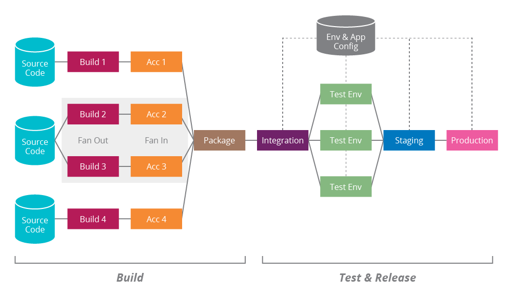
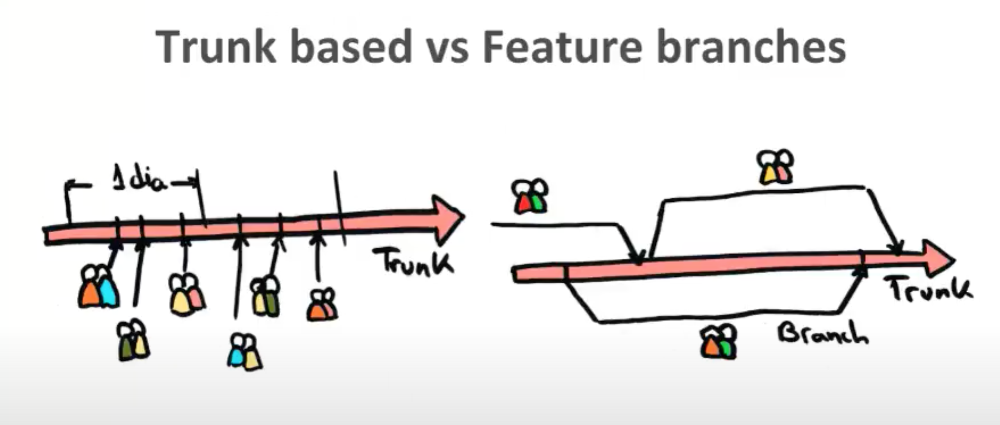
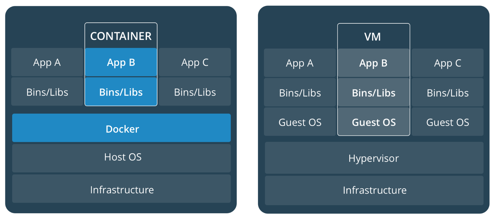

# Continuouos Delivery #

Una idea fundamental de las metodologías ágiles es entregar valor
frecuentemente para obtener una pronta retroalimentación del
cliente. Para ello es necesario tener muy engrasados los procesos de
despliegue y puesta en producción del software. 

Una de las formas que ya hemos visto que facilita la optimización de
la puesta en producción de software es la práctica de XP de
_Integración continua_ (_Continuous Integration_). En esta práctica
los miembros del equipo integran sus commits diariamente en el
proyecto y en cada integración se lanzan tests automatizados que
verifican que los cambios no introducen errores.

Además de esta práctica, debemos tener también automatizados todos los
procesos de compilación (_build_) y despliegue (_deployment_) de la
aplicación en los distintos entornos de prueba. Esto es lo que se
denomina _Despliegue continuo_ (_Continuous Deployment_). En esta
línea, se han popularizado herramientas como _Docker_ o _Kubernetes_
que facilitan el despliegue del software y su automatización y cada
vez se demandan más profesionales (denominados _DevOps_) con capacidad
de gestionar estos despliegues automatizados.

Y en los últimos años se ha dado un paso más allá y se ha comenzado a
hablar de _Entrega continua_ (_Continous Delivery_ en inglés) con la
idea de promover software que esté listo en cualquier momento para
salir a producción.

En este tema veremos todos estos conceptos, con la idea de tomar un
primer contacto con todos ellos. Necesitaríamos un curso (o más) para
verlos en profundidad. Intentaremos al menos conocer los conceptos
básicos para poder seguir profundizando en alguno de ellos en el
futuro.

## El problema de la puesta en producción ##

En las empresas tradicionales no ágiles el proceso de subir a
producción una nueva versión es un proceso muy complicado y
estresante. Se hace pocas veces, cuatro o cinco veces al año, durante
el fin de semana cuando todos los servicios están parados.

El proceso de genera muchos trastornos y dolores de cabeza. El equipo
de operaciones tiene que estar pendiente del móvil para detectar
posibles problemas y caídas del sistema. Una vez puesto el software en
producción el equipo de desarrollo se dedicará continuamente a
corregir bugs y solucionar problemas detectados por los usuarios.

Esto no es ágil. Esto no permite conseguir lo que hemos comentado
muchas veces de un ciclo corto de retroalimentación para que el
cliente pueda probar rápidamente las nuevas características y se pueda
comprobar su valor. Recordemos que en ambientes inciertos y no
predecibles es fundamental poder validar con el cliente las nuevas
funcionalidades introducidas, para adaptarse y corregir posibles
errores.

La realización de entregas frecuentes también permite minimizar el
riesgo. Todo el tiempo que estamos desarrollando algo sin ponerlo en
producción es un riesgo acumulado. Hasta que no está en producción y
ha sido aceptado por el cliente no sabemos si lo que estamos
desarrollando va a ser validado o no. Cuanto menos tardemos en
validarlo, menor será el riesgo.

La siguiente figura está sacada de la charla de Eduardo Ferro
([@eferro](https://twitter.com/eferro)) [Continuous Delivery:
Germinando una cultura ágil
moderna](https://youtu.be/hbggtXmQcf8?t=444). 


En la figura de la izquierda se entrega mucho valor de golpe y el
riesgo que se ha ido acumulando es mucho mayor que en la figura de la
derecha, en la que se entregan pequeños incrementos de valor que
nos permiten tener una retroalimentación más rápida y adaptar mucho
mejor el producto a las necesidades de los clientes.


El proceso de puesta en producción del software depende mucho del tipo
de software. En un extremo, por ejemplo, una página web se puede
cambiar modificando directamente el fichero HTML en la propia máquina
en la que se está ejecutando el servidor web. No hace falta ni
recompilar, ni reiniciar el servidor. En el otro extremo, un software
de control de una placa de un satelite espacial puede estar embebido
en el propio firmware de la placa y para realizar un cambio puede ser
necesario hasta volver a grabar y producir la placa.

En general, la mayoría de sistemas software se encuentran entre ambos
extremos. Es importante analizar con detalle cuál es el proceso de
despliegue de nuestro software, cuánto tarda en subir a producción un
cambio de una línea de código y cuáles son los cuellos de botella en
el proceso.


La denominada _ultima milla_ consiste en los pasos necesarios para la
puesta en producción de nuestro sistema. De nada nos sirve tener un
equipo ágil que hace iteraciones y reuniones con el cliente si después
tenemos un equipo de QA (_Quality Assurance_) con un 90% de pruebas
manuales y otro de operaciones que tiene que configurar manualmente
cualquier nuevo despliegue a producción y al que le cuesta dos días
revertir un despliegue fallido.

Debemos analizar cuál es nuestro proceso de release y hacer lo posible
por mejorarlo. Encontrar los cuellos de botella, reducir los tiempos,
automatizar todo lo que podamos. De forma que pasemos de un release
por trimestre a un release mensual. Y después a un release cada dos
semanas. Y después a un release semanal. Y después a un posible
release con cada posible cada cambio. Al final, como dice Eduardo
Ferro en la charla mencionada anteriormente, el tiempo de subir un
commit a producción debe ser de menos de 15 minutos y debemos de poder
automatizar el proceso de puesta en producción hasta el extremo que lo
podamos hacer a discreción, cuando queramos, únicamente pulsando un
botón.

Un elemento central de todo el proceso de despliegue es la
configuración de una tubería de despliegue lo más automatizada
posible.



La tubería representa todos los pasos necesarios que llevan el código
fuente hasta producción. Lo veremos en detalle más adelante, pero es
interesante adelantarla aquí. En la imagen se puede ver:

- **Compilación** de todas las dependencias en binarios. En el caso de una
  aplicación Java (como Spring Boot) podríamos tener dependencias
  externas (que no haría falta compilar, sólo descargarse) y
  dependencias de librerías internas que sí que estamos modificando y
  que deberíamos recompilar.
- **Empaquetamiento**, construcción de un único binario a partir de todos
  los binarios existentes. En el caso de una aplicación Java, la fase
  de package (por ejemplo, realizada con Maven) generaría un fichero
  WAR que podríamos distribuir. También, si utilizamos Docker, en esta
  fase generaremos una máquina Docker que podremos distribuir.
- **Despliegue** en distintos
  [entornos](https://en.wikipedia.org/wiki/Deployment_environment) de
  prueba y lanzamiento de pruebas en los distintos entornos. Cada
  entorno tiene su propia configuración, definida por variables de
  entorno o parámetros de los comandos de puesta en marcha.
- Despliegue en entorno de **_staging_** (réplica muy similar al entorno de
  producción).
- Despliegue en entorno de **producción**.

En el enfoque de entrega continua el proceso anterior está
completamente automatizado y la puesta en producción se puede modular
y realizar en el momento que nos interese pulsando únicamente un botón
en cualquier momento. 

Recordemos que la forma más tradicional de enfrentar el problema del
lanzamiento es separar una rama de release de la rama de desarrollo.


Por ejemplo, en la imagen anterior se muestra la rama de release que
se define en el flujo de trabajo GitFlow que hemos visto en el tema
pasado. 

Al separar la rama de release podemos seguir introduciendo cambios en
la rama de desarrollo sin afectar para nada al release. En la rama de
release se realiza toda la tubería de despliegue y se prueba en todos
los entornos. Se introducen correcciones de pequeños bugs encontrados
y se también se puede incluir algún commit escogido de la rama de
desarrollo haciendo un `cherry-pick`. Finalmente, la última versión
comprobada se pasa a producción y mezcla con la rama de releases y con
la de desarrollo (en GitFlow).

En el enfoque de lanzamiento continuo no existen ramas de release,
sino que en cualquier commit de la rama principal es candidato a ser
puesto en producción. 


## Integración continua ##

La Integración continua es una práctica en la que los miembros del
equipo integran su trabajo frecuentemente en el proyecto. Se trata de
una práctica de XP en la que se recomienda que cada miembro integre
sus cambios diariamente. Esto lleva a múltiples integraciones cada
día. Cada integración es verificada por una compilación automática
(_automated build_) en la que se lanzan todos los tests y se detectan
errores lo más rápidamente posible.

Esta práctica obliga a que todos los cambios realizados por los
desarrolladores sean puestos en común continuamente, lo que promueve
la compartición de conocimiento entre todos los miembros del
equipo. Cuando una persona va a integrar sus cambios primero debe
comprobar que éstos son compatibles con los cambios que ha habido en
el proyecto. Como se integra diariamente, éstos no serán demasiados y
si hay algún error será fácil de solucionar.

Sin embargo, si se desarrolla una versión separada que tarda mucho en
integrarse será muy posible que cuando se realice la integración
surjan muchos problemas de más difícil solución.

### Trunk based vs. feature branches ###

Uno de los debates frecuentes relacionados con los flujos de trabajo
de Git es si es más conveniente un flujo de trabajo _trunk based_
(basado en la rama principal) o uno con _feature branches_ (ramas de
características).



La imagen anterior está también sacada de la charla de Eduardo
Ferro. En ella se muestran los dos flujos de trabajo y se muestran
parejas de desarrolladores porque están aplicando también _pair
programming_.

En el **flujo de desarrollo _trunk based_** todos los desarrolladores
publican sus commits continuamente (al menos una vez al día) sobre la
rama principal del proyecto. Esto obliga a mantenerse continuamente al
día sobre los cambios que otros están introduciendo y a tener cuidado
de que nuestros cambios vayan en la misma dirección.

El desarrollador actualiza su repositorio local y comienza a programar
un pequeño incremento (código y tests). Cuando termina lanza todos los
tests para asegurarse de que no se ha roto nada. Antes de publicar los
cambios, vuelve a actualizar el repositorio local con los nuevos
cambios que se han añadido a la rama principal y vuelve a lanzar los
tests. Si todo funciona bien, publica los cambios en el repositorio
compartido.

Entre las ventajas de esta técnica se encuentran:

- La integración de un nuevo commit es fácil porque la rama principal
  ha cambiado poco desde el commit anterior que integramos. No ha
  habido demasiado tiempo para que el proyecto diverja mucho.
- La transparencia en los cambios hace que se detecten antes los
  error
- El conocimiento del equipo evoluciona conjuntamente. Todo el mundo
  tiene información actualizada a diario de los cambios que se van
  introduciendo en el proyecto.
- Obliga a dividir los cambios grandes en cambios pequeños que se van
  integrando poco a poco. Esto obliga a hacer un mayor esfuerzo de
  diseño y utilizar mejores arquitecturas de software.

Entre los inconvenientes podemos destacar:

- Interrupciones más frecuentes en el flujo de trabajo del equipo
  debido a problemas introducidos por malos commits.
- No se pueden hacer pull requests en los que se haga una revisión de
  código.
- Necesidad más frecuente de _reverts_ que corrigen equivocaciones.
- Obliga al equipo a una gran disciplina y a una gran madurez. No se
  deben buscar culpables por los errores introducidos. Los errores
  nos hacen aprender.

El **flujo de desarrollo de ramas de características** es el que estamos
realizando en prácticas. Se basa en separar ramas de características
de la rama principal. En cada rama de característica se desarrolla una
característica y se integra en la rama principal cuando esté
terminada. Esta integración se puede hacer usando un pull request.

Ventajas:

- Se integran en la rama principal cambios completos.
- Durante el desarrollo de la característica puedes aislarte del resto
  del desarrollo del proyecto y centrarte únicamente en la
  característica que estás desarrollando.
- Los fallos son locales a la rama. Un fallo no afecta al resto del
  equipo. Puedes tomarte un tiempo en arreglar el fallo sin que el
  resto del equipo se quede bloqueado.
- Posibilidad de usar pull requests y realizar revisiones de código.

Inconvenientes:

- Si las ramas tienen una duración muy larga el proyecto puede haberse
  modificado mucho cuando vayamos a hacer la integración, haciéndola
  bastante complicada.
- El conocimiento compartido sobre el código del proyecto es mucho
  menor y se limita a los posibles conflictos que podemos tener en la
  rama que hemos desarrollado.
- El primero que integra su rama no tiene problemas, los problemas los
  tienen las siguientes integraciones. Esto crea un efecto perverso en
  el que intentamos ser los primeros posiblemente a costa de menos
  calidad en el código.

Posiblemente, la mejor opción sea comenzar con ramas de
características e ir haciéndolas cada vez más cortas, de forma que se
integren cada dos o tres días como máximo. Al igual que en el enfoque
de _trunk based_ podrían no ser características completas, sino
pequeños incremento. Por ejemplo, como hacemos en prácticas, una rama
podría contener la parte de backend de la característica y después
haríamos la de frontend. Y cuando el equipo se acostumbre a hacer ramas
cada vez más pequeñas, podríamos plantearnos la opción de pasar a un
modelo basado en trunk.

### Herramientas de integración continua ###

Una de las características fundamentales de la integración continua es
que cada vez que se integra un commit en la rama principal se debe
realizar una construcción automática del proyecto, lanzándose todos
los tests en el entorno de integración continua y construyéndose el
binario candidato a desplegar en producción.

La forma de realizar esto es mediante las denominadas herramientas de
integración continua.


Podemos elegir como herramientas de integración continua una
herramienta que instalamos en nuestros propios servidores de
integración (_CI server_) o construcción continua (_continuous build
server_) como [Jenkins](https://www.jenkins.io) o también en un
servicio en la nube como [GitHub
Actions](https://github.com/features/actions).

Cualquiera de estas herramientas permiten automatizar el lanzamiento
de tests y la compilación automática de la aplicación y la generación
de una aplicación distribuible. Esta aplicación puede ser un binario,
un JAR o WAR, una máquina Docker, etc. que puede ser desplegada en
distintos entornos, incluido el de producción.


El servicio de integración continua genera también notificaciones
automáticas a todos los miembros del equipo indicando el estado de la
compilación. También suele proporcionar un panel de control con la
indicación del estado de cada build.


### Generación del ejecutable ###

El resultado de la compilación automática realizada por el servidor de
integración continua debe ser un artefacto desplegable en los
distintos entornos en los que vamos a probar la aplicación. La
aplicación sólo se debe compilar una única vez y el resultado debe
almacenarse en un sitio accesible por cualquier proceso y miembro del
equipo.

Es fundamental que las herramientas usadas para construir la
aplicación puedan ser usadas desde línea de comando. De esta forma es
mucho más sencillo adaptar y configurar distintos tipos de scripts de
compilación (_build scripts_). Entre las herramientas más usadas
destacamos las siguientes:

- Make (C, Unix)
- Rake (Ruby) 
- Maven (Java)
- Gradle (Java, Scala, etc.)
- sbt (Scala, Play Framework)

Nosotros en las prácticas estamos usando Maven, al ser Spring Boot una
aplicación Java.

Igual que hay distintas herramientas de compilación para los
diferentes lenguajes de programación, existen diferentes formatos en
los que se guardan los artefactos binarios resultantes de la
compilación.  Por ejemplo, el binario resultante de una aplicación C es
un fichero compilado que se ejecutará en el sistema operativo para el
que haya sido compilada la aplicación, mientras que el resultante de
una aplicación Java es un fichero JAR que podremos desplegar en
cualquier máquina en la que tengamos instalado un JRE (_Java Runtime
Environment_).

Además tenemos el problema añadido de generación de distintos binarios
para diferentes sistemas operativos. Por ejemplo, si estamos
desarrollando una aplicación de escritorio que va a funcionar en
Windows, Linux y Mac deberemos generar los binarios correspondientes a
esas distintas plataformas y después testearlos de forma automática en
distintos ordenadores cada uno con su sistema operativo
específico.

En el caso concreto de Spring Boot, que estamos utilizando en
prácticas, el resultado de la compilación es un fichero JAR que puede
ser desplegado en múltiples entornos. La guía de Spring Boot
[_Deploying Spring Boot
Applications_](https://docs.spring.io/spring-boot/docs/current/reference/html/deployment.html#deployment)
proporciona detalles de cómo es posible desplegar el JAR resultante de
compilar la aplicación Spring Boot en un servidor o en múltiples
servicios en la nube como AWS, Heroku o Google Cloud.

En la actualidad se está haciendo cada vez más popular la utilización
de imágenes [Docker](https://www.docker.com) como artefacto binario a
distribuir y ejecutar.  Entre las ventajas de este enfoque se
encuentran el ser multiplaforma (para ejecutarlas basta con tener
instalado el _Docker Engine_) y que los contenedores (servicios en
ejecución) se pueden configurar y combinar o ejecutar en clusters
usando herramientas como [Kubernetes](https://kubernetes.io). Más
adelante veremos el funcionamiento de Docker con un poco más de
detalle y veremos cómo convertir una aplicación Spring Boot en una
imagen Docker.

Es una buena práctica darle a cada artefacto binario compilado un
nombre distinto en el que aparezca el número de versión. En el caso de
la integración continua, normalmente se le da al binario un nombre en
el que aparece la fecha e incluso la hora de la compilación. De esta
forma, las distintas compilaciones pueden ser identificadas de forma
única. 


Por ejemplo, la imagen anterior muestra el nombre de una compilación
reciente de Swift. Se trata de la versión `5.3-DEVELOPMENT-SNAPSHOT`
compilada el 11 de noviembre de 2020 para un sistema operativo `Centos8`.

En el caso en que nuestra aplicación dependa de paquetes externos es
conveniente descargarlos y almacenarlos en un sitio centralizado de
forma que no tengan que descargarse de Internet cada vez que se
realiza una nueva compilación. Para ello es conveniente configurar
correctamente las cachés del sistema de build que estemos utilizando.

La aplicación desplegable debe consistir en un único artefacto con el
nombre correcto que contenga todo lo necesario para ejecutarse en
distintos entornos de prueba y pueda ser puesto en producción. El
artefacto debe almacenarse en un lugar centralizado, accesible desde
los distintos entornos de forma automática. Por ejemplo, podemos usar
un servidor web local y dejar el fichero en una URL concreta.

### Principios y prácticas de integración continua ###

A continuación presentamos en forma de ítems un resumen de los
elementos importantes de la integración continua que hemos visto hasta
ahora.

- Desarrollo de código
    - El sistema debe siempre poder ser construido (build) y probado
    con éxito. 
    - Todo el mundo hace merge de los cambios con frecuencia.
    - Después de cada commit, el sistema se integra inmediata y automáticamente.
    - Se desarrolla el sistema en pequeños incrementos.
- Testing
    - Los desarrolladores prueban su código en sus espacios de trabajo
    privados. 
    - Después mezclan los cambios en el repositorio.
- Servidor de integración continua (CI server):
    - Monitoriza el repositorio y comprueba los cambios cuando
    ocurren.
    - Construye el sistema y ejecuta las pruebas unitarias y de
    integración.
    - Informa al equipo de la construcción con éxito o de los fallos.
- Errores en los build
    - El equipo arregla el problema lo antes posible.
    - Continuar para integrar y probar continuamente durante todo el
      proyecto. 
- El último ejecutable compilado debe estar fácilmente disponible
    - El resultado de la compilación debe ser un artefacto ejecutable
      disponible para desplegar en distintos entornos, incluso en
      producción.
      
### Docker ###


Docker proporciona una plataforma basada en contenedores
(_containers_) que permite construir una única vez un artefacto
ejectuable (imagen Docker) y distribuirlo y ejecutarlo en distintos
entornos (Linux, Mac, Windows) que tengan instalados el _Docker
engine_. 

La [documentación de Docker](https://docs.docker.com) es muy
buena y recomendamos usarla para conocer en profundidad la
herramienta. Podéis empezar por las siguientes páginas:

- [Docker Overview](https://docs.docker.com/get-started/overview/)
- [Get Started with Docker](https://docs.docker.com/get-started/)

#### Imágenes y contenedores ####


Para construir una imagen Docker lo único que hace falta es un fichero
denominado `Dockerfile` en el que se proporcionan una serie de pasos
de construcción. Veremos más adelante un ejemplo. El artefacto
construido se denomina _imagen Docker_ y se puede publicar en el
servicio de Docker [dockerHub](https://hub.docker.com) o en un
servidor local.

Una vez construida la imagen, podemos ejecutarla, poniendo en marcha
un contenedor. Desde el motor Docker, usando comandos, podemos poner
en marcha un contenedor, suspenderlo, configurar volúmenes de datos
con los que se conecta y, en general, realizar operaciones similares a
las que realizaríamos con un servicio propio del sistema
operativo. Pero con la ventaja de que el contenedor está totalmente
separado del sistema operativo anfitrión y su ejecución no puede
modificar nada del mismo.



Un contenedor es similar a una máquina virtual, pero usando los
recursos (servicios de bajo nivel, procesador, etc.) del propio
sistema operativo. Al no tener que usar la virtualización, la
tecnología de contenedores es muy eficiente. Los contenedores son
mucho más ligeros que las máquinas virtuales. Se pueden poner en
marcha y suspender en segundos y ocupan mucha menos memoria en
ejecución.

Otra de las ventajas de Docker es que en un mismo anfitrión se pueden
poner en marcha y conectar distintos contenedores entre si, usando
herramientas como
[docker-compose](https://docs.docker.com/compose/). Incluso podemos
desplegar y gestionar los contenedores en entornos de clustering
usando herramientas como [Kubernetes](https://kubernetes.io).

#### Fichero Dockerfile ####

El fichero `Dockerfile` es el fichero de instrucciones en el que se
especifica cómo construir una imagen Docker.

Por ejemplo, veamos la imagen `docker/whalesay`, que ejecuta un
comando que muestra en la salida estándar un dibujo (hecho con ASCII)
de una ballena (icono de Docker) diciendo un mensaje que pasamos por
línea de comando.

El siguiente código muestra cómo lanzar la imagen y qué aparece en la consola.

```
$ docker run docker/whalesay cowsay Hello world
 _____________ 
< Hello world >
 ------------- 
    \
     \
      \     
                    ##        .            
              ## ## ##       ==            
           ## ## ## ##      ===            
       /""""""""""""""""___/ ===        
  ~~~ {~~ ~~~~ ~~~ ~~~~ ~~ ~ /  ===- ~~~   
       \______ o          __/            
        \    \        __/             
          \____\______/   
```

El fichero `Dockerfile` de esta imagen es el siguiente:

```Dockerfile
FROM ubuntu:14.04

# install cowsay, and move the "default.cow" out of 
# the way so we can overwrite it with “docker.cow"

RUN apt-get update && apt-get install -y cowsay \
    —no-install-recommends && rm -rf /var/lib/apt/lists/* \
    && mv /usr/share/cowsay/cows/default.cow \
    /usr/share/cowsay/cows/orig-default.cow

# "cowsay" installs to /usr/games
ENV PATH $PATH:/usr/games

COPY docker.cow /usr/share/cowsay/cows/
RUN ln -sv /usr/share/cowsay/cows/docker.cow \
    /usr/share/cowsay/cows/default.cow

CMD ["cowsay"]
```

El primer comando `FROM` indica cuál es la imagen base que se va a
utilizar para construir la nueva imagen.

Los siguientes comandos se ejecutan sobre la imagen base, instalando
el comando de Linux `cowsay` y modificando el fichero por defecto,
para que en lugar de pintar una vaca pinte una ballena (el fichero
`docker.cow`, que debe estar en el ordenador en el que se construye la
imagen y se copia en la imagen con el comando `COPY`).

El último comando `CMD` indica cuál es el comando por defecto que se
va ejecutar al lanzar el contenedor.

#### Construcción, publicación y ejecución de imágenes ####

Para construir una imagen basta con usar el comando `docker build`:

```
$ docker build -t domingogallardo/prueba .
```

En el comando se define el nombre de la imagen
(`domingogallardo/prueba`) y el directorio local en el que se va
almacenar la imagen (el directorio actual).

En el directorio actual debe existir un fichero `Dockerfile` que
indica los pasos a seguir para construir la imagen y los ficheros
auxiliares que necesitemos para esa construcción.

Las imágenes se pueden almacenar, compartir y gestionar en un registro
y son el componente de distribución de Docker.  Docker mantiene un
servicio de registro de imágenes en <https://hub.docker.com>. Es el
repositorio del que nos descargamos las imágenes cuando ejecutamos un
comando `docker run`.

Para ejecutar una imagen debemos usar el comando `docker run` seguido
de la imagen que queremos lanzar. Docker busca esa imagen en local y,
si no la encuentra, se la baja del repositorio. Y después crea un
lanza la imagen en forma de contenedor.

#### Demostración de Docker ####

Una vez instalado Docker en nuestro sistema comprobamos su versión:

```
$ docker version
```

Comprobamos las imágenes que hay descargadas en nuestra máquina:

```
$ docker image ls
```

Ejecutamos una imagen:

```
$ docker run docker/whalesay cowsay Hello world
```

Para generar el mensaje se producen los siguientes pasos:

1. El cliente Docker contacta el demonio Docker que se está ejecutando
   en la máquina host.
2. El demonio comprueba si tenemos la imagen `docker/whalesay` y si no se
   la descarga del [_Docker Hub_](https://hub.docker.com/r/docker/whalesay/).
3. El demonio crea un nuevo contenedor a partir de la imagen y ejecuta
   el comando `cowsay Hello world` en ese contenedor.
4. La salida del comando aparece en la terminal. El contenedor termina
   su ejecución, pero sigue estando en el sistema (parado).

Para ver los contenedores en ejecución:

```
$ docker container ls
```

Y todos los contenedores (incluyendo los parados):

```
$ docker container ls -a
```

Podemos ejecutar un contenedor basado en una imagen Linux Alpine
(Alpine es una distribución Linux muy ligera):

```
$ docker run alpine /bin/echo 'Hello world'
```

Una vez lanzado el comando `/bin/echo` el contenedor se queda parado:

```
$ docker container ls -a
CONTAINER ID        IMAGE               COMMAND                  CREATED             STATUS                     PORTS                               NAMES
ecf8be2a3ead        alpine              "/bin/echo 'Hello wo…"   8 seconds ago       Exited (0) 7 seconds ago                                       agitated_bhaskara
```

Se puede borrar:

```
$ docker container rm ecf8be2a3ead
```

También se puede lanzar un contenedor de forma interactiva, con el
flag `-it`. El flag `--rm` borra el contenedor cuando se para.

```
$ docker run --rm -it alpine /bin/sh
```

También como un demonio, que está en ejecución hasta que lo paramos:

```
$ docker run --rm -d alpine /bin/sh -c "while true; do echo hello world; sleep 1; done"

1e5535038e285177d5214659a068137486f96ee5c2e85a4ac52dc83f2ebe4147

$ docker ps
CONTAINER ID  IMAGE         COMMAND               CREATED        STATUS       PORTS    NAMES
1e5535038e28  alpine        /bin/sh -c 'while tr  2 minutes ago  Up 1 minute           insane_babbage

$ docker logs insane_babbage

hello world
hello world
hello world
...

$ docker stop insane_babbage
$ docker container ls -a

CONTAINER ID  IMAGE         COMMAND               CREATED        STATUS       PORTS NAMES
```


Vamos ahora a **construir una imagen propia**.

Creamos un directorio:

```
$ mkdir midocker
$ cd midocker
```

Editamos el fichero `Dockerfile`

```
FROM docker/whalesay:latest
RUN apt-get install -y fortunes
CMD /usr/games/fortune -a | cowsay
```

Llamamos a `docker build` para construir la nueva imagen y le damos el nombre `docker-whale`:

```
$ docker build -t docker-whale .
```

Comprobamos que se ha añadido al repositorio local de imágenes:

```
$ docker image ls
REPOSITORY          TAG                 IMAGE ID            CREATED             SIZE
docker-whale        latest              244786599109        13 seconds ago      275 MB
ubuntu              latest              42118e3df429        3 months ago        124.8 MB
python              2.7                 b5c7fb15c9cb        3 months ago        691.6 MB
hello-world         latest              c54a2cc56cbb        4 months ago        1.848 kB
docker/whalesay     latest              6b362a9f73eb        17 months ago       247 MB
```

Y ya podemos ejecutar el contenedor:

```
$ docker run --rm docker-whale
 ________________________________________ 
/ The farther you go, the less you know. \
|                                        |
\ -- Lao Tsu, "Tao Te Ching"             /
 ---------------------------------------- 
    \
     \
      \     
                    ##        .            
              ## ## ##       ==            
           ## ## ## ##      ===            
       /""""""""""""""""___/ ===        
  ~~~ {~~ ~~~~ ~~~ ~~~~ ~~ ~ /  ===- ~~~   
       \______ o          __/            
        \    \        __/             
          \____\______/   
```


Es posible también montar en el contenedor un directorio del host. 

Vamos, por ejemplo, a **poner en marcha un servidor web** y usar un
directorio del host como directorio del sitio web.


Creamos un directorio `webserver` y creamos dentro un fichero `default`:

```
server {
    root /var/www;
    index index.html index.htm;

    # Make site accessible from http://localhost/
    server_name localhost;

    location / {
        # First attempt to serve request as file, then
        # as directory, then fall back to index.html
        try_files $uri $uri/ /index.html;
    }
}
```

Creamos también el siguiente fichero `Dockerfile`:

```
FROM ubuntu:14.04

RUN echo "deb http://archive.ubuntu.com/ubuntu precise main universe" > /etc/apt/sources.list
RUN apt-get update
RUN apt-get -y install nginx

RUN echo "daemon off;" >> /etc/nginx/nginx.conf
RUN mkdir /etc/nginx/ssl
COPY default /etc/nginx/sites-available/default

EXPOSE 80

CMD ["nginx"]
```

El fichero anterior usa los siguientes comandos para construir la imagen:

- `FROM` le dice a Docker cuál es la imagen base
- `RUN` ejecutará el comando a continuación 
- `COPY` copiará un fichero de la máquina host en la imagen. Es muy útil para ficheros de configuración o scripts que queramos ejecutar.
- `EXPOSE` expondrá un port a la máquina host. Es posible exponer más de un puerto como: `EXPOSE 80 443 8888`
- `CMD` ejecutará un comando cuando se ponga en marcha el contenedor

Una vez definido el fichero `Dockerfile`, podemos construir la imagen:

```
$ docker build -t nginx-example .
```

Podemos comprobar que se ha construido listando las imágenes:

```
$ docker image ls
```

Por último, lanzamos el servidor web:

```
$ docker run -p 80:80 -d nginx-example
```

El parámetro `p 80:80` liga el puerto 80 del contenedor con el puerto 80 del host.

Hacemos `docker container ls` para asegurarnos que el contenedor está
funcionando:

```
$ docker container ls
CONTAINER ID        IMAGE               COMMAND             CREATED             STATUS              PORTS                NAMES
a377dd528a85        nginx-example       "nginx"             22 seconds ago      Up 21 seconds       0.0.0.0:80->80/tcp   reverent_franklin
```

Si abrimos el navegador en `localhost` veremos que
responde, pero obtenemos un error 500 porque falta el fichero
`index.html`.

Para arreglarlo, creamos el fichero `index.html` en el directorio actual:

**`index.html`**:

```
<h1>Hola desde el contenedor</h1>
```

Y lanzamos el contenedor montando el directorio actual en el
directorio `/var/www` del contenedor (el servidor Nginx usa el
directorio `/var/www` como sitio por defecto donde poner los ficheros
HTML):

```
$ docker stop reverent_franklin
$ docker rm reverent_franklin
$ docker run -v $(PWD):/var/www:rw -p 80:80 -d nginx-example
```

Si comprobamos ahora el navegador, veremos que muestra el HTML que
hemos guardado. Podemos probar a cambiar el HTML y veremos cómo se
actualiza también en el contenedor.

Podemos parar el contenedor y volverlo a arrancar:

```
$ docker container ls 
CONTAINER ID        IMAGE               COMMAND             CREATED              STATUS              PORTS                NAMES
41435c3d856d        nginx-example       "nginx"             About a minute ago   Up About a minute   0.0.0.0:80->80/tcp   reverent_wu
$ docker stop reverent_wu
$ docker start reverent_wu
```

Algunos comandos útiles relacionados con contenedores:

- Para borrar un contenedor

    ```
    $ docker container rm <ID o nombre contenedor>
    ```

- Para borrar todos los contenedores parados:

    ```
    $ docker container prune 
    ```

- Para borrar una imagen:

    ```
    $ docker image rm <nombre imagen>
    ```

- Para borrar todas las imágenes no usadas:

    ```
    $ docker image prune
    ```

- Para borrar todo lo no usado (contenedores e imágenes) y todos los
  volúmenes locales creados:

    ```
    $ docker system prune -a
    ```


Docker permite persistir datos fuera del contenedor, en ficheros del
host. Estos ficheros se denominan **_volúmenes_** y sirven para
intercambiar datos entre el contenedor y el host o entre varios
contenedores.

- Para listar todos los volúmenes

    ```
    $ docker volume ls
    ```

- Para borrar todos los volúmenes no usados y liberar espacio:

    ```
    $ docker volume prune
    ```


## Configuración del despliegue ##

Para hacer integración continua es necesario tener múltiples
entornos. En el entorno de trabajo del desarrollador se pueden lanzar
los tests más rápidos y, como hacemos en prácticas, utilizar una
configuración en la que usemos una base de datos en memoria (como H2)
que acelere la velocidad de los tests que utilicen base de datos.

Se puede configurar un primer entorno de integración continua para que
se ejecuten en él tests más lentos y con una configuración más
parecida a la del entorno de producción. Por ejemplo, se puede
utilizar una configuración en la que se utilice una base de datos
similar a la que se usa en producción, poblada datos de prueba. En
este entorno se deben lanzar los tests rápidos y también tests más
lentos de integración.

Y después tendremos otros entornos cada vez más similares al entorno
de producción en los que también se realizarán todos los tests
automáticos y otros tests manuales necesarios para tener la
confirmación de que todo está funcionando correctamente.

En todos estos entornos deberemos instalar la misma aplicación
compilada, y tendremos que modificar en cada caso su configuración. Es
importante tener la capacidad de automatizar tanto la gestión de
entornos de despliegue (arrancar las bases de datos correctas,
configurar puertos, etc.) como la instalación y ejecución de la
aplicación en el entorno.

Antiguamente los distintos entornos eran máquinas físicas distintas,
con configuraciones distintas previamente instaladas en cada una de
ellas. Hoy en día es mucho más común utilizar entornos virtuales
fácilmente construibles a partir de scripts y código usando
herramientas de virtualización como Docker, Kubernetes, etc. También
es habitual la utilización de entornos en la nube (Heroku, GitHub
Actions, Amazon Web Services, etc.) tanto para prueba como para
producción.

### Entornos de despliegue ###

Podemos diferenciar diferentes tipos de entornos (configuración de
servicios y servidores) en los que se despliega y prueba el build de
la aplicación. En general, ordenados de menor a mayor parecido a
producción, podemos diferenciar.

- **Local**: ordenador del desarrollador. Se ejecutan tests unitarios
de la característica que se está desarrollando. 
- **Desarrollo/Trunk/Master**: ordenador de integración continua conectado
a la rama de desarrollo en el que se ejecutan todos los tests
unitarios continuamente. 
- **Integración**: Entorno en el que se sustituyen los mocks y bases de
datos de memoria por servicios reales, aunque con copias parciales de
los datos de producción.
- **Test/QA**: Entornos en los que se realizan pruebas funcionales y de
interfaz de usuario. Pueden ser manuales.
- **Stage/Preproducción**: Entorno idéntico al de producción en el que se
hace la última validación de la nueva versión a desplegar a
producción. Copia de la base de datos de producción y con servidores
similares a los de producción, para poder comprobar rendimiento.
- **Producción**: Entorno que usan los clientes reales de la aplicación.

### Configuración de la aplicación  ###

La aplicación debe poder funcionar en distintos entornos sin tener que
ser recompilada. Para ello es necesario poder configurar su
funcionamiento definiendo parámetros que podamos modificar previamente
a su ejecución sin tener que recompilarla.

Existen multitud de elementos que podemos necesitar configurar
dependiendo del entorno en que queremos que funcione la
aplicación. Por ejemplo:

- URL de conexión a la base de datos
- Usuario y contraseña de conexión a la base de datos
- Puerto en el que la aplicación va a recibir las peticiones
- Direcciones de los servicios a los que debe conectarse (por ejemplo,
  servicio SMTP de correo electrónico)

En cada entorno en los que va a funcionar la aplicación estos
parámetros van a tener unos valores distintos que hay que pasarle a la
aplicación cuando se ponga en funcionamiento. 

Existen diversas formas de definir estas propiedades. Las más usuales son:

- Mediante ficheros de configuración de la aplicación.
- Mediante variables de entorno cuyos valores establecemos con scripts
  antes de lanzar la aplicación.
- Mediante argumentos del comando que lanza la aplicación

Estas distintas configuraciones deben estar también guardadas en el
control de versiones, igual que el código de la aplicación, para poder
también controlar su evolución y sus cambios.

#### Configuración de aplicaciones Spring Boot ####

En el caso de Spring Boot, como hemos visto en prácticas, existe un
fichero de configuración por defecto (`application.properties`) y
podemos definir ficheros con configuraciones adicionales.

Por ejemplo:

**Fichero `src/main/resources/application-mysql.properties`**

```
spring.datasource.url=jdbc:mysql://localhost:3306/mads
spring.datasource.username=root
spring.datasource.password=
spring.jpa.properties.hibernate.dialect = org.hibernate.dialect.MySQL5InnoDBDialect
spring.jpa.hibernate.ddl-auto=update
spring.datasource.initialization-mode=never
```

Podemos configurar qué perfil es el que se va a cargar con la
propiedad Java `spring.profiles.active`. Por ejemplo, para cargar el
perfil anterior podemos lanzar la aplicación con el comando:

```
./mvnw spring-boot:run -Dspring.profiles.active=mysql
```

El enfoque anterior obliga a tener predeterminados ciertos perfiles de
configuración compilados en la propia aplicación. 

Es posible además modificar la configuración predefinida en la propia
aplicación definiendo un fichero `application.properties` en el mismo
nivel en el que está el `.jar` que contiene la aplicación. Spring
sobreescribirá el fichero de propiedades por defecto con este nuevo.

También es posible definir propiedades en el fichero de configuración,
que después pueden ser especificadas en el comando java que lanza la
aplicación.

Por ejemplo, definimos unos valores por defecto para unas propiedades
como `db_ip`, `db_user` y `db_passwd`:

```
db_ip=localhost:3306
db_user=root
db_passwd=
spring.datasource.url=jdbc:mysql://${db_ip}/mads
spring.datasource.username=${db_user}
spring.datasource.password=${db_passwd}
spring.jpa.properties.hibernate.dialect = org.hibernate.dialect.MySQL5InnoDBDialect
spring.jpa.hibernate.ddl-auto=update
spring.datasource.initialization-mode=never
```

Y podemos cambiar esas propiedades al lanzar la aplicación usando
variables de entorno:

```
$ export PROFILE=production
$ export DB_IP=3316
$ export DB_USER=mads
$ export DB_PASSWD=mads
$ java -Dspring.profiles.active=$PROFILE -Ddb_ip=$DB_IP -Ddb_user=$DB_USER \
    -Ddb_passwd=$DB_PASSWD -Dlogging=$LOGGING -jar target/mads-todolist-inicial-0.0.1-SNAPSHOT.jar
```

Puedes encontrar más información sobre cómo externalizar la
configuración de una aplicación Spring Boot en [su
documentación](https://docs.spring.io/spring-boot/docs/current/reference/html/spring-boot-features.html#boot-features-external-config).

#### Configuración de imágenes Docker ####

Docker también tiene muchas estrategias que permiten configurar la
ejecución de una imagen. Una de las más utilizadas es hacer que la
imagen utilice variables de entorno que pueden ser modificadas en
al lanzar el contenedor. Para ello debemos definir en la imagen estas
variables con el comando `ENV`, pudiendo dar valores por defecto.

Por ejemplo, podemos definir el siguiente `Dockerfile`:

```
FROM alpine
ENV saludo="Hola, mundo!"
CMD echo $saludo
```

Creamos la imagen:

```
$ docker build -t saludo .
```

Si lanzamos la imagen muestra el saludo por defecto:

```
$ docker run saludo
Hola, mundo!
```

Y podemos configurar el saludo de varias formas. Por ejemplo,
indicando el valor del parámetro al hacer `run`:

```
$ docker run -e "saludo=¿Qué tal estás?" saludo
¿Qué tal estás?
```

O guardando el valor del parámetro en un fichero de propiedades que
pasamos al ejecutar la imagen. Por ejemplo, en el fichero
`propiedades.txt` escribimos lo siguiente:

```
saludo=¿Qué passsa, colega?
```

Y ejecutamos la imagen de la siguiente forma:

```
$ docker run --env-file=propiedades.txt saludo
¿Qué passsa, colega?
```

## Entrega continua ##

El concepto de Entrega continua (_Continuous Delivery_) es una
extensión de la Integración continua que se popularizó a raíz del
libro que publicaron en 2010 Jez Humble y David Farley (ver las referencias).


Es un concepto que parte de la integración continua para llegar a una
automatización completa de la puesta en producción. El objetivo es
conseguir una puesta en producción (release) del software:

- Poco arriesgada
- Frecuente
- Barata
- Rápida
- Predecible
- Reproducible

En palabras de Jez Humble, la entrega continua consiste en:

> “Reduce the cost, time, and risk of delivering incremental changes
> to users”
> 
> Jez Humble (2013), Charla [Adopting Continuous Delivery](https://vimeo.com/68320415)

Otra frase muy importante, que ya hemos comentado alguna vez:

> “How long would it take your organization to deploy a change that
> involved just one single line of code? Do you do this on a
> repeatable, reliable basis?” 
>
> Mary Poppendieck

Algunas técnicas que se utilizan en la Entrega continua (muchas de ellas ya las hemos visto):

- Pequeños cambios que se despliegan continuamente
- Todos los builds son candidatos al release 
- Todo en el control de versiones (se debe poder probar cualquier release)
- Tuberías de despliegue (deployment pipelines) 
- Integración continua: automatización de builds, tests, despliegues, entornos

### Tubería de despliegue ###

Tal y como hemos comentado cuando hablábamos de integración continua,
un elemento central es de la automatización es la tubería de
despliegue. Una tubería de despliegue es una implementación
automatizada del proceso de construcción, despliegue, prueba y
lanzamiento de nuestro sistema.

La utilización de una tubería de despliegue garantiza la visibilidad
de todo el proceso, lo que garantiza un feedback temprano y un control
continuo del mismo.

Explicación del libro de Jeff Humble:

> Cada cambio que se realiza sobre la configuración de la aplicación, su
> código fuente o sus datos, lanza la creación de una nueva instancia de
> la tubería. Uno de los primeros pasos en la tubería es crear los
> binarios y los instaladores. El resto de la tubería ejecuta una serie
> de tests sobre los binarios para probar que pueden ser lanzados. Cada
> test que pasa el candidato a release nos da más confianza de que
> funcionará correctamente esta combinación particular de código
> binario, información de configuración, entorno y datos. Si el
> candidato a release pasa todos los tests, puede ser lanzado.

En el libro de Humble y Farley se muestra el siguiente
esquema que representa sus distintos elementos.


- En la parte superior se muestra el sistema de control de versiones,
  en donde se almacena el código del proyecto y los datos de las
  distintas configuraciones de los entornos y de la aplicación. Las
  configuraciones de los entornos y de la aplicación se deben guardar
  en el sistema de control de versiones para gestionar su evolución y
  modificación de la misma forma que gestionamos la evolución del
  código.
- En la parte inferior se muestra el repositorio de artefactos en
  donde se almacenan los binarios de la aplicación. Puede ser, por
  ejemplo, Docker Hub en el caso de ser una aplicación dockerizada.
- En la fase de commit el código se compila y se lanzan los tests
  unitarios. Se generan los binarios que se almacenan en el
  repositorio de artefactos.
- En la fase de aceptación se configuran y despliegan los binarios en
  un entorno similar al de producción. Se realizan test de
  aceptación/integración y se valida la aplicación y se deja lista para ser
  publicada a producción por parte de Operaciones.
- En la fase de UAT (User Acceptance Testing) se realizan pruebas
  manuales en un entorno lo más parecido posible al de producción.
- En la fase capacidad se realizan tests de rendimiento.
- El binario se despliega en producción si todas las fases anteriores
  se pasan con éxito.
 
En la siguiente figura se muestra un ejemplo de posible secuencia de
despliegue:


Son muy útiles los tableros de control de la tubería de despliegue,
como por ejemplo el que proporciona Jenkins.


### Pequeños cambios ###

Tal y como hemos comentado en la introducción del tema, una
práctica fundamental de los equipos que utilizan las técnicas de
entrega continua es subir a producción continuamente pequeños cambios
con los que se van introduciendo poco a poco las nuevas
funcionalidades.


Por ejemplo, en la charla de Juan Ignacio Sánchez [Continuous
Integration at
CartoDB](https://www.slideshare.net/juanignaciosl/continuous-integration-at-cartodb-march-16)
([vídeo](https://www.youtube.com/watch?v=fRB_rlUtxys)) se explica cómo
es el proceso de integración continua en [Carto](https://carto.com), una importante
empresa española de gestión de datos geográficos.

Algunas de las métricas que muestra en la charla reflejan claramente
cuál es el funcionamiento de la integración continua en la empresa. Su
producto opensource más importante es CartoDB (enlace a su
[repositorio GitHub](https://github.com/CartoDB/cartodb)). En la época
de la charla el producto integraba una media de 22 pull requests
semanales y 15 despliegues en producción.

Si todos los cambios son pequeños, ¿cómo se introducen los cambios
grandes en el proyecto?. Por ejemplo, nuevas características complejas
en las que se necesitan combinar distintas funcionalidades
elementales.

Es posible ir desarrollando, probando y colocando las piezas en el
código (sin mostrar en la interfaz de usuario) para que el sistema
evolucione hacia un momento futuro en sea fácil introducir una
característica totalmente nueva mediante un pequeño cambio. Como dice
Kent Beck:

> Make the change easy, then make the easy change.

Para ello podemos usar las siguientes estrategias:

- Codificación y prueba de las pequeñas funcionalidades por separado.
- Buen diseño de código, por ejemplo seleccionar una implementación
  concreta utilizando interfaces y factorías, pero dejar la estructura
  lista para introducir futuros cambios.
- Pequeños cambios en las APIs compatibles con los tests de
  regresión.
- Uso de mocks.
- Interruptores de características.


Esta última técnica es muy interesante. Consiste en definir
interruptores o flags booleanos en el código que hagan que ciertas
características se muestren o no en la aplicación dependiendo de si
los flags están o no activos.

En [este
artículo](https://martinfowler.com/articles/feature-toggles.html) se
puede encontrar una explicación en profundidad de múltiples técnicas
usadas para implementar los interruptores de
características. Dependiendo de la técnica es posible hasta definir
interruptores que se puedan modificar en tiempo de ejecución e incluso
que se puedan mostrar o no la funcionalidad a según qué usuarios
implementando un sistema de _canary release_. 

### Canary release ###


La idea del [_canary
release_](https://martinfowler.com/bliki/CanaryRelease.html) consiste
en configurar un sistema de despliegue que permita mantener
simultáneamente en producción dos versiones de la aplicación. En el caso
de una aplicación web, podríamos configurar un proxy o router
intermedio que se encargue de encauzar las peticiones de los usuarios
a una versión de la aplicación o a otra.

Cuando se lanza una característica nueva se puede configurar el proxy
para que sólo sea probada por una pequeña cantidad de usuarios y
detectar posibles errores en este despliegue reducido. Cuando se haya
comprobado con este pequeño grupo que todo funciona correctamente se
modifica la configuración del proxy para que todos accedan a la nueva
versión.

La configuración del proxy puede llegar a ser bastante compleja,
haciendo el filtro de usuarios en función de parámetros que nos
interesen (localización, tipo de usuario, etc.).

Este sistema también puede utilizarse, junto con el de interruptores
de características, para realizar [pruebas
A/B](https://en.wikipedia.org/wiki/A/B_testing) de nuevas
características.


### DevOps ###


Tradicionalmente el trabajo de los desarrolladores y el de los
técnicos de operaciones (responsables de la puesta en producción del
sistema, monitorización de servidores, etc. ) son contrapuestos.

- **Dev**elopers:
    - Su trabajo es añadir nuevas características.
    - Trabajan en entornos locales (“en mi
máquina funciona”).
    - Utilizan herramientas y lenguajes que permiten abstraer y automatizar.
- **Op**erations: 
    - Su trabajo es mantener el sitio web seguro, estable y rápido.
    - Detectar problemas, apagar fuegos.

Los desarrolladores quieren introducir cambios rápidamente en el
sistema, mientras que a los técnicos de operaciones les gustaría
mantener el sistema lo más estable posible.

Los profesionales [**DevOps**](https://en.wikipedia.org/wiki/DevOps) representan una nueva filosofía de
trabajo, que combina elementos propios de los desarrolladores y de
operaciones, incorporando todas las nuevas técnicas de las que hemos
estado hablando en este tema y herramientas denominadas
[_Infrastructure-as-code_](https://en.wikipedia.org/wiki/Infrastructure_as_code)
como Docker, Kubernetes, etc. en las que podemos definir la
configuración de entornos y servidores usando código y ficheros
almacenables en un sistema de control de versiones, en lugar de tener
que configurar físicamente el hardware.


### Principos y buenas prácticas ###

En la charla mencionada anteriormente sobre prácticas de integración
continua en Carto Juan Ignacio Sánchez lista 10 buenas prácticas que
ellos están siguiendo. Muchas ya las hemos visto, pero es interesante
repasarlas todas juntas, validadas por la experiencia de su éxito en
una empresa puntera de desarrollo de software. Son las siguientes:

1. Mantener un repositorio de código
2. Automatizar la compilación
3. Hacer la compilación auto-testeable (mediante test automáticos)
4. Todo el mundo realiza commits en la rama principal todos los días
5. Cada commit en la rama principal debe ser compilado
6. Mantener la compilación rápida
7. Testear en un clon del entorno de producción
8. Hacer fácil de obtener los últimos productos compilados
9. Todo el mundo puede ver los resultados de las últimas compilaciones
10. Automatizar el despliegue


## Referencias ##

- Charla de Eduardo Ferro (2020): [_Continuous Delivery: Germinando una
  cultura ágil moderna_](https://youtu.be/hbggtXmQcf8?t=444). 
- Martin Fowler (2006): [_Continuous Integration_](https://martinfowler.com/articles/continuousIntegration.html)
- Jez Humble y David Farley (2010): [_Continuous Delivery_](https://learning.oreilly.com/library/view/continuous-delivery-reliable/9780321670250/)
