# Metodología Kanban #

## Introducción a Kanban ##

### Métodos de fabricación Lean ###

Lo valores y prácticas asociadas a Kanban tienen su origen en los
métodos de [fabricación
lean](https://en.wikipedia.org/wiki/Lean_manufacturing) introducidos
por la industria del automóvil japonesa (el sistema de producción de
Toyota sobre todo) a finales de los años 60 y popularizados en todo el
mundo en la década de los 70.

El [sistema de producción de
Toyota](https://en.wikipedia.org/wiki/Toyota_Production_System) (TPS)
está basado en dos principios básicos:

- Just-in-time: Sólo hacer lo que se necesita, sólo cuando se
necesita y sólo en la cantidad que se necesita. 
    - Evitar gastos de inventario.
    - Ciclos de producción cortos.
    - Herramientas para visualizar el proceso.

- Jidoka (自働化): Juego de palabras en japonés en el que se
incorpora el ideograma "persona" (人) a la izquierda del ideograma
central de la palabra automatización (自動化), queriendo decir
"automatización con intervención humana".
    - Cultura de “parar la cadena” en el momento en que se detecta el
      mínimo error y de preguntarse por la raíz última del error.
    - Cultura de mejora continua en todos los niveles: desde los
      trabajadores de la cadena hasta los directivos y las empresas
      colaboradoras. 
    - Pensar en el conjunto. Equipos multi-funcionales.

### El desarrollo de software como un proceso de fabricación ###

Hemos visto que los métodos lean se aplican a procesos de
fabricación. Si queremos aplicarlos al desarrollo de software debemos
empezar por preguntarnos si es posible ver este desarrollo desde la
perspectiva de un proceso de fabricación.

Al principio de la asignatura estuvimos hablando de las metáforas que
se pueden aplicar al desarrollo de software. Y vimos que el software
es un producto muy distinto a los productos tradicionales: una
aplicación no es una bicicleta, ni un televisor, ni un edificio. Tanto
su desarrollo como su funcionamiento es singular. Aun así, es
interesante intentar aplicar la metáfora del proceso de fabricación al
desarrollo de software. Esta nueva metáfora nos permitiría resaltar
determinados aspectos del desarrollo e intentar mejorarlos usando
lean.

En un proceso de fabricación tenemos un conjunto de entradas que se
convierten en unas salidas mediante un proceso.

- Entradas: materias primas y componentes
- Salida: producto terminado (automóvil, teléfono móvil, televisor, etc.)
- Proceso: diferentes máquinas y pasos en la cadena de montaje

¿Podemos ver elementos similares (entradas, salida, proceso) en el
desarrollo de software? Sí, si lo vemos como un proceso iterativo que
toma el software que ya está funcionando al que le queremos añadir un
conjunto de funcionalidades.

- Entradas: software funcionando e ideas de nuevas características
(features) en forma de casos de uso, historias de usuario, etc. 
- Salida: software funcionando al que se le ha añadido las nuevas
características. 
- Proceso: cada característica debe ser analizada, desarrollada, probada, añadida y entregada. 

### Libro de David J. Anderson ###

Se suele considerar que la popularización de esta metodología y del
uso de tableros para representar la evolución de ítems de trabajo
tiene su origen en los trabajos de David J. Anderson y en la
publicación de su libro _Kanban_ en 2010.

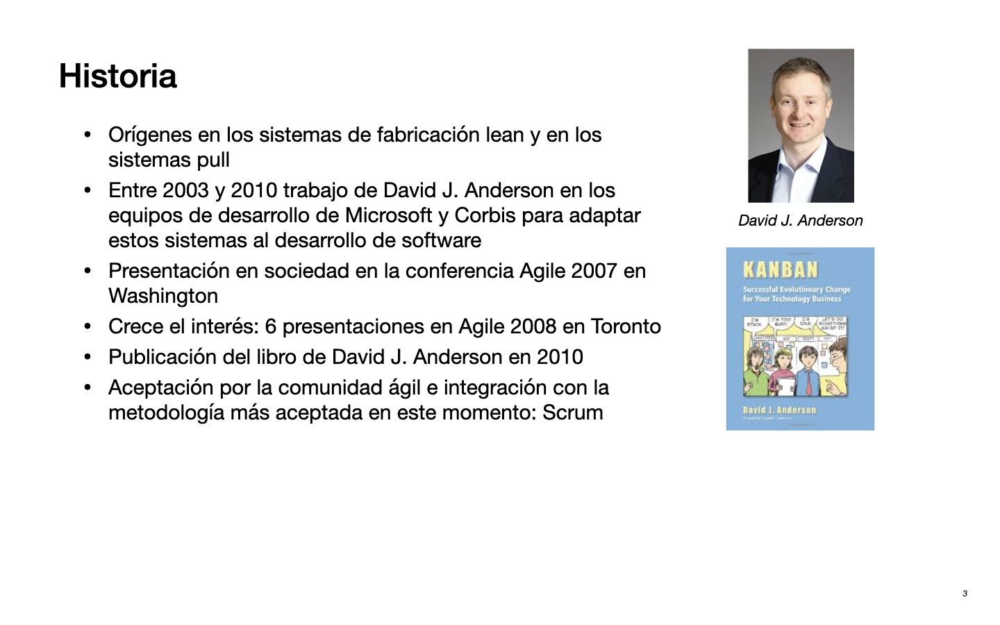

Entre los objetivos de Kanban se encuentran los siguientes::

- Conseguir un ritmo de trabajo sostenible en el desarrollo de
software. 
- Visualizar en todo momento la carga de trabajo del equipo de desarrollo (WIP: Work In Progress, trabajo en progreso) 
- Visualizar y estandarizar el flujo de trabajo de las historias de usuario
- Establercer políticas explícitas (definition of Done, límites WIP, etc.)



Kanban nos ayuda a cambiar el prisma de ¿Qué hacen las personas? a **¿Cómo va el trabajo?**.

### Las 3 prácticas fundamentales de Kanban ###

1. Visualizar el flujo de trabajo
    - Dividir el trabajo en 
pequeñas partes, escribir 
cada elemento
      en una 
tarjeta y ponerla en un 
tablero. 
    - Crear un tablero compartido
por el equipo, dividido en columnas
      
que identifican en qué parte 
del flujo de trabajo se encuentra
      el elemento.
2. Limitar el WIP (Work In Progress, trabajo en progreso): asignar un
   límite al número de elementos que puede haber en cada estado del
   flujo de trabajo. 
3. Medir el tiempo medio de terminación de un elemento (llamado lead
   time o cycle time) y optimizar el proceso para hacerlo tan pequeño
   y predecible como sea posible. 
   
### One day in Kanban land ###

Una representación gráfica de Henrik Kniberg del movimiento de
tarjetas por un tablero Kanban. **Consultad las diapositivas en Moodle**.

El post original de Kniberg se
encuentra en [este
enlace](https://blog.crisp.se/2009/06/26/henrikkniberg/1246053060000).

- Vemos un ejemplo de cómo cambian de estado los ítems de trabajo
  respetando el límite de WIP de cada columna. Cuando una columna ha
  llegado a su límite de WIP no es posible mover a ella ningún ítem
  más.

- Si hay ítems terminados en la columna anterior a otra que tiene
  cubierto su WIP esos ítems se quedan en espera en la columna
  anterior. Es habitual indicarlo creando una subcolumna que hará de
  buffer en el que se acumularán los ítems en espera. El número de
  ítems en el buffer también cuenta para el límite de WIP.

En el desarrollo del ejemplo se muestran situaciones interesantes que
surgen cuando se están trabajando con tableros Kanban y con límite de
WIP:

- Limitamos el número de ítems por columna (cuando los ítems B y C
  están en _Develop_ no se puede pasar el ítem D a esa columna porque
  se sobrepasaría su límite de WIP).
- Cuando se alcanza el límite de WIP en una columna se bloquea el paso
  de ítems de la columna anterior (en la columna _Deploy_ se ha encontrado un
  problema en el ítem A. Mientras, en la columna _Develop_ se ha
  terminado el ítem B. No se puede pasar a _Deploy_ porque se rebasaría
  su límite de WIP de 1. Se deja en la columna _Develop_, pero en la
  subcolumna _Done_ que hace de buffer para los ítems terminados que no
  pueden pasar a la siguiente columna).
- Los problemas en la parte de abajo de la cadena provocan cuellos de
  botella que afectan al trabajo en la parte superior (el equipo de
  desarrollo no puede coger el ítem D porque sobrepasaría el límite de
  WIP de la columna; el problema del despliegue de A está creando un
  cuello de botella que obliga a que todos sean conscientes del
  problema).

El límite de WIP es un elemento fundamental que obliga a que el flujo
sea fluido. Se debe gestionar empíricamente, observando el trabajo del
equipo. Si hay demasiada sobrecarga de trabajo en una columna, hay que
rebajar su límite. Si, por el contrario, falta trabajo podríamos
incrementar el límite.

## Visualizar el flujo de trabajo ##

Cada empresa de desarrollo de software tiene su propio flujo de
trabajo. Para aplicar Kanban debemos empezar identificando el flujo de trabajo

- ¿Qué son los ítems de trabajo (work items)?
- ¿Por qué fases pasan?
- ¿Existen distintos tipos de ítems?
- ¿Su tamaño tiene mucha variabilidad?

### Historias de usuario e ítems de trabajo ###

Cuando estamos aplicando Kanban a un equipo de desarrollo los ítems de
trabajo serán historias de usuario e ítems de trabajo. Si el tablero
Kanban es el del equipo de desarrollo, representaremos en él los ítems
de trabajo.

- Si las historias de usuario tienen un tamaño demasiado grande, las
  debemos dividir en tareas más pequeñas.
- Todas las historias deben ir acompañadas de criterios de aceptación.
- Dividiremos las tareas en ítems de trabajo que representaremos como
etiquetas que colocaremos en el tablero Kanban. 
- Los ítems de trabajo sí que pueden ser partes “horizontales” del
proyecto. 
- Los ítems de trabajo tampoco pueden ser demasiado pequeños. 

Un ejemplo de tarjeta con un ítem de trabajo:

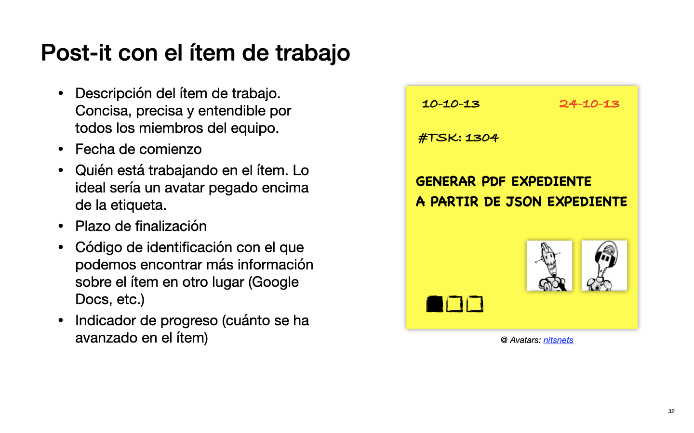

### Tablero Kanban ###

El objetivo principal del tablero Kanban es mostrar visualmente en qué
está trabajando el equipo en un momento dado y gestionar visualmente
el WIP y su límite.

El tablero es un elemento fundamental para la reflexión, la comunicación y la
discusión en las reuniones de pie diarias.

Gracias al tablero podemos medir distintas métricas relacionadas con
el flujo: número de ítems terminados por semana, WIP.

Para pasar una tarjeta de una columna a otra debemos definir políticas
estrictas de flujo de trabajo y de terminación (_Definition of
Done_). Esto obliga a estandarizar el proceso del equipo.

Ejemplo de tablero Kanban (obtenido de [Kanban – the next step in the
agile
evolution?](https://ketiljensen.wordpress.com/2009/10/31/kanban-the-next-step-in-the-agile-evolution/)):

Podemos empezar por un sistema Kanban sencillo. Aunque sea muy simple,
ya podemos utilizarlo para monitorizar métricas y definir límites de
WIP:

Cada equipo debe configurar el tablero Kanban más adecuado a sus
necesidades. En el artículo de Mattias Skarin [10 kanban boards and
their context
](https://blog.crisp.se/2011/12/05/mattiasskarin/10-kanban-boards-and-their-context-version-1-2?xt-version-1-2)
se pueden encontrar distintas configuraciones de tablero que se pueden
usar para diferentes necesidades y diferentes tipos de equipos.

### Jerarquía entre historias de usuario e ítems de trabajo ###

Un problema muy común en los tableros Kanban es cómo tratar la
jerarquía entre historias de usuario e ítems de trabajo. Una historia
de usuario se va a dividir en varios ítems de trabajo.

Una forma de hacerlo es usar el patrón expandir-colapsar. Hay columnas
del tablero en la que hay historias y otras columnas en las que
colocamos los ítems de trabajo en los que se divide la historia. Se
definen carriles para cada historia en desarrollo (el número de
carriles es también un WIP). Por los carriles se mueven los ítems de
trabajo en los que se ha expandido cada historia. Cuando todos los
ítems de trabajo de un carril (una historia) han terminado, se vuelve
a mover la tarjeta que representa la historia por las columnas
restantes.

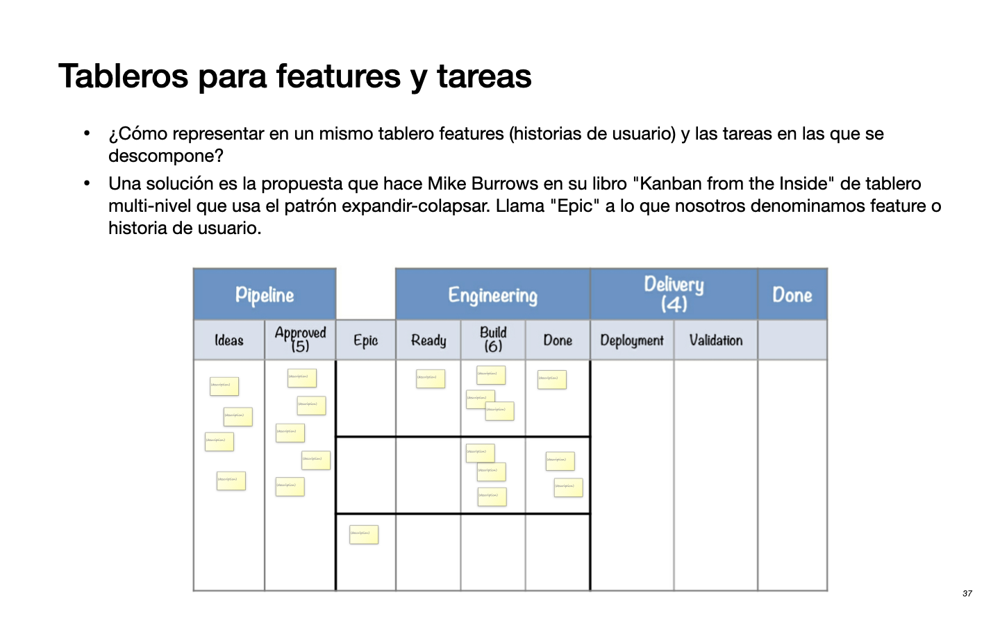

Se pueden utilizar también tableros multi-nivel. Tenemos un tablero
para el product owner y para gerencia en el que se muestran las
historias de usuario y otro para el equipo de desarrollo en el que se
gestionan los ítems de trabajo.

### Más allá de las columnas  ###

Recordemos que, en el fondo, un tablero Kanban no es más que la
representación/visualización del estado de los ítems de trabajo en un
instante dado.

Para indicar que un ítem se encuentra en un determinado estado
utilizamos las columnas. Pero, ¿cómo podríamos representar estados no
secuenciales?. Supongamos que los ítems deben pasar tests de usuarios
y tests de rendimiento, y que no tenemos definida ninguna política
secuencial al respecto. ¿Cómo podríamos representarlo? Una solución es
representarlo en la propia tarjeta, con un tick. De esta forma, cuando
se hayan hecho marcado los dos ticks ya se podrá pasar la tarjeta al
siguiente estado.

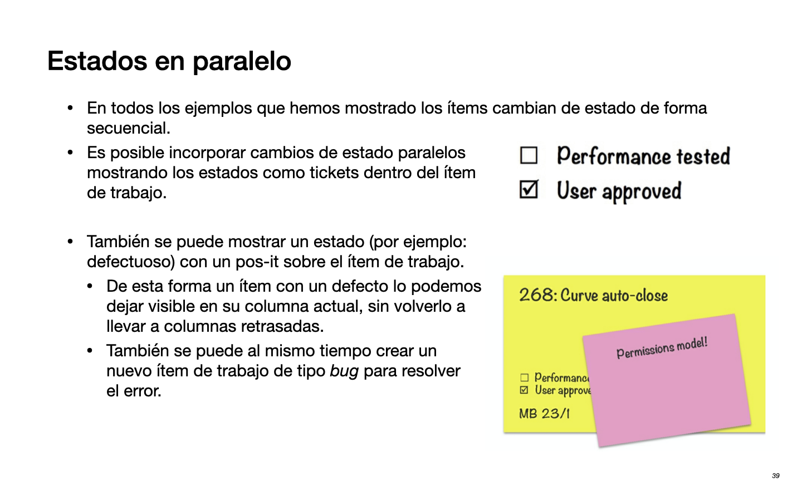

El hecho de usar la propia tarjeta como elemento en el que se pueden
realizar anotaciones abre la puerta a muchas otras versiones de esta
técnica. Por ejemplo, podemos colocar un pos-it rojo para indicar que
un determinado ítem tiene un defecto que hay que resolver.

### Ejemplo de uso de Kanban - Lean from the Trenches ###

En su libro [_Lean from the
Trenches_](https://learning.oreilly.com/library/view/lean-from-the/9781941222935/)
Henrik Kniberg documenta el uso de tableros Kanban en un proyecto de
desarrollo bastante importante realizado por su equipo de trabajo.

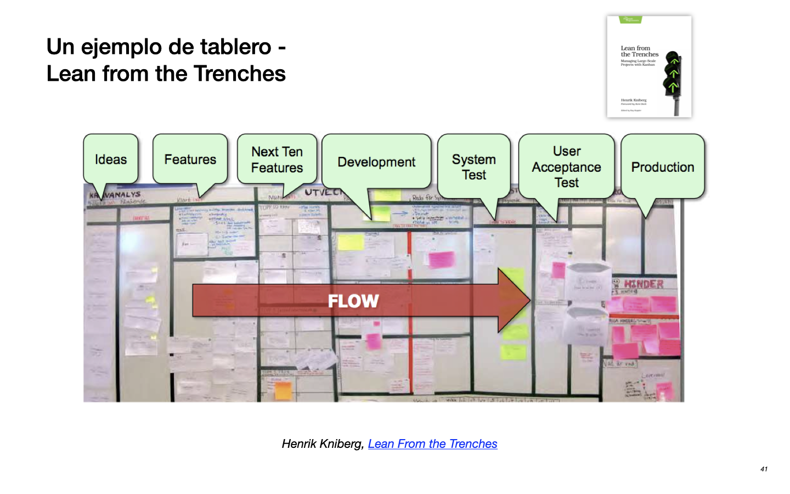

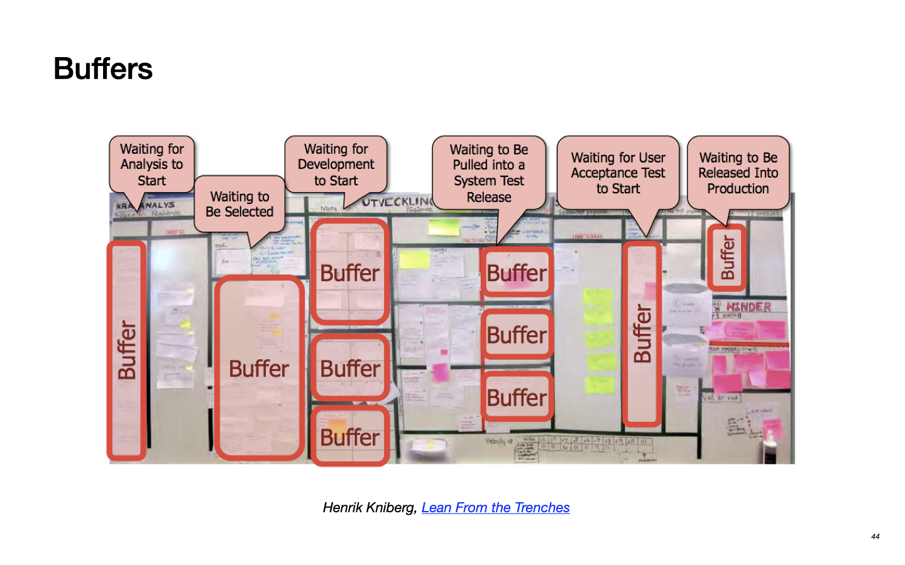

## Limitar el WIP ##

Hemos visto que el límite del trabajo en progreso (WIP) es una de las
herramientas más importantes que se usa en los tableros Kanban. 

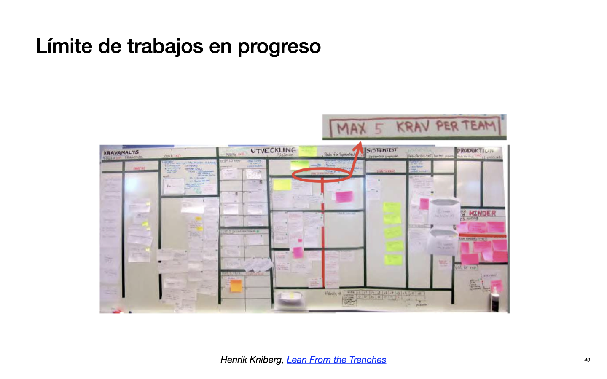

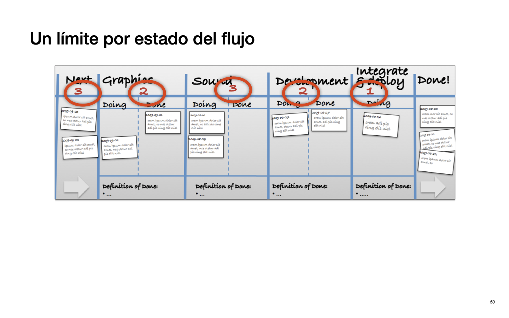

El hecho de definir un límite de WIP sirve implícitamente para
implementar un sistema de trabajo que puede optimizarse de forma
dinámica. 

La optimización del WIP consigue un sistema de _tickets_ (peticiones) en las que:

- Se elimina el stock (entendido como peticiones que quedan en espera)
- Optimización del flujo
- Adaptación rápida a los cambios
- Optimización de la capacidad del equipo
- Mejorar los tiempos de entrega y la productividad

¿Qué otras ventajas tiene el uso de un límite de WIP?

- Evitar exceso de multitarea
- Evitar sobrecargas en las siguientes partes de la cadena de proceso
(downstream) 
- El límite del WIP debe establecerse por consenso entre todos los
  implicados en el proyecto
- La tensión creada por establecer un WIP obliga a discusiones y
  análisis beneficiosos para el equipo y el proyecto 

Podemos ver en la siguiente figura cómo disminuyendo el WIP se
disminuye el tiempo gastado en los cambios de contexto y se aumenta el
rendimiento (_throughput_, número de ítems terminados por unidad de tiempo).

### ¿Cuál es el límite WIP óptimo? ###

Kanban es un proceso empírico. El WIP óptimo se obtiene
experimentando, midiendo y mejorando. 

Podemos empezar con una regla sencilla: 2*n-1, siendo n el número de
personas trabajando en esa fase. Y después estudiar el flujo y
optimizar ese límite.

Si el límite de WIP es demasiado bajo, habrá un flujo muy lento y las
personas estarán ociosas. Si el límite de WIP es demasiado alto,
también habrá un flujo no óptimo debido a la sobrecarga de trabajo y a que
muchas tareas se quedarán paradas mucho tiempo debido a que la gente
no tiene tiempo de resolverlas.

Una de las ventajas de un límite de WIP bajo es que obliga a terminar
y evita que se acumulen ítems no acabados. El límite de WIP obliga al
equipo a centrarse en terminar tareas antes de poder acometer
nuevas. Esto da lugar a uno de los _slogans_ más conocidos de Kanban:
"Stop starting, start finishing".

## Medir y optimizar el flujo ##

Hemos dicho que uno de los objetivos de Kanban es maximizar el flujo,
el número de ítems terminados por unidad de tiempo.

A partir del tablero Kanban podemos obtener una representación gráfica
del número de ítems que salen de cada columna por unidad de tiempo
obteniendo lo que se llama diagrama de flujo acumulado. Lo vimos en el
tema pasado. Del diagrama de flujo acumulado podemos calcular el WIP
real y el tiempo de terminación de las tareas (también llamado _cycle
time_ o _lead time_).

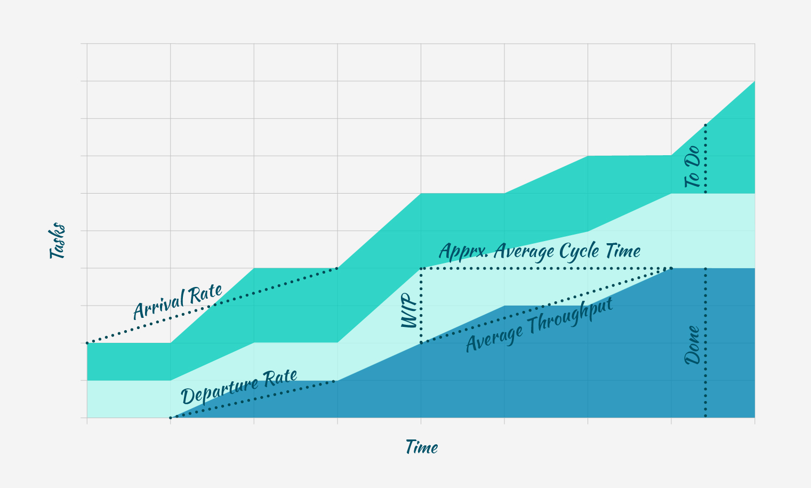

El _cycle time_ también se puede calcular llevando un histórico del
tiempo de terminación de cada tarea y representándolo en
histograma. Lo normal es que conforme avanzamos en el proyecto este
tiempo sea cada vez menor.

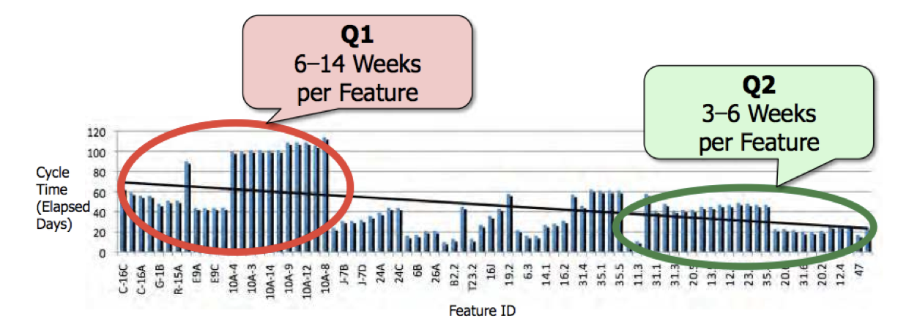

También podemos analizar la cadena de valor de cada tarea, estudiando
el tiempo en el que hemos estado trabajando en la tarea y el tiempo
que la tarea ha estado parada. Para ello dividimos el tiempo en el que
hemos estado trabajando en la tarea por el tiempo total que ha
necesitado para terminarse. Eso nos da el porcentaje de eficiencia del
proceso. Un porcentaje del 100% representa una tarea sin esperas.

Por ejemplo, la siguiente imagen muestra la cadena de valor de una
resolución del bug, desde el tiempo en que es reportado hasta que es
solucionado. 

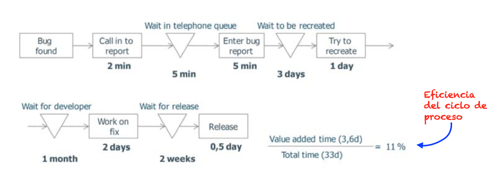

## Resumen de las prácticas principales de Kanban ##

1. Visualizar el flujo de trabajo
2. Limitar el Work In Progress
3. Medir y optimizar el flujo (el tiempo de ciclo o lead time)

4. Hacer explícitas las políticas
   - Definition of Done (Definición de Hecho)
   - Classes of Service (Clases de servicios)
   - Service Level Agreement (Acuerdos de nivel de servicios)

5. Retroalimentación y mejora continua
   - Ritmo y cadencia
   - Daily Standups (Reuniones diarias)
   - Retrospectivas

## Referencias ##

- Marcus Hammarberg, Joakim Sunden (2014) - [_Kanban in Action_](https://learning.oreilly.com/library/view/kanban-in-action/9781617291050/)
- Henrik Kniberg (2011): [_Lean from the Trenches_](https://learning.oreilly.com/library/view/lean-from-the/9781941222935/)
- David J. Anderson (2010): _Kanban_ ([Catálogo UA](https://cat.biblioteca.ua.es/discovery/fulldisplay?docid=alma991005620809706257&context=L&vid=34CVA_UA:VU1&lang=es&search_scope=Coleccion_completa&adaptor=Local%20Search%20Engine&tab=All_resources&query=any,contains,Kanban%20David%20j%20Anderson&offset=0))
