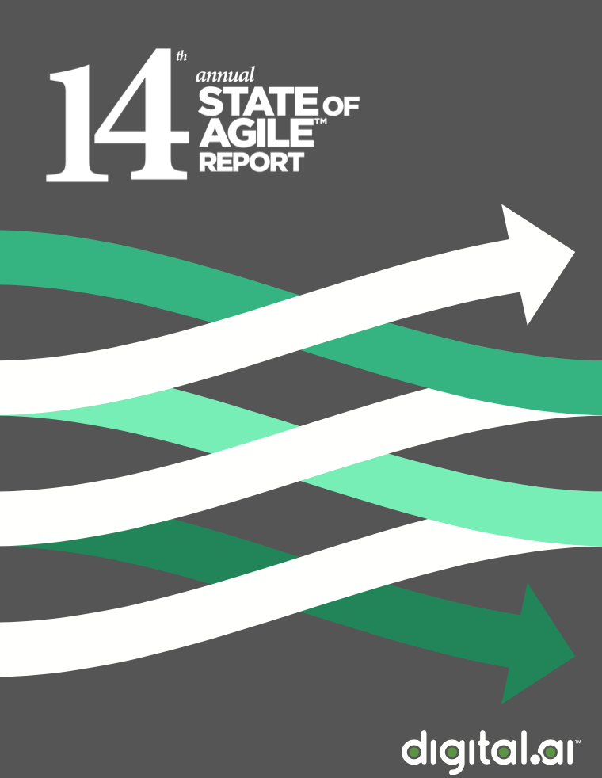
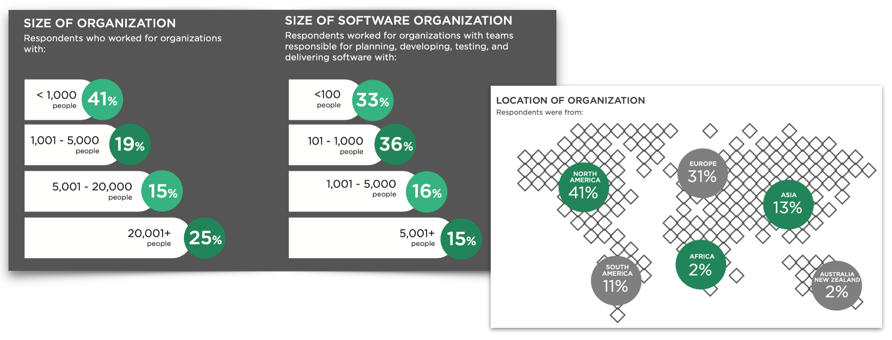
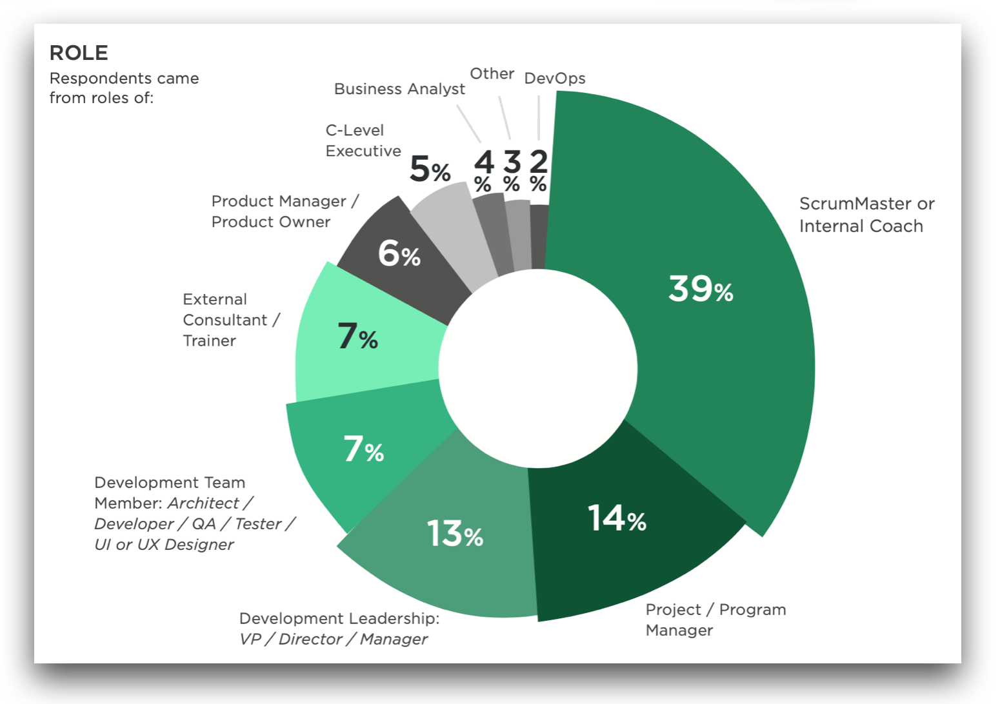
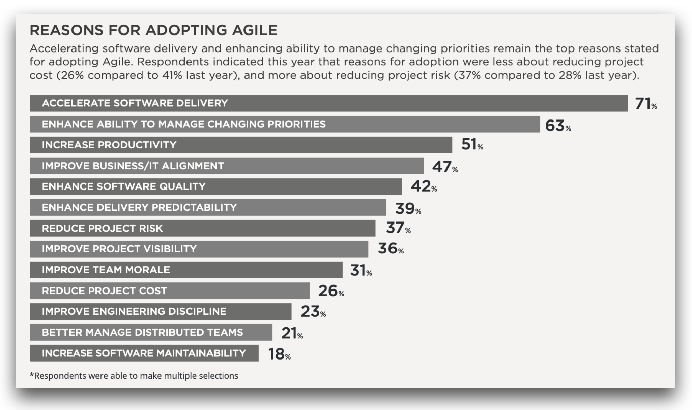
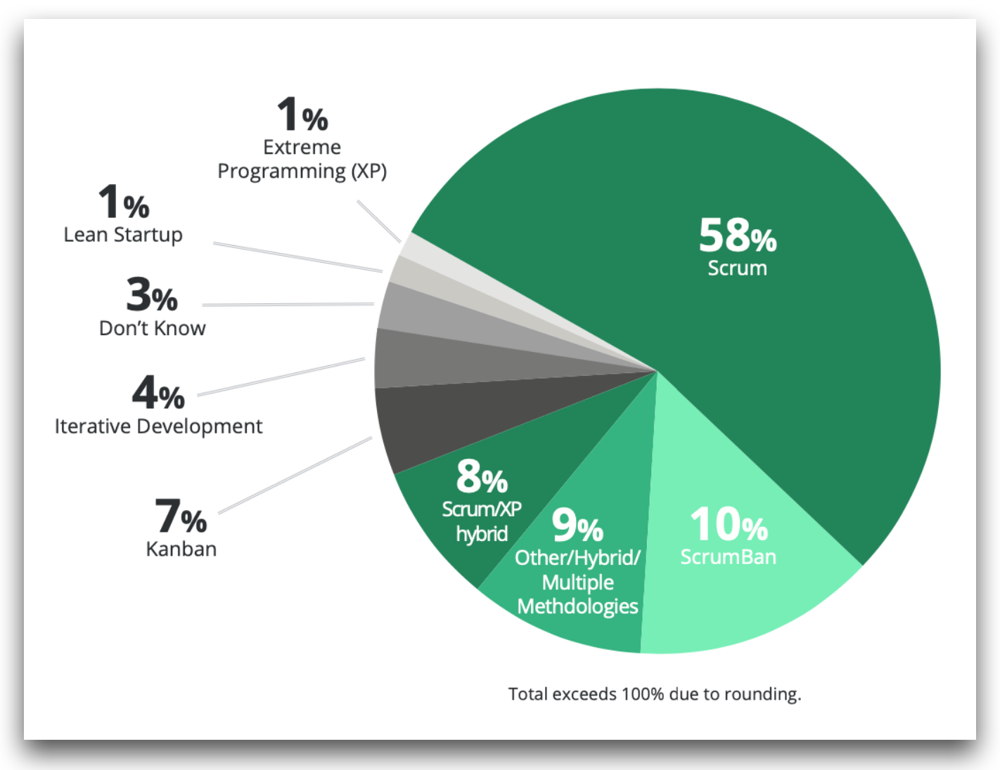

# El estado de Agile en 2020 #

En este apartado haremos un breve repaso al informe sobre el estado de
Agile en 2020 realizado por la consultora digital.ai, comentaremos
algunos problemas en la puesta en práctica de metodologías ágiles y
terminaremos con una crítica a la visión reduccionista de que Agile es
igual a Scrum.

## State of Agile Report ##

</img>

El informe [_State of Agile_](https://stateofagile.com/) se realiza
anualmente desde hace 14 años por la consultora
[digital.ai](https://digital.ai). En los informes se recogen los
resultados de encuestas contestadas por profesionales de empresas
tecnológicas sobre la aplicación de metodologías ágiles en su
funcionamiento.

Hay que tomar el informe con cierta precaución, porque no se hace un
muestreo general a todas las empresas tecnológicas, sino que se recoge
la información entregada de forma voluntaria por profesionales que
están interesados en compartir su información. Por eso el informe
estará lógicamente sesgado hacia empresas que tienen una disposición
favorable a la aplicación de estas metodologías. Aún así, el informe
es muy interesante porque nos proporciona muchos detalles sobre cómo
se ponen en práctica estas metodologías en las empresas.

El último informe, el número 14 correspondiente a 2020, recoge la
información de una encuesta realizada a más de 40.000 personas de
empresas de todo el mundo y de todos los tamaños. 

#### Tamaño de las empresas ####

Empresas con equipos de software que van desde menos de 100 personas
(un 33%) hasta más de 5.000 personas (un 15%).

</img>

Para que os hagáis una idea de lo que representan estas cifras del
tamaño de los departamentos de software, podríamos compararlas con la
Universidad de Alicante. La universidad tiene alrededor de 25.000
estudiantes y más de 3.500 trabajadores, entre profesores y personal
de administración. El tamaño del Servicio de Informática de la
universidad es de unas 100 personas. O sea, que cuando en el informe
se dice que un 36% de las empresas encuestadas tienen equipos de
desarrollo de entre 100 y 1.000 personas estamos hablando de equipos
del tamaño del de la UA, o 10 veces mayores. La UA estaría en el
primer rango del 33%.

#### Puesto de trabajo ####

</img>

En cuanto al puesto de los que han respondido la encuesta, la gran
mayoría (casi el 40%) son _Scrum Masters_ o _Agile Coach_. Sólo un 7%
de los que han respondido la encuesta son miembros de los equipos de
desarrollo. Esto también puede representar un sesgo importante, que
también puede explicar la gran relevancia de Scrum en gráficos
posteriores.

#### Objetivos que se pretenden conseguir ####

A los encuestados se les preguntaba por los objetivos que se pretenden
conseguir adoptando metodologías ágiles. Podían responder más de una opción. 

</img>

El objetivo principal de más del 70% de los que respondieron es
"Acelerar la entrega de software". Le sigue "Mejorar la posibilidad de
gestionar prioridades cambiantes" (63%) y "Mejorar la productividad"
(51%). Son objetivos muy relacionados con ser más eficientes en el
desarrollo de software y tener más capacidad de cambiar
prioridades. De forma indirecta esto nos indica un descontento con la
velocidad actual y la rigidez de desarrollo. Los encuestados perciben
que se tarda demasiado en que el software llegue a manos de los
usuarios finales y que es muy difícil de introducir cambios en los proyectos.

Es curioso que el último punto, al que menos importancia se le da, sea
el de "Mejorar la mantenibilidad del software" (18%). Quizás es debido
a que el concepto de "mantenibilidad" del software tiene connotaciones
demasiado tradicionales entre los encuestados, que lo asocian a
corregir bugs en software de poca calidad. Sin embargo, sí que se da
bastante importancia a mejorar la calidad del software (42%). 

Parece claro que el objetivo de los encuestados es conseguir que se
desarrolle software de calidad, que se entregue rápido y que sea fácil
de modificar y transformarse según las necesidades del negocio. Es un
objetivo bastante cercano a lo que pretenden las metodologías ágiles.

#### Indicadores para medir el grado de éxito  ####

</img>

En cuanto a la forma de medir el éxito en la aplicación de las
metodologías ágiles en proyectos, la encuesta muestra que se definen
muchas métricas distintas, desde el valor de negocio entregado (46%)
hasta número de horas individuales por iteración y por semana (8%),
pasando por conceptos de Kanban como WIP (_Work in Progress_) (20%) o
relacionados con el cumplimiento de la planificación como el número de
historias por iteración real vs. previstas (31%) o las fechas de
release previstas vs. reales (28%). También se incluyen medidas
relacionadas con la calidad del software como el número de defectos en
producción (26%), defectos a lo largo del tiempo (20%) o resolución de
defectos (15%). Las medidas más usadas son las relacionadas con el
valor entregado al cliente (46%) y su satisfacción (45%), así como la
velocidad del desarrollo (37%).

Es interesante comprobar que el abanico de indicadores es muy amplio y
que no hay un consenso claro en los que se usan. Hay indicadores más
alineados con las ideas ágiles, como son los relacionados con la
satisfacción del cliente y el valor entregado y otros más relacionados
con métodos clásicos de planificación de proyectos no tan ágiles, como
los que hacen énfasis en la precisión de la planificación. Uno de los
objetivos principales de las metodologías ágiles es entregar valor
al cliente en forma de software que funciona. Podemos hacer una
planificación perfecta del número de historias entregadas y de las
fechas de entrega, pero resultar que el software entregado no consigue
satisfacer los objetivos del cliente. No estaremos siendo ágiles en
ese caso.

<table markdown="1">
<tr><td style="background-color: #e0e0e0">

**La importancia de medir**

Hay una frase popular que se atribuye al científico Lord Kelvin y dice
que:

> "Lo que no se puede medir no se puede mejorar."

Si queremos comprobar la evolución de algo es importante poder
medirlo. Si queremos evaluar la consecución de unos objetivos
deberemos cuantificarlos, por lo que lo primero que deberemos definir
es un conjunto de indicadores medibles (métricas) relacionados con
esos objetivos. El problema aparece cuando lo que se quiere medir es
algo difuso, poco definido, que está relacionado con múltiples
variables fuertemente interrelacionadas. La búsqueda de indicadores
adecuados se convierte entonces en un problema a investigar.

En el mundo de los negocios está muy generalizado el uso de
indicadores o métricas que permiten decidir si se está realizando un
buen desempeño o no. Un ejemplo son los denominados [KPIs](https://en.wikipedia.org/wiki/Performance_indicator) (_Key
Performance Indicator_), indicadores relacionados con las distintas
áreas de desempeño de una empresa (fabricación, marketing y ventas,
servicios, etc.).

Las empresas de tecnología han desarrollado versiones propias de esta
idea. Por ejemplo, empresas como Google, Intel o Twitter utilzan los
populares [OKRs](https://en.wikipedia.org/wiki/OKR) (_Objectives and
Key Results_). Un OKR contiene un objetivo claramente definido y un
conjunto de 3-5 resultados clave medibles que nos permiten hacer un
seguimiento del alcance de ese objetivo.

Como hemos comentado anteriormente es fundamental definir los
indicadores adecuados a lo que queremos medir. Por ejemplo, seguro que
conoces métricas usadas habitualmente para medir la calidad del
código. Por ejemplo el número de tests, el cubrimiento del código, el
número de _code smells_ o los bugs/duplicaciones/vulnerabilidades en
el tiempo. Si quisiéramos medir cómo evoluciona la deuda técnica en el
software que estamos desarrollando podrían ser buenos
indicadores. Pero si lo que quisiéramos es comprobar si estamos
entregando valor al cliente, no son los indicadores más
apropiados. Podemos estar construyendo correctamente un producto
incorrecto y no darnos cuenta.

Siempre que midamos la evolución del rendimiento usando indicadores
hay que tener cuidado con lo que en _Machine Learning_ se denomina el
problema del _overfitting_ o sobreajuste. En el caso de las redes
neuronales aparece este problema cuando las redes optimizan demasiado
el aprendizaje del conjunto inicial de muestras y no son capaces de
generalizar y clasificar correctamente nuevas muestras no vistas
previamente. 

En la medición del rendimiento del equipo podría darse el caso de que
los indicadores que el equipo maximiza funcionaran como incentivos que
estuvieran erosionando algún otro aspecto del equipo que terminara
haciendo que el equipo dejara de funcionar bien. Por ejemplo, si se
valorara el número de líneas escritas por el equipo, podría darse el
caso de que alguna persona que está haciendo un papel muy bueno
analizando la utilidad de nuevas funcionalidades y aportando ideas
valiosas al producto dejara de hacerlo para producir más código (que
podría aportar menos valor).

Hay que pensar que el equipo está formado por personas y que, como
dice el manifiesto ágil, las personas y la comunicación están por
encima de los procesos.

</td></tr></table>

#### Metodologías ####

En el informe se pregunta por la metodología ágil concreta que se
utiliza en la empresa.

</img>

Scrum gana por goleada. Es la única metodología usada en el 58% de
las empresas. Y es la metodología usada en combinación con otras en un
18% adicional, haciendo un total de 76%. 

Kanban/Lean se utiliza (sólo o en combinación con Scrum) en un 18% de las
empresas. Y Extreme Programming (XP) en un 9%.

Parece evidente que Scrum es la metodología que ha terminado
imponiéndose en el mundo ágil. Pero no siempre ha sido así. En el
momento de publicación del manifiesto ágil, el año 2001, la
metodología predominante era XP. Cinco años después, en el primer
informe _State of Agile_ Scrum ya era la metodología más adoptada con
un 40%, frente al 23% de XP. Y hoy la diferencia es abrumadora: un 75%
frente a un 9%.

¿Cuáles son las claves del éxito de Scrum? Podemos enumerar algunas
posibles:

- Metodología con roles, ceremonias y artefactos muy claramente
  definidos.
- Marco abierto en el que se pueden incorporar otras prácticas y
  metodologías.
- Aplicable a distintas áreas de la empresa, no sólo al desarrollo de
  software.
- Se ha creado un gran negocio alrededor de las certificaciones y los
  cursos Scrum.
  

<table markdown="1">
<tr><td style="background-color: #e0e0e0">

**Certificaciones de Scrum**

Se podría hablar bastante sobre el negocio de las
certificaciones. Organizaciones como
[Scrum.org](https://www.scrum.org) y
[ScrumAlliance](https://www.scrumalliance.org) han creado una serie de
cursos y certificaciones que se han hecho muy populares. Puede
gustarnos o no, pero es evidente que han desempeñado un papel
fundamental en la expansión de Scrum. Las personas que obtienen una
certificación consiguen un reconocimiento generalmente aceptado por
las empresas y difunden la metodología haciendo de _Scrum Masters_ o
_Agile Coaches_.

Es difícil elegir entre certificaciones de Scrum.org y de
ScrumAlliance. Hay gente muy válida detrás de ambas
organizaciones. Scrum.org fue fundada por [Ken
Schwaber](https://www.scrum.org/team/ken-schwaber), uno de los
creadores de Scrum. ScrumAlliance es apoyada, por ejemplo, por [Mike
Cohn](https://www.mountaingoatsoftware.com/company/about-mike-cohn),
un profesional ampliamente reconocido, autor de libros fundamentales
como _Agile Estimating and Planning_ o _User Stories Applied_.

Estas certificaciones han sido muy criticadas por numerosos
profesionales. Por ejemplo, en palabras de Jerónimo Palacios, en su
artículo [Argumentos en contra de Scrum](https://ckarchive.com/b/75u7h8h3wz8l):

> "Las compañías, sobre todo en el último lustro, han demandado más
> profesionales con conocimientos de Agile. Y Agile se ha asociado
> tradicionalmente a Scrum. Es por ello que han surgido cientos o
> miles de compañías dedicadas a la fabricación en masa de
> certificaciones ágiles cuyo marketing es cuestionable o puede llevar
> a engaño."

También en el mismo artículo, Jerónimo Palacios hace la siguiente
crítica extensible, en general, a otros títulos y títulos y
acreditaciones:

> La certificación certifica -¡sorpresa!- que en un momento dado has
> pasado un examen de conocimiento básico sobre Scrum. Lo que vale es
> el conocimiento, ideas, habilidades y capacidades de la persona que
> ostenta esa certificación de ejercer ese rol en una organización. 

El propio Kent Beck, creador de XP, siempre ha defendido la filosofía
abierta de XP y ha manifestado que no consideraba moral _monetizar_ la
metodología. En la entrevista [_Leaving
Facebook_](https://youtu.be/fH4gqsIYzyE) hace la siguiente crítica a
las certificaciones:

> "You attend a 2 day training, and you get this title, and you can
> put CSM: Certified Scrum Master after your name, and it didn’t
> actually mean anything. It should have been AST: Attended Scrum
> Training….but certified, whoa, who doesn’t want to be
> certified…Scrum, okay, already with the branding. Master! Who
> doesn’t want to be a Master? It’s a lie though. After two days,
> you’re not a master, anyone who certifies you is lying, and to me
> that whole edifice, certified scrum trainers, certified scrum
> trainer trainers, and then blah blah blah, it’s starting to look
> like a Pyramid Scheme to me. 

En cualquier caso, si te interesa conocer las posibles formas de
certificarte aquí en España, hay muy buenos profesionales haciendo
formación y preparación sobre metodologías ágiles y para la
certificación de Scrum. Por citar algunos:

- [Jerónimo Palacios](https://twitter.com/giropa832)
- [Codesai](https://codesai.com), con personas como [Alfredo Casado](https://www.linkedin.com/in/alfredo-casado/?originalSubdomain=es) o [Toño de la
  Torre](https://www.linkedin.com/in/antoniodelatorre/).
- [Agilar](https://agilar.com/es/es#home)

Si compruebas los contenidos de estos cursos podrás ver que muchos de
ellos ya los conoces por haberlos visto en las asignaturas de la
carrera en las que hablamos de estas metodologías. Sin embargo, en
estas formaciones podrás estudiarlos en mucha más profundidad, conocer
otros enfoques y conocer experiencias de compañeros en la profesión.

</td></tr></table>

#### Prácticas ágiles ####

También se pregunta sobre qué prácticas o técnicas ágiles se utilizan.

</img>

Las prácticas más populares son:

- Daily standup (85%)
- Retrospectivas (81%)
- Reunión de planificación del sprint / iteración (79%)
- Revisión del sprint / iteración (77%)
- Iteraciones cortas (64%)

Al ser Scrum la metodología más empleada es normal que sus prácticas
sean las más populares. Es curioso que una práctica como el _daily
standup_ sea la más popular de todas. Quizás es debido a que es de las
más sencillas de poner en práctica. Aunque hay que tener cuidado
porque es una práctica que es muy fácil que degenere y se convierta en
un ritual que no aporta mucho al equipo.

En segundo lugar se encuentra la realización de retrospectivas en las
que se analiza cómo ha ido el sprint. ¿Qué ha funcionado bien y qué ha
funcionado mal durante la iteración? Es una práctica muy importante
que lleva al equipo a reflexionar sobre su desempeño y a mejorar. Es
una buena noticia que sea una de las prácticas más populares.

La planificación y revisión del sprint son también prácticas
fundamentales de Scrum y es normal que estén entre las más adoptadas.

Es llamativo que no se usen más las iteraciones cortas. Un porcentaje
del 64% significa que una de cada tres empresas que dicen estar
aplicando metodologías ágiles no hacen iteraciones cortas. Si además
comprobamos que sólo el 48% de los encuestados dicen hacer entregas
frecuentes podemos deducir que la entrega continua de software es una
práctica complicada en la que las empresas deben mejorar.

#### Prácticas de ingeniería ####

También se ha preguntado por lo que denominan "prácticas de
ingeniería" (nosotros las llamaríamos mejor prácticas de desarrollo).

</img>

Podemos comprobar que los porcentajes son claramente mejorables. La
práctica más extendida es el _unit testing_ (67%) junto con
los estándares de código (58%) y la integración continua
(55%). No está mal que 2 de cada 3 empresas hagan tests, pero
podríamos también preguntarnos qué tipo de pruebas están
haciendo. Para considerarlos parte de un enfoque ágil los tests
deberían ser realizados por los desarrolladores al tiempo que diseñan,
codifican y refactorizan. Sin embargo, técnicas como la
refactorización (43%) o el _test-driven development_ (30%) se utilizan
poco, lo que nos lleva a sospechar que una cantidad importante de los
que declaran hacer unit testing lo hacen de una forma tradicional, con
equipos de testing separados del desarrollo.

Hay que hacer notar que técnicas avanzadas utilizadas por equipos de
alto rendimiento, como el _continuous delivery_ (41%) o el _continuous
deployment_ (36%) son relativamente poco usadas. Y son menos usadas
aún algunas técnicas muy interesantes propias de XP como el _pair
programming_ (31%), el _test driven devolpment_ (TDD) (30%) o la
propiedad colectiva del código (29%).

En la asignatura vamos a ver muchas de estas técnicas de
desarrollo. Consideramos que son fundamentales para que un equipo esté
realizando correctamente un desarrollo ágil. Hablaremos más de ello en
el siguiente apartado.

## Agile es más que Scrum ##

A pesar de ser Scrum la metodología más extendida, defendemos que
Agile es algo más que Scrum. Scrum es sólo uno de los posibles marcos
(_frameworks_) de trabajo que podemos usar para ser ágiles. Pero no es
el único y, por si mismo, no garantiza la agilidad del equipo.

Por ejemplo, podemos tener un equipo que siga al pie de la letra las
prácticas de Scrum pero que carezca de la capacidad técnica suficiente
para hacer entregas continuas o para permitir modificar el código
fácilmente sin caer en una deuda técnica que paralice cualquier
posible evolución del producto. Como indica Jerónimo Palacios en su
artículo [_Argumentos en contra de
Scrum_](https://ckarchive.com/b/75u7h8h3wz8l), uno de los problemas de
Scrum es que no promueve la excelencia técnica.

¿Ayuda Scrum a ser más ágil?  Está claro que sí. Prácticas como las
iteraciones cortas, las retrospectivas o roles como el product owner
ayudan (y mucho) a ser más ágiles. Pero hay que tener mucho cuidado
con dos cosas: el Falso Scrum (_Fake Scrum_) y la obsesión por los
procesos. 

### Fake Scrum ###

Decir que se usa Scrum no garantiza la agilidad. Muchos equipos que
dicen usar Scrum, realmente están encajando prácticas tradicionales
dentro de un pretendido Scrum. Convierten las iteraciones frecuentes
en releases de 1 o 2 meses. No hay feedback del cliente. El backlog es
inmutable. Las dailys son rituales vacíos. Han adoptado unos nombres,
pero no abrazan los objetivos ni la filosofía ágil. Es lo que se
denomina _Fake Scrum_ o [_Dark
Scrum_](https://ronjeffries.com/articles/016-09ff/defense/) en
palabras de Ron Jeffries.

Muchas de las empresas que hacen falso Scrum suelen haber oído hablar
de _transformación digital_ o de _metodologías ágiles_ e intentan
estar a la última diciendo que ellos también se suben a este
carro. Incluso puede ser que lo hagan con buena intención, que
realmente quieran cambiar la forma de desarrollar software porque se
dan cuenta de que la forma actual es mejorable. Pero todo se queda
ahí, en la intención. La inercia y la resistencia al cambio de la
institución hace que fracasen los distintos intentos de poner en
práctica estas nuevas metodologías. Y todo se queda en una adaptación
cosmética de algunos roles y prácticas pero sin realmente llegar a
abrazar los valores y objetivos de Agile.

### Obsesión por los procesos ###

Otra indicación de que no estamos aplicando correctamente Agile es que
desde gerencia se impongan procesos que deben ser seguidos a
rajatabla. Incluso si esos procesos son pretendidamente ágiles. 

Uno de los elementos más importantes que aglutinaba a los 17 firmantes
del Manifiesto Ágil era el rechazo a los procesos rígidos de
desarrollo de software impuestos desde arriba.

Estos procesos tienen su origen en los comienzos del siglo 20, con el
trabajo de Frederick Taylor y el denominado _Taylorismo_. Su idea era
que había que reorganizar los lugares de trabajo (fábricas) de forma
que se optimizara el trabajo hecho por los trabajadores. En su visión,
los trabajadores eran vagos, estúpidos y debían de ser meros
engranajes del proceso de fabricación. Otras personas más educadas e
inteligentes eran las que debían de pensar en cómo mejorar ese
proceso y establecer con todo detalle todos sus pasos.

Estas ideas se instalaron en gran parte de las industrias durante
buena parte del siglo 20. Por ejemplo, Henry Ford creó toda la
industria del automóvil americana basándose en estos principios (más
adelante veremos que los sistemas de fabricación _lean_ surgen como
respuesta a estas ideas).

La industria del software también se vio afectada por estas ideas. Se
pensó que los programadores eran meros instrumentos que sólo tenían
que "picar" el código diseñado por otras personas más inteligentes,
que eran las que definían el proceso y el sistema.

El movimiento ágil redefinió estas ideas y puso en el centro del
cuadro al desarrollador y al equipo. En la visión Agil los
desarrolladores son personas inteligentes, bien pagadas y bien
motivadas que son capaces de decidir cómo trabajar de forma
auto-organizada. De hecho, el primer valor definido por el Manifiesto
Ágil, es:

> "Individuos e Interacciones sobre Procesos y Herramientas"

Por encima de los procesos están los individuos y las interacciones
entre ellos. Es el equipo el que debe decidir cómo funcionar. Debe
poder hacer experimentos y modificar sus procesos internos dependiendo
de cómo vayan saliendo los resultados de esos experimentos. Hasta el
extremo de poder modificar la estructura del propio framework ágil que
estén usando. Por ejemplo, hay equipos ágiles que piensan que es
contraproducente tener un Product Owner continuamente en la misma
oficina que ellos (ver, por ejemplo, la charla de Maaret Pyhajarvi
[Agile as If You Meant It](https://youtu.be/YibNG8xx15c)). O que no es
conveniente hacer una reunión diaria, porque ya existe suficiente
comunicación en el equipo.

### Agile es un viaje ###

Como decíamos en la introducción de la asignatura, es importante tener
como objetivo la mejora continua o Kaizen. Hacer bien agile no es
seguir al pie de la letra unas prácticas, sin saber por qué se
hacen. Es tener claro cuáles son los objetivos que queremos alcanzar y
buscar formas de mejorar día a día en la consecución de los mismos.

Como dice Allen Holub [@allenholub](https://twitter.com/allenholub),
desarrollador y divulgador de las metodologías ágiles:

> "Si no cambias, no estás aprendiendo"

</img>

¿Cuáles son los objetivos de Agile, los valores hacia los que debemos
movernos? Hablaremos más adelante del Manifiesto Ágil, en el que se
establecen claramente. Pero podemos anticipar algunas ideas.

En la charla de Kevlin Henney [Agile ≠
Speed](https://www.youtube.com/watch?v=kmFcNyZrUNM) se analiza el 
significado de la palabra ágil. 

Según la RAE:

> **Ágil**.  
> Adjetivo. Que se mueve con soltura y rapidez.  
> Ejemplo: "Estuvo muy ágil y esquivó el golpe"

Como dice Henney, mucha gente identifica de forma errónea ágil con
rápido. El objetivo entonces sería desarrollar software rápido, cuanto
más rápido mejor, sin importar qué ni cómo. Si el objetivo es este,
los gestores se centrarán únicamente en métricas como número de líneas
de código o número de características desarrolladas.

En el mundo actual la rapidez es algo muy apreciado. Todo es
urgente. Como muestra, una frase que se hizo popular en Facebook:

> "Move fast and break things"

Está bien si queremos hacer experimentos, y probar alternativas. Pero
no en todos sitios se pueden romper cosas. Sobre todo si hay personas
por en medio.

Como dice la definición, ágil es algo más que velocidad. Si pensamos
en deportes, alguien como Usain Bolt sería un representante claro de
la velocidad. Pero si pensamos en agilidad no pensaríamos en él, sino
en gimnastas como Simone Biles. Ambos tiene diferentes
cualidades. Usain Bolt es muy rápido en línea recta, pero Simone Biles
puede girar, saltar, esquivar o cambiar de dirección mucho más
rápido. Tiene mucha más soltura, volviendo a la definición de la RAE.

Más importante que ir rápido es ir la dirección correcta, entregar el
producto que va a satisfacer al cliente, que le va a ayudar y dar
valor. ¿Cómo sabemos si vamos en la dirección correcta? Ya hablaremos
más adelante de eso en más profundidad. La respuesta rápida es "no lo
sabemos". Es el cliente el que debe decírnoslo cuando pruebe nuestro
producto. Y el cliente va a querer cambiar características en cuanto
empiece a probar. De ahí que más importante que ser rápido es ser
ágil: debemos aprender a cambiar de dirección fácilmente, con
soltura. Debemos aprender a cambiar las prioridades en las
funcionalidades que el cliente nos pide. Incluso a características ya
entregadas que el cliente está comprobando que no funcionan como
esperaba. Uno de los eslóganes de XP es "abraza el cambio". Lo veremos
más adelante.

A la hora de evaluar cómo estamos aplicando las metodologías ágiles
hay que hacer una medición compleja, multi-objetivo. No debemos
reducir algo complejo a una única dimensión (por ejemplo el número
de características entregadas, como se hace en los diagramas de
burn-down). Y algo, además, que no tiene en cuenta el _impacto_ en el
cliente del software entregado. 

### ¿Cómo saber si viajamos en la dirección correcta? ###

Entonces, si hemos dicho que Agile es un viaje, un proceso de mejora
de alguna forma deberemos poder comprobar si estamos moviéndonos en la
dirección correcta. ¿Qué indicadores podemos usar para comprobar si
estamos mejorando o empeorando?

Debemos fijarnos en los objetivos básicos, fundacionales, de Agile, y
no en un framework concreto. En concreto, debemos fijarnos en los
valores definidos por el Manifiesto Ágil y por Lean, los dos elementos
fundamentales de la teoría de Agile. Los veremos más adelante en detalle.

Por ahora conformémonos con una definición muy sencilla de Agile:

> "Agile = entregar valor de forma continua al cliente"

Podemos obtener dos elementos en esta definición: entrega de valor y
entrega continua. Empecemos por lo último, 

#### ¿Cómo medir la continuidad en la entrega? ####

La entrega de software de forma continua es un elemento
fundamental. Si el software sólo se entrega de golpe, al final de un
largo desarrollo, su valor será mucho menor que si hemos dejado al
cliente ir probándolo y moldeándolo.

Para medir la capacidad de nuestro equipo de entregar software de
forma continua podemos usar indicadores que midan tanto la velocidad
como la capacidad de reaccionar y modificar el producto entregado.

Podemos utilizar los siguientes tipos de métricas:

- **Métricas de código**: ya hemos hablado antes de ellas. Por
  ejemplo, número de tests, porcentaje de cubrimiento del código con
  los tests, cantidad de bugs/defectos.
- **Métricas de integración continua**: se pueden obtener a partir del
  servidor de integración continua. Número de _pull requests_
  exitosos/fallidos, número de compilaciones exitosas/fallidas, tiempo
  de compilación del _build_, tiempo de _commit_ a despliegue,
  despliegues a producción por día, etc.
- **Métricas de servicio**: número de errores del servidor, tiempo
  medio de respuesta, tiempo medio de latencia en consultas a base de
  datos, etc.
- **Métricas de soporte**: número de incidentes en producción, tiempo
  medio entre fallos (MTBF), tiempo medio en reparación, recuperación
  y resolución (MTTR) y otras [medidas relacionadas con los
  incidentes](https://www.atlassian.com/incident-management/kpis/common-metrics). 

Todas estas métricas nos pueden dar una idea de la calidad del
software que estamos desarrollando y de si lo estamos construyendo
correctamente. Tal y como hemos comentado, la excelencia técnica es
fundamental para Agile, porque nos permite crear un software que
podemos cambiar fácilmente para adecuarlo a las necesidades del cliente.

#### ¿Cómo podemos medir el valor entregado? ####

Pero no sólo es necesario poder entregar software
continuamente. Debemos de conseguir que ese software aporte valor al
cliente. ¿Es posible medir este valor?

En general, el valor entregado se puede medir por la satisfacción del
cliente. Y esta satisfacción será proporcional a los beneficios
producidos por la entrega.

Si estamos hablando de negocios, estos beneficios serán
fundamentalmente económicos. Para calcular los beneficios generados
por el funcionamiento del software puesto en producción podríamos usar
indicadores como:

- **Tiempo de trabajo ahorrado**, ¿cuántos meses-persona de trabajo se
  ahorran con esta característica?
- Costes ahorrados, ¿se evita el uso de algún servicio externo que
  costaba una cantidad de dinero?
- **Ingresos directos**, ¿cuántos clientes van a comprar el producto
  debido a esta nueva característica introducida?
- **Ingresos indirectos**, ¿cuántos clientes van a seguir usando el
  producto y no se van a ir a la competencia gracias a esta nueva
  característica? 
- **Reducción de errores**. Los errores tienen un coste asociado.

Para obtener información sobre estos indicadores es fundamental tener
un feedback del cliente. Es posible obtener este feedback de forma
continua usando herramientas automáticas que miden el uso de las
características que introducimos en nuestro producto (Google
Analytics, etc.)

Como dice Martín Pérez en su artículo [Measuring high-performance engineering teams from a
value perspective](https://dev.to/mpermar/measuring-high-performance-engineering-teams-from-a-value-perspective-46mo):

> " A high-performing team is great. It makes us, engineers, proud. I
> love sound engineering practices. But it is important to make sure
> that everything we do in our team is sustainable from a business
> perspective. It does not matter how exciting is the new thing we
> might be doing if it is not going to provide any value."

## Referencias ##

- Podcasts de Rafael Casuso
  [@Rafael_Casuso](https://twitter.com/Rafael_Casuso): [Agile en 2020 (I): Los
  Retos](https://anchor.fm/neuromancer/episodes/Agile-en-2020-I-Los-Retos-eg3oue)
  y [Agile en 2020 (II): Las
  soluciones](https://anchor.fm/neuromancer/episodes/Agile-en-2020-II-Las-Soluciones-eg8kvf) -
- [“The State of Agile 2020”](https://explore.digital.ai/state-of-agile/14th-annual-state-of-agile-report) 
- Charla de Martin Fowler: _The State of Agile Software in 2018_
  [transcripción](https://martinfowler.com/articles/agile-aus-2018.html)
      y [vídeo](https://www.youtube.com/watch?v=G_y2pNj0zZg).
- Charla de Kevlin Henney: [_Agile ≠ Speed_](https://youtu.be/kmFcNyZrUNM)
- Martín Pérez, [_Measuring high-performance engineering teams from a value perspective_](https://dev.to/mpermar/measuring-high-performance-engineering-teams-from-a-value-perspective-46mo)
