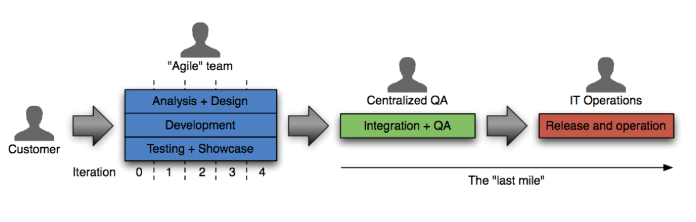
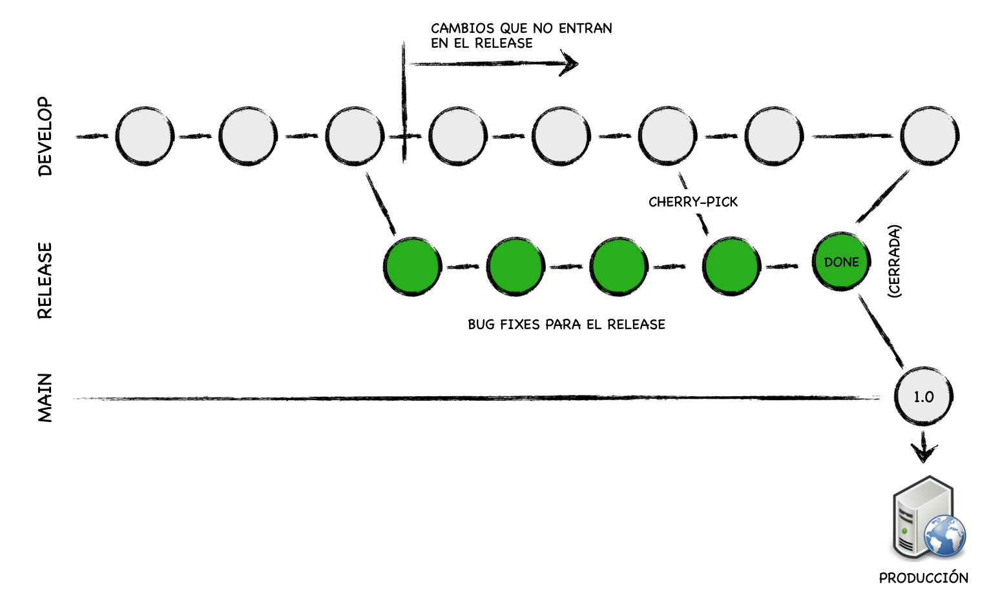
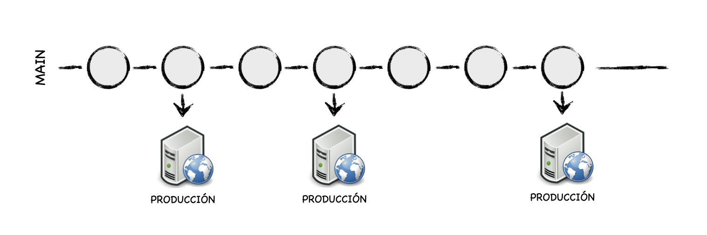

# Continuouos Delivery #

Una idea fundamental de las metodologías ágiles es entregar valor
frecuentemente para obtener una pronta retroalimentación del
cliente. Para ello es necesario tener muy engrasados los procesos de
despliegue y puesta en producción del software. 

Una de las formas que ya hemos visto que facilita la optimización de
la puesta en producción de software es la práctica de XP de
_Integración continua_ (_Continuous Integration_). En esta práctica
los miembros del equipo integran sus commits diariamente en el
proyecto y en cada integración se lanzan tests automatizados que
verifican que los cambios no introducen errores.

Además de esta práctica, debemos tener también automatizados todos los
procesos de compilación (_build_) y despliegue (_deployment_) de la
aplicación en los distintos entornos de prueba. Esto es lo que se
denomina _Despliegue continuo_ (_Continuous Deployment_). En esta
línea, se han popularizado herramientas como _Docker_ o _Kubernetes_
que facilitan el despliegue del software y su automatización y cada
vez se demandan más profesionales (denominados _DevOps_) con capacidad
de gestionar estos despliegues automatizados.

Y en los últimos años se ha dado un paso más allá y se ha comenzado a
hablar de _Entrega continua_ (_Continous Delivery_ en inglés) con la
idea de promover software que esté listo en cualquier momento para
salir a producción.

En este tema veremos todos estos conceptos, con la idea de tomar un
primer contacto con todos ellos. Necesitaríamos un curso (o más) para
verlos en profundidad. Intentaremos al menos conocer los conceptos
básicos para poder seguir profundizando en alguno de ellos en el
futuro.

## El problema de la puesta en producción ##

En las empresas tradicionales no ágiles el proceso de subir a
producción una nueva versión es un proceso muy complicado y
estresante. Se hace pocas veces, cuatro o cinco veces al año, durante
el fin de semana cuando todos los servicios están parados.

El proceso de genera muchos trastornos y dolores de cabeza. El equipo
de operaciones tiene que estar pendiente del móvil para detectar
posibles problemas y caídas del sistema. Una vez puesto el software en
producción el equipo de desarrollo se dedicará continuamente a
corregir bugs y solucionar problemas detectados por los usuarios.

Esto no es ágil. Esto no permite conseguir lo que hemos comentado
muchas veces de un ciclo corto de retroalimentación para que el
cliente pueda probar rápidamente las nuevas características y se pueda
comprobar su valor. Recordemos que en ambientes inciertos y no
predecibles es fundamental poder validar con el cliente las nuevas
funcionalidades introducidas, para adaptarse y corregir posibles
errores.

La realización de entregas frecuentes también permite minimizar el
riesgo. Todo el tiempo que estamos desarrollando algo sin ponerlo en
producción es un riesgo acumulado. Hasta que no está en producción y
ha sido aceptado por el cliente no sabemos si lo que estamos
desarrollando va a ser validado o no. Cuanto menos tardemos en
validarlo, menor será el riesgo.

La siguiente figura está sacada de la charla de Eduardo Ferro
([@eferro](https://twitter.com/eferro)) [Continuous Delivery:
Germinando una cultura ágil
moderna](https://youtu.be/hbggtXmQcf8?t=444). 


En la figura de la izquierda se entrega mucho valor de golpe y el
riesgo que se ha ido acumulando es mucho mayor que en la figura de la
derecha, en la que se entregan pequeños incrementos de valor que
nos permiten tener una retroalimentación más rápida y adaptar mucho
mejor el producto a las necesidades de los clientes.


El proceso de puesta en producción del software depende mucho del tipo
de software. En un extremo, por ejemplo, una página web se puede
cambiar modificando directamente el fichero HTML en la propia máquina
en la que se está ejecutando el servidor web. No hace falta ni
recompilar, ni reiniciar el servidor. En el otro extremo, un software
de control de una placa de un satelite espacial puede estar embebido
en el propio firmware de la placa y para realizar un cambio puede ser
necesario hasta volver a grabar y producir la placa.

En general, la mayoría de sistemas software se encuentran entre ambos
extremos. Es importante analizar con detalle cuál es el proceso de
despliegue de nuestro software, cuánto tarda en subir a producción un
cambio de una línea de código y cuáles son los cuellos de botella en
el proceso.



La denominada _ultima milla_ consiste en los pasos necesarios para la
puesta en producción de nuestro sistema. De nada nos sirve tener un
equipo ágil que hace iteraciones y reuniones con el cliente si después
tenemos un equipo de QA (_Quality Assurance_) con un 90% de pruebas
manuales y otro de operaciones que tiene que configurar manualmente
cualquier nuevo despliegue a producción y al que le cuesta dos días
revertir un despliegue fallido.

Debemos analizar cuál es nuestro proceso de release y hacer lo posible
por mejorarlo. Encontrar los cuellos de botella, reducir los tiempos,
automatizar todo lo que podamos. De forma que pasemos de un release
por trimestre a un release mensual. Y después a un release cada dos
semanas. Y después a un release semanal. Y después a un posible
release con cada posible cada cambio. Al final, como dice Eduardo
Ferro en la charla mencionada anteriormente, el tiempo de subir un
commit a producción debe ser de menos de 15 minutos y debemos de poder
automatizar el proceso de puesta en producción hasta el extremo que lo
podamos hacer a discreción, cuando queramos, únicamente pulsando un
botón.

Un elemento central de todo el proceso de despliegue es la
configuración de una tubería de despliegue lo más automatizada
posible.


La tubería representa todos los pasos necesarios que llevan el código
fuente hasta producción. Lo veremos en detalle más adelante, pero es
interesante adelantarla aquí. En la imagen se puede ver:

- **Compilación** de todas las dependencias en binarios. En el caso de una
  aplicación Java (como Spring Boot) podríamos tener dependencias
  externas (que no haría falta compilar, sólo descargarse) y
  dependencias de librerías internas que sí que estamos modificando y
  que deberíamos recompilar.
- **Empaquetamiento**, construcción de un único binario a partir de todos
  los binarios existentes. En el caso de una aplicación Java, la fase
  de package (por ejemplo, realizada con Maven) generaría un fichero
  WAR que podríamos distribuir. También, si utilizamos Docker, en esta
  fase generaremos una máquina Docker que podremos distribuir.
- **Despliegue** en distintos
  [entornos](https://en.wikipedia.org/wiki/Deployment_environment) de
  prueba y lanzamiento de pruebas en los distintos entornos. Cada
  entorno tiene su propia configuración, definida por variables de
  entorno o parámetros de los comandos de puesta en marcha.
- Despliegue en entorno de **_staging_** (réplica muy similar al entorno de
  producción).
- Despliegue en entorno de **producción**.

En el enfoque de entrega continua el proceso anterior está
completamente automatizado y la puesta en producción se puede modular
y realizar en el momento que nos interese pulsando únicamente un botón
en cualquier momento. 

Recordemos que la forma más tradicional de enfrentar el problema del
lanzamiento es separar una rama de release de la rama de desarrollo.



Por ejemplo, en la imagen anterior se muestra la rama de release que
se define en el flujo de trabajo GitFlow que hemos visto en el tema
pasado. 

Al separar la rama de release podemos seguir introduciendo cambios en
la rama de desarrollo sin afectar para nada al release. En la rama de
release se realiza toda la tubería de despliegue y se prueba en todos
los entornos. Se introducen correcciones de pequeños bugs encontrados
y se también se puede incluir algún commit escogido de la rama de
desarrollo haciendo un `cherry-pick`. Finalmente, la última versión
comprobada se pasa a producción y mezcla con la rama de releases y con
la de desarrollo (en GitFlow).

En el enfoque de lanzamiento continuo no existen ramas de release,
sino que en cualquier commit de la rama principal es candidato a ser
puesto en producción. 




## Integración continua ##

La Integración continua es una práctica en la que los miembros del
equipo integran su trabajo frecuentemente en el proyecto. Se trata de
una práctica de XP en la que se recomienda que cada miembro integre
sus cambios diariamente. Esto lleva a múltiples integraciones cada
día. Cada integración es verificada por una compilación automática
(_automated build_) en la que se lanzan todos los tests y se detectan
errores lo más rápidamente posible.

Esta práctica obliga a que todos los cambios realizados por los
desarrolladores sean puestos en común continuamente, lo que promueve
la compartición de conocimiento entre todos los miembros del
equipo. Cuando una persona va a integrar sus cambios primero debe
comprobar que éstos son compatibles con los cambios que ha habido en
el proyecto. Como se integra diariamente, éstos no serán demasiados y
si hay algún error será fácil de solucionar.

Sin embargo, si se desarrolla una versión separada que tarda mucho en
integrarse será muy posible que cuando se realice la integración
surjan muchos problemas de más difícil solución.

### Trunk based vs. feature branches ###

Uno de los debates frecuentes relacionados con los flujos de trabajo
de Git es si es más conveniente un flujo de trabajo _trunk based_
(basado en la rama principal) o uno con _feature branches_ (ramas de
características).


La imagen anterior está también sacada de la charla de Eduardo
Ferro. En ella se muestran los dos flujos de trabajo y se muestran
parejas de desarrolladores porque están aplicando también _pair
programming_.

En el **flujo de desarrollo _trunk based_** todos los desarrolladores
publican sus commits continuamente (al menos una vez al día) sobre la
rama principal del proyecto. Esto obliga a mantenerse continuamente al
día sobre los cambios que otros están introduciendo y a tener cuidado
de que nuestros cambios vayan en la misma dirección.

Entre las ventajas de esta técnica se encuentran:

- La integración de un nuevo commit es fácil porque la rama principal
  ha cambiado poco desde el commit anterior que integramos. No ha
  habido demasiado tiempo para que el proyecto diverja mucho.
- La transparencia en los cambios hace que se detecten antes los
  error
- El conocimiento del equipo evoluciona conjuntamente. Todo el mundo
  tiene información actualizada a diario de los cambios que se van
  introduciendo en el proyecto.
- Obliga a dividir los cambios grandes en cambios pequeños que se van
  integrando poco a poco. Esto obliga a hacer un mayor esfuerzo de
  diseño y utilizar mejores arquitecturas de software.

Entre los inconvenientes podemos destacar:

- Interrupciones más frecuentes en el flujo de trabajo del equipo
  debido a problemas introducidos por malos commits.
- No se pueden hacer pull requests en los que se haga una revisión de
  código.
- Necesidad más frecuente de _reverts_ que corrigen equivocaciones.
- Obliga al equipo a una gran disciplina y a una gran madurez. No se
  deben buscar culpables por los errores introducidos. Los errores
  nos hacen aprender.

El **flujo de desarrollo de ramas de características** es el que estamos
realizando en prácticas. Se basa en separar ramas de características
de la rama principal. En cada rama de característica se desarrolla una
característica y se integra en la rama principal cuando esté
terminada. Esta integración se puede hacer usando un pull request.

Ventajas:

- Se integran en la rama principal cambios completos.
- Durante el desarrollo de la característica puedes aislarte del resto
  del desarrollo del proyecto y centrarte únicamente en la
  característica que estás desarrollando.
- Los fallos son locales a la rama. Un fallo no afecta al resto del
  equipo. Puedes tomarte un tiempo en arreglar el fallo sin que el
  resto del equipo se quede bloqueado.
- Posibilidad de usar pull requests y realizar revisiones de código.

Inconvenientes:

- Si las ramas tienen una duración muy larga el proyecto puede haberse
  modificado mucho cuando vayamos a hacer la integración, haciéndola
  bastante complicada.
- El conocimiento compartido sobre el código del proyecto es mucho
  menor y se limita a los posibles conflictos que podemos tener en la
  rama que hemos desarrollado.
- El primero que integra su rama no tiene problemas, los problemas los
  tienen las siguientes integraciones. Esto crea un efecto perverso en
  el que intentamos ser los primeros posiblemente a costa de menos
  calidad en el código.

Posiblemente, la mejor opción sea comenzar con ramas de
características e ir haciéndolas cada vez más cortas, de forma que se
integren cada dos o tres días como máximo. Al igual que en el enfoque
de _trunk based_ podrían no ser características completas, sino
pequeños incremento. Por ejemplo, como hacemos en prácticas, una rama
podría contener la parte de backend de la característica y después
haríamos la de frontend. Y cuando el equipo se acostumbre a hacer ramas
cada vez más pequeñas, podríamos plantearnos la opción de pasar a un
modelo basado en trunk.

## Despliegue continuo ##

El despliegue continuo (_Continuous Deployment_) consiste en 

### Despliegue ###

- Automatizados
- Sin pérdida de servicio, en horario de trabajo
- Construcción del paquete distribuible.
- Sistemas de archivo de binarios.

### Docker ###

### Demostración de Docker ###

Comprobamos la instalación de docker:


```
$ docker version
```

Comprobamos las imágenes que hay descargadas en nuestra máquina:

```
$ docker image ls
```

Ejecutamos una imagen:

```
$ docker run docker/whalesay cowsay Hello world
```

Para generar el mensaje se producen los siguientes pasos:

1. El cliente Docker contacta el demonio Docker que se está ejecutando
   en la máquina host.
2. El demonio comprueba si tenemos la imagen `docker/whalesay` y si no se
   la descarga del [_Docker Hub_](https://hub.docker.com/r/docker/whalesay/).
3. El demonio crea un nuevo contenedor a partir de la imagen y ejecuta
   el comando `cowsay Hello world` en ese contenedor.
4. La salida del comando aparece en la terminal. El contenedor termina
   su ejecución, pero sigue estando en el sistema (parado).

Para ver los contenedores en ejecución:

```
$ docker container ls
```

Y todos los contenedores (incluyendo los parados):

```
$ docker container ls -a
```

Podemos ejecutar un contenedor basado en una imagen Linux Alpine
(Alpine es una distribución Linux muy ligera):

```
$ docker run alpine /bin/echo 'Hello world'
```

Una vez lanzado el comando `/bin/echo` el contenedor se queda parado:

```
$ docker container ls -a
CONTAINER ID        IMAGE               COMMAND                  CREATED             STATUS                     PORTS                               NAMES
ecf8be2a3ead        alpine              "/bin/echo 'Hello wo…"   8 seconds ago       Exited (0) 7 seconds ago                                       agitated_bhaskara
```

Se puede borrar:

```
$ docker container rm ecf8be2a3ead
```

También se puede lanzar un contenedor de forma interactiva, con el
flag `-it`. El flag `--rm` borra el contenedor cuando se para.

```
$ docker run --rm -it alpine /bin/sh
```

También como un demonio, que está en ejecución hasta que lo paramos:

```
$ docker run --rm -d alpine /bin/sh -c "while true; do echo hello world; sleep 1; done"

1e5535038e285177d5214659a068137486f96ee5c2e85a4ac52dc83f2ebe4147

$ docker ps
CONTAINER ID  IMAGE         COMMAND               CREATED        STATUS       PORTS    NAMES
1e5535038e28  alpine        /bin/sh -c 'while tr  2 minutes ago  Up 1 minute           insane_babbage

$ docker logs insane_babbage

hello world
hello world
hello world
...

$ docker stop insane_babbage
$ docker container ls -a

CONTAINER ID  IMAGE         COMMAND               CREATED        STATUS       PORTS NAMES
```


#### Construir una imagen propia ####

Creamos un directorio:

```
$ mkdir midocker
$ cd midocker
```

Editamos el fichero **Dockerfile**

```
FROM docker/whalesay:latest
RUN apt-get install -y fortunes
CMD /usr/games/fortune -a | cowsay
```

Llamamos a `docker build` para construir la nueva imagen y le damos el nombre `docker-whale`:

```
$ docker build -t docker-whale .
```

Comprobamos que se ha añadido al repositorio local de imágenes:

```
$ docker image ls
REPOSITORY          TAG                 IMAGE ID            CREATED             SIZE
docker-whale        latest              244786599109        13 seconds ago      275 MB
ubuntu              latest              42118e3df429        3 months ago        124.8 MB
python              2.7                 b5c7fb15c9cb        3 months ago        691.6 MB
hello-world         latest              c54a2cc56cbb        4 months ago        1.848 kB
docker/whalesay     latest              6b362a9f73eb        17 months ago       247 MB
```

Y ya podemos ejecutar el contenedor:

```
$ docker run --rm docker-whale
 ________________________________________ 
/ The farther you go, the less you know. \
|                                        |
\ -- Lao Tsu, "Tao Te Ching"             /
 ---------------------------------------- 
    \
     \
      \     
                    ##        .            
              ## ## ##       ==            
           ## ## ## ##      ===            
       /""""""""""""""""___/ ===        
  ~~~ {~~ ~~~~ ~~~ ~~~~ ~~ ~ /  ===- ~~~   
       \______ o          __/            
        \    \        __/             
          \____\______/   
```


#### Servidor web ####

Es posible también montar en el contenedor un directorio del host. 

Vamos, por ejemplo, a poner en marcha un servidor web y usar un
directorio del host como directorio del sitio web.


Creamos un directorio `webserver` y creamos dentro un fichero `default`:

```
server {
    root /var/www;
    index index.html index.htm;

    # Make site accessible from http://localhost/
    server_name localhost;

    location / {
        # First attempt to serve request as file, then
        # as directory, then fall back to index.html
        try_files $uri $uri/ /index.html;
    }
}
```

Creamos también el siguiente fichero `Dockerfile`:

```
FROM ubuntu:14.04

RUN echo "deb http://archive.ubuntu.com/ubuntu precise main universe" > /etc/apt/sources.list
RUN apt-get update
RUN apt-get -y install nginx

RUN echo "daemon off;" >> /etc/nginx/nginx.conf
RUN mkdir /etc/nginx/ssl
COPY default /etc/nginx/sites-available/default

EXPOSE 80

CMD ["nginx"]
```

El fichero anterior usa los siguientes comandos para construir la imagen:

- `FROM` le dice a Docker cuál es la imagen base
- `RUN` ejecutará el comando a continuación 
- `COPY` copiará un fichero de la máquina host en la imagen. Es muy útil para ficheros de configuración o scripts que queramos ejecutar.
- `EXPOSE` expondrá un port a la máquina host. Es posible exponer más de un puerto como: `EXPOSE 80 443 8888`
- `CMD` ejecutará un comando cuando se ponga en marcha el contenedor

Una vez definido el fichero `Dockerfile`, podemos construir la imagen:

```
$ docker build -t nginx-example .
```

Podemos comprobar que se ha construido listando las imágenes:

```
$ docker image ls
```

Por último, lanzamos el servidor web:

```
$ docker run -p 80:80 -d nginx-example
```

El parámetro `p 80:80` liga el puerto 80 del contenedor con el puerto 80 del host.

Hacemos `docker container ls` para asegurarnos que el contenedor está
funcionando:

```
$ docker container ls
CONTAINER ID        IMAGE               COMMAND             CREATED             STATUS              PORTS                NAMES
a377dd528a85        nginx-example       "nginx"             22 seconds ago      Up 21 seconds       0.0.0.0:80->80/tcp   reverent_franklin
```

Si abrimos el navegador en `localhost` veremos que
responde, pero obtenemos un error 500 porque falta el fichero
`index.html`.

Para arreglarlo, creamos el fichero `index.html` en el directorio actual:

**`index.html`**:

```
<h1>Hola desde el contenedor</h1>
```

Y lanzamos el contenedor montando el directorio actual en el
directorio `/var/www` del contenedor (el servidor Nginx usa el
directorio `/var/www` como sitio por defecto donde poner los ficheros
HTML):

```
$ docker stop reverent_franklin
$ docker rm reverent_franklin
$ docker run -v $(PWD):/var/www:rw -p 80:80 -d nginx-example
```

Si comprobamos ahora el navegador, veremos que muestra el HTML que
hemos guardado. Podemos probar a cambiar el HTML y veremos cómo se
actualiza también en el contenedor.

Podemos parar el contenedor y volverlo a arrancar:

```
$ docker container ls 
CONTAINER ID        IMAGE               COMMAND             CREATED              STATUS              PORTS                NAMES
41435c3d856d        nginx-example       "nginx"             About a minute ago   Up About a minute   0.0.0.0:80->80/tcp   reverent_wu
$ docker stop reverent_wu
$ docker start reverent_wu
```

#### Borrar contenedores e imágenes ####

- Para borrar un contenedor

    ```
    $ docker container rm <ID o nombre contenedor>
    ```

- Para borrar todos los contenedores parados:

    ```
    $ docker container prune 
    ```

- Para borrar una imagen:

    ```
    $ docker image rm <nombre imagen>
    ```

- Para borrar todas las imágenes no usadas:

    ```
    $ docker image prune
    ```

- Para borrar todo lo no usado (contenedores e imágenes) y todos los
  volúmenes locales creados:

    ```
    $ docker system prune -a
    ```

#### Volúmenes ####

Docker permite persistir datos fuera del contenedor, en ficheros del
host. Estos ficheros se denominan _volúmenes_ y sirven para
intercambiar datos entre el contenedor y el host o entre varios
contenedores.

- Para listar todos los volúmenes

    ```
    $ docker volume ls
    ```

- Para borrar todos los volúmenes no usados y liberar espacio:

    ```
    $ docker volume prune
    ```


#### Más información sobre Docker ####

- [Docker Overview](https://docs.docker.com/engine/understanding-docker/)
- [Get Started with Docker](https://docs.docker.com/engine/getstarted/)


### Entornos ###

- Entorno de desarrollo, de integración, de staging, 
- Cómo configurar la aplicación para que funcione con distintos
  entornos. Poner ejemplos de Spring Boot

### Producción ###

- Feedback (logs, métricas, dashboard)

- Posibilidad de recuperarse ante los fallos


## Buenas prácticas de la entrega continua ##
### Posibilidad de deshacer ###
### Features toggles ###
### Canary releases ###


## Referencias ##

- Charla de Eduardo Ferro (2020): [_Continuous Delivery: Germinando una
  cultura ágil moderna_](https://youtu.be/hbggtXmQcf8?t=444). 
- Martin Fowler (2006): [_Continuous Integration_](https://martinfowler.com/articles/continuousIntegration.html)
