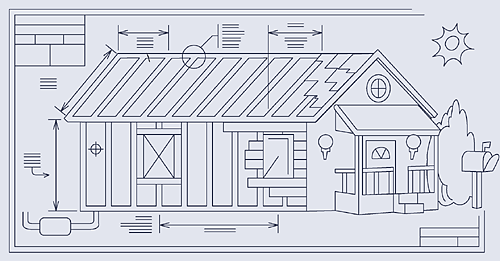

# Desarrollo de software #

Veremos en este apartado las características propias del software y de
la forma de desarrollarlo que lo hacen un elemento único, difícil de
comparar con ingenierías tradicionales como la construcción.

## Software ##

El software es un invento muy reciente de la humanidad. Fue a mitad
del siglo XX cuando se empezaron a utilizar los primeros computadores
electrónicos programables en organismos oficiales y grandes
empresas. Y los primeros lenguajes de programación de alto nivel
(FORTRAN y Lisp) se desarrollaron a finales de los años 50 (ver
detalles en
[https://github.com/domingogallardo/historia-computadores](https://github.com/domingogallardo/historia-computadores)). 

La programación, por tanto, es una profesión relativamente joven con
poco más de 60 años. Todavía están vivos (¡y activos!)
algunos programadores que trabajaron con los primeros computadores como
[Donald Knuth con el IBM
650](https://catonmat.net/donald-knuths-first-computer). Comparémoslo
con profesiones o disciplinas como medicina, física, derecho o
arquitectura, todas ellas con cientos de años de antigüedad.

Podemos decir que el software es el invento más importante y
complicado de la historia de la humanidad. El software ha conquistado
el mundo y está presente en todos los aspectos de la vida actual. El
entretenimiento, la medicina, la economía, etc. dependen cada vez más
de complejos sistemas de software desarrollados y mantenidos por
ingenieros/as como vosotros/as. Detrás de cualquier sistema de
software está un conjunto de personas que ha tenido que interactuar,
decidir, entender y modificar decenas de miles de líneas de código.

Conoces innumerables sistemas software de todo tipo: Instagram,
Android, iOS, Netflix, Chrome, Gmail, Meet, Excel, Word, Radar COVID y
un largo etcétera. 

Algunos ejemplos de sistemas software que vamos a usar en algún
momento en la asignatura:

- Sistema de **gestión académica** de un centro educativo: sistema con el
  que los estudiantes pueden matricularse, consultar horarios,
  consultar expediente, etc.
- **Quiosco de consulta** para una tienda estilo Fnac: sistemas con el que
  los clientes pueden consultar productos y buscar su ubicación.
- Sistema de gestión de **flotas de ambulancias**: sistema con el que se
  puede controlar la ubicación de las ambulancias y gestionar
  trayectos de las mismas.

Hoy en día, gracias a servicios como GitHub, podemos echar un vistazo
al código de muchos de estos sistemas software y a su
evolución. Algunos ejemplos:

- [CartoDB](https://github.com/CartoDB/cartodb). Software español para representación visual de datos geográficos.
- [Guice](https://github.com/google/guice). Framework de inyección de dependencias en Java.
- [swift-nio](https://github.com/apple/swift-nio). Framework asíncrono de entrada-salida en Swift.
- [Spring Boot](https://github.com/spring-projects/spring-boot). Framework web en Java
- [Swift](https://github.com/apple/swift). Compilador y librería
  stándar de Swift. Escrito en C++ y Swift.

## Metáforas ##

Cuando queremos explicar algo complejo, muy a menudo usamos
metáforas. Las metáforas permiten relacionar conceptos desconocidos
con situaciones usuales ya vistas y nos permiten arrojar nueva luz
sobre estos conceptos desconocidos (¡esto ha sido una metáfora!).

En la metáfora anterior lo desconocido lo comparamos con una
habitación a oscuras que podemos explorar con la luz con una
linterna. La metáfora nos da una indicación de en qué consiste el
proceso de investigar algo. Mediante ella nos damos cuenta de la
importancia de la dirección en la que estamos apuntando la linterna y
de la necesidad moverla en varias direcciones. La metáfora nos lleva
entonces a pensar que para conocer algo desconocido hay que estudiarlo
desde distintos puntos de vista, siempre cambiando el detalle de lo
que estamos estudiando, hasta poder conocerlo en su totalidad (haber
iluminado toda la habitación).

La metáfora anterior puede o no ser correcta. Lo importante es que al
formularla hemos tenido una representación de algo desconocido (el
proceso de investigar) basada en algo conocido (explorar una
habitación oscura con una linterna). Y esa es muy importante, porque
nos representación nos lleva a tomar acciones y decisiones reales que
podrían haber sido distintas si hubiéramos usado otra metáfora
(explorar distintos aspectos del problema a resolver, en lugar de
centrarnos en un aspecto concreto y profundizar en él).

### Metáforas en la cultura de las organizaciones ###

Las metáforas son una parte importante de la cultura de una
organización. Una cultura proporciona un conjunto de reglas invisibles
que todos cumplimos de forma casi automática. Estas reglas
proporcionan un contexto común y favorecen que todos nos movamos en
una dirección similar.

Las metáforas, expresiones o giros del lenguaje proporcionan uno de
los elementos básicos de la cultura de la organización.

Por ejemplo, una organización centrada en la competición y con una
dinámica combativa con sus adversarios utilizará metáforas
relacionadas con la guerra o los deportes:

> "Hemos ganado este combate"  
> "Nos lo jugamos todo en esta campaña"  
> "Es una oportunidad de vida o muerte"  

Sin embargo, una organización orientada a la cooperación y al
planteamiento de situaciones de "win-win" en las negociaciones
utilizará otro tipo de metáforas:

> "Hemos coreografiado perfectamente la puesta en marcha del producto"  
> "Todos debemos participar en este viaje"  
> "Nuestro ecosistema premia la lealtad de nuestros clientes"  

Escoger las metáforas correctas es, por tanto, fundamental para
establecer una cultura, un estilo común de trabajo en el equipo o en
la empresa.

### Metáforas de desarrollo de software ###

¿Por qué es interesante hablar de metáforas para referirnos al
software? Porque podemos utilizarlas para crear una cultura, una
visión, sobre nuestro trabajo, aplicable tanto a los compañeros del
equipo como a los managers y directivos con los que interactuamos.

El hablar sobre metáforas del desarrollo de software nos sirve también
para argumentar en contra de prejuicios o metáforas erróneas que se
pueden tener a priori. Metáforas que nosotros sabemos que no son
correctas, pero que están muy implantadas en la mentalidad de mucha
gente.

Veamos un listado de las metáforas que se han ido utilizando para el
desarrollo de software. Podemos encontrarlas en muchos sitios. En el
libro de Steve McConnell [_Code
Complete_](https://learning.oreilly.com/library/view/code-complete-second/0735619670/),
se dedica un capítulo completo a hablar de ellas.

> "A confusing abundance of metaphors has grown up around software
> development. David Gries says writing software is a science
> (1981). Donald Knuth says it's an art (1998). Watts Humphrey says
> it's a process (1989). P. J. Plauger and Kent Beck say it's like
> driving a car, although they draw nearly opposite conclusions
> (Plauger 1993, Beck 2000). Alistair Cockburn says it's a game
> (2002). Eric Raymond says it's like a bazaar (2000). Andy Hunt and
> Dave Thomas say it's like gardening. Paul Heckel says it's like
> filming Snow White and the Seven Dwarfs (1994). Fred Brooks says
> that it's like farming, hunting werewolves, or drowning with
> dinosaurs in a tar pit (1995). Which are the best metaphors?" 

Entre las metáforas más usadas se encuentran las siguientes.

#### Escritura ####

</img>

El software es algo que debe ser escrito y leído, de forma similar a
como escribimos una carta, un libro o un manual de instrucciones. 

Esta metáfora se lleva al extremo por los practicantes de [_literate
programming_](https://en.wikipedia.org/wiki/Literate_programming), un
paradigma de programación en el que el código queda embebido en una
explicación en lenguaje natural del problema que se está
resolviendo. Donald Knuth fue el fundador de este paradigma con su
libro _Literate programming_.

Elementos positivos de esta metáfora es que resalta el que el código
debe ser legible y entendible por los compañeros. El código se escribe
para las personas y no sólo para los computadores. Tan importante como
escribir el código es leerlo después. De hecho, para poder modificar
código debemos entenderlo, y para entenderlo debemos leerlo, hablar
sobre él, etc.

La metáfora no representa bien el carácter colectivo del desarrollo de
software. Habitualmente la escritura es un hecho individual, mientras
que el desarrollo es una labor de equipo. Tampoco comunica
correctamente el carácter evolutivo y cambiante del software. Cuando
un libro se termina de escribir muy raramente se modifica. Quizás sí
se hace en una siguiente edición de un manual de usuario o un libro
técnico, pero eso conlleva otra vez meses de esfuerzo. En el caso del
software es cambio es continuo y de un día para otro. Además el software se
escribe apoyándose en otro software que previamente se ha
desarrollado y depende de él. Estas dependencias tampoco se recogen en
la metáfora.
  
#### Jardinería ####

</img>

En su libro [The Pragmatic
Programmer](https://learning.oreilly.com/library/view/the-pragmatic-programmer/9780135956977)
David Thomas y Andrew Hunt repasan la metáfora de la jardinería.

> "Software is more like gardening—it is more organic than concrete."

El crecimiento y cuidado de un jardín es algo orgánico. Se plantan
inicialmente todas las cosas de acuerdo a un plan. Algunas de las
plantas crecen bien pero otras no, y las destinamos a compost. Podemos
mover las plantas y recolocarlas, para aprovecharnos de las relaciones
entre ellas, de las luces y las sombras, del viento y la
lluvia. Tenemos que podar o separar las plantas que crecen
demasiado. Y podemos recolocarlas también por motivos estéticos, para
combinar mejor los colores. Recogemos las semillas y fertilizamos las
zonas que necesitan ayuda extra. Continuamente monitorizamos la salud
del jardín, y hacemos ajustes (a la tierra, las plantas, la
disposición) conforme se necesita.

La metáfora recoge bien los aspectos evolutivos del software, pero no
la escala temporal. El desarrollo de software es mucho más dinámico y
rápido que el crecimiento del jardín. 

A priori podría ser difícil encontrar una correspondencia entre la
parte parte del crecimiento orgánico del jardín (semillas y plantas
que crecen por si mismas, en configuraciones poco predecibles) y el
desarrollo de software. El software no crece si se deja solo. ¿Y qué
es el viento, la lluvia o las problemas de la naturaleza? En el
desarrollo de software tenemos todo controlado (hacemos tests) y no
dependemos elementos externos. 

¿De verdad es así? ¿Está todo controlado? Si pensamos de esta forma
nos estamos olvidando del elemento fundamental del desarrollo de
software: los usuarios finales. Cuando dejamos el software
desarrollado en sus manos lo van a utilizar como ellos mejor sepan. Lo
van a intentar introducir en sus procesos de trabajo ya
consolidados. Y el software les va a proporcionar valor o no
dependiendo de lo bien que se adapte a esos procesos.

Los usuarios finales son el viento, la lluvia, las fuerzas de la
naturaleza del jardín. La única forma de saber si el software va a
proporcionarles valor es dejarlo crecer entre ellos. La metáfora del
jardín no es tan descabellada como parecía al principio.

#### Crecimiento por acreción ####

</img>

Una metáfora poco conocida, pero que da bastante juego, es representar
el desarrollo de software como la formación de una perla dentro de una
ostra. La perla se forma dentro de una ostra por acreción. Va
creciendo a base de añadir material a un grano de arena que se
introduce en la ostra. Al final se forman un conjunto de capas que van
rodeando el núcleo inicial.

De forma similar, podemos ver el desarrollo de software como una tarea
incremental en la que se van añadiendo funcionalidades a un núcleo
central inicial. Es lo que se denomina desarrollo evolutivo o
incremental. Primero se desarrolla un esqueleto que trabaja con datos
de prueba y después se van añadiendo los músculos y la piel, los
detalles exteriores con los que el usuario interactúa. Los datos
de prueba se convierten en datos reales y ya tenemos un sistema real que
puede ponerse en producción.

Un elemento que no recoge bien esta metáfora es que en un sistema
software real tenemos que construir muchas "perlas". Conforme
extendemos el sistema debemos ir ampliando también las funcionalidades
proporcionadas por el esqueleto, añadiendo nuevos elementos centrales
que deben interactuar con los ya existentes.

#### Construcción ####

</img>

Una de las metáforas más usadas es la construcción. Desarrollar
software es como construir una casa. Hablamos de "construir software",
de "hacer una estructura resistente", de "planos con el diseño de las
características" o de "arquitectos de software".

El proceso de construcción de una casa se puede simplificar en los
siguientes pasos: 

1. El arquitecto diseña los planos con todo detalle.
2. Los albañiles, fontaneros, electricistas, etc., dirigidos por el
   arquitecto técnico, construyen todos los elementos del edificio de
   acuerdo con los planos proporcionados.
3. Los propietarios se mudan al edificio, viven felices y, si detectan
   algún problema, llaman a mantenimiento para arreglarlo.

Esta es una metáfora que ha causado mucho daño al desarrollo de
software. El modelo de cascada (_waterfall_) parte de esta
metáfora. Según este enfoque, el desarrollo de software es como
cualquier otra ingeniería tradicional en la que el esfuerzo más grande
hay que hacerlo en la fase inicial de diseño. La fase de construcción
del producto (implementación) se hace una vez que se ha concluido todo
el diseño y consiste en seguir al pié de la letra los diagramas UML
que detallan todo el diseño. El trabajo de los desarrolladores es
un trabajo nada creativo porque todo el diseño ya se ha hecho de
antemano. Solo tienen que pasar a código los diagramas y diseños que
han realizado los "arquitectos de software". Y al final hay una fase
de mantenimiento en la que se arreglan los problemas que detectan los
usuarios cuando empiezan a usar el software.

El problema de este enfoque es que la mayoría del software que se
desarrolla no es así. Veremos más adelante una argumentación de Martin
Fowler que critica este enfoque.

</img>

A pesar de esto, la metáfora tiene cosas buenas. Construir software
conlleva realizar una planificación, una preparación y una
ejecución. Similar a construir algo. También, igual que hay distintos
tamaños y alcances en los sistemas de software hay distintos tamaños y
alcances en las construcciones. No es lo mismo construir un edificio
de 10 plantas, que una casa de campo en una parcela, que una caseta
para el perro. Si nos equivocamos al construir una caseta para el
perro y se nos olvida hacer la puerta, podemos rehacerlo todo sin
problemas. Sólo habremos gastado una tarde. En el caso de un proyecto
más grande hay que tener mucho más cuidado en que los fundamentos y
estructuras sean sólidas y extensibles.

Otras cosas interesantes de la metáfora es la distinción entre
estructura y forma. Un edificio tiene elementos estructurales como
cimientos, vigas, pilares, muros, etc. sobre los que se construyen los
aspectos más visibles como azulejos, pintura, ventanas, etc. En el
caso del software, tenemos también elementos estructurales, código que
no es visible para los usuarios, y elementos visibles como la interfaz
de usuario o el comportamiento de las funcionalidades.

La diferencia entre construcción y software es que podemos modificar
ambos tipos de elementos al mismo tiempo. En construcción una vez
realizada la estructura es difícil que sea modificable. En el
desarrollo de software, sin embargo, no solo podemos, sino que debemos
realizar cambios en la estructura para hacerla más flexible y para que
podamos introducir más fácilmente nuevos cambios en el futuro. Es lo
que denominamos refactorizar.

Una cosa poco reconocida en la arquitectura son las modificaciones
continuas que se producen en los edificios. Un hilo muy interesante de
Geoffrey Litt reseña el famoso libro ["How buildings
learn"](https://twitter.com/geoffreylitt/status/1272542423001022467)
de Stewart Brand. Los paralelismos entre el software y la evolución de
los edificios son notables. La diferencia está en la escala
temporal. Vemos a la derecha la evolución de una mansión construida en
1765 y su evolución durante 50 años. Y lo ideal es que estos cambios
sean determinados por el uso de los propios habitantes del
edificio. Como dice Brand:

> ""Age plus adaptivity is what makes a building come to be loved. The
> building learns from its occupants, and they learn from it."

¿Os suena a algo?

A pesar de ser una metáfora que tiene elementos interesantes, la
metáfora de la construcción falla en el aspecto de no recoger el
carácter único del software como algo fácilmente modificable. El
software es mucho más moldeable que cualquier otro material. Cambiar
software es mucho más fácil que cambiar un tablón, o unos ladrillos, o
unas tuberías. Esta flexibilidad del software es la que permite
enfoques de construcción alternativos que no pueden ser usados en la
construcción ni en otras ingenierías tradicionales.

#### Otras metáforas  ####

Otras metáforas se corresponden con otros aspectos del desarrollo de
software no contemplados en las anteriores. 

Por ejemplo la metáfora de que hacer software es como **hacer una
película de cine**. Con esta metáfora se enfatiza el aspecto creativo
y multidisciplinar del desarrollo de software. Igual que para hacer
una película es necesario coordinar el trabajo de múltiples
profesionales técnicos y creativos (guionistas, actores, cámaras,
vestuario, sonido, etc.), para hacer un buen producto software es
necesario combinar también el trabajo de especialistas y
diseñadores. Un problema de esta metáfora es que tiene un desarrollo
similar al modelo de cascada y que cuando una película se termina no
se vuelve a modificar. Sin embargo, la forma ágil de desarrollar
software es entregando continuos incrementos y evolucionando el producto.

Otra metáfora es la **realización de una publicación periódica** como
una revista. Cada semana o cada mes se entrega un nuevo ejemplar de la
publicación, con nuevo contenido que es consumido por el
lector. Podemos encontrar un parecido con las entregas que se realizan
al cliente al final de cada iteración. En estas entregas se incorporan
al producto nuevas funcionalidades que deben ser probadas por los
usuarios, de forma similar al nuevo contenido de la revista.

Una última metáfora muy interesante es la de Alaistair Cockburn que en
su libro [_Agile Software Development: The Cooperative
Game_](https://learning.oreilly.com/library/view/agile-software-development/0321482751/)
define el desarrollo de software como un **juego cooperativo** dirigido a
conseguir un objetivo y realizado en grupo. El juego consiste en
resolver un problema de invención y comunicación. Los desarrolladores
trabajan en un problema que no entienden completamente, en el que
están incluidos emociones, deseos y opiniones y que cambian conforme
el juego avanza. Los jugadores deben:

- Entender el espacio del problema
- Imaginar un mecanismo que soluciona el problema en un espacio de
  tecnología viable
- Expresar la construcción mental de la solución en un lenguaje
  ejecutable y construirla en equipo

El elemento principal de este juego son las ideas de la gente y la
comunicación de estas ideas entre los participantes y al computador.

Se trata de una metáfora muy interesante centrada en el proceso de
entender el dominio del problema a resolver y de crear la solución
poco a poco. Quizás es una metáfora algo abstracta y no tiene en
cuenta muchos elementos concretos relacionados con el cómo se pone en
práctica ese modelo y cómo se realizan las correcciones,
modificaciones y adaptaciones. Tampoco se distingue en el juego las
diferencias entre las partes estructurales de la solución y las partes
más orientadas a obtener una conducta específica en esa solución.

#### Ninguna metáfora es completa ####

Cada metáfora resalta unas características del desarrollo de software
y ninguna recoge completamente todas ellas. Por eso es importante
conocerlas todas y conocer sus ventajas e inconvenientes. 

También podremos conocer en qué tipo de empresa o equipo de desarrollo
estamos dependiendo de las metáforas que utilizan. Y podremos ser
críticos si nos damos cuenta de que se utilizan de más las metáforas
incorrectas en nuestro entorno. En ese caso podremos hacerlo notar y
ofrecer metáforas alternativas que sirvan para corregir posibles
sesgos en la percepción del cómo debería ser nuestro trabajo como
desarrolladores. 

El problema en encontrar la metáfora perfecta se debe a que el
software es algo único y tiene características que no son comparables
a ninguna otro producto previamente inventado por la humanidad. El
software es fácilmente maleable, modificable. Se construye de forma
colectiva, incremental. Para su construcción se combinan elementos
externos (librerías de terceras personas) con elementos estructurales
creados por nosotros y elementos de conducta que definen la
interacción del mismo con los usuarios. Es ejecutable y usado por
personas, creando sistemas complejos de interacción entre máquinas y
humanos. Y, por último, también es publicable en sistemas como GitHub,
en donde podemos leer y estudiar la organización y las líneas de
código del sistema.

La característica de que el software es fácil de cambiar es positiva
porque permite un modelo de desarrollo único basado en iteraciones
cortas, evoluciones y adaptación de cambios cuando se reciben _feedback_
de usuarios. Pero la facilidad de modificación también tiene elementos
negativos: _bugs_ introducidos a posteriori, confusiones debidas a
problemas de comunicación, etc.

La posibilidad de cambio fue abrazada desde el principio por
metodologías como XP y hoy en día cada vez más herramientas asumen
característica y proporcionan funcionalidades orientadas a gestionar
correctamente la evolución del software. Por ejemplo, los sistemas de
controlo de versiones como Git permiten desarrollar software en
equipo usando _commits_, ramas, versiones, solicitud de incorporación
de cambios (_pull requests_), etc. O los IDEs tienen herramientas que
permiten analizar qué sucede si cambiamos una declaración de una
variable o una definición de una función: podemos consultar todos los
sitios donde se usa esa función y sus conexiones con otros módulos.

En resumen, podríamos decir que el desarrollo de software es la
actividad humana más compleja existente. Más que pilotar un avión,
hacer un diagnóstico médico o diseñar un edificio. Por eso tiene esa
gran cantidad de metáforas asociadas. Y seguro que seguirán
planteándose nuevas.

## El desarrollo de software no es una ingeniería tradicional ##

Hemos visto los problemas para capturar las características especiales
del software y su desarrollo. ¿Qué es lo que hace al desarrollo de
software especial? ¿Por qué es tan difícil construir el producto
correcto y desarrollarlo? ¿Por qué no podemos aplicar las técnicas
aprendidas en ingenierías tradicionales, como la construcción? Ya
hemos visto algunas ideas en los apartados anteriores. Vamos a
intentar responder a continuación estas preguntas con más detalle.

### El desarrollo de software es una actividad creativa ###

En 1986, hace más de 30 años, Fred Brooks escribió un artículo que se
convertiría en clásico: "No Silver Bullet"

Brooks considera que el diseño de software es una actividad creativa
que se puede dividir en dos partes: lo esencial y lo accidental. Lo
esencial es la formulación mental de las construcciones conceptuales
necesarias para el sistema. Lo accidental, en el sentido de
secundario, es la implementación de estas construcciones conceptuales
en un lenguaje de programación y hardware concreto.

Por ejemplo, en el caso de un sistema software de gestión de
ambulancias un elemento central van a ser los sensores de posición que
tengamos en las ambulancias. ¿Cómo van a transmitir esos sensores de
posición su posición al sistema? Tenemos aquí un problema en el que
queremos que múltiples sensores, quizás decenas, envíen peticiones
periódicas a un servidor para actualizar un dato. ¿Las peticiones van
a ser procesadas usando un sistema de eventos? ¿O serán simples
peticiones a un endpoint REST? ¿Qué pasa si una petición falla?
¿Guardamos en el sensor un histórico de las últimas n posiciones y las
comunicamos de golpe o las comunicamos una a una?

Todas estas son decisiones que tenemos que tomar que están
relacionadas con la esencia del problema que queremos solucionar. En
otro caso serán decisiones relacionadas con datos. ¿Qué datos
debemos guardar para poder gestionar correctamente la información? O
con lógica de negocio. Por ejemplo, en un sistema de gestión
académica, cuando un estudiante se matricula ¿cómo decidir si asignar
un estudiante a un grupo a otro?. 

Lo accidental es la implementación de estas decisiones en un sistema
software concreto. Dependiendo de si estamos usando Spring Boot con
Java o .NET deberemos codificar estas decisiones en una plataforma u
otra.

Brooks argumenta que el cuello de botella que nunca se podrá reducir
en el desarrollo de software es el relacionado con la parte
esencial. La parte accidental sí que podrá mejorar con mejores IDEs,
más capacidades de hardware o mejores lenguajes de programación. Pero
estas mejoras no van a aumentar en un orden de magnitud el desarrollo
de software. No vamos a poder hacer 10 veces más software que antes
porque usemos mejores IDEs o mejores lenguajes de
programación. Sencillamente porque tenemos que dedicar una parte
importante del tiempo a resolver problemas esenciales y no este tiempo
no se puede reducir con las mejoras en los elementos accidentales.

### El desarrollo de software no es predecible ###

## Movimiento open-source ##

La aparición del movimiento de código abierto [a mediado de los años
90](https://en.wikipedia.org/wiki/History_of_free_and_open-source_software)
supuso un punto de inflexión en el desarrollo de los sistemas
software. Hasta entonces los sistemas de software eran sistemas
cerrados, gestionados por equipos de desarrollo altamente
jerarquizados, con procesos rígidos y un alto porcentaje de fallos. 

El movimiento de código abierto demostró que era posible crear de
forma distribuida y auto-organizada complejos sistemas de software con
decenas de miles de líneas de código como sistemas operativos ([Linux](https://en.wikipedia.org/wiki/Linux)),
editores de texto extensibles con un lenguaje de programación incluido
([Emacs](https://en.wikipedia.org/wiki/Emacs)) o bases de datos ([MySQL](https://en.wikipedia.org/wiki/MySQL)).

## Referencias ##

