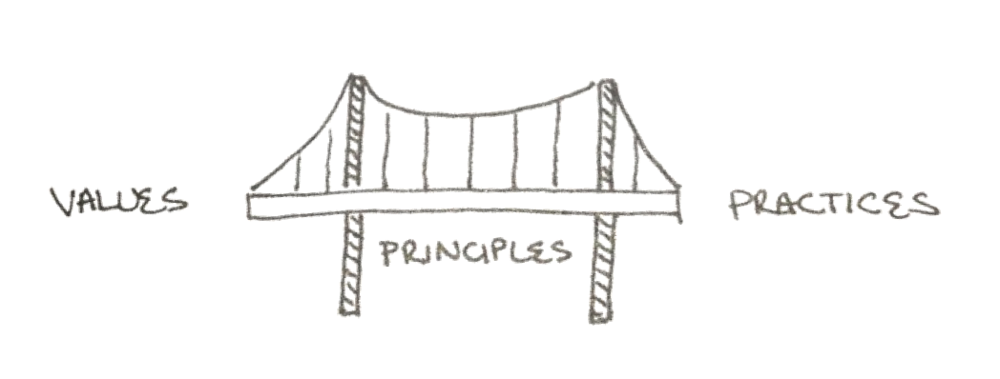
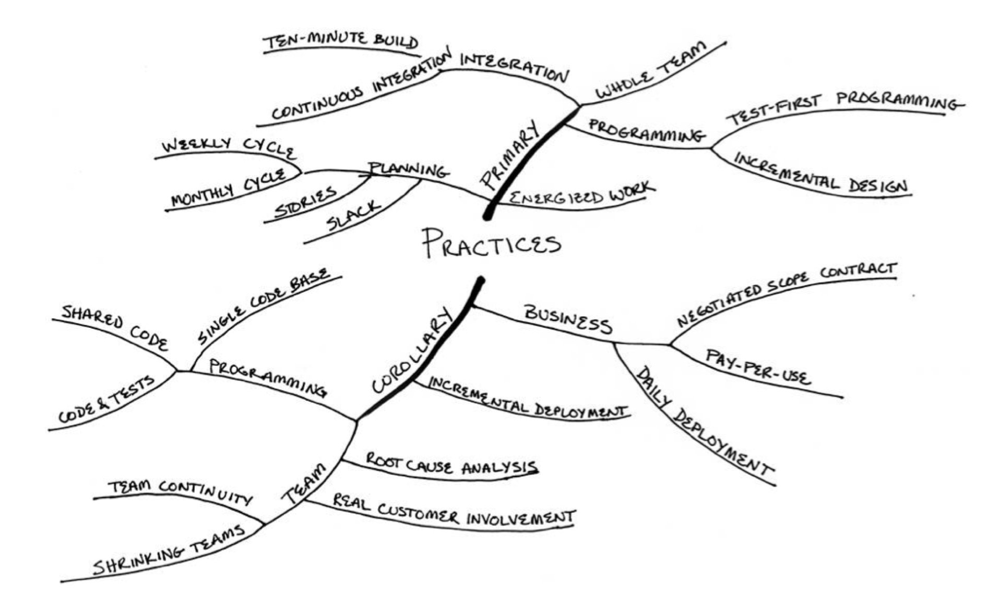
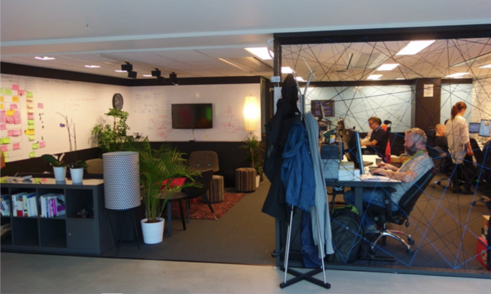
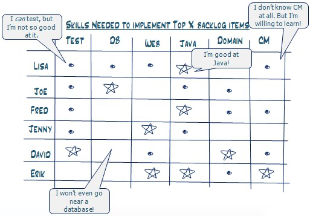
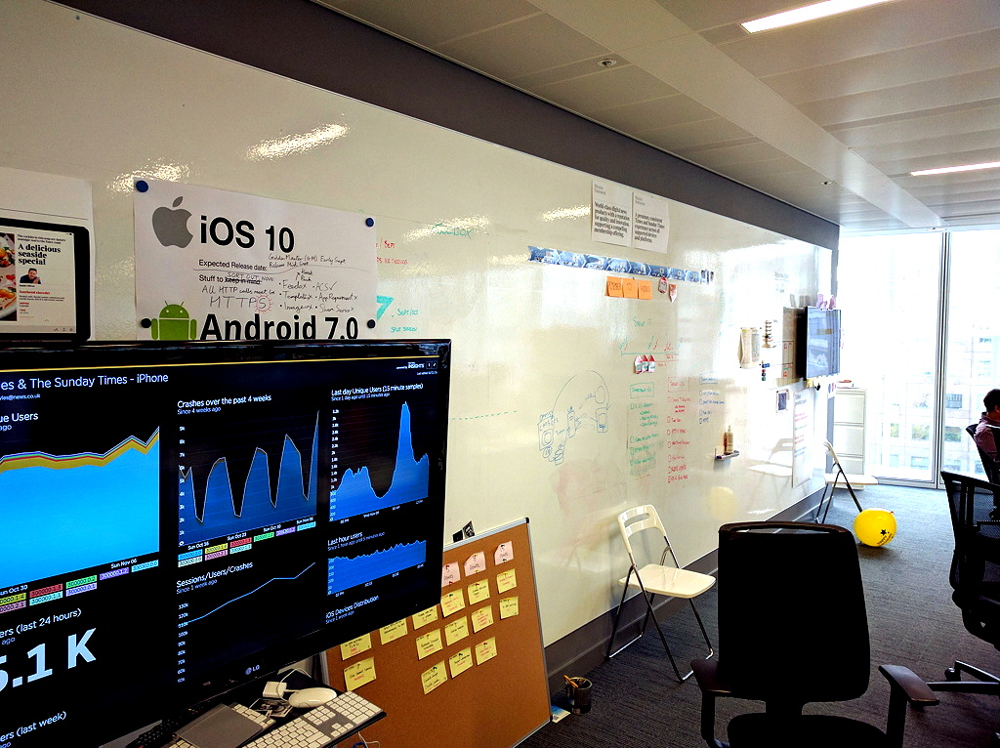
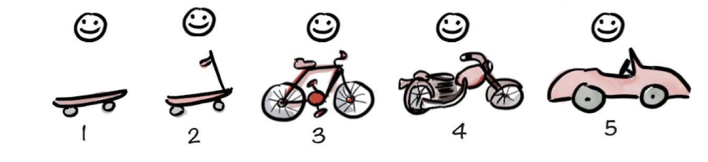
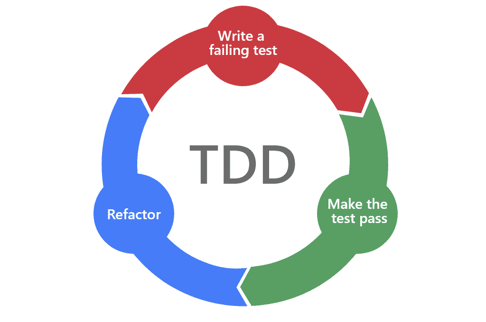
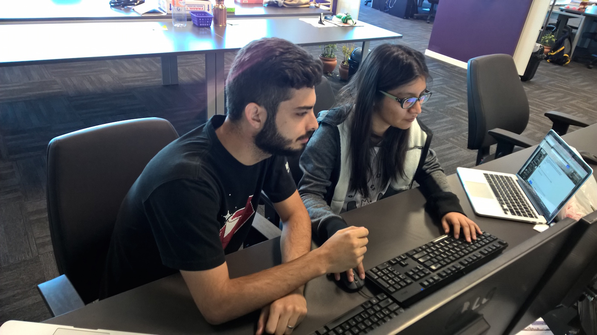
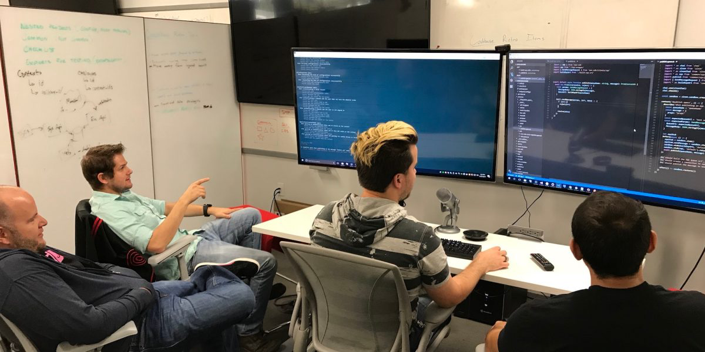
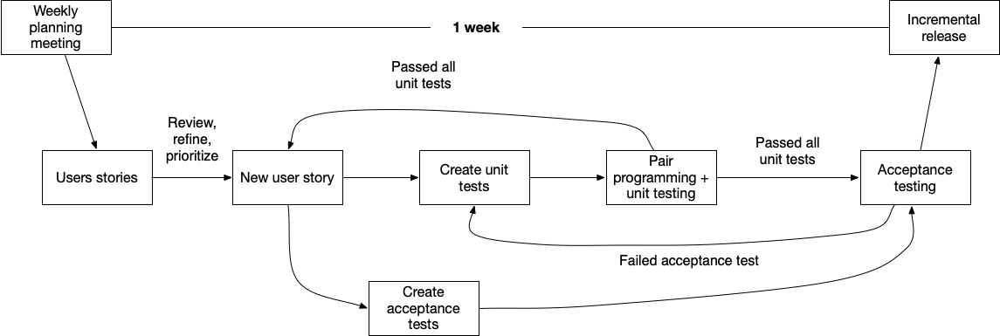

# eXtreme Programming #

## Historia de XP ##

El origen de Extreme Programming (XP) se encuentra en la comunidad
Smalltalk, en particular en la colaboración entre Kent Beck y Ward
Cunningham a finales de los 80 en temas relacionados con el diseño y
programación orientada a objetos. Por ejemplo, en 1989, publicaron el
artículo [A laboratory for teaching object-oriented
thinking](https://citeseerx.ist.psu.edu/viewdoc/summary?doi=10.1.1.129.4074)
en el que introducen las tarjetas CRC para definir las
responsabilidades de las clases en un diseño orientado a objetos.

En 1996 Kent Beck comenzó a trabajar en el Chrysler Comprehensive
Compensation System ([proyecto C3](https://www.martinfowler.com/bliki/C3.html), en el que conoció a
Ron Jeffries. Se trató de un proyecto de gestión Chrysler que se
hizo famoso no por terminarse con éxito (fue cancelado en 1999) sino
por considerarse el proyecto en el que nació XP.

El proyecto comenzó realmente en 1993, como un intento de reemplazar y
unificar numerosos sistemas de nóminas _legacy_ basados en
COBOL. Martin Fowler comenzó a participar en él como consultor en esta
época. En 1995 se tomó la decisión de reescribir todo el sistema en el
lenguaje de programación Smalltalk y Kent Beck tomó la dirección del
proyecto. Allí puso en acción todas las prácticas que después tomaron
el nombre de _Extreme Programming_ (aunque había utilizado enfoques
similares en proyectos previos). Beck contó también con la
colaboración de Ron Jeffries en el equipo. Ron fue también otro autor
del manifiesto ágil y de numerosas publicaciones relacionadas con XP y
metodologías ágiles.
  
El software se puso en producción en 1997, realizando la gestión de
nóminas de alrededor de diez mil personas. El proyecto continuó,
intentando cubrir al resto de empleados, pero terminó fracasando y se
detuvo el desarrollo en 1999 (volviéndose a poner en funcionamiento el
sistema _legacy_ en COBOL). Para esa fecha las prácticas XP ya se
habían popularizado y habían demostrado su éxito en otros proyectos (a
pesar de que, paradójicamente, su proyecto inicial terminara
fracasando).

En 1999 Kent Beck recopila todas sus ideas sobre XP en su primera
edición del "libro blanco" de Extreme Programming, en el que establece
el conjunto de valores, principios y prácticas iniciales de XP.

La metodología se vuelve muy popular a finales de los 90, siendo la
metodología ágil más popular al final de la década. De hecho, de las
17 personas que elaboran el manifiesto ágil en 2001, 6 provenían de la
filosofía de XP.

A comienzos del 2000, Ward Cunningham pone en marcha una
[wiki](https://en.wikipedia.org/wiki/Wiki) en la que colabora la
comunidad XP para ir agregando ideas sobre la metodología y sus
prácticas. El resultado es un poco desordenado, pero tiene interés
histórico y sigue manteniéndose abierto en la actualidad (aunque
deshabilitada la posibilidad de edición). Por ejemplo,
se puede hacer una vistia a la [página con el de sobre Extreme
Programming](http://wiki.c2.com/?ExtremeProgrammingRoadmap).

A mediados del 2000, en 2004, Kent Beck publica la segunda edición de
su libro. Esta nueva edición contenía una versión más estructurada y
madura de la metodología. En la primera edición se definían 12
prácticas principales que en la segunda se modifican y se convierten
en 13 (distintas de las anteriores) y se suman 11 prácticas
secundarias. Algunos autores hablan de XP1 y XP2.

Las fechas de publicación de estos dos libros (finales de 1990s y
principios de 2000s) fueron el punto álgido del interés y la adopción
de XP. A partir aquí la metodología pierde popularidad y en la última
década y media ha sido sustituida por Scrum, una metodología más
general (menos orientada a desarrollo de software) que tiene roles y
ceremonias más establecidos y fáciles de replicar.

Sin embargo, paradójicamente, el interés por las prácticas XP no ha
dejado de crecer. Prácticas como el test driven development (TDD), la
refactorización, la integración continua o el pair programming son
cada vez más populares, aunque las encontramos en el marco de otras
corrientes como el [software
craftmanship](https://en.wikipedia.org/wiki/Software_craftsmanship).

De hecho, en el último informe sobre adopción de metodologías ágiles
[14th Annual State of Agile
Report](https://stateofagile.com/#ufh-i-615706098-14th-annual-state-of-agile-report/7027494)
en la lista de prácticas más populares (imagen derecha) aparecen
bastantes promovidas por XP: 

- Continuous integration (55%), 
- Refactoring (43%)
- Continuous delivery (41%)
- Pair programming (31%)
- Test Driven Development (30%)
- Collective Code Ownership (29%)

<table markdown="1">
<tr><td>

**Dos ediciones con bastantes diferencias**

La primera y la segunda edición del libro de Kent Beck _Extreme
Programming Explained_ tienen cambios notables. La primera edición fue
escrita antes del manifiesto ágil y con la idea de ser un texto
fundacional. Las prácticas son más específicas y orientadas a la
programación.

La segunda edición se escribió 5 años después, en 2004, y en ella se
modifican algo las prácticas, incluyendo más elementos humanos y de
dinámica de equipo, y reduciendo algo las orientadas a la
programación. Quizás Beck intentaba competir con Scrum, que ya estaba
extendiéndose mucho más que XP.

Es un ejercicio interesante leer ambas versiones y reflexionar sobre
cómo la primera versión se convirtió en la segunda. Cómo se han
modificado algunos nombres de algunas prácticas, o se ha dividido en
dos lo que originalmente era una única práctica (o viceversa).

Ambas formulaciones son compatibles y, de hecho, es recomendable
verlas como complementarias. En la sesión vamos a utilizar
principalmente la segunda edición, aunque incorporando elementos de la
primera.

</td></tr></table>

## Introducción rápida a XP ##

XP es una metodología ágil orientada específicamente al desarrollo de
software, no ofrece demasiadas soluciones para otras áreas cómo
gestión del portfolio, operaciones, marketing o ventas.

Tiene una especificación más ligera que otras metodologías
como Scrum, en donde se definen un conjunto muy detallado de
artefactos, roles y ceremonias. En XP se intenta hacer sólo lo que es
necesario para crear valor para el cliente.

### Prácticas de XP ###

El elemento central de XP son sus prácticas. En los siguientes
párrafos resumimos cómo sería el trabajo de un equipo de desarrollo
usando estas prácticas.

- Un desarrollador trabajando con XP participará en un equipo que se
siente unido, que trabaja en un espacio común con paredes llenas de
esquemas, fichas, y elementos informativos y que desarrolla su faena a
pleno rendimiento, trabajando de forma sostenida y sin presión ni
agobios.

- El equipo diseña el software escribiendo en tarjetas (denominadas
_historias_) las nuevas funcionalidades a implementar usando un
lenguaje de negocio común. El equipo construye la aplicación usando un
enfoque iterativo y evolutivo, basado en un diseño incremental.

- Semanalmente los clientes definen las historias y se añaden a la
aplicación, definiendo primero los tests que deben cumplir y
trabajando en parejas para escribir el código que hace pasar esos
tests. Continuamente se compila la aplicación, se integra y se pasan
todos los tests, en un proceso que debería ser muy rápido (menos de 10
minutos). 

- Cada tres meses se reflexiona sobre la dirección global del proyecto,
estableciendo nuevas prioridades y analizando posibles mejoras en el
proceso. 

### Resultado de aplicar XP ###

Mediante el uso de XP podremos:

- Reducir el riesgo del proyecto.
- Mejorar la respuesta antes cambios en el negocio.
- Mejorar la productividad a lo largo de toda la vida del software.
- Hacer más divertido el trabajo del equipo construyendo el software.
- Adaptarnos mejor a requisitos vagamente formulados o que cambian en
  el tiempo.

XP es un intento de reconciliar humanidad y productividad. Tan
importante son las habilidades humanas como las técnicas. Una buena
técnica promueve relaciones basadas en la confianza. Kent Beck dice
que su terror a los deadlines desapareció cuando aprendió la siguiente
lección:

> "No es mi tarea gestionar las expectativas de otras personas. Es
> tarea de las otras personas manejar sus propias expectativas. Mi
> tarea es hacerlo lo mejor posible y comunicar claramente."

Lo peor que le puede pasar a un equipo de software es que el proyecto
en el que está trabajando se cancele y no se entregue después de haber
estado trabajando en él durante semanas. 

Las técnicas de XP persiguen dar confianza y seguridad y permitir que
nos sintamos satisfechos de nosotros mismos porque hemos dado lo mejor
para evitar que eso pase.

## Valores ##

En su libro _Extreme Programming Explained (Second edition)_ Kent
Beck expone la metodología usando el esquema tradicional de primero
formular los valores, después los principios, y después enumerar las
prácticas.

Los valores ayudan a guiar al equipo. Los valores recuerdan al equipo
por qué se hacen ciertas prácticas. Sin valores, un equipo puede caer
en el
[cargo-cult](https://en.wikipedia.org/wiki/Cargo_cult_programming),
por el que se realizan acciones de forma religiosa sin entender por
qué se hacen. 

Los valores que define son los siguientes:

- **Comunicación**: las prácticas de XP promueven comunicación abierta
	y honesta entre el equipo, gerencia y los clientes. Los equipos
	XP prefieren una comunicación abierta y transparente.

- **Simplicidad**: mantener el código y el diseño tan simple como sea
	posible incrementa la claridad, comprensibilidad, extensibilidad y
	mantenibilidad del sistema.
Las soluciones simples a menudo
	requieren menos comunicación que las complejas. 
    
    En el contexto de XP, Kent Beck define un sistema simple como
    aquel que: 
    
    - Pasa todos los tests
    - Proporciona todas las funcionalidades
    - No tiene duplicación
    - Usa el mínimo número de clases y métodos

    

- **Retroalimentación**: sin una retroalimentación continua y honesta
  todo se desmorona. La retroalimentación es lo que mantiene a todo el
  mundo en sintonía. Es lo que permite que los desarrolladores
  entreguen el sistema que el cliente realmente quiere.

  
    En XP la retroalimentación aparece
    de muchas formas y en muchas escalas de tiempo. A nivel de minutos
    aparece cuando lanzamos los tests, después cuando hacemos pair
    programming, diariamente en las reuniones diarias o en cada
    iteración con la retroalimentación de los clientes.
  
- **Valentía**: Valentía es la acción efectiva frente al miedo. El
  miedo es algo que se sufre en el desarrollo de software. ¿Qué
  miedos pueden existir en el equipo de desarrollo?: 
  
    - Miedo a hacer algo mal, crear bugs. Sobre todo si estás
      escribiendo software que afecta a personas.  
    - Miedo a cambiar código, ya sea tuyo o de otros (código legacy o heredado).
    - Miedo a no poder terminar un proyecto en el que se ha invertido
      mucho trabajo (por ejemplo, un año) debido a que se cancele o a
      que nadie lo use. 

    La valentía se debe manifestar a veces en forma de acción,
	cuando conoces la solución a un problema. Otras veces en forma de
	paciencia. Si sabes que hay un problema pero no sabes cuál es, es
	necesario valentía para esperar a que el verdadero problema
	termine apareciendo.
La valentía para decir la verdad, sea o no
	placentera, promueve la comunicación y la confianza. La valentía
	para descartar soluciones parciales y buscar otras nuevas promueve
	la simplicidad. La valentía por buscar respuestas reales y
	concretas crea retroalimentación. 

- **Respeto**: Los anteriores cuatro valores apuntan a uno subyacente:
  respeto. Si los miembros de un equipo no se preocupan de los otros,
  sobre lo que están haciendo, XP no funcionará. Si los miembros de un
  equipo no se preocupan sobre un proyecto, nada puede salvarlo.
Nadie
  es intrínsecamente más valioso que ningún otro. Deben respetarse las
  contribuciones de todos. Yo soy importante y tú también. 

## Principios ##

Los principios guían al equipo a implementar los valores. Son ideas
más concretas que nos permiten escoger las mejores prácticas. Tanto
valores como principios justifican el por qué de las prácticas.

- **Humanidad**: Las prácticas que sigue un equipo deben satisfacer
  las necesidades humanas y proporcionar bienestar psicológico. Las
  necesidades que lista Beck son: seguridad básica, logro,
  pertenencia e intimidad. El equipo de desarrollo debe equilibrar las
  necesidades del individuo con las del equipo.

- **Economía**: Las prácticas que sigue el equipo debe balancear las
  necesidades de negocio con las técnicas. La gente que compra el
  producto es la que alimenta el negocio. El diseño y la entrega
  incremental permite al equipo entregar valor pronto y asegurar un
  valor económico al producto.

- **Beneficio mutuo**: Buscamos prácticas que beneficien a todas las
  partes en el momento presente. Una práctica que no beneficie al
  equipo ahora no es útil, por ejemplo escribir documentación para un
  futuro posible equipo de desarrollo. Las prácticas que dan beneficio
  mutuo nos ayudan ahora y en el futuro.

- **Auto-similitud**: Las prácticas que sigue un equipo pueden
  potencialmente adaptarse a diferentes contextos que comparten
  ciertas similitudes. Debemos intentar aplicar patrones conocidos a
  múltiples problemas.

- **Mejora**: Las prácticas que sigue un equipo evolucionan y mejoran
  a lo largo del tiempo. El objetivo de XP es la "excelencia en el
  desarrollo de software a través de la mejora". Es preferible empezar
  con algo imperfecto que esperar a la perfección.

- **Diversidad**: Las prácticas que sigue un equipo debería resolver
  los conflictos de forma productiva. "Dos ideas sobre un diseño
  representan una oportunidad, no un problema". La existencia de
  múltiples perspectivas proporcionan soluciones más ricas. El equipo
  se beneficia de una diversidad de habilidades, perspectivas,
  actitudes y experiencias.

- **Reflexión**: Las prácticas que sigue un equipo deberían permitir
reflexión a diferentes frecuencias y múltiples niveles. Los equipos
reflexionan sobre el cómo y el por qué del trabajo. Los equipos ven
los errores como una oportunidad de crecimiento.

- **Flujo**: Se deben reducir los tamaños de las trozos (de
  funcionalidad, de incremento, de código, etc.) para mejorar el
  flujo. "El flujo en el desarrollo de software consiste en entregar
  continuamente software de valor mediante la realización simultánea
  de todas las actividades del desarrollo". Los equipos quieren una
  corriente de trabajo que se mueve a través del sistema.

- **Oportunidad**: Los problemas son oportunidades de cambio. Un
  equipo que "juega seguro" hará menos errores pero también se moverá
  más lentamente de lo que se necesita.
  
- **Redundancia**: Las prácticas que sigue un equipo debería abordar
  problemas difíciles de varias formas. Por ejemplo, XP aborda el
  problema difícil de los defectos con "pair programming, integración
  continua, sentarse juntos, intervención real del cliente y
  despliegue diario.

- **Fallo**: Las prácticas que sigue un equipo deberían orientarlo
  hacia la acción. Cuando el equipo no sabe lo que hacer, debería
  intentar algo y obtener retroalimentación. "Si tienes problemas en
  tener éxito, falla". A veces es conveniente en lugar de largas
  conversaciones y debates realizar varios experimentos. Un fallo no
  es un desperdicio si me sirve para aprender algo.

- **Calidad**: Las prácticas que sigue un equipo deberían entregar
  productos de alta calidad. Las mejoras en la calidad "conducen a
  mejoras en otras propiedades deseadas como productividad y
  efectividad". No vas a ir más rápido aceptando rebajar la calidad.

- **Pequeños pasos**: Comienza con el cambio más pequeño e itera a
  partir de ahí. Descompón cambios grandes en pequeños cambios
  incrementales. "¿Qué es lo menos que puedes hacer que sea reconocible
  y que vaya en la dirección correcta?"

- **Responsabilidad aceptada**: Las prácticas que sigue un equipo
  debería empoderar a la gente que está trabajando en el problema con
  la autoridad para resolverlo. La responsabilidad es aceptada, no
  asignada. Deben evitarse las situaciones en las que la gente en una
  parte de la organización esté continuamente diciéndole a la otra lo
  que tiene que hacer.

## Prácticas ##

Las prácticas de XP2 (segunda edición del libro de Beck) se muestran
en la siguiente figura del propio Beck:

Podemos agruparlas de la siguiente forma:

- Prácticas de trabajo en equipo:
    - Sit together
    - Whole team
    - Energized work
    - Slack
- Prácticas de diseño:
    - Informative workspace
    - Stories
    - Incremental design
- Prácticas de programación:
    - Pair programming
    - Test-first programming
- Prácticas de integración:
    - Ten minutes build
    - Continuous integration
- Prácticas de planificación:
    - Weekly cycle
    - Quaterly cycle

### Prácticas XP en el desarrollo de Eclipse ###

El prefacio de la segunda edición de _Extreme Programming Explained_
lo firma [Erich Gamma](https://en.wikipedia.org/wiki/Erich_Gamma)
en 2004. **Erich Gamma** es uno de los _Gang Of Four_, autores del
famoso libro _Design Patterns_. También es co-autor, junto con Beck,
de **JUnit**. Y fue líder del equipo que desarrolló inicialmente el
**proyecto Eclipse**, el popular IDE de desarrollo de Java.
  
En este prefacio, Gamma comenta que **las prácticas XP son claves en
el desarrollo de Eclipse**. Al ser un proyecto open source uno de los
objetivos es realizar una desarrollo completamente transparente, ya
que si no se sabe hacia dónde va el proyecto no es posible colaborar
con él ni proporcionar retroalimentación.
  
Las prácticas que utiliza Gamma en Eclipse son principalmente
**refactoring**, **tests unitarios** y **feedback inmediato**:
  
  - **Pruebas desde el principio, frecuentes y automatizadas**: más de
    21,000 tests en el proyecto.
  - **Diseño incremental**: se avanza en el diseño día a día, con la
    restricción adicional de que es necesario mantener estable el API.
  - **Despliegue diario**: los componentes despliegan el código al
    menos una vez por día y se desarrolla sobre el código desplegado
    para obtener feedback inmediato y detectar pronto los problemas.
  - **Implicación del cliente**: la comunidad prueba continuamente los
    cambios y proporciona retroalimentación.
  - **Integración continua**: el código se compila y construye cada
    noche (_nightly build_). Una vez a la semana se hace una
    construcción de integración (_integration build_).
  - **Ciclos de desarrollo cortos**: algo más largos que los ciclos de
    una semana de XP. Cada seis semanas se entrega un
    _milestone_. El objetivo de cada milestone es mostrar el progreso
    y obtener feedback.
  - **Planificación incremental**: después de cada _release_ se
    realiza un borrador de plan de lo que se va evolucionar en el
    siguiente release. El plan se publica en la web pronto para que la
    comunidad pueda unirse al diálogo.

### Énfasis en las pruebas ###

Si tuviéramos que quedarnos con la enseñanza más importante de XP
sería, 
sin lugar a dudas, el énfasis en las pruebas, y en concreto,
en la práctica de 
TDD (Test Driven Development, desarrollo dirigido
por las pruebas). TDD consiste básicamente en invertir el desarrollo
habitual de los tests. No hacerlos después de escribir el código para
comprobar que no hay errores. Sino hacer el test antes de escribir el
código. Y escribir únicamente el código necesario para que el test
pase. Esta idea tan simple en apariencia cambia radicalmente la forma de
enfrentarse al desarrollo. Lo veremos más adelante.

Para XP las pruebas son el elemento fundamental del desarrollo, y
todos los desarrolladores deben escribirlas mientras que escriben el
código que finalmente irá a producción. Las pruebas se integran en un
proceso de integración y construcción continua lo que lleva a una
plataforma muy estable para el desarrollo futuro.

Este énfasis en las pruebas como parte integral del desarrollo ha
sobrepasado a la propia XP y se ha incorporado en múltiples
metodologías y equipos de desarrollo (aunque no utilicen el resto de
prácticas XP). 

### Prácticas de trabajo en equipo ###

#### Práctica: Sit Together ####

La oficina en la que se hace el desarrollo debería ser lo
suficientemente grande para que todo el equipo pueda trabajar
junto. Es recomendable una oficina de tipo "espacio abierto" (sin
paneles, ni despachos privados). De esta forma se promueve la
comunicación y relación entre todos los miembros del equipo. No es
posible esa interacción cuando todos los miembros del equipo están
cada uno en despachos individuales separados bastante distancia.

Un posible problema de los espacios abiertos es que el equipo vaya al
extremo contrario de la falta de comunicación y se genere un entorno
de excesivo ruido en el que es difícil la concentración. Hay que
equilibrar ambos extremos. Además de tener un cierto control para
evitar conversaciones ruidosas, una posible solución es habilitar
salas de reuniones cercanas a la zona de trabajo.

En palabras de Beck:

> Practices are theories, predictions. “Sit Together” predicts that the
> more face time you have, the more humane and productive the project.

#### Práctica: Whole Team ####

Se debe incluir en el proyecto a personas con todas las habilidades y
perspectivas necesarias para que el proyecto tenga éxito. Esto es, el
equipo debe ser multi-funcional. Además, el equipo debe tener todos
los recursos necesarios para elaborar todos los aspectos del proyecto.

Esta idea de que el equipo debe ser completo debe extenderse a la
sensación de formar un equipo:

- Sensación de pertenencia al grupo.
- Estamos en esto juntos.
- Apoyamos el trabajo, crecimiento y aprendizaje del resto del equipo.

El equipo debe tener un tamaño pequeño. Beck habla de un máximo de 12
personas.

En algunas empresas se asignan los desarrolladores a proyectos:
"trabajarás el 40% en este proyecto y el 60% en este otro". Es mucho
mejor hacer un equipo único que gestione todos los
proyectos. Tener que identificarse con un programa los lunes y jueves
y con otro los martes, miércoles y viernes, sin tener otros
desarrolladores con los que identificarte, destroza la idea de
"equipo" y es contraproducente.

#### Práctica: Energized Work ####

Es recomendable trabajar a pleno rendimiento, pero solo tantas horas
como se pueda ser productivo de forma sostenida. No es conveniente
quemarse trabajando un número de horas que no se puedan mantener de
forma regular.

Cuando trabajamos cansados (ya sea porque estamos enfermos, o porque
estamos agotados) dejamos de aportar valor y mucho de lo que
hacemos es mejorable. Hay que dejar de trabar y volver a hacerlo
cuando nos hayamos recuperado.

Es posible aumentar la productividad gestionando mejor el tiempo. Por
ejemplo, declarar una franja de dos horas como "Tiempo de
Programación", desconectar los e-mails y los móviles y dedicarse sólo
a eso. 

<table markdown="1">
<tr><td>

**Técnica del pomodoro**

En la línea del trabajo con concentración y energía es muy
recomendable la técnica del pomodoro. La técnica está ideada por un
italiano y coge el nombre de los temporizadores con forma de tomate
que se usan en las cocinas.

Cuando usamos esta técnica ponemos en marcha un temporizador de 25
minutos y trabajamos concentrados y sin interrupciones con un objetivo
concreto hasta que suene la alarma. En ese momento habremos cumplido
"1 pomodoro". Después descansamos un poco, o nos dedicamos a alguna
tarea en la que tengamos que interactuar con otra persona, hasta que
volvamos a poder lanzar otro pomodoro. Al final del día contamos el
número de pomodoros que hemos completado. En un día productivo
habremos hecho 10/12 pomodoros. En un día con muchas reuniones e
interrupciones serán 5/6.

La idea original es de Francesco Cirillo. En [esta
página](https://francescocirillo.com/pages/pomodoro-technique) la
explica y se puede acceder a materiales y cursos relacionados.

Un libro muy interesante sobre la técnica es [Pomodoro
Technique Ilustrated](https://learning.oreilly.com/library/view/pomodoro-technique-illustrated/9781680500103/).

</td></tr>
</table>

#### Práctica: Slack ####

En cualquier plan es conveniente incluir tareas menores que puedan ser
abandonadas si surgen problemas para completar el deadline. Es mejor
cumplir el compromiso y entregar el producto sin esas tareas no
esenciales que entregar tarde.

También es conveniente incluir en la planificación tiempo para
realizar tareas de mantenimiento de la arquitectura del proyecto, que
no se van a dedicar a incorporar nuevas funcionalidades.

Trabajar con un cierto colchón que suavice la tensión de cumplir
compromisos imposibles. Es importante establecer una atmósfera de
confianza en la que los que piden y los que desarrollan el producto se
comunican de forma clara y honesta. Trabajar con plazos no realistas
introduce errores inmanejables, mina la moral y construye relaciones
antagonistas.

Cumplir los compromisos, incluso modestos, elimina desperdicios
(waste), suaviza las tensiones, mejora la credibilidad y construye
unas relaciones basadas en la comunicación honesta. 

### Prácticas de diseño ###

#### Práctica: Informative Workspace ####

Debemos conseguir que el espacio de trabajo se empape del proyecto en el que
estamos trabajando. Un observador interesado debería poder obtener
una idea de cómo va el proyecto sólo caminando por la oficina.

En las paredes colocaremos las tarjetas con las historias, agrupadas por
estado. Las pendientes en una columna, las que están en marcha en otra
y las terminadas en otra. También podemos agrupar las que van a ir en
este release y las que dejamos para el futuro. O las que están ya
detalladas y las que están pendientes de detallar. Hablaremos más de
esto en el futuro, cuando veamos la metodología Kanban.

Podemos colocar también en un lugar visible distintas gráficas de evolución
del proyecto. Por ejemplo: número de historias terminadas esta semana,
números de pull requests subidos a producción, número de bugs
encontrados, etc. Si un gráfico deja de actualizarse, lo quitamos y lo
reemplazamos por algo que sea más importante y que sí que merezca la
pena mantener vivo.

#### Práctica: Stories ####

Los elementos que debemos usar para planificar el trabajo son pequeños
"trozos" de funcionalidad visible por el cliente. Beck denomina estos
pequeños trozos "historias". Después se utilizará el término "historias
de usuario" (_user stories_). Una vez que se escribe la historia, se
debe intentar estimar el esfuerzo necesario para implementarla, que se
anota en un esquina:

Beck no define un formato para escribir las historias, aunque después
se haría popular el estilo "Como (rol), quiero (acción) para conseguir
(objetivo)":

Cada equipo tiene un estilo de escribir las historias. No hay que ser
demasiado estricto con la idea de usar un formato concreto. A veces la
historia encaja bien en el formato estándar, pero otras no. Si tienes
que darle demasiadas vueltas a cómo formular tu historia con un
formato, no lo uses.

Lo importante es que la descripción de la historia sea corta y que en
ella se especifique alguna funcionalidad visible por el
cliente. También debe tener un título y una estimación del tiempo que
se va a usar para terminarla.

Es más adecuado hablar de “historias” que de “requisitos” (palabra
con connotaciones de “inmutabilidad” y “permanencia” que no son
compatibles con “abrazar el cambio”).

Una vez escritas las historias, las podremos colocar en la pared,
agrupar, seleccionar, hablar sobre ellas, moverlas, etc.

##### Conversation, Card, Confirmation #####

Jon Jeffries amplía las características de las historias para
responder a las críticas relacionadas con la falta de
concreción, definiendo lo que se conoce como las tres Cs:

- Conversation
- Card
- Confirmation

Las historias son un texto corto escrito en una tarjeta que se
refiere a una conversación con los clientes sobre la funcionalidad
que se quiere incluir y que debe tener una lista larga de criterios de
aceptación en los que se especifican de forma más concreta sus
detalles. Estos criterios de aceptación estarán documentados aparte,
no en la misma tarjeta.

##### Lenguaje del dominio #####

Es muy importante usar en las tarjetas un lenguaje y un vocabulario
propio de los clientes y del negocio o dominio que estamos
programando. Es parte de nuestro trabajo conseguir que ese vocabulario
sea preciso y corregir las posibles ambigüedades que pudiera
contener. Cuando escribimos código y tests debemos usar el mismo
vocabulario que el usado por los clientes, de forma que sea posible
entender el programa en términos lo más cercanos posibles al modelo de
negocio.

Por ejemplo, para realizar la asignación de presencialidad a los
estudiantes de una universidad (debido a restricciones de ocupación en
las aulas por, por ejemplo, estar la universidad en una zona en la que
se sufre una pandemia), hay que distinguir entre "grupos", "turnos" y
"actividades". Una asignatura tiene varias actividades: por ejemplo,
teoría y práctica. Cada actividad se divide en grupos de estudiantes
que comparten aula y horario. Y cada grupo se divide en turnos:
presencial y on-line. Estos términos ("grupos", "turnos" y
"actividad") son precisos y es posible utilizarlos para definir reglas
y especificaciones. Pero lo habitual es que no haya sido sencillo
llegar a ellos y que sólo se hayan obtenido después de muchas
confusiones y malentendidos (por ejemplo, hablar de "grupos" cuando
queremos decir "actividad" o "turno").

Es muy importante hacer este esfuerzo de precisión con el lenguaje,
porque ayuda mucho a la hora de especificar las funcionalidades y
también de desarrollar y entender el código de la aplicación.

Existe toda una metodología de diseño que se basa en esta idea. Se
denomina [_Domain Driven
Design_](https://martinfowler.com/bliki/DomainDrivenDesign.html) y
hablaremos de ella más adelante.

##### INVEST #####

El acrónimo INVEST fue creado por [Bill
Wake](https://xp123.com/articles/invest-in-good-stories-and-smart-tasks/)
para definir seis atributos que debe tener una buena historia de usuario:

- **I**ndependiente: las dependencias entre las historias
crean
  problemas de priorización y estimación. 
- **N**egociable: las historias no son contratos, son recordatorios
de conversaciones.
- **V**aliosa: las historias deben ser valiosas para los que
pagan el software.
- **E**stimable: el tamaño de la historia debe poder ser estimado,
  aunque sea de forma gruesa.
- **S**mall: para poder estimarse correctamente es recomendable que
  la historia sea pequeña. Si la historia es demasiado grande (lo que
  se denomina una épica) hay que refinarla y dividirla en historias
  más pequeñas.
- **T**estable: las historias deben ser probadas y los tests deben poder ser
automatizados.

#### Práctica: Incremental Design ####

Cuando Beck habla de "diseño incremental", se está refiriendo al
diseño de la estructura del software, a hacer un diseño de software
que vaya creciendo, adaptado siempre al tamaño de la aplicación que
estamos desarrollando. 

Frente a esta idea está el enfoque tradicional de dedicarle mucho
tiempo a diseñar el sistema completamente al principio, creando una
arquitectura muy grande y compleja, que sea capaz de soportar todas
las funcionalidades y el rendimiento de lo que pensamos que será la
versión final del sistema.

Este enfoque tradicional se justifica por el hecho de que en muchos
estudios se comprueba que es muy complicado modificar una
arquitectura de software. Y cuanto más grande es el sistema más
complicado es hacerlo. Por eso, tradicionalmente se realiza todo el
esfuerzo de diseño al principio.

Pero Beck afirma que, con las técnicas adecuadas, es posible mantener
estable el coste de modificación del diseño. Estas técnicas son las
propias de XP: el uso de TDD, revisión continua de código,
refactorización, etc. Los equipos XP trabajan duro para crear las
condiciones bajo las que el coste de cambiar el software sea bajo.

Al ser estable el coste de la modificación del diseño, no nos interesa
hacer una sobre-arquitectura del sistema. En cada momento debemos usar
la arquitectura mínima para soportar el sistema actual. 

Si seguimos esta recomendación, al principio del desarrollo del
proyecto la velocidad es muy rápida. Es muy fácil añadir nuevas
funcionalidades porque vale cualquier diseño y hay muy pocas cosas que
romper. 

Sin embargo, conforme vamos añadiendo más código, la velocidad de
desarrollo es cada vez menor. Se introducen cada vez más dependencias
en el código y es más difícil de modificar. Para evitar este problema
es fundamental mantener un diseño simple. Será necesario refactorizar
el código para adaptarlo, generalizarlo y alinearlo con las nuevas
necesidades. Lo deberemos hacer introduciendo cambios graduales, con
pasos pequeños y seguros.

En el artículo [The Pragmatic Designer: Ur-Technical
Debt](https://www.georgefairbanks.com/ieee-software-v32-n4-july-2020-ur-technical-debt)
George Fairbanks comenta que la idea original de Ward Cunningham
cuando acuñó el término "deuda técnica" (_Technical Debt_) era
precisamente hablar no de los fallos en general acumulados en el
software, ni de software mal escrito, sino del problema de que las
funcionalidades y las ideas sobre el sistema crecen a más velocidad
que el propio diseño del mismo.

> “If you develop a program for a long period of time by only adding
> features and never reorganizing it to reflect your understanding of
> those features, then eventually that program simply does not contain
> any understanding and all efforts to work on it take longer and
> longer.” 
> 
> Ward Cunningham

Por eso es necesario hacer una inversión continua en la evolución del
código. No sólo para añadir nuevas funcionalidades, sino para mejorar
y reconfigurar su estructura.

Más adelante hablaremos de técnicas de refactorización. Pero hay una
idea muy sencilla que nos permite siempre mejorar el diseño del
código: eliminar la duplicación. Para mejorar el diseño en estos casos
deberemos encontrar formas de generalizar el código para eliminar esta
duplicación.

<table>
<tr><td>

**Minimum Viable Product**

Podemos enmarcar la idea del diseño incremental dentro de la idea más
general del diseño del producto mínimo viable (MVP, _Minimum Viable
Product_). El MVP está formado por un conjunto pequeño de
funcionalidades que permiten componer un producto del que el usuario
puede obtener algún beneficio. La siguiente figura de Henrik Kniberg
muestra esta idea:

Evidentemente, se trata de una metáfora. Lo que quiere representar con
ella Kniberg es que es posible construir un producto grande de dos
formas: aportando valor sólo al final, o aportando valor durante todo
el proceso.

En el primer enfoque se realizan incrementos que terminan construyendo
el producto que quiere el cliente, pero el cliente sólo lo puede usar
al final. El producto se construye de forma incremental, por partes,
pero las iteraciones intermedias no proporcionan ningún valor al
cliente.

En el segundo enfoque se busca una secuencia de iteraciones en las que
continuamente existe un producto que aporta valor al usuario. El
primer producto de la secuencia que hace que el usuario esté
minimamente satisfecho es el MVP. Y a partir de ahí seguimos iterando,
añadiendo funcionalidades que amplíen cada vez más el producto en la
línea de lo que el cliente necesite.

A veces es complicado encontrar este camino de iteraciones. Incluso
puede ser que sea más complicado que el camino original. Es más
difícil convertir una motocicleta en un descapotable que ponerle un
volante y un techo a un coche para terminar de construirlo. Pero
siempre es interesante reflexionar sobre ello e intentar entregar
valor lo más pronto posible.

Kniberg explica más detalles sobre estas ideas en su artículo [Why I
prefer Earliest
Testable/Usable/Lovable](https://blog.crisp.se/2016/01/25/henrikkniberg/making-sense-of-mvp),
usando ejemplos muy interesantes sacados de Spotify y Minecraft.

</td></tr></table>

### Prácticas de programación ###

#### Práctica: Test-First Programming ####

Se denomina habitualmente a esta práctica Test Driven Design (TDD). Es
una de las prácticas más importantes de XP. Hablaremos más adelante
con mayor profundidad de esta técnica y haremos alguna
demostración. Veremos también un ejemplo en las prácticas.

La técnica se basa en escribir el código de forma iterativa, paso a
paso, y siempre comenzando por los tests. 

Supongamos que tenemos que implementar una determinada
funcionalidad. La analizamos y pensamos en cómo implementarla,
dividiéndola en pequeños elementos necesarios para poder
completarla. Escribimos estos elementos en una lista y empezamos a
codificarlos utilizando el siguiente ciclo:

1. Pensamos. Analizamos qué pequeño paso nos puede servir para avanzar
   en la funcionalidad que estamos desarrollando. Anotamos las ideas
   que se nos ocurran como pequeños pasos que hay que implementar. Se
   escoge el paso más básico, el inicial que sirve de base para todo
   lo demás.
2. Se escribe un único en el que se especifica lo que debe
   realizar el código para implementar el pequeño incremento de
   funcionalidad. Qué se le pasa cómo parámetro y qué debe devolver,
   un ejemplo de lo que el código debe hacer en forma de test. Se
   añade el test a los ya existentes y se lanzan todos. El test que
   acabamos de añadir falla (rojo).
3. Se escribe únicamente el código necesario que hace que el test
   pase (verde).
4. Ahora que tenemos una base de tests que funciona perfectamente, se
   analiza el código y los tests, se detectan problemas de diseño y se
   realiza una refactorización (profundizaremos más adelante
   en esto). Se vuelven a lanzar los tests para asegurarnos
   que la refactorización no ha roto nada.

Se repite el ciclo, cada vez añadiendo nuevos tests que vayan
acercando el código a la nueva funcionalidad. En el proceso de añadir
pequeños tests y ampliar el código, nos iremos dando cuenta de cosas
que hay que implementar y que no habíamos tenido en cuenta. Las
anotamos en la lista de tareas a hacer y en algún momento tocará
resolverlas con el ciclo de TDD.

Los tests y el código que generan deben ser muy pequeños y
concretos. Sólo se generalizará cuando se detecte que sea
necesario. Se hará en la fase de refactorización. 

Es importante que los tests vayan haciendo crecer la funcionalidad en
pequeños incrementos. Al ser los cambios pequeños hay menos
posibilidades de estropear cosas.

En TDD se utiliza un enfoque _bottom-up_: primero se programan los
elementos y funcionalidades básicas y después se van programando
funcionalidades de mayor nivel que se basan en las anteriores. Muchas
veces se utiliza la [metáfora de la
cebolla](https://dev.to/barrymcauley/onion-architecture-3fgl). Las
capas de la cebolla represen las capas de nuestro proyecto
software. En TDD construiremos la cebolla de dentro a afuera: primero
las capas más internas y después las superiores, basándonos en las ya
construidas anteriormente.

En TDD no nos preocupamos demasiado de que los tests sean unitarios ni
de usar mocks para aislar funcionalidades. Como la batería de tests se
construye de forma incremental, cuando hacemos los tests de más alto
nivel no hace falta aislar los elementos de bajo nivel porque ya hemos
comprobado que funcionan correctamente.

En ocasiones sí que se usarán mocks por motivos de eficiencia y para
que los tests pasen más rápido. Sobre todo en los casos de tests de
integración en los que hay que conectar con servicios externos.

Utilizando esta técnica las pruebas no sólo sirven para comprobar que
el software funciona correctamente, sino que sirven para especificarlo
y diseñarlo.

La utilización de TDD tiene muchas ventajas:

- En todo momento tenemos una especificación clara de lo que nuestro
  código tiene que hacer.
- Cohesión y acoplamiento - si es difícil escribir el test, 
es una
señal de que tenemos un problema de 
diseño. El código débilmente
acoplado y altamente 
cohesionado es más fácil de probar.
- Confianza: escribiendo código limpio que funciona y 
demostrando tus
intenciones con las pruebas construye una relación de confianza con
tus compañeros.
- Ritmo: es muy fácil perderse durante horas cuando se está
programando. Con el enfoque de test-first, está claro lo que hay que
hacer a continuación: o escribimos una prueba o hacemos que funcione
una prueba
 rota (broken test). El ciclo que se genera se convierte
pronto en algo natural y eficiente: test, code, refactor, test, code,
refactor

#### Práctica: Pair Programming ####

Todo el código del programa que se suba a producción debe haber sido
escrito por dos personas sentadas frente a la misma máquina. El
espacio de trabajo debe ser amplio para que las dos personas puedan
estar sentadas frente al ordenador con comodidad y puedan cambiarse
fácilmente el teclado y el ratón. 

Es fundamental configurar un entorno de trabajo en el que se pueda
programar en parejas sin invadir el espacio personal. También es
fundamental que las personas que programan en parejas se sientan
cómodas haciéndolo. Si una persona no está cómoda trabajando con
alguien en concreto debería comentarlo a algún miembro respetado del
equipo, o algún gerente o a alguien de recursos humanos. 

Para que funcione correctamente, la actividad de programación en
parejas debe ser un diálogo entre dos personas que están programando,
analizando, diseñando y testeando simultáneamente.

La programación en parejas ayuda a programar mejor. Cuando dos
personas programan juntas:

- Se mantienen centrados mutuamente.
- Se clarifican ideas.
- Se vencen los bloqueos individuales.
- Se cumplen mejor los estándares de codificación equipo.

Trabajar en parejas no implica que no se deba trabajar en
solitario. Si se necesita probar alguna cosa de forma individual se
puede hacer. Después se volverá al trabajo en parejas para comprobarlo
con el equipo.

La programación en parejas asegura que todo el código en producción
haya sido revisado y es una alternativa a otras prácticas en las que
el equipo revisa el código cuando se sube a los pull requests.

La programación en parejas obliga a una alta concentración y requiere
esfuerzo. La mayoría de desarrolladores no pueden desarrollar esta
práctica más de 4 o 5 horas seguidas. Tal y como hemos visto en la
técnica del pomodoro, es conveniente tener
breves interrupciones que sirvan para poder descansar y recuperar
energía (parar para beber agua, levantarse y caminar un poco, etc.).

Es aconsejable también cambiar de pareja de forma regular. Por
ejemplo, cada hora. Esto facilita la diseminación del conocimiento y
de los estándares entre todos los miembros del equipo.

Desde la formulación original de Beck se ha escrito mucho sobre la
técnica. Se han hecho estudios y se han escrito muchos posts. Uno de
los aspectos más analizados es el de los distintos papeles que deben
tomar cada uno de los participantes en la actividad. Veamos un par de
propuesta: conductor-navegador y ping-pong.

En la propuesta de conductor-navegador (_driver-navigator_) se utiliza
la metáfora de la conducción de un coche con un conductor que conduce
y un copiloto (navegador) que va analizando la ruta que se sigue. En
la programación en parejas el conductor es el que escribe el código y
el copiloto analiza el código escrito, sugiere ideas o anota cosas
pendientes de codificar. De forma similar a la conducción, el copiloto
es el responsable de definir los objetivos y puede mirar alrededor y
avisar de posibles problemas que pueden surgir.

En la propuesta del ping-pong se combina la programación en parejas
con TDD:

- A escribe un test nuevo y lo ve fallar
- B implementa el código para que el test pase
- B escribe el nuevo test y lo ve fallar
- A implementa el código para que el test pase 
- Y así sucesivamente. El refactoring se hace cuando surge la
  necesidad por el que está escribiendo en ese momento. 

Un problema muy frecuente de la programación en parejas es convencer a
los gerentes y responsables fuera del equipo de desarrollo de que es una
forma eficiente de trabajar. Cuando se trabaja en parejas ¿no se está
desaprovechando el trabajo de una persona? ¿no escriben el doble de
código dos programadores por separado que cuando están haciendo
programación en parejas?

La respuesta es que en la programación el cuello de botella del
desarrollo no es teclear. No se desarrolla más rápido escribiendo el
doble de líneas de código, sino consiguiendo una evolución del código
continua que evite retrasos y que minimice los problemas de introducir
nuevas líneas y nuevas funcionalidades. Ya hemos vistos que
muchos de estos problemas se producen debido a:

- Código poco expresivo difícil de entender.
- Diseño excesivamente complicado, no adaptado al producto que estamos codificando.
- Desconocimiento del dominio.
- Cambiar cosas y volver a probarlo todo a mano, en lugar de usar
  tests automatizados (o no hacerlo y provocar nuevos fallos).

La combinación de programación en parejas con el resto de técnicas de
XP permite resolver todos estos problemas.

También es posible dejar de utilizar la técnica en momentos en los que
se esté haciendo alguna tarea repetitiva y rutinaria que se podría
dividir en dos y terminarla antes.

En los últimos años se ha empezado a popularizar una técnica
denominada [_mob
programming_](https://en.wikipedia.org/wiki/Mob_programming) en donde
la técnica se extiende a tres o más personas. Una persona programa y
el resto mira y colabora. Si te interesa esta idea puedes profundizar
en ella en el libro de Mark Pearl (2018) [_Code with the Wisdom of the
Crowd_](https://learning.oreilly.com/library/view/code-with-the/9781680506297/).

### Prácticas de integración ###
#### Práctica: Ten-Minute Build ####

- Máximo de 10 minutos para construir automáticamente todo el sistema y ejecutar
todos los tests.
- Todo el proceso de build y de paso de las pruebas debería estar
automatizado.
- No comprobar sólo las pruebas de la nueva parte añadida al sistema, sino todas las anteriores.
- En continuous delivery se va un paso más allá y se automatiza
  también el despliegue y el lanzamiento de las nuevas funcionalidades
  en producción. 

#### Práctica: Continuos Integration ####

- No dejar pasar más de dos horas sin integrar los cambios que hemos
  programado. 
- La programación en equipo es un problema de “divide, vencerás e
integrarás”. 
- La integración es un paso no predecible que puede costar más que el
propio desarrollo.
- Integración síncrona: cada pareja después de un par de horas sube
sus cambios y espera a que se complete el build y se hayan pasado
todas las pruebas sin ningún problema de regresión.
- Integración asíncrona: cada noche se hace un build diario en el que
se construye la nueva versión del sistema. Si se producen errores se
notifica con alertas de mails o cambia de color una lámpara de lava. 
- El sistema resultante debe ser un sistema listo para lanzarse sin
  demasiados problemas. Si el objetivo es desplegar una web, hay que
  desplegar la web (en el entorno de staging).
  

### Prácticas de planificación ###

#### Práctica: Weekly Cycle ####

- Reunión al comienzo de cada semana:
    - Revisión del progreso hasta la fecha, incluyendo si el progreso
    de la semana previa se corresponde con lo previsto. 
    - Hacer que el cliente escoja historias que sumen una semana de tamaño para la semana actual
    - Fraccionar las historias en tareas, los miembros del equipo se
    apuntan a las tareas y las estiman. 

- Comenzar la semana escribiendo las pruebas automáticas que se
realizarán cuando las historias estén completas y pasar el resto de la
semana implementándolas e integrándolas en el proyecto 

- Al final de la semana las nuevas historias deben estar disponibles
  para ser desplegadas.

- La semana es un ciclo corto para poder hacer experimentos del estilo
  “vamos a usar la técnica del Pomodoro durante una semana” o “esta
  semana cambiamos de pareja cada hora”. 

#### Práctica: Quarterly Cycle ####

- Es conveniente hacer reuniones con un ciclo superior al semanal para ver la evolución del proyecto en conjunto
- Cada 3 meses:
    - Identificar los cuellos de botella, especialmente los que no
      están controlados por el equipo.
    - Planificar el tema o los temas para el trimestre.
    - Escoger historias que sumen un trimestre para cumplir con los
    temas escogidos. 
    - Centrarse en una visión general de cómo el proyecto encaja en la
    organización y del valor que añade. 
- Los trimestres también son un buen ciclo para reflexionar sobre el
  equipo y proponer y evaluar experimentos que duren más de una semana.

### Prácticas secundarias ###

Team

- Real Customer Involvement
- Team Continuity
- Shrinking Teams 

Programming

- Shared Code 
- Code and Test
- Single Code Base

Business

- Root-Cause Analysis 
- Negotiated Scope Contract
- Pay-Per-Use

Deliverying

- Incremental Deployment 
- Daily Deployment

## Referencias ##

- Kent Beck (2004) [_Extreme Programming Explained: Embracing Change (Second
  Edition)_](https://learning.oreilly.com/library/view/extreme-programming-explained/0321278658/)
- Birgitta Böckeler y Nina Siessegger (2020) [_On Pair Programming_](https://martinfowler.com/articles/on-pair-programming.html)
- Ron Jeffries (2011) [_What is Extreme
  Programming_](https://www.ronjeffries.com/xprog/what-is-extreme-programming/) 
