# Flujos de trabajo Git #

En este tema vamos a hacer un repaso de los conceptos fundamentales de
Git y a presentar los flujos de trabajo más habituales que se utilizan
para gestionar el trabajo de equipos de desarrollo usando esta
herramienta de control de versiones.

<table><tr><td>

En todas las imágenes y en el texto aparece `master` como la rama
principal, aunque la tendencia en la actualidad es usar
`main`. 

Términos como _master_-_slave_ tienen connotaciones racistas en
sociedades con un pasado esclavista como la de Estados Unidos y están
siendo sustituidos por otros. En Git se usa el término _master_ de
forma individual, sin el término _slave_, y esto lo aleja de estas
connotaciones racistas. Sin embargo, GitHub ha decidido modificar el
nombre por defecto de la rama principal a _main_ (puedes leer aquí el
[anuncio de la noticia](https://github.com/github/renaming)).

Es muy sencillo renombrar la rama principal a `main`. Lo único que
tienes que hacer en local es:

```text
$ git branch -M master main
$ git push -u origin main
```

Y en GitHub hay que cambiar la rama por defecto:

- Ir a repository > Settings > Branches
- Seleccionar `main` como rama principal
- Ir a Code > Branches y borrar la rama `master`

</td></tr></table>

## Git ##

Lo primero que nos dicen siempre de Git es que es un sistema de
control de versiones (VCS en inglés, [_Version Control
System_](https://en.wikipedia.org/wiki/Version_control))
distribuido. ¿Qué significa esto?

Todos conocemos la utilidad de los sistemas de control de
versiones. Es un sistema que registra los cambios a lo largo del
tiempo en un fichero o un conjunto de ficheros, de forma que es
posible recuperar más tarde versiones específicas.


Cuando trabajamos en equipo en un proyecto software, el sistema de
control de versiones nos va a permitir cosas como: 

- Revertir un conjunto de ficheros a un estado previo.
- Comparar cambios a lo largo del tiempo.
- Consultar quién ha sido el último que ha modificado algo en algún
  fichero que está causando problemas. 
- Abrir una rama independiente del tronco principal en la que realizar
  un desarrollo que se integra después cuando esté terminado y
  probado. 
- Recuperar un estado anterior estable si hemos roto algo en los
  ficheros que estás tocando.

Un VCS es el elemento fundamental de prácticas de desarrollo más
avanzadas. Cualquier sistema o metodología de desarrollo en equipo
tiene como prerrequisito la utilización de un sistema de control de
versiones.

Ejemplos de utilización del VCS en el desarrollo de software:

- Distribución de tareas entre miembros del equipo e integración posterior del código.
- Revisión de código.
- Sistema de integración continua, como el que se muestra en la imagen.
- Mantenimiento de distintas versiones del producto desarrollado.
- Compartir código con desarrolladores externos.

### Historia de Git ###

Git nace para gestionar el desarrollo del kernel de Linux en 2005. La
comunidad de Linux, y en especial su creador Linus Torvalds, lo
desarrolla en esa fecha para sustituir un software de control de
versiones propietario que no cubría las necesidades del equipo.

Entre los objetivos que se persiguen:

- Velocidad
- Diseño simple
- Soporte para el desarrollo de miles de ramas simultáneas
- Completamente distribuido
- Capacidad de manejar proyectos grandes (en tamaño y tiempo) como el kernel de Linux

Desde su nacimiento en 2005, Git ha evolucionado y madurado,
convirtiéndose en un sistema increíblemente rápido, muy eficiente con
proyectos grandes y con una enorme facilidad de gestionar cientos de
ramas simultáneamente.


### Sistemas de control de versiones distribuidos ###

Los sistemas de control de versiones modernos como Git y Mercurial son distribuidos.

Cada desarrollador tiene su propio repositorio y su copia de trabajo
en su máquina. 

Después de hacer un commit de tus cambios, los demás no tienen acceso
a ellos hasta que los subes (push) al repositorio remoto central. 

Para obtener los cambios del repositorio central hay que bajarlos
(fetch) al repositorio local y actualizar la copia de trabajo. 

El ciclo de trabajo básico es:

- Haces uno o varios commits de tus cambios en tu repositorio local.
- Cuando quieres que los compañeros vean todos los cambios haces un
push al repositorio central. 
- Los compañeros hacen un fetch para actualizar su repositorio local.
- Después actualizan su copia de trabajo.

Hacer notar que la confirmación y actualización sólo mueven los
cambios entre la copia de trabajo y el repositorio local. Y al
contrario, push y fetch suben y bajan cambios del repositorio local al
repositorio remoto.  Sistemas de control de versiones centralizados

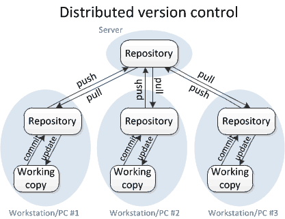


### Repositorios y copias de trabajo ###

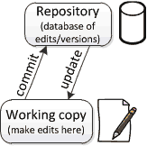

Un sistema de control de versiones usa un repositorio (una
recopilación de todos los cambios) y una copia de trabajo (el
directorio actual) donde haces tu trabajo.

La copia de trabajo es tu copia personal de todos los ficheros del
proyecto. Puedes realizar los cambios que desees en esta copia
personal sin afectar a la historia. Cuando estás contento con el
resultado, confirmas (commit en inglés) los cambios en el repositorio
y añades un commit a la historia.


Podemos entender mejor el funcionamiento de los comandos git add y git
commit introduciendo el concepto de zona de stage.

En Git no es obligatorio introducir todos los cambios en el siguiente
commit, sino que es conveniente seleccionar los cambios que queremos
introducir en el commit.

El comando git add añade a la zona de stage los cambios que queremos
incluir en el nuevo commit.

Además de usarlo para añadir nuevos ficheros que antes no estaban
trackeados, también hay que usarlo incluir cambios que queremos que
vayan en el siguiente commit.

El comando git commit añade los cambios que están en la zona de stage
al repositorio.

Hay dos posibles formas de eliminar y renombrar ficheros en un
repositorio:

- Los eliminamos y renombramos con los comandos del sistema operativo
y después hacemos un git add para incluir esos cambios en el stage.
- Los eliminamos y renombramos con los comandos propios de git:

git rm <fichero> para eliminar un fichero (o un patrón)
git mv <nombre-antiguo> <nuevo-nombre> para renombrar un fichero del
repositorio.

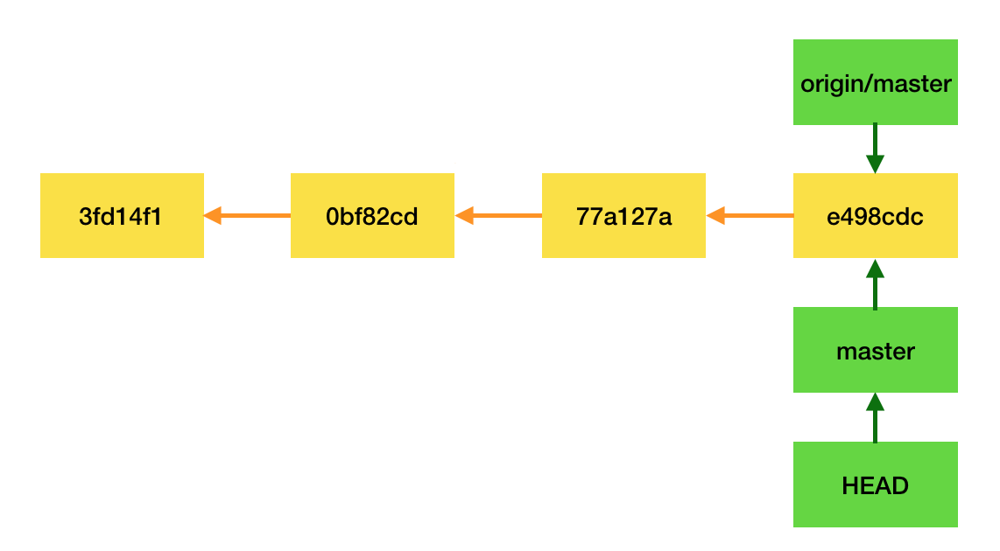

La figura muestra un grafo de commits de un repositorio.

El espacio de trabajo se encuentra en HEAD, en el commit que acabamos
de crear.

Las ramas master y origin/master (rama remota) se siguen encontrando
en el mismo sitio, el último commit de la rama principal.

Podemos usar tags para referirnos a un commit concreto.

git tag

### Trabajar con la historia en Git ###

#### Movernos a un commit pasado ####

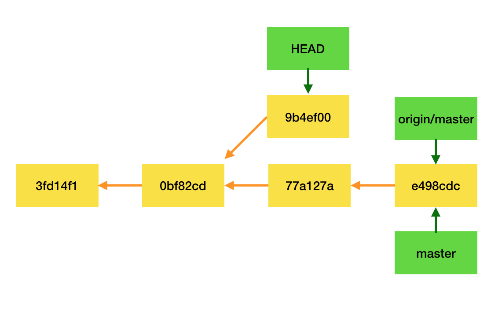

```text
$ git checkout 0bf82cd
# Hacemos cambios
$ git add .
$ git commit -m "Cambios sobre un commit pasado"
```

#### Cambiar el último commit en local ####

Si todavía no hemos subido el commit al repositorio remoto tenemos
varias opciones para cambiar el último commit.

Si queremos cambiar sólo el mensaje del commit:

```text
$ git commit --amend -m "<nuevo mensaje>"
```

Si queremos deshacer el commit, pero no los cambios introducidos en
él: 

```text
$ git reset HEAD^
```

El espacio de trabajo no cambia, pero el commit se ha desecho. 

`HEAD^` significa "el commit anterior a HEAD". Es equivalente a poner
el número de commit anterior al actual: 

```text
$ git reset <commit-anterior>
```

Si queremos eliminar los cambios del último commit del espacio de
trabajo y empezar de nuevo:

```
$ git reset --hard HEAD^
```

#### Deshacer el último commit cuando se ha publicado ####

Si ya hemos publicado el commit en el repositorio remoto otras
personas pueden habérselo descargado, con lo que el commit ya no es
solo nuestro, sino que es parte de la historia pública del proyecto.

Es posible revertir los cambios del commit que queremos eliminar con
el comando git revert <commit>.

El comando introduce un commit con exactamente los cambios contrarios
al commit indicado.

Por ejemplo, el siguiente comando crea un commit que revierte el último commit

```text
$ git revert HEAD
```

Para revertir los cambios realizados hace 3 commits:

```text
$ git revert HEAD~3
```

Para revertir sin commitear los cambios realizados por el quinto
último commit en master (incluido) hasta el tercer último commit en
master (incluido), usando la opción -n:

```text
$ git revert -n master~5..master~2
```


### Trabajo con ramas en Git ###

Supongamos que comenzamos con la siguiente historia (por simplificar,
en las imágenes no mostramos la etiqueta `head`).

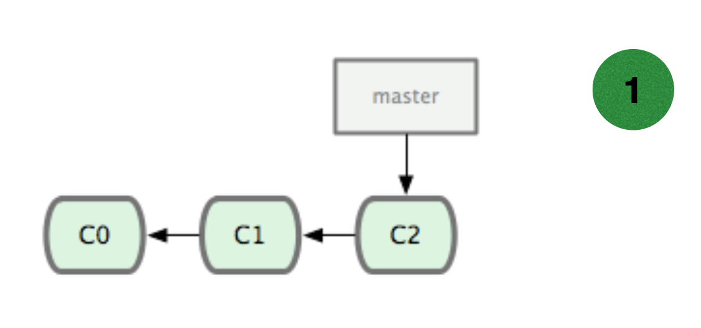

Vamos a crear una rama. Lo podemos hacer con los comandos:

```text
$ git branch iss53
$ git checkout iss53
```

Los comandos anteriores son equivalentes al más usual:

```text
$ git checkout -b iss53
```

El resultado es el siguiente:


Ahora escribimos algo de código en la rama y hacemos un commit.

```text
# escribimos código
$ git commit -am "Añadido nuevo font"
```

El resultado (`head` estaría apuntando a `iss53`):


Ahora nos vamos otra vez a `master` y creamos allí otra rama en la que
hacemos un hotfix:

```text
$ git checkout master
$ git checkout -b hotfix
# corregimos el error
$ git commit -am "Corregido el enlace erróneo"
```

El resultado (`head` estaría apuntando a `hotfix`):

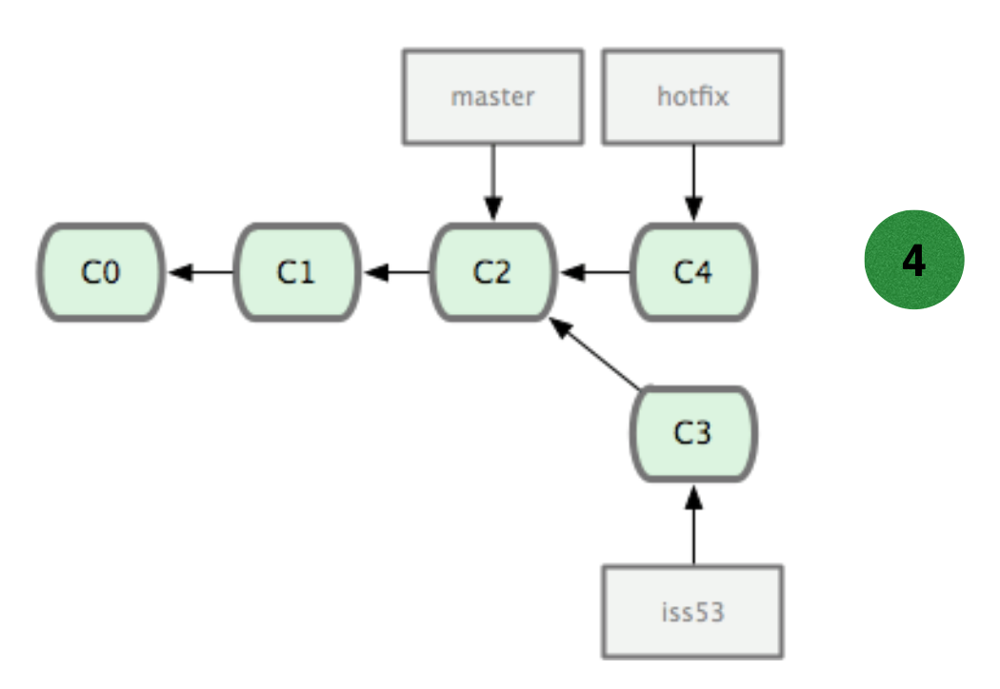

Ahora integramos el hotfix en `master`:

```text
$ git checkout master
$ git merge hotfix
```

Al estar `master` y `hotfix` en la misma línea de commits, git no
tiene que crear ningún commit de merge, sino que hace un _fast
forward_ y adelanta la rama de master para que apunte a `C4` (`head`
estaría apuntando a `master`):


Ahora borramos la rama `hotfix` y hacemos un nuevo commit en `iss53`:

```text
$ git branch -d hotfix
$ git checkout iss53
# Cambiamos más cosas
$ git commit -am "Finalizado el nuevo aspecto"
```

El resultado es el siguiente (`head` estaría apuntando a `iss53`):

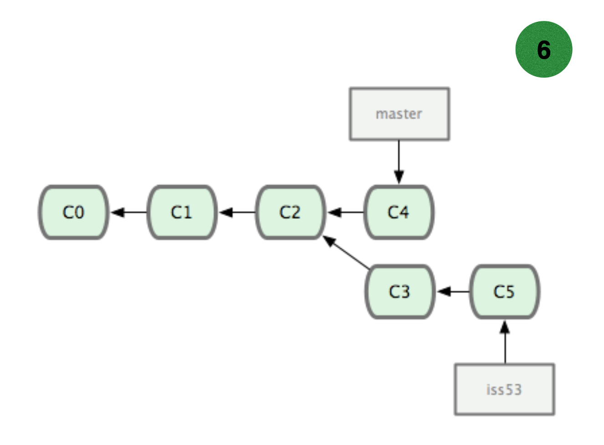

Y ahora mezclamos la rama con `master`:

```text
$ git checkout master
$ git merge iss54
```

Para hacer el merge, git utiliza una estrategia denominada
_recursiva_. Consiste en buscar el commit antecesor común a ambas
ramas (`C2`), calcular los cambios desde ese commit hasta el commit
que se quiere mezclar (cambios desde `C2` hasta `C5`) y hacer un
_patch_ de esos cambios en el commit en el que se quiere hacer la
mezcla (`C4`):

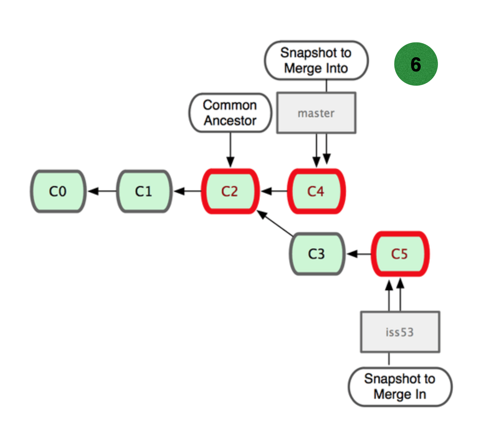

Si no hay ningún conflicto, el resultado de la mezcla se consolida
automáticamente en un nuevo commit y se avanza la rama `master`:


#### Conflictos en el merge ####

En el caso en que hubiera conflicto, el merge no se realiza y se queda
abierto, hasta que se confirmen cuáles son los cambios correctos o se
deshaga el merge.

Los conflictos suceden cuando hay cambios incompatibles entre la rama
que se quiere mezclar y la rama en la que se está mezclando. En este
caso, podría deberse a haber tocado las mismas líneas de un mismo
fichero en los commits `C4` y los commits `C3` y `C5`. En el caso en
que los cambios toquen distintas líneas del mismo fichero, git
identifica los cambios como compatibles y no lo marca como un
conflicto.

Por ejemplo, en la siguiente figura, en una rama se elimina las
últimas líneas de un fichero y en otra se modifican algunas líneas del
principio. En este caso no habría un conflicto.

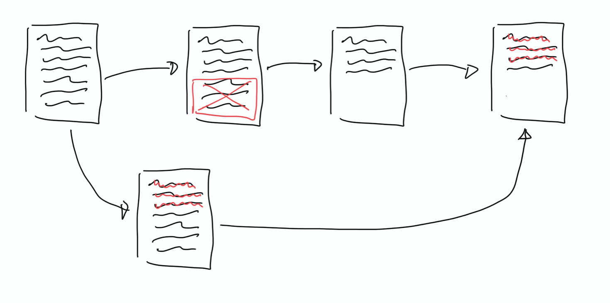

Estrictamente, no hay conflicto en un merge cuando es posible aplicar
los cambios de la mezcla en cualquier orden, obteniendo el mismo
fichero resultado. En el ejemplo anterior, cualquier orden de
ejecución de los cambios tendría como resultado el mismo fichero. Si
primero eliminamos las últimas líneas y después se modifican las
primeras o si primero se modifican las primeras líneas y después se
eliminan las últimas. En ambos casos se obtendría el mismo fichero
resultante.

Si aparece un conflicto, Git paraliza el merge e identifica los
ficheros en los que existe el conflicto. 

```text
$ git merge iss56
Auto-merging index.html
CONFLICT (content): Merge conflict in index.html
Automatic merge failed; fix conflicts and then commit the result.
```


Git modifica el contenido de los ficheros en los que ha detectado el
conflicto, de forma que se marquen los posibles cambios que se
introducen en una y otra rama. En la figura de la derecha podemos ver
un ejemplo de un fichero que ha sido modificado por Git al detectar un
conflicto.

Git marca la zona en la que existe el conflicto y muestra en la parte
de arriba el resultado de los cambios de una rama y en la de abajo el
resultado de los cambios de otra.

Tendremos que editar los ficheros y dejar el código como
queramos. Hay editores que tienen una interfaz especial que permite
seleccionar uno de los cambios o los dos. Yo prefiero hacerlo con un
editor normal y borrar o modificar las líneas de código que me
interesan. 

Una vez modificados todos los ficheros en los que hay un error hacer
un `add` y al hacer el commit confirmamos el merge:

```text
$ git add .
$ git status
On branch master
All conflicts fixed but you are still merging.
  (use "git commit" to conclude merge)

Changes to be committed:

    modified:   index.html
$ git commit -m "Merge branch 'iss56' y resueltos conflictos"
[master 2046b52] Merge branch 'iss56' y resueltos conflictos
```

#### Ramas remotas ####

Cuando hacemos un `fetch` del repositorio remoto, Git descarga los
cambios en los commits que hay en remoto y los coloca en ramas
locales con nombres especiales, para que podamos examinar los cambios
antes de hacer la integración.

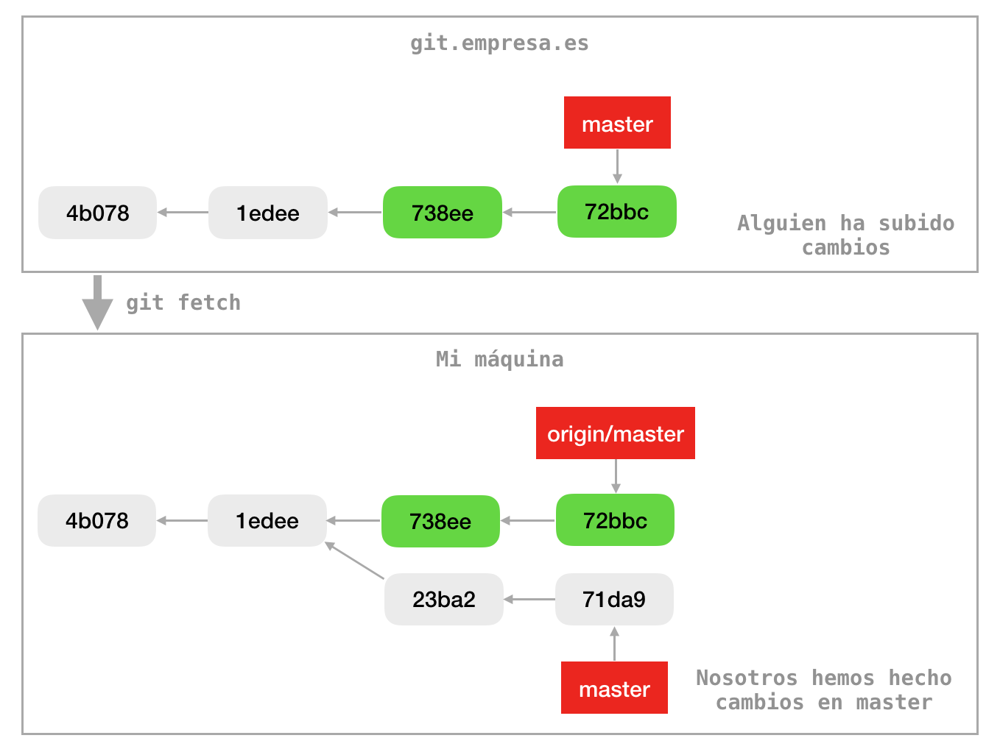

Por ejemplo, en la imagen anterior alguien ha subido a `master` en el
servidor `origin` los commits mostrados en verde. Nosotros hemos
añadido dos commits en la rama `master` en nuestra. 

La parte inferior de la imagen muestra el resultado de hacer un `git
fetch`. Git ha creado una rama local con el nombre `origin/master` en
la que se han copiado los commits introducidos en la rama remota.

La rama `origin/master` es una rama local como otra cualquiera. La
única diferencia es que es una rama de solo lectura. `HEAD` no puede
apuntar a ella (no podemos hacer un checkout y añadir commits como en
una rama normal). 

Mezclamos los cambios descargados en master local haciendo un merge.

Una vez en local podríamos comprobar los cambios y después hacer un
merge:

```text
$ git diff origin/master
$ git merge origin/master
```

El comando `git pull` hace automáticamente un `git fetch` + `git
merge`.

El resultado del merge sería el siguiente:

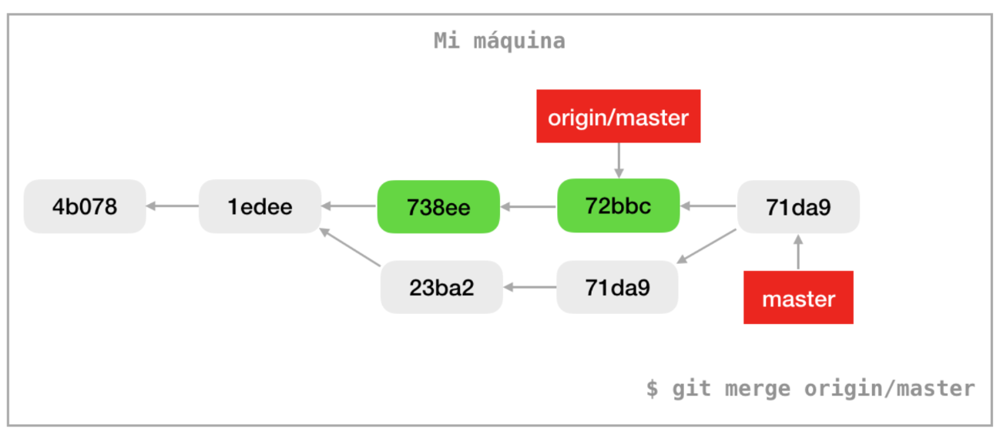

Y ahora podríamos hacer un `git push` para subir los cambios a
`origin`:

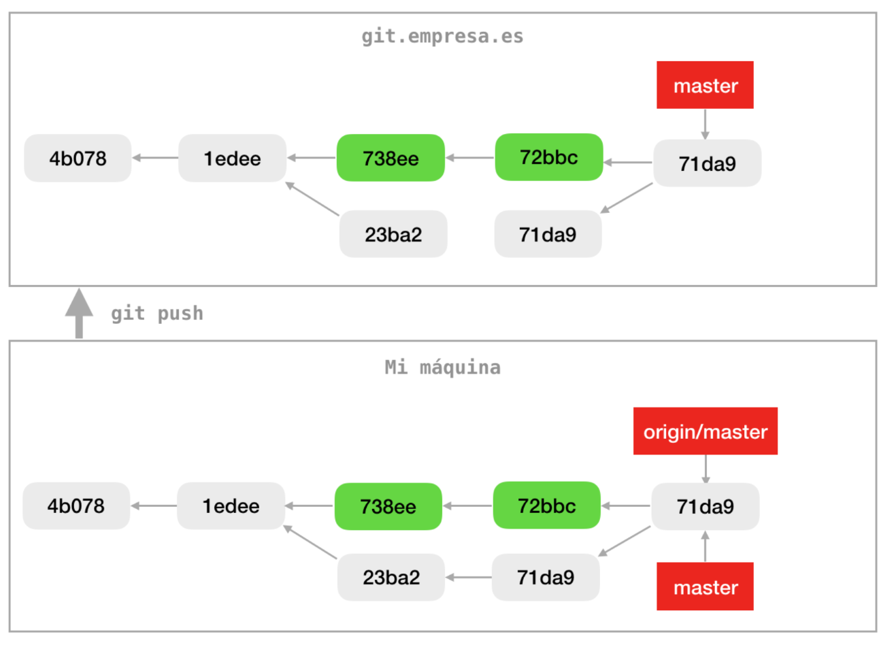

El comando `git branch -vva` nos da la información de las ramas
locales y las ramas remotas con las que están conectadas:

```text
$ git branch -vva
* iss59                 2090ea1 Segundo cambio [iss59]
  master                7c4205e [origin/master] Merge remote-tracking branch 'origin/master'
  remotes/origin/HEAD   -> origin/master
  remotes/origin/master 7c4205e Merge remote-tracking branch 'origin/master'
```

Por último, si en el repositorio remoto algún compañero ha subido
alguna nueva rama, al hacer `fetch` nos la bajaremos:

```text
$ git fetch
...
From https://github.com/domingogallardo/curso-git-repo1
   a4fe1f4..7c4205e  master     -> origin/master
 * [new branch]      iss59      -> origin/iss59
```

Esa rama ahora una rama remota local, a la que no podemos
cambiar. Al hacer un `checkout` se crea una rama local conectada a esa
rama remota:

```text
$ git checkout iss59
Branch iss59 set up to track remote branch iss59 from origin.
Switched to a new branch 'iss59'
```

Podemos trabajar ahora con esa rama de forma similar a cuando
trabajamos con `master`: haciendo `push` y `pull`.


#### git merge --no-ff ####

La opción `--no-ff` (no fast forward) en un merge siempre se incluye
un nodo de merge, aunque no fuera necesario por estar la rama y
`master` en la misma línea de commits.

Por ejemplo, en la siguiente figura hemos creado la rama `iss54` y
añadido los commits `c4` y `c5`:


Si hiciéramos un `git merge` normal con los siguientes comandos:

```text
$ git checkout master
$ git merge iss54
```

el grafo de commits resultante sería el siguiente:


Sin embargo, si usáramos la opción `--no-ff`:

```text
$ git checkout master
$ git merge --no-ff iss54
```

El grafo de commits resultantes es el siguiente:


Esta opción es muy útil para dejar constancia de las mezclas en
el grafo con la historia de commits. Es la opción que usa GitHub
cuando hace un merge en un pull request.

#### Cherry-pick ####

El comando `git cherry-pick` permite mover un commit específico a la
rama actual.

Por ejemplo, supongamos el siguiente grafo:


Suponemos que estamos en `master` y queremos añadir los cambios del
 commit `c4` a la rama actual. Podemos hacer lo siguiente:

```text
$ git cherry-pick 2fa6489 
```

El grafo resultante será:


Los cambios del commit `c4` se habrán incorporado a la rama
`master`. El commit añadido (`c4'`)contiene los mismos cambios, pero
tiene un identificador distinto.

La posterior mezcla de la rama `iss54` con `master` no dará ningún
problema, lo único que hemos hecho es adelantar la incorporación de
los cambios de un commit a la rama.


### Actualizar una rama con los cambios en master ###

Si estamos trabajando en una rama y hay cambios que se han subido a
`master` podemos querer probar que esos cambios no rompen lo que
estamos haciendo en la rama, o incorporar alguna funcionalidad que
necesitamos para los cambios en los que estamos trabajando.

Por ejemplo, supongamos el siguiente grafo de commits:


Los commits `C8` y `C9` en color verde no están en la rama `featureA`
que estamos desarrollando. 

Hay dos formas de incorporar esos commits a `featureA`, haciendo un
merge de `master` en la rama o hacer un rebase de la rama en `master`.

#### Merge de master en otra rama ####

Si queremos incorporar los nuevos commits de `master` en la rama
`featureA` basta con hacer un merge de `master` en `featureA`:

```text
$ git checkout featureA
$ git merge master
```

El resultado será el siguiente:

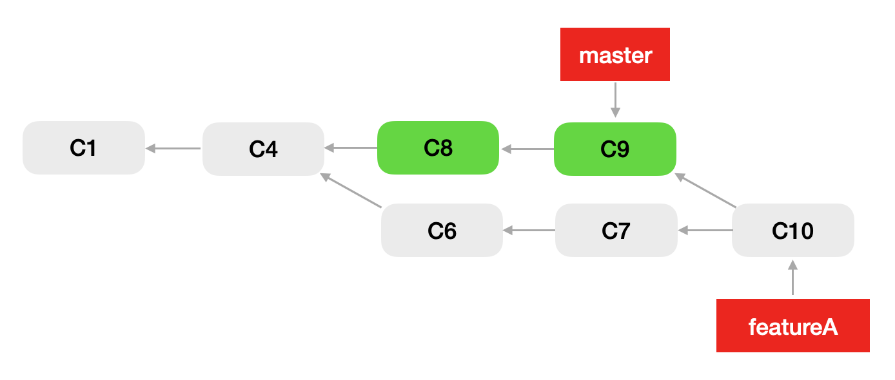

El comando diff sigue funcionando correctamente y muestra sólo los
cambios de la rama:

```text
$ git diff master...featureA
# Muestra los cambios de los commits C6 y C7
```

Podemos seguir trabajando en la rama, subirla a repositorio remoto y
los compañeros pueden seguir trabajando en ella.

#### Rebase de la rama sobre master ####

La otra opción es hacer un rebase y mover el origen de la rama al
último commit de master:

```text
$ git checkout featureA
$ git rebase master
```

El resultado es el siguiente:

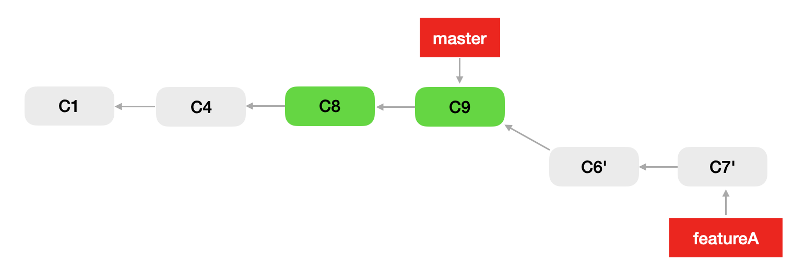

El rebase crea commits nuevos en cabeza de `master` (similar a como lo
haría cherry-pick) y mueve el puntero de la rama al último de esos
commits.

El problema principal del rebase es que modifica el grafo de historia
de commits. Si la rama estaba subida al repositorio, no podremos hacer
un `push`, sino que tendremos que hacer un `push --force`. Esto
causará problemas a los compañeros que se hayan descargado la rama y
estén trabajando en ella.

Además, si hay conflictos, pueden ser más complicados de resolver que
con el merge.

### Pull requests ###

La idea del `pull request` tiene su origen en el desarrollo de
código abierto, para gestionar la posibilidad de que desarrolladores
externos puedan contribuir con cambios. El nombre es un poco confuso,
yo hablaría mejor de `merge request`. Lo que se pretende con la
funcionalidad es, de hecho, solicitar el merge de una rama que se ha
subido al repositorio remoto. Esta rama incluso puede provenir de otro
repositorio creado a partir de un fork del repositorio original.

Esta funcionalidad no está implementada en el propio Git, sino que se
facilita por el servicio que hace el hosting del repositorio (GitHub,
GitLab, Bitbucket, etc.). Por ejemplo, en la siguiente imagen se puede
ver la interfaz de GitHub para gestionar un pull request.

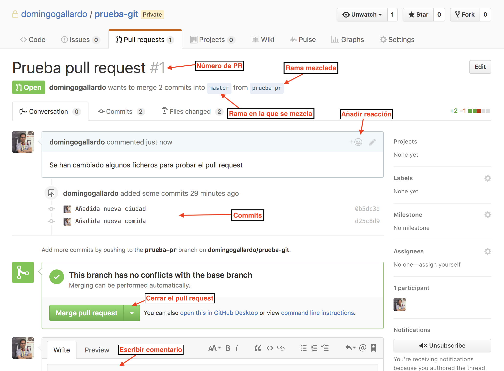

Como se ve en la ilustración, la interfaz web permite revisar el
código que se quiere integrar, abrir conversaciones, aceptar el merge,
etc. El servicio de pull request comprueba automáticamente si hay
algún conflicto entre la rama que se está subiendo y la rama en la que
se va a mezclar. Si lo hubiera, lo marca y no deja realizar el merge.

Es posible seguir subiendo commits a la rama remota mientras el pull
request está abierto. La página se actualiza automáticamente con el
nuevo commit y se vuelve a comprobar si hay conflictos.

También es posible integrar el pull request con algún servicio de
integración continua (como Travis o el propio GitHub Actions). En este
caso, no sólo se comprueba si Git marca conflictos con la rama principal
sino que también el servicio de integración continua realiza el merge,
lanza los tests y comprueba si los tests pasan correctamente.

Una vez aceptado el merge en la interfaz web, la rama remota se
integra en la rama principal (o sobre la que estemos haciendo el
PR). Podemos borrar la rama remota con el interfaz web.

La próxima vez que cualquier miembro del equipo haga un `pull` se
descargará los nuevos commits mergeados.

En concreto, para actualizar en local el resultado del pull request:

```text
$ git checkout master 
$ git pull
$ git branch -d iss54
$ git remote prune origin
```

Los últimos dos comandos borran la rama mezclada y limpian las
referencias a ramas remotas borradas.

#### Solución de conflictos en pull requests ####

Como hemos dicho, la página de pull request nos informa si hay
conflictos entre los cambios que se van a mezclar y los cambios que se
hayan hecho en master.

En la práctica 3 haremos un ejercicio para resolver conflictos en pull
requests.

La forma de resolver los conflictos es muy sencilla:

- Hacer un merge de `master` en la rama del PR (en local) y resolver los
conflictos.
- Subir el commit de merge a la rama remota y al PR. El PR dejará de
  mostrar el conflicto.
- Hacer el merge en GitHub.

En GitHub sólo aparecerán en el PR los cambios de la rama que estamos
mezclando, no aparecerá código de `master`.

## Trunk-based development ##

## Short-lived branches ##

## Ramas de versiones ##
## GitFlow ##

