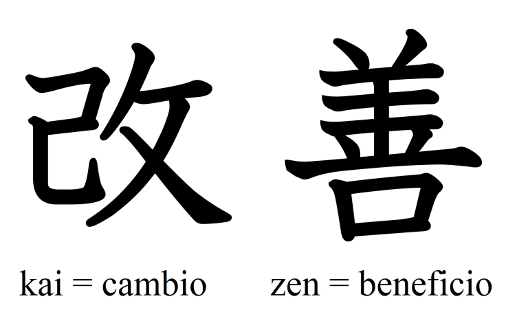

# Introducción a MADS #

En este apartado veremos una introducción a los contenidos de la
asignatura y explicaremos su planificación.

## Datos de la asignatura ##

La asignatura **Metodologías Ágiles de Desarrollo de Software** es
una asignatura optativa de 4º curso del Grado en Ingeniería
Informática. Es una asignatura de la especialidad de **Ingeniería del
Software**.

- **Departamento**: Ciencia de la Computación e Inteligencia Artificial.
- **Créditos ECTS**: 6 créditos ECTS, que se corresponden con 15
  semanas de trabajo y 10 horas por semana, incluyendo clases y
  trabajo en casa (150 horas de dedicación en total).
- [**Ficha UA** de la asignatura](https://cvnet.cpd.ua.es/Guia-Docente/GuiaDocente/Index?wcodest=C203&wcodasi=34037&wlengua=es&scaca=2020-21).

El profesor de la asignatura es [Domingo
Gallardo](http://www.dccia.ua.es/~domingo/). Puedes consultarle
enviándole una tutoría por UACloud o un correo electrónico a
_domingo.gallardo@ua.es_. También puedes encontrarlo en Twitter con
el usuario [@domingogallardo](https://twitter.com/domingogallardo).

## Materiales docentes ##

Todos los materiales de teoría de la asignatura están escritos
en Markdown y publicados en el repositorio de GitHub [domingogallardo/mads-ua](https://github.com/domingogallardo/mads-ua).

Los apuntes de las prácticas también están realizados en Markdown,
subidos al repositorio [domingogallardo/practicas-mads](https://github.com/domingogallardo/practicas-mads),
compilados con la herramienta [Material for MkDocs](https://squidfunk.github.io/mkdocs-material/) y
desplegados en GitHub Pages en [este enlace](https://domingogallardo.github.io/practicas-mads/). El
resultado es un sitio web donde es posible realizar búsquedas y
navegar por secciones.

Utilizaremos Moodle como plataforma docente. Puedes encontrar la
página de la asignatura en [este
enlace](https://moodle2020-21.ua.es/moodle/course/view.php?id=445). Publicaremos
semana a semana los enlaces a los materiales en GitHub. También se
realizarán en la plataforma las entregas finales de las prácticas (que
se deberán ir subiendo también a GitHub). Y utilizaremos el foro para
poner en común dudas que os puedan surgir cuando estáis realizando los
trabajos.

## Evolución de los contenidos de la asignatura ##

La asignatura es una asignatura en constante evolución. Todos los años
se revisan los contenidos, atendiendo al _feedback_ suministrado por
los estudiantes y a los cambios en las tecnologías y en los conceptos
impartidos.

Por ejemplo, podemos destacar los siguientes cambios que hemos
introducido en los últimos años:

- Uso del _framework_ Java Spring Boot, mucho más usado en la industria que
  el que utilizábamos anteriormente (_Play Framework_).
- Profundizamos en las funcionalidades de GitHub y de Git.
- Dar mayor importancia a la metodología XP y rebajar el tiempo dedicado a
  Scrum, debido a que ya lo habéis visto en otras asignaturas de la
  titulación.

Al final del curso se pasa una encuesta y Las observaciones de los
estudiantes sirven para mejorar la asignatura.

Por ejemplo:

> "Es confuso usar 3 tableros distintos (GitHub, Trello, Wiki)"

Como respuesta hemos pasado a usar dos únicos tableros, uno el de
GitHub y otro el de Trello, y a diferenciar claramente su uso.

> "Algunos temas de teoría se han hecho algo pesados"

Este curso vamos a intentar reducir la duración de las explicaciones
de teoría, intercalando explicaciones y actividades más prácticas.

> "La gestión de configuraciones es demasiado complicada"

Este curso vamos a simplificar las pruebas y el despliegue de la
aplicación desarrollada en prácticas usando las **Actions** de GitHub,
en lugar de Travis. De esta forma se podrá realizar todo el proceso en
una única plataforma.

### Mejora continua y _Kaizen_ ###

</img>

Queremos aplicar en el propio contenido de la asignatura una de las
técnicas de las metodologías ágiles y metodologías _lean_: la **mejora
continua** o **Kaizen**.

> "Perfection is a direction, not a place"

Esta frase de Henry Kniberg refleja muy bien la filosofía Kaizen de
mejora continua que se aplica en las técnicas _lean_ de gestión de
empresas o en el desarrollo de software basado en entrega
continua. 

Queremos que la asignatura vaya evolucionando y mejorando curso a
curso y que no se estanque en un sitio, por muy _perfecto_ que nos
pueda parecer.

<table markdown="1">
<tr><td style="background-color: #e0e0e0">

**Filosofía Kaizen**

</img>

Kaizen (consultar [Kaizen](https://en.wikipedia.org/wiki/Kaizen) en la
Wikipedia) es una palabra japonesa que significa mejora continua y
cambio incremental. Un "Kaizen" es una pequeña mejora, que introduce
un riesgo pequeño y que puede ser fácilmente implementada.

Las ideas Kaizen aplicadas a la mejora de procesos en la empresa
tienen su origen en Japón en los años 50. En esos años se desarrolla
en la empresa de fabricación de automóviles Toyota una metodología de
gestión y fabricación totalmente distinta a la existente en Estados
Unidos. Se trata del denominado **TPS (_Toyota Production
System_)**. Su aplicación en las empresas japonesas puso a este país
en la cabeza de la producción y venta de automóviles en los años 60 y
70 y constituyó todo un cambio de paradigma en la gestión. Esta nueva
metodología fue analizada profusamente en las más importantes escuelas
de negocios a lo largo de muchas décadas, dando lugar a lo que hoy se
conoce como **métodos lean**.

</img>

En esta filosofía de mejora continua introducida por Toyota también se
utiliza el denominado **ciclo PDSA** (_Plan-Do-Study-Act_) introducido por
el estadístico Edwards Deming.  Este ciclo trata de dirigir los
cambios utilizando una metodología científica, en la que se planea
definiendo alguna hipótesis, se realiza un experimento, se estudian
los resultados obtenidos y se actúa aceptando o rechazando el cambio.

Este ciclo es muy utilizado en _startups_ para construir y modificar
el producto o software que se entrega al público.

Un ejemplo práctico de uso de la filosofía Kaizen se muestra en este
[hilo de
Twitter](https://twitter.com/DaniNovarama/status/1213389941243285505)
de Dani Sánchez-Crespo [@DaniNovarama](https://twitter.com/DaniNovarama).

</td></tr></table>

<table markdown="1">
<tr><td style="background-color: #e0e0e0">

**Henrik Kniberg**

</img>

[Henrik Kniberg](https://www.crisp.se/konsulter/henrik-kniberg) es un
divulgador muy importante de las metodologías ágiles. Ha trabajado con
grandes empresas como Spotify y Lego para implantar en ellas estas
metodologías. Le gusta compartir todo lo que hace y muchos de los
libros que ha escrito están en abierto. Vamos a utilizar muchos de sus
materiales (diapositivas, vídeos, libros, artículos) en la asignatura.

Muy recomendable su
[blog](http://blog.crisp.se/author/henrikkniberg). Su Twitter es
[@henrikkniberg](https://mobile.twitter.com/henrikkniberg). 

</td></tr></table>

