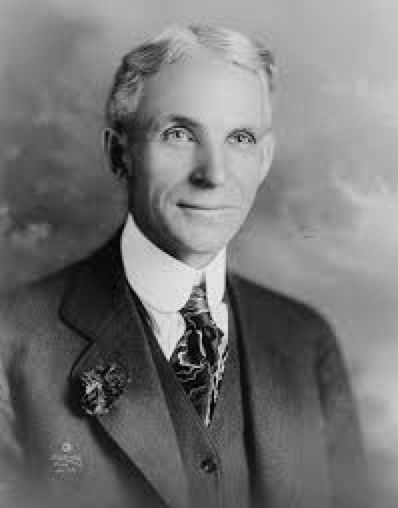
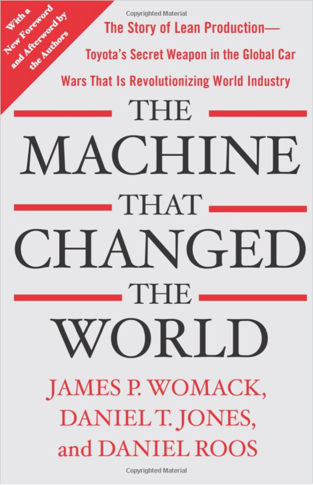
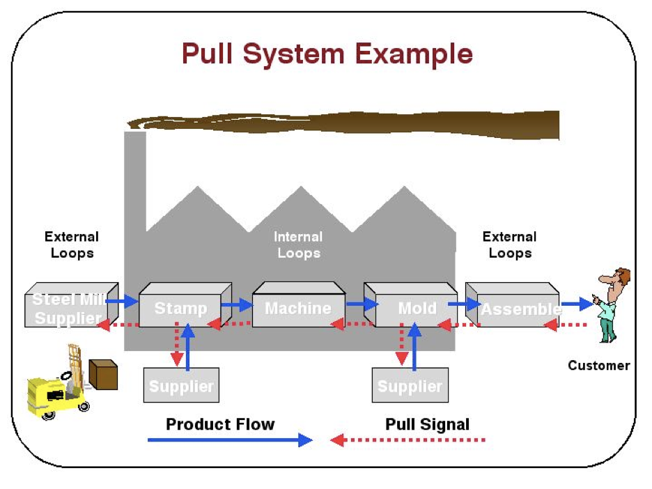
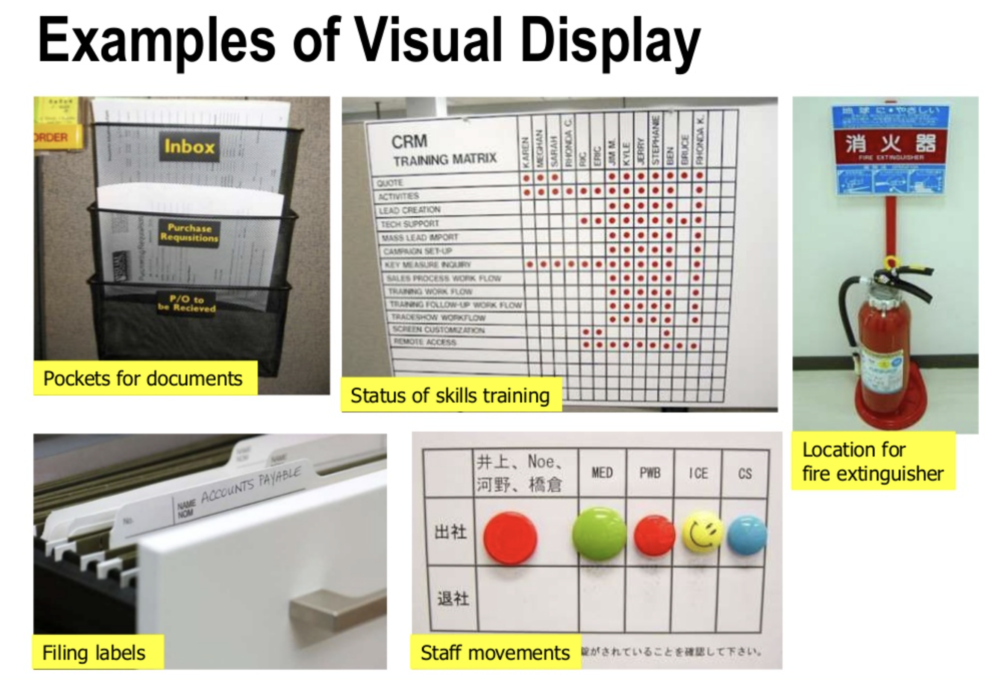
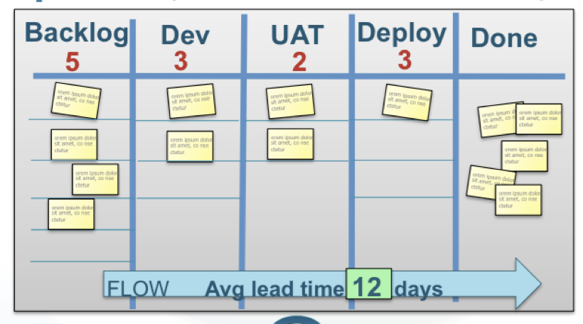
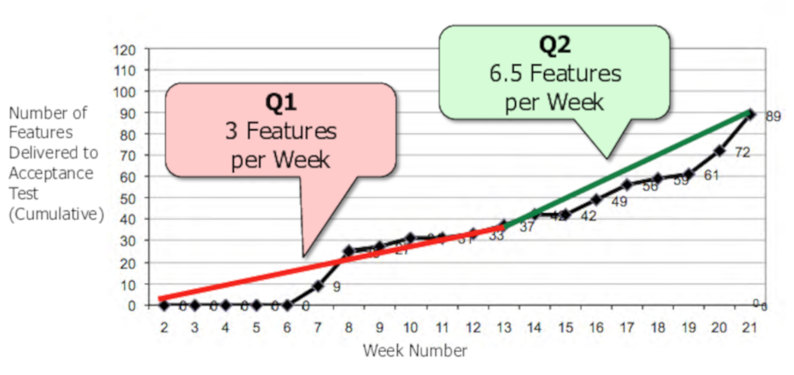

# Desarrollo de software _lean_ #

Además del manifiesto ágil, muchos autores hablan de la filosofía
_lean_ como otro de los elementos fundacionales de las metodologías
ágiles. En esta sesión realizaremos una introducción al pensamiento
_lean_, repasando sus orígenes, conociendo sus ideas fundamentales y
terminando con la aplicación de estas ideas al desarrollo de software.

La filosofía lean se aplica habitualmente a procesos de
fabricación. ¿En qué medida se puede aplicar al desarrollo de
software? ¿Se puede considerar el desarrollo de software un proceso de
fabricación? Veremos que sí que hay elementos parecidos y que muchas
de las buenas prácticas de lean se pueden aplicar también al
desarrollo de software.

Igual que las ideas del Manifiesto ágil son fundamentales para
entender qué hay detrás de metodologías como Scrum o XP, las ideas y
valores de la filosofía _lean_ son esenciales para entender el
fundamento de las prácticas Kanban.

## Orígenes de los sistemas de fabricación lean ##

Los sistemas de fabricación lean tienen su origen en el sistema de
producción de Toyota desarrollado en los años 50 principalmente por su
director Taiichi Ohno. Pero es interesante remontarse a principio del
siglo XX para conocer los inicios de los sistemas de fabricación y
producción tradicionales, frente a los que surgen las ideas de los
procesos lean.

### Taylorismo y Fordismo ###

A finales del siglo XIX y principios del XX Frederick Taylor estudió
los procesos de fabricación de las industrias, principalmente el
acero, y popularizó la idea de que estos procesos debían analizarse y
optimizarse al máximo. Se debían analizar todos los elementos del
proceso: qué tiempo pasaba el trabajador moviéndose de un sitio a otro,
cómo hacer más eficiente el movimiento de los productos de un sitio a
otro, como optimizar los movimientos necesarios para hacer un
ensamblaje, etc.

El objetivo final era diseñar un proceso óptimo totalmente detallado,
rígido y repetitivo, del que se eliminaba en a medida de lo posible
cualquier fuente de variabilidad y que pueda ser realizado por
trabajadores sin demasiada formación. Por ello las personas que
trabajaban en el proceso se convertían en unas máquinas más,
ejecutando acciones repetitivas y perdiendo toda creatividad e
individualidad.

En los años 1910s Henry Ford (imagen izquierda) aplica estas
ideas a la fabricación de automóviles, creando una filosofía que se ha
denominado [fordismo](https://en.wikipedia.org/wiki/Fordism).

Ford diseña el proceso de fabricación de un automóvil en una
serie de pasos lo suficientemente elementales como para que puedan ser
aprendidos rápidamente y realizados por personal sin demasiada
cualificación. En 1913 introdujo su cambio más revolucionario por el
que, en lugar de que los trabajadores se movieran alrededor del
vehículo, era el vehículo en fabricación el que se movía creando la
primera cadena de montaje.

Las cadenas de montaje se convirtieron en las claves de las fábricas
de Ford y del proceso de fabricación a gran escala de automóviles. Los
grandes beneficios obtenidos permiten a Ford elevar los sueldos de los
empleados, de forma que ahora pueden consumir los productos que ellos
mismos fabrican.

El sistema tiene un gran éxito. Los coches salen de la cadena de
producción con intervalos de 3 minutos, mucho más rápido que con los
métodos anteriores. El tiempo de fabricación se redujo de 12,5 horas a
93 minutos en 1914. En 1914 Ford producía más automóviles que todos
los demás fabricantes combinados. El [Modelo
T](https://en.wikipedia.org/wiki/Ford_Model_T) fue un enorme éxito
comercial y en el momento en que Ford fabricaba su coche número 10
millones la mitad de los coches del mundo eran Fords. Se fabricaron un
total de 15 millones de Modelos T, alcanzando un ritmo de 9.000 a
10.000 coches diarios en 1925 (2 millones al año). El primer Modelo T
se fabricó en 1908 y el último en 1927.

A pesar de su enorme éxito el sistema tiene algunos problemas
importantes. En primer lugar los trabajadores tienen muy poca
motivación debido al trabajo repetitivo. Ford se ve obligado a
aumentar el sueldo de sus trabajadores debido al enorme absentismo y
al abandono de los trabajos. Por otro lado el sistema es muy útil para
la fabricación en escala de vehículos estandarizados. Pero es muy
rígido. Se tarda mucho en responder a los cambios que terminan
demandando los consumidores. Esta será la clave del éxito de los
automóviles japoneses de Toyota en EEUU en los años 60.

### Sistema de producción de Toyota (TPS) ###

Después de la Segunda Guerra Mundial, en el marco de un Japón
empobrecido y sin apenas recursos, en la fabrica de automóviles Toyota
Taiichi Ohno (imagen izquierda) desarrolló una filosofía de gestión y
producción que a la postre terminaría aupando a Toyota (y al resto de
fabricantes japoneses) a dominar la producción de automóviles,
superando a los gigantes americanos Ford y General Motors.

Originalmente denominado producción _just-in-time_, el sistema tuvo su
origen en los problemas de Japón:

- Falta de efectivo para financiar los sistemas de producción
  habituales basados en la acumulación de grandes inventarios.
- Falta de espacio para construir fábricas cargadas de inventario.
- Falta de recursos con los que construir los productos.
- Alto desempleo y gran cantidad de mano de obra, que hacía
  innecesaria la optimización de los procesos de fabricación.
  
Debido a estas restricciones, los procesos de fabricación en Japón se
adelgazan (_lean_), construyéndose fábricas más pequeñas en las que
los únicos materiales que se almacenan son los que se están utilizando
en el momento. Al mantenerse bajos los niveles de inventario sólo se
gasta lo necesario para fabricar los pedidos bajo demanda.

Estas tendencias son recogidas y puestas en forma de sistema de
producción por el ingeniero de Toyota Taiichi Ohno y explotadas al
máximo por por Kiichiro Toyoda, director de Toyota en los años 50s.

El objetivo de Ohno no era conseguir producción en masa. Su ideal era
fabricar y entregar un producto inmediatamente después de que el
cliente hubiera realizado un pedido. Pensaba que era mejor esperar un
pedido que construir un inventario en anticipación del pedido.
    
Uno de las ideas fundamentales de Ohno era identificar y eliminar
"desperdicio" (_muda_ 無駄 en japonés, _waste_, en inglés) en todo el
proceso de producción de un vehículo. El concepto de "desperdicio" es
un concepto muy general: es todo aquello que no crea valor al cliente:
piezas que no se usan, elementos innecesarios, transporte, movimiento,
espera, procesamiento extra, defectos.

En 1945, bajo la dirección de Ohno, Toyota optimizó el ratio de
producción de cada sistema, reconsiderando la posición de todas las
máquinas de forma que la salida de una máquina alimentaba la
siguiente. Se redujo la velocidad de las máquinas para que todas
tuvieran la misma cadencia, y sólo se produjo material cuando era
necesario. Después de optimizar las fábricas de Toyota, Ohno entrenó a
los proveedores para que la producción completa de un vehículo fuera
just-in-time, transformando la producción en masa en producción
lean. El sistema pull resultante resultó ser fácil de reconfigurar,
minimizó el inventario y permitió tiempos cortos de producción.

Todas estas ideas se plasman en el llamado TPS [Toyota Production
System](http://en.wikipedia.org/wiki/Toyota_Production_System).

> The TPS is a framework for conserving resources by eliminating
> waste. People who participate in the system learn to identify
> expenditures of material, effort and time that do not generate value
> for customers.
>
> Toyota [_Toyota Production System_](https://global.toyota/en/company/vision-and-philosophy/production-system/)
>

TPS está basado en dos principios básicos:

- Just-in-time: Sólo hacer lo que se necesita, sólo cuando se
necesita y sólo en la cantidad que se necesita. 
    - Evitar gastos de inventario.
    - Ciclos de producción cortos.
    - Herramientas para visualizar el proceso.

- Jidoka (自働化): Juego de palabras en japonés en el que se
incorpora el ideograma "persona" (人) a la izquierda del ideograma
central de la palabra automatización (自動化), queriendo decir
"automatización con intervención humana".
    - Cultura de “parar la cadena” en el momento en que se detecta el
      mínimo error y de preguntarse por la raíz última del error.
    - Cultura de mejora continua en todos los niveles: desde los
      trabajadores de la cadena hasta los directivos y las empresas
      colaboradoras. 
    - Pensar en el conjunto. Equipos multi-funcionales.

En los años 70 los automóviles japoneses conquistaron los mercados
mundiales. Modelos de Toyota, Honda, Nissan, Mitsubishi comenzaron a
venderse en cantidades suficientes como para que las empresas más
tradicionales empezaran a sentirse amenazadas. 

En los años 90 se publica el libro _The Machine That Changed the
World_ que introduce por primera vez el término _lean_ (flaco,
austero) y que populariza para siempre la filosofía de Toyota. El
libro estaba basado en un estudio de 5 años del MIT sobre la industria
automovilística japonesa.

En los años 2000 Japón se convirtió en el primer país en número de
vehículos producidos, superando a la industria americana y europea.

## Características y técnicas de los sistemas de fabricación lean ##

A partir de los años 2000 se ha popularizado el término _lean_,
publicándose cientos de libros y aplicándose a múltiples conceptos
como organización, educación, medicina, desarrollo de software o
creación de _startups_.

Algunas de las ideas más importantes en el campo de la empresa y de
los sistemas de producción son las siguientes.

- El proceso siempre puede ser mejorado y los trabajadores son los
  que mejor pueden proponer estas mejores.

- Método científico: los trabajadores aprenden a crear hipótesis,
  probarlas, analizar los resultados y, si los datos confirman la
  hipótesis, hacer el cambio permanente.

- Identificar los distintos pasos del proceso de producción (el value
  stream) cadena de valor del proceso.

- Una idea central es la continua búsqueda y eliminación de los
  desperdicios (waste) generados por el proceso. Simplificar.

- Cuando se eliminan los desperdicios la calidad mejora, y el tiempo
  de producción y los costes se reducen y la producción se vuelve
  fluida (flow).

- No precipitarse en la toma de decisiones. Mantener abiertas
  distintas opciones y realizar la decisión cuando se tenga el máximo
  de información posible.

- Consecuencias: alta disciplina y alta respuesta al cambio.

- Lean es una mentalidad (mindset), no un conjunto prescrito de
  reglas.

### Value Stream Map ###

Una de las técnicas lean para analizar el proceso y detectar
desperdicios es el denominado _value stream map_ (mapa del flujo de
valor). Consiste en analizar en un diagrama horizontal todos los
tiempos que se han utilizado para añadir algún valor al elemento que
estamos construyendo así como los tiempo de espera, en los que el
procesamiento ha estado parado.

Esta técnica se puede aplicar al desarrollo de software, analizando
todas las fases por las que pasa una funcionalidad, característica,
historia de usuario, tarea, etc. desde que se decide desarrollar hasta
que se sube a producción. 

En la figura anterior se muestra cómo se dibuja una caja por cada uno
de los pasos y se estudia el tiempo de trabajo y tiempo de espera en
cada una de las fases. 

Este análisis se debería realizar con características reales, una vez
terminada su implementación y entregadas al cliente.

En el ejemplo anterior las fases serían: (1) crear el documento de
requerimiento, (2) dividir en tareas y estimar, (3) documento de
planificación, (4) revisión del plan y obtener visto bueno, (5)
desarrollar software, (6) pruebas del software, (7) validación del
alcance, (8) despliegue.

Si aplicamos el método a nuestro propio proceso de desarrollo de
software podremos analizarlo de forma detallada y estudiar los pasos
concretos que realizamos. Cada empresa, dependiendo de la metodología
de desarrollo que use, tiene un mapa de flujo de valor distinto. 

El enfoque lean consiste en identificar y eliminar _waste_ en el
_value stream_. Debemos identificar tres tipos de actividades:
actividades que claramente crean valor; actividades que no crean valor
para el cliente pero que son necesarias en la actualidad para fabricar
el producto; y actividades que no crean valor para el cliente, son
innecesarias y, por lo tanto, deberían ser eliminadas inmediatamente
(_waste_).

Un problema importante en el caso del software es la identificación de
las tareas que van a pasar por el _value stream_. ¿Qué unidades son
las que hay que analizar? ¿Historias de usuario? ¿Tareas técnicas más
pequeñas en las que se descomponen las historias de usuario?. La
recomendación es que sean elementos que no tengan mucha variabilidad
de tamaño. Un concepto que se suele usar es el de _minimal marketable
feature_ (MMF): el "trozo" más pequeño de funcionalidad del producto
que los clientes (o el _product owner_) puede priorizar. Suelen tomar
forma de una historia de usuario, un requerimiento o una petición de
funcionalidad. En el caso de Scrum, son los ítems del backlog.

Cuando veamos la metodología Kanban, veremos que esta es una
herramienta importante para diseñar el tablero kanban que utilizaremos
en nuestro proceso.

### Buscar y eliminar desperdicios ###

Eliminado desperdicios en el proceso de fabricación podemos hacer que
éste sea más ligero, más flexible, fácil de modificar y que el
producto llegue antes al cliente final.

Son desperdicios todos aquellos elementos que no añaden valor al
producto. Si minimizamos los desperdicios maximizaremos la cantidad de
trabajo útil, que realmente da valor.

Ejemplos de desperdicios en procesos de fabricación y servicios: 

- Espera: personas o hitos del proceso esperando que termine otro
  proceso o que llegue cierta información. 
- Movimiento: movimiento físico o mental que no añade valor.
- Inventario: almacenar servicios y componentes extra que el
  cliente no ha pedido.
- Defectos: errores que hay que corregir.
- Sobre-procesamiento: excesiva documentación, informes excesivos,
  partes no necesarias.

En el sistema de producción de Toyota también se usa el concepto de
desperdicio no sólo para fabricación, sino también en el desarrollo
del producto. Cuando se comienza un proceso de desarrollo, el objetivo
es completarlo tan rápidamente como sea posible, porque todo el
trabajo que va en desarrollo no está añadiendo valor hasta que el
coche sale de la línea de producción. En cierto sentido, los proyectos
de desarrollo en marcha son idénticos al inventario. Los diseños y los
prototipos no son útiles a los clientes, reciben valor sólo cuando se
entrega el nuevo producto.

### Sistemas de fabricación _pull_ ###

Otro de los pilares de la fabricación lean son los sistemas de
fabricación _pull_.

En un proceso de fabricación se pueden identificar pasos (celdas) que
necesitan recursos y consumen los 
resultados de procesos anteriores
(upstream).

Un sistema se denomina _push_ (empujar) cuando se planifica a priori
la cantidad de trabajo a realizar, comenzando por la parte inicial del
proceso. Los componentes se van empujando a las siguientes celdas
cuando termina el procesamiento en cada una de ellas. Este es el
enfoque de los métodos de fabricación tradicionales.

El problema principal de los sistemas push es que muchas veces se
produce una sobrecarga en los productos a procesar por las celdas,
acumulándose éstos en alguna parte del proceso (o al final, si el
cliente no los compra y los retira).

Frente al sistema push, los sistemas de fabricación lean proponen un
enfoque _pull_, en el que el origen del flujo de trabajo está al final
de la cadena, en una petición de entrega de un producto a un
cliente. Esta petición provoca el ensamblaje y entrega del producto
final en las celdas finales y la transmisión de una señal (_pull
signal_) a la celda anterior de que se necesita recibir un nuevo
componente, para mantener el número de productos de la celda.

De esta forma, se regula el flujo de los recursos mediante un proceso
en el que se reemplaza sólo lo que ha sido consumido y lo que es
inmediatamente entregable.

Podemos ver una visualización simplificada de este tipo de procesos en
[este enlace de YouTube](https://www.youtube.com/watch?v=ZIv2e61SH1A).

En la visualización anterior se realiza la simplificación de que una
celda procesa únicamente un elemento. Sin embargo lo habitual es que
en una celda se está trabajando simultáneamente en varios elementos.
El número de productos procesándose en una celda se denomina WIP
(_Work In Progress_). Para cada celda hay que definir cuál es el
máximo WIP, el máximo número de productos que se pueden procesar
simultáneamente. El objetivo del sistema pull es conseguir que las
celdas procesen el mayor número de elementos, pero siempre sin
sobrepasar el límite de WIP.

Para ello, cuando se termina de procesar un elemento se pasa a la
siguiente celda sólo si en ella el número de elementos que se está
procesando es menor que ese límite de WIP. Y cuando se pasa el
elemento procesado crea un "vacío" (un WIP menor del límite de WIP) en
la celda que se llena cogiendo un elemento a procesar de la celda
anterior. De esta forma el flujo de trabajo se regula tirando (pull)
de los materiales a transformar existentes en celdas superiores.

Veremos que el concepto de WIP y límite de WIP es fundamental en
Kanban, porque define el número máximo de ítems de trabajo que vamos a
poder tener en cada fase del proceso.

El flujo pull y el mapa de flujo de valor permiten analizar el proceso
de producción y reflexionar sobre su dinámica. Por ejemplo, el flujo
de trabajo pull, junto con el WIP, garantiza que no se produce sobre
inventario y permite detecta fácilmente cuellos de botella en el
proceso, procesos que consumen demasiado tiempo y que obligan a
esperas e impiden una cadencia fluida (flujo, _flow_). Si una celda
o fase del proceso tarda demasiado en procesar los ítems hace que las
fases previas se queden paradas, esperando, porque no pueden
sobrepasar su WIP. En un sistema push esas fases seguirían procesando
ítems, que se acumularían.

El objetivo final de un sistema pull es optimizar el flujo de entrega,
conseguir que el tiempo de ciclo (el tiempo que tarda en llegar un
pedido al cliente que lo ha originado) sea el mínimo posible. Además
se pretende conseguir que ese tiempo sea lo más constante posible para
todas las peticiones. De esta forma se consigue una cadencia de
entrega lo más constante y pequeña posible acomodada a la cadencia de
peticiones de los clientes.

### Kanban ###

El sistema de producción de Toyota uso abundantes elementos visuales
para el control del proceso. Por ejemplo, se usan herramientas
sencillas como contenedores retornables, tarjetas o zonas vacías
señaladas en las que dejar los productos que van desde los centros de
producción hacia los centros de consumo o transformación.

Una de las herramientas más
importantes para organizar el proceso
de
producción son las kanban (del japonés 看板, 看kan=ver y 板
ban=tablero
o tarjeta), señales visuales que
implementan el sistema
pull.

Una kanban es una señal o ayuda visual que indica que un centro de
trabajo ha finalizado un proceso, necesita trabajo o necesita más
materiales.

Los tableros kanban permiten que los centros de trabajo hagan un
seguimiento de las necesidades de los clientes o de los proveedores
y que respondan rápida y adecuadamente.

Veremos en un tema siguiente cómo se pueden utilizar los tableros
kanban para el desarrollo de software. La siguiente imagen muestra
diversos ejemplos de tableros kanban en equipos de desarrollo:

## El desarrollo de software como un proceso de fabricación ##

Hemos visto que los métodos lean se aplican a procesos de
fabricación. Si queremos aplicarlos al desarrollo de software debemos
empezar por preguntarnos si es posible ver este desarrollo desde la
perspectiva de un proceso de fabricación.

Al principio de la asignatura estuvimos hablando de las metáforas que
se pueden aplicar al desarrollo de software. Y vimos que el software
es un producto muy distinto a los productos tradicionales: una
aplicación no es una bicicleta, ni un televisor, ni un edificio. Tanto
su desarrollo como su funcionamiento es singular. Aun así, es
interesante intentar aplicar la metáfora del proceso de fabricación al
desarrollo de software. Esta nueva metáfora nos permitiría resaltar
determinados aspectos del desarrollo e intentar mejorarlos usando
lean.

En un proceso de fabricación tenemos un conjunto de entradas que se
convierten en unas salidas mediante un proceso.

- Entradas: materias primas y componentes
- Salida: producto terminado (automóvil, teléfono móvil, televisor, etc.)
- Proceso: diferentes máquinas y pasos en la cadena de montaje

¿Podemos ver elementos similares (entradas, salida, proceso) en el
desarrollo de software? Sí, si lo vemos como un proceso iterativo que
toma el software que ya está funcionando al que le queremos añadir un
conjunto de funcionalidades.

- Entradas: software funcionando e ideas de nuevas características
(features) en forma de casos de uso, historias de usuario, etc. 
- Salida: software funcionando al que se le ha añadido las nuevas
características. 
- Proceso: cada característica debe ser analizada, desarrollada, probada, añadida y entregada. 

En este proceso tenemos dos ejes de calidad: elegir qué característica
(right product) y desarrollar correctamente la característica
(product right).

Joel Spolsky (creador de _Stack Overflow_) explica en el artículo
[Software Inventory](https://www.joelonsoftware.com/2012/07/09/software-inventory/)
de su famoso blog [Joel on Software](https://www.joelonsoftware.com)
esta relación  entre el desarrollo de software y los procesos de
fabricación.
  
>  Para ver el desarrollo de software como un proceso de producción
>  debes pensar en las ideas a añadir al producto como el material
>  bruto que se va a procesar. Dependiendo del proceso, estas ideas
>  pueden pasar por distintos puntos de ensamblaje antes de ser
>  entregadas como features terminadas al cliente.

Entre los procesos que menciona se encuentran:
  
- Proceso de toma de decisión (¿deberíamos implementar esta feature?)
- Proceso de diseño (especificaciones, pizarras, mockups, etc.)
- Proceso de implementación (escribir código)
- Proceso de prueba (encontrar bugs)
- Proceso de depuración (arreglar bugs)
- Proceso de despliegue (enviar el código a los clientes, ponerlo en
  el servidor web, etc.)

Estos procesos se pueden representar en la columnas de un tablero
kanban, como veremos en el próximo tema.

Cuando miramos el proceso de desarrollo de nuevas características de
esta forma, como un proceso de fabricación, podemos aplicar al
desarrollo de software muchas de las ideas lean. Por ejemplo, una de
las ideas de lean es minimizar el inventario (stock). El stock
acumulado no aporta valor porque no está en manos de los clientes, no
produce feedback y puede contener errores debidos a haber tomado
decisiones prematuras (antes de validar algunos conceptos con los
clientes).

¿Podemos aplicar esta idea de minimizar el inventario al desarrollo de
software? ¿Qué se puede considerar inventario? En el artículo
anteriormente mencionado de Joel Spolsky se mencionan tres tipos de
inventario que podemos encontrar y que debemos minimizar:

- Backlog de features: el 90% de las _features_ en el backlog no
  llega a implementarse. Podemos minimizarlo limitando el backlog a 1 o 2
  meses. Una vez que esté lleno no se introducirán nuevos ítems si no
  se quita alguno.
- Base de datos de bugs: algunas empresas mantienen bases de datos
  con cientos de bugs que nunca llegan a corregirse. Podemos
  minimizarlo implementando un sistema de triaje que indique si un bug debe
  corregirse o marcarse como cerrado. No hay que preocuparse en
  equivocarse, los bugs importantes reaparecerán.
- Features no desplegada: características implementadas pero no
  puestas en producción por ser el proceso de despliegue muy
  lento. Para minimizar el número debemos mejorar el proceso de
  despliegue y utilizar entrega continua.

Una idea bastante radical es la de Michael Feathers, que explica que
el [código es
inventario](https://michaelfeathers.typepad.com/michael_feathers_blog/2011/05/the-carrying-cost-of-code-taking-lean-seriously.html). Se 
debería minimizar la cantidad de código existente en el proyecto (en
línea también con la idea de XP de buscar la simplicidad).

La aplicación de las ideas de lean al desarrollo de software es lo que
se denomina _lean software development_ (desarrollo de software lean),
un término popularizado por Mary Poppendieck en sus libros publicados
en los años 2000.

## Principios de desarrollo de software lean ##

Mary Poppendieck publicó en 2003 y 2006 dos libros ("Lean Software Development: An Agile
Toolkit", 2003 y “Implementing Lean Software Development”, 2006) con
los que popularizó definitivamente la aplicación del pensamiento lean
al desarrollo de software.

En estos libros formuló y explicó una serie de principios sacados de
lean que se podían aplicar al desarrollo de software:

1. Eliminar los desperdicios (Eliminate Waste): ¿qué parte del
   trabajo no está relacionado directamente con crear valor para el
   usuario final? Debes encontrar los desperdicios y eliminarlos.
2. Fomentar la calidad (Build Quality In): debes fomentar tanto la
   calidad interna del software como la calidad final apreciada por el
   usuario.
3. Crear conocimiento (Create Knowledge): debes utilizar el feedback
   obtenido por las entregas para mejorar tu software.
4. Decidir lo más tarde posible (Defer Commitment): debes tomar las
   decisiones importantes para el proyecto cuando tengas la mayor
   cantidad posible de información, en el último momento responsable.
5. Entregar rápido (Deliver Fast): debes comprender el coste de los
   retrasos, usando un proceso pull.
6. Respetar a la gente, potenciar el equipo (Respect People, empower
   the team): debes crear un entorno de trabajo centrado y efectivo y
   construir un equipo de gente implicada.
7. Optimizar el conjunto (Optimize the Whole): debes entender el
   proceso de desarrollo y tomar todas las mediciones posibles para
   tener una idea clara de sus elementos y dinámicas.

Vamos a repasar con algo de detalle estos principios.

### 1. Eliminar los desperdicios (Eliminate Waste) ###

Un desperdicio: cualquier cosa que no se utiliza y que no añade valor
al producto final. Entendemos añadir valor como cualquier actividad
que incrementa la funcionalidad del producto o servicio y, en el
fondo, por la que un cliente está dispuesto a pagar.

Debemos producir sólo lo necesario y en el momento en el que se
necesita. De esta forma minimizaremos las entregas que no se utilizan.
Si algo no se utiliza, no podemos darnos cuenta de sus fallos (ni de
los aciertos), porque no se produce ningún feedback.

Mary Poppendieck propone 7 tipos de desperdicios en el desarrollo del software:

- **Trabajo parcialmente hecho**: Mientras que el software está parcialmente
hecho no puede proporcionar feedback de si es útil o no. El trabajo
parcialmente hecho siempre retrasa el resto del trabajo.

    Posibles manifestaciones de trabajo parcialmente hecho: documentación
    excesiva no codificada, código no sincronizado en el repositorio,
    código no testeado, código no desplegado. 

- **Características de más**: Características que no se usan,
  excesivamente complejas o que quedan obsoletas en nuevas versiones.

- **Reaprendizaje**: Problemas en la comunicación obliga a varias
  personas a reaprender conceptos del dominio del producto, mala
  planificación de las entrevistas con los expertos del dominio,
  herramientas/frameworks de desarrollo demasiado heterogéneos

- **Delegación**: Las delegaciones de tareas y trabajos conllevan
  tiempo necesario para explicaciones y son propensas a errores por
  problemas de comunicación.

- **Retrasos**: Muchos posibles retrasos en el proceso de
  desarrollo. Retraso en la redacción de la historia de usuario o en
  los mockups del diseño. Retraso en que las nuevas features se pongan
  en producción por problemas burocráticos. Retrasos en las pruebas de
  QA por sobrecarga de trabajo.

- **Multi-tarea**: Los cambios de tarea obligan a cambios de contexto
  (que gastan tiempo) y dejan tareas sin terminar.

- **Defectos**: Defectos técnicos que se van acumulando, errores en la
  comprensión de features que producen un producto de poco valor.

### 2. Fomentar la calidad (Build Quality In) ###

Algunos consejos:

- Construye software que intuitivamente tenga sentido para los
  usuarios, y que forme un todo coherente. 
- Muchas veces los clientes y los usuarios son distintos. El software
  debe satisfacer a los clientes porque satisface a sus usuarios.
- Minimiza la deuda técnica
    - Deuda técnica del software: problemas de diseño o implementación
      que terminarán apareciendo en forma de bugs o dificultades de
      ampliación y mantenimiento. “Parches” que se añaden al software
      para salir del paso rápidamente, en lugar de pensar en una
      solución más general.
    - Refactoriza el software siempre que tengas oportunidad.
    - Proceso de revisión de código (code review).
- El software sin defectos solo es posible cuando se hace énfasis en
  las pruebas.
- El software que funciona es aquel que proporciona características
  que los usuarios finales utilizan. Es aquel que tiene una
  integridad conceptual en la que sus características trabajan juntas
  para formar un producto único, integrado y fácil de usar.
  
### 3. Crear conocimiento (Create Knowledge) ###

Podemos diferenciar dos tipos de conocimiento: 

- Conocimiento sobre el producto que estamos desarrollando.
- Conocimiento sobre el proceso y la forma en la que desarrollamos productos.

En cuanto al primer aspecto ya hemos hablado en otros temas de la
importancia de la retroalimentación para desarrollar software
valioso. Podemos, por ejemplo, realizar pruebas A/B para comprobar una
característica: los usuarios utilizan dos versiones del producto, una
con la característica activada y otra desactivada. Se realizan
estudios estadísticos para comprobar qué versión del producto
proporciona más valor.

También hemos hablado de tener una relación cercana con negocio para
utilizar todos un lenguaje común. Ese conocimiento aprendido en forma
de vocabulario debe aplicarse en todos los elementos del proyecto:
código, tests, documentación, etc.

En cuanto al segundo aspecto debemos utilizar el feedback
proporcionado por los proyectos que estamos desarrollando para mejorar
la forma en la que construimos el software. Para ello debemos tomar
continuas medidas y representar distintos elementos que nos puedan dar
pistas de posibles cuellos de botella, de qué tipos de características
son las más complicadas de desarrollar y de cosas a mejorar en la
metodología, arquitectura y tecnología usadas.

Podemos medir distintos elementos como número de pull requests, número
de características terminadas, número de bugs y obtener distintas
estadísticas.

Un diagrama que se usa muy habitualmente es el diagrama de flujo
acumulado (_cummulative flow diagram_), en el que seleccionamos una
fase del desarrollo (columna del tablero Kanban o fase del mapa de
flujo de valor) y vamos contando semana a semana cuantos ítems se
terminan en esa fase de desarrollo:

(Imagen obtenida del libro de Henrik Kniberg _Lean from
the trenches_)

De esta forma podemos, por ejemplo, hacer el diagrama de flujo
acumulado de las historias de usuario terminadas:

Este diagrama nos sirve para estimar una velocidad de desarrollo, lo
que nos permite a su vez estimar número de historias terminadas en una
determinada fecha, suponiendo ítems de tamaño similar.

Si hay variabilidad en el tamaño de los ítems podemos estimar el
tamaño de los ítems en puntos de historia (story points) y hacer un
diagrama en el que el eje vertical sean los story points en lugar del
número de ítems.

También podemos hacer un diagrama conjunto de flujo acumulado de las
distintas fases del desarrollo, para tener una visión de conjunto de
todo el proceso de desarrollo. Para ello dibujamos varias líneas, cada
una de un color, correspondientes a las distintas fases:

(Imagen obtenida del artículo de Pawel Brodzinski [Cumulative Flow
Diagram](http://brodzinski.com/2013/07/cumulative-flow-diagram.html)). 

Otro concepto importante es el cycle time o lead time, el tiempo medio
en que una funcionalidad tarda en terminarse. Podemos representar las
distintas funcionalidades terminadas en una gráfica, en el orden en el
que se van terminando, y hacer un diagrama del tiempo transcurrido por
cada una de ellas. De esta forma podemos ir obteniendo un conocimiento
que nos servirá para estimar mejor las siguientes historias.

### 4. Decidir lo más tarde posible (Defer Commitment) ###

Otro principio lean es que debes tomar las decisiones importantes
sobre el proyecto cuando tengas la mayor cantidad de información
posible, en el último momento responsable. Para ello es fundamental
conseguir una arquitectura y un modelo de desarrollo que permita
maximizar las opciones. 

Decidir lo más tarde posible no consiste en no hacer nada, todo lo
contrario. Consiste en dejar todo preparado para poder tomar distintas
opciones y decidirse en el último momento posible. En esto consiste el
enfoque denominado _option thinking_: mantener distintas opciones
abiertas y tomar la decisión de qué entregar lo más tarde
posible. 

Esta idea es muy importante tanto en el diseño y el desarrollo del
software, como en la selección de funcionalidades del backlog. Por
ejemplo, en el caso del diseño, podríamos hacer un diseño que nos
permita refactorizar fácilmente entre más de una implementación
alternativa. En el caso de selección de funcionalidades por el product
owner hay que considerar el backlog del sprint como opciones, no como
compromisos. El PO puede modificar, añadir o eliminar ítems del sprint
actual, asegurándose siempre que al final del sprint se entregará un
incremento que aporte valor adicional.

Esta filosofía se puede aplicar muy bien al desarrollo incremental:
empezamos con un núcleo de desarrollo mínimo y se van añadiendo
características no demasiado dependientes unas de otras. Hay que
intentar que sea fácil activar y desactivar las características y que
no haya demasiada interdependencias entre ellas.

En un sistema de desarrollo incremental, cuando estamos comenzando a
desarrollar las primeras funcionalidades del sistema, deberíamos
evitar tomar decisiones sobre elementos críticos del diseño que no
tengamos claros y que sean difíciles de cambiar en el futuro. En su
lugar, debemos probar más de una alternativa y dejar abierta la
posibilidad de cambio para el futuro. Estas alternativas deben incluir
todas las capas del desarrollo: de la interfaz de usuario al
backend. Serán ejemplos mínimos del sistema que se irán ampliando en
cada iteración. Es lo que se denomina una _trazer bullet_ (bala
trazadora): una pequeña funcionalidad o ejemplo que afecta a todas las
capas del desarrollo y que permite comprobar el funcionamiento de
todos los elementos del sistema.

En lugar de un plan fijo con fechas marcadas para entregar cada
funcionalidad, el compromiso de un equipo ágil es entregar valor en
forma de incremento cada 2 semanas (una buena analogía es una
publicación periódica, como una revista semanal o mensual, cada semana
o cada mes debe haber un nuevo ejemplar en los quioscos).

Otra forma radical de tener más opciones es darte la posibilidad
de deshacer decisiones. Es muy interesante en esta línea el post de Kent Beck - [Taming Complexity
 with
 Reversibility](https://m.facebook.com/notes/kent-beck/taming-complexity-with-reversibility/1000330413333156)
 en el que se reflexiona sobre la ventaja de poder deshacer decisiones tomadas e
incorporadas al producto, en el contexto de Facebook, la empresa en la
que Beck trabajaba. 

En la mayoría de las ocasiones no nos enfrentamos a situaciones
irreversibles y podemos tomar decisiones que después podemos que
cambiar. Usaremos la flexibilidad del software para desarrollar y
desplegar pensando que podemos tener que deshacer lo que ya hemos
hecho. Algunos elementos que necesitamos para ello son:

- Sistema de control de versiones que permita recuperar versiones
  pasadas puestas en producción.
- Sistema de revisión de código que permita deshacer la
  integración de funcionalidades. 
- Sistema flexible de puesta en producción que permita deshacer el
  último cambio si las métricas caen después de haber sido probado
  por millones de personas.

### 5. Entregar rápido (Deliver Fast) ###

Otro principio fundamental de lean es la entrega rápida, la
optimización del tiempo de ciclo entre que se tiene una idea y se
incorpora al producto final.

Estas entregas y desarrollos rápidos pueden permitir proporcionar más
características (o prototipos de las mismas) para que los clientes y
PO puedan decidir con más información.

Para ello utilizaremos las siguientes técnicas:

- Un sistema pull con ciclos cortos.
- Mapa de la cadena de valor (value stream mapping) y la
  característica mínima promocionable (minimal marketable feature). El
  value stream mapping nos permite estudiar y mejorar el proceso de
  desarrollo y detectar los desperdicios.
- Entrega continua.

### 6. Respetar a la gente, potenciar el equipo (Respect People, empower the team) ###

Ya hablamos de esta idea cuando vimos el Manifiesto ágil.

Un equipo es un conjunto de personas comprometidas en conseguir un
objetivo común. El objetivo debe ser compartido por todos los miembros
y hay que potenciar la compartición también de un conjunto de valores:
respeto, comunicación, transparencia, colaboración.

Debemos construir un entorno de trabajo centrado y efectivo, y formar
un equipo de personas con energía, que realizan un trabajo sostenible.

No a los “héroes” que le echan un montón de horas y que sacan el
trabajo adelante ellos solos. Eso no es potenciar el equipo.

### 7. Optimizar el conjunto (Optimize the Whole) ###

Todo el equipo debe tener claro el objetivo final del proyecto y
cómo el software que estamos desarrollando va a añadir valor al
usuario final. Cuando se comete algún error en una funcionalidad o se
entrega algo con lo que el cliente final no está contento no valen
excusas como "hemos implementado lo que hay escrito el PO en la
especificación". El equipo debe comprometerse con las funcionalidades
implementadas y entender el por qué de su valor.

Una técnica útil es la técnica de los 5 por qués (5 whys): cuando
quieras investigar la causa final de algo debes contestar a 5 por
qués. El proceso de reflexión te permitirá ver cosas que mejorar. 

Por ejemplo, supongamos que estamos analizando el proceso de
matriculación en el software de gestión académica que hemos entregado
a un centro de enseñanza.

- ¿Por qué se producen tantos errores en el proceso de matrícula?
  Porque mucha gente pulsa el botón atrás del navegador y nuestro
  programa no lo soporta.
- ¿Por qué la gente pulsa el botón de atrás? Porque quiere modificar
  alguna asignatura y no puede hacerlo de otra forma.
- ¿Por qué no puede se puede modificar la matrícula de una asignatura?
  Porque ya ha confirmado esa asignatura, ya se le ha asignado un
  turno y no se puede “desmatricular” de ese turno.
- ¿Por qué no se puede desmatricular de un turno? Porque no hay
   ninguna funcionalidad para que un estudiante pueda escoger el turno
   que le interese.
- ¿Por qué no se ha añadido esa funcionalidad? Porque no se nos había
  ocurrido. ¡¡Pues hay que modificar el backlog!!

## Referencias ##

- Henrik Kniberg (2011): [_Lean from the Trenches_](https://learning.oreilly.com/library/view/lean-from-the/9781941222935/)
- Taiichi Ohno (1988) [_Toyota Production System_](https://learning.oreilly.com/library/view/toyota-production-system/9781000056488/)
- Mary Poppendieck, Implementing Lean Software Development, cap. 1 y 2
- Mary Poppendieck, (2001) [Lean Programming](http://www.leanessays.com/2010/11/lean-programming.html)
- Andrew Stellman; Jennifer Greene (2014) [_Learning Agile_, cap. 8](https://learning.oreilly.com/library/view/learning-agile/9781449363819/ch08.html#lean_comma_eliminating_waste_comma_and)
