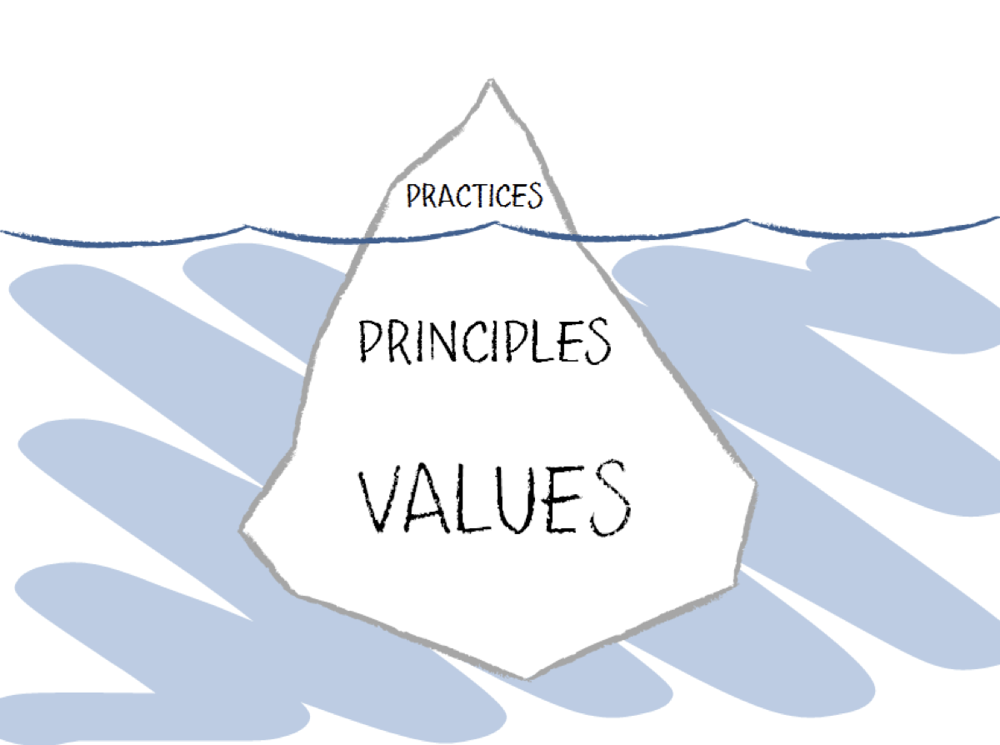
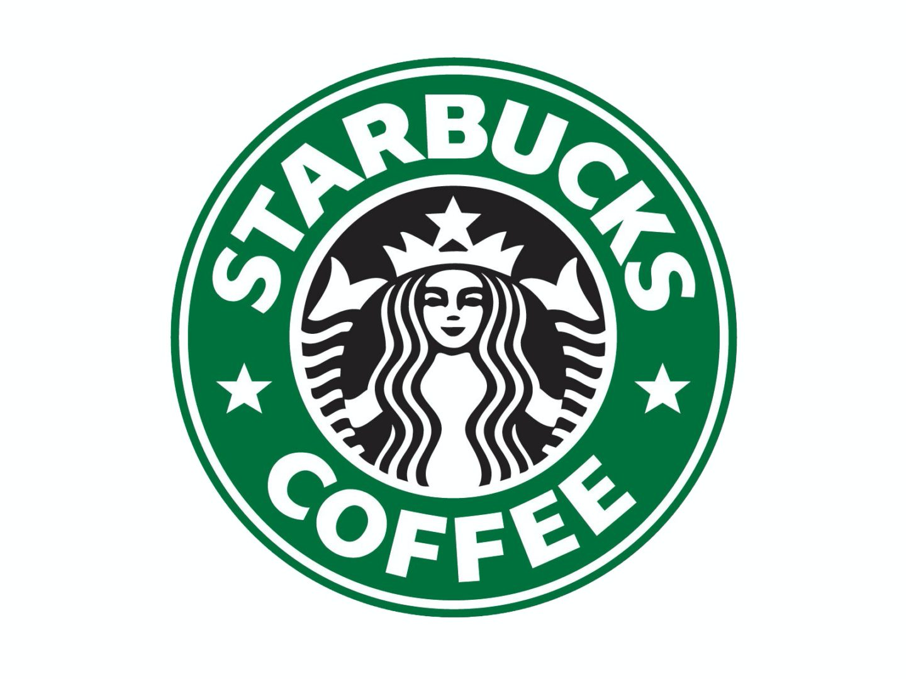
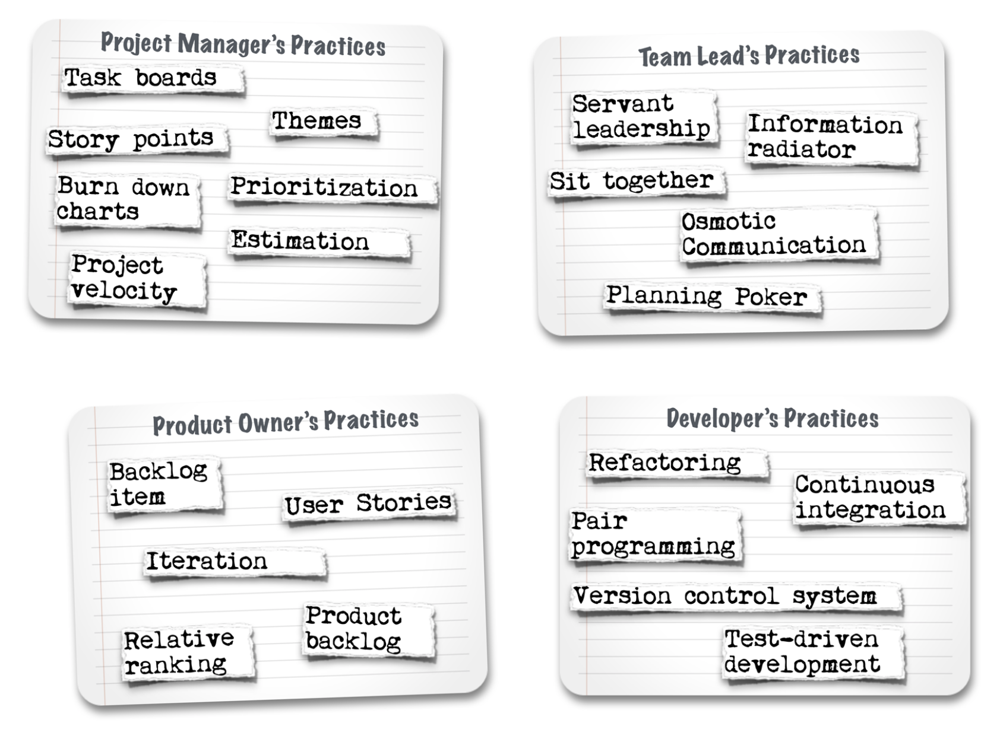
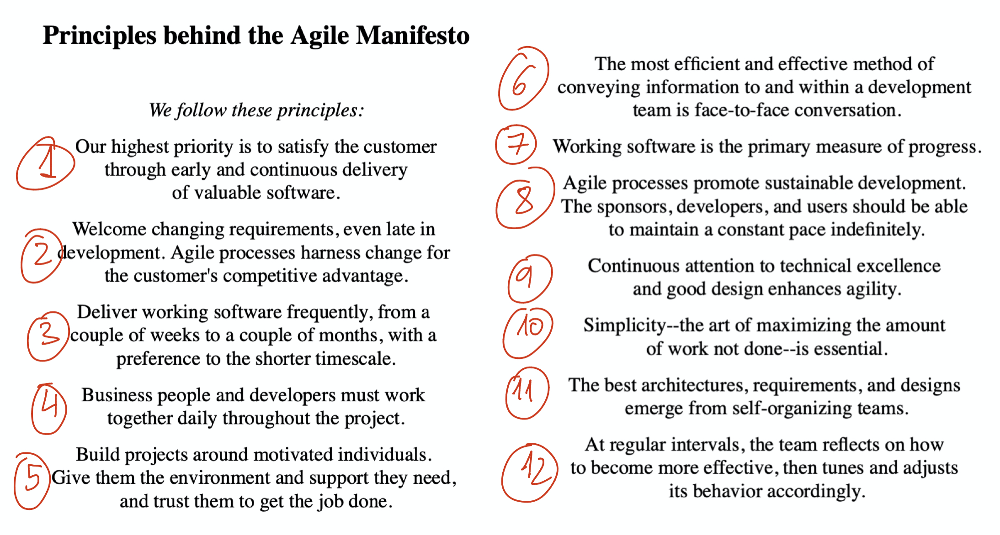

# El Manifiesto Ágil #

El Manifiesto Ágil, publicado en febrero de 2001, se considera el
documento fundacional de todo el conjunto de metodologías del mismo
nombre.

Establece un conjunto de valores y principios comunes a un número de
ideas y corrientes que fueron desarrollándose en los años 90, críticas
con el modelo rígido y pesado de desarrollo de software existente en
la época.

En esta sesión vamos a poner en contexto el manifiesto, explicando
esas ideas previas, para pasar después a estudiar en detalle el
contenido del mismo.

## Tendencias previas al manifiesto ágil ##

### Modelo de cascada ###

En los años 70 y 80 la forma más generalizada de desarrollar software
era utilizando el denominado modelo de cascada (_waterfall
model_). Las empresas y consultoras más importantes estaban
convencidas de que la forma correcta de crear software era aplicando
las metodologías predictivas de las ingenierías tradicionales, en las
que se realiza primero toda la especificación y el diseño y se deja
una segunda fase la implementación, pruebas y despliegue.

A la derecha podemos ver la ilustración del modelo de cascada tal y
como se muestra en el artículo _A Spiral Model of Software Development
and Enhancement_ de Barry Bohem (1988). Vemos que el modelo de divide
el desarrollo de un producto software en 8 fases secuenciales, cada
una con su correspondiente verificación. Los errores detectados en la
verificación de una fase pueden hacer que se vuelva hacia atrás y se corrijan
algunos elementos definidos en la fase anterior.

Las 8 fases definidas son:

- Análisis de la factibilidad del sistema
- Planes de software y requerimientos
- Diseño general del producto
- Diseño detallado
- Códificación (tests unitarios)
- Integración (tests de integración)
- Despliegue (tests del sistema)
- Operaciones y mantenimiento 

Este enfoque tradicional obligaba a una cantidad muy grande de
documentación y a procesos muy burocratizados. Los errores y problemas
detectados en las fases inferiores del proceso debían ser reportados
usando protocolos muy rígidos y los cambios debían ser aprobados por
gerencia y contratados por los clientes antes de ser incorporados en
el software.

### Programación y diseño orientado a objetos ###

A finales de los años 80 se popularizó un nuevo paradigma de
programación: la Programación Orientada a Objetos. Se hicieron
populares nuevos lenguajes de programación orientados a objetos como
Smalltalk, Object Pascal o C++ y las grandes empresas informáticas
comenzaron a usarlos con la esperanza de intentar mejorar los malos
resultados que se estaban obteniendo en los proyectos.

Este nuevo paradigma de programación hizo posible nuevas formas de
diseño y arquitecturas de software, como el diseño orientado a objetos
de Grady Booch, en las que el software era mucho más flexible y
modular y era mucho más fácil introducir cambios en partes del sistema
sin alterar el resto.

Por ejemplo, en su libro de 1991 _Object Oriented Design with
Applications_ Grady Booch afirma que el software creado con el diseño
orientado a objetos es resistente al cambio y tiene un nivel de
abstracción muy alto, con lo que puede ser entendido mucho mejor:

> By applying object-oriented design, we create software that is
> reslient to change and written with economy of expression. 

Y el diseño orientado a objetos también rompe con el modelo
tradicional de desarrollo en cascada y va de la mano de procesos
iterativos:

> With object-oriented design we never encounter a "big-bang" event of
> system integration. Instead, the development process results in the
> incremental production of a series of prototypes, which eventually
> evolve into the final implementation.

La llegada (para quedarse) del paradigma orientado a objetos hizo
cristalizar un conjunto de metodologías iterativas ya existentes y
puso en cuestión el modelo de cascada tradicional. Además, el
nacimiento de la [Web](https://en.wikipedia.org/wiki/World_Wide_Web)
en 1993 y las fuertes inversiones y especulaciones alrededor de las
[empresas punto-com](https://en.wikipedia.org/wiki/Dot-com_bubble) a
finales de los 90 produjo una necesidad añadida de buscar nuevas
formas de desarrollar software, más cercanas a un mundo cada vez más
cambiante y rápido.

### Desarrollo iterativo ###

En toda la historia del desarrollo de software han existido propuestas
de desarrollo iterativo o evolutivo. Craig Larman y Victor Basili las
recogen en su artículo de 2003 [_Iterative and Incremental
Development: A Brief
History_](https://www.craiglarman.com/wiki/downloads/misc/history-of-iterative-larman-and-basili-ieee-computer.pdf):

- (1940s) Ciclo PDSA (_Plan-Do-Study-Act_) de Edwards Demming.
- (1950-60s) Proyectos militares y espaciales: jet hipersónico X-15 y
  proyecto Mercury.
- (1970s) Harlan Mills _Top-down programming in large systems_
  aplicada en su trabajo en IBM en contratos con el Departamento de
  Defensa la NSA americana.
- (1976) En su libro _Software Metrics_ Tom Gilb es el primero que
  habla de _evolution_ para referirse al desarrollo de software
  iterativo:
  
    > "“Evolution” is a technique for producing the appearance of
    > stability. A complex system will be most successful if it is
    > implemented in small steps and if each step has a clear measure
    > of successful achievement as well as a “retreat” possibility to
    > a previous successful step upon failure. You have the
    > opportunity of receiving some feedback from the real world
    > before throwing in all resources intended for a system, and you
    > can correct possi- ble design errors...
    >
    > Tom Gilb (Software Metrics, 1976)

- (1983) Grady Booch publica _Software Engineering with Ada_ en el que
  propone por primera vez su metodología iterativa de diseño orientado
  a objetos.
- (1985) Barry Boehm publica uno de los artículos fundamentales del
  desarrollo iterativo: _A Spiral Model of Software Development and Enhancement_.

    

-   

    (1995) El [movimiento de código abierto](https://en.wikipedia.org/wiki/History_of_free_and_open-source_software)
    demostró que era posible crear de forma distribuida y
    auto-organizada complejos sistemas de software con decenas de
    miles de líneas de código como sistemas operativos
    ([Linux](https://en.wikipedia.org/wiki/Linux)), editores de texto
    extensibles con un lenguaje de programación incluido
    ([Emacs](https://en.wikipedia.org/wiki/Emacs)) o bases de datos
    ([MySQL](https://en.wikipedia.org/wiki/MySQL)). En 1999 Eric
    Raymond publica su el libro [_The Cathedral and the
    Bazaar_](https://en.wikipedia.org/wiki/The_Cathedral_and_the_Bazaar)
    en donde analiza el modelo de desarrollo del movimiento open
    source. Y en el mismo año Andrew Hunt y David Thomas publican su
    influyente libro [The Pragmatic
    Programmer](https://en.wikipedia.org/wiki/The_Pragmatic_Programmer)
    en el que recogen buenas prácticas de programación relacionadas
    también con el open source, Linux/UNIX y el desarrollo iterativo.

### Metodologías ligeras ###

Antes del manifiesto no se utilizaba la palabra "ágil", se hablaba de
metodologías "ligeras" (_lightweight_) para contraponerlas a las
distintas variantes de la metodología tradicional de cascada
existentes, denominadas todas ellas "pesadas".

En los años 90 todos estos enfoques cristalizan en un grupo de
propuestas y metodologías ligeras que se hacen populares:

- Rapid Aplication Development (RAD) y Dynamic Systems Development
  Method (DSDM) de James Martin se hacen populares en Europa a
  mediados de los 90.
- Extreme Programming (XP) nace en 1996 promovida por Kent Beck, John
  Reffries y Ward Cunningham.
- Scrum se propone en 1999 por Jeff Sutherland y Ken Schwaber
- Feature Driven Development (FDD) desarrollada por Jeff De Luca y
  Peter Coad en 1999.
- A mediados de los 90 Alistair Cockburn propone los Crystal Methods
  después de una extensa investigación con equipos exitosos en la que
  concluye que la característica fundamental de estos equipos está
  basada en las personas y sus interacciones y no en sus procesos.

De todas estas propuestas, la más popular a finales de los 90 era con
diferencia XP. Kent Beck la había hecho popular en conferencias, con
su libro de 1999 _Extreme Programming Explained_ y en cursos
organizados junto con Bob Martin.

En el artículo _"Back to the future: origins and directions
of the Agile Manifesto – views of the originators"_ se presenta esta
interesante figura con las influencias que dieron lugar al manifiesto.

### Reunión en Snowbird ###

Martín Fowler, en su artículo [_Writing The Agile
Manifesto_](https://www.martinfowler.com/articles/agileStory.html)
explica el origen de la reunión en la que se desarrolló el Manifiesto
Ágil.

En la primavera de 2000 Kent Beck invitó a una reunión a un grupo de
líderes en la comunidad XP (Bob Martin, Ward Cunningham, John Refries,
, Martin Fowler) junto con otras personas interesadas pero
que no formaban parte estrictamente de XP como Alistair Cockburn, Jim
Highsmith y Dave Thomas.

En la reunión se discutió la relación entre XP y métodos similares a
los que en esa época se denominaban _lightweight methods_. Se
analizaron las ventajas de XP como un método muy centrado en la
realidad del desarrollo, pero también se acordó que habían muchos
elementos comunes entre XP y el resto de métodos. Como resultado de
esto Bob Martin decidió organizar una reunión de gente interesadas en
este amplio rango de métodos.

Entre Bob Martin y Martin Fowler se configuró una lista de personas
posiblemente interesadas. A esta lista se unió otra de Alistair
Cockburn, con lo que se contactaron básicamente a casi todos los
principales representantes de las existentes metodologías
_ligeras_.

Se definió la fecha y el lugar de la reunión del 11 al 13 de febrero
de 2001 en el resort de Snowbird en Utah y se envió
invitaciones a todos los seleccionados para participar en la reunión
que Bob Martin bautizó con el nombre de "The Light Weight Process
Summit" (lo explica en su libro de 2019 [_Clean
Agile: Back to
Basics_](https://learning.oreilly.com/library/view/clean-agile-back/9780135782002/)). 

Bastantes de las personas invitadas no pudieron asistir finalmente,
con lo que al final quedaron en 17 asistentes. 

## El Manifiesto Ágil ##

Del 11 al 13 de febrero de 2001 tuvo lugar la reunión en el resort de
Snowbird. Los participantes pusieron ideas en común, escribieron
tarjetas, debatieron y terminaron con dos cosas concretas que pocos de
ellos esperaban al comenzar: un manifiesto y una palabra que agrupara
todo el movimiento: "Agile".

El manifiesto ocupaba una pizarra. Lo vemos en la parte derecha de la
fotografía. En la parte izquierda la famosa fotografía que hace de
background en la web en la que está publicada el manifiesto:
<http://agilemanifesto.org>.

La palabra "Agile" se escogió después de descartar algunas otras como
"Light Weight" o "Adaptive". A casi nadie le gustaba el nombre de
"ligeros". Comenta Fowler en el artículo mencionado anteriormente que
el ser ligero no era el objetivo de los métodos, era sólo un
síntoma. Al final se consideró que la palabra "ágil" capturaba bien la
adaptatividad y la respuesta al cambio que se consideraba importante
para todos los enfoques.

### Firmantes del manifiesto ###

Los firmantes del manifiesto eran representantes de las principales
metodologías _ligeras_ existentes en la época.

- **XP**: Kent Beck, Bob Martin, Ron Jeffries, Word Cunningham, Martin
  Fowler, James Grenning
- **Scrum**: Ken Schwaber, Mike Beedle, Jeff Sutherland
- **Feature Driven Development**: Jon Kern
- **Dynamic System Development Method**: Arie van Bennekum
- **Crystal Processes**: Alistair Cockburn
- **Pragmatic Programmers**: Andy Hunt, Dave Thomas
- **Model Driven**: Steve Mellor
- **Consultores**: Brian Marie y Jim Highsmith

<table markdown="1">
<tr><td>

Muchos de los firmantes del manifiesto siguen activos en la
actualidad, en diversas organizaciones o en redes sociales. A
continuación los listamos por orden alfabético, con enlaces a su
cuenta de Twitter y la organización en la que participan.

- Kent Beck ([Twitter](https://twitter.com/KentBeck))
- Alistair Cockburn ([Twitter](https://twitter.com/TotherAlistair), [Blog](http://alistair.cockburn.us))
- Ward Cunningham ([Twitter](https://twitter.com/WardCunningham))
- Martin Fowler ([Twitter](https://twitter.com/martinfowler), [Blog](http://martinfowler.com))
- Andrew Hunt ([Twitter](https://twitter.com/pragmaticandy), [Pragmatic Programmer](https://pragprog.com))
- Ron Jeffries ([Twitter](https://twitter.com/RonJeffries), [Blog](http://ronjeffries.com))
- Robert C. Martin ([Twitter](https://twitter.com/unclebobmartin), [Clean Code](https://sites.google.com/site/unclebobconsultingllc/))
- Ken Schwaber ([Twitter](https://twitter.com/kschwaber), [Scrum.org](https://www.scrum.org))
- Jeff Sutherland ([Twitter](https://twitter.com/jeffsutherland), [Scrum.org](https://www.scrum.org))
- Dave Thomas ([Twitter](https://twitter.com/pragdave), [Pragmatic Programmer](https://pragprog.com))

</td></tr></table>

### Valores del Manifiesto Ágil ###

El texto principal del manifiesto lista las cuatro creencias
fundamentales en forma de **valores**, contraponiéndolas a elementos
de las metodologías tradicionales. El manifiesto establece claramente
que se prefiere los primeros, pero que éstos no reemplazan, sino que
complementan, los segundos.

> We are uncovering better ways of developing software by doing it and
> helping others do it. Through this work we have come to value: 
>
> **Individuals and interactions** over processes and tools  
> **Working software** over comprehensive documentation  
> **Customer collaboration** over contract negotiation  
> **Responding to change** over following a plan  
>
> That is, while there is value in the items on the right, we value
> the items on the left more. 

El primer gran acierto del manifiesto fue estructurarlo alrededor de
valores. Los valores son elementos básicos de una cultura, creencia o
metodología, que impregnan todo el resto de componentes.

Antes de estudiar en detalle los valores concretos del Manifiesto Ágil
vamos a reflexionar brevemente sobre la distinción entre valores,
principios y prácticas.

### Valores, principios y prácticas ###

Muchas de las recetas e ideas que se proponen en conferencias, libros
o metodologías no son generalmente aplicables a cualquier situación,
sino que son dependientes del contexto. Por ejemplo, no es la misma
situación la de una pequeña empresa familiar con sólo dos
programadores que se encargan de la instalación y mantenimiento de
software adquirido que el de una gran empresa con un departamento de
informática formado por una veintena de personas.

Por eso es muy importante siempre contemplar las prácticas como ideas
o inspiraciones concretas y buscar el conocimiento más abstracto y
general que las soportan. Estas ideas más generales son más
abstractas, pero también son más generales y aplicables a muchos más
contextos. 

Por ejemplo, la idea de "colaboración con el cliente" es una idea
general que será llevada a cabo de forma distinta en la empresa
familiar y en la empresa grande. En la empresa pequeña se puede
realizar de forma informal, intercambiando mensajes rápidos y
frecuentes por Whatsapp. Pero en la empresa grande habrá que
formalizarlo definiendo un responsable que haga el papel de product
owner.

La idea de "colaboración con el cliente" es lo que se denomina un
valor, un elemento general que guía las acciones y son aplicables a
situaciones muy diversas.

En la definición inglesa de la palabra _value_ nos encontramos con la
acepción que buscamos:

> Valor:  
> 
> 2. Principio o estándar de conducta; juicio personal de lo que es
>    importante en la vida.

<table markdown="1">
<tr><td>

</img>

Hoy en día el término se ha popularizado en el mundo de los
negocios. Se habla de **visión** de la empresa y de **valores**
asociados a la misma. Por ejemplo, Starbucks define su [misión y
valores](http://www.starbucks.com/about-us/company-information/mission-statement)
de la siguiente forma:

**Misión**: Inspirar y cuidar el espíritu humano - persona a persona,
taza a taza y barrio a barrio.

**Valores**: Con nuestros socios, nuestro café y nuestros clientes en
el centro de nuestra experiencia, vivimos estos valores:

- Crear una cultura de calidez y **de pertenencia**, donde todo el mundo
  es bienvenido.
- Actuar con **valentía**, enfrentándose al _status quo_ y encontrando
  nuevas formas de hacer crecer nuestra empresa y cada uno de
  nosotros.
- Estar **presente y conectar** con transparencia, dignidad y respeto.
- Entregar **lo mejor de nosotros** en todo lo que hacemos,
  pudiendo dar cuenta en todo momento de nuestros resultados.

Nuestro objetivo es el rendimiento, a través de la lente del humanismo.

</tr></td></table>

Los **principios** son ideas que se derivan de los valores, menos
abastractas, pero no tan concretas como las prácticas. Por ejemplo, en
el caso de la "colaboración con el cliente" podríamos definir el
siguiente principio:

> "Nuestra mayor prioridad es satisfacer al cliente a través de la
> entrega temprana y continua de software valioso"

Estamos dando un ejemplo concreto de colaboración con el cliente. Es
una idea menos general que la del valor, pero todavía no es algo tan
concreto como una práctica. Por ejemplo, no estamos definiendo la
periodicidad, ni la forma de las entregas, ni las acciones que puede
hacer el cliente cuando recibe el software. 

Kent Beck ilustra la utilidad de los principios con la ilustración que
vemos a la derecha. Los principios son como un puente que permiten
movernos desde los valores hasta las prácticas.

Es fundamental conocer los valores y principios subyacentes a las
prácticas para no caer en la repetición vacía de las mismas y en
“rituales ágiles” que son cualquier cosa menos ágiles. La aplicación
ciega de las prácticas, sin contemplar el contexto de la situación,
puede terminar empeorando el proceso desarrollo. Los valores y principios
asociados a las prácticas nos permiten razonar sobre el por qué de su
aplicación y decidir si es o no conveniente.

Los valores y principios también proporcionan una visión común a todos
los miembros implicados en el desarrollo del proyecto. Muchas veces
los objetivos a corto plazo de distintos miembros del proyecto entran
en conflicto y la mejor forma de arbitrar soluciones es usando los
valores y principios comunes. Si no existen esos valores comunes se
crea el problema de la _perspectiva fracturada_. En esta situación,
cada miembro del equipo tiene una forma distinta de ver las distintas
prácticas de desarrollo y se crean disfunciones y conflictos.

Por ejemplo, si una idea compartida por todos los
miembros del equipo es la de "entregar valor" al cliente, el equipo de
desarrollo frenará su tendencia a crear una arquitectura
de software superavanzada y especializada y se centrará en intentar
añadir al software algo que entregar al cliente en la siguiente
iteración.

La visión común de los valores y principios también ayuda a unificar
las distintas prácticas que se suelen aplicar en los distintos roles
del desarrollo de software. En la figura de la derecha, tomada del
libro _Learning Agile_, se muestran prácticas ágiles que habitualmente
utilizan los managers, product oners, scrum masters (o team leaders) y
desarrolladores.

Veamos a continuación uno a uno los cuatro valores del manifiesto
ágil, explicando cada uno de ellos en cierta profundidad.

### Individuos e interacciones sobre procesos y herramientas ###

La mejor garantía de que el proyecto tenga éxito es que el equipo que
lo desarrolla funcione bien. Los métodos, procesos y herramientas son
secundarios. Pueden usarse bien o mal. Es más importante fijarse en
los miembros del equipo, sus motivaciones, preferencias e
interacciones.

Las metodologías tradicionales hacen gran énfasis en la documentación
escrita. Sin embargo, más importante que una buena documentación es
una buena interacción (comunicación continua para que todo el equipo
esté informado de las decisiones, temas abiertos, conceptos de
negocio, etc.).

Cuando no existen problemas de comunicación los equipos funcionan
mucho mejor (en algunos estudios se habla de hasta 50 veces mejor que
la media). Para facilitar la comunicación las metodologías ágiles se
basan en ciclos frecuentes de inspeccionar-y-adaptar. Estos ciclos
van desde cada pocos minutos con el _pair programming_, a cada pocas
horas con la integración continua, a cada día con las reuniones
diarias _standup_, a cada iteración con la revisión y la
retrospectiva.

Para que funcione bien la comunicación y los ciclos de
inspeccionar-y-adaptar es necesario que los miembros del equipo
muestren bastantes conductas claves:
  
- respecto por el bienestar de cada persona
- verdad en cada comunicación
- transparencia en todos los datos, acciones y decisiones
- confianza en que cada persona va a apoyar al equipo
- compromiso al equipo y a los objetivos del equipo

Para promover este tipo de conducta, se debe facilitar un entorno que
apoye y sea inclusivo. 

Se debe buscar de forma deliberada este tipo de comportamientos,
porque la mayoría de equipos evitan la verdad, la transparencia y la
confianza debido a normas culturales o conflictos previos generados
por ser honestos en la comunicación. Para combatir estas tendencias,
los líderes y los miembros del equipo deben facilitar el conflicto
positivo.

Cuando los equipos no esconden el conflicto, sino que se enfrentan a
él de forma positiva se obtienen muchos beneficios:
  
- La mejora de los procesos depende en que los equipos generen una
  lista de impedimentos o problemas en la organización, enfrentarse a
  ellos de forma clara priorizándolos y eliminándolos
  sistemáticamente.
- La innovación sucede únicamente como consecuencia del libre
  intercambio de ideas enfrentadas.
- La resolución de intereses enfrentados es consecuencia de que los
  equipos se alinean alrededor de objetivos comunes y exponen sus
  preocupaciones y potenciales conflictos.
- El compromiso del trabajo conjunto sucede sólo cuando la gente se
  pone de acuerdo en objetivos comunes y se esfuerzan en mejorarlos
  tanto individualmente como en equipo.

### Software en funcionamiento sobre documentación exhaustiva ###

Frente a la documentación exhaustiva propia de los métodos
tradicionales, el manifiesto ágil promueve la idea del software en
funcionamiento, siendo utilizado por los clientes.

El software que funciona es software que proporciona valor. En
muchas ocasiones este valor se puede calcular en forma de dinero:
los clientes ganan más con el software de lo que les ha costado
comprarlo. Nosotros ganamos más con él de lo nos ha costado
desarrollarlo.

Hay mucha documentación necesaria: manuales de usuario, documentación
técnica que se va a consultar. Sin embargo, hay que eliminar la
documentación que no se va a usar y que no aporta nada a lo que ya
sabemos.

Por otro lado, un buen código es la mejor documentación. En desarrollo
TDD, primero se hacen las pruebas y éstas sirven para validar el
sistema y para documentar. Los ejemplos de validación hechos por el
_product owner_ y los clientes son otro ejemplo de documentación
imprescindible.

El equipo debe definir lo que considera "software que funciona", esto
es, definir claramente cuando considera que una determinada
característica está terminada y lista para salir a producción. En un
alto nivel, un trozo de funcionalidad está completo cuando sus
características pasan todos los tests y puede ser utilizado por el
usuario final. Como mínimo se deben realizar tests unitarios y tests a
nivel de sitstema. Los mejores equipos incluirán también en la
definición de terminado tests de integración, tests de eficiencia y
tests de aceptación por el cliente.

Es conveniente definir tests de aceptación cuando se está definiendo
una nueva característica, ejecutarlos tan pronto la característica se
haya terminado de implementar y corregir _bugs_ identificados como de
alta prioridad tan pronto como sea posible.

### Colaboración con el cliente sobre negociación de contratos ###

Se promueve la colaboración con el cliente como forma de que éste
termine satisfecho. Un contrato tradicional obliga a definir a priori
con todo detalle el conjunto de requisitos del sistema y hacer una
planificación a largo plazo que siempre va a ser muy difícil de
cumplir. Sobre todo en procesos no deterministas como el desarrollo de
software. 

Esto se aplica también al trabajo dentro de la empresa. Obligar a que
"me den el encargo de trabajo por escrito" para poder después cubrirme
las espaldas si hay un error no es un ejemplo de colaboración.

La flexibilidad y apertura de la colaboración permite cometer fallos
sin que nadie se sienta señalado. El equipo es el responsable porque
hay un objetivo final en el todos estamos comprometidos.

Muchas veces no es posible trabajar mano a mano con el cliente final,
por lo que se crea la figura de un "proxy", llamado en Scrum Product
Owner. Es el encargado de concretar la lista de características que
debe tener el producto y priorizarlas.

El product owner es un miembro más del equipo: participa en las
reuniones, propone ideas, proporciona ejemplos de prueba y, lo más
importante, se siente tan autor del producto final como los demás
miembros del equipo.

### Responder al cambio sobre seguir un plan ###

Responder y abrazar el cambio es una de las características
fundamentales de XP, que se incorpora al manifiesto ágil. 

Habrá un plan general, pero flexible y adaptable a los cambios que se
puedan introducir en el desarrollo (sobre todo si es un proyecto
largo).

Hay que dejar de ver los cambios como errores y verlos como
oportunidades de entregar más valor. La actitud del gestor del
proyecto, por tanto, debe ser la de estar continuamente comprobando y
reaccionando (sobre todo al final de cada iteración), no sólo la de
planificar una vez al principio.

Los planes de los equipos ágiles se centran en entregar primero el
mayor valor de negocio. Debido a que el 80% del valor reside en el 20%
de las características, los equipos ágiles tienden a tener listo
pronto un producto mínimo que proporcionará un valor claro al
cliente. De esta forma se evita el riesgo de no entregar el producto
en plazo o de tener que cancelarlo.

Los equipos ágiles se basan el conocimiento de que, para que funcionen
correctamente, los planes deben cambiar y adaptarse. Por eso tienen
establecido procesos, como revisiones y retrospectivas, que están
diseñados específicamente para modificar las prioridades de forma
regular basándose en la retroalimentación del cliente y en el valor de
negocio.

Para que sea posible el cambio el software debe estar construido
correctamente, haciendo frecuentes refactorizaciones que eviten la
acumulación de deuda técnica. Si dejamos que los parches y las
soluciones rápidas se queden en el código, tarde o temprano esto
repercutirá en el proyecto y cada vez será más complicado introducir
nuevas características. El software se hará cada vez más rígido y
dejará de ser fluido y "soft". Y la velocidad de desarrollo se hará
haciendo cada vez mayor.

### Principios ágiles ###

Durante la reunión de Snowbird se elaboró sólo la parte del manifiesto
dedicada a los valores. Una vez terminada la reunión se trabajó
durante unas semanas para terminar de configurar la web en la que se
publicaría el manifiesto. Se intercambiaron correos electrónicos entre
los participantes y se terminó definiendo una lista de 12 principios
que terminan de configurar y definir el manifiesto.

**1. Nuestra mayor prioridad es satisfacer al cliente a través de la
  entrega temprana y continua de software de valor.**

- Tres ideas juntas: lanzar pronto el software, entregar valor
  continuamente y satisfacer al cliente.
- Es difícil entender exactamente cómo va a funcionar el software
  hasta el momento en que  clientes lo usan.
- Por otro lado, para una empresa cliente puede ser difícil trabajar
  con software incompleto. La empresa debe aprender a valorar la
  colaboración sobre los contratos. Esto es lo que significa
  continuous delivery.

**2. Damos la bienvenida a requisitos cambiantes, incluso al final del
  desarrollo. Los procesos ágiles aprovechan el cambio para la mejora
  competitiva del cliente.**

- La mayoría de desarrolladores tienen problemas con este principio:
  no es fácil tener que modificar código que ya está hecho. Y menos si
  no es por nuestra culpa.
- Hay que verlo desde la perspectiva del cliente. Para el cliente
  tampoco es fácil pedir un cambio. Muchas veces lo hace por necesidad
  (ventaja competitiva), porque algo ha cambiado en el negocio desde
  que se inició el proyecto. Por ejemplo, ha habido un cambio legal o
  ha surgido alguna nueva tendencia en la sociedad que es interesante
  incorporar al producto.  El producto obtenido después de los cambios
  es mejor que el anterior y tiene características que lo hacen
  destacar frente a los productos de la competencia (que no ha tenido
  tiempo de introducir los cambios en el negocio).
  
- Debemos dejar de pensar en que los cambios son equivocaciones. Son
  una forma de aprender.

**3. Entregar software que funciona frecuentemente, desde un par de
semanas a un par de meses, siendo preferible la escala de tiempo más corta.**

- Ya hemos hablado de las ventajas de las iteraciones pequeñas: hay un
  producto usable al final, todos en el equipo tienen objetivos claros
  para cada iteración, es más fácil planificar iteración a iteración y
  tener una visión de más alto nivel.
- Cuidado, posible problema: perder de vista objetivos a largo plazo y
  características complejas que necesitan más de una iteración.

**4. La gente del negocio y los desarrolladores deben trabajar juntos
diariamente y a lo largo de todo el proyecto.**

- El problema es que la gente de negocio (los clientes) tienen un
  trabajo que hacer, distinto de ayudar a los desarrolladores. Pero el
  problema es crítico: cada correo electrónico sin contestar retrasa
  el proyecto.
- La gente de negocio debe entender que el equipo va a entregar
  software valioso para la empresa, que va a solucionar parte de sus
  problemas y que va a merecer la pena ayudar, y formar parte del
  equipo (normalmente a través del _product owner_).
- Por eso es importante que el equipo priorice las características de
  más valor.
- Un buen _product owner_ puede ayudar a reducir la cantidad de tiempo
  que la gente de negocio pasa con el equipo. Puede que sea necesario
  que se reúnan diariamente, pero las reuniones deben estar
  preparadas y servir principalmente para validar información
  preparada por el _product owner_.

**5. Construir los proyectos alrededor de individuos motivados. Darles
el entorno y el apoyo que necesitan y confiar en que van a hacer su trabajo.**

- Cuidado con "incentivos" que funcionan en contra del equipo como
  premios por el número de bugs encontrados o el número de líneas
  escritas.
- Si cada uno en el equipo intenta cubrirse las espaldas y acusar a
  otros de los problemas, se genera una atmósfera perniciosa para
  el desarrollo.
- La motivación por el proyecto que se está desarrollando y la
  confianza son valores que hay que fomentar.
- El líder del equipo debe aplicar técnicas de trabajo en grupo para
  conseguir más confianza y sinceridad.

**6. La forma más eficiente y efectiva de compartir información con y
  dentro de un equipo de desarrollo son las conversaciones cara-a-cara.**

- Las conversaciones son más valiosas que la documentación.
- Respeta el tiempo de los demás y prepara bien la conversación, para
  que sea eficiente.
- El fin último de las conversaciones es crear un sentimiento de
  comunidad de forma que haya un montón de conocimiento implícito que
  no sea necesario comunicar una y otra vez.

**7. El software en funcionamiento es la primera medida de progreso.**

- La mejor forma de medir el progreso del proyecto es comprobando la
  cantidad de funcionalidades implementadas y probadas.
- En el momento en que ves el software funcionando, lo
  "pillas". Puedes comprobar lo que se ha hecho y lo que falta por
  hacer.
- Al probar el software al final de cada iteración todo el mundo se
  hace una idea mucho mejor del progreso que al leer informes y
  diagramas.

**8. Los procesos ágiles promueven un desarrollo sostenible. Los
patrocinadores, desarrolladores y usuarios deberían poder mantener un
ritmo constante de forma indefinida.**

- No caer en la práctica habitual de las horas extras y los fines de
  semana cuando se acerca la fecha de entrega. A largo plazo esto no
  funciona.
- El desarrollo iterativo es mucho más realista, porque un ritmo de
  desarrollo sostenido durante la iteración nos permite estimar mucho
  más fielmente lo que se va a entregar al final de las dos, cuatro o
  seis semanas que dure la iteración.

**9. La atención continua a la excelencia técnica y al buen diseño
 mejor la agilidad.**

- Es importante resolver los bugs tan pronto como aparecen. Cuanto
  más se tarde en eliminar un bug más difícil es hacerlo.
- Hay que utilizar buenas prácticas de diseño, buenas
  herramientas. Pero no sobre-diseñar.

**10. Simplicidad --el arte de maximizar la cantidad de trabajo no
 hecho-- es esencial.**

- Borrar código no es una operación demasiado destructiva, porque
  siempre lo puedes recuperar del sistema de control de versiones. Es
  peor escribir código de más.
- Cuantas más líneas de código, más dependencias y más difícil
  solucionar los errores, ampliar las funcionalidades y realizar
  cambios.

**11. Las mejores arquitecturas, requisitos, y diseños emergen de
 equipos auto-organizados.** 

- Lo contrario de un equipo auto-organizado es un equipo que obedece
  ciegamente los diseños propuestos en un proceso rígido como el de
  cascada. 
- En un equipo ágil todo el equipo comparte la responsabilidad de la
  arquitectura del proyecto.
- En lugar de un gran diseño al principio de todo, el diseño va
  emergiendo de forma incremental, conforme se van desarrollando
  historias de usuario (de mayor a menor valor).
- Esto obliga a usar técnicas de diseño que permitan construir el
  sistema poco a poco, ampliando los módulos, esquemas de la base de
  datos, etc.

**12. A intervalos regulares, el equipo reflexiona sobre cómo ser más
 efectivo, y ajusta su conducta de forma acorde.**

- El equipo ágil no sólo debe mejora el software de forma continua,
  sino que también debe mejorar la propia forma de construir el
  software. 
- Al principio es algo incómodo hablar de errores y cosas que se han
  hecho mal. Pero con el tiempo la gente se acostumbra a ello y se
  convierte en una forma de mejorar a base de hacer críticas
  constructivas (y valorar lo que se ha hecho bien).

## Referencias ##

- Craig Larman, Victor Basili (2003) [_Iterative and Incremental Development: A Brief History_](https://www.craiglarman.com/wiki/downloads/misc/history-of-iterative-larman-and-basili-ieee-computer.pdf)
- Martin Fowler (2006) [_Writing The Agile Manifesto_](https://www.martinfowler.com/articles/agileStory.html)
- Robert Martin (2019) [_Clean Agile: Back to Basics, cap. 1_](https://learning.oreilly.com/library/view/clean-agile-back/9780135782002/ch01.xhtml#ch01)
- Philipp Hohl y otros (2018) [_Back to the future: origins and directions of the “Agile Manifesto” –
views of the originators_](https://jserd.springeropen.com/articles/10.1186/s40411-018-0059-z)
- Andrew Stellman, Jennifer Greene (2014) [_Understanding Agile, cap. 2_](https://learning.oreilly.com/library/view/learning-agile/9781449363819/ch02.html#understanding_agile_values)
