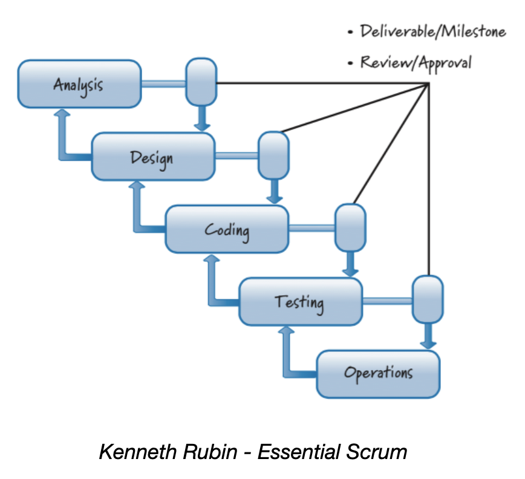
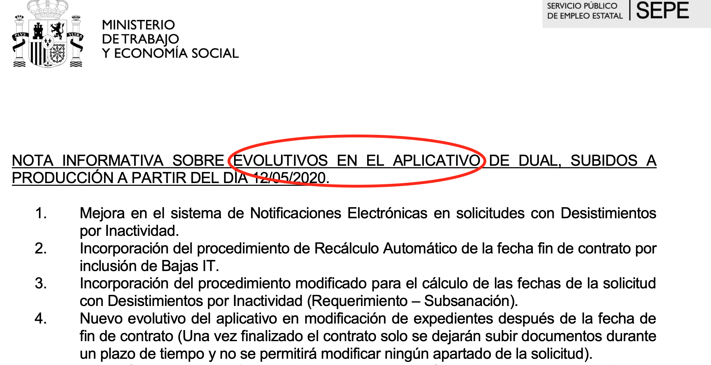
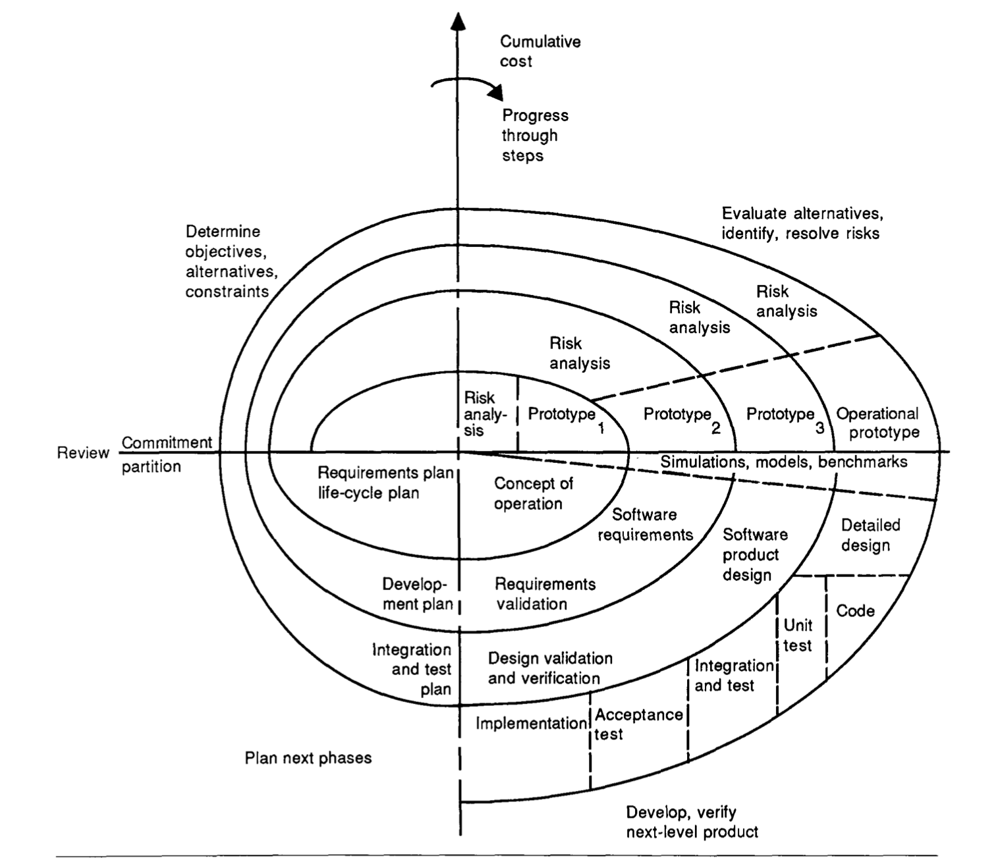
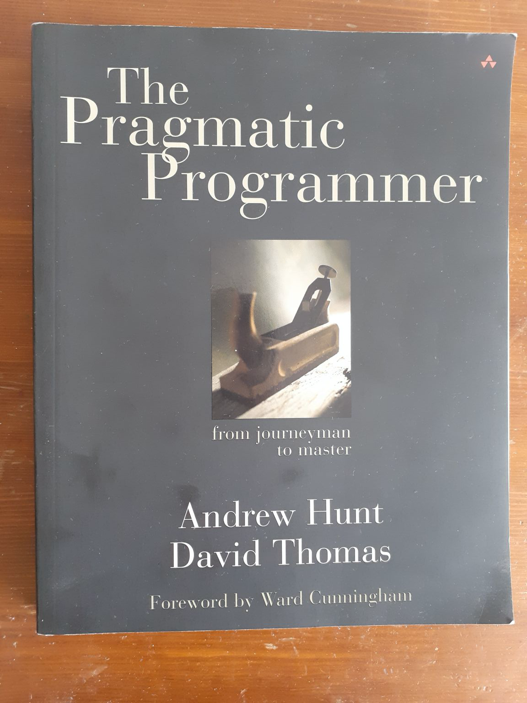
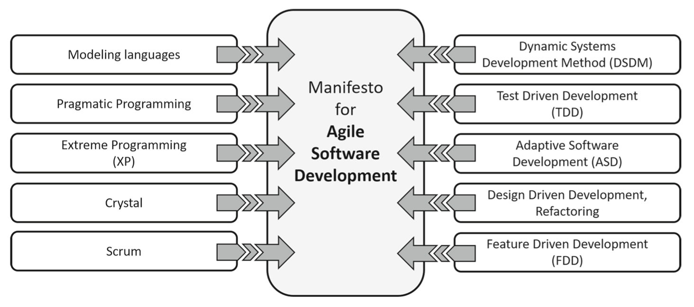

# Manifiesto Ágil #

El Manifiesto Ágil, publicado en febrero de 2001, se considera el
documento fundacional de todo el conjunto de metodologías del mismo
nombre.

Establece un conjunto de valores y principios comunes a un número de
ideas y corrientes que fueron desarrollándose en los años 90, críticas
con el modelo rígido y pesado de desarrollo de software existente en
la época.

En esta sesión vamos a poner en contexto el manifiesto, explicando
esas ideas previas, para pasar después a estudiar en detalle el
contenido del mismo.

## Tendencias previas al manifiesto ágil ##

### Modelo de cascada ###

En los años 70 y 80 la forma más generalizada de desarrollar software
era utilizando el denominado modelo de cascada (_waterfall
model_). Las empresas y consultoras más importantes estaban
convencidas de que la forma correcta de crear software era aplicando
las metodologías predictivas de las ingenierías tradicionales, en las
que se realiza primero toda la especificación y el diseño y se deja
una segunda fase la implementación, pruebas y despliegue.

A la derecha podemos ver la ilustración del modelo de cascada tal y
como se muestra en el artículo _A Spiral Model of Software Development
and Enhancement_ de Barry Bohem (1988). Vemos que el modelo de divide
el desarrollo de un producto software en 8 fases secuenciales, cada
una con su correspondiente verificación. Los errores detectados en la
verificación de una fase pueden hacer que se vuelva hacia atrás y se corrijan
algunos elementos definidos en la fase anterior.

Las 8 fases definidas son:

- Análisis de la factibilidad del sistema
- Planes de software y requerimientos
- Diseño general del producto
- Diseño detallado
- Códificación (tests unitarios)
- Integración (tests de integración)
- Despliegue (tests del sistema)
- Operaciones y mantenimiento 

Este enfoque tradicional obligaba a una cantidad muy grande de
documentación y a procesos muy burocratizados. Los errores y problemas
detectados en las fases inferiores del proceso debían ser reportados
usando protocolos muy rígidos y los cambios (denominados "evolutivos"
en el argot) debían ser aprobados por gerencia y contratados por los
clientes antes de ser incorporados en el software ("aplicativo"
también en el argot).

<table markdown="1">
<tr><td>

En España en la actualidad, dentro de ciertos ámbitos (grandes
empresas con mucho software heredado como bancos, administraciones
públicas, etc.), el modelo tradicional de cascada y su terminología
sigue estando vigente en la actualidad.

Como ejemplo, la siguiente imagen de una nota informativa del
ministerio de trabajo sobre unos cambios en aplicaciones internas, en
el que se utiliza la terminología "evolutivo en el aplicativo" para
referirse a nuevos cambios introducidos.

</tr></td></table>

### Programación y diseño orientado a objetos ###

A finales de los años 80 se popularizó un nuevo paradigma de
programación: la Programación Orientada a Objetos. Se hicieron
populares nuevos lenguajes de programación orientados a objetos como
Smalltalk, Object Pascal o C++ y las grandes empresas informáticas
comenzaron a usarlos con la esperanza de intentar mejorar los malos
resultados que se estaban obteniendo en los proyectos.

Este nuevo paradigma de programación hizo posible nuevas formas de
diseño y arquitecturas de software, como el diseño orientado a objetos
de Grady Booch, en las que el software era mucho más flexible y
modular y era mucho más fácil introducir cambios en partes del sistema
sin alterar el resto.

Por ejemplo, en su libro de 1991 _Object Oriented Design with
Applications_ Grady Booch afirma que el software creado con el diseño
orientado a objetos es resistente al cambio y tiene un nivel de
abstracción muy alto, con lo que puede ser entendido mucho mejor:

> By applying object-oriented design, we create software that is
> reslient to change and written with economy of expression. 

Y el diseño orientado a objetos también rompe con el modelo
tradicional de desarrollo en cascada y va de la mano de procesos
iterativos:

> With object-oriented design we never encounter a "big-bang" event of
> system integration. Instead, the development process results in the
> incremental production of a series of prototypes, which eventually
> evolve into the final implementation.

La llegada (para quedarse) del paradigma orientado a objetos hizo
cristalizar un conjunto de metodologías iterativas ya existentes y
puso en cuestión el modelo de cascada tradicional. Además, el
nacimiento de la [Web](https://en.wikipedia.org/wiki/World_Wide_Web)
en 1993 y las fuertes inversiones y especulaciones alrededor de las
[empresas punto-com](https://en.wikipedia.org/wiki/Dot-com_bubble) a
finales de los 90 produjo una necesidad añadida de buscar nuevas
formas de desarrollar software, más cercanas a un mundo cada vez más
cambiante y rápido.

### Desarrollo iterativo ###

En toda la historia del desarrollo de software han existido propuestas
de desarrollo iterativo o evolutivo. Craig Larman y Victor Basili las
recogen en su artículo de 2003 [_Iterative and Incremental
Development: A Brief
History_](https://www.craiglarman.com/wiki/downloads/misc/history-of-iterative-larman-and-basili-ieee-computer.pdf):

- (1940s) Ciclo PDSA (_Plan-Do-Study-Act_) de Edwards Demming.
- (1950-60s) Proyectos militares y espaciales: jet hipersónico X-15 y
  proyecto Mercury.
- (1970s) Harlan Mills _Top-down programming in large systems_
  aplicada en su trabajo en IBM en contratos con el Departamento de
  Defensa la NSA americana.
- (1976) En su libro _Software Metrics_ Tom Gilb es el primero que
  habla de _evolution_ para referirse al desarrollo de software
  iterativo:
  
    > "“Evolution” is a technique for producing the appearance of
    > stability. A complex system will be most successful if it is
    > implemented in small steps and if each step has a clear measure
    > of successful achievement as well as a “retreat” possibility to
    > a previous successful step upon failure. You have the
    > opportunity of receiving some feedback from the real world
    > before throwing in all resources intended for a system, and you
    > can correct possi- ble design errors...
    >
    > Tom Gilb (Software Metrics, 1976)

- (1983) Grady Booch publica _Software Engineering with Ada_ en el que
  propone por primera vez su metodología iterativa de diseño orientado
  a objetos.
- (1985) Barry Boehm publica uno de los artículos fundamentales del
  desarrollo iterativo: _A Spiral Model of Software Development and Enhancement_.

    

    

- (1995) El [movimiento de código abierto](https://en.wikipedia.org/wiki/History_of_free_and_open-source_software)
demostró que era posible crear de forma distribuida y auto-organizada complejos sistemas de software con
decenas de miles de líneas de código como sistemas operativos ([Linux](https://en.wikipedia.org/wiki/Linux)),
editores de texto extensibles con un lenguaje de programación incluido
([Emacs](https://en.wikipedia.org/wiki/Emacs)) o bases de datos
([MySQL](https://en.wikipedia.org/wiki/MySQL)). En 1999 Eric Raymond
publica su el libro [_The Cathedral and the Bazaar_](https://en.wikipedia.org/wiki/The_Cathedral_and_the_Bazaar) en donde analiza el
modelo de desarrollo del movimiento open source. Y en el mismo año
Andrew Hunt y David Thomas publican su influyente libro [The Pragmatic
Programmer](https://en.wikipedia.org/wiki/The_Pragmatic_Programmer) en
el que recogen buenas prácticas de programación relacionadas también
con el open source, Linux/UNIX y el desarrollo iterativo.

### Metodologías ligeras ###

Antes del manifiesto no se utilizaba la palabra "ágil", se hablaba de
metodologías "ligeras" (_lightweight_) para contraponerlas a las
distintas variantes de la metodología tradicional de cascada
existentes, denominadas todas ellas "pesadas".

En los años 90 todos estos enfoques cristalizan en un grupo de
propuestas y metodologías ligeras que se hacen populares:

- Rapid Aplication Development (RAD) y Dynamic Systems Development
  Method (DSDM) de James Martin se hacen populares en Europa a
  mediados de los 90.
- Extreme Programming (XP) nace en 1996 promovida por Kent Beck, John
  Reffries y Ward Cunningham.
- Scrum se propone en 1999 por Jeff Sutherland y Ken Schwaber
- Feature Driven Development (FDD) desarrollada por Jeff De Luca y
  Peter Coad en 1999.
- A mediados de los 90 Alistair Cockburn propone los Crystal Methods
  después de una extensa investigación con equipos exitosos en la que
  concluye que la característica fundamental de estos equipos está
  basada en las personas y sus interacciones y no en sus procesos.

De todas estas propuestas, la más popular a finales de los 90 era con
diferencia XP. Kent Beck la había hecho popular en conferencias, con
su libro de 1999 _Extreme Programming Explained_ y en cursos
organizados junto con Bob Martin.

### Los orígenes del manifiesto ###

Martín Fowler, en su artículo [_Writing The Agile
Manifesto_](https://www.martinfowler.com/articles/agileStory.html)
explica el origen de la reunión en la que se desarrolló el Manifiesto
Ágil.

En la primavera de 2000 Kent Beck invitó a una reunión a un grupo de
líderes en la comunidad XP (Bob Martin, Ward Cunningham, John Refries,
, Martin Fowler) junto con otras personas interesadas pero
que no formaban parte estrictamente de XP como Alistair Cockburn, Jim
Highsmith y Dave Thomas.

En la reunión se discutió la relación entre XP y métodos similares a
los que en esa época se denominaban _lightweight methods_. Se
analizaron las ventajas de XP como un método muy centrado en la
realidad del desarrollo, pero también se acordó que habían muchos
elementos comunes entre XP y el resto de métodos. Como resultado de
esto Bob Martin decidió organizar una reunión de gente interesadas en
este amplio rango de métodos.

Entre Bob Martin y Martin Fowler se configuró una lista de personas
posiblemente interesadas. A esta lista se unió otra de Alistair
Cockburn, con lo que se contactaron básicamente a casi todos los
principales representantes de las existentes metodologías
_ligeras_.

Se definió la fecha y el lugar de la reunión del 11 al 13 de febrero
de 2001 en el resort de Snowbird en Utah y se envió
invitaciones a todos los seleccionados para participar en la reunión
que Bob Martin bautizó con el nombre de "The Light Weight Process
Summit" (lo explica en su libro de 2019 [_Clean
Agile: Back to
Basics_](https://learning.oreilly.com/library/view/clean-agile-back/9780135782002/)). 

Bastantes de las personas invitadas no pudieron asistir finalmente,
con lo que al final quedaron en 17 asistentes. 

## El Manifiesto Ágil ##

Del 11 al 13 de febrero de 2001 tuvo lugar la reunión en el resort de
Snowbird. Los participantes pusieron ideas en común, escribieron
tarjetas, debatieron y terminaron con dos cosas concretas que pocos de
ellos esperaban al comenzar: un manifiesto y una palabra que agrupara
todo el movimiento: "Agile".

El manifiesto ocupaba una pizarra. Lo vemos en la parte derecha de la
fotografía. En la parte izquierda la famosa fotografía que hace de
background en la web en la que está publicada el manifiesto:
<http://agilemanifesto.org>.

La palabra "Agile" se escogió después de descartar algunas otras como
"Light Weight" o "Adaptive". A casi nadie le gustaba el nombre de
"ligeros". Comenta Fowler en el artículo mencionado anteriormente que
el ser ligero no era el objetivo de los métodos, era sólo un
síntoma. Al final se consideró que la palabra "ágil" capturaba bien la
adaptatividad y la respuesta al cambio que se consideraba importante
para todos los enfoques.

### Firmantes del manifiesto ###

Los firmantes del manifiesto eran representantes de las principales
metodologías _ligeras_ existentes en la época.

- **XP**: Kent Beck, Bob Martin, Ron Jeffries, Word Cunningham, Martin
  Fowler, James Grenning
- **Scrum**: Ken Schwaber, Mike Beedle, Jeff Sutherland
- **Feature Driven Development**: Jon Kern
- **Dynamic System Development Method**: Arie van Bennekum
- **Crystal Processes**: Alistair Cockburn
- **Pragmatic Programmers**: Andy Hunt, Dave Thomas
- **Model Driven**: Steve Mellor
- **Consultores**: Brian Marie y Jim Highsmith

En el artículo _"Back to the future: origins and directions
of the Agile Manifesto – views of the originators"_ se presenta esta
interesante figura con las influencias que dieron lugar al manifiesto.

<table markdown="1">
<tr><td>

Muchos de los firmantes del manifiesto siguen activos en la
actualidad, en diversas organizaciones o en redes sociales. A
continuación los listamos por orden alfabético, con enlaces a su
cuenta de Twitter y la organización en la que participan.

- Kent Beck ([Twitter](https://twitter.com/KentBeck))
- Alistair Cockburn ([Twitter](https://twitter.com/TotherAlistair), [Blog](http://alistair.cockburn.us))
- Ward Cunningham ([Twitter](https://twitter.com/WardCunningham))
- Martin Fowler ([Twitter](https://twitter.com/martinfowler), [Blog](http://martinfowler.com))
- Andrew Hunt ([Twitter](https://twitter.com/pragmaticandy), [Pragmatic Programmer](https://pragprog.com))
- Ron Jeffries ([Twitter](https://twitter.com/RonJeffries), [Blog](http://ronjeffries.com))
- Robert C. Martin ([Twitter](https://twitter.com/unclebobmartin), [Clean Code](https://sites.google.com/site/unclebobconsultingllc/))
- Ken Schwaber ([Twitter](https://twitter.com/kschwaber), [Scrum.org](https://www.scrum.org))
- Jeff Sutherland ([Twitter](https://twitter.com/jeffsutherland), [Scrum.org](https://www.scrum.org))
- Dave Thomas ([Twitter](https://twitter.com/pragdave), [Pragmatic Programmer](https://pragprog.com))

</td></tr></table>

### Valores ###

El texto principal del manifiesto lista las cuatro creencias
fundamentales en forma de **valores**, contraponiéndolas a elementos
de las metodologías tradicionales. El manifiesto establece claramente
que se prefiere los primeros, pero que éstos no reemplazan, sino que
complementan, los segundos.

> We are uncovering better ways of developing software by doing it and
> helping others do it. Through this work we have come to value: 
>
> **Individuals and interactions** over processes and tools  
> **Working software** over comprehensive documentation  
> **Customer collaboration** over contract negotiation  
> **Responding to change** over following a plan  
>
> That is, while there is value in the items on the right, we value
> the items on the left more. 

## Impacto del Manifiesto Ágil ##

## Referencias ##

- Philipp Hohl, Jil Klünder, Arie van Bennekum, Ryan Lockard, James Gifford, Jürgen Münch,
Michael Stupperich and Kurt Schneider (2018) _Back to the future: origins and directions of the “Agile Manifesto” –
views of the originators_
