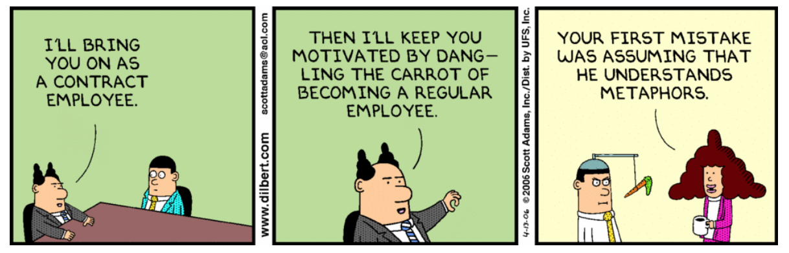

# Ejemplo de texto en Markdown #

Vamos a comprobar los distintos elementos de Markdown y ver hasta qué
punto es posible combinar HTML nativo y Markdown. La idea es hacer un
documento compatible con GitHub y con el [comando de
Python](https://gist.github.com/domingogallardo/db9278988113d1b6dff060a16d2db333)
basado en [Python-Markdown](https://python-markdown.github.io) que
convierte Markdown a HTML. 

¿Qué es el software? A estas alturas de la carrera seguro que tienes
una idea más que clara de las características del software. Es el
material principal de tu trabajo como futura ingeniera de software.

¿Serías capaz de listar algunas de estas características? ¿Cuál te
parece más importante? 


## Metodologías Ágiles de Desarrollo de Software ##

1. Software
2. Metodologías de desarrollo
3. Ágiles

## ¿Qué es para vosotros el desarrollo de software? ##

- Vamos a contestar entre todos algunas preguntas, para conocer
vuestras opiniones y experiencias:
 
    - ¿Ejemplos de desarrollo de software en los que hayas
    participado? ¿Ejemplos que conozcas?
    - ¿Cuál es el papel del desarrollador en el desarrollo de un
    proyecto software? 
    - ¿Hay otros papeles importantes en el desarrollo, aparte del
    desarrollador?
    - ¿Cuándo se ha desarrollado un buen software?
    
## Metáforas ##



- Las metáforas son muy útiles para comunicar y establecer ideas
  complejas y actitudes en una comunidad/organización/empresa: dichos,
  expresiones, giros del lenguaje
  
- Ejemplos:
    - "El tiempo es oro"
    - "Somos un equipo"
    - "La campaña de navidad"

 


<!-- 
Es necesario el atributo markdown="1"
para que python procese el markdown contenido
en la tabla
-->

<table markdown="1">
<tr><td style="background-color: #e0e0e0">

**Bloques de texto**


¡Parece que la única forma de definir bloques es usando una tabla!
Dentro de la tabla sí que es posible utilizar _markdown_ e incluir
imágenes y código. 

También podemos incluir ítems:

- Ítem 1
- Ítem 2
    - abañkabka
    - afasfasf
- Ítem 3


```swift
var x = 0
let y = x+1
x = x+y
```

</img>

- Ítem 1
- Ítem 2
    - abañkabka
    - afasfasf
- Ítem 3

</img>

- Ítem 1
- Ítem 2
    - abañkabka
    - afasfasf
- Ítem 3

</td></tr></table>

## Nueva sección ##

Aquí hemos terminado el **bloque de texto** y seguimos escribiendo
Markdown.

- Ítem 1
- Ítem 2
    - abañkabka
    - afasfasf
- Ítem 3


Vamos a ver si podemos poner una tabla a la derecha:

<table align="right">
<tr><td>
Esto es una prueba
</td></tr>
</table>

Y aquí vamos a escribir para ver si la tabla realmente está a la
derecha. Y aquí vamos a escribir para ver si la tabla realmente está a la
derecha. Y aquí vamos a escribir para ver si la tabla realmente está a la
derecha. Y aquí vamos a escribir para ver si la tabla realmente está a la
derecha. Y aquí vamos a escribir para ver si la tabla realmente está a la
derecha. Y aquí vamos a escribir para ver si la tabla realmente está a la
derecha. Y aquí vamos a escribir para ver si la tabla realmente está a la
derecha. 
