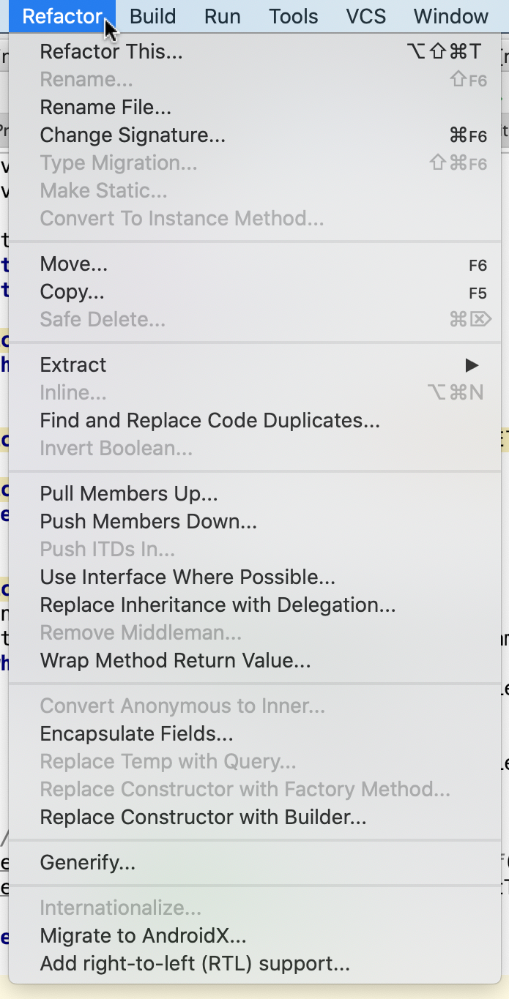

# Refactoring #

Una refactorización (_refactoring_ en inglés) de un programa consiste
en la realización de una transformación de su código fuente sin
cambiar su funcionamiento. A diferencia de un cambio del código en el
que se añaden o modifican sus funcionalidades, en una refactorización
únicamente se modifica la _estructura_ del programa.

Por ejemplo, cuando cambiamos el nombre de un método y cambiamos el
nombre de todas las invocaciones a ese método estamos haciendo un
ejemplo concreto de la refactorización `Change Function
Declaration`. 

Es el caso del ejemplo siguiente. El método `compute` de la siguiente
clase `Movie` es muy poco descriptivo.


```java
public class Movie {
    public double compute(int number) {
        ...
    }
}

    ...
    int daysRented = 4;
    double price = movie.compute(daysRented);
    ...
```

Si cambiamos el nombre del método y su invocación, queda el siguiente
código:

```java
public class Movie {
    public double getCharge(int numberOfDays) {
        ...
    }
}

    ...
    int daysRented = 4;
    double price = movie.getCharge(daysRented);
    ...
```

El comportamiento del programa no ha cambiado en absoluto. Pero hemos
modificado su diseño y lo hemos hecho más comprensible. Hemos cambiado
el nombre genérico de `calcular(int number)` por el nombre mucho más
concreto e informativo de `obtenerCargo(int diasDeAlquiler)`. Ahora
está mucho más claro qué hace ese método únicamente leyendo su nombre.

En esta sesión vamos a ver brevemente la historia de las técnicas de
refactoring, una pequeña lista de técnicas concretas, los denominados
_code smells_ que nos indican cuándo es posible que necesitemos
aplicar alguna refactorización y terminaremos con un ejemplo completo
de refactorización de código aplicando distintas técnicas completas.

Este tema está basado en la primera y segunda edición del libro
_Refactoring_ de  Martin Fowler (ver el apartado de Referencias).


## Introducción ##

El objetivo de las técnicas de refactorización es mejorar el diseño
del código, haciéndolo más sencillo, comprensible y modificable. Pero
(y esto es fundamental) sin modificar en absoluto el comportamiento
del programa.

En palabras de Martin Fowler:

> Refactoring es el proceso de cambiar un sistema de software de una
> forma que no se altera el comportamiento externo del código, pero sí
> que se mejora su estructura interna. Es una forma disciplinada de
> limpiar el código que minimiza las posibilidades de introducir
> nuevos bugs. En esencia, cuando realizas una refactorización,
> mejoras el diseño del código después de haberlo escrito.
>
> Martin Fowler (2019), Refactoring


La idea de mejorar el diseño mediante la realización de
refactorizaciones es una idea muy importante. Ya la vimos en
TDD. Tiene un impacto directo en la forma de enfrentarse al diseño del
software. 

Tradicionalmente, en las metodologías clásicas de cascada o otras
basadas en enfoques predictivos, el diseño se hace siempre al
principio, antes de empezar a desarrollar el código. Sin embargo, en
metodologías como XP, TDD o _software craftmanship_ el diseño del
software es algo que estamos mejorando continuamente. No se
sobre-diseña, sino que diseñamos sólo para lo que necesita el programa
actual. Conforme vamos escribiendo más código, añadiendo nuevas
funcionalidades, vamos también realizando rediseño mediante
refactorizaciones del código.

### Tests ###

Hemos comentado que la refactorización no debe modificar el
comportamiento del código. ¿Cómo podemos garantizar que el
funcionamiento del programa sigue siendo el mismo después de la
refactorización? La forma más habitual es mediante una batería de
tests que prueba el código que se refactoriza. Basta con comprobar,
una vez hecha la refactorización, que los tests siguen pasando.

En el libro de Michael Feathers [_Working Effectively with Legacy
Code_](https://learning.oreilly.com/library/view/working-effectively-with/0131177052/)
se explica claramente el importante papel de los tests antes de hacer
una refactorización. Para asegurar que la refactorización no rompe
nada Feathers aconseja realizar antes de cualquier refactorización una
serie de tests sobre el código que se va a refactorizar que actúen de
red de seguridad frente a los cambios.

> La acción de mejorar el diseño [del código] sin cambiar su conducta
> se denomina refactorización. La idea tras la refactorización es que
> podemos hacer el software más mantenible sin cambiar su conducta si
> escribimos tes para asegurarnos de que la conducta existente no
> cambia y realizamos pequeños cambios para verificarlo todo a lo
> largo del proceso.
>
> Michael Feathers (2004), Working Effectively with Legacy Code

Lo que nos lleva a la idea de los pequeños pasos.

### Pequeños pasos ###

Cuando empezamos a refactorizar un código es fácil empezar a pasar de
un cambio a otro de una forma descontrolada. Vemos una oportunidad de
cambio y la refactorizamos. Seguimos escarbando en el código y seguimos
encontrando cosas que cambiar. Refactorizamos más cosas y seguimos
escarbando más profundamente. Cuanto más dentro nos metemos, más
cambios hacemos. Y al final terminamos metidos en un hoyo del que es
muy difícil salir.

Si refactorizamos el código de forma descontrolada podemos terminar
introduciendo bugs sutiles que nos hagan retrasar el proyecto días o
incluso semanas. Por eso es fundamental realizar la refactorización de
forma sistemática y controlada.

Es conveniente que la refactorización se realice mediante pasos
pequeños. Una refactorización grande se puede subdividir en
refactorizaciones más elementales. El hecho de hacer pasos pequeños
hace más difícil introducir bugs. La técnica de hacer
refactorizaciones pequeñas y seguras está tomada de la idea de Kent
Beck de pequeños pasos. Aunque a veces puede parecer que los pasos son
demasiados pequeños, es una forma de obligarse a ser disciplinado y
saber que no se van a introducir bugs mientras se hace la
refactorización.

Veamos un ejemplo. Supongamos el siguiente código que calcula el
precio de un pedido:

```java
double price() {
    // price is base price - quantity discount + shipping
    return quantity * itemPrice -
        Math.max(0, quantity - 500) * itemPrice * 0.05 +
        Math.min(quantity * itemPrice * 0.1, 100.0);
}
```

La expresión es complicada y difícil de entender. Podemos aplicar
varias veces la refactorización `Extract Method`.

**Paso 1**

En el primer paso extraemos un método para el precio base:

```java
double price() {
    // price is base price - quantity discount + shipping
    return basePrice() -
        Math.max(0, quantity - 500) * itemPrice * 0.05 +
        Math.min(basePrice() * 0.1, 100.0);
}

private double basePrice() {
    return quantity * itemPrice;
}
```

**Paso 2**

En el segundo paso extraemos otro método para los gastos de envío:

```java
double price() {
    // price is base price - quantity discount + shipping
    return basePrice() -
        Math.max(0, quantity - 500) * itemPrice * 0.05 +
        shipping();
}

private double shipping() {
    return Math.min(basePrice() * 0.1, 100.0);
}

private double basePrice() {
    return quantity * itemPrice;
}
```


**Paso 3**

Y en el tercer paso extraemos el método para calcular el descuento:

```java
double price() {
    return basePrice() - discount() + shipping();
}

private double discount() {
    Math.max(0, quantity - 500) * itemPrice * 0.05
}

private double shipping() {
    return Math.min(basePrice() * 0.1, 100.0);
}

private double basePrice() {
    return quantity * itemPrice;
}
```

Veremos varios ejemplos de esta técnica de los pasos pequeños a la
hora de realizar refactorizaciones.

### Orígenes de las técnicas de refactorización ###

Es difícil encontrar el origen de la palabra o el concepto de
_refactoring_. La idea de modificar el código fuente para mejorar su
diseño ha estado presente desde el principio de la historia de la
programación.

Pero sí que podemos trazar el origen de la idea de usar la
refactorización como un elemento fundamental del proceso de diseño de
software. Ward Cunningham y Kent Beck, que trabajaban en los 80 con
Smalltalk (uno de los primeros lenguajes orientados a objetos),
exploraron en el entorno de desarrollo de Smalltalk ideas como las de
patrones de diseño, testing y refactorización. Estas ideas dieron
lugar al desarrollo de Extreme Programming  por parte de Kent Beck. En
la práctica de estas ideas se dieron cuenta de que la refactorización
era una de las prácticas más importante en la mejora de su
productividad. 

La comunidad de Smalltalk adoptó rápidamente las técnicas de
refactorización debido a que varias de estas técnicas se incluyeron en
el entorno de desarrollo (una de las características de Smalltalk es
que junto con el lenguaje se acompaña un entorno de desarrollo nativo,
escrito en el propio Smalltalk).

En los años 90, con la popularización de XP y de TDD, la idea de
refactorizar el código fue ganando interés entre distintas comunidades
de desarrollo y programadores de distintos lenguajes de
programación.

Y a finales de los 90 Martin Fowler publicó el libro fundacional
_Refactoring_. Utilizando Java como lenguaje de ejemplo, en él se
formaliza la idea de la refactorización y se proporcionan un enorme
número de ejemplos y patrones de refactorización, dándoles nombre y
categorizándolos. El libro se hizo muy popular y toda la industria
adoptó rápidamente sus ideas. La refactorización se introdujo también
a partir de entonces en muchas herramientas y entornos de
programación, sobre todo de Java.

Hoy en día la refactorización se ha convertido en una práctica común
en el desarrollo de software.



### Refactorización en los IDEs ###

Aunque veremos que no es complicado realizar las refactorizaciones
manualmente, es posible usar las acciones de refactorización de los
IDEs que, en ocasiones, pueden ser de ayuda.

Casi todos los IDEs tienen la refactorización más básica, que es la de
renombrar un método, variable o función. Para realizar de forma
correcta la refactorización el IDE tiene que usar el análisis
sintáctico del código fuente para identificar quién usa esa variable,
método o función y no limitarse a hacer una mera substitución y
reemplazo de un texto por otro.

Entre los IDEs más avanzados en capacidades de refactorización se
encuentra IntelliJ. En la imagen de la derecha mostramos la cantidad
de opciones que tiene el menú `Refactoring`.

Podemos ver una introducción a las capacidades de refactorización de
IntelliJ en el tutorial [Introduction to
refactoring](https://www.jetbrains.com/help/idea/tutorial-introduction-to-refactoring.html). Y
también en bastantes vídeos del canal de IntellJ, como por ejemplo
[Extract Refactorings in
Action](https://www.youtube.com/watch?v=UYrhNG9bRng&t=6s). El manual
completo con todas las opciones de refactorización de IntellJ se
encuentra en [este
enlace](https://www.jetbrains.com/help/idea/refactoring-source-code.html).

## Listado de refactorizaciones ##

En la primera edición del libro de Martin Fowler se presentan 72
refactorizaciones. En la segunda quedan reducidas a 61. Es una lista
amplia que recopila y da nombre a la mayoría de patrones más
usados. La lista completa la puedes consultar en la web de Fowler
[refactoring.com](https://refactoring.com/catalog/).

En la siguiente imagen se muestra el listado de las 61
refactorizaciones (lo que aparece entre paréntesis es la página del
libro en la que se explica esa refactorización):


Obviamente, son demasiadas para verlas en clase. Pero sí que podemos
repasar cuatro de ellas, con el objetivo de estudiar la técnica en más
profundidad, estudiando ejemplos concretos de su uso.

Aunque la segunda edición del libro está escrito en el lenguaje
JavaScript, utilizaremos los ejemplos de la primera edición, escritos
en Java.

### Extract Method ###

En la refactorización `Extraer método` se encapsula un conjunto de
código en una función y se reemplaza ese código por una llamada a la
nueva función.

Esta refactorización hace que el código sea mucho más comprensible y
reduce el tamaño del método o función de la que se extrae el
código. Un principio fundamental del buen diseño es el uso de métodos
y funciones muy cortos.

> He desarrollado el hábito de escribir funciones muy cortas,
> típicamente de sólo unas pocas líneas de código. Para mi, cualquier
> función con más de media docena de líneas empieza a oler, y tengo
> bastantes funciones con una única línea de código.
>
> Martin Fowler, Refactoring

Una indicación de que esta refactorización es necesaria suele ser la
utilización de comentarios para explicar qué hace el código a
continuación. Podemos coger ese código, extraerlo a un método y
ponerle al método el nombre del comentario.

#### Ejemplo 1 ####

**Código inicial**

```java
void printOwing(double amount) {
    printBanner();

    //print details
    System.out.println ("name:" + name);
    System.out.println ("amount" + amount);
}
```

El comentario `print details` nos da una pista de que podemos extraer
las dos líneas siguientes en un método.

**Código refactorizado**

```java
void printOwing(double amount) {
    printBanner();
    printDetails(amount);
}

void printDetails (double amount) {
    System.out.println ("name:" + name);
    System.out.println ("amount" + amount);
}
```

#### Ejemplo 2 ####

Veamos ahora un ejemplo algo más complicado, en el que el código
extraído usa una variable que hay que pasar como parámetro.

**Código inicial**

```java
void printOwing(double previousAmount) {

    Enumeration e = orders.elements();
    double outstanding = previousAmount * 1.2;

    printBanner();

    // calculate outstanding
    while (e.hasMoreElements()) {
        Order each = (Order) e.nextElement();
        outstanding += each.getAmount();
    }

    printDetails(outstanding);
}
```

El código anterior recibe un parámetro `double previousAmount`,
imprime una cabecera, después realiza el cálculo de la cuenta, que
guarda en la variable `double outstanding` y, por último, imprime la
cantidad calculada.

Podemos extraer el código del cálculo de la cuenta en un
método. Como el método usa un valor inicial, podemos pasar este valor
inicial por parámetro.


**Código refactorizado**

```java
void printOwing(double previousAmount) {
    printBanner();
    double outstanding = getOutstanding(previousAmount * 1.2);
    printDetails(outstanding);
}

double getOutstanding(double initialValue) {
    double result = initialValue;
    Enumeration e = orders.elements();
    while (e.hasMoreElements()) {
        Order each = (Order) e.nextElement();
        result += each.getAmount();
   }
    return result;
}
```

### Move Method ###

La refactorización `Mover método` consiste, como su nombre indica, en
mover un método de una clase a otra. El método antiguo
podemos transformarlo en una delegación, manteniendo sin cambios el
código llamador, o eliminarlo y sustituir el código llamador por una
llamada al nuevo método.

Esta refactorización se utiliza cuando nos damos cuenta de que el
método está más relacionado con otra clase y que mejoramos la
modularidad del programa realizando el cambio. Para conseguir una
buena modularidad debemos agrupar métodos y atributos que estén
relacionados y que cambien al mismo tiempo. Cuando haya
que hacer un cambio no habrá que tocar distintas clases, sino que
limitaremos el alcance de los cambios el máximo posible.

#### Ejemplo ####

Tenemos el método `overdraftCharge()` que calcula un cargo en función
del tipo de cuenta.

**Código inicial**

```java
public class Account {
    private AccountType type;
    private int daysOverdrawn;
    ...
    double overdraftCharge() {
        if (type.isPremium()) {
             double result = 10;
             if (daysOverdrawn > 7) result += (daysOverdrawn - 7) * 0.85;
             return result;
        }
        else return daysOverdrawn * 1.75;
    }

    double bankCharge() {
        double result = 4.5;
        if (daysOverdrawn > 0) result += overdraftCharge();
        return result;
    }
}
```

Podemos mover el método `overdraftCharge()` a la clase `AccountType` y
mantener el método `overdraftCharge()` en `Account` que realiza una
llamada el método trasladado.

**Código refactorizado**

```java
public class Account {
    ...
    double overdraftCharge() {
        return type.overdraftCharge(daysOverdrawn);
    }
    
    double bankCharge() {
        double result = 4.5;
        if (daysOverdrawn > 0) result += overdraftCharge();
        return result;
    }
}

public class AccountType {
    ...
    double overdraftCharge(int daysOverdrawn) {
        if (isPremium()) {
            double result = 10;
            if (daysOverdrawn > 7) result += (daysOverdrawn - 7) * 0.85;
            return result;
        }
        else return daysOverdrawn * 1.75;
    }
}
```


### Replace Temp with Query ###

En la refactorización `Reemplazar variable auxiliar por invocación` se
sustituye el uso de una variable auxiliar por una llamada a un método.

Las variables auxiliares permiten capturar el valor de algún código
para usarlo posteriormente. El uso de una variable auxiliar permite
referirnos a su valor al tiempo que lo explicamos (con el nombre de la
variable) y también evitamos repetir el código que lo calcula.

Sin embargo, a veces es mejor sustituir el uso de estas variables por
llamadas a un método que realizan el cálculo y devuelven el
valor. Esto nos permite encapsular este cálculo y evitar
duplicaciones.

Esta refactorización (al igual que `Extract Method`) funciona bien
cuando estamos dentro de una clase, ya que la clase proporciona el
contexto del que el nuevo método puede obtener los atributos y no es
necesario añadir demasiados parámetros.

#### Ejemplo 1 ####

En el siguiente código usamos varias veces la variable auxiliar
`basePrice`.

**Código inicial**

```java
    double basePrice = quantity * itemPrice;
    if (basePrice > 1000)
        return basePrice * 0.95;
    else
        return basePrice * 0.98;
```

Si aplicamos la refactorización definimos el valor de `basePrice` en
un método y usamos una invocación a ese método en el código
principal. El código queda mucho más claro, porque encapsulamos el
cálculo del precio base y no se mezcla ese cálculo con la decisión de
hacer el descuento.

**Código refactorizado**

```java
    if (basePrice() > 1000)
        return basePrice() * 0.95;
    else
        return basePrice() * 0.98;
...
  double basePrice() {
      return quantity * itemPrice;
  }
```

#### Ejemplo 2 ####

Vamos a complicar un poco más el ejemplo anterior, añadiendo otra
variable auxiliar `discountFactor`.

**Código inicial**

```java
double getPrice() {
    int basePrice = quantity * itemPrice;
    double discountFactor;
    if (basePrice > 1000) discountFactor = 0.95;
    else discountFactor = 0.98;
    return basePrice * discountFactor;
}
```

**Paso 1**

Empezamos haciendo la misma refactorización que en el ejemplo 1 y
sustituimos la variable auxiliar `basePrice` por una llamada al método
`basePrice()`. 

```java
double getPrice() {
    double discountFactor;
    if (basePrice() > 1000) discountFactor = 0.95;
    else discountFactor = 0.98;
    return basePrice() * discountFactor;
}

private int basePrice() {
    return quantity * itemPrice;
}
```

**Paso 2**

Ahora aplicamos `Extract Method` y realizamos el cálculo del descuento
en el método `discountFactor()`:

```java
double getPrice() {
    double discountFactor = discountFactor()
    return basePrice() * discountFactor;
}

private int basePrice() {
    return quantity * itemPrice;
}

private double discountFactor() {
    if (basePrice() > 1000) return 0.95;
    else return 0.98;
}
```


**Código refactorizado (Paso 3)**

Por último aplicamos la refactorización `Inline Variable` (no la hemos
comentado aquí) y eliminamos el uso de la variable `discountFactor`,
sustituyéndola por la invocación al método:


```java
double getPrice() {
    return basePrice() * discountFactor();
}

private int basePrice() {
    return quantity * itemPrice;
}

private double discountFactor() {
    if (basePrice() > 1000) return 0.95;
    else return 0.98;
}
```


### Parameterize Function ###

La refactorización `Parametrizar función` permite unificar varias
funciones o métodos que tienen una lógica similar en una única función
o método añadiendo algún parámetro adicional.

Los parámetros de una función definen cómo esa función encaja en el
resto del mundo. Los parámetros definen quiénes van a poder usar la
función. Si tenemos una función que formatea el número de teléfono de
una persona, y esa función toma como argumento a una persona, entonces
no podré usarla para formatear el número de teléfono de una
empresa. Sin embargo, si cambiamos el parámetro persona por propio número
de teléfono, el código de formateo va a poder ser usado desde más
sitios. 

Además, al escoger un parámetro más concreto, puedo mejorar la
modularidad porque puedo mover la función a un sitio en el que no se
necesite saber nada de personas, sólo de formateo.

En el caso de la técnica de `parametrizar función` la decisión de qué
parámetro usar no es difícil de tomar porque viene dada directamente
por los distintos ejemplos del código que queremos parametrizar.

#### Ejemplo 1 ####

Empezamos por un ejemplo muy sencillo, en el que tenemos dos métodos
que cambian el salario de un empleado, uno subiéndolo un 10% y otro un
5%. 

**Código inicial**

```java
public class Employee {
    void tenPercentRise() {
        salary *= 1.1;
    }
    
    void fivePercentRise() {
        salary *= 1.05;
    }
}

    ...
    employee.tenPercentRise();
    otherEmployee.fivePercentRise();
    ...
```

La refactorización es bastante sencilla: definimos un método con un
parámetro que define el porcentaje de subida del sueldo.

**Código refactorizado**

```java
public class Employee {
    void raisePercentage(double percentage) {
        salary *= (1 + (percentage / 100));
    }
}

    ...
    employee.raisePercentage(10);
    otherEmployee.raisePercentage(5);
    ...
```


#### Ejemplo 2 ####

En este segundo ejemplo tenemos dos métodos que hacen una reserva de
un libro. El primero una reserva normal y el segundo una reserva
prioritaria.

**Código inicial**

```java
public class Book {
    ...
    public void addReservation(Customer customer) {
        this.reservations.push(customer);
    }
    
    public void addReservationWithPriority(Customer customer) {
        this.priorityReservations.push(customer);
    }
}

    ...
    book.addReservation(aCustomer);
    ...
    // cliente prioritario
    book.addReservationWithPriority(prioritaryCustomer);
    ...
```

En el método refactorizado incorporamos el parámetro booleano
`priority` que puede ser `true` o `false`:


**Código refactorizado**

```java
public class Book {
    ...
    public void addReservation(Customer customer, boolean priority) {
        if (priority) {
            this.priorityRservations.push(customer);
        } else {
            this.reservations.push(customer);
        }
    }
}

    ...
    book.addReservation(aCustomer, false);
    ...
    // cliente prioritario
    book.addReservation(prioritaryCustomer, true);
    ...
```


## Code smells ##

En el contexto del refactoring se habla de _[bad code
smells](https://en.wikipedia.org/wiki/Code_smell)_ (malos olores en el
código) para referirse a indicaciones de que hay problemas en el
diseño del código y que podría ser necesario introducir una
refactorización en ese punto. 

En general estas indicaciones van desde problemas relativamente
sencillos y frecuentes como nombres incorrectos, código repetido,
funciones y métodos demasiado largos, etc. hasta problemas más
complejos relacionados con el incumplimiento de alguno de los
principios SOLID.

### Lista de indicadores de mal diseño ###

En el libro de Fowler se realiza un listado de estos indicadores de
mal diseño (_bad code smells_) y una explicación de qué
refactorizaciones podrían ser más adecuadas para corregir el mal
diseño, en el caso en que lo hubiera. Listamos a continuación los más
importantes, en el orden y con el nombre que aparecen en la segunda
edición.

- Mysterious Name (Nombre misterioso)
- Duplicate Code (Código duplicado)
- Long Function (Función larga)
- Long Parameter List (Lista de parámetros larga)
- Global Data (Datos globales)
- Mutable Data (Datos mutables)
- Message Chains (Cadenas de mensajes)
- Middle Man (Intermediario)
- Large Class (Clase grande)
- Refused Bequest (Legado rechazado)

Y vamos a explicarlos brevemente.

#### Mysterious Name ####

#### Duplicate Code ####

DRY

#### Long Function ####

#### Long Parameter List ####

#### Global Data ####

#### Mutable Data ####

#### Message Chains ####

#### Middle Man ####

#### Large Class ####

#### Refused Bequest ####

_Legado rechazado_


## Ejemplo completo ##

Veamos un ejemplo completo  que usa alguna de las refactorizaciones
presentadas anteriormente.

Está sacado del libro de Martin Fowler _Refactoring_.


### Versión inicial ###

DESCRIPCIÓN DEL NEGOCIO DE ALQUILER DE PELÍCULAS

**Clase Movie**

```java
public class Movie {

    public static final int CHILDRENS = 2;
    public static final int REGULAR = 0;
    public static final int NEW_RELEASE = 1;

    private String title;
    private int priceCode;

    public Movie(String title, int priceCode) {
        this.title = title;
        this.priceCode = priceCode;
    }

    public int getPriceCode() {
        return priceCode;
    }

    public void setPriceCode(int arg) {
        priceCode = arg;
    }

    public String getTitle (){
        return title;
    };
}
```


**Clase Rental**

```java
class Rental {
    private Movie movie;
    private int daysRented;

    public Rental(Movie movie, int daysRented) {
        this.movie = movie;
        this.daysRented = daysRented;
    }
    public int getDaysRented() {
        return daysRented;
    }
    public Movie getMovie() {
        return movie;
    }
}
```

**Clase Customer**

```java
import java.util.Enumeration;
import java.util.Vector;

class Customer {
    private String name;
    private Vector rentals = new Vector();

    public Customer(String name) {
        this.name = name;
    }

    public void addRental(Rental arg) {
        rentals.addElement(arg);
    }

    public String getName() {
        return name;
    }

    public String statement() {
        double totalAmount = 0;
        int frequentRenterPoints = 0;
        Enumeration allRentals = rentals.elements();
        String result = "Rental Record for " + getName() + "\n";
        while (allRentals.hasMoreElements()) {
            double thisAmount = 0;
            Rental each = (Rental) allRentals.nextElement();

            //determine amounts for each line
            switch (each.getMovie().getPriceCode()) {
                case Movie.REGULAR:
                    thisAmount += 2;
                    if (each.getDaysRented() > 2)
                        thisAmount += (each.getDaysRented() - 2) * 1.5;
                    break;
                case Movie.NEW_RELEASE:
                    thisAmount += each.getDaysRented() * 3;
                    break;
                case Movie.CHILDRENS:
                    thisAmount += 1.5;
                    if (each.getDaysRented() > 3)
                        thisAmount += (each.getDaysRented() - 3) * 1.5;
                    break;
            }

            // add frequent renter points
            frequentRenterPoints++;
            // add bonus for a two day new release rental
            if ((each.getMovie().getPriceCode() == Movie.NEW_RELEASE) &&
                    each.getDaysRented() > 1) frequentRenterPoints++;
            //show figures for this rental
            result += "\t" + each.getMovie().getTitle() + "\t" +
                    String.valueOf(thisAmount) + "\n";
            totalAmount += thisAmount;

        }
        //add footer lines
        result += "Amount owed is " + String.valueOf(totalAmount) + "\n";
        result += "You earned " + String.valueOf(frequentRenterPoints) +
                " frequent renter points";
        return result;
    }
}
```


**Clase Main**

```java
public class Main {
    public static void main(String[] args) {
        Movie tenet = new Movie("Tenet", Movie.NEW_RELEASE);
        Movie busan = new Movie("Train to Busan", Movie.REGULAR);
        Movie padre = new Movie("Padre no hay más que uno", Movie.CHILDRENS);

        Rental rental1 = new Rental(tenet, 2);
        Rental rental2 = new Rental(busan, 2);
        Rental rental3 = new Rental(padre, 1);

        Customer customer = new Customer("domingogallardo");

        customer.addRental(rental1);
        customer.addRental(rental2);
        customer.addRental(rental3);

        System.out.println(customer.statement());
    }
}
```


Salida de la ejecución:

```
Rental Record for domingogallardo
	Tenet	6.0
	Train to Busan	2.0
	Padre no hay más que uno	1.5
Amount owed is 9.5
You earned 4 frequent renter points
```


### Refactorización para imprimir la cuenta en HTML ###

Supongamos que el cliente para el que hemos hecho el programa nos pide
que el resultado de la cuenta no sea en texto plano sino que sea en
HTML.

Podríamos copiar y pegar el código del método `statement()`, en un
nuevo método `htmlStatement()` en el que mantuviéramos los cálculos y
cambiáramos las sentencias de texto. El problema de esto es que
tendríamos duplicado el código con los cálculos y en el momento que
haya que cambiar algo este código habrá que hacerlo en dos sitios, con
los problemas que eso puede conllevar.

Vamos entonces a realizar una refactorización que que simplifique el
código del método `statement()` para que sólo se encargue de imprimir
y cumpla el principio de responsabilidad única.

#### Paso 1: Extract Method ####

Extraemos del método `Customer.statement()` el código que calcula el
precio de un alquiler y lo colocamos en el método `amountFor(Rental)`
de la propia clase.

La clase `Customer` queda así (mostramos sólo las líneas cambiadas y
el contexto en el que están definidas):

```java
class Customer {
    ...
    
    public String statement() {
        ...
        while (allRentals.hasMoreElements()) {
            double thisAmount = 0;
            Rental each = (Rental) allRentals.nextElement();
            thisAmount = amountFor(each);
            ...
            totalAmount += thisAmount;

        }
        ...
    }

    private double amountFor(Rental each) {
        double thisAmount = 0;
        //determine amounts for each line
        switch (each.getMovie().getPriceCode()) {
            case Movie.REGULAR:
                thisAmount += 2;
                if (each.getDaysRented() > 2)
                    thisAmount += (each.getDaysRented() - 2) * 1.5;
                break;
            case Movie.NEW_RELEASE:
                thisAmount += each.getDaysRented() * 3;
                break;
            case Movie.CHILDRENS:
                thisAmount += 1.5;
                if (each.getDaysRented() > 3)
                    thisAmount += (each.getDaysRented() - 3) * 1.5;
                break;
        }
        return thisAmount;
    }
}
```


#### Paso 2: Rename Variable ####

Renombramos las variables `each` y `thisAmount` del método recién
introducido `amountFor(Rental)` por los nombres más apropiados
`aRental` y `result`. El método queda así:

```java
class Customer {
    ...
    
    private double amountFor(Rental aRental) {
        double result = 0;
        //determine amounts for each line
        switch (aRental.getMovie().getPriceCode()) {
            case Movie.REGULAR:
                result += 2;
                if (aRental.getDaysRented() > 2)
                    result += (aRental.getDaysRented() - 2) * 1.5;
                break;
            case Movie.NEW_RELEASE:
                result += aRental.getDaysRented() * 3;
                break;
            case Movie.CHILDRENS:
                result += 1.5;
                if (aRental.getDaysRented() > 3)
                    result += (aRental.getDaysRented() - 3) * 1.5;
                break;
        }
        return result;
    }
}

```


#### Paso 3: Move Method ####

El método `amountFor(Rental)` es más apropiado que esté en la clase
`Rental`. Movemos el código de ese método a esa clase, creando un
nuevo método denominado `getCharge()`. Sustituimos el código original
por una llamada al método:


```java
class Customer {
    ...
    private double amountFor(Rental rental) {
        return rental.getCharge();
    }
}

class Rental {
    ...
    double getCharge() {
        double result = 0;
        //determine amounts for each line
        switch (getMovie().getPriceCode()) {
            case Movie.REGULAR:
                result += 2;
                if (getDaysRented() > 2)
                    result += (getDaysRented() - 2) * 1.5;
                break;
            case Movie.NEW_RELEASE:
                result += getDaysRented() * 3;
                break;
            case Movie.CHILDRENS:
                result += 1.5;
                if (getDaysRented() > 3)
                    result += (getDaysRented() - 3) * 1.5;
                break;
        }
        return result;
    }
}
```


#### Paso 4: Inline Method ####

Sustituimos la llamada a `amountFor()` en el método
`Customer.statement()` por el propio código del método y eliminamos
`amountFor()`:


```java

class Customer {
    ...
    public String statement() {
        ...
        while (allRentals.hasMoreElements()) {
            ...
            thisAmount = each.getCharge();
            ...
        }
        ...
    }
    
    // Eliminimamos el método amountFor()
}

```

#### Paso 5: Replace Temp with Query ####

Para hacer más entendible el código, sustituimos el uso de la variable temporal
`thisAmount` por una llamada a `each.getCharge()`. De esta forma
eliminamos una indirección, eliminamos la posibilidad de efectos
laterales y tenemos claro qué valor es el que estamos imprimiendo y
sumando al total.

```diff
class Customer {
    ...
    public String statement() {
        ...
        while (allRentals.hasMoreElements()) {
            ...
-           thisAmount = each.getCharge();
            ...
            result += "\t" + each.getMovie().getTitle() + "\t" +
+                    String.valueOf(each.getCharge()) + "\n";
+            totalAmount += each.getCharge();
        }
        ...
    }
}
```

Se podría argumentar que este código es menos eficiente que el
anterior. Pero en la realidad el cambio de eficiencia es mínimo. El
método `getCharge()` tiene una complejidad temporal de `O(1)` y no
afecta para nada a la eficiencia del programa llamarlo dos veces en
lugar de una (aunque estemos dentro de un bucle).

<table><tr><td>

**¿Código optimizado o código comprensible?**

Muchas veces nos vemos tentados a hacer el código menos entendible en
aras de una supuesta optimización. Existen programadores a los que les
gusta hacer continuamente estas optimizaciones y conseguir arañar
milisegundos de eficiencia. El problema es que el código resultante
muchas veces es menos comprensible y modificable que el original. Si
en algún momento hay que modificar ese código optimizado, tendremos
primero que perder el tiempo para entender qué era lo que hacía y
después tendremos casi seguramente que deshacer la optimización para
introducir la modificación.

Muchas supuestas optimizaciones que se realizan en el código resultan
no siendo tales, porque se hace un trabajo redundante al que realiza
el compilador o incluso se dificulta su funcionamiento. Los
compiladores modernos son muy avanzados y el código que generan es un
código altamente optimizado. No hagamos un trabajo que ya está
haciendo el compilador.

Mi consejo es que, en general, nunca debemos hacer el programa menos
comprensible por el hecho de intentar hacerlo más eficiente. Sólo
cuando hagamos un análisis de rendimiento y detectemos los verdaderos
cuellos de botella del programa es cuando tendremos que centrarnos en
optimizar su rendimiento. Pero sólo de aquel código responsable del
cuello de botella.

</table></tr></td>


#### Paso 6: Extract + Move Method ####

Repetimos la extracción de otra parte del código y lo movemos también
a la clase `Rental`. Esta vez el código que calcula los puntos de
promoción que gana el cliente por los alquileres.

```java
class Customer {
    ...
    public String statement() {
        ...
        while (allRentals.hasMoreElements()) {
            ...
            frequentRenterPoints += each.getFrequentRenterPoints();
            ...
        }
        ...
    }
}

class Rental {
    ...
    int getFrequentRenterPoints() {
        if ((getMovie().getPriceCode() == Movie.NEW_RELEASE) &&
                getDaysRented() > 1)
            return 2;
        else return 1;
    }
}
```


#### Paso 7: Replace Temp with Query ####

El último paso para dejar en el método `statement` sólo lo relacionado
con la impresión es sacar del bucle los cálculos del total de la
cuenta y del total de puntos de promoción.

Crearemos dos métodos que calculan esos totales y que podrán ser
usados tanto desde el actual método que imprime la cuenta como desde
el futuro método que lo hace en HTML.

Es un ejemplo de la refactorización _Replace Temp with Query_ pero
algo más complicado porque para realizar el cálculo hay que copiar
todo el bucle dentro del método al que se llama.

El código queda así:

```java
class Customer {
    ...
    public String statement() {
        Enumeration allRentals = rentals.elements();
        String result = "Rental Record for " + getName() + "\n";
        while (allRentals.hasMoreElements()) {
            Rental each = (Rental) allRentals.nextElement();

            //show figures for this rental
            result += "\t" + each.getMovie().getTitle() + "\t" +
                    String.valueOf(each.getCharge()) + "\n";
        }
        //add footer lines
        result += "Amount owed is " + String.valueOf(getTotalCharge()) + "\n";
        result += "You earned " + String.valueOf(getTotalFrequentRenterPoints()) +
                " frequent renter points";
        return result;
    }

    private double getTotalCharge() {
        double result = 0;
        Enumeration elements = rentals.elements();
        while (elements.hasMoreElements()) {
            Rental each = (Rental) elements.nextElement();
            result += each.getCharge();
        }
        return result;
    }

    private double getTotalFrequentRenterPoints() {
        double result = 0;
        Enumeration elements = rentals.elements();
        while (elements.hasMoreElements()) {
            Rental each = (Rental) elements.nextElement();
            result += each.getFrequentRenterPoints();
        }
        return result;
    }

}
```

#### Paso 8: Añadir método que genera el HTML ####

Y ahora ya estamos en situación de hacer fácil la adición del código
que genera el HTML:

```java
    ...
    public String htmlStatement() {
        Enumeration allRentals = rentals.elements();
        String result = "<h1>Rental Record for <em>" + getName() + "</em></h1>\n";
        result += "<ul>\n";
        while (allRentals.hasMoreElements()) {
            Rental each = (Rental) allRentals.nextElement();

            //show figures for this rental
            result += "<li>" + each.getMovie().getTitle() + ":" +
                    String.valueOf(each.getCharge()) + "</li>\n";
        }
        result += "</ul>\n";
        //add footer lines
        result += "<p>Amount owed is <em>" + String.valueOf(getTotalCharge()) + "</em></p>\n";
        result += "<p>You earned <em>" + String.valueOf(getTotalFrequentRenterPoints()) +
                "</em> frequent renter points</p>\n";
        return result;
    }
```

Al extraer todos los cálculos hemos podido crear el método
`htmlStatement` y reutilizar todo el código de cálculo que estaba en
el método original. No hemos copiado y pegado, de forma que si las
reglas de cálculo cambian solo tenemos que ir a modificarlas a un
único sitio.

### Refactorización para introducir herencia y polimorfismo ###

Supongamos que ahora nuestro cliente está planeando de hacer cambios
en la clasificación de las películas. Todavía no está claro que
cambios van a ser, pero parece que se van a introducir nuevas
categorías y se tendrán que decidir el cargo y los puntos de promoción
de estas nuevas categorías.

Vamos ahora a mejorar el diseño para evitar tener que entrar en los
códigos condicionales cada vez que vayamos a hacer alguna de estas
modificaciones. 

Haremos una refactorización en la que reemplazaremos la lógica
condicional por polimorfismo.

#### Paso 1: Move Method ####

Movemos el código del método `Rental.getCharge()` a la clase `Movie`,
que es donde debería estar. Un indicador de ello es que estamos
haciendo un `switch` basándonos en un atributo de otro objeto. Si
tenemos que hacer un `switch` debemos hacerlo basándonos en nuestros
propios datos, no en los datos de otro.

Quedaría así:

```java
class Rental {
    ...
    double getCharge() {
        return movie.getCharge(daysRented);
    }
    ...
}

public class Movie {
    ...
    double getCharge(int daysRented) {
        double result = 0;
        //determine amounts for each line
        switch (getPriceCode()) {
            case Movie.REGULAR:
                result += 2;
                if (daysRented > 2)
                    result += (daysRented - 2) * 1.5;
                break;
            case Movie.NEW_RELEASE:
                result += daysRented * 3;
                break;
            case Movie.CHILDRENS:
                result += 1.5;
                if (daysRented > 3)
                    result += (daysRented - 3) * 1.5;
                break;
        }
        return result;
    }
    ...
```


#### Paso 2: Move Method ####

Hacemos lo mismo con el cálculo de los puntos de promoción por
alquiler frecuente.

```java
class Rental {
    ...
    int getFrequentRenterPoints() {
        return movie.getFrequentRenterPoints(daysRented);
    }
}

public class Movie {
    ...
    int getFrequentRenterPoints(int daysRented) {
        if ((getPriceCode() == Movie.NEW_RELEASE) &&
                daysRented > 1)
            return 2;
        else return 1;
    }
    ...
```

#### Paso 3: Encapsulate Variable ####

Vamos a comenzar ahora el proceso de introducir la herencia y el
polimorfismo. 

Nuestra primera idea sería hacer una subclase de `Movie` por cada tipo
de película. Una clase `RegularMovie` otra `NewReleaseMovie`,
etc. 


Pero esto es problemático y no funciona, porque una película puede
cambiar su clase durante su vida. Podría ser que inicialmente una
película fuera `NewReleseMovie` y después pasara a ser
`RegularMovie`. Sin embargo un objeto no puede cambiar de clase en su
ciclo de vida.

Podemos modelar esto usando el patrón _State_, en el que definimos un
atributo `price` que es que define el tipo de película. Lo muestra la
siguiente figura:


De esta forma para que una película cambiara de clase sólo tendríamos
que asociarle un nuevo objeto de tipo `Price`.

Para hacer esto, lo primero que debemos hacer es encapsular el
atributo `price` de `Movie` de forma que todos los accesos a él sean a
través de un método `getter` o `setter`.

Sólo hay que cambiar el acceso en el constructor de `Movie`:

```diff
    public Movie(String title, int priceCode) {
         this.title = title;
-        this.priceCode = priceCode;
+        setPriceCode(priceCode);
     }

```

#### Paso 4: Replace Type Code with State ####

En este paso introducimos la clase `Price` y reemplazamos la
instancia de tipo `int` en la que codificábamos el tipo de película
por un objeto de este tipo. El código `int` para el tipo de película
lo seguimos manteniendo, pero encapsulado en el objeto de tipo `Price`.

```java
public class Movie {
    ...
    private Price price;
    ...
    public int getPriceCode() {
        return price.getPriceCode();
    }

    public void setPriceCode(int arg) {
        switch (arg) {
            case REGULAR:
                price = new RegularPrice();
                break;
            case CHILDRENS:
                price = new ChildrensPrice();
                break;
            case NEW_RELEASE:
                price = new NewReleasePrice();
                break;
            default:
                throw new IllegalArgumentException("Incorrect Price Code");
        }
    }
    ...
}

abstract public class Price {
    abstract int getPriceCode();
}

class ChildrensPrice extends Price {
    int getPriceCode() {
        return Movie.CHILDRENS;
    }
}

class NewReleasePrice extends Price {
    int getPriceCode() {
        return Movie.NEW_RELEASE;
    }
}

class RegularPrice extends Price {
    int getPriceCode() {
        return Movie.REGULAR;
    }
}
```

#### Paso 5: Move Method ####

Ahora movemos el código del método `getCharge` de la clase `Movie` a
la clase `Price`:

```java
public class Movie {
    ...
    double getCharge(int daysRented) {
        return price.getCharge(daysRented);
    }
    ...
}

abstract public class Price {
    ...
    double getCharge(int daysRented) {
        double result = 0;
        switch (getPriceCode()) {
            case Movie.REGULAR:
                result += 2;
                if (daysRented > 2)
                    result += (daysRented - 2) * 1.5;
                break;
            case Movie.NEW_RELEASE:
                result += daysRented * 3;
                break;
            case Movie.CHILDRENS:
                result += 1.5;
                if (daysRented > 3)
                    result += (daysRented - 3) * 1.5;
                break;
        }
        return result;
    }
}
```


#### Paso 6: Replace Conditional with Polymorphism ####

Ahora ya podemos aplicar la refactorización de reemplazar el
condicional con el polimorfismo, para el método `getCharge`.

```java
abstract public class Price {
    abstract int getPriceCode();
    abstract double getCharge(int daysRented);
}

class ChildrensPrice extends Price {
    int getPriceCode() {
        return Movie.CHILDRENS;
    }

    double getCharge(int daysRented) {
        double result = 1.5;
        if (daysRented > 3)
            result += (daysRented - 3) * 1.5;
        return result;
    }
}

class NewReleasePrice extends Price {
    int getPriceCode() {
        return Movie.NEW_RELEASE;
    }

    double getCharge(int daysRented) {
        return daysRented * 3;
    }
}

class RegularPrice extends Price {
    int getPriceCode() {
        return Movie.REGULAR;
    }

    double getCharge(int daysRented) {
        double result = 2;
        if (daysRented > 2)
            result += (daysRented - 2) * 1.5;
        return result;
    }
}
```

Al haber definido el comportamiento de `getCharge` en cada subclase es
mucho más sencillo modificar cada uno de ellos de forma
independiente. También podemos incluir nuevas clases de forma más
sencilla que antes.


#### Paso 7: Replace Conditional with Polymorphism ####

Por último, podemos aplicar también el polimorfismo para obtener los
puntos de promoción por alquileres frecuentes. 

La lógica condicional está también basada en el tipo de precio. Para
los nuevos lanzamientos se devuelven 1 o 2 puntos dependiendo de los
días alquilados. En el resto de tipos se devuelve siempre 1.

Queda de la siguiente forma, después de la refactorización:

```java
public class Movie {
    ...
    int getFrequentRenterPoints(int daysRented) {
        return price.getFrequentRenterPoints(daysRented);
    }
}

abstract public class Price {
    ...
    int getFrequentRenterPoints(int daysRented) {
        return 1;
    }
}

class NewReleasePrice extends Price {
    ...
    int getFrequentRenterPoints(int daysRented) {
        return (daysRented > 1) ? 2 : 1;
    }
}
```

### Versión final ###

Mostramos a continuación la versión final del programa.

```java
public class Main {
    public static void main(String[] args) {
        Movie tenet = new Movie("Tenet", Movie.NEW_RELEASE);
        Movie busan = new Movie("Train to Busan", Movie.REGULAR);
        Movie padre = new Movie("Padre no hay más que uno", Movie.CHILDRENS);

        Rental rental1 = new Rental(tenet, 2);
        Rental rental2 = new Rental(busan, 2);
        Rental rental3 = new Rental(padre, 1);

        Customer customer = new Customer("domingogallardo");

        customer.addRental(rental1);
        customer.addRental(rental2);
        customer.addRental(rental3);

        System.out.println(customer.statement());
        System.out.println("*************************");
        System.out.println(customer.htmlStatement());
    }
}


import java.util.Enumeration;
import java.util.Vector;

class Customer {
    private String name;
    private Vector rentals = new Vector();

    public Customer(String name) {
        this.name = name;
    }

    public void addRental(Rental arg) {
        rentals.addElement(arg);
    }

    public String getName() {
        return name;
    }

    public String statement() {
        Enumeration allRentals = rentals.elements();
        String result = "Rental Record for " + getName() + "\n";
        while (allRentals.hasMoreElements()) {
            Rental each = (Rental) allRentals.nextElement();

            //show figures for this rental
            result += "\t" + each.getMovie().getTitle() + "\t" +
                    String.valueOf(each.getCharge()) + "\n";
        }
        //add footer lines
        result += "Amount owed is " + String.valueOf(getTotalCharge()) + "\n";
        result += "You earned " + String.valueOf(getTotalFrequentRenterPoints()) +
                " frequent renter points";
        return result;
    }

    public String htmlStatement() {
        Enumeration allRentals = rentals.elements();
        String result = "<h1>Rental Record for <em>" + getName() + "</em></h1>\n";
        result += "<ul>\n";
        while (allRentals.hasMoreElements()) {
            Rental each = (Rental) allRentals.nextElement();

            //show figures for this rental
            result += "<li>" + each.getMovie().getTitle() + ":" +
                    String.valueOf(each.getCharge()) + "</li>\n";
        }
        result += "</ul>\n";
        //add footer lines
        result += "<p>Amount owed is <em>" + String.valueOf(getTotalCharge()) + "</em></p>\n";
        result += "<p>You earned <em>" + String.valueOf(getTotalFrequentRenterPoints()) +
                "</em> frequent renter points</p>\n";
        return result;
    }

    private double getTotalCharge() {
        double result = 0;
        Enumeration elements = rentals.elements();
        while (elements.hasMoreElements()) {
            Rental each = (Rental) elements.nextElement();
            result += each.getCharge();
        }
        return result;
    }

    private double getTotalFrequentRenterPoints() {
        double result = 0;
        Enumeration elements = rentals.elements();
        while (elements.hasMoreElements()) {
            Rental each = (Rental) elements.nextElement();
            result += each.getFrequentRenterPoints();
        }
        return result;
    }

}


class Rental {
    private Movie movie;
    private int daysRented;

    public Rental(Movie movie, int daysRented) {
        this.movie = movie;
        this.daysRented = daysRented;
    }
    public int getDaysRented() {
        return daysRented;
    }
    public Movie getMovie() {
        return movie;
    }

    double getCharge() {
        return movie.getCharge(daysRented);
    }

    int getFrequentRenterPoints() {
        return movie.getFrequentRenterPoints(daysRented);
    }
}

public class Movie {

    public static final int CHILDRENS = 2;
    public static final int REGULAR = 0;
    public static final int NEW_RELEASE = 1;

    private String title;
    private Price price;

    public Movie(String title, int priceCode) {
        this.title = title;
        setPriceCode(priceCode);
    }

    double getCharge(int daysRented) {
        return price.getCharge(daysRented);
    }

    int getFrequentRenterPoints(int daysRented) {
        return price.getFrequentRenterPoints(daysRented);
    }

    public int getPriceCode() {
        return price.getPriceCode();
    }

    public void setPriceCode(int arg) {
        switch (arg) {
            case REGULAR:
                price = new RegularPrice();
                break;
            case CHILDRENS:
                price = new ChildrensPrice();
                break;
            case NEW_RELEASE:
                price = new NewReleasePrice();
                break;
            default:
                throw new IllegalArgumentException("Incorrect Price Code");
        }
    }

    public String getTitle (){
        return title;
    };
}


abstract public class Price {
    abstract int getPriceCode();
    abstract double getCharge(int daysRented);

    int getFrequentRenterPoints(int daysRented) {
        return 1;
    }
}

class ChildrensPrice extends Price {
    int getPriceCode() {
        return Movie.CHILDRENS;
    }

    double getCharge(int daysRented) {
        double result = 1.5;
        if (daysRented > 3)
            result += (daysRented - 3) * 1.5;
        return result;
    }
}

class NewReleasePrice extends Price {
    int getPriceCode() {
        return Movie.NEW_RELEASE;
    }

    double getCharge(int daysRented) {
        return daysRented * 3;
    }

    int getFrequentRenterPoints(int daysRented) {
        return (daysRented > 1) ? 2 : 1;
    }
}

class RegularPrice extends Price {
    int getPriceCode() {
        return Movie.REGULAR;
    }

    double getCharge(int daysRented) {
        double result = 2;
        if (daysRented > 2)
            result += (daysRented - 2) * 1.5;
        return result;
    }
}
```

## Referencias ##

Toda la sesión está basada en las dos ediciones de los libros
_Refactoring_ de Martin Fowler. Hay que hacer notar el cambio del
lenguaje de programación entre las dos ediciones. En la primera
edición era Java y en la segunda JavaScript.

- Martin Fowler (1999) [_Refactoring (primera edición)_](https://learning.oreilly.com/library/view/refactoring-improving-the/0201485672/)
- Martin Fowler (2019) [_Refactoring (segunda edición)_](https://learning.oreilly.com/library/view/refactoring-improving-the/9780134757681/)
