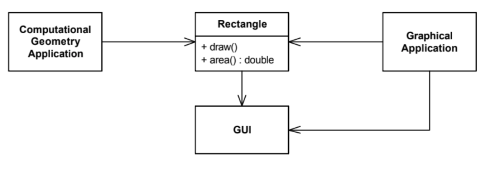
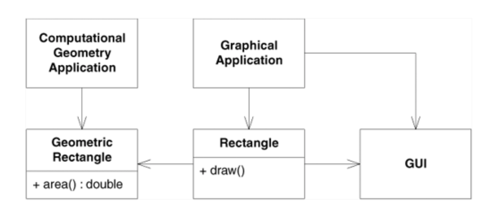

# Diseño de software SOLID #

## Razones para un buen diseño ##

Hemos aprendido en otras sesiones de la asignatura que una de las
características fundamentales del software es el cambio. Los clientes
no han sabido lo que quieren o no han sabido expresarlo. Nosotros
no hemos sabido entender sus necesidades, lo hemos ido aprendiendo
conforme hemos ido entregándoles versiones de la aplicación. Incluso
si la aplicación es perfecta y ha sido un éxito también cambiará,
porque todo el mundo querrá más cosas. El cambio es inevitable,
omnipresente, constante. El único momento en el que una aplicación no
cambia es cuando ha sido un fracaso y nadie la utiliza. 

### Dependencias ###

Si nuestra aplicación está mal diseñada será muy difícil de
modificar. La razón principal son las dependencias. Muchas de las
técnicas, patrones, etc. de diseño de software tiene por objeto
reducir las dependencias en nuestro diseño, minimizando el
acoplamiento en nuestra aplicación.

Cuando un objeto `Foo` necesita de otro objeto `Bar` para realizar su
trabajo, decimos que `Bar` es una dependencia de `Foo` o que `Foo`
depende de `Bar`. Por ejemplo, en el siguiente listado `Foo` depende
de `Logger`:

```java
import java.util.logging.Level;
import java.util.logging.Logger;

public class Foo {
    public void method() {
        Logger logger = new Logger();
        logger.log(Level.WARNING, "Log message");
    }
}
```

Las dependencias también crean problemas a la hora de testear el
código. Por ejemplo, en el caso anterior para testear el método de
`Foo` necesitaremos que `Logger` también esté funcionando. En este
caso no hay problema (`Logger` es una clase Java que se incluye en la
librería `java.util.logging.Logger` y siempre está disponible), pero
podría ser que la dependencia fuera con un servicio externo al que
hubiera que conectarse en un puerto específico y para una tarea
específica (un servidor de mail, por ejemplo). En este caso no sería
posible probar `Foo`.

Cuando tenemos elementos demasiado acoplados, los cambios nunca se
pueden hacer sólo en una parte del código. El cambio en un objeto
obliga a hacer un cambio en sus colaboradores, lo que a su vez obliga
a cambiar los suyos, y así sucesivamente. 

### Cohesión ###

Frente al acoplamiento, que es un síntoma de un mal diseño, se suele
decir que un término contrario es la cohesión, un síntoma de un buen
diseño.

Es difícil dar una definición exacta del término. Cuando un módulo
está fuertemente cohesionado, existen dependencias, pero siempre
interna al módulo. Todos sus elementos están conectados entre si de
una forma coherente. No hay nada relacionado con ese módulo que esté
fuera de él ni nada que esté dentro del módulo que no debiera
estar. 

Es similar a cuando hablamos de un razonamiento coherente. Es un
razonamiento que tiene todos los argumentos necesarios para
ser convincente y no tiene puntos débiles, ni elementos que desafinen.

> Cohesion is a measure of the strength of association of the elements
> inside a module.  A highly cohesive module is a collection of
> statements and data items that should be treated as a whole because
> they are so closely related. Any attempt to divide them up would
> only result in increased coupling and decreased readability.
> 
> Tom de Marco (1978) _Structured Analysis and System Specification_

Cuando tenemos que modificar un sistema con módulos fuertemente
cohesionados, los cambios se suelen producir en los elementos internos
de los módulos y no afectan a otros módulos. Al diseñar nuestras
clases deberíamos poner juntas características relacionadas, de forma
que cuando cambian lo hacen por la misma razón. Y deberíamos tratar de
separar características si van a cambiar por distintas razones.

### Síntomas de un mal diseño ###

En el artículo _Design Principles and Design Pattern_ de Robert
C. Martin se mencionan los siguientes síntomas del software mal
diseñado, en el que se ha acumulado deuda técnica y en el que es
problemático introducir cambios.

- **Rigidez**. Una aplicación es rígida cuando tiene demasiadas
  dependencias declaradas y es complicado introducir cambios sin tener
  que introducir otros adicionales en cascada. El compilador se queja
  y hay que reescribir mucho código después de un cambio para que
  compile correctamente.

- **Fragilidad**. Una aplicación es frágil cuando tiene demasiadas
  dependencias implícitas y los cambios introducidos no causan
  problemas en la compilación pero sí que producen bugs
  inesperados en ejecución. En muchas ocasiones es complicado rastrear
  el origen de los bugs y se acumulan cada vez más conforme se añaden
  nuevos cambios.
  
- **Inmovilidad**. Una aplicación es inmóvil cuando no se puede reusar
  su código fácilmente. Las clases no se han diseñado de forma
  suficientemente genérica y para cualquier nuevo cambio hay que
  añadir nuevas clases y nuevo código.

- **Viscosidad**. Es el término más complicado de entender. Martin no
  lo explica demasiado claramente. Supongo que tenía una intuición
  sobre un síntoma específico del mal diseño (distinto de los
  anteriores), pero no llegó a tener clara una definición concreta.
  
  Dice que siempre que se va a hacer un cambio en un diseño, es
  posible hacerlo utilizando buenas técnicas de diseño o haciendo alguna
  chapuza (_hack_). Un diseño tiene una viscosidad alta cuando los
  cambios correctos son más difíciles de aplicar que las
  chapuzas. Esto es una indicación de que el diseño original no era el
  correcto (era _viscoso_). El diseño viscoso promueve cambios
  chapuzas, mientras que un diseño correcto promueve cambios
  correctos.

Cuando el software se comporta de alguna de las maneras anteriores, el
equipo tiene cada vez menos confianza en introducir cambios y arreglar
cualquier cosa que no sea crítica. Se pierde también la capacidad de
realizar buenas estimaciones de tiempo de desarrollo de una
nueva funcionalidad, porque cada vez el desarrollo es más lento.

## SOLID ##

El acrónimo SOLID se refiere a 5 principios útiles para escribir
código orientado a objetos de forma que el resultado final sea un
programa fácilmente modificable. Los principios fueron introducidos
por Robert C. Martin alrededor del año 2000 en una serie de artículos
en los que explicaba cómo utilizar las características de la
Programación Orientada a Objetos para hacer código más fácil de
modificar. El artículo principal en el que enumeró estos principios
fue el ya mencionado _Design Principles and Design Patterns_.

Los principios son los siguientes:

- S: Single responsability
- O: Open-closed
- L: Liskov substitution
- I: Interface segregation
- D: Dependency inversion

Algunos de los principios son más generales y aplicables que otros,
que son más específicos y se aplican en menos ocasiones.

Vamos a enumerarlos y explicarlos a continuación.

### Single responsability ###

Un módulo o clase debe tener una única responsabilidad. Martin va más
allá y explica en qué consiste el concepto de responsabilidad
indicando que una clase debe tener cambiar por una única razón. Si
existen más de una posibilidad de cambio de una clase, ya no tiene una
única responsabilidad.

Martin utiliza los términos _responsabilidad_ y _razón de cambio_ como
sinónimos. Son términos bastante ambiguos, que dependen mucho del
nivel de abstracción que consideremos. Es más interesante relacionar
este principio con la idea de cohesión que comentamos al comienzo.

La palabra _única_ ha sido bastante criticada. ¿Y qué pasa si tenemos
dos o tres responsabilidades en una misma clase? ¿Está mal el diseño?
Como cualquier otro principio, hay que entenderlo de una forma
flexible. Si somos demasiados estrictos podemos terminar en el otro
extremo de la sobre-arquitectura.

Tal y como comenta Kevlin Henney en su charla [_Solid
Deconstruction_](), un ejemplo de diseño malo, que no sigue el
principio de responsabilidad única, es el típico _package_ o módulo de
_Util_, donde se incluye una miscelánea de clases variadas. Por
ejemplo, en Java.


Otro ejemplo menos extremo es el siguiente, que aparece en el libro de
Martin _Agile Principles, Patterns, and Practices in C#_.



En la imagen anterior se muestra una clase `Rectangle` que es usada
de dos maneras. Por un lado para realizar cálculos geométricos, en los
que es necesario calcular áreas, intersecciones, etc. Y por otro lado
para la parte gráfica, en la que se pintan figuras en pantalla y se
trabaja con la interfaz gráfica.

No es correcto incluir ambas responsabilidades en una misma clase. Es
mejor separarlas en dos clases tal y como muestra la siguiente figura.



Un ejemplo de buen uso de este principio es la filosofía de UNIX de
definir comandos que hacen una única cosa y que pueden ser fácilmente
combinados mediante tuberías.


### Open-closed ###

El principio _Open-closed_ lo estableció Bertran Meyer en su libro de
1988 _Object Oriented Software Construction_. Su descripción concreta
fue la siguiente:

- Se dice que un módulo está abierto si es posible extenderlo. Por
  ejemplo, debería ser posible añadir campos a las estructuras de datos
  que contiene o nuevos elementos al conjunto de funciones que realiza.

- Se dice que un módulo está cerrado si es posible usarlo desde otros
  módulos [de forma estable, sin que cambie en el futuro]. Esto supone
  que el módulo ha sido bien definido y tiene una interfaz estable [no
  va cambiar].

Meyer explica que estas dos condiciones son importantes para el
desarrollo estable y cambiable del software e indica que los lenguajes
de programación deberían establecer formas de implementarlas. También
explica que en los lenguajes orientados a objetos estas propiedades se
implementan usando la herencia:

> A class is closed, since it may be compiled, stored in a library,
> baselined, and used by client classes. But it is also open, since
> any new class may use it as parent, adding new features. When a
> descendant class is defined, there is no need to change the original
> or to disturb its clients.
>
> Bertrand Meyer (1988) _Object-oriented software construction_

La herencia permite cambiar el código de forma aditiva, sin eliminar
nada de lo anterior. Por ejemplo, el siguiente código define una clase
`Guitar`. Tiene todo lo que se necesita para hacer una banda, incluso
tiene un botón de volumen.

```java
public class Guitar {
 
    private String make;
    private String model;
    private int volume;
 
    //Constructors, getters & setters
}
```

La clase la ha implementado una empresa con la que estamos
colaborando. Nos bajamos la librería con la clase y la usamos en
nuestro código sin ningún problema. Sin embargo, algunas semanas
después nos damos cuenta de que necesitamos una guitarra más "rock and
roll" para una funcionalidad nueva que nos han pedido. Podemos aplicar
este principio y añadir la nueva funcionalidad extendiendo la clase
`Guitar`:

```java
public class SuperCoolGuitarWithFlames extends Guitar {
 
    private String flameColor;
 
    //constructor, getters + setters
}
```

Utilizando la herencia hemos podido "abrir" la clase y añadirle una
nueva funcionalidad sin tener que recompilarla ni modificarla. De esta
forma no ponemos en riesgo el código existente, que ya usa la clase,
porque la clase no se modifica.

La idea era muy interesante en los años 80. Hoy en día esta idea no es
tan revolucionaria. Todo el mundo se ha acostumbrado a usarla. Incluso
en la actualidad existe una tendencia contraria bastante crítica al uso de la
herencia por los posibles problemas que ésta puede causar en el código
ya existente. De hecho, hay lenguajes que proporcionan alternativas
para extender las clases ya existentes. Por ejemplo, en Swift tenemos
la posibilidad de usar
[`extension`](https://docs.swift.org/swift-book/LanguageGuide/Extensions.html)
y
[`protocols`](https://docs.swift.org/swift-book/LanguageGuide/Protocols.html)
para ampliar funcionalidades de clases ya existentes y para componer
mejor clases agregando distintos tipos de conducta sin usar la
herencia ni la herencia múltiple.

<table markdown="1">
<tr><td>

**Un ejemplo de mal uso de la herencia**

Clase padre:

```java
public class ListaSencilla {
    private List datos = new ArrayList();
 
    public ListaSencilla() {
        super();
    }
 
    public void insertar(String elemento) {
        datos.add(elemento);
    }
 
    public void insertarVarios(Collection elementos) {
        for (String elemento : elementos)
            this.insertar(elemento);
    }
```

Queremos añadir una auditoría, de forma que cada vez que se añada un
objeto a la lista se informe a un objeto auditor. Lo hacemos con
herencia:

```java
public class ListaAuditable extends ListaSencilla {
    private Auditor auditor;
 
    public ListaAuditable(Auditor auditor) {
        super();
        this.auditor = auditor;
    }
 
    @Override
    public void insertar(String elemento) {
        super.insertar(elemento);
        this.auditor.elementoInsertado(elemento);
    }
 
    @Override
    public void insertarVarios(Collection elementos) {
        super.insertarVarios(elementos);
        for (String elemento : elementos)
            this.auditor.elementoInsertado(elemento);
    }
}
```

El código tiene un bug: cuando se inserta una colección de elementos
se notifican dos veces. La implementación del método `insertarVarios`
en la superclase llama internamente a `insertar`, que como está
sobreescrito en la clase hija también notifica al auditor. Pero
`insertarVarios` de la clase hija también notifica al auditor por su
cuenta, y de ahí la doble notificación al auditor.

Lo arreglamos de la siguiente forma:

```java
public class ListaAuditable extends ListaSencilla {
    private Auditor auditor;
 
    public ListaAuditable(Auditor auditor) {
        super();
        this.auditor = auditor;
    }
 
    @Override
    public void insertar(String elemento) {
        super.insertar(elemento);
        this.auditor.elementoInsertado(elemento);
    }
}
```

Probamos el método `insertarVarios` y parece que todo funciona
bien. Salvo que estamos cometiendo un error grave. En la clase
derivada estamos dependiendo de la implementación del método
`insertarVarios` de la clase base. Si en algún momento alguien cambia
esa implementación (sin cambiar su contrato) nuestro método en la
clase hija dejará de funcionar.

Por ejemplo:

```java
public class ListaSencilla implements Lista {
    private List datos = new ArrayList();
 
    public ListaSencilla() {
        super();
    }
 
    @Override
    public void insertar(String elemento) {
        datos.add(elemento);
    }
 
    @Override
    public void insertarVarios(Collection elementos) {
        datos.addAll(elementos);
    }
 }
```

Ahora el método `insertarVarios` usa el método `addAll` para añadir
todos los elementos de la lista. El cambio parece bueno. Es sólo un
cambio de implementación y además se supone que será más
eficiente. Sin embargo, se han roto todas las clases hijas que habían
sobreescrito el método `insertar` y que se basaban en que
`insertarVarios` llamaba a `insertar`.

Ahora, para que vuelva a funcionar la clase hija tendremos que volver
a la implementación original (!):

```java
public class ListaAuditable extends ListaSencilla {
    private Auditor auditor;
 
    public ListaAuditable(Auditor auditor) {
        super();
        this.auditor = auditor;
    }
 
    @Override
    public void insertar(String elemento) {
        super.insertar(elemento);
        this.auditor.elementoInsertado(elemento);
    }
 
    @Override
    public void insertarVarios(Collection elementos) {
        super.insertarVarios(elementos);
        for (String elemento : elementos)
            this.auditor.elementoInsertado(elemento);
    }
}
```


Doble moraleja:

- Un método de la clase padre no debe basar su implementación en otro
  método que pueda ser sobreescrito por una clase hija. Si es así, hay
  que marcar el segundo método como `final` para evitar esa
  sobreescritura.
  
- Un método de una clase hija no debe basarse en detalles de
  implementación de la clase padre. La clase padre puede cambiar de
  implementación en cualquier momento.

</td></tr>
</table>


La idea de que una clase esté cerrada no es muy compatible
con la aceptación del cambio. De hecho, cuando hablemos de
_refactoring_ veremos que no hay problema en cambiar la implementación
de una clase si seguimos ciertas reglas. Por ejemplo, no hay problema
en cambiar el nombre de un método si tenemos acceso a todo el código
en el que se llama a ese método.

Podríamos combinar ambas ideas, la posibilidad de hacer
refactorización y la necesidad de que la clase está cerrada, si
reformulamos el principio diciendo que lo que debe ser cerrado es la
interfaz publicada de un módulo. Hablamos de interfaz "publicada" no
de interfaz "pública". Si una interfaz es pública pero no está
publicada, está en casa, y podremos cambiar todo el código que la
usa. En el momento que la hacemos pública es cuando perdemos la
posibilidad de refactorizarla.


### Liskov substitution ###

A continuación vemos un ejemplo de mal uso de la herencia, que
incumple el principio de substitución de Liskov. Por desgracia este
tipo de mal uso es bastante frecuente. De hecho, la imagen está sacada
de la web de [documentación de
Microsoft](https://msdn.microsoft.com/es-es/msdn/en-us/library/ms173147)
en la página en la que se explica como comparar objetos en C#.


### Interface segregation ###


### Dependency inversion ###


## Referencias ##

- Robert C. Martin (2000) [_Design Principles and Design Patterns_](https://moodle2020-21.ua.es/moodle/pluginfile.php/144882/mod_resource/content/3/Robert%20C.%20Martin%20-%20Design%20Principles%20and%20Design%20Patterns.pdf)
- Robert C. Martin (2006) [_Agile Principles, Patterns, and Practices in C#_](https://learning.oreilly.com/library/view/agile-principles-patterns/0131857258/)
- Kevlin Henney (Charla, 2016) [_Solid Deconstruction_](https://vimeo.com/157708450)
