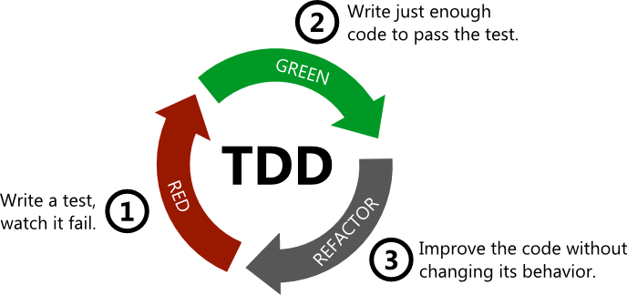
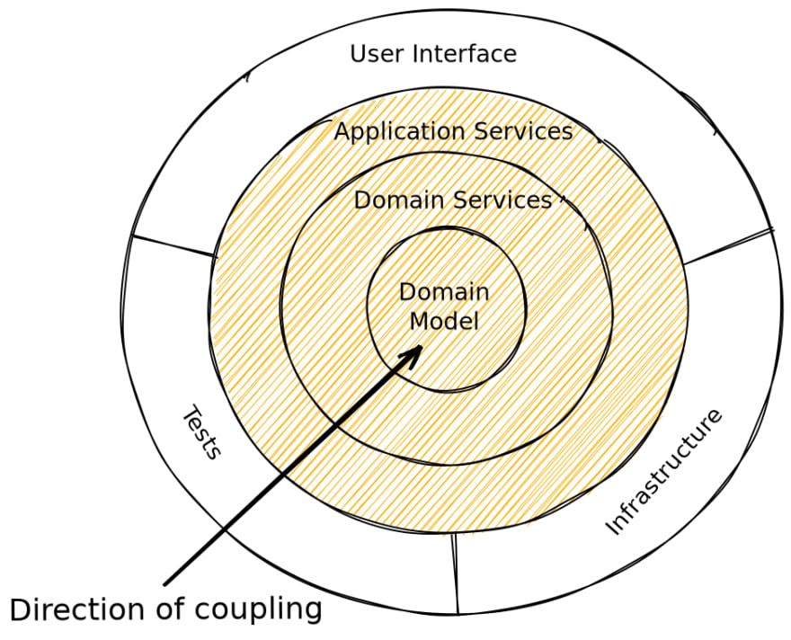

# TDD #

## Introducción al Test Driven Development ##

Se denomina habitualmente a esta práctica Test Driven Design (TDD). Es
una de las prácticas más importantes de XP. Hablaremos más adelante
con mayor profundidad de esta técnica y haremos alguna
demostración. Veremos también un ejemplo en las prácticas.

La técnica se basa en escribir el código de forma iterativa, paso a
paso, y siempre comenzando por los tests. 

Supongamos que tenemos que implementar una determinada
funcionalidad. La analizamos y pensamos en cómo implementarla,
dividiéndola en pequeños elementos necesarios para poder
completarla. Escribimos estos elementos en una lista y empezamos a
codificarlos utilizando el siguiente ciclo:



1. Pensamos. Analizamos qué pequeño paso nos puede servir para avanzar
   en la funcionalidad que estamos desarrollando. Anotamos las ideas
   que se nos ocurran como pequeños pasos que hay que implementar. Se
   escoge el paso más básico, el inicial que sirve de base para todo
   lo demás.
2. Se escribe un único en el que se especifica lo que debe
   realizar el código para implementar el pequeño incremento de
   funcionalidad. Qué se le pasa cómo parámetro y qué debe devolver,
   un ejemplo de lo que el código debe hacer en forma de test. Se
   añade el test a los ya existentes y se lanzan todos. El test que
   acabamos de añadir falla (rojo).
3. Se escribe únicamente el código necesario que hace que el test
   pase (verde).
4. Ahora que tenemos una base de tests que funciona perfectamente, se
   analiza el código y los tests, se detectan problemas de diseño y se
   realiza una refactorización (profundizaremos más adelante
   en esto). Se vuelven a lanzar los tests para asegurarnos
   que la refactorización no ha roto nada.

Se repite el ciclo, cada vez añadiendo nuevos tests que vayan
acercando el código a la nueva funcionalidad. En el proceso de añadir
pequeños tests y ampliar el código, nos iremos dando cuenta de cosas
que hay que implementar y que no habíamos tenido en cuenta. Las
anotamos en la lista de tareas a hacer y en algún momento tocará
resolverlas con el ciclo de TDD.

Los tests y el código que generan deben ser muy pequeños y
concretos. Sólo se generalizará cuando se detecte que sea
necesario. Se hará en la fase de refactorización. 

Es importante que los tests vayan haciendo crecer la funcionalidad en
pequeños incrementos. Al ser los cambios pequeños hay menos
posibilidades de estropear cosas.



En TDD se utiliza un enfoque _bottom-up_: primero se programan los
elementos y funcionalidades básicas y después se van programando
funcionalidades de mayor nivel que se basan en las anteriores. Muchas
veces se utiliza la [metáfora de la
cebolla](https://dev.to/barrymcauley/onion-architecture-3fgl). Las
capas de la cebolla represen las capas de nuestro proyecto
software. En TDD construiremos la cebolla de dentro a afuera: primero
las capas más internas y después las superiores, basándonos en las ya
construidas anteriormente.

En TDD no nos preocupamos demasiado de que los tests sean unitarios ni
de usar mocks para aislar funcionalidades. Como la batería de tests se
construye de forma incremental, cuando hacemos los tests de más alto
nivel no hace falta aislar los elementos de bajo nivel porque ya hemos
comprobado que funcionan correctamente.

En ocasiones sí que se usarán mocks por motivos de eficiencia y para
que los tests pasen más rápido. Sobre todo en los casos de tests de
integración en los que hay que conectar con servicios externos.

Utilizando esta técnica las pruebas no sólo sirven para comprobar que
el software funciona correctamente, sino que sirven para especificarlo
y diseñarlo.

La utilización de TDD tiene muchas ventajas:

- En todo momento tenemos una especificación clara de lo que nuestro
  código tiene que hacer.
- Cohesión y acoplamiento - si es difícil escribir el test, 
es una
señal de que tenemos un problema de 
diseño. El código débilmente
acoplado y altamente 
cohesionado es más fácil de probar.
- Confianza: escribiendo código limpio que funciona y 
demostrando tus
intenciones con las pruebas construye una relación de confianza con
tus compañeros.
- Ritmo: es muy fácil perderse durante horas cuando se está
programando. Con el enfoque de test-first, está claro lo que hay que
hacer a continuación: o escribimos una prueba o hacemos que funcione
una prueba
 rota (broken test). El ciclo que se genera se convierte
pronto en algo natural y eficiente: test, code, refactor, test, code,
refactor.


## Ejemplo práctico: cambio de monedas ##

Vamos a presentar un ejemplo tomado del libro de Kent Beck
"Test-Driven Development By Example".

Tenemos un sistema de gestión de fondos de inversión y acciones que
produce informes como este:

| Acciones | Cantidad | Precio     | Total   |
|----------|----------|------------|---------|
| IBM      |  1000    |  25        |  25.000 |
| Apple    |   400    |  100       |  40.000 |
|          |          |  **Total** |  65.000 |


Queremos ampliar el sistema para que pueda tener en cuenta distintas
monedas:

| Acciones | Cantidad | Precio     | Total       |
|----------|----------|------------|-------------|
| IBM      |  1000    |  25 USD    |  25.000 USD |
| Acerinox |   400    |  150 EUR   |  60.000 EUR |
|          |          |  **Total** |  65.000 USD |

Necesitamos definir los cambios:

|  De |   A   | Cambio |
|-----|-------|--------|
| EUR | USD   |  1,5   |

Queremos diseñar un conjunto de clases que permitan gestionar
una cartera de valores con múltiples monedas usando TDD.

Cada ciclo de TDD consta de 3 pasos:

- Test sencillo con el que añadimos una nueva comprobación.
- Código que hace pasar el test.
- Refactorización para eliminar duplicación.

A este ciclo de 3 pasos es importante añadir un paso fundamental, que
hay que hacer continuamente: pensar. Tenemos que pensar en los
objetivos que queremos cumplir, en los problemas del diseño actual y
en cómo solucionarlos. 

Como resultado de esta reflexión continua mantendremos una lista de
cosas por hacer, que nos ayudará a mantenernos concentrados, y decidir
qué hacer cuando hayamos terminado cada uno de los tests. 

Pondremos en negrita lo siguiente a hacer y tacharemos lo que hayamos
terminado. Cuando pensemos en que necesitamos escribir otro test, lo
añadiremos a la lista.

### Pensamos ###

Del ejemplo en la tabla vemos que inicialmente hay dos cosas
importantes que tenemos que hacer:

1. Multiplicar precio por cantidad en una determinada moneda.
2. Sumar monedas distintas.

Escribimos estos dos objetivos en forma de tests, en la lista de cosas
a hacer.

| Cosas por hacer  |
|------------------|
| 5 USD + 10 EUR = 10 USD si el cambio es 2:1 |
| **5 USD * 2 = 10 USD** |

De los dos objetivos, comenzamos por el segundo, que parece más básico
que el primero. Recordemos que en TDD programamos el sistema de dentro
a afuera o, lo que es lo mismo, de abajo a arriba. Primero las capas
más básicas y después las capas superiores, que estarán basadas en la
implementación ya testeada de las primeras.

En primer lugar, para poder multiplicar una moneda, debemos poder
crearla. Añadimos una tarea más a la lista.

| Cosas por hacer  |
|------------------|
| 5 USD + 10 EUR = 10 USD si el cambio es 2:1 |
| **5 USD * 2 = 10 USD** |
| **Crear una moneda con 5 dólares** |


### Test creación de 5 dólares ###

Vamos a especificar el test para el objetivo de crear una moneda de 5
dólares. 

```java
import org.junit.Test;
import static org.junit.Assert.assertEquals;

public class TestMonedas {
    @Test
    public void testCrearMoneda() {
        Dolar cinco = new Dolar(5);
        assertEquals(5, cinco.cantidad);
    }
}
```

Fijaros que en el test ya hemos realizado decisiones de diseño. Hemos
definido una clase `Dolar` con un atributo `cantidad`. El hecho de
comenzar escribiendo un test obliga a concretar el objetivo inicial
(algo difuso) en decisiones concretas en el lenguaje y modelo de
programación con el que vamos a trabajar. En nuestro caso, el lenguaje
Java y su paradigma orientado a objetos nos lleva al diseño anterior.

Vamos a exagerar un poco la metodología TDD. TDD nos dice que debemos
escribir el código mínimo para que el test pase. En este caso, el
mínimo código sería el siguiente:


```java
public class Dolar {
    int cantidad = 5;

    public Dolar(int cantidad) {
    }
}
```

El test pasa (verde). Pero tenemos un código fuertemente acoplado al
test. Cualquier cambio mínimo en el test hace que el test se
rompa. En este caso es muy evidente porque estamos exagerando. Pero
vamos a usar el ejemplo para mostrar la tercera parte de TDD: debemos buscar
duplicidades y refactorizar para eliminarlas. La
duplicación es un indicador de dependencia. 

> "If dependency is the problem, duplication is the
> symptom. Duplication most often takes the form of duplicate
> logic—the same expression appearing in multiple places in the code.
> 
> Kent Beck

En este caso hemos acoplado el valor 5 del código directamente al
valor introducido en el test.

### Refactorización código creación dólares ###

Vamos entonces a refactorizar para eliminar la duplicidad del valor
`5` entre el test y el código. Empezamos moviendo la asignación de la
cantidad dentro del constructor (pequeños pasos):

```java
public class Dolar {
    int cantidad;

    public Dolar(int cantidad) {
        this.cantidad = 5;
    }
}
```

Lanzamos los tests y sigue en verde. Pero seguimos con la duplicidad
del 5 en el test y en el código. Lo arreglamos asignando el parámetro
`cantidad` del constructor al atributo. De esta forma eliminamos la
duplicidad y generalizamos. Realmente, lo que queremos que se guarde
en la `cantidad` no es `5`, sino el valor que le pasemos como
`cantidad` en el test (sea el que sea).


```java
public class Dolar {
    int cantidad;

    public Dolar(int cantidad) {
        this.cantidad = cantidad;
    }
}
```

### Pensamos ###

Con esto hemos cumplido el objetivo y lo tachamos de la lista:

| Cosas por hacer  |
|------------------|
| 5 USD + 10 EUR = 10 USD si el cambio es 2:1 |
| **5 USD * 2 = 10 USD** |
| ~~Crear una moneda con 5 dólares~~ |

Ahora podemos ya podemos centrarnos en el test de la
multiplicación. 

### Test multiplicación en dólares ###

Añadimos el test de multiplicación a la clase de test. En principio
vamos a usar un diseño típicamente orientado a objetos, en el que las
operaciones mutan el estado del objeto. En este caso, la operación
`multuplicadoPor(int)` modifica la cantidad almacenada en la instancia:


```java
    @Test
    public void testMultiplicacion() {
        Dolar cinco = new Dolar(5);
        cinco.multiplicadoPor(2);
        assertEquals(10, cinco.cantidad);
    }
```

Creamos la cantidad de 5 dólares y llamamos al método
`multiplicadoPor` para que se multiplique por 2. El valor resultante
deberá estar guardado en el atributo `cantidad` y deberá ser 10.

El código mínimo que soluciona el test es el siguiente:


```java
public class Dolar {
    int cantidad;

    public Dolar(int cantidad) {
        this.cantidad = cantidad;
    }

    public void multiplicadoPor(int multiplicador) {
        cantidad *= multiplicador;
    }
}
```

Con eso ya hemos pasado el test de la multiplicación.

| Cosas por hacer  |
|------------------|
| 5 USD + 10 EUR = 10 USD si el cambio es 2:1 |
| ~~5 USD * 2 = 10 USD~~ |
| ~~Crear una moneda con 5 dólares~~ |


### Pensamos ###

Analizando el diseño del código y de los tests, nos damos cuenta de
que hay varias cosas que se podrían mejorar:

- Hacer `cantidad` privado.
- Podría haber efectos laterales en `Dolar` por utilizar programación
  orientada a objetos tradicional. ¿Usamos un objeto valor?
- Estamos limitando los valores y las cantidades a multiplicar a enteros.

Las anotamos en la lista:

| Cosas por hacer  |
|------------------|
| 5 USD + 10 EUR = 10 USD si el cambio es 2:1 |
| ~~5 USD * 2 = 10 USD~~ |
| ~~Crear una moneda con 5 dólares~~ |
| Hacer "cantidad" privado |
| Efectos laterales en Dolar? |
| Usar punto flotante - redondeo? |


Decidimos empezar con los efectos laterales. Un objeto llamado `cinco` no
debería tener un valor de `10`.

| Cosas por hacer  |
|------------------|
| 5 USD + 10 EUR = 10 USD si el cambio es 2:1 |
| ~~5 USD * 2 = 10 USD~~ |
| ~~Crear una moneda con 5 dólares~~ |
| Hacer "cantidad" privado |
| **Efectos laterales en Dolar?** |
| Usar punto flotante - redondeo? |

### Refactorización de test con patrón value object ###

Vamos a usar el patrón [value
object](https://martinfowler.com/bliki/ValueObject.html) para mejorar
el diseño. Modificamos el test para usar este patrón (también hay que
refactorizar los tests):

```java
    @Test
    public void testMultiplicacion() {
        Dolar cinco = new Dolar(5);
        Dolar resultado = cinco.multiplicadoPor(2);
        assertEquals(10, resultado.cantidad);
        resultado = cinco.multiplicadoPor(3);
        assertEquals(15, resultado.cantidad);
    }
```

Y modificados el código para que el test pase:

```diff
public class Dolar {

-    public void multiplicadoPor(int multiplicador) {
+    public Dolar multiplicadoPor(int multiplicador) {
-        cantidad *= multiplicador;
+        return new Dolar(cantidad * multiplicador);
    }
}
```

Una cosa menos por hacer:

| Cosas por hacer  |
|------------------|
| 5 USD + 10 EUR = 10 USD si el cambio es 2:1 |
| ~~5 USD * 2 = 10 USD~~ |
| ~~Crear una moneda con 5 dólares~~ |
| Hacer "cantidad" privado |
| ~~Efectos laterales en Dolar?~~ |
| Usar punto flotante - redondeo? |


### Pensamos ###

En el patrón Value Object es necesario poder comparar objetos según su
valor. Debemos implementar `equals` y `hashCode`.

Empezamos por `equals`.

| Cosas por hacer  |
|------------------|
| 5 USD + 10 EUR = 10 USD si el cambio es 2:1 |
| ~~5 USD * 2 = 10 USD~~ |
| ~~Crear una moneda con 5 dólares~~ |
| Hacer "cantidad" privado |
| ~~Efectos laterales en Dolar?~~ |
| Usar punto flotante - redondeo? |
| **equals()** | 
| hashCode() |


### Test equals ###

El test para implementar `equals` es muy sencillo:


```java
    @Test
    public void testIgualdad() {
        assertTrue(new Dolar(5).equals(new Dolar(5)));
    }
```

Siguiendo la filosofía de TDD (¡exagerándola!), el mínimo código que
hace que pase es haciendo que el método devuelva `true`:

```java
    public boolean equals(Object object) {
        return true;
    }
```

El test pasa, pero tenemos la sensación de que no es la solución
correcta. De hecho, está pasando lo mismo que al principio, hay
duplicación de código (el `true` que devuelve el método está
duplicando el `assertTrue` del test). 

Para comprobar si todo está bien introducimos una segunda aserción en
el test, que obliga a generalizar el código. Kent Beck llama
"triangular" a esta técnica de introducir nuevas aserciones para
obligar a generalizar el código.


El nombre de "triangulación" viene de la técnica para localizar
una posición en un mapa a partir de la distancia a balizas
conocidas. Para localizar unívocamente una posición es necesario
obtener la distancia a tres balizas.

Es una técnica que se utiliza continuamente en nuestros teléfonos
móviles para obtener su localización usando satélites como balizas
(GPS) o antenas de Wifi (localización por Wifi).

En el caso del TDD, muchas veces no es suficiente con una única
aserción para definir un test. Necesitamos más aserciones para obligar
a eliminar la dependencia entre el test y el código.


### Triangulamos el test equals ###

Triangulamos, añadiendo otro ejemplo al test:

```java
    @Test
    public void testIgualdad() {
        assertTrue(new Dolar(5).equals(new Dolar(5)));
        assertFalse(new Dolar(5).equals(new Dolar(6)));
    }
```

El código falla y tenemos que generalizarlo:

```java
    public boolean equals(Object object) {
        Dolar dolar = (Dolar) object;
        return cantidad == dolar.cantidad;
    }
```

El test ya pasa. Perfecto, seguimos avanzando.

### Pensamos ###

¿Qué pasa si comparamos con `null` o con otro objeto? Lo añadimos a la
lista de cosas por hacer y lo dejamos para después.

| Cosas por hacer  |
|------------------|
| 5 USD + 10 EUR = 10 USD si el cambio es 2:1 |
| ~~5 USD * 2 = 10 USD~~ |
| ~~Crear una moneda con 5 dólares~~ |
| Hacer "cantidad" privado |
| ~~Efectos laterales en Dolar?~~ |
| Usar punto flotante - redondeo? |
| ~~equals()~~ | 
| hashCode() |
| Equal null |
| Equal object |


Miramos el código y nos damos cuenta de que ahora que tenemos
implementada la igualdad, podemos refactorizar el test de la
multiplicación para usar esta implementación. No tenemos que acceder a
`cantidad`. De esta forma podremos hacer el atributo privado.

### Refactorización tests para usar equals ###

Tenemos que refactorizar los tests en los que se usa la cantidad para
comparar y pasar a comparar usando el nuevo método equals:


```java

    @Test
    public void testCrearMoneda() {
        assertEquals(new Dolar(5), new Dolar(5));
    }


    @Test
    public void testMultiplicacion() {
        Dolar cinco = new Dolar(5);
        assertEquals(new Dolar(10), cinco.multiplicadoPor(2));
        assertEquals(new Dolar(15), cinco.multiplicadoPor(3));
    }
```

Probamos que los tests siguen funcionando.

### Refactorización código ###

Y ahora ya podemos hacer privado el atributo `cantidad`, porque no lo
necesitamos en ninguno de los tests.

Código:

```diff
-    int cantidad;
+    private int cantidad;
```

Una cosa menos en la lista:

| Cosas por hacer  |
|------------------|
| 5 USD + 10 EUR = 10 USD si el cambio es 2:1 |
| ~~5 USD * 2 = 10 USD~~ |
| ~~Crear una moneda con 5 dólares~~ |
| ~~Hacer "cantidad" privado~~ |
| ~~Efectos laterales en Dolar?~~ |
| Usar punto flotante - redondeo? |
| ~~equals()~~ | 
| hashCode() |
| Equal null |
| Equal object |


### Pensamos ###

El primer ítem de la lista está todavía muy lejos. No es posible
implementarlo con un pequeño cambio. Necesitamos como prerrequisto
tener un objeto `Euro`, similar al `Dolar`. Añadimos otro ítem que nos
obliga a crear la clase `Euro`.

| Cosas por hacer  |
|------------------|
| 5 USD + 10 EUR = 10 USD si el cambio es 2:1 |
| ~~5 USD * 2 = 10 USD~~ |
| ~~Crear una moneda con 5 dólares~~ |
| ~~Hacer "cantidad" privado~~ |
| ~~Efectos laterales en Dolar?~~ |
| Usar punto flotante - redondeo? |
| ~~equals()~~ | 
| hashCode() |
| Equal null |
| Equal object |
| ** 5 EUR * 2 = 10 EUR** |

### Test multiplicación en euros ###

Copiamos y modificamos el test de la multiplicación en Dolares.

Test:

```java
    @Test
    public void testMultiplicacionEuro() {
        Euro cinco = new Euro(5);
        assertEquals(new Euro(10), cinco.multiplicadoPor(2));
        assertEquals(new Euro(15), cinco.multiplicadoPor(3));
    }
    ```

Para pasar el test copiamos y modificamos el código de `Dolar`.

El código es el siguiente:

```java
public class Euro {
    private int cantidad;

    public Euro(int cantidad) {
        this.cantidad = cantidad;
    }

    public Euro multiplicadoPor(int multiplicador) {
        return new Euro(cantidad * multiplicador);
    }

    public boolean equals(Object object) {
        Euro dolar = (Euro) object;
        return cantidad == dolar.cantidad;
    }
}
```

Hemos dado una solución rápida y pequeña. 

| Cosas por hacer  |
|------------------|
| 5 USD + 10 EUR = 10 USD si el cambio es 2:1 |
| ~~5 USD * 2 = 10 USD~~ |
| ~~Crear una moneda con 5 dólares~~ |
| ~~Hacer "cantidad" privado~~ |
| ~~Efectos laterales en Dolar?~~ |
| Usar punto flotante - redondeo? |
| ~~equals()~~ | 
| hashCode() |
| Equal null |
| Equal object |
| ~~5 EUR * 2 = 10 EUR~~ |


### Pensamos ###

Vemos que hay mucho código duplicado. El objetivo final es eliminar
la duplicación entre `Dolar` y `Euro`, creando una clase común que
contenga el código repetido (`equals` y `multiplicadoPor`).

Vamos a comenzar creando una clase común que elimine la duplicación de `equals`.

| Cosas por hacer  |
|------------------|
| 5 USD + 10 EUR = 10 USD si el cambio es 2:1 |
| ~~5 USD * 2 = 10 USD~~ |
| ~~Crear una moneda con 5 dólares~~ |
| ~~Hacer "cantidad" privado~~ |
| ~~Efectos laterales en Dolar?~~ |
| Usar punto flotante - redondeo? |
| ~~equals()~~ | 
| hashCode() |
| Equal null |
| Equal object |
| ~~5 EUR * 2 = 10 EUR~~ |
| **Duplicación Dolar Euro** |
| **equals duplicado** |
| multiplicadoPor duplicado |


### Refactorización eliminar duplicación equals ###

Vamos a refactorizar el código para crear una clase común que contenga
el código duplicado. Comenzaremos por `equals`.

Vamos a ir haciendo poco a poco pequeños cambios en el código,
comprobando en cada momento que pasan los tests.

Creamos la clase `Moneda` y hacemos que `Dolar` la extienda:

```diff
+ public class Moneda {
+ }

- public class Dolar {
+ public class Dolar extends Moneda {
```

Los tests siguen pasando.

Movemos la variable de instancia `cantidad` a la clase superior:

```diff
public class Moneda {
+    protected int cantidad;
}

public class Dolar extends Moneda {
-    private int cantidad;
```

Los tests siguen pasando.

Cambiamos el método `equals`, generalizándolo para que trabaje con monedas:

```java
    public boolean equals(Object object) {
        Moneda moneda = (Moneda) object;
        return cantidad == moneda.cantidad;
    }
```

Los tests siguen pasando.

Por último, movemos `equals` a `Moneda`:

```java
public class Moneda {
    protected int cantidad;

    public boolean equals(Object object) {
        Moneda moneda = (Moneda) object;
        return cantidad == moneda.cantidad;
    }
}

public class Dolar extends Moneda {

    public Dolar(int cantidad) {
        this.cantidad = cantidad;
    }

    public Dolar multiplicadoPor(int multiplicador) {
        return new Dolar(cantidad * multiplicador);
    }
}
```

Y los tests siguen pasando.

Tenemos que hacer ahora lo mismo con `Euro`, pero nos faltan
tests que hagan de red de seguridad de la refactorización. Añadimos
tests en el test de igualdad de `Dolar`:

```java
    @Test
    public void testIgualdad() {
        assertTrue(new Dolar(5).equals(new Dolar(5)));
        assertFalse(new Dolar(5).equals(new Dolar(6)));
        assertTrue(new Euro(5).equals(new Euro(5)));
        assertFalse(new Euro(5).equals(new Euro(6)));
    }
```

Y con los tests ya definidos podemos proceder a la refactorización,
haciendo lo mismo que con `Dolar`.

Primero eliminamos hacemos que `Euro` herede de `Moneda` y eliminamos  `cantidad`:

```diff
- public class Euro {
+ public class Euro extends Moneda {
-    private int cantidad;
```

Ahora tenemos que hacer que `equals` en `Euro` sea exactamente igual
que `equals` en `Moneda` para poder eliminarlo sin miedo a que estemos
cambiando su comportamiento:


```java
public class Euro extends Moneda {
    ...
    public boolean equals(Object object) {
        Moneda moneda = (Moneda) object;
        return cantidad == moneda.cantidad;
    }
}
```

Por último, ya podemos eliminar el método de `Euro` (es igual que el
de la superclase) y comprobar que los tests siguen pasando:

```diff
public class Euro extends Moneda {
    ...
-    public boolean equals(Object object) {
-        Moneda moneda = (Moneda) object;
-        return cantidad == moneda.cantidad;
-    }
}
```


| Cosas por hacer  |
|------------------|
| 5 USD + 10 EUR = 10 USD si el cambio es 2:1 |
| ~~5 USD * 2 = 10 USD~~ |
| ~~Crear una moneda con 5 dólares~~ |
| ~~Hacer "cantidad" privado~~ |
| ~~Efectos laterales en Dolar?~~ |
| Usar punto flotante - redondeo? |
| ~~equals()~~ | 
| hashCode() |
| Equal null |
| Equal object |
| ~~5 EUR * 2 = 10 EUR~~ |
| **Duplicación Dolar Euro** |
| ~~equals duplicado~~ |
| multiplicadoPor duplicado |


### Pensamos ###

Ya que estamos con `equals` tenemos que asegurarnos que la comparación
entre euros y dólares es `false`:

| Cosas por hacer  |
|------------------|
| 5 USD + 10 EUR = 10 USD si el cambio es 2:1 |
| ~~5 USD * 2 = 10 USD~~ |
| ~~Crear una moneda con 5 dólares~~ |
| ~~Hacer "cantidad" privado~~ |
| ~~Efectos laterales en Dolar?~~ |
| Usar punto flotante - redondeo? |
| ~~equals()~~ | 
| hashCode() |
| Equal null |
| Equal object |
| ~~5 EUR * 2 = 10 EUR~~ |
| **Duplicación Dolar Euro** |
| ~~equals duplicado~~ |
| multiplicadoPor duplicado |
| **Comparar euros con dólares** |


### Test comparación euros con dólares ###

Añadimos una nueva línea al test de igualdad:

```diff
    @Test
    public void testIgualdad() {
        assertTrue(new Dolar(5).equals(new Dolar(5)));
        assertFalse(new Dolar(5).equals(new Dolar(6)));
        assertTrue(new Euro(5).equals(new Euro(5)));
        assertFalse(new Euro(5).equals(new Euro(6)));
+       assertFalse(new Euro(5).equals(new Dolar(5)));
    }
```

El test falla. Modificamos el código para que pase el test:

```diff
    public boolean equals(Object object) {
        Moneda moneda = (Moneda) object;
        return cantidad == moneda.cantidad 
+               && this.getClass().equals(moneda.getClass());
    }
}
```

| Cosas por hacer  |
|------------------|
| 5 USD + 10 EUR = 10 USD si el cambio es 2:1 |
| ~~5 USD * 2 = 10 USD~~ |
| ~~Crear una moneda con 5 dólares~~ |
| ~~Hacer "cantidad" privado~~ |
| ~~Efectos laterales en Dolar?~~ |
| Usar punto flotante - redondeo? |
| ~~equals()~~ | 
| hashCode() |
| Equal null |
| Equal object |
| ~~5 EUR * 2 = 10 EUR~~ |
| **Duplicación Dolar Euro** |
| ~~equals duplicado~~ |
| multiplicadoPor duplicado |
| ~~Comparar euros con dólares~~|


### Pensamos ###

La solución anterior es un poco sucia, porque utilizamos las clases de
Java y no un concepto del dominio, por ejemplo guardar de alguna forma
la denominación de la moneda. Añadimos un elemento más a la lista de
cosas por hacer y seguimos eliminando la duplicación de `Dolar` y
`Euro`. 

Para ello nos fijamos como objetivo eliminar la duplicación del método
`multiplicadoPor`. 

| Cosas por hacer  |
|------------------|
| 5 USD + 10 EUR = 10 USD si el cambio es 2:1 |
| ~~5 USD * 2 = 10 USD~~ |
| ~~Crear una moneda con 5 dólares~~ |
| ~~Hacer "cantidad" privado~~ |
| ~~Efectos laterales en Dolar?~~ |
| Usar punto flotante - redondeo? |
| ~~equals()~~ | 
| hashCode() |
| Equal null |
| Equal object |
| ~~5 EUR * 2 = 10 EUR~~ |
| **Duplicación Dolar Euro** |
| ~~equals duplicado~~ |
| **multiplicadoPor duplicado** |
| ~~Comparar euros con dólares~~|
| Denominación moneda? |

Como este cambio no se puede hacer con un pequeño paso, aplicamos
otros patrones que nos acerquen a ese objetivo. Vamos a hacer algunas
refactorizaciones basadas en el principio de inversión de
dependencias de SOLID. Este principio nos dice que deberíamos depender
de abstracciones, en lugar de implementaciones concretas.

Para ello vamos a eliminar en la medida de lo posible el uso de clases
concretas `Dolar` y `Euro` y usar la clase más abstracta
`Moneda`. Convertiremos la clase `Moneda` en una factoría con métodos
que devuelvan euros y dólares.

### Refactorización para usar monedas en lugar de clases concretas ###

Empezamos por el código de `multiplicaPor` de ambas clases, haciendo
que devuelvan una `Moneda`:


```java
public class Dolar extends Moneda {
   ...
    public Moneda multiplicadoPor(int multiplicador) {
        return new Dolar(cantidad * multiplicador);
    }
}

public class Euro extends Moneda {
    ...
    public Moneda multiplicadoPor(int multiplicador) {
        return new Euro(cantidad * multiplicador);
    }
}
```

Los tests siguen pasando.

Vamos ahora a intentar eliminar del código el uso de las clases
`Dolar` y `Euro`, de forma que no tengamos que hacer explícitamente un
`new` de esas clases. Así ganamos en abstracción.

Para ello vamos a convertir `Moneda` en una factoría, con un método
`dolar` que devuelva un dolar. Empezamos refactorizando el test de
multiplicación para que use la factoría. 


```java
    @Test
    public void testMultiplicacion() {
        Dolar cinco = Moneda.dolar(5);
        assertEquals(Moneda.dolar(10), cinco.multiplicadoPor(2));
        assertEquals(Moneda.dolar(15), cinco.multiplicadoPor(3));
    }
```

Al eliminar las llamadas a los constructores, hemos desacoplado los
tests de la relación de herencia entre `Dolar` y `Moneda`.

Escribimos el código para que el test pase correctamente:

```java
public class Moneda {
    ...
    
    static Dolar dolar(int cantidad) {
        return new Dolar(cantidad);
    }
    
    ...
}
```

Pasan los tests. Pero queremos eliminar el uso de la clase `Dolar`,
por lo que modificamos declarando el objeto `cinco` de tipo `Moneda`:

```java
    @Test
    public void testMultiplicacion() {
        Moneda cinco = Moneda.dolar(5);
        assertEquals(Moneda.dolar(10), cinco.multiplicadoPor(2));
        assertEquals(Moneda.dolar(15), cinco.multiplicadoPor(3));
    }
```

El método `multiplicador` no está definido en `Moneda`. Lo arreglamos
haciendo la clase `Moneda` abstracta y declarando ahí el
método. También podemos cambiar lo devuelto por el método estático
`Moneda.dolar()`.

El código queda así:

```java
abstract public class Moneda {
    protected int cantidad;

    static Moneda dolar(int cantidad) {
        return new Dolar(cantidad);
    }

    abstract Moneda multiplicadoPor(int multiplicador);

    ...
}
```

Los tests pasan, por lo que no hemos roto nada.

Refactorizamos ahora el test `testMultiplicacionEuro` para que trabaje
con la factoría, ahora con un método que devuelve euros:

```java
    @Test
    public void testMultiplicacionEuro() {
        Moneda cinco = Moneda.euro(5);
        assertEquals(Moneda.euro(10), cinco.multiplicadoPor(2));
        assertEquals(Moneda.euro(15), cinco.multiplicadoPor(3));
    }
```

Y añadimos el método estático en el código de `Moneda` para devolver euros:

```java
abstract public class Moneda {
    ...
    static Moneda euro(int cantidad) {
        return new Euro(cantidad);
    }
    ...
```

Y, por último, refactorizamos el resto de tests para que usen también la factoría:

```java

    @Test
    public void testCrearMoneda() {
        assertEquals(Moneda.dolar(5), Moneda.dolar(5));
    }

    @Test
    public void testIgualdad() {
        assertTrue(Moneda.dolar(5).equals(Moneda.dolar(5)));
        assertFalse(Moneda.dolar(5).equals(Moneda.dolar(6)));
        assertTrue(Moneda.euro(5).equals(Moneda.euro(5)));
        assertFalse(Moneda.euro(5).equals(Moneda.euro(6)));
        assertFalse(Moneda.euro(5).equals(Moneda.dolar(5)));
    }
```


### Pensamos ###

Seguimos intentando eliminar la duplicación de los dos
multiplicadores. Pero por ahora no es posible hacerlo con un paso
sencillo. Nos decidimos entonces atacar el objetivo de la denominación
de la moneda.


| Cosas por hacer  |
|------------------|
| 5 USD + 10 EUR = 10 USD si el cambio es 2:1 |
| ~~5 USD * 2 = 10 USD~~ |
| ~~Crear una moneda con 5 dólares~~ |
| ~~Hacer "cantidad" privado~~ |
| ~~Efectos laterales en Dolar?~~ |
| Usar punto flotante - redondeo? |
| ~~equals()~~ | 
| hashCode() |
| Equal null |
| Equal object |
| ~~5 EUR * 2 = 10 EUR~~ |
| **Duplicación Dolar Euro** |
| ~~equals duplicado~~ |
| **multiplicadoPor duplicado** |
| ~~Comparar euros con dólares~~|
| **Denominación moneda?** |


### Test denominación monedas ###

Especificamos el objetivo con el siguiente test:


```java
    @Test
    public void testDenominacion() {
        assertEquals("USD", Moneda.dolar(1).denominacion());
        assertEquals("EUR", Moneda.euro(1).denominacion());
    }
```

El código que lo hace pasar es muy directo:

```java
abstract public class Moneda {
    abstract String denominacion();
}


public class Euro extends Moneda {

    public String denominacion() {
        return "EUR";
    }
}

public class Dolar extends Moneda {

    public String denominacion() {
        return "USD";
    }
}

```

### Refactorización denominación ###

Refactorizamos el código anterior, para intentar obtener la misma
implementación en ambas clases. Usaremos una variable de instancia.

```java
public class Euro extends Moneda {

    private String denominacion;

    public Euro(int cantidad) {
        this.cantidad = cantidad;
        this.denominacion = "EUR";
    }

    public String denominacion() {
        return denominacion;
    }
}


public class Dolar extends Moneda {

    private String denominacion;

    public Dolar(int cantidad) {
        this.cantidad = cantidad;
        this.denominacion = "USD";
    }

    public String denominacion() {
        return denominacion;
    }
}

```

Pasan los tests correctamente.

Vemos que el código del método `denominacion` es ahora exactamente el
mismo en ambas clases. Podemos entonces subir la declaración de la
variable y el método a la clase padre. Y eliminarlos de las clases hijas.


```java
abstract public class Moneda {
    protected String denominacion;

    String denominacion() {
        return denominacion;
    }
}
```


Si nos fijamos en los constructores de `Dolar` y `Euro` vemos que
podemos refactorizarlos y hacerlos idénticos, haciendo que la
denominación se pase como parámetro del constructor. 

Tenemos que refactorizar también la creación en los métodos de
factoría para que se pasen los identificadores correctos y
refactorizar en el método `multiplicadoPor` la construcción del objeto
valor resultante para que llame al método de factoría:


```java
public class Euro extends Moneda {

    public Euro(int cantidad, String denominacion) {
        this.cantidad = cantidad;
        this.denominacion = denominacion;
    }

    public Moneda multiplicadoPor(int multiplicador) {
        return Moneda.euro(cantidad * multiplicador);
    }
}


public class Dolar extends Moneda {

    public Dolar(int cantidad, String denominacion) {
        this.cantidad = cantidad;
        this.denominacion = denominacion;
    }

    public Moneda multiplicadoPor(int multiplicador) {
        return Moneda.dolar(cantidad * multiplicador);
    }
}


abstract public class Moneda {

    static Moneda dolar(int cantidad) {
        return new Dolar(cantidad, "USD");
    }

    static Moneda euro(int cantidad) {
        return new Euro(cantidad, "EUR");
    }

}
```

Lanzamos los tests y comprobamos que siguen funcionando correctamente.

Como último paso, ahora ya tenemos los constructores idénticos y
podemos subir la implementación a la clase `Moneda`.


```java
public class Euro extends Moneda {
    ...
    public Euro(int cantidad, String denominacion) {
        super(cantidad, denominacion);
    }
    ...
}

public class Dolar extends Moneda {
    ...
    public Dolar(int cantidad, String denominacion) {
        super(cantidad, denominacion);
    }
    ...
}

abstract public class Moneda {
    ...
    public Moneda(int cantidad, String denominacion) {
        this.cantidad = cantidad;
        this.denominacion = denominacion;
    }
    ...
}
```

Lanzamos los tests, comprobamos que funcionan y con esto hemos
conseguido el objetivo que estábamos buscando.


| Cosas por hacer  |
|------------------|
| 5 USD + 10 EUR = 10 USD si el cambio es 2:1 |
| ~~5 USD * 2 = 10 USD~~ |
| ~~Crear una moneda con 5 dólares~~ |
| ~~Hacer "cantidad" privado~~ |
| ~~Efectos laterales en Dolar?~~ |
| Usar punto flotante - redondeo? |
| ~~equals()~~ | 
| hashCode() |
| Equal null |
| Equal object |
| ~~5 EUR * 2 = 10 EUR~~ |
| **Duplicación Dolar Euro** |
| ~~equals duplicado~~ |
| **multiplicadoPor duplicado** |
| ~~Comparar euros con dólares~~|
| ~~Denominación moneda?~~ |


### Refactorización para eliminar duplicidad de multiplicadoPor ###

Ahora ya estamos muy cerca de poder eliminar la duplicidad del código
de `multiplicadoPor`. Y también de eliminar la duplicidad entre las
clases `Dolar` y `Euro`, eliminando la necesidad de usar subclases.

Si miramos el código vemos que, al añadir la denominación de la moneda
como una propiedad, ya no es necesario usar la propia clase para
identificar si tenemos una moneda de un tipo o de otro. El tipo de
moneda lo tenemos en su denominación.

De esta forma, podemos hacer que la multiplicación devuelva un objeto
`Moneda`, con el mismo identificador del objeto que estamos
multiplicando. El código sería entonces el mismo en ambas clases y ya
podemos subirlo a la clase `Moneda`.

Necesitamos también quitar el `abstract` de la clase `Moneda`, para
poder crear objetos de la propia clase:

```java
public class Moneda {
    ...
    public Moneda multiplicadoPor(int multiplicador) {
        return new Moneda(cantidad * multiplicador, denominacion);
    }
    ...
}

public class Euro extends Moneda {
    public Euro(int cantidad, String denominacion) {
        super(cantidad, denominacion);
    }
}

public class Dolar extends Moneda {
    public Dolar(int cantidad, String denominacion) {
        super(cantidad, denominacion);
    }
}
```

Hay tests que fallan después de este cambio. Son los tests de
igualdad, porque el método `equals` hace una comparación de
clases. Ahora las clases ya no son distintas; son todos objetos de la
clase `Moneda`. 

Modificamos el código de `equals` para que funcione correctamente,
comparando las denominaciones en lugar de las clases:

```java
    public boolean equals(Object object) {
        Moneda moneda = (Moneda) object;
        return cantidad == moneda.cantidad
                && this.denominacion().equals(moneda.denominacion());
    }
```


Y los tests vuelven a pasar correctamente. Hemos conseguido
unificar el método `multiplicadoPor`.


| Cosas por hacer  |
|------------------|
| 5 USD + 10 EUR = 10 USD si el cambio es 2:1 |
| ~~5 USD * 2 = 10 USD~~ |
| ~~Crear una moneda con 5 dólares~~ |
| ~~Hacer "cantidad" privado~~ |
| ~~Efectos laterales en Dolar?~~ |
| Usar punto flotante - redondeo? |
| ~~equals()~~ | 
| hashCode() |
| Equal null |
| Equal object |
| ~~5 EUR * 2 = 10 EUR~~ |
| **Duplicación Dolar Euro** |
| ~~equals duplicado~~ |
| ~~multiplicadoPor duplicado~~ |
| ~~Comparar euros con dólares~~|
| ~~Denominación moneda?~~ |

### Refactorización para eliminar las clases Dolar y Euro ###

Por último, vamos a hacer una refactorización para eliminar las clases
`Dolar` y `Euro`. Veremos que, con todas las refactorizaciones
anteriores, el código que habrá que cambiar es ya muy poco.

Quitamos las referencias a las clases en los métodos factoría y
sustituirlas por `Moneda`:

```java
public class Moneda {
    ...
    static Moneda dolar(int cantidad) {
        return new Moneda(cantidad, "USD");
    }

    static Moneda euro(int cantidad) {
        return new Moneda(cantidad, "EUR");
    }
    ...
}
```

Los tests pasan correctamente.

Y ya podemos eliminar las clases `Dolar` y `Euro`, ya que nadie las
usa. Cambiamos también las variables de instancia de `Moneda` a
`private`.

Las borramos, lanzamos los tests y vemos que todos pasan.

Por último, hay que cambiar el test de igualdad. Podemos simplificar
los tests de igualdad y dejarlos sólo en esto:


```java
   @Test
    public void testIgualdad() {
        assertTrue(Moneda.dolar(5).equals(Moneda.dolar(5)));
        assertFalse(Moneda.dolar(5).equals(Moneda.dolar(6)));
        assertFalse(Moneda.euro(5).equals(Moneda.dolar(5)));
    }
```


Y con esto hemos terminado la unificación de `Dolar` y `Euro`.

| Cosas por hacer  |
|------------------|
| 5 USD + 10 EUR = 10 USD si el cambio es 2:1 |
| ~~5 USD * 2 = 10 USD~~ |
| ~~Crear una moneda con 5 dólares~~ |
| ~~Hacer "cantidad" privado~~ |
| ~~Efectos laterales en Dolar?~~ |
| Usar punto flotante - redondeo? |
| ~~equals()~~ | 
| hashCode() |
| Equal null |
| Equal object |
| ~~5 EUR * 2 = 10 EUR~~ |
| ~~Duplicación Dolar Euro~~ |
| ~~equals duplicado~~ |
| ~~multiplicadoPor duplicado~~ |
| ~~Comparar euros con dólares~~|
| ~~Denominación moneda?~~ |

Quedan todavía bastantes cosas por hacer. La mas importante la primera
funcionalidad de sumar cantidades de distintas monedas. Pero no nos da
más tiempo a terminarlo todo. Con lo que hemos visto hasta aquí creo
que es suficiente para tener una idea bastante completa del
funcionamiento práctico del TDD.

Si estás interesado en ver como termina todo el ejercicio, puedes
consultar el libro de Kent Beck que está en las referencias.

### Código final ###

Después de todos los tests y refactorizaciones, el código queda de la siguiente manera:

Clase `Moneda`:

```java
public class Moneda {
    private int cantidad;
    private String denominacion;


    static Moneda dolar(int cantidad) {
        return new Moneda(cantidad, "USD");
    }

    static Moneda euro(int cantidad) {
        return new Moneda(cantidad, "EUR");
    }

    public Moneda(int cantidad, String denominacion) {
        this.cantidad = cantidad;
        this.denominacion = denominacion;
    }

    String denominacion() {
        return denominacion;
    }

    public Moneda multiplicadoPor(int multiplicador) {
        return new Moneda(cantidad * multiplicador, denominacion);
    }

    public boolean equals(Object object) {
        Moneda moneda = (Moneda) object;
        return cantidad == moneda.cantidad
                && this.denominacion().equals(moneda.denominacion());
    }
}
```

Tests:

```java
import org.junit.Test;

import static org.junit.Assert.*;

public class TestMonedas {

    @Test
    public void testMultiplicacion() {
        Moneda cinco = Moneda.dolar(5);
        assertEquals(Moneda.dolar(10), cinco.multiplicadoPor(2));
        assertEquals(Moneda.dolar(15), cinco.multiplicadoPor(3));
    }

    @Test
    public void testIgualdad() {
        assertTrue(Moneda.dolar(5).equals(Moneda.dolar(5)));
        assertFalse(Moneda.dolar(5).equals(Moneda.dolar(6)));
        assertFalse(Moneda.euro(5).equals(Moneda.dolar(5)));
    }

    @Test
    public void testMultiplicacionEuro() {
        Moneda cinco = Moneda.euro(5);
        assertEquals(Moneda.euro(10), cinco.multiplicadoPor(2));
        assertEquals(Moneda.euro(15), cinco.multiplicadoPor(3));
    }

    @Test
    public void testDenominacion() {
        assertEquals("USD", Moneda.dolar(1).denominacion());
        assertEquals("EUR", Moneda.euro(1).denominacion());
    }
}
```


## Referencias ##

- Kent Beck (2002) (_Test-Driven Development By Example_)[https://learning.oreilly.com/library/view/test-driven-development/0321146530/]
