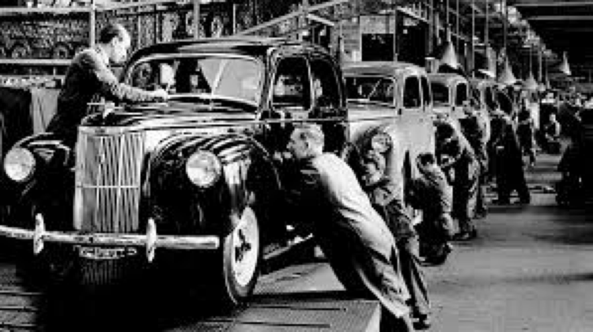
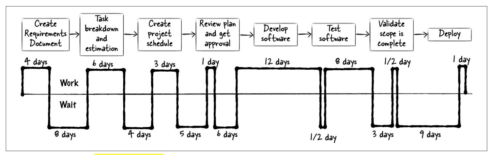

# Valores _lean_ #

Además del manifiesto ágil, muchos autores hablan de la filosofía
_lean_ como otro de los elementos fundacionales de las metodologías
ágiles.

Vamos a hacer en esta sesión una introducción rápida al pensamiento
_lean_, repasando sus orígenes y conociendo sus ideas
fundamentales. Terminaremos con una reflexión sobre si es posible
aplicar estas ideas al desarrollo de software. La filosofía lean se
aplica habitualmente a procesos de fabricación. ¿En qué medida se
puede aplicar al desarrollo de software? ¿Se puede considerar el
desarrollo de software un proceso de fabricación?

## Orígenes de los sistemas de fabricación lean ##

Los sistemas de fabricación lean tienen su origen en el sistema de
producción de Toyota desarrollado en los años 50 principalmente por su
director Taiichi Ohno. Pero es interesante remontarse a principio del
siglo XX para conocer los inicios de los sistemas de fabricación y
producción tradicionales, frente a los que surgen las ideas de los
procesos lean.

### Taylorismo y Fordismo ###

A finales del siglo XIX y principios del XX Frederick Taylor analizó
los procesos de fabricación de las industrias, principalmente el
acero, y popularizó la idea de que estos procesos debían analizarse y
optimizarse al máximo. Se debe analizar todos los elementos del
proceso: qué tiempo pasa el trabajador moviéndose de un sitio a otro,
cómo hacer más eficiente el movimiento de las partes de un sitio a
otro, como optimizar los movimientos necesarios para hacer un
ensamblaje, etc. 

El objetivo final es diseñar un proceso óptimo totalmente detallado,
rígido y repetitivo, del que se elimina en a medida de lo posible
cualquier fuente de variabilidad y que pueda ser realizado por
trabajadores sin demasiada formación. Por ello las personas que
trabajan en el proceso se convierten en unas máquinas más, ejecutando
acciones repetitivas y perdiendo toda creatividad e individualidad.

En los años 1910s Henry Ford (imagen izquierda) aplica estas
ideas a la fabricación de automóviles, creando una filosofía que se ha
denominado [fordismo](https://en.wikipedia.org/wiki/Fordism).

Ford diseña el proceso de fabricación de un automóvil en una
serie de pasos lo suficientemente elementales como para que puedan ser
aprendidos rápidamente y realizados por personal sin demasiada
cualificación. En 1913 introdujo su cambio más revolucionario por el
que, en lugar de que los trabajadores se movieran alrededor del
vehículo, era el vehículo en fabricación el que se movía creando la
primera cadena de montaje.

Las cadenas de montaje se convirtieron en las claves de las fábricas
de Ford y del proceso de fabricación a gran escala de automóviles. Los
grandes beneficios obtenidos permiten a Ford elevar los sueldos de los
empleados, de forma que ahora pueden consumir los productos que ellos
mismos fabrican.

El sistema tiene un gran éxito. Los coches salen de la cadena de
producción con intervalos de 3 minutos, mucho más rápido que con los
métodos anteriores. El tiempo de fabricación se redujo de 12,5 horas a
93 minutos en 1914. En 1914 Ford producía más automóviles que todos
los demás fabricantes combinados. El [Modelo
T](https://en.wikipedia.org/wiki/Ford_Model_T) fue un enorme éxito
comercial y en el momento en que Ford fabricaba su coche número 10
millones la mitad de los coches del mundo eran Fords. Se fabricaron un
total de 15 millones de Modelos T, alcanzando un ritmo de 9.000 a
10.000 coches diarios en 1925 (2 millones al año). El primer Modelo T
se fabricó en 1908 y el último en 1927.

A pesar de su enorme éxito el sistema tiene algunos problemas
importantes. En primer lugar los trabajadores tienen muy poca
motivación debido al trabajo repetitivo. Ford se ve obligado a
aumentar el sueldo de sus trabajadores debido al enorme absentismo y
al abandono de los trabajos. Por otro lado el sistema es muy útil para
la fabricación en escala de vehículos estandarizados. Pero es muy
rígido. Se tarda mucho en responder a los cambios que terminan
demandando los consumidores. Esta será la clave del éxito de los
automóviles japoneses de Toyota en EEUU en los años 60.

### Sistema de producción de Toyota (TPS) ###

Después de la Segunda Guerra Mundial, en el marco de un Japón
empobrecido y sin apenas recursos, en la fabrica de automóviles Toyota
Taiichi Ohno (imagen izquierda) desarrolló una filosofía de gestión y
producción que a la postre terminaría aupando a Toyota (y al resto de
fabricantes japoneses) a dominar la producción de automóviles,
superando a los gigantes americanos Ford y General Motors.

Originalmente denominado producción _just-in-time_, el sistema tuvo su
origen en los problemas de Japón:

- Falta de efectivo para financiar los sistemas de producción
  habituales basados en la acumulación de grandes inventarios.
- Falta de espacio para construir fábricas cargadas de inventario.
- Falta de recursos con los que construir los productos.
- Alto desempleo y gran cantidad de mano de obra, que hacía
  innecesaria la optimización de los procesos de fabricación.
  
De forma que el proceso de fabricación se adelgaza (_lean_),
construyéndose fábricas más pequeñas en las que los únicos materiales
que se almacenan son los que se están utilizando en el momento. Al
mantenerse bajos los niveles de inventario sólo se gasta lo necesario
para fabricar los pedidos bajo demanda.

El sistema tuvo su origen en las ideas del ingeniero de Toyota Taiichi
Ohno que fueron recogidas por Kiichiro Toyoda, director de Toyota en
los años 50s. 

El objetivo de Ohno no era conseguir producción en masa. Su ideal era
fabricar y entregar un producto inmediatamente después de que el
cliente hubiera realizado un pedido. Pensaba que era mejor esperar un
pedido que construir un inventario en anticipación del pedido.
    
Uno de las ideas fundamentales de Ohno era identificar y eliminar
"desperdicio" (_muda_ 無駄 en japonés, _waste_, en inglés) en todo el
proceso de producción de un vehículo. El concepto de "desperdicio" es
un concepto muy general: es todo aquello que no crea valor al cliente:
piezas que no se usan, elementos innecesarios, transporte, movimiento,
espera, procesamiento extra, defectos.

En 1945, bajo la dirección de Ohno, Toyota optimizó el ratio de
producción de cada sistema, reconsiderando la posición de todas las
máquinas de forma que la salida de una máquina alimentaba la
siguiente. Se redujo la velocidad de las máquinas para que todas
tuvieran la misma cadencia, y sólo se produjo material cuando era
necesario. Después de optimizar las fábricas de Toyota, Ohno entrenó a
los proveedores para que la producción completa de un vehículo fuera
just-in-time, transformando la producción en masa en producción
lean. El sistema pull resultante resultó ser fácil de reconfigurar,
minimizó el inventario y permitió tiempos cortos de producción.

Todas estas ideas se plasman en el llamado TPS [Toyota Production
System](http://en.wikipedia.org/wiki/Toyota_Production_System).

> The TPS is a framework for conserving resources by eliminating
> waste. People who participate in the system learn to identify
> expenditures of material, effort and time that do not generate value
> for customers.
>
> Toyota (_Toyota Production System_)[https://global.toyota/en/company/vision-and-philosophy/production-system/]
>

TPS está basado en dos principios básicos:

- Just-in-time: Sólo hacer lo que se necesita, sólo cuando se
necesita y sólo en la cantidad que se necesita. 
    - Evitar gastos de inventario.
    - Ciclos de producción cortos.
    - Herramientas para visualizar el proceso.

- Jidoka (自働化): Juego de palabras en japonés en el que se
incorpora el ideograma "persona" (人) a la izquierda del ideograma
central de la palabra automatización (自動化), queriendo decir
"automatización con intervención humana".
    - Cultura de “parar la cadena” en el momento en que se detecta el
      mínimo error y de preguntarse por la raíz última del error.
    - Cultura de mejora continua en todos los niveles: desde los
      trabajadores de la cadena hasta los directivos y las empresas
      colaboradoras. 
    - Pensar en el conjunto. Equipos multi-funcionales.

En los años 70 los automóviles japoneses conquistaron los mercados
mundiales. Modelos de Toyota, Honda, Nissan, Mitsubishi comenzaron a
venderse en cantidades suficientes como para que las empresas más
tradicionales empezaran a sentirse amenazadas. 

En los años 90 se publica el libro _The Machine That Changed the
World_ que introduce por primera vez el término _lean_ y que
populariza para siempre la filosofía de Toyota. El libro estaba basado
en un estudio de 5 años del MIT sobre la industria automovilística japonesa.

En los años 2000 Japón se convirtió en el primer país en número de
vehículos producidos, superando a la industria americana y europea.

## Algunas características de los sistemas de fabricación lean ##

- Estas ideas dan origen a los denominados sistemas de fabricación
  lean (lean = austero, flaco) 
    - El proceso siempre puede ser mejorado y los trabajadores son los
      que mejor pueden proponer estas mejores.
    - Método científico: los trabajadores aprenden a crear hipótesis,
      probarlas, analizar los resultados y, si los datos confirman la
      hipótesis, hacer el cambio permanente. 

    - Identificar los distintos pasos del proceso de producción (el
      value stream) cadena de valor del proceso. 

    - Una idea central es la continua búsqueda y eliminación de los
      desperdicios (waste) generados por el proceso. Simplificar. 

    - Cuando se eliminan los desperdicios la calidad mejora, y el
      tiempo de producción y los costes se reducen y la producción se
      vuelve fluida (flow). 

    - Consecuencias: alta disciplina y alta respuesta al cambio. 

    - Es una mentalidad (mindset), no un conjunto prescrito de
      reglas. 

- El término lean se ha popularizado: lean startups, lean thinking 

### Value Stream Map ###

- Avanzamos un ejemplo de aplicación de una de estas técnicas al
  desarrollo de software. El **value stream map** (**mapa de flujo de
  valor**) consiste en analizar todas las fases por las que pasa una
  funcionalidad, característica, historia de usuario, tarea,
  etc. desde que se decide desarrollar hasta que se sube a
  producción. Dibujar una caja por cada uno de los pasos y estudiar el
  tiempo de trabajo y tiempo de espera en cada una de las fases. Es
  recomendable hacerlo con características reales, una vez terminadas.

- En el ejemplo anterior las fases serían: (1) crear el documento de requerimiento, (2)
  dividir en tareas y estimar, (3) documento de planificación, (4)
  revisión del plan y obtener visto bueno, (5) desarrollar software,
  (6) pruebas del software, (7) validación del alcance, (8) despliegue.

- Cada empresa, dependiendo de la metodología de desarrollo que use,
  tiene un mapa de flujo de valor distinto. Es una herramienta
  importante para diseñar los tableros kanban.
  
- El enfoque _lean_ consiste en identificar y eliminar _waste_ en el
  _value stream_. Debemos identificar tres tipos de actividades:
  actividades que claramente crean valor; actividades que no crean
  valor para el cliente pero que son necesarias en la actualidad para
  fabricar el producto; y actividades que no crean valor para el
  cliente, son innecesarias y, por lo tanto, deberían ser eliminadas
  inmediatamente (_waste_).

- Un problema importante en el caso del software es la identificación
  de las tareas que van a pasar por el _value stream_. ¿Qué unidades
  son las que hay que analizar? ¿Historias de usuario? ¿Tareas
  técnicas más pequeñas en las que se descomponen las historias de
  usuario?. La recomendación es que sean elementos que no tengan mucha
  variabilidad de tamaño. Un concepto que se suele usar es el de
  **minimal marketable feature** (MMF): el "trozo" más pequeño de
  funcionalidad del producto que los clientes (o el _product owner_)
  puede priorizar. Suelen tomar forma de una historia de usuario, un
  requerimiento o una petición de funcionalidad. En el caso de Scrum,
  son los ítems del backlog.

### Buscar y eliminar desperdicios ###

- Todo aquellos elementos que no añaden valor al producto. Si
  minimizamos los desperdicios maximizaremos la cantidad de trabajo
  útil, que realmente da valor. 

- Ejemplos de desperdicios en procesos de fabricación y servicios: 
    - Espera: personas o hitos del proceso esperando que termine otro
      proceso o que llegue cierta información 
    - Movimiento: movimiento físico o mental que no añade valor
    - Inventario: almacenar servicios y componentes extra que el
      cliente no ha pedido 
    - Defectos: errores que hay que corregir 
    - Sobre-procesamiento: excesiva documentación, informes excesivos,
      partes no necesarias
      

- Toyota también usó el concepto de desperdicio no sólo para
  fabricación, sino también en el desarrollo del producto. Cuando se
  comienza un proceso de desarrollo, el objetivo es completarlo tan
  rápidamente como sea posible, porque todo el trabajo que va en
  desarrollo no está añadiendo valor hasta que el coche sale de la
  línea de producción. En cierto sentido, los proyectos de desarrollo
  en marcha son idénticos al inventario. Los diseños y los prototipos
  no son útiles a los clientes, reciben valor sólo cuando se entrega
  el nuevo producto. 

### Sistemas de fabricación _pull_ ###

<imt src="imagenes/sistema-pull.png" width="400px"/>

- Uno de los pilares de la fabricación lean.
- El proceso de fabricación se divide en un conjunto de 
pasos
  (celdas) que necesitan recursos y consumen los 
resultados de
  procesos anteriores (upstream).
- Sistema push: se planifica a priori la cantidad de trabajo 
a
  comenzar. Cuando un proceso upstream produce un 
componente se
  empuja (push) a la siguiente celda para 
que continue
  procesándolo. Muchas veces se provoca 
sobrecarga en las celdas.
- Sistema pull: el origen del flujo de trabajo está al final de la
  cadena, al entregar el producto final a los clientes. Cada celda
  tiene un número máximo de productos (WIP), cuando se consume uno se
  envía una señal (pull signal) a la celda anterior de que se necesita
  recibir un nuevo componente.
- El flujo de trabajo se regula tirando (pull) de los materiales a
  transformar con una cadencia constante.
- Un sistema pull regula el flujo de los recursos mediante un proceso
  de fabricación reemplazando solo lo que ha sido consumido y lo que
  es inmediatamente entregable.
  
- WIP: **Work In Process**, es un término lean que indica el número de
  ítems que están siendo procesados en una determinada celda o fase
  del proceso. En Kanban veremos que para cada una de las fases del
  proceso se define un límite en el WIP, que obliga a no aceptar más
  ítems una vez que se ha llegado al WIP. Cuando algún ítem termine el
  proceso y pase a la fase siguiente, se vuelve a coger un ítem
  nuevo. Pero nunca estaremos procesando más ítems que los definidos
  por el WIP.

- El flujo de trabajo pull, junto con el WIP, garantiza que no se
  produce sobre inventario y permite **detectar** fácilmente **cuellos
  de botella** en el proceso, procesos que consumen demasiado tiempo y
  que obligan a esperas e impiden una cadencia fluida (flujo,
  **flow**). Una fase que tarda demasiado en procesar los ítems hace
  que las fases previas se queden paradas, esperando, porque no pueden
  sobrepasar su WIP. En un sistema push esas fases seguirían
  procesando ítems, que se acumularían.

- El flujo pull y el mapa de flujo de valor permiten **analizar y
  reflexionar** sobre el proceso de producción.

- Una visualización en
  [YouTube](https://www.youtube.com/watch?v=ZIv2e61SH1A) de los
  sitemas pull.

- Una de las características es el desarrollo rápido y concurrente y
  la habilidad de realizar cambios tarde en el ciclo de desarrollo. No
  hay que hacer decisiones irreversibles en primer lugar, hay que
  retrasar las decisiones tanto como sea posible, manteniendo abiertas
  distintas opciones, y cuando se realicen, hacerlas con la mejor
  información posible.
  

### Kanban ###

- Una de las herramientas más 
importantes para organizar el
  proceso
de producción son las kanban (del 
japonés, kan=visual y ban
  = tablero
o tarjeta), señales visuales que 
implementan el sistema
  pull.

- Enfoque visual para el control de 
la producción, usando
  herramientas 
sencillas como contenedores retornables, 
tarjetas o
  incluso espacios vacíos para “tirar” de los productos desde 
los
  centros de producción hacia los centros de consumo o transformación.

- Una kanban es una señal o ayuda visual que indica que un centro de
  trabajo ha finalizado un proceso, necesita trabajo o necesita más
  materiales.

- Los tableros kanban permiten que los centros de trabajo hagan un
  seguimiento de las necesidades de los clientes o de los proveedores
  y que respondan rápida y adecuadamente.

- Ejemplos de tableros Kanban en el desarrollo de software:

## El desarrollo de software como un proceso de fabricación ##

- Fabricación de un producto
    - Entradas: materias primas y componentes
    - Salida: producto terminado (automóvil, teléfono móvil,
      televisor, etc.)
    - Proceso: diferentes máquinas y pasos en la cadena de montaje
- Si vemos el desarrollo software como un proceso iterativo podemos
  definir un proceso de desarrollo general: 
    - Entradas: software funcionando e ideas de nuevas características
      (features) en forma de casos de uso, historias de usuario, etc. 
    - Salida: software funcionando al que se le ha añadido las nuevas
	características. 
    - Proceso: cada característica debe ser analizada, desarrollada,
      probada, añadida y entregada. 
    - 2 ejes de calidad: elegir qué característica (right product) y
    desarrollar correctamente la característica (product right). 

- Cuando miramos el proceso de desarrollo de nuevas características
  como un proceso de fabricación, podemos aplicar al desarrollo de
  software muchas ideas aprendidas en los procesos de
  fabricación. Sobre todo las técnicas de fabricación lean. 

- El software es un **producto** muy distinto a los productos
  tradicionales: una aplicación no es una bicicleta, ni un televisor,
  ni un edificio. Tanto su desarrollo como su funcionamiento es
  singular.

- El proceso de desarrollo de software es un **proceso creativo** que
  tiene más elementos de **diseño** que de fabricación.
    - Los procesos de fabricación tradicionales son rígidos. En
      general los planos y características del objeto a producir están
      claramente determinados a priori y hay pocas decisiones que
      tomar.
    - En un proceso de diseño hay muchos **grados de libertad**, se
      deben escoger entre muchas posibles soluciones. El proceso
      intenta obtener la mejor opción, cumpliendo un conjunto de
      **restricciones** necesarias. Por ejemplo: el diseño de nuevo
      móvil, de un automóvil o de un mueble.

- Veremos que la filosofía _lean_ acerca ambos planteamientos: permite
  introducir **flexibilidad** en los procesos de fabricación tradicionales
  y un cierto **orden y método** en un proceso de diseño.

- Joel Spolsky (creador de _Stack Overflow_) explica en el artículo
  [Software
  Inventory](https://www.joelonsoftware.com/2012/07/09/software-inventory/)
  de su famoso blog [Joel on Software](https://www.joelonsoftware.com)
  la relación entre el desarrollo de software y un proceso de
  fabricación:
  
  Piensa en las **ideas** a añadir al producto como el **material
  bruto**. Dependiendo del proceso, estas ideas pueden pasar por
  distintos puntos de ensamblaje antes de ser entregadas como
  **_features_ terminadas** al cliente:
  
  - Proceso de toma de decisión (¿deberíamos implementar esta
    _feature_?)
  - Proceso de diseño (especificaciones, pizarras, mockups, etc.)
  - Proceso de implementación (escribir código)
  - Proceso de prueba (encontrar bugs)
  - Proceso de depuración (arreglar bugs)
  - Proceso de despliegue (enviar el código a los clientes, ponerlo en
    el servidor web, etc.)

      
En el artículo anteriormente mencionado de Joel Spolsky se mencionan
tres tipos de inventario que se pueden encontrar en el desarrollo de
software que deben minimizarse:

- **Backlog de _features_**: el 90% de las _features_ en el backlog no
  llega a implementarse. **Solución**: limitar el backlog a 1 o 2
  meses. Una vez que esté lleno no se introducirán nuevos ítems si no
  se quita alguno.
- **Base de datos de bugs**: algunas empresas mantienen bases de datos
  con cientos de bugs que nunca llegan a corregirse. **Solución**:
  implementar un sistema de triaje que indique si un bug debe
  corregirse o marcarse como cerrado. No hay que preocuparse en
  equivocarse, los bugs importantes reaparecerán.
- **_Features_ no desplegadas**: _features_ implementadas pero puestas
  en producción por ser el proceso de despliegue muy
  lento. **Solución**: mejorar el proceso de despliegue con
  integración continua.

## Referencias ##

- Taiichi Ohno (1988) [_Toyota Production System_](https://learning.oreilly.com/library/view/toyota-production-system/9781000056488/)
- Andrew Stellman; Jennifer Greene (2014) [_Learning Agile_, cap. 8](https://learning.oreilly.com/library/view/learning-agile/9781449363819/ch08.html#lean_comma_eliminating_waste_comma_and)
