# Enunciado práctica 1

## Objetivos

En la primera práctica de la asignatura vamos a tomar contacto con el
_framework_ de desarrollo de aplicaciones web en Java _Spring Boot_,
trabajando sobre la aplicación inicial
[domingogallardo/mads-todolist-inicial](https://github.com/domingogallardo/mads-todolist-inicial).

La práctica tendrá una duración de cuatro semanas. Deberás realizarla de
forma individual, siguiendo las indicaciones que encontrarás en este
documento. Tendrás que desarrollar código y trabajar en GitHub
desarrollando _issues_, _pull requests_, _releases_ y actualizando la
wiki del proyecto.

Igual que en la práctica 0, debes leer la [introducción a Spring Boot
para las prácticas de MADS](./intro-spring-boot.md) para entender los
conceptos fundamentales del framework.

## Aplicación inicial ##

La aplicación inicial es una aplicación para gestionar listas de
tareas pendientes de los usuarios de la aplicación. Se pueden registrar
y logear usuarios y los usuarios registrados pueden añadir, modificar
y borrar tareas pendientes de hacer.

A continuación puedes ver dos de las pantallas de la aplicación.

<table>
<tr>
<td>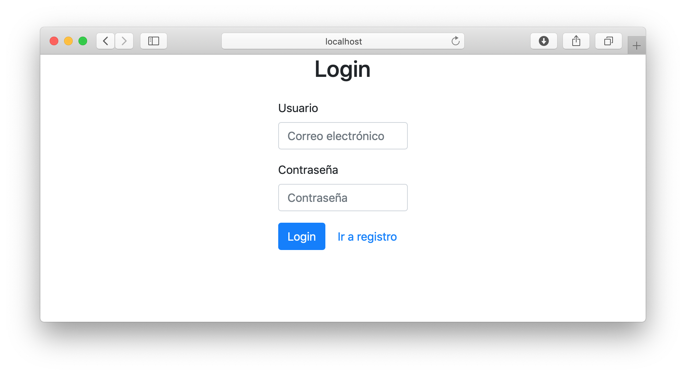</td>
</tr>
<tr>
<td align="center"> Pantalla de login </td>
</table>


<table>
<tr>
<td>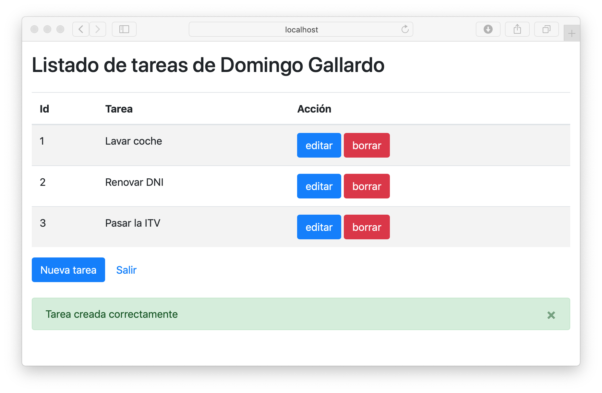</td>
</tr>
<tr>
<td align="center"> Pantalla con listado de tareas </td>
</table>

Iremos desarrollando características adicionales de la aplicación a lo
largo de las prácticas. El nombre de la aplicación es **ToDo List**.


## Metodología de desarrollo ##

En cuanto a la metodología de desarrollo, en esta primera práctica
repasaremos e introduciremos el uso de:

- [Git](https://git-scm.com) como sistema de control de versiones que nos permitirá
  registrar paso a paso los cambios realizados en el desarrollo,
  realizando e integrando ramas de _features_ en las que
  desarrollaremos pequeños incrementos que añadirán poco a poco las
  funcionalidades necesarias en la aplicación.
- [GitHub](https://github.com) como servicio en el que publicaremos los cambios e
  integraremos las ramas usando _pull requests_ (PRs). Utilizaremos un
  gran número de características de GitHub para realizar el
  seguimiento del desarrollo del proyecto: _issues_, _labels_,
  _milestones_, etc.
- JUnit y las [características de testing de Spring
  Boot](https://docs.spring.io/spring-boot/docs/current/reference/html/boot-features-testing.html)
  para realizar continuamente pruebas unitarias que
  validen el desarrollo.

El objetivo es desarrollar software de una forma similar a cómo se
hace en cientos de proyectos punteros de desarrollo _open
source_. 

Existen muchos proyectos que tienen un desarrollo abierto,
transparente, en GitHub. Podemos aprender de sus metodologías
estudiándolos. A continuación listamos ejemplos de repositorios en
GitHub interesantes, en los que podemos estudiar los procesos de _pull
requests_, _issues_, tableros, etc. y las dinámicas de comunicación
que utilizan.

- [CartoDB](https://github.com/CartoDB/cartodb). Software español para
  representación visual de datos geográficos.
- [Vapor](https://github.com/vapor/vapor). Framework web en Swift.
- [Guice](https://github.com/google/guice). Framework de inyección de
  dependencias en Java.
- [swift-nio](https://github.com/apple/swift-nio). Framework asíncrono
  de entrada-salida en Swift. 
- [Spring
  Boot](https://github.com/spring-projects/spring-boot). Framework web
  en Java.

### Git ###

Git es el sistema de control de versiones más utilizado en la
actualidad. Es muy flexible, distribuido, adaptable a múltiples flujos
de trabajo e ideal para una metodología de desarrollo en
equipo. Suponemos que ya tienes cierta experiencia con su uso. Puedes
usar los siguientes enlaces para repasar su funcionamiento.

- [Resumen de comandos de Git](comandos-git.md): Resumen de comandos
  principales para empezar a trabajar con Git.
- [Atlassian Git Tutorials](https://www.atlassian.com/git/tutorials/):
  Tutoriales muy orientados al uso de Git con gran cantidad de
  ejemplos. Es recomendable repasar los tutoriales básicos [Getting
  Started](https://www.atlassian.com/git/tutorials/setting-up-a-repository)
  y los tutoriales
  [Syncing](https://www.atlassian.com/git/tutorials/syncing) y [Using
  Branches](https://www.atlassian.com/git/tutorials/using-branches) en
  el apartado _Collaborating_.
- [Libro de Scott Chacon](https://git-scm.com/book/en/v2): Completo
  manual con todos los detalles de todos los comandos de Git.

Cuando utilicemos git es muy importante realizar unos mensajes de
_commit_ claros. Un mensaje de _commit_ es la forma de comunicar a los
compañeros del equipo qué cambios se han introducido en la aplicación
y ponerlos en contexto (explicar por qué se han hecho, dar algún
detalle de implementación, etc.). El post
[How to Write a Git Commit Message](http://chris.beams.io/posts/git-commit/)
explica muy bien esto.


### Flujo de trabajo ###

Desarrollaremos la aplicación de forma iterativa, utilizando
inicialmente un flujo de trabajo Git denominado _feature branch_
(consultar la
[guía de GitHub](https://guides.github.com/introduction/flow/)) en el
que cada característica nueva se implementa en una rama separada que
después se mezcla con la rama principal de desarrollo. Más adelante
veremos otros flujos de trabajo. Puedes ver una introducción a
distintos flujos de trabajo básicos con Git en este
[documento de Atlassian](https://www.atlassian.com/git/tutorials/comparing-workflows).

Para implementar este flujo de trabajo utilizaremos los siguientes
instrumentos de GitHub que facilitan la comunicación entre los
miembros del equipo:

- **Issues** (_incidencias_): GitHub permite abrir _issues_
  (incidencias o tareas), asignarlos a personas, realizar comentarios,
  asignar etiquetas y cerrarlos cuando la implementación ha
  terminado. Consultar
  [Mastering Issues](https://guides.github.com/features/issues/).

    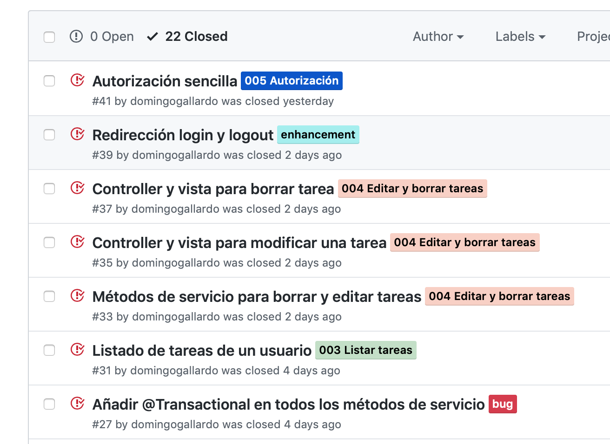

    Definiremos distintos tipos de _issues_ en función de su
    propósito: _bug_, _technical_, _enhancement_. Los _issues_ que
    implementan una historia de usuario los etiquetaremos con el
    código de la historia de usuario.
  
    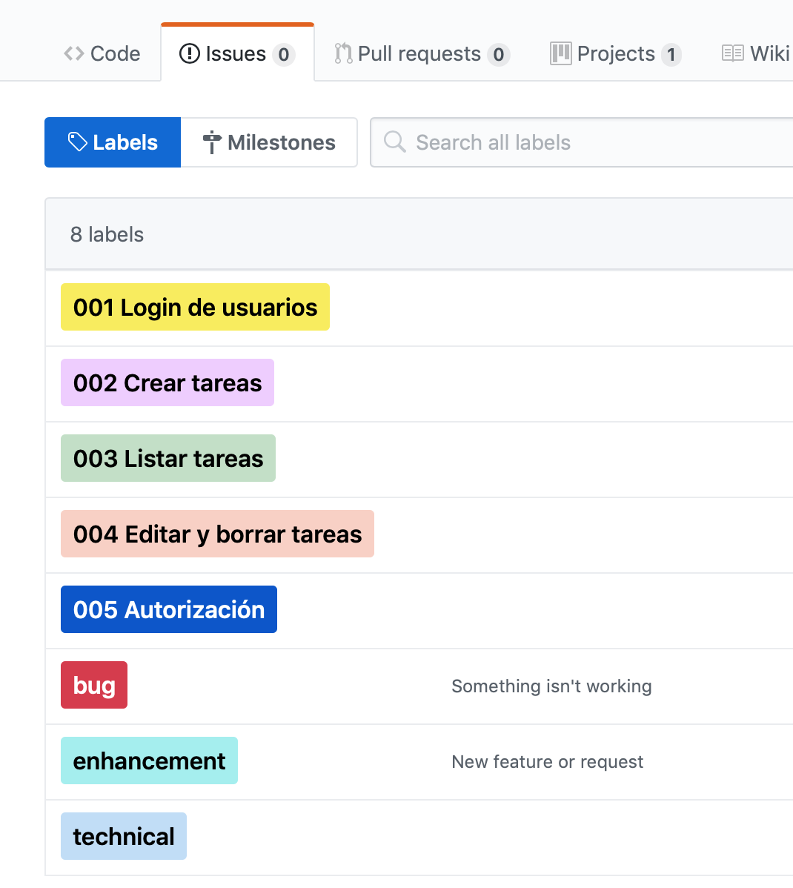
  
    Cada _issue_ se desarrollará en una rama de Git y se integrará en la
    rama _master_ haciendo un _pull request_.


- **Pull Requests**: Un _pull request_ permite avisar al equipo de que
  se va a integrar en la rama principal una rama con un desarrollo
  nuevo. Cuando creamos un PR, GitHub crea una página en la que se
  pueden realizar comentarios, revisiones de código o definir
  políticas de aceptación del PR. Consultar
  [About pull requests](https://help.github.com/articles/about-pull-requests/).
  
    Implementaremos cada _issue_ en una rama separada de git y la
    integraremos en la rama `master` haciendo un _pull
    request_. Cuando se mezcle el PR en `master` el _issue_ se
    cerrará.
  
    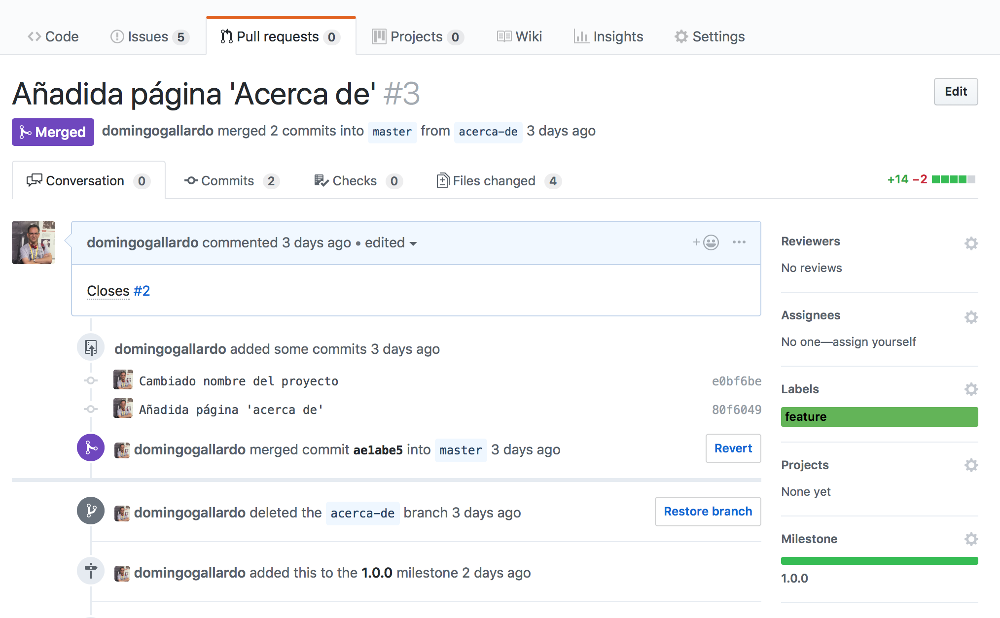

    Más adelante añadiremos otra rama de largo recorrido `releases` para
    incluir en ella las _releases_ del proyecto.

- **Milestones** y **Releases**: Etiquetaremos cada _issue_ con el
  _milestone_ en el que queremos que se lance. Para identificar el
  _milestone_ usaremos el [versionado semántico](https://semver.org):
  MAJOR.MINOR.PATCH. 
  
    
  
    Usaremos la funcionalidad de GitHub _Releases_ para etiquetar los
    commits en los que queramos marcar una versión nueva del
    proyecto. Podemos añadir información sobre las novedades de la
    versión (normalmente serán enlaces a los _issues_ y _pull
    requests_ de ese _milestone_).
  
    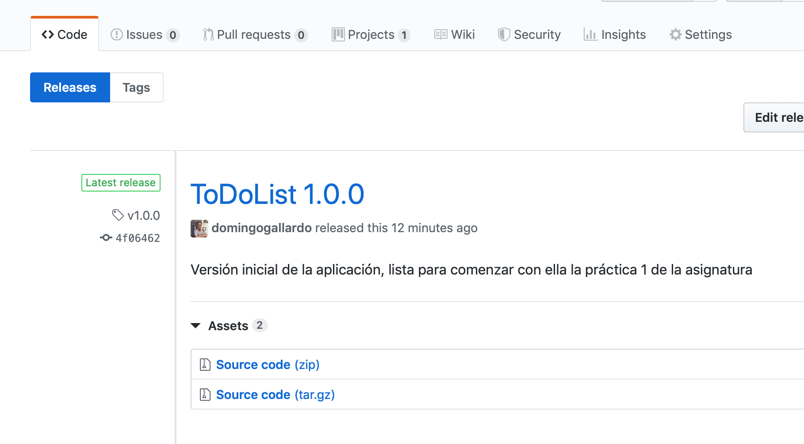

- **Tablero de proyecto**: Un tablero de proyecto nos ayudará a hacer
  un seguimiento de en qué estado se encuentra cada _issue_ o PR:
  cuáles han sido implementados, cuáles faltan por asignar,
  implementar, probar, etc. Vamos a utilizar la funcionalidad propia
  de GitHub llamada _Projects_. Consultar
  [project boards](https://help.github.com/articles/tracking-the-progress-of-your-work-with-project-boards/).

    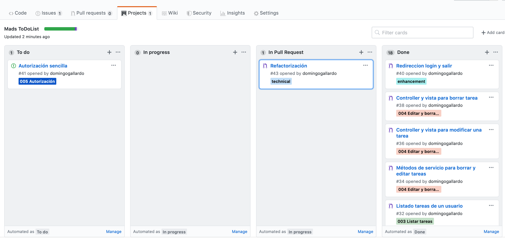
  

También utilizaremos un panel de [Trello](https://trello.com/) para representar las
historias de usuario que se van implementando en el proyecto. 

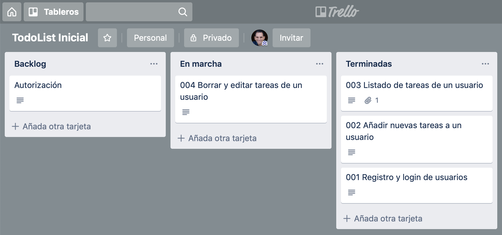

Cada historia de usuario tendrá un código numérico y podrá
implementarse con uno o más issues. En GitHub crearemos una etiqueta
por cada historia de usuario y se la asignaremos a los issues que se
usen para implementarla.

!!! Important
    Puede parecer redundante el uso de dos tableros, uno para las
    historias de usuario y otro para los _issues_ y _PR_. La
    justificación es que los objetivos de ambos tableros son distintos
    (y los contenidos también). El tablero de GitHub será un **tablero
    técnico** gestionado por el equipo de desarrollo. En terminología
    de Scrum será el _sprint backlog_. Mientras que el
    tablero Trello es un **tablero de funcionalidades de usuario**, que
    es gestionado por el _product owner_, usado por el equipo de
    desarrollo y puede ser compartido también con clientes y
    gerencia. En la terminología de Scrum será el _product backlog_.

La documentación en Trello y en GitHub (en los _issues_, en los PRs y
en el propio `README.md` del proyecto) hay que escribirla en
**Markdown**, un lenguaje de marcado muy popular y sencillo de
dominar. Si no has trabajado todavía con él puedes leer estas [guías
de GitHub](https://help.github.com/categories/writing-on-github/).

!!! Note
    Existen herramientas y servicios más avanzados para gestionar
    todos estos elementos del desarrollo. Por ejemplo
    [Jira](https://www.atlassian.com/software/jira),
    [YouTrack](https://www.jetbrains.com/youtrack/),
    [Confluence](https://www.atlassian.com/software/confluence) o
    incluso [Trello](https://www.atlassian.com/software/trello). Pero
    lo que nos ofrece GitHub es suficiente para lo que vamos a
    realizar en la asignatura y tiene la ventaja de estar integrado en
    una misma plataforma.


## La aplicación ToDoList ##

La aplicación
[mads-todolist-inicial](https://github.com/domingogallardo/mads-todolist-inicial)
es la versión inicial de la aplicación que se va a desarrollar
durante todo el cuatrimestre en la asignatura.

Es una aplicación bastante más compleja que la vista en la
práctica 0. Entre otros, tiene los siguientes elementos:

- Gestiona distintos comandos HTTP: GET, POST, DELETE.
- Recogida de datos en formularios HTML y validación de los datos.
- Base de datos gestionada con JPA (_Java Persisence API_), un ORM (_Object Relational
  Mapping_) implementado por la librería Hibernate. Se utiliza una
  capa de persistencia basada en clases _repository_.
- _Capa de servicio_ que proporciona la **lógica de negocio** a los
  controllers.
- Las _clases controller_ sólo se encargan de hacer de interfaz de la
  capa de servicio: 
    - Recoger datos de la petición HTTP,
    - tratar y validar estas entradas, 
    - llamar a la clase de servicio para que se realice la acción
      requerida, y
    - convertir la respuesta obtenida de la aplicación en una vista
      que se devuelve como respuesta de la petición.
- En las plantillas se incluye _Bootstrap_ y scripts JavaScript.
- Las clases de servicio y de _repository_ se obtienen por inyección
  de dependencias.
- Gran número de tests que prueban la capa de servicios y la de presentación.
- Distintos ficheros de configuración para poder arrancar la
  aplicación en distintos entornos: desarrollo y prueba.


Vamos a ver con un poco más de detalle dónde puedes encontrar en el
código todos estos elementos.

### Configuración de la aplicación ###

Los distintos parámetros de la aplicación Spring Boot se configuran un
fichero de propiedades. El fichero de propiedades por defecto es
`application.properties`.

**Fichero `/src/main/resources/application.properties`**:

```java
spring.application.name = madstodolist
spring.datasource.url=jdbc:h2:mem:dev
spring.jpa.properties.hibernate.dialect = org.hibernate.dialect.H2Dialect
spring.jpa.hibernate.ddl-auto=update
logging.level.org.hibernate.SQL=debug
spring.datasource.data=classpath:datos-dev.sql
spring.datasource.initialization-mode=always
```

Se define las características de la fuente de datos con la que trabaja
la aplicación (la base de datos en memoria H2) y el fichero que
contiene los datos iniciales que se van a cargar en la base de datos
al arrancar la aplicación, el fichero `datos-dev.sql`.

También se define la característica de JPA
`spring.jpa.hibernate.ddl-auto` que define cómo se debe inicializar
el esquema de datos de la aplicación cuando haya un cambio en el
código fuente que define las entidades. En este caso tenemos un valor
de `update` para indicar que se el esquema de datos debe
actualizarse. En un entorno de producción el valor de esta propiedad
deberá ser `validate` para no modificar la base de datos de producción.


#### Otras configuraciones ####

Es posible definir otras configuraciones e indicar en el comando de
ejecución de la aplicación Spring Boot qué fichero de configuración
usar. Lo veremos en la práctica 2.

En esta práctica se define otra configuración en el directorio de
test, que es la que se carga cuando se lanzan los tests:


**Fichero `src/test/resources/application.properties`**:
```java
spring.datasource.url=jdbc:h2:mem:test
spring.jpa.properties.hibernate.dialect = org.hibernate.dialect.H2Dialect
spring.jpa.hibernate.ddl-auto=create
logging.level.org.hibernate.SQL=debug
spring.datasource.data=classpath:datos-test.sql
spring.datasource.initialization-mode=always
```

La diferencia con el fichero de configuración de desarrollo es el
nombre de la fuente de datos, el modo del
`spring.jpa.hibernate.ddl-auto`, que es `create` y el fichero de datos
iniciales que se carga al ejecutar los tests.


### Gestión de persistencia con JPA ###

Para la gestión de la persistencia de los datos en la aplicación
Spring Boot usaremos [Spring Data
JPA](https://docs.spring.io/spring-data/jpa/docs/2.1.10.RELEASE/reference/html/). Se
trata de un API de Spring Boot que se construye sobre JPA (_Java
Persistence API_), el ORM (_Object Relational Mapping_) estándar de
Java. La implementación de JPA que utiliza Spring Boot es Hibernate
5.3.10.

Spring Data JPA usa todos los conceptos de JPA y añade algunos
adicionales que facilitan aun más su utilización, como es la
definición de interfaces `Repository` con métodos CRUD estándar para
las entidades.

#### Definición del modelo de datos ####

El framework JPA permite definir el esquema de la base de datos usando
anotaciones en las clases denominadas de entidad. Para cada clase de
entidad se define una tabla en la base de datos, con columnas que se
mapean con sus atributos.

Por ejemplo, la clase `Usuario` que se lista a continuación define la
tabla `usuario` en la base de datos. Los distintos atributos (`login`,
`email`, ...) se corresponden con las columnas de la tabla.

El atributo `id` se corresponde con la clave primaria de la tabla. JPA
define varias estrategias para obtener esa clave primera, y se ha
escogido la estrategia `@GeneratedValue(strategy =
GenerationType.IDENTITY)` que define una columna que se autoincrementa
en cada operación de inserción de un nuevo registro en la tabla.

Además de los atributos, en la clase se define un constructor con los
atributos obligatorios para definir un usuario, unos _getters_ y
_setters_ y los métodos `equals` y `hashCode` para comparar usuarios.

**Fichero `src/main/java/madstodolist/model/Usuario.java`**:

```java
package madstodolist.model;

import javax.persistence.*;
import javax.validation.constraints.NotNull;
import java.io.Serializable;
import java.util.ArrayList;
import java.util.Date;
import java.util.List;
import java.util.Objects;

@Entity
@Table(name = "usuarios")
public class Usuario implements Serializable {

    private static final long serialVersionUID = 1L;

    @Id
    @GeneratedValue(strategy = GenerationType.IDENTITY)
    private Long id;
    @NotNull
    private String email;
    private String nombre;
    private String password;
    @Column(name = "fecha_nacimiento")
    @Temporal(TemporalType.DATE)
    private Date fechaNacimiento;

    // Definimos el tipo de fetch como EAGER para que
    // cualquier consulta que devuelve un usuario rellene automáticamente
    // toda su lista de tareas
    // CUIDADO!! No es recomendable hacerlo en aquellos casos en los
    // que la relación pueda traer a memoria una gran cantidad de entidades
    @OneToMany(mappedBy = "usuario", fetch = FetchType.EAGER)
    List<Tarea> tareas = new ArrayList<Tarea>();

    // Constructor vacío necesario para JPA/Hibernate.
    // Lo hacemos privado para que no se pueda usar desde el código de la aplicación. Para crear un
    // usuario en la aplicación habrá que llamar al constructor público. Hibernate sí que lo puede usar, a pesar
    // de ser privado.
    private Usuario() {}

    // Constructor público con los atributos obligatorios. En este caso el correo electrónico.
    public Usuario(String email) {
        this.email = email;
    }

    public Long getId() {
        return id;
    }

    public void setId(Long id) {
        this.id = id;
    }

    public String getEmail() {
        return email;
    }

    public void setEmail(String email) {
        this.email = email;
    }

    public String getNombre() {
        return nombre;
    }

    public void setNombre(String nombre) {
        this.nombre = nombre;
    }

    public String getPassword() {
        return password;
    }

    public void setPassword(String password) {
        this.password = password;
    }

    public Date getFechaNacimiento() {
        return fechaNacimiento;
    }

    public void setFechaNacimiento(Date fechaNacimiento) {
        this.fechaNacimiento = fechaNacimiento;
    }

    public List<Tarea> getTareas() {
        return tareas;
    }

    public void setTareas(List<Tarea> tareas) {
        this.tareas = tareas;
    }

    @Override
    public boolean equals(Object o) {
        if (this == o) return true;
        if (o == null || getClass() != o.getClass()) return false;
        Usuario usuario = (Usuario) o;
        if (id != null && usuario.id != null)
            // Si tenemos los ID, comparamos por ID
            return Objects.equals(id, usuario.id);
        // sino comparamos por campos obligatorios
        return email.equals(usuario.email);
    }

    @Override
    public int hashCode() {
        // Generamos un hash basado en los campos obligatorios
        return Objects.hash(email);
    }
}
```

En la definición de la entidad también se incluyen relaciones con
otras entidades. En este caso un `Usuario` tiene muchas `Tarea`s (una
relación una-a-muchos).

La relación uno-a-muchos se representa en la base de datos con una
clave ajena. El atributo `mappedBy` indica que la clave ajena se va a
guardar en la columna correspondiente con el atributo `usuario` de la
entidad `Tarea`.

La definición de `Tarea` es la siguiente:

**Fichero `src/main/java/madstodolist/model/Tarea.java`**:

```java
package madstodolist.model;

import javax.persistence.*;
import javax.validation.constraints.NotNull;
import java.io.Serializable;
import java.util.Objects;

@Entity
@Table(name = "tareas")
public class Tarea implements Serializable {

    private static final long serialVersionUID = 1L;

    @Id
    @GeneratedValue(strategy = GenerationType.IDENTITY)
    private Long id;
    @NotNull
    private String titulo;

    @NotNull
    // Relación muchos-a-uno entre tareas y usuario
    @ManyToOne
    // Nombre de la columna en la BD que guarda físicamente
    // el ID del usuario con el que está asociado una tarea
    @JoinColumn(name = "usuario_id")
    private Usuario usuario;

    // Constructor vacío necesario para JPA/Hibernate.
    // Lo hacemos privado para que no se pueda usar desde el código de la aplicación. Para crear un
    // usuario en la aplicación habrá que llamar al constructor público. Hibernate sí que lo puede usar, a pesar
    // de ser privado.
    private Tarea() {}

    // Al crear una tarea la asociamos automáticamente a un
    // usuario. Actualizamos por tanto la lista de tareas del
    // usuario.
    public Tarea(Usuario usuario, String titulo) {
        this.usuario = usuario;
        this.titulo = titulo;
        usuario.getTareas().add(this);
    }

    public Long getId() {
        return id;
    }

    public void setId(Long id) {
        this.id = id;
    }

    public String getTitulo() {
        return titulo;
    }

    public void setTitulo(String titulo) {
        this.titulo = titulo;
    }

    public Usuario getUsuario() {
        return usuario;
    }

    public void setUsuario(Usuario usuario) {
        this.usuario = usuario;
    }


    @Override
    public boolean equals(Object o) {
        if (this == o) return true;
        if (o == null || getClass() != o.getClass()) return false;
        Tarea tarea = (Tarea) o;
        return titulo.equals(tarea.titulo) &&
                usuario.equals(tarea.usuario);
    }

    @Override
    public int hashCode() {
        return Objects.hash(titulo, usuario);
    }
}
```

#### Recuperación _eager_ y _lazy_ de las colecciones ####

En la aplicación se define la relación _uno-a-muchos_ entre usuarios y
tareas: un usuario tiene muchas tareas.

```java
@Entity
public class Usuario {
    ...
    // Definimos el tipo de fetch como EAGER para que
    // cualquier consulta que devuelve un usuario rellene automáticamente
    // toda su lista de tareas
    // CUIDADO!! No es recomendable hacerlo en aquellos casos en los
    // que la relación pueda traer a memoria una gran cantidad de entidades
    @OneToMany(mappedBy = "usuario", fetch = FetchType.EAGER)
    List<Tarea> tareas = new ArrayList<Tarea>();
    ...
}

@Entity
public class Tarea {
    ...
    // Relación muchos-a-uno entre tareas y usuario
    @ManyToOne
    // Nombre de la columna en la BD que guarda físicamente
    // el ID del usuario con el que está asociado una tarea
    @JoinColumn(name = "usuario_id")
    private Usuario usuario;
    ...
}
```

**Relaciones _lazy_**

Por defecto, todas las relaciones _a-muchos_ en JPA se definen de
tipo `LAZY`. 

La característica de los atributos marcados como _lazy_ en JPA es que
no se traen a memoria cuando se recupera la entidad, sino cuando se
consultan. Pero para que se traigan a memoria **la conexión con la base
de datos debe estar abierta**. Si ya se ha cerrado esa conexión (por
ejemplo, se ha cerrado la transacción en el método de servicio y se
quiere acceder a la una lista de tareas de un usuario devuelto por el
propio método estando en el controller) se producirá un error.

**Relaciones _eager_**

Frente a la recuperación _lazy_ de colecciones, también existe la
posibilidad de definir una colección como de tipo _EAGER_. En este
caso JPA se traerá siempre a memoria todos los elementos. Es el caso
de la relación entre un usuario y sus tareas.

En general, no es conveniente definir una relación como _eager_ porque
puede provocar problemas de rendimiento en el caso en que haya muchos
elementos relacionados. 

Pero si no hay muchos datos en la relación y los vamos a usar con
frecuencia, sí que es aconsejable usar el tipo _EAGER_ para facilitar
el manejo de la entidad.


#### Clases Repository ####

Spring define la clase genérica `CrudRepository` que contienen métodos por
defecto para actualizar las entidades y realizar _queries_ sobre
ellas. Para dejar abierta la posibilidad de cambiar la implementación,
se definen con interfaces.

```java
public interface CrudRepository<T, ID extends Serializable>  extends Repository<T, ID> {
  <S extends T> S save(S entity);
  Optional<T> findById(ID primaryKey); 
  Iterable<T> findAll();
  long count();
  void delete(T entity);
  boolean existsById(ID primaryKey);
  // … more functionality omitted.
}
```

Para usar estos métodos con nuestras entidades basta con definir
interfaces que extienden esta clase genérica. Por ejemplo, la interfaz `TareaRepository`:

**Fichero `src/main/java/madstodolist/model/TareaRepository.java`**:

```java
package madstodolist.model;

import org.springframework.data.repository.CrudRepository;

public interface TareaRepository extends CrudRepository<Tarea, Long> {}
```

Una vez definida la interfaz, ya podemos inyectar una instancia de
_repository_ y usarla en las clases de servicio. Por ejemplo,
mostramos el método de servicio que modifica el título de una tarea:

```java
@Service
public class TareaService {

    private UsuarioRepository usuarioRepository;
    private TareaRepository tareaRepository;

    @Autowired
    public TareaService(UsuarioRepository usuarioRepository, TareaRepository tareaRepository) {
        this.usuarioRepository = usuarioRepository;
        this.tareaRepository = tareaRepository;
    }
    
    ...
    
    @Transactional
    public Tarea modificaTarea(Long idTarea, String nuevoTitulo) {
        Tarea tarea = tareaRepository.findById(idTarea).orElse(null);
        if (tarea == null) {
            throw new TareaServiceException("No existe tarea con id " + idTarea);
        }
        tarea.setTitulo(nuevoTitulo);
        tareaRepository.save(tarea);
        return tarea;
    }
    
    ...
}
```

La anotación `@Transactional` hace que las acciones sobre la base de
datos se ejecuten de forma transaccional. Se abre la transacción al
del método y se cierra al final. Si sucede alguna excepción durante su
ejecución la transacción se deshace.

En el cuerpo del método se llama al método `findById` del repositorio
que realiza una búsqueda en la base de datos y al método `save` que actualiza el
valor de la entidad.

La interfaz `UsuarioRepository` es similar.

**Fichero `src/main/java/madstodolist/model/UsuarioRepository.java`**:

```java
package madstodolist.model;

import org.springframework.data.repository.CrudRepository;

import java.util.Optional;

public interface UsuarioRepository extends CrudRepository<Usuario, Long> {
    Optional<Usuario> findByEmail(String s);
}
```


La diferencia es que se añade un método `findByEmail` que hace que
Spring construya automáticamente una consulta sobre  la base de datos. Al
usar como nombre del método el nombre de la propiedad de la entidad
(`email`), Spring puede generar automáticamente la consulta.

### Servicios ###

La capa de servicios es la capa intermedia entre la capa de
_controllers_ y la de _repository_. Es la capa que implementa toda la
lógica de negocio de la aplicación.

La responsabilidad principal de la capa de servicios es obtener o
crear los objetos entidad necesarios para cada funcionalidad a partir
de los datos que manda la capa _controller_, trabajar con ellos en
memoria y hacer persistentes los cambios utilizando la capa
_repository_.

La capa de servicios también gestionará errores y lanzará excepciones
cuando no se pueda realizar alguna funcionalidad.

Los servicios obtienen instancias de _Repository_ usando inyección de
dependencias.

**Ventajas de utilizar una capa de servicios**

Al utilizar clases de servicios podemos aislar la lógica de negocio de
la aplicación usando métodos y objetos Java, sin preocuparnos de cómo
obtener los datos de la interfaz de usuario ni de cómo mostrar los
resultados. De esto ya se ocuparán las clases _controller_. De esta
forma, si se necesita modificar la interfaz de usuario de la
aplicación, o convertirla en un servicio REST que devuelva JSON en
lugar de HTML sólo tendremos que tocar las clases _controller_, no las
de servicio.

Además, al no tener ninguna dependencia con la interfaz de usuario,
estas clases de servicios también podrán ser fácilmente testeadas. La
mayoría de los tests automáticos los haremos sobre ellas.

**Fichero `src/main/java/madstodolist/service/UsuarioService.java`**:

```java
npackage madstodolist.service;

import madstodolist.model.Usuario;
import madstodolist.model.UsuarioRepository;
import org.slf4j.Logger;
import org.slf4j.LoggerFactory;
import org.springframework.beans.factory.annotation.Autowired;
import org.springframework.stereotype.Service;
import org.springframework.transaction.annotation.Transactional;

import java.util.Optional;

@Service
public class UsuarioService {

    public enum LoginStatus {LOGIN_OK, USER_NOT_FOUND, ERROR_PASSWORD}

    private UsuarioRepository usuarioRepository;

    @Autowired
    public UsuarioService(UsuarioRepository usuarioRepository) {
        this.usuarioRepository = usuarioRepository;
    }

    @Transactional(readOnly = true)
    public LoginStatus login(String eMail, String password) {
        Optional<Usuario> usuario = usuarioRepository.findByEmail(eMail);
        if (!usuario.isPresent()) {
            return LoginStatus.USER_NOT_FOUND;
        } else if (!usuario.get().getPassword().equals(password)) {
            return LoginStatus.ERROR_PASSWORD;
        } else {
            return LoginStatus.LOGIN_OK;
        }
    }

    // Se añade un usuario en la aplicación.
    // El email y password del usuario deben ser distinto de null
    // El email no debe estar registrado en la base de datos
    @Transactional
    public Usuario registrar(Usuario usuario) {
        Optional<Usuario> usuarioBD = usuarioRepository.findByEmail(usuario.getEmail());
        if (usuarioBD.isPresent())
            throw new UsuarioServiceException("El usuario " + usuario.getEmail() + " ya está registrado");
        else if (usuario.getEmail() == null)
            throw new UsuarioServiceException("El usuario no tiene email");
        else if (usuario.getPassword() == null)
            throw new UsuarioServiceException("El usuario no tiene password");
        else return usuarioRepository.save(usuario);
    }

    @Transactional(readOnly = true)
    public Usuario findByEmail(String email) {
        return usuarioRepository.findByEmail(email).orElse(null);
    }

    @Transactional(readOnly = true)
    public Usuario findById(Long usuarioId) {
        return usuarioRepository.findById(usuarioId).orElse(null);
    }
}
```


**Fichero `src/main/java/madstodolist/service/UsuarioServiceException.java`**:

```java
package madstodolist.service;

public class UsuarioServiceException extends RuntimeException {

    public UsuarioServiceException(String message) {
        super(message);
    }
}
```


### Controllers ###

Las clases _controllers_ son las que gestionan la interfaz de usuario
de la aplicación. Se encargan de recibir los datos de las peticiones
HTTP, llamar a la clase de servicio necesaria para procesar la lógica
de negocio y mostrar la vista con la información resultante
proporcionada por la clase de servicio.

En la aplicación se definen dos clases controller:

- `LoginController`: con métodos para registrar y logear usuarios.
- `TareasController`: con métodos para crear, borrar y modificar
  tareas de un usuario.

Los controllers usan clases auxiliares en las que se guardan los datos
introducidos en los formularios. Por ejemplo, la clase
`LoginController` usa las clases `LoginData` y `RegistroData`.


**Fichero `src/main/java/madstodolist/controller/LoginController.java`**:

```java
package madstodolist.controller;

import madstodolist.authentication.ManagerUserSesion;
import madstodolist.model.Usuario;
import madstodolist.service.UsuarioService;
import org.springframework.beans.factory.annotation.Autowired;
import org.springframework.stereotype.Controller;
import org.springframework.ui.Model;
import org.springframework.validation.BindingResult;
import org.springframework.web.bind.annotation.GetMapping;
import org.springframework.web.bind.annotation.ModelAttribute;
import org.springframework.web.bind.annotation.PostMapping;
import org.springframework.web.servlet.mvc.support.RedirectAttributes;

import javax.servlet.http.HttpSession;
import javax.validation.Valid;

@Controller
public class LoginController {

    @Autowired
    UsuarioService usuarioService;

    @Autowired
    ManagerUserSesion managerUserSesion;

    @GetMapping("/login")
    public String loginForm(Model model) {
        model.addAttribute("loginData", new LoginData());
        return "formLogin";
    }

    @PostMapping("/login")
    public String loginSubmit(@ModelAttribute LoginData loginData, Model model, RedirectAttributes flash, HttpSession session) {

        // Llamada al servicio para comprobar si el login es correcto
        UsuarioService.LoginStatus loginStatus = usuarioService.login(loginData.geteMail(), loginData.getPassword());

        if (loginStatus == UsuarioService.LoginStatus.LOGIN_OK) {
            Usuario usuario = usuarioService.findByEmail(loginData.geteMail());

            managerUserSesion.logearUsuario(session, usuario.getId());

            return "redirect:/usuarios/" + usuario.getId() + "/tareas";
        } else if (loginStatus == UsuarioService.LoginStatus.USER_NOT_FOUND) {
            model.addAttribute("error", "No existe usuario");
            return "formLogin";
        } else if (loginStatus == UsuarioService.LoginStatus.ERROR_PASSWORD) {
            model.addAttribute("error", "Contraseña incorrecta");
            return "formLogin";
        }
        return "formLogin";
    }

    @GetMapping("/registro")
    public String registroForm(Model model) {
        model.addAttribute("registroData", new RegistroData());
        return "formRegistro";
    }

   @PostMapping("/registro")
   public String registroSubmit(@Valid RegistroData registroData, BindingResult result, Model model) {

        if (result.hasErrors()) {
            return "registroForm";
        }

        if (usuarioService.findByEmail(registroData.geteMail()) != null) {
            model.addAttribute("registroData", registroData);
            model.addAttribute("error", "El usuario " + registroData.geteMail() + " ya existe");
            return "formRegistro";
        }

        Usuario usuario = new Usuario(registroData.geteMail());
        usuario.setPassword(registroData.getPassword());
        usuario.setFechaNacimiento(registroData.getFechaNacimiento());
        usuario.setNombre(registroData.getNombre());

        usuarioService.registrar(usuario);
        return "redirect:/login";
   }

   @GetMapping("/logout")
   public String logout(HttpSession session) {
        session.setAttribute("idUsuarioLogeado", null);
        return "redirect:/login";
   }
}
```


**Fichero `src/main/java/madstodolist/controller/LoginData.java`**:

```java
package madstodolist.controller;

public class LoginData {
    private String eMail;
    private String password;

    public String geteMail() {
        return eMail;
    }

    public void seteMail(String eMail) {
        this.eMail = eMail;
    }

    public String getPassword() {
        return password;
    }

    public void setPassword(String password) {
        this.password = password;
    }
}
```

#### Peticiones y rutas ####

Las rutas que se definen en los controllers para realizar las acciones
de la aplicación son:

**`LoginController`**

- `GET /login`: devuelve el formulario de login
- `POST /login`: realiza el login
- `GET /registro`: devuelve el formulario de registro
- `POST /registro`: realiza el registro
- `GET /logout`: realiza la salida del usuario de la aplicación

**`TareaController`**

- `GET /usuarios/{id}/tareas/nueva`: devuelve el formulario para
añadir una tarea al usuario con identificador `{id}`
- `POST /usuarios/{id}/tareas/nueva`: añade una tarea nueva a un usuario
- `GET /usuarios/{id}/tareas`: devuelve el listado de tareas de un usuario
- `GET /tareas/{id}/editar"`: devuelve el formulario para editar una tarea
- `POST /tareas/{id}/editar`: añade una tarea modificada 
- `DELETE /tareas/{id}`: realiza el borrado de una tarea


### Vistas ###

Todas las vistas de la aplicación comparten la misma cabecera y pie de
página. Para centralizar estos elementos se usa la característica de
fragmentos de Thymeleaf. Los fragmentos comunes se definen en el
fichero `fragments.html`.

**Fichero `src/main/resources/templates/fragments.html`**:

```html
<!DOCTYPE html>
<html xmlns:th="http://www.thymeleaf.org">

<head th:fragment="head (titulo)">
    <meta charset="UTF-8"/>
    <title th:text="${titulo}"></title>
    <link rel="stylesheet" th:href="@{/css/bootstrap.min.css}">
</head>

<div th:fragment="javascript">
    <script th:src="@{/js/jquery.min.js}"></script>
    <script th:src="@{/js/popper.min.js.css}"></script>
    <script th:src="@{/js/bootstrap.min.js}"></script>
    <span th:text="${scripts}"></span>
</div>
/html>
```

Vemos que las vistas usan el framework CSS _Bootstrap_ y varias
librerías JavaScript. Ambos se encuentran en el directorio
`src/main/resources/static/`, el directorio por defecto en el que se
guardan los recursos estáticos de una aplicación Spring Boot.

La vista principal es el listado de tareas.

**Fichero `src/main/resources/templates/listaTareas.html`**:

```html
<!DOCTYPE html>
<html xmlns:th="http://www.thymeleaf.org">

<head th:replace="fragments :: head (titulo='Login')"></head>

<body>
<div class="container-fluid">

    <div class="row mt-3">
        <div class="col">
            <h2 th:text="'Listado de tareas de ' + ${usuario.nombre}"></h2>
        </div>
    </div>

    <div class="row mt-3">
        <div class="col">
            <table class="table table-striped">
                <thead>
                <tr>
                    <th>Id</th>
                    <th>Tarea</th>
                    <th>Acción</th>
                </tr>
                </thead>
                <tbody>
                <tr th:each="tarea: ${tareas}">
                    <td th:text="${tarea.id}"></td>
                    <td th:text="${tarea.titulo}"></td>
                    <td><a class="btn btn-primary btn-xs" th:href="@{/tareas/{id}/editar(id=${tarea.id})}"/>editar</a>
                        <a class="btn btn-danger btn-xs" href="#" onmouseover="" style="cursor: pointer;"
                           th:onclick="'del(\'/tareas/' + ${tarea.id} + '\')'">borrar</a>
                    </td>
                </tr>
                </tbody>
            </table>
            <p><a class="btn btn-primary" th:href="@{/usuarios/{id}/tareas/nueva(id=${usuario.id})}"> Nueva tarea</a>
            <a class="btn btn-link" href="/logout">Salir</a></p>
        </div>
    </div>
    <div class="row mt-2">
        <div class="col">
            <div class="alert alert-success alert-dismissible fade show" role="alert" th:if="${!#strings.isEmpty(mensaje)}">
                <span th:text="${mensaje}"></span>
                <button type="button" class="close" data-dismiss="alert" aria-label="Close">
                    <span aria-hidden="true">&times;</span>
                </button>
            </div>
        </div>
    </div>
</div>


</div>

<div th:replace="fragments::javascript"/>

<!-- Ejemplo de uso de Ajax para lanzar una petición DELETE y borrar una tarea -->

<script type="text/javascript">
    function del(urlBorrar) {
        if (confirm('¿Estás seguro/a de que quieres borrar la tarea?')) {
            $.ajax({
                url: urlBorrar,
                type: 'DELETE',
                success: function (results) {
                    //refresh the page
                    location.reload();
                }
            });
        }
    }
</script>

</body>
</html>
```

- La plantilla recibe una lista de tareas, un usuario y un mensaje
(consultar en el controller `TareasController` cómo se obtienen esos
datos). 
- Define un script JavaScript en el que se realiza una petición
  `DELETE` a la URL que se le pasa como parámetro (se utilizará para
  lanzar la acción de borrar una tarea).
- Utiliza una instrucción de iteración sobre la lista de tares para
  construir los elementos de la tabla de tareas.
- En las acciones de añadir y editar tareas se construyen las URLs a
  las que hacer la petición usando el identificador de la tarea.

#### Autenticación y control de acceso ####

En la aplicación se realiza una autenticación y un control de acceso
muy sencillo usando la sesión HTTP. Esta sesión se implementa en
Spring Boot con una cookie que se pasa desde el navegador hasta el
servidor en cada petición.

El manejo de la sesión es muy sencillo: es un diccionario en el que
podemos añadir datos. En el servidor podemos obtener los datos de la
sesión consultando el diccionario.

La implementación de la autenticación y del control de acceso se
realiza con en la clase `ManagerUserSesion`:

**Fichero `src/main/java/madstodolist/authentication/ManagerUserSesion.java`**:

```java
package madstodolist.authentication;

import org.springframework.stereotype.Component;

import javax.servlet.http.HttpSession;

@Component
public class ManagerUserSesion {

    // Añadimos el id de usuario en la sesión HTTP para hacer
    // una autorización sencilla. En los métodos de controllers
    // comprobamos si el id del usuario logeado coincide con el obtenido
    // desde la URL
    public void logearUsuario(HttpSession session, Long idUsuario) {
        session.setAttribute("idUsuarioLogeado", idUsuario);
    }

    // Si el usuario no está logeado se lanza una excepción
    public void comprobarUsuarioLogeado(HttpSession session, Long idUsuario) {
        Long idUsuarioLogeado = (Long) session.getAttribute("idUsuarioLogeado");
        if (!idUsuario.equals(idUsuarioLogeado))
            throw new UsuarioNoLogeadoException();
    }
}
```


Se implementa como un componente Spring con la anotación `@Component`,
lo inyectamos en los controllers y lo mockeamos en los tests de los controllers.

### Pruebas manuales y automáticas ###

Durante el desarrollo de la práctica será necesario realizar **pruebas
manuales** de la aplicación, introducir datos en sus pantallas y
comprobar que los cambios que hemos añadido funcionan correctamente.

Para estas pruebas manuales recomendamos utilizar la configuración de
ejecución trabajando sobre una base de datos con valores
iniciales. Estos valores iniciales se cargan en la aplicación al
comenzar.

**Fichero `src/main/resources/datos-dev.sql`**:

```sql
INSERT INTO usuarios (id, email, nombre, password, fecha_nacimiento) VALUES('1', 'domingo@ua', 'Domingo Gallardo', '123', '2001-02-10');
INSERT INTO tareas (id, titulo, usuario_id) VALUES('1', 'Lavar coche', '1');
INSERT INTO tareas (id, titulo, usuario_id) VALUES('2', 'Renovar DNI', '1');
```


Para los tests automáticos se cargan los datos definidos en el fichero
`datos-tests.sql`.

**Fichero `src/test/resources/datos-test.sql`**:

```sql
INSERT INTO usuarios (id, email, nombre, password, fecha_nacimiento) VALUES('1', 'ana.garcia@gmail.com', 'Ana García', '12345678', '2001-02-10');
INSERT INTO tareas (id, titulo, usuario_id) VALUES('1', 'Lavar coche', '1');
INSERT INTO tareas (id, titulo, usuario_id) VALUES('2', 'Renovar DNI',
'1');
```

Se realizan tests automáticos sobre las entidades y repository:

- `TareaTest.java`
- `UsuarioTest.java`:

También sobre la capa de servicio: 

- `TareaServiceTest.java`
- `UsuarioServiceTest.java`

Y sobre las vistas:

- `UsuarioWebTest.java`
- `TareaWebTest.java`

En los tests sobre repository se debe usar la anotación
`@Transactional` para definir el contexto transaccional en el que se
realiza la llamada a las acciones sobre la base de datos.

En los tests sobre las vistas se _mockean_ los servicios para que
devuelvan los datos que nos interesan.

Hay que ser cuidadoso al hacer pruebas que afectan a la base de datos,
porque podemos insertar o modificar datos que se comprueban en otros
tests. Tenemos que tener cuidado en que cada test sea independiente de
los demás.


## Antes de empezar la práctica

1. Una vez logeado en GitHub, copia el enlace con una invitación que
   compartiremos en el foro de Moodle. Con esa invitación se creará
   automáticamente el repositorio `todolist-2019-<usuario>` en la
   organización [mads-ua](https://github.com/mads-ua). Al igual que el
   repositorio de la práctica 0. Es un repositorio privado al que
   tienes acceso tú y el profesor. Contiene el código inicial de un
   proyecto base (es una copia del repositorio
   [domingogallardo/mads-todolist-inicial](https://github.com/domingogallardo/mads-todolist-inicial))
   en la que se han comprimido todos los commits en uno.

   Al igual que en la práctica 0 es importante que tengas en cuenta
  que el repositorio recién creado no reside en tu cuenta, sino en
  la organización `mads-ua`. Puedes acceder a él desde el
   _dashboard_ de GitHub que aparece cuando te logeas:
   
2. Descarga el proyecto y comprueba que se compila y ejecuta
   correctamente:
   
        $ git clone https://github.com/mads-ua/todolist-2019-usuario.git
        $ cd todolist-2019-usuario
        $ mvn spring-boot:run
   
    Comprueba que la aplicación está funcionando en
    <http://localhost:8080/login> en la máquina host.
   
    
  
    Para la aplicación haciendo CTR+C en el terminal.
    
3. Importa el proyecto en IntelliJ para trabajar, ejecutar los tests y
   lanzar la aplicación desde este entorno.
 
4. Es posible examinar el esquema de la base de datos y los datos
   accediendo a la base de datos H2 en memoria añadiendo las
   siguientes preferencias:
    
    ```java
    spring.h2.console.enabled=true
    spring.h2.console.path=/h2-console
    ```

    Una vez lanzada la aplicación, podemos acceder a
    <http://localhost:8080/h2-console> introduciendo como `JDBC URL`
    la dirección de la fuente de datos `jdbc:h2:mem:dev` y como
    `User name` la cadena `sa`
    
    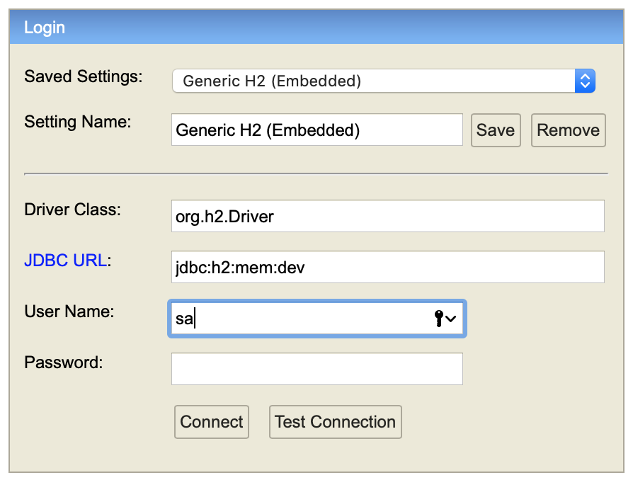

    Y examinar tablas en concreto:

    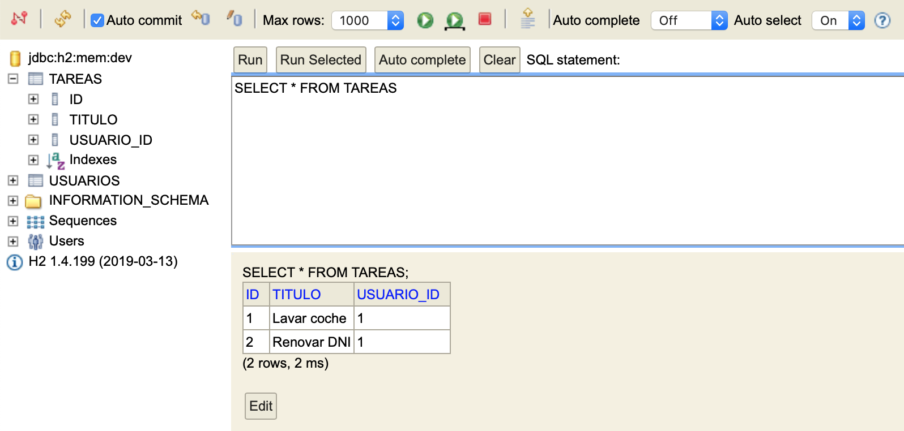


5. Crea un tablero Trello público llamado `ToDoList MADS`. Va a servir
   como _backlog_ de las historias de usuario que debes realizar en
   la práctica.  Añade en él 3 columnas, tal y se explica en el
   apartado anterior de metodología de desarrollo.
   
   Añade el enlace en la descripción del repositorio GitHub, para que
   el profesor pueda acceder a consultar el estado del proyecto.
   
   Un ejemplo de tablero es el [Trello del proyecto mads-todolist-inicial](https://trello.com/b/5zWOT6uO/todolist-inicial).


## Desarrollo de la práctica

En esta primera práctica vamos a desarrollar las siguientes historias de usuario o _features_:

1. Página _Acerca de_
2. Barra de menú
3. Página listado de usuarios
4. Página descripción de usuario
5. Usuario administrador (opcional)
6. Gestión de usuarios por el usuario administrador (opcional)

La práctica va a consistir en la realización en tu proyecto de todos
los elementos necesarios para implementar estas _features_ : tablero Trello,
_issues_, _pull requests_ (con sus _commits_ en los que se desarrolla paso a paso
cada _issue_) y tablero del proyecto. 

Haremos paso a paso la historia de usuario 1, creando la primera
versión 1.0.1 de la aplicación. Las siguientes características las
deberás desarrollar tu mismo y entregar la versión 1.1.0.

### Versión 1.0.1 ###

La versión 1.0.1 será la versión inicial de la
aplicación. Desarrollaremos en esta versión la primera característica:
**Página _Acerca de_**.

#### Tablero Trello ####

Utilizaremos el tablero Trello para documentar las características a
desarrollar en la aplicación. Deberá haber una tarjeta para cada
característica. Cada característica deberá tener un número y un título.

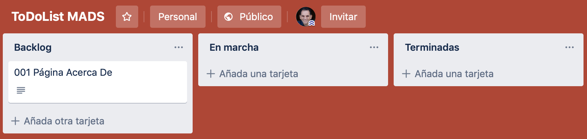

Añade la descripción de la característica **Página _Acerca de_**:

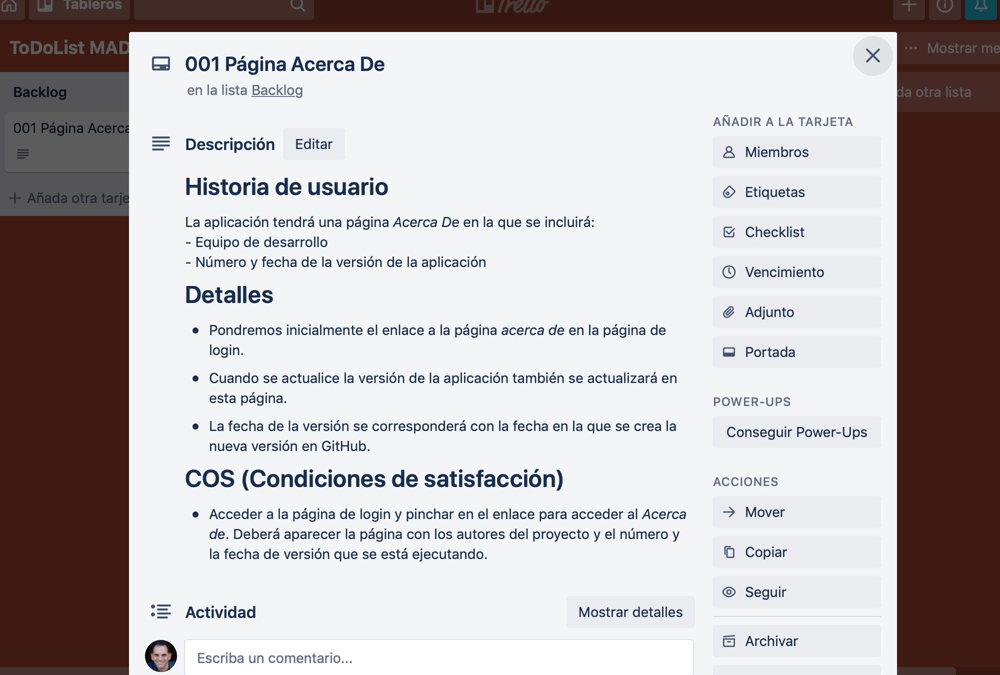

Cuando empecemos a trabajar en la historia de usuario moveremos la
tarjeta a _En marcha_ y cuando la hayamos terminado de testear e
integrar en la rama principal la moveremos a _Terminadas_.

#### Tablero de GitHub ####

Configura el tablero de GitHub, poniendo como nombre `ToDoList` y
seleccionando como plantilla `Automated kanban`. Elimina las tarjetas
en la columna `To do` y añade la columna `In pull request` entre `In
progress` y `Done`.


En las columnas deberán aparecer los _issues_ y _pull requests_ del
proyecto. GitHub permite automatizar el movimiento de las tarjetas de
una columna a otra. A continuación mostramos la configuración que
usaremos:

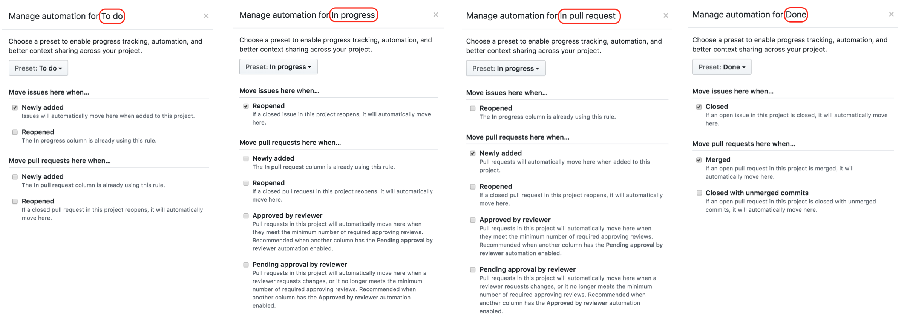

Deberemos mover manualmente las tarjetas en algún caso, porque GitHub
no podrá detectar las condiciones. En resumen, las condiciones de las
fichas que habrá en cada columna son las siguientes:

- Columna `To do`: Nuevos _issues_ añadidos al proyecto. Cuando
  añadimos el proyecto al _issue_ (en la página del _issue_) GitHub
  lo coloca automáticamente en esta columna.
- Columna `In progress`: _Issues_ que se han comenzado a implementar
  (se ha creado una rama su desarrollo). Manual.
- Columna `In pull request`: _Pull request_ creados. Cuando añadimos
  el proyecto al _pull request_ (en la página del _pull request_)
  GitHub lo coloca automáticamente en esta columna. **Archivaremos el
  _issue_** implementado por el _pull request_ manualmente.
- Columna `Done`: _Pull requests_ cerrados. GitHub lo detecta automáticamente.

#### Issues ####

Añade las etiquetas que vamos a usar inicialmente.

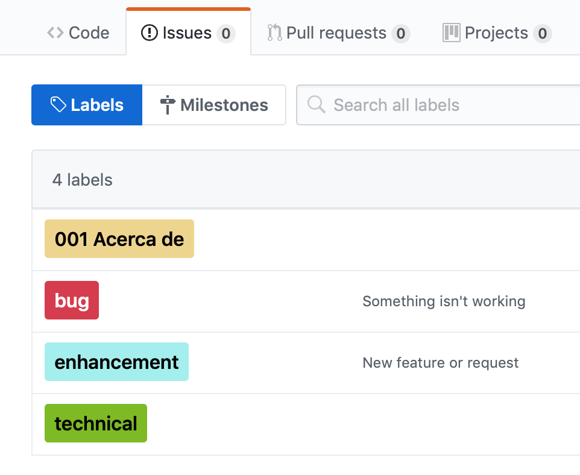

Crea el primer _issue_, correspondiente a la _feature_ a desarrollar
**Página _Acerca de_**. Crea el _milestone_ 1.0.1. y añade el issue a
él.

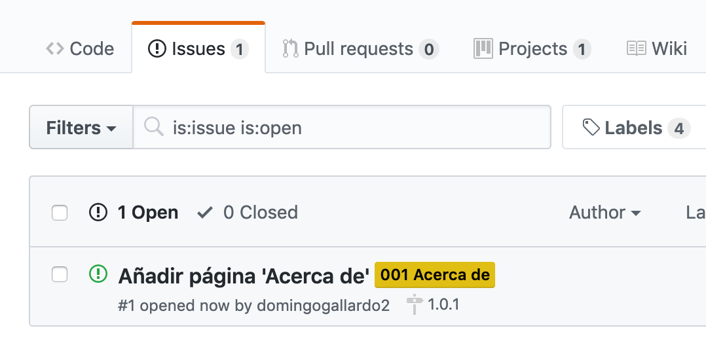

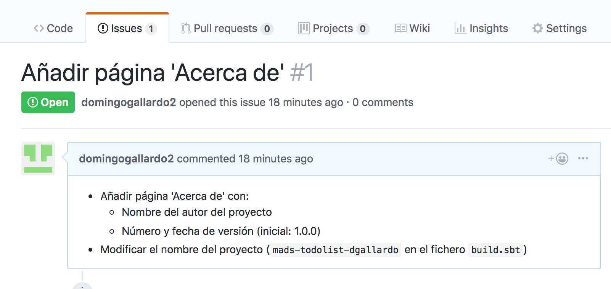

Añade el _issue_ al proyecto (desde la página del _issue_) y
automáticamente se añadirá en la columna `To do`.


#### Desarrollo ####

Para desarrollar el _issue_ abriremos una rama en Git, realizaremos
commits sobre ella hasta estar terminado y después crearemos un _pull
request_ en GitHub para realizar la integración con la rama `master`.

Mueve en el tablero la tarjeta con el _issue_ a la columna `In
progress`.


Empezamos el desarrollo importando el proyecto en IntelliJ y abriendo
un terminal para trabajar con Git:

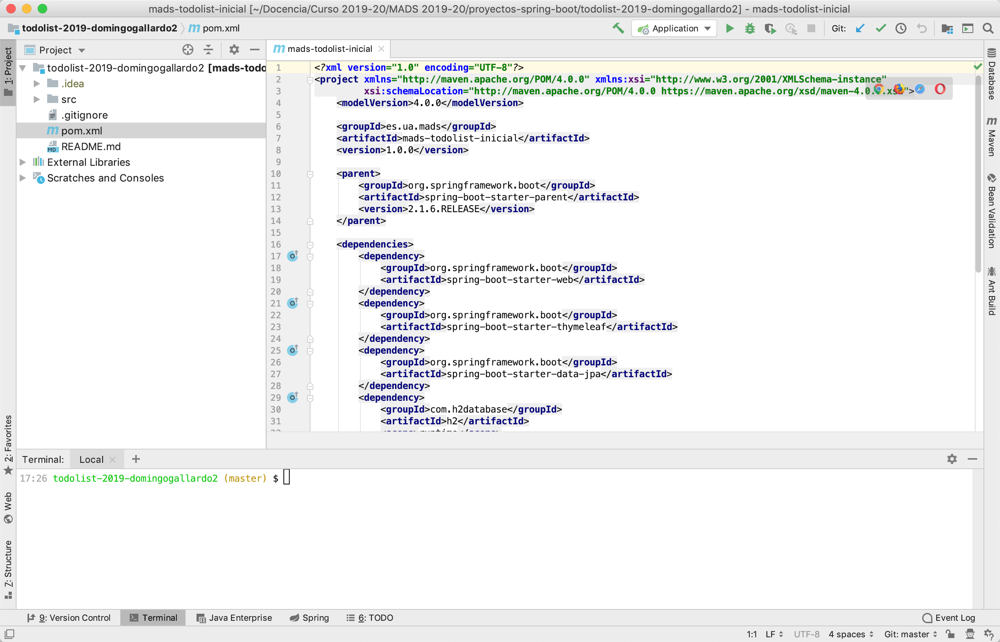

En el terminal escribimos los comandos para crear la rama en la que
desarrollaremos la _feature_ y subirla:

```text
(master) $ git checkout -b acerca-de
(acerca-de) $ git push -u origin acerca-de
```

##### Primer commit #####

Hacemos un primer commit.

Cambia en `pom.xml` el nombre del proyecto a `mads-todolist-<tu-nombre>` y
la versión a `1.0.1-SNAPSHOT`. El sufijo `SNAPSHOT` indica _en
desarrollo_. Cuando hagamos el _release_ de la versión 1.0.1
eliminaremos el sufijo.

Realiza el commit y súbelo a GitHub:
   
```text
(acerca-de) $ git status (comprobamos los ficheros que han cambiado)
(acerca-de) $ git add pom.xml
(acerca-de) $ git status (comprobamos que está listo para añadirse en el commit)
(acerca-de) $ git commit -m "Cambiado el nombre del proyecto y empezamos versión 1.0.1"
(acerca-de) $ git push
```

Consulta en GitHub que el _commit_ se ha subido en GitHub:

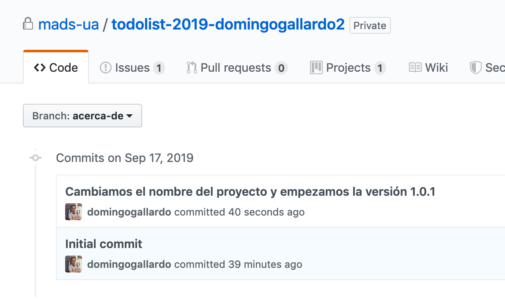
   
De esta forma habrás comprobado que tienes permiso de escritura en
el repositorio y que ya puedes comenzar a realizar la práctica.
   
##### Segundo commit #####

En el segundo commit incluiremos el desarrollo de los elementos
necesarios para la página _acerca de_:

- Acción en controller
- Vista

Añade los siguientes ficheros:

**Controller `HomeController.java`:

```java
package madstodolist.controller;

import org.springframework.stereotype.Controller;
import org.springframework.ui.Model;
import org.springframework.web.bind.annotation.GetMapping;

@Controller
public class HomeController {

    @GetMapping("/")
    public String home() {
        return "redirect:/login";
    }

    @GetMapping("/about")
    public String loginForm(Model model) {
        return "about";
    }

}
```

**Vista `about.html`**:

```html
<!DOCTYPE html>
<html xmlns:th="http://www.thymeleaf.org">

<head th:replace="fragments :: head (titulo='Login')"></head>

<body>
<div class="container-fluid">
    <div class="container-fluid">
        <h1>ToDo List</h1>
        <ul>
            <li>Desarrollada por Domingo Gallardo</li>
            <li>Versión 1.0.0 (en desarrollo)</li>
            <li>Fecha de release: pendiente de release</li>
        </ul>
    </div>

</div>

<div th:replace="fragments::javascript"/>

</body>
</html>
```

Prueba la página accediendo a la url <http://localhost:9000/about>.


Por último, confirma el commit en la rama y súbelo a GitHub. En el
panel `Git`:

```text
(acerca-de) $ git add .
(acerca-de) $ git status (comprueba que se han añadido los ficheros)
(acerca-de) $ git commit -m "Añadida vista y controller 'about'"
(acerca-de) $ git push
```


##### Tercer commit #####

En el tercer commit pondremos un enlace a la página _acerca de_ en la página de
login de la aplicación.

Realiza el siguiente cambio:

**Fichero `formLogin.html`**:

```diff
                         <a class="btn btn-link" href="/registro">Ir a registro</a>
+                        <a class="btn btn-link" href="/about">Acerca de</a>
+                    </div>
             </form>
```

Prueba que funciona correctamente, haz el commit y súbelo a GitHub:

```text
(acerca-de) $ git commit -am "Añadido enlace a página 'about' en página 'login'"
(acerca-de) $ git push
```


#### Pull request ####

Una vez terminada la implementación de la _feature_ en la rama,
creamos un _pull request_ en GitHub para indicar que estamos listos
para mezclar la rama con la _feature_ con la rama principal de
desarrollo (_master_).

Más adelante añadiremos al _pull request_ una comprobación automática
de las pruebas y una revisión de código por parte de compañeros del
equipo. Por ahora haremos nosotros ambas tareas.

Vamos a verlo paso a paso.

Empezamos por mezclar la rama de forma local con `master`, antes de
hacer el _pull request_ en GitHub, para probar que no se ha roto nada
(todos los tests deben seguir pasando) y que los tests que hemos
añadido también funcionan correctamente (en este caso no hemos añadido
ninguno).

En el terminal:

```text
(acerca-de) $ git checkout master
(master) $ git merge acerca-de 
    Fast-forward
      pom.xml                                                   |  4 ++--
      src/main/java/madstodolist/controller/HomeController.java | 20 ++++++++++++++++++++
      src/main/resources/templates/about.html                   | 22 ++++++++++++++++++++++
      src/main/resources/templates/formLogin.html               |  2 ++
      4 files changed, 46 insertions(+), 2 deletions(-)
```

Lanzamos los tests (lo podemos hacer en el terminal o en IntelliJ):

```text
(master) $ mvn test
...
[INFO] 
[INFO] Tests run: 31, Failures: 0, Errors: 0, Skipped: 0
[INFO] 
[INFO] ------------------------------------------------------------------------
[INFO] BUILD SUCCESS
[INFO] ------------------------------------------------------------------------
[INFO] Total time:  21.879 s
```


Una vez que hemos comprobado que todo funciona bien, deshacemos el
merge que acabamos de realizar en la rama `master`, ya que
actualizaremos después la rama con el resultado del _pull request_ en
GitHub:

```text
(master) $ git log --oneline (muestra la historia de commits y las ramas)
(master) $ git reset --hard origin/master
    HEAD is now at 51ebf62 Initial commit
(master) $ git checkout acerca-de 
    Switched to branch 'acerca-de'
    Your branch is up to date with 'origin/acerca-de'.
```

Ya podemos crear el _pull request_ en GitHub. 

Accede a la rama y comprueba que están todos los cambios pulsando
`Compare`. 


Aparecerá la siguiente página, con la información de los cambios que
introducen todos los commits de la rama:

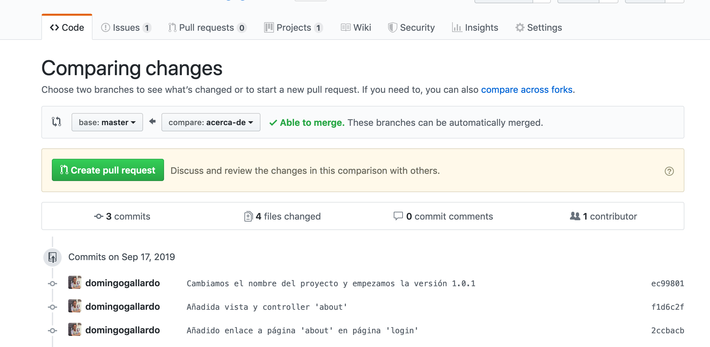

Pulsa después el botón _Create pull request_ para crear el _pull request_.

Introduce el nombre del _pull request_, el comentario, el _milestone_,
la etiqueta y el proyecto. En el comentario escribe

```text
Closes #1
```

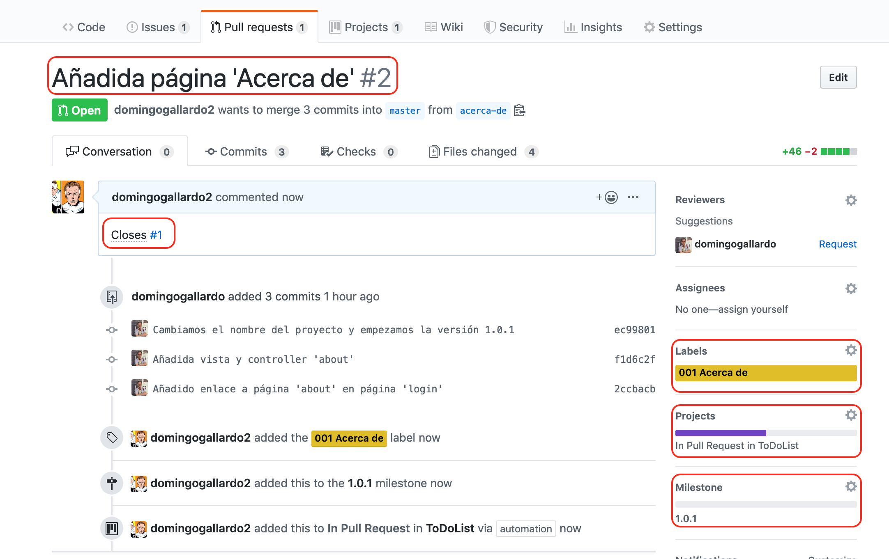

De esta forma, cuando se cierre el _pull request_ se cerrará
automáticamente el _issue_. El número `#1` lo convierte GitHub en un
enlace al _issue_ correspondiente. De esta forma podemos examinar el
_issue_ resuelto por el PR.

En el proyecto el _pull request_ se colocará automáticamente la
columna `In pull request`. Entra en el proyecto y archiva la tarjeta
con el _issue_, ya que la actividad de desarrollar la _feature_ queda
representada por el _pull request_.

En este momento se debería hacer una revisión del código del pull
request y comprobar de forma automática que la integración con
_master_ no introduce errores en los tests. Lo haremos en siguientes
prácticas.

GitHub informa de que no hay conflictos con la rama `master` y que es
posible hacer el merge. Pulsa el botón de `Merge` y confírmalo. 

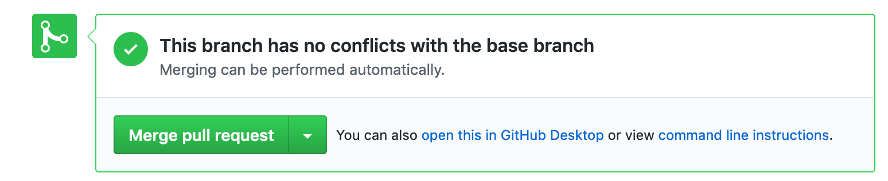

Borra la rama en GitHub, pulsando el botón correspondiente.

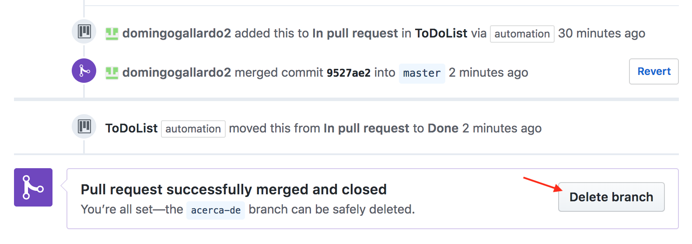

Este _merge_ lo has hecho en GitHub. Debes por último integrarlo en tu
repositorio local. En el terminal:

```text
(acerca-de) $ git checkout master
(master) $ git pull (bajamos los cambios)
(master) $ git branch -d acerca-de (borramos la rama)
(master) $ git remote prune origin (borramos referencias a rama remota)
(master) $ git log --oneline --graph --all
    *   9527ae2 (HEAD -> master, origin/master, origin/HEAD) Merge pull request #2 from mads-ua-18/acerca-de
    |\  
    | * 672c28f Añadido enlace a página 'about' en página 'login'
    | * 3fdfb83 Añadida ruta, vista y controller 'about'
    | * a332017 Cambiado el nombre del proyecto y empezamos versión 1.0.0
    |/  
    * 6767016 Commit inicial
```

Comprobamos también la historia de _commits_ en GitHub. Aparecerá el
_commit_ de _merge_ introducido por el _pull request_.

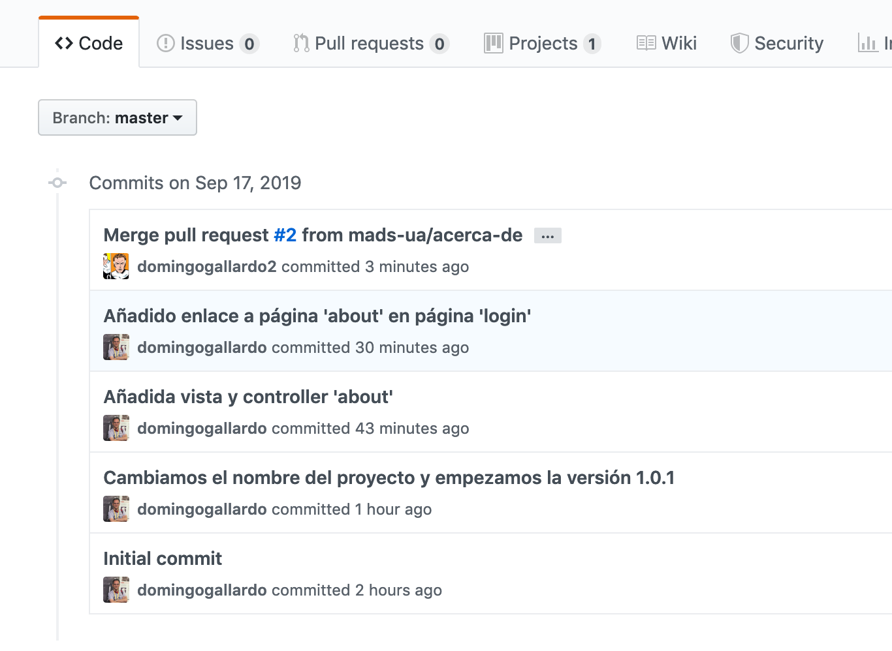

De esta forma hemos cerrado el PR e integrado su código en la rama
principal de desarrollo. En el tablero de proyecto debe haber cambiado
la tarjeta con el PR a la columna `Done`.

#### Actualizamos tablero Trello ####

Actualizamos el tablero Trello moviendo la historia de usuario a la
columna _Terminadas_.

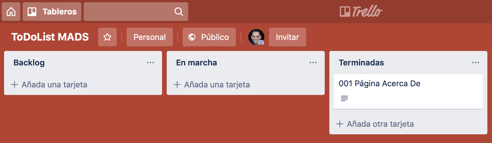


#### Versión 1.0.1 ####

Por último creamos el _release_ 1.0.1. Haremos un commit directamente
sobre la rama `master` (más adelante explicaremos una forma más
elaborada de hacer un _release_, cuando expliquemos el flujo de
trabajo de GitFlow).


Crea un commit con la confirmación del número de versión y fecha en
los ficheros `pom.xml` y `about.html`

**Fichero `pom.xml`**:

```diff
     <groupId>es.ua.mads</groupId>
     <artifactId>mads-todolist-dgallardo</artifactId>
-    <version>1.0.1-SNAPSHOT</version>
+    <version>1.0.1</version>
 
```

**Fichero `about.html`**:

```diff
    <h1>ToDo List</h1>
        <ul>
         <h1>ToDo List</h1>
         <ul>
             <li>Desarrollada por Domingo Gallardo</li>
-            <li>Versión 1.0.1 (en desarrollo)</li>
-            <li>Fecha de release: pendiente de release</li>
+            <li>Versión 1.0.1</li>
+            <li>Fecha de release: 17/9/2018</li>
         </ul>
}
```

Añadimos el commit y lo subimos a GitHub

```text
(master) $ git add .
(master) $ git commit -m "Cambio de versión a 1.0.1"
(master) $ git push
```

Y, por último, creamos la versión 1.0.1 en GitHub pulsando en el
enlace `release` en la página principal (pestaña `Code`).


Un _release_ en GitHub se guarda como una una etiqueta Git, junto con
información asociada. Se suelen indicar las nuevas _features_ añadidas
en el _release_ mediante enlaces a los _pull requests_
añadidos. También añadiremos enlaces a la página de la Wiki en la que
se describe la característica.


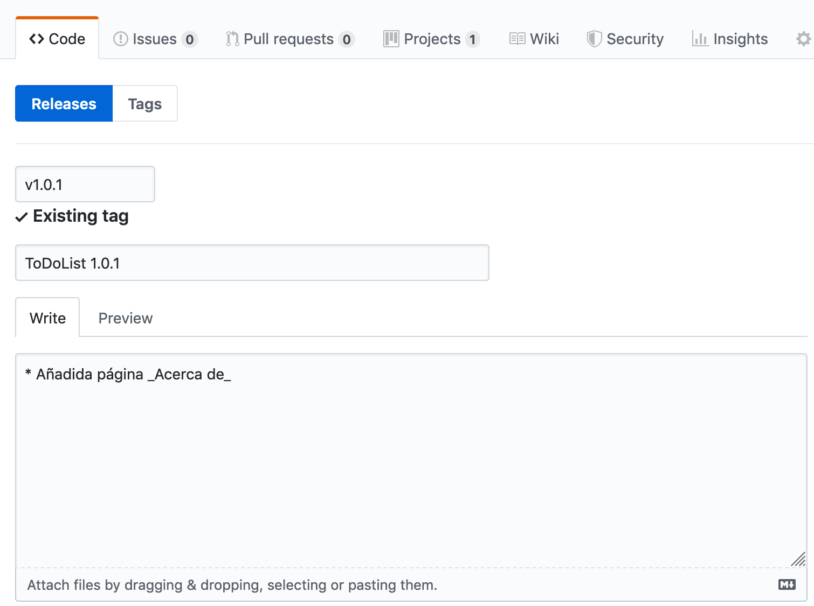

El resultado será:


### Resto de la práctica (versión 1.1.0) ###

El resto de la práctica consistirá en desarrollar la versión 1.1.0,
usando la misma metodología vista anteriormente.

Deberás desarrollar tres características nuevas obligatorias y 3 opcionales:

- (Obligatoria) Barra de menú
- (Obligatoria) Página de listado de usuarios
- (Obligatoria) Página de descripción de un usuario
- (Opcional) Usuario administrador 
- (Opcional) Protección listado y descripción de usuario
- (Opcional) Administrador puede bloquear el acceso a usuarios

Deberás implementar cada característica siguiendo la metodología que
hemos usado anteriormente. En la implementación, deberás añadir el
código necesario en cada una de las capas de la aplicación:

- Capa de presentación (vista)
- Nuevo método en la capa de controller
- Métodos necesarios en la capa de servicio y de repository
  
En cada característica deberás también incluir **tests** que prueben los
nuevos métodos añadidos en la capa de servicio. En alguna de las
características deberás también realizar algún test de la vista.

#### Barra de menú ####

La aplicación deberá tener una barra de menú común a todas sus
páginas, menos en las páginas de login y registro.

- La barra de menú estará situada en la parte superior de la página y
será un [Navbar](https://getbootstrap.com/docs/4.0/components/navbar/).
de Bootstrap.
- La barra de menú tendrá como mínimo los siguientes elementos (de
izquierda a derecha):
   - `ToDoList`: enlace a la página _acerca de_.
   - `Tareas`: enlace a la página de tareas, con la lista de tareas
  pendientes del usuario.
   - _Nombre usuario_: A la derecha de la página. Desplegable con las opciones:
      - `Cuenta`: Futura página para gestionar la cuenta
      - `Cerrar sesión <nombre usuario>`: cierra la sesión y lleva a la
     página de login.

#### Listado de usuarios ####

- Si se introduce la URL `/usuarios` aparecerá un listado de los
  usuarios registrados (identificador y correo electrónico).

#### Descripción de usuario ####

- En la lista de usuarios habrá un enlace para acceder a su descripción.
- En la descripción de un usuario aparecerán todos sus datos, menos la contraseña.
- La ruta para obtener la descripción de un usuario será
`/usuarios/:id`. 

#### Usuario administrador (opcional) ####

Al realizar el registro será posible darse de alta como usuario
administrador.

- Para darse de alta como administrador se deberá activar un _check
  box_ en la página de registro.
- Sólo puede haber un administrador. Si ya existe un administrador, no
  debe aparecer el _check box_ en la página de registro.
- El usuario administrador accederá directamente a la lista de usuarios.

#### Protección de listado de usuario y descripción de usuario (opcional) ####

- Proteger las páginas con el listado de usuarios y la descripción de
usuario para que sólo las pueda consultar el administrador.

#### Bloqueo de usuarios por usuario administrador (opcional) ####

- Añadir en el listado de usuarios un botón para que el
  administrador pueda bloquear o habilitar el acceso a cada uno de los
  usuarios. 
- Si el usuario tiene bloqueado el acceso cuando intente logearse
  aparecerá un mensaje de error indicándoselo.

## Entrega y evaluación ##

- La práctica tiene una duración de 4 semanas y debe estar terminada
  el martes 15 de octubre.
- La parte obligatoria puntúa sobre 6 y la opcional sobre 4 puntos.
- La calificación de la práctica tiene un peso de un 10% en la nota
  final de la asignatura.
- Para realizar la entrega se debe subir a Moodle un ZIP que contenga
  todo el proyecto, incluyendo el directorio `.git` que contiene la
  historia Git. Para ello comprime tu directorio local del proyecto
  **después de haber hecho un `mvn clean`** para eliminar el
  directorio `target` que contiene los binarios compilados. Debes
  dejar también en Moodle la URL del repositorio en GitHub.

Para la evaluación se tendrá en cuenta:

- Desarrollo continuo (los _commits_ deben realizarse a lo largo de
  las 4 semanas y no dejar todo para la última semana).
- Correcto desarrollo de la metodología.
- Diseño e implementación del código y de los tests de las
  características desarrolladas.

