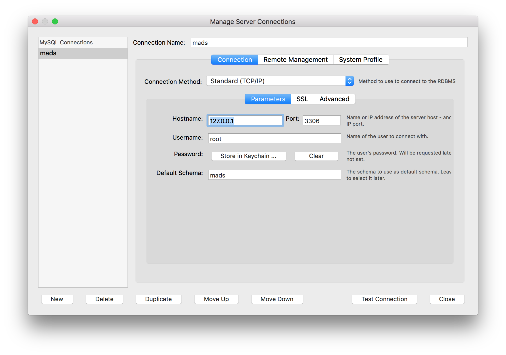
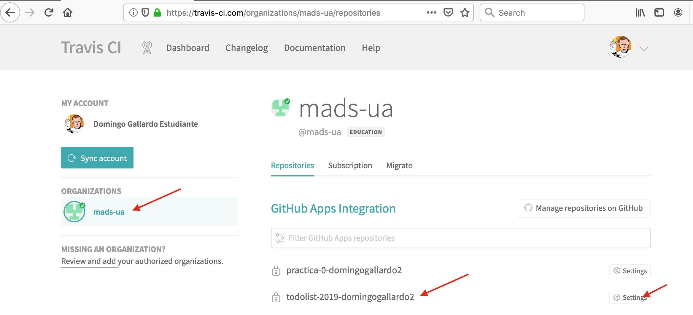
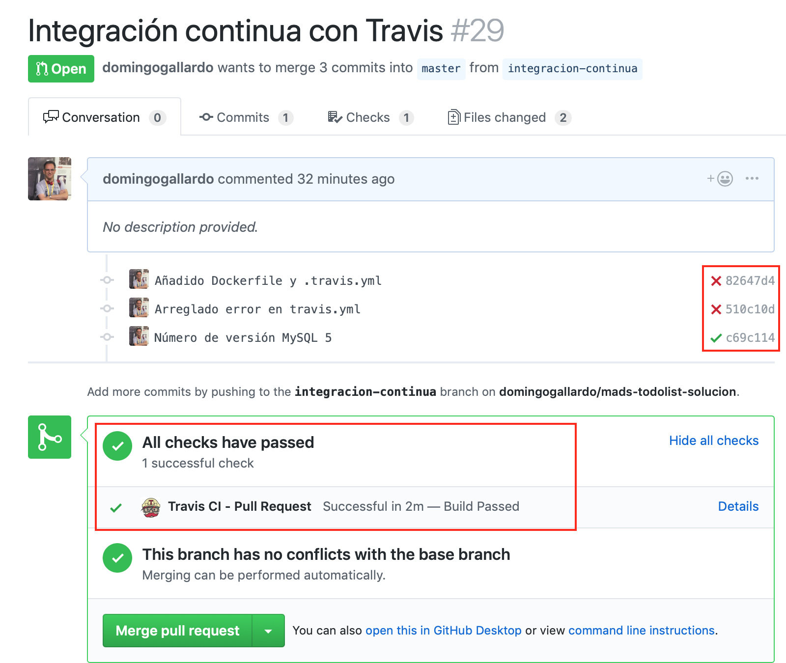
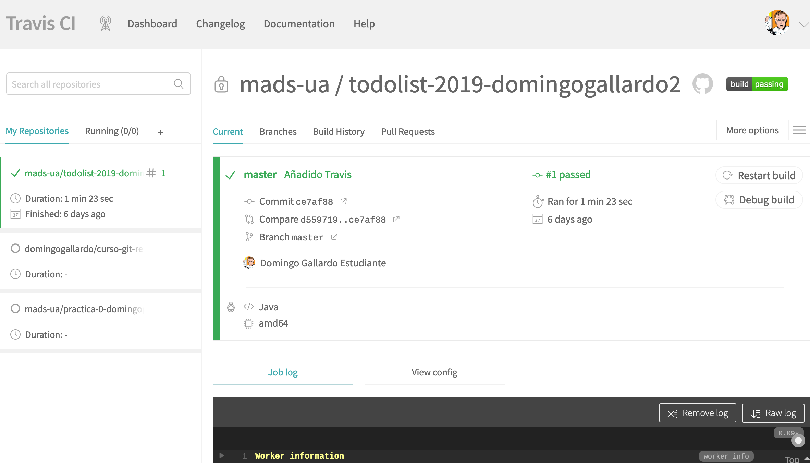

# Práctica 2: Integración con Travis y TDD

En esta práctica 2 de la asignatura realizaremos dos tareas principales:

- Configuraremos un sistema de integración continua conectando el
  repositorio de GitHub con Travis. En este sistema se lanzarán los
  tests automáticamente en cada _pull request_ sobre la base de datos
  MySQL.
- Añadiremos nuevas funcionalidades usando la práctica XP de TDD
  (_Test Driven Design_).

!!! Important "Importante"
    Lee con cuidado todo el enunciado y dedica especial atención a los
    apartados con el título `Pasos a seguir en la práctica`. Ahí están
    especificadas las acciones que debes realizar en la práctica.

La duración de la práctica es de 3 semanas y la fecha límita de
entrega es el día 5 de noviembre.

## Refactorización de la relación uno-a-muchos ##

Antes de comenzar la práctica hay que hacer una refactorización en la
relación una-a-muchos entre usuario y tareas: pasar la lista de tareas
de un usuario de `List` a `Set`. 

A diferencias del tipo `List`, el `Set` no permite elementos repetidos
y es más conveniente definir las relaciones JPA de esta forma.

### Pasos a seguir en la práctica ###

- Realiza un commit en `master` (no hace falta que hagas un pull
  request) con los cambios que aparecen este [commit](https://github.com/domingogallardo/mads-todolist-inicial/commit/498442afc689e81cc02d5022cfa6a85722a56bc7).
- Lanza los tests para comprobar que todo funciona correctamente y
  sube el commit a GitHub.

## Configuración de la aplicación ##

Hasta ahora hemos trabajado con la aplicación en una configuración
local con nuestro ordenador de desarrollo trabajando sobre una base de
datos H2 en memoria. Pero el objetivo final es poner la aplicación en
producción, en un servidor en Internet y usando una base de datos
MySQL de producción. 

En esta práctica vamos a configurar un perfil de la aplicación para
poder lanzar los tests y ejecutar la aplicación usando una base de
datos MySQL. En la práctica 3 veremos cómo definir un perfil para
trabajar con una base de datos de producción.

!!! Note "Nota"
    La **base de datos de producción** es la que mantiene los datos
    introducidos por los usuarios de la misma. Hay que prestar una
    atención especial a esta base de datos y definir políticas de
    respaldo y de control de cambios para evitar que se produzca
    cualquier pérdida de información. Veremos en la práctica 3 que una
    de las cuestiones que hay que asegurar es que la aplicación no
    puede modificar el esquema de datos de esta base de datos. Habrá
    que definir un flujo de trabajo para implementar en el esquema de
    datos de la base de datos un cambio en el modelo de datos de la
    aplicación.

Vamos a ver en este apartado cómo definir distintas configuraciones de
ejecución de la aplicación, utilizando los denominados
_perfiles_. Definiremos, además del perfil base, un perfil adicional
para lanzar la aplicación y los tests usando la base de datos MySQL.

La configuración de tests con base de datos MySQL la utilizaremos para
ejecutar los tests de integración en el proceso de integración
continua de Travis.

### Ficheros de configuración de la aplicación ###

Ya hemos comentado que la configuración de la aplicación se define en
el fichero `application.properties`. Ahí se definen distintas
propiedades de la ejecución de la aplicación que se pueden modificar
(puerto en el que se lanza la aplicación, base de datos con la que
conectarse, etc.). 

Tenemos dos ficheros `application.properties`: uno en el directorio
`src/main/resources` que define la configuración de ejecución y otro
en el directorio `src/test/resources` que define la configuración que
se carga cuando se lanzan los tests.

Spring Boot permite definir ficheros de configuración adicionales que
pueden sobreescribir las propiedades definidas en el fichero de
configuración por defecto. El nombre de estos ficheros de
configuración debe ser `application-xxx.properties` donde `xxx` define el
nombre del perfil. En nuestro caso definiremos los ficheros
`application-mysql.properties` (uno en el directorio `main` y otro en
`test`) para definir las configuraciones de ejecución y de test con
MySQL.


### Pasos a seguir en la práctica ###

- Instala [Docker
  Desktop](https://www.docker.com/products/docker-desktop). 
  
  Docker es un software de virtualización que utiliza el propio
  sistema operativo compartimentado y permite gestionar _contenedores_
  (similares a las máquinas virtuales) de forma mucho menos pesada y
  rápida que con sistemas de virtualización tradicionales como
  VirtualBox.
  
  Lo vamos a utilizar para **lanzar el servidor MySQL de base de
  datos** y también para la futura práctica 3.
  
  **Si tienes Windows, Docker no es compatible con VirtualBox**. Si
  quieres usar ambos programas puedes usar una versión limitada de
  Docker llamada [Docker
  Toolbox](https://docs.docker.com/toolbox/toolbox_install_windows/).


  **Si tienes Ubuntu** debes instalar Docker usando `apt`. Aquí tienes
  un tutorial para [instalar Docker en Ubuntu
  18.04](https://www.digitalocean.com/community/tutorials/how-to-install-and-use-docker-on-ubuntu-18-04).

- Crea un nuevo _issue_ llamado `Añadir perfiles y permitir trabajar
  con MySQL`. Crea una rama nueva (llámala `perfiles`, por ejemplo) y
  abre un pull request. 
  
    ```
    $ (master) git checkout -b perfiles
    $ (perfiles) git push -u origin perfiles
    ```
    

- Copia el siguiente fichero en `src/main/resources/application-mysql.properties`:

    ```
    spring.datasource.url=jdbc:mysql://localhost:3306/mads
    spring.datasource.username=root
    spring.datasource.password=
    spring.jpa.properties.hibernate.dialect = org.hibernate.dialect.MySQL5InnoDBDialect
    spring.jpa.hibernate.ddl-auto=update
    spring.datasource.initialization-mode=never
    ```

   En este fichero de configuración se define la URL de conexión a la
   base de datos MySQL, su usuario (`root`) y contraseña (vacía) y el
   dialecto que se va a utilizar para trabajar desde JPA con la base
   de datos (`org.hibernate.dialect.MySQL5InnoDBDialect`). Además se indica
   que no se debe cargar ningún fichero de datos inicial. El esquema
   de la base de datos se actualizará si hay cambios en las entidades
   de la aplicación, y los datos se mantendrán en la base de datos.
    
- Copia el siguiente fichero en `src/test/resources/application-mysql.properties`:
    
    ```
    spring.datasource.url=jdbc:mysql://localhost:3306/mads_test
    spring.datasource.username=root
    spring.datasource.password=
    spring.jpa.properties.hibernate.dialect = org.hibernate.dialect.MySQL5InnoDBDialect
    spring.jpa.hibernate.ddl-auto=create
    ```
     
   La diferencia más importante es el valor de
   `spring.jpa.hibernate.ddl-auto`, que es `create`. De esta forma la
   base de datos se inicializa antes de cargar los datos de los tests
   y de ejecutarlos. También usamos una base de datos distinta
   (`mads_test`) para no sobreescribir la base de datos definida en el
   perfil de ejecución.

- Añade la siguiente dependencia en el fichero `pom.xml` para que se
  descargue el driver `mysql-connector-java` y poder utilizar una base
  de datos MySQL en la aplicación:

    Fichero `pom.xml`:

    ```diff
                <artifactId>h2</artifactId>
                 <scope>runtime</scope>
             </dependency>
    +         <dependency>
    +             <groupId>mysql</groupId>
    +             <artifactId>mysql-connector-java</artifactId>
    +         </dependency>
             <dependency>
                 <groupId>org.springframework.boot</groupId>
    ```


- Para lanzar la aplicación necesitarás un servidor MySQL en el puerto
  3306 con el usuario `root` sin contraseña. Es muy sencillo
  descargarlo y ejecutarlo si tienes instalado Docker. Ejecuta desde
  el terminal:

    ```
    $ docker run -d -p 3306:3306 --name mysql-develop -e MYSQL_ALLOW_EMPTY_PASSWORD=yes -e MYSQL_DATABASE=mads mysql:5 
    ```

    Docker se descarga la imagen `mysql:5` y lanza el contenedor (una
    instancia en marcha de una imagen) conectado al puerto 3306 y
    sobre la base de datos `mads`. Le da como nombre `mysql-develop`.
   
    Puedes ejecutar los siguientes comandos de Docker:
    
      ```
      $ docker container ls -a (comprueba todos los contenedores en marcha)
      $ docker container stop <nombre o id de contenedor> (para un contenedor)
      $ docker container rm nombre o id de contenedor> (elimina un contenedor)
      ```

- Arranca la aplicación con el siguiente comando:

    ```
    $ mvn spring-boot:run -Dspring-boot.run.profiles=mysql
    ```

    Se cargarán las preferencias de
    `src/main/resource/application.profile` y
    `src/main/resource/application-mysql.profile`.

    Prueba a introducir datos en la aplicación y comprueba que se
    están guardando en la base de datos con _MySQL Workbench_ o alguna
    aplicación similar.

    

- Cierra la aplicación y vuelve a abrirla. Comprueba que los datos que
  se han creado en la ejecución anterior siguen estando.

- Cierra la aplicación. Paramos el contenedor con la base de datos de
  desarrollo haciendo `docker container stop`:

    ```
    $ docker container ls -a 
    CONTAINER ID        IMAGE     ...    NAME
    520fee61d51e        mysql:5   ...    mysql-develop
    $ docker container stop mysql-develop
    ```

- Lanzamos ahora otro contenedor con la base de datos de test:

    ```
    $ docker run -d -p 3306:3306 --name mysql-test -e MYSQL_ALLOW_EMPTY_PASSWORD=yes -e MYSQL_DATABASE=mads_test mysql:5 
    ```

    Y lanzamos los tests sobre la base de datos MySQL con el siguiente comando:
  
      ```
      $ mvn -DargLine="-Dspring.profiles.active=mysql" test
      ```
  
    Comprobamos con _MySQL Workbench_ que los datos que hay en
    la base de datos corresponden con los introducidos en el fichero
    `datos-test.sql` que se carga antes de ejecutar los tests.

- Podemos parar y arrancar el contenedor MySQL que necesitemos con
  `docker container stop` y `docker container start`. Por ejemplo,
  para parar el contenedor MySQL con la base de datos de test y
  arrancar el contenedor con la base de datos de desarrollo:
  
    ```
    $ docker container ls -a 
    $ docker container stop mysql-test
    $ docker container start mysql-develop
    ```

- Realiza un commit con los cambios, súbelos a la rama y cierra el
  pull request para integrarlo en `master`:
  
      ```
      $ (perfiles) git add .
      $ (perfiles) git commit -m "Añadidos perfiles para trabajar con MySQL"
      $ (perfiles) git push
      // Mezclamos el Pull Request en GitHub
      $ (perfiles) git checkout master
      $ (master) git pull
      $ (master) git branch -d perfiles
      $ (master) git remote prune origin
      ```


## Integración continua con Travis ##

[Travis-ci.com](https://travis-ci.com/) es un servicio que permite realizar
integración continua on-line, sin necesidad de configurar un servidor
propio de integración continua.

Es un servicio de pago, pero es gratuito para los repositorios
abiertos (_open source_) y para las cuentas educativas de GitHub. La
organización de GitHub `mads-ua` también está autorizada como
organización educativa, por lo que todos los repositorios creados
dentro de esa organización podrán trabajar con Travis.

Puedes consultar el funcionamiento de Travis leyendo su documentación,
comenzando por la página [Getting
started](https://docs.travis-ci.com/user/getting-started/).

En la práctica vamos a configurar Travis para que todos los _pull
requests_ deban pasar los tests de integración (conectándose a la base
de datos MySQL) antes de realizar el _merge_ con `master`. 

### Conexión con GitHub ###

En GitHub está configurada la conexión con Travis para todos los
proyectos en la organización `mads-ua`. 

En tu cuenta de Travis, una vez logeado, podrás acceder a tu
repositorio en la organización `mads-ua` y comprobar su
configuración. Verás una pantalla como la siguiente:




### Tests en los pull requests ###

Usando Travis es posible configurar el repositorio de GitHub para que todos los
_pull requests_ deban pasar los tests de integración en el servicio.

En la siguiente imagen vemos el aspecto en GitHub de un _pull request_
estando activa la integración con Travis. Una vez abierto el PR,
Travis comprueba si la integración de master con la rama pasa los
tests definidos en el fichero de configuración. Sólo si los tests
pasan es posible realizar el _merge_ del PR en master.




### El fichero de configuración  ###

La configuración de Travis se realiza con el fichero `.travis.yml` en
la raíz del repositorio.

El fichero `.travis.yml` para mi repositorio solución de la práctica
es el siguiente:

**Fichero `.travis.yml`**

```text
language: java

branches:
  only:
    - master

services:
  - mysql

before_install:
  - mysql -e 'CREATE DATABASE mads_test;'

script: ./mvnw -DargLine="-Dspring.profiles.active=mysql" test
```

Puntos interesantes a destacar:

- Se puede espeficar la rama en la que se activa la integración
  continua en el apartado `branches`. En nuestro caso es la rama
  `master`. En cualquier commit o _pull request_ que se haga sobre esa
  rama se lanzará la integración continua.
- El apartado `services` define los servicios necesarios para que se
  ejecute el script de integración. En nuestro caso `mysql`. Cuando se
  lance travis se lanzará un servidor de MySQL en el puerto por
  defecto (3306) y con usuario `root` sin contraseña.
- En el apartado `before_install` se definen los comandos a realizar
  antes de ejecutar el _script_ con los tests. En nuestro caso
  se ejecuta un comando sobre el servicio `mysql` para crear la base
  de datos `mads_test` vacía.
- En el apartado `script` se definen los comandos a realizar para
  lanzar los tests. En nuestro caso lanzamos el comando `mvnw` que
  lanza el Maven instalado en el repositorio (ver punto siguiente).
  

### Builds en Travis ###

En Travis tenemos toda la información de los _builds_. Es posible
visualizarla una vez ha terminado el _build_ o mientras se está
ejecutando. Allí podremos ver el detalle de la ejecución de los tests
y consultar la salida de los mismos para comprobar su 



!!! Note "Nota"
    Sólo es posible ejecutar un _build_ simultáneo en la organización
    `mads-ua`. Cuando hay otro _build_ ejecutándose los nuevos
    _builds_ que se lancen quedarán encolados por fecha de inicio.


### Maven Wrapper ###

[Maven Wrapper](https://github.com/takari/maven-wrapper) es una forma
muy sencilla de distribuir un proyecto que use Maven para que se pueda
construir en un sistema operativo en el que Maven no esté
instalado. 

En el propio repositorio se instala una versión de Maven que se puede
lanzar desde cualquier sistema operativo.

Lo utilizaremos para no tener que instalar Maven en Travis. Así
podremos lanzar los tests en Travis con un único comando que se
ejecuta usando el Maven del propio proyecto.

```
./mvnw -DargLine="-Dspring.profiles.active=mysql" test
```


### Pasos a seguir en la práctica ###

- Crea un _issue_ llamado `Integración continua con Travis`. Abre una
  rama `travis`, súbela a GitHub y abre un pull request.

- Instala Maven Wrapper en tu repositorio:

    ```
    $ mvn -N io.takari:maven:wrapper
    ```

    Con este comando se instala Maven en tu propio respositorio (en el
    directorio `.mvn`) y se instalan los comandos `mvnw` (para Linux)
    y `mvnw.cmd` (para Windows).

    **Si estás en Windows** deberás actualizar el permiso de ejecución
    del comando `mvnw` con la siguiente instrucción:
    
    ```
    $ git update-index --chmod=+x mvnw
    ```

    Prueba que funciona correctamente ejecutando los tests con el
    comando `./mvnw`:
    
    ```
    $ ./mvnw -DargLine="-Dspring.profiles.active=mysql" test
    ```
 
    Crea un commit y súbelo a GitHub.

- Añade el fichero `.travis.yml` en la raíz del repositorio. Haz otro
  commit y súbelo a GitHub.

- Date de alta en [Travis-ci.com](https://travis-ci.com) y conéctalo
  al repositorio de la práctica.

- **Comprueba que se pasan los tests en Travis** y que se marca como
  correcto el _pull request_. 
  
- Modifica un test para que falle y sube un nuevo commit. Comprueba
  que el commit aparece como erróneo en GitHub cuando el _build_ de
  Travis falla. Vuelve a realizar los cambios para corregirlos,
  vuelve a subir el commit y comprueba que el nuevo commit y el PR
  pasan correctamente.

- Cierra el _pull request_ con `master`. Se volverán a lanzar los
  tests en Travis y el commit aparecerá marcado como correcto. Baja
  los cambios al repositorio local y borra la rama.

    ```
    $ (travis) git checkout master
    $ (master) git pull
    $ (master) git branch -d travis
    $ (master) git remote prune origin
    ```


## TDD ##

En la segunda parte de la práctica desarrollaremos, usando TDD (_Test
Driven Design_), una nueva _feature_ de la aplicación: la posibilidad
de definir definir equipos a los que puedan pertenecer los usuarios.

Descomponemos la _feature_ en las siguientes historias de usuario.

- 008 Listado de equipos
- 009 Gestionar pertenencia al equipo
- 010 Gestión de equipos (opcional)

**008 Listado de equipos**: Como usuario podré consultar el listado de
los equipos existentes y los participantes en cada uno de ellos para
poder consultar la estructura de la empresa y los proyectos en marcha
y comprobar si estoy en los equipos correctos.

**009 Gestionar pertenencia al equipo**: Como usuario podré crear
nuevos equipos y añadirme y eliminarme de cualquiera de ellos para poder
participar y dejar de participar en ellos.

**010 Gestión de equipos (opcional)**: Como administrador podré
cambiar el nombre y eliminar los equipos para adaptarlos a los
proyectos y estructura de la empresa.

Vamos a hacer de forma guiada la primera historia y dejamos las
siguientes para que las hagas por tu cuenta.

### 008 Listado de equipos ###

La descripción de la historia de usuario es la siguiente:

```text
Listado de equipos

Como usuario podré consultar el listado de
los equipos existentes y los participantes en cada uno de ellos para
poder consultar la estructura de la empresa y los proyectos en marcha
y comprobar si estoy en los equipos correctos.

Detalles

    * En el menú aparcerá una opción `Equipos` que llevará a un
    listado con los nombres de todos los equipos existentes.
    * El listado de equipos estará ordenado por orden alfabético.
    * Pinchando en el nombre del equipo aparecerá un listado de todos
    los usuarios que lo componen.
    * Un usuario podrá pertenecer a más de un equipo.
```

Vamos a utilizar la técnica de TDD para construir la funcionalidad
**de abajo a arriba**. Comenzaremos con tests que construyan la capa
de modelo (clases de entidad y repository) y después pasaremos a tests
que construyan la capa de servicio.

Por último, una vez implementados los métodos de servicios necesarios,
deberás implementar (lo haremos sin tests) las vistas y
controllers. Las vistas y controllers los probaremos de forma manual,
sin tests automáticos.

!!! Important "Importante"

    Los controllers no deben implementar ningún código adicional, sólo
    llamar al método de servicio necesario. De esta forma nos
    aseguramos que todo el código importante para la funcionalidad está
    testeado y ha sido creado mediante TDD.

Recuerda que los pasos seguir la técnica de TDD:

- **Test**: Primero debes escribir el test.
- **Code**: Después debes escribir el código que hace pasar el test (**únicamente el código
necesario, no puedes escribir código de más**)
- **Refactor**: Y, si es necesario, realizar una refactorización del código (los
  tests deben seguir pasando después de la refactorización).

Deberás hacer **un commit por cada fase Test-Code**. Si haces
refactorización deberás hacerlo en otro commit adicional.


### Pasos a seguir en la práctica ###

- Crea la historia de usuario `008 Listado de equipos` en el tablero Trello.

- Crea los _issues_ correspondientes a esta historia:
    - Servicio y modelo listado de equipos.
    - Vista y controller listado de equipos.

- Crea una rama para desarrollar el primer _issue_ (llámala
  `servicio-equipos`, por ejemplo) y pásalo en el
  tablero a `In progress`.

Este primer _issue_ lo haremos de forma guiada usando TDD con los
tests que enumeraremos a continuación. El otro _issue_ lo deberás
implementar por ti mismo. 


#### Primer test - Entidad `Equipo` ####

El primer test es para crear la entidad `Equipo`. Por ahora sólo
creamos la clase Java, sin las anotaciones JPA. Un equipo

**Fichero `src/test/java/madstodolist/EquipoTest.java**:
```java
package madstodolist;

import madstodolist.model.Equipo;
import org.junit.Test;
import org.junit.runner.RunWith;
import org.springframework.boot.test.context.SpringBootTest;
import org.springframework.test.context.junit4.SpringRunner;

import static org.assertj.core.api.Assertions.assertThat;

@RunWith(SpringRunner.class)
@SpringBootTest
public class EquipoTest {

    @Test
    public void crearEquipo() {
        Equipo equipo = new Equipo("Proyecto Cobalto");
        assertThat(equipo.getNombre()).isEqualTo("Proyecto Cobalto");
    }
}
```

Escribe el código necesario para que pase el test. **No debes escribir
código de más, sólo el código mínimo para que el test pase**. Haz un
_commit_ que contenga el test y el código y súbelo a la rama remota.

#### Segundo test - Entidad en base de datos ####

Con el segundo test queremos conseguir que funcione JPA con la entidad
`Equipo` y que podamos usar una tabla de equipos en la base de datos,
en la que podamos guardar entidades `equipo`.

Para comprobar que la entidad se ha guardado correctamente,
comprobaremos se ha actualizando su identificador. Lo hacemos
añadiendo el siguiente test:

```java

    @Autowired
    private EquipoRepository equipoRepository;

    @Test
    @Transactional
    public void grabarEquipo() {
        // GIVEN
        Equipo equipo = new Equipo("Proyecto Cobalto");

        // WHEN
        equipoRepository.save(equipo);

        // THEN
        assertThat(equipo.getId()).isNotNull();
    }
```

Escribe el código necesario para se pase el test y haz un commit.

#### Tercer test - Definición de igualdad entre equipos ####

Ahora que hemos introducido el `id` del equipo escribimos un test
para comprobar que dos equipos son iguales. Debes escribir el código
de los métodos `equals` y `hashCode` (necesario este último para que
funcione correctamente la comprobación de igualdades en las
colecciones).

```java
    @Test
    public void comprobarIgualdadEquipos() {
        // GIVEN
        // Creamos tres equipos sin id, sólo con el nombre
        Equipo equipo1 = new Equipo("Proyecto Cobalto");
        Equipo equipo2 = new Equipo("Proyecto Níquel");
        Equipo equipo3 = new Equipo("Proyecto Níquel");

        // THEN
        // Comprobamos igualdad basada en el atributo nombre
        assertThat(equipo1).isNotEqualTo(equipo2);
        assertThat(equipo2).isEqualTo(equipo3);

        // WHEN
        // Añadimos identificadores y comprobamos igualdad por identificadores
        equipo1.setId(1L);
        equipo2.setId(1L);
        equipo3.setId(2L);

        // THEN
        // Comprobamos igualdad basada en el atributo nombre
        assertThat(equipo1).isEqualTo(equipo2);
        assertThat(equipo2).isNotEqualTo(equipo3);
    }
```

Escribe el código necesario para se pase el test y haz un commit.

#### Cuarto test - Buscar equipo en base de datos ####

Escribimos ahora un test para recuperar equipos por su identificador
de la base de datos. Añadimos un equipo a la tabla en el fichero
`datos-test.sql` para poder comprobar que funciona correctamente.

Añadimos en el fichero **`src/test/java/resources/datos-test.sql`**:
```
INSERT INTO equipos (id, nombre) VALUES('1', 'Proyecto Cobalto');
```

Test:

```java
    @Test
    public void comprobarRecuperarEquipo() {
        // GIVEN
        // En el application.properties se cargan los datos de prueba del fichero datos-test.sql

        // WHEN

        Equipo equipo = equipoRepository.findById(1L).orElse(null);

        // THEN
        assertThat(equipo).isNotNull();
        assertThat(equipo.getId()).isEqualTo(1L);
        assertThat(equipo.getNombre()).isEqualTo("Proyecto Cobalto");
    }
```

Comprueba el test y si es necesario escribe el código estríctamente
necesario para que pase.

Haz un commit en la rama y súbelo a GitHub.

#### Quinto test - Relación en memoria muchos-a-muchos entre equipos y usuarios ####

Vamos ahora a diseñar un test que introduzca la relación entre equipos
y usuarios. Debe ser una relación muchos-a-muchos: un equipo contiene
muchos usuarios y un usuario puede pertenecer a 0, 1 o muchos equipos.

Empezamos por un test para crear la relación en memoria, con las
anotaciones mínimas para que JPA no se queje:

```java
    @Test
    public void relaciónMuchosAMuchosVacia() {
        // GIVEN

        Equipo equipo = new Equipo("Proyecto Cobalto");
        Usuario usuario = new Usuario("prueba@gmail.com");

        // WHEN
        // THEN

        assertThat(equipo.getUsuarios()).isEmpty();
        assertThat(usuario.getEquipos()).isEmpty();
    }
```

Para que este test funcione hay que crear la relación muchos-a-muchos
entre equipos y usuarios. Por sólo la definimos en memoria, sin
especificar cómo se mapea en la base de datos:

**Fichero `src/main/java/madstodolist/model/Equipo.java`**:
```diff
    private String nombre;
+    @ManyToMany
+    Set<Usuario> usuarios = new HashSet<>();

...

    public void setId(Long id) {
        this.id = id;
    }

+    public Set<Usuario> getUsuarios() {
+        return usuarios;
+    }
```


**Fichero `src/main/java/madstodolist/model/Usuario.java`**:
```diff
    @OneToMany(mappedBy = "usuario", fetch = FetchType.EAGER)
    Set<Tarea> tareas = new HashSet<>();

+    @ManyToMany
+    Set<Equipo> equipos = new HashSet<>();

...

+    public Set<Equipo> getEquipos() {
+        return equipos;
+    }
```


#### Sexto test - Relación entre usuarios y equipos en base de datos ####

```diff
INSERT INTO tareas (id, titulo, usuario_id) VALUES('2', 'Renovar DNI', '1');
+ INSERT INTO equipos (id, nombre) VALUES('1', 'Proyecto Cobalto');
+ INSERT INTO equipo_usuario (fk_equipo, fk_usuario) VALUES('1', '1');
```


```java
    @Autowired
    private UsuarioRepository usuarioRepository;
    
    @Test
    public void comprobarRelacionBaseDatos() {
        // GIVEN
        // En el application.properties se cargan los datos de prueba del fichero datos-test.sql

        // WHEN
        Equipo equipo = equipoRepository.findById(1L).orElse(null);
        Usuario usuario = usuarioRepository.findById(1L).orElse(null);
        
        // THEN
        
        assertThat(equipo.getUsuarios()).hasSize(1);
        assertThat(equipo.getUsuarios()).contains(usuario);
        assertThat(usuario.getEquipos()).hasSize(1);
        assertThat(usuario.getEquipos()).contains(equipo);
    }
```

Solución:

```diff
    @ManyToMany
+    @JoinTable(name = "equipo_usuario",
+            joinColumns = { @JoinColumn(name = "fk_equipo") },
+            inverseJoinColumns = {@JoinColumn(name = "fk_usuario")})
    Set<Usuario> usuarios = new HashSet<>();
```

```diff
-    @ManyToMany
+    @ManyToMany(mappedBy = "usuarios")
    Set<Equipo> equipos = new HashSet<>();
```


#### Séptimo test - listado de equipos ####

```diff
INSERT INTO equipo_usuario (fk_equipo, fk_usuario) VALUES('1', '1');
+ INSERT INTO equipos (id, nombre) VALUES('2', 'Proyecto Adamantium');
```


```java
    @Test
    @Transactional
    public void comprobarFindAll() {
        // GIVEN
        // En el application.properties se cargan los datos de prueba del fichero datos-test.sql

        // WHEN
        List<Equipo> equipos = equipoRepository.findAll();

        // THEN
        assertThat(equipos).hasSize(2);
    }
```

Solución:


**Fichero `EquipoRepository.java`**:

```diff
+ import java.util.List;

public interface EquipoRepository extends CrudRepository<Equipo, Long> {
+     public List<Equipo> findAll();
}

```

#### Octavo test - Método de servicio para el listado de equipos ####


**Fichero `src/test/java/madstodolist/EquipoServiceTest.java`**:

```java
package madstodolist;

 import madstodolist.model.Equipo;
 import madstodolist.service.EquipoService;
 import org.junit.Test;
 import org.junit.runner.RunWith;
 import org.springframework.beans.factory.annotation.Autowired;
 import org.springframework.boot.test.context.SpringBootTest;
 import org.springframework.test.context.junit4.SpringRunner;

 import java.util.List;

 import static org.assertj.core.api.Assertions.assertThat;

 @RunWith(SpringRunner.class)
 @SpringBootTest
 public class EquipoServiceTest {

     @Autowired
     EquipoService equipoService;

     @Test
     public void obtenerListadoEquipos() {
         // GIVEN
         // En el application.properties se cargan los datos de prueba del fichero datos-test.sql

         // WHEN
         List<Equipo> equipos = equipoService.findAllOrderedByName();

         // THEN
         assertThat(equipos).hasSize(2);
         assertThat(equipos.get(0).getNombre()).isEqualTo("Proyecto Adamantium");
         assertThat(equipos.get(1).getNombre()).isEqualTo("Proyecto Cobalto");
     }
 }
```

#### Noveno test - Método de servicio para recuperar un equipo ####


En el fichero `src/test/java/madstodolist/EquipoServiceTest.java`
añadimos el siguiente test.

El test sirve para crear el método de servicio que recupera un equipo
y para asegurarnos de que la relación entre equipos y usuarios es `LAZY`.

```java
    @Test
    public void obtenerEquipo() {
        // GIVEN
        // En el application.properties se cargan los datos de prueba del fichero datos-test.sql

        // WHEN
        Equipo equipo = equipoService.findById(1L);

        // THEN
        assertThat(equipo.getNombre()).isEqualTo("Proyecto Cobalto");
        // Comprobamos que la relación con Usuarios es lazy: al
        // intentar acceder a la colección de usuarios se debe lanzar una
        // excepción de tipo LazyInitializationException.
        assertThatThrownBy(() -> {
            equipo.getUsuarios().size();
        }).isInstanceOf(LazyInitializationException.class);
    }
```


#### Décimo test - Método de servicio para obtener los usuarios de un equipo ####

Un test algo complejo, que sirve para definir el método de servicio
`usuariosEquipo(Long idEquipo)` que devuelve la lista de usuarios de
un equipo.

Después de comprobar que la lista que se devuelve es correcta, se
comprueba que la relación entre usuarios y equipos es `EAGER`, esto
es, que desde un usuario se puede obtener la lista de equipos a los
que pertenece.

```java

    @Test
    public void obtenerUsuariosEquipo() {
        // GIVEN
        // En el application.properties se cargan los datos de prueba del fichero datos-test.sql

        // WHEN
        List<Usuario> usuarios = equipoService.usuariosEquipo(1L);

        // THEN
        assertThat(usuarios).hasSize(1);
        assertThat(usuarios.get(0).getEmail()).isEqualTo("ana.garcia@gmail.com");
        // Comprobamos que la relación entre usuarios y equipos es eager
        // Primero comprobamos que la colección de equipos tiene 1 elemento
        assertThat(usuarios.get(0).getEquipos()).hasSize(1);
        // Y después que el elemento es el equipo Proyecto Cobalto
        assertThat(usuarios.get(0).getEquipos().stream().findFirst().get().getNombre()).isEqualTo("Proyecto Cobalto");
    }
}
```


#### Cierre del _issue_ ####

Cuando hayas terminado todos los ciclos de TDD anteriores habrás
terminado el _issue_ y testeado e implementado los métodos necesarios
para la clase de servicio que gestiona el listado de equipos y
usuarios de esos equipos.

- Crea un pull request que cierre el _issue_, comprueba que Travis pasa
correctamente los tests e intégralo en `master` en GitHub. Baja los
cambios al repositorio local.


#### Vista y controller listado de equipos ####

- Abre un nuevo _issue_ para implementar el controller y la vista que
permita listar los equipos y sus miembros.

- Realiza el desarrollo del _issue_ usando varios commits en los que
  añadas las funcionalidades poco a poco. No hace falta que hagas TDD,
  pero añade al menos un test por cada método del controller.

### Resto de historias de usuario ###

Debes implementar la historia de usuario de la misma forma que hemos
implementado la anterior.

- **009 Gestionar pertenencia al equipo**: Como usuario podré crear
nuevos equipos y añadirme y eliminarme de cualquiera de ellos para poder
participar y dejar de participar en ellos.

**010 Gestión de equipos (opcional)**: Como administrador cambiar el
nombre y eliminar los equipos para adaptarlos a los proyectos y
estructura de la empresa.

### Pasos a seguir en la práctica ###

- Implementa cada historia de usuario usando el mismo proceso que
  hemos utilizado para la historia 008. Deberás pensar qué servicios
  son necesarios para la historia y cómo implementarlos haciendo TDD.

  Para cada historia haz dos _issues_: uno con TDD para implementar la
  capa de servicio y repository y otro sin TDD para la capa de
  controller y vista.
  
  Cuando estés haciendo TDD completa el código para pasar los tests,
  uno a uno, **haciendo un commit después de cada fase test-code** y
  otro commit en la fase **refactor** (en el caso en que tengas que
  hacer refactorización). 
  
  Los incrementos de código introducidos por los tests deben ser
  pequeños. Debe haber **entre 15 y 25 líneas de código** añadidas en
  las fases de codificación (sin contar el código de los tests). No
  tomes este número de forma demasiado estricta; si en algún ciclo hay
  que añadir 35 líneas no pasa nada. Tampoco si haces menos
  de 15. Pero estaría mal tener que añadir 70 líneas para resolver un
  test.
  
- Cuando termines las historias de usuario (ve moviéndolas también en
  el tablero de Trello) haz el release 1.2.0 con la entrega final de
  la práctica.

  
## Entrega y evaluación ##

- La práctica tiene una duración de 2 semanas y debe estar terminada
  el martes 29 de octubre.
- La parte obligatoria puntúa sobre 8 y la opcional sobre 2 puntos.
- La calificación de la práctica tiene un peso de un 5% en la nota
  final de la asignatura. 
- Para realizar la entrega se debe subir a Moodle un ZIP que contenga
  todo el proyecto, incluyendo el directorio `.git` que contiene la
  historia Git. Para ello comprime tu directorio local del proyecto
  **después de haber hecho un `mvn clean`** para eliminar el
  directorio `target` que contiene los binarios compilados. Debes
  dejar también en Moodle la URL del repositorio en GitHub.

Para la evaluación se tendrá en cuenta:

- Desarrollo continuo (los _commits_ deben realizarse a lo largo de
  las 2 semanas y no dejar todo para la última semana).
- Correcto desarrollo de la metodología.
- Diseño e implementación del código y de los tests de las
  características desarrolladas.

