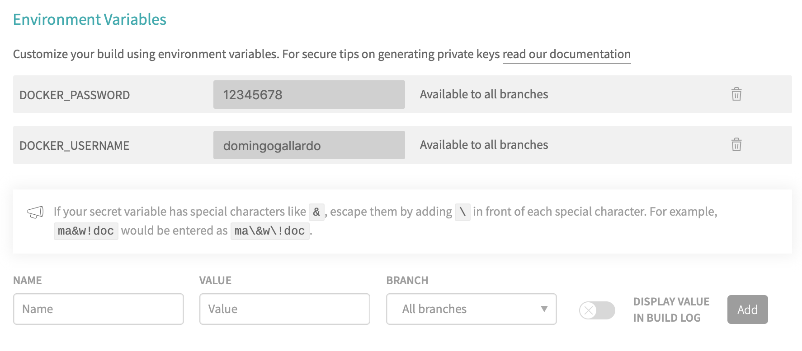
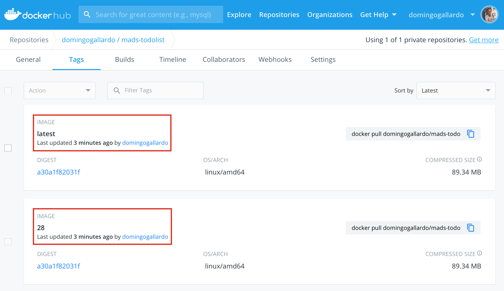

# Práctica 3: Trabajo en equipo con GitFlow y despliegue de la aplicación

## Objetivos y resumen de la práctica ##

En esta práctica se pretende conseguir:

1. Crear los equipos de trabajo en GitHub.
2. Adaptar el flujo de trabajo en Git y GitHub al trabajo en equipo.
    - Implementar GitFlow.
    - Desarrollar nuevas features con GitFlow.
    - Lanzamiento de una versión nueva usando GitFlow.
3. Despliegue en producción de la aplicación, construyendo una imagen
   docker y lanzándola junto con la base de datos con `docker
   compose`.


## Formación de equipos ##

En esta práctica comenzamos a trabajar en equipos de 3 personas (de
forma excepcional podrían ser 2 o 4 personas).

Cada equipo trabajará con un repositorio común seleccionado de uno de
los miembros del equipo. Se formará también un _team_ en la
organización `mads-ua` en el que participarán todos los miembros
del equipo.


Utilizaremos _GitHub Classroom_ para crear el _team_ y el repositorio.

### Roles en el equipo ###

Cada una de las tres personas del equipo tendrá un papel
diferente. 

- **Responsable de GitHub**: encargado de gestionar el flujo de Git y
  de supervisar los pull requests, issues y tablero de GitHub.
- **Resposable de integración continua (devop)**: encargado
  de gestionar Travis, Docker y configuraciones del proyecto.
- **Responsable del producto**: encargado de conocer y gestionar las
  historias de usuario, el tablero Trello y las pruebas de usuario del
  producto. 

Debéis elegir quién va a tener cada papel.


### Pasos a seguir ###

- Debéis formar equipos de **3 personas**. Enviad los componentes al
  foro de Moodle y os asignaré un nombre de equipo. Utilizad después
  el enlace de GitHub Classroom que enviaré al foro de Moodle para
  crear el equipo y apuntaros a él.
  
    El primero que use el enlace debe crear el repositorio,
    escribiendo el nombre del equipo, como se muestra en la siguiente
    imagen.

    

    El equipo trabajará con un repositorio creado por GitHub Classroom
    con el nombre `todolistgrupo-2019-NOMBRE-EQUIPO`. Al igual que en
    la práctica 1, el repositorio se creará en el grupo `mads-ua`.

    

    Una vez que la primera persona ha creado el equipo y el
    repositorio, las siguientes personas que usan el enlace pueden
    unirse al equipo creado o crear un nuevo equipo:
    
    

- Una vez creado el repositorio debéis crear en él un tablero para
  gestionar las tarjetas con los _issues_ y los pull
  requests. Creadlos con las mismas columnas que en las prácticas 1 y 2.

- Escoged el proyecto que vais a usar como punto de partida de estas
  dos últimas prácticas de entre los proyectos de los miembros del
  equipo. Intentad que se un proyecto con código limpio y fácilmente
  ampliable.

    Subidlo al nuevo repositorio, cambiando la URL del `origin` del
    repositorio local y haciendo un push:

        $ git remote set-url origin https://github.com/mads-ua/todolistgrupo-2019-NOMBRE-EQUIPO.git
        $ git push -u origin master

    Por último, los otros miembros del equipo deberán clonar el
    repositorio para que los tres podáis trabajar con él en local.

- Cambiad el nombre del proyecto (en el fichero `POM.xml` y en el
  `about.html` a `mads-todolist-equipo-XX`.

    Haced un commit directamente en `master` con estos cambios.
  
    Para conectar el repositorio con Travis el responsable de
    integración continua debe acceder a su cuenta personal en
    Travis.com y sincronizar el nuevo repositorio `todolistgrupo` en
    la organización `mads-ua`. Puedes acceder a la página para
    sincronizar este nuevo repositorio desde la página principal de
    Travis, pulsando el botón `+`:
    
    


## Nuevo flujo de trabajo para los _issues_ ##

Debemos adaptar el flujo de trabajo en GitHub al trabajo en equipo. En
cuanto a la gestión de los _issues_ y tablero del proyecto cambiaremos
lo siguiente:

- **Selección del _issue_**: Al pasar un _issue_ de `To do`a `In
  progress` se debe asignar un responsable del desarrollo del _issue_.
- **Nueva rama con el _issue_**: El responsable seleccionado será el que abra una
  rama nueva para el desarrollo del ticket y la subirá a
  GitHub.
- **Desarrollo**: Se trabaja en la rama. Cualquier compañero puede
  unirse al ticket y trabajar junto con el responsable, trabajando
  sobre la rama.
- **Pull request**: Cuando el ticket se ha terminado, el responsable
  abre un pull request en GitHub y pone la tarjeta en la columna
  `In pull request`. Se archiva la tarjeta del _issue_.
- **Revisión de código**: Los miembros del equipo revisan el código en
  el pull request (consultar documentación en GitHub: [Reviewing
  proposed changes in a pull
  request](https://help.github.com/articles/reviewing-proposed-changes-in-a-pull-request/)). Al
  menos uno de los miembros del equipo deben dar el OK, añadiendo una
  reacción.
- **Integración del pull request**: Cuando un miembro da el OK, el
  responsable de la tarea integra el pull request.

Para implementar el trabajo en equipo será necesario trabajar sobre
ramas remotas compartidas. A continuación explicamos con más detalle
algunos aspectos comandos de Git necesarios.

### Comandos Git ###

Veamos algunos comandos de Git relacionados con el trabajo compartido
en repositorios y ramas remotas.

- Subir una rama al repositorio remoto:

        $ git checkout -b nueva-rama
        $ git push -u origin nueva-rama

- Descargar una rama del repositorio remoto:

        $ git fetch 
        $ git checkout nueva-rama 

    El comando `git fetch` se descarga todos los cambios pero no los
    mezcla con las ramas locales. Los deja en ramas _remote tracking_ a las
    que les da el nombre del servidor y la rama
    (`origin/nueva-rama`). 

    En el caso del comando anterior, el comando `git checkout
    nueva-rama` es equivalente a `git checkout -b nueva-rama
    origin/nueva-rama`. Se crea una rama local `nueva-rama` conectada
    a la rama `origin/nueva-rama`.

- Actualizar una rama con cambios que otros compañeros han subido al
  repositorio remoto:

        $ git pull

    El comando `git pull` es equivalente a un `git fetch` seguido de
    un `git merge`. El comando `git fetch` actualiza la rama remota
    `origin/nueva-rama`. El comando `git pull` es equivalente a hacer:

        $ git checkout nueva-rama
        $ git fetch
        $ git merge origin/nueva-rama

- Subir cambios de la rama actual:

        (estando en la rama que queremos subir)
        $ git push

    El comando `git push` funcionará correctamente sin más parámetros
    si previamente hemos subido la rama con un `git push -u`.

- Comprobar el estado de las ramas locales y remotas:

        $ git branch -vv

    Este comando no accede directamente al servidor, sino que muestra
    la información de la última vez que se accedió a él. Si queremos
    la información actualizada podemos hacer un `git fetch --all`
    antes:

        $ git fetch --all
        $ git branch -vv

    Es importante recordar que `git fetch` (a diferencia de `git
    pull`) no modifica los repositorios locales, sino que baja las
    ramas remotas cachés locales.

- Información de los repositorios remotos:

        $ git remote show origin

    Proporciona información del repositorio remoto, todas sus ramas,
    del local y de la conexión entre ambos.

        $ git remote -v update

    Proporciona información del estado de las ramas remotas y locales
    (si están actualizadas o hay cambios en algunas no bajadas o
    subidas).

- Borrado de ramas remotas desde el terminar:

        $ git push origin --delete nueva-rama
        $ git remote prune origin

- Si necesitamos en la rama de _feature_ código que se haya añadido en
  la rama `master`.
  
    Podemos hacer un _merge_ de la rama `master` en la rama de
    _feature_ para incorporar los avances de código que se han hecho
    en `master` y que necesitamos en nuestra nueva rama:
    
        $ git checkout nueva-rama
        $ git merge master


- Solución de conflictos en un _pull request_:

    Recordamos lo que hemos visto en teoría sobre la solución de
    conflictos detectados en un _pull request_.
    
    Supongamos que hay un conflicto entre la nueva rama y
    `master`. GitHub detectará el conflicto en la página de _pull
    request_. Para arreglar el conflicto:
    
        $ git checkout master
        $ git pull
        $ git checkout nueva-rama
        $ git merge master
        # arreglar el conflicto
        $ git push
        # ya se puede hacer el merge en GitHub
    
### Pasos a seguir ###

- Probad el nuevo flujo de trabajo en el tablero del proyecto creando
  un nuevo _issue_ denominado `Actualizar la página Acerca de`. En la
  descripción de _issue_ comentad que se debe modificar la página para
  que muestren todos los miembros del equipo y el nuevo número de
  versión de la aplicación (`1.3.0-SNAPSHOT`).

- Escoged una persona del equipo como responsable del _issue_. El
  responsable del _issue_ será el responsable de integrarlo en
  `master` y de solucionar los conflictos que puedan surgir.

- Probad los comandos Git anteriores en una rama en la que se resuelva
  el _issue_. Cada miembro del equipo deberá realizar un commit en el
  que se añada su nombre a la lista de autores de la aplicación,
  indicando también su papel en el equipo.

- Cread el pull request en GitHub, poniendo como responsable del PR al
  mismo responsable del _issue_.

- Provocad un conflicto y arregladlo. Para ello se debe añadir un
  commit en `master` que entre en conflicto con los cambios realizados
  en la rama. Después se arreglará el conflicto y se subirá la
  solución al pull request.

- Por último, revisad el código, aceptadlo e integrad el PR en _master_.


## Configuración de GitFlow ##

El flujo de trabajo Git que vamos a seguir es muy similar al flujo de
trabajo GitFlow (recordad la [clase de
teoría](https://github.com/domingogallardo/apuntes-mads/blob/master/sesiones/07-git-workflows/git-workflows.md)). 

### Ramas de largo recorrido ###

En GitFlow se publican las distintas versiones del proyecto en la rama
_long-lived_ `master` y se hace el desarrollo en la rama
`develop`. A partir de ahora no desarrollaremos directamente en
`master` sino en `develop`.

En la página de configuración del repositorio en GitHub en `Settings >
Branches > Default branch` se puede configurar la rama por defecto
contra la que se realizarán los commits y la que aparecerá en la
página del proyecto. Tendréis que definir `develop`.

### Ramas de feature ###

Desde el comienzo de trabajo con Git en las prácticas 1 y 2 estamos
haciendo un desarrollo basado en ramas de corto recorrido,
equivalentes a las ramas de _features_ de GitFlow. 

Tal y como se comenta en GitFLow estas ramas saldrán de `develop` y se
integrarán en `develop`. La diferencia es que en GitFlow estas ramas
se integran con la rama de desarrollo manualmente haciendo `merge`,
mientras que nosotros las integramos haciendo un pull request.

### Ramas de release ###

Hasta ahora hemos hecho los _releases_ en la rama `master`. A partir
de ahora seguiremos la estrategia de GitFlow y haremos ramas de
_release_ que salen de `develop` y se integran en `master` y en
`develop`.

Haremos también la integración haciendo pull request.

### Pasos a seguir ###

- El **responsable de GitHub** se debe encargar de
crear la rama **`develop`** y configurarla como rama principal del
proyecto en GitHub. Todos los otros miembros deberán descargarla y
moverse a ella en sus repositorios locales. Esta rama pasará a ser la
de desarrollo principal. 

- El **responsable de integración continua** modificará el fichero de
configuración de Travis, para que también se lancen los builds en la
rama `develop` (además de en la rama `master`).

- Haced un PR de prueba en la rama `develop` para comprobar que todo
  funciona bien.

- Cread tres _issues_ distintos, simulando tres nuevas
  funcionalidades. Deben ser issues muy sencillos (cambiar el color de
  algún elemento de la aplicación, cambiar un texto, o algo
  similar). Cada uno de los miembros del equipo será el responsable de
  uno de los issues. 
  
-  El **responsable de GitHub** configurará el repositorio para obligar
  a que cualquier _pull request_ tenga que tener la revisión de una
  persona distinta del responsable del PR.
  
  Desarrollar e integrar los issues en `develop` siguiendo el flujo de
  trabajo planteado anteriormente. El **responsable de GitHub** se
  asegurará de que el tablero de GitHub se actualiza correctamente.

- Por último, vamos a probar el lanzamiento de una release usando el flujo de
  trabajo. Cread un _issue_ con la tarea _Lanzar release 1.3.0_ que
  tendrá como responsable al responsable de GitHub.

- El **responsable de GitHub** deberá **publicar la nueva versión** siguiendo
  los pasos de GitFlow:
  
    - Crear la rama local `release-1.3.0` a partir de `develop`.
    - Realizar en esta rama los cambios específicos de la versión. En
      nuestro caso:
        - Cambiar en la página `Acerca de` "Versión 1.3.0-SNAPSHOT" a
          "Versión 1.3.0" y añadir la fecha de publicación.
        - Cambiar el fichero `pom.xml`.
    - Publicar la rama `release-1.3.0` en GitHub y hacer un pull
      request sobre `master`. Una vez mezclado el PR añadir la
      etiqueta con la nueva versión `1.3.0` en `master` creando la
      página de release en GitHub.
    - Mezclar también la rama de release con `develop` (se puede hacer
      también con un PR).

- Una vez hecho esto ya se puede borrar la rama `release-1.3.0` y las
  ramas `master` y `develop` estarán actualizadas a la nueva
  versión. Hacer por último un commit en `develop` (no hace falta PR)
  cambiando la versión a `1.4.0-SNAPSHOT`.

- La rama `develop` también será integrada por Travis. Debemos
  comprobar que pasan todos los tests de las nuevas características
  que se añaden.

- Por último, deberéis **realizar un _hot fix_**, simulando la resolución
  de un error, siguiendo el flujo de trabajo de GitFlow, y
  actualizando el número de versión a `1.3.1`.


## Despliegue en producción con Docker ##

Este apartado lo realizará el **responsable de integración continua**,
pero todos los miembros del equipo deben conocer y entender todos los
pasos.

### Sobreescribir propiedades desde la línea de comando ###

Hemos visto que al lanzar la aplicación Spring Boot podemos
seleccionar el perfil activo. Por ejemplo para lanzar la aplicación
usando como perfil activo el fichero `application-mysql.properties`:

```
mvn spring-boot:run -Dspring.profiles.active=mysql
```

También hemos visto que podemos seleccionar este perfile para lanzar los tests:

```
mvn test -Dspring.profiles.active=mysql
```

La opción `-D` permite sobreescribir una propiedad del fichero de
propiedades. Por ejemplo, podemos lanzar la aplicación modificando el
usuario y la contraseña de una conexión a una base de datos con el
siguiente comando:

```
mvn spring-boot:run -Dspring.datasource.username=root -Dspring.datasource.password=12345678
```

También es posible definir variables en el propio fichero de
propiedades para proporcionar nombres más cortos o reutilizar un mismo
valor en varias propiedades.

Por ejemplo, en el siguiente fichero `application.properties`
definimos el [nivel de
logging](https://stackoverflow.com/a/37167120/540801) (que puede ser
`off`, `fatal`, `error`, `warn`, `info`, `debug`, `trace`, `all`) y
usamos el mismo nivel para los distintos paquetes de la aplicación:

```
logging=info
logging.level.org.springframework=${logging}
logging.level.root=${logging}
logging.level.org.hibernate=${logging}
logging.level.sql=${logging}
```

Podríamos entonces modificar el nivel de logs modificando la variable
`logging` al lanzar los tests de la aplicación, para que sólo muestre
los mensajes de error:

```
mvn test -Dloggin=error
```

En la aplicación vamos a usar esta variable y también otras que nos
van a permitir configurar las propiedades relacionadas con la conexión
con la base de datos.

### Pasos a seguir ###

- Abre un _issue_ denominado `Dockerización de la aplicación` en el
  que vas a configurar la aplicación para lanzarla con
  `docker-compose`. Como siempre, desarrolla el _issue_ en una rama
  propia.

- Modifica los ficheros de propiedades de ejecución para que queden de
  la siguiente forma:

    **Fichero `src/main/resources/application.properties`**

        spring.datasource.url=jdbc:h2:mem:dev
        spring.jpa.properties.hibernate.dialect = org.hibernate.dialect.H2Dialect
        spring.jpa.hibernate.ddl-auto=update
        spring.datasource.data=classpath:datos-dev.sql
        spring.datasource.initialization-mode=always
        spring.h2.console.enabled=true
        spring.h2.console.path=/h2-console


        logging=info
        logging.level.org.springframework=${logging}
        logging.level.root=${logging}
        logging.level.org.hibernate=${logging}
        logging.level.sql=${logging}

    **Fichero `src/main/resources/application-mysql.properties`**

        db_ip=localhost:3306
        db_user=root
        db_passwd=
        spring.datasource.url=jdbc:mysql://${db_ip}/mads
        spring.datasource.username=${db_user}
        spring.datasource.password=${db_passwd}
        spring.jpa.properties.hibernate.dialect = org.hibernate.dialect.MySQL5InnoDBDialect
        spring.jpa.hibernate.ddl-auto=update
        spring.datasource.initialization-mode=never

- Probamos que funcionan bien las variables de
  configuración. Para ello, lanzamos mysql en un puerto distinto, el 3316:
  
        docker run -d -p 3316:3306 --name mysql-otro-puerto -e MYSQL_ALLOW_EMPTY_PASSWORD=yes -e MYSQL_DATABASE=mads mysql:5 
  
    y probamos a lanzar la aplicación modificando la variable `db_ip`
    para que se conecte a ese nuevo puerto:
  
        mvn spring-boot:run -Dspring.profiles.active=mysql -Ddb_ip=localhost:3316

    La aplicación debe arrancar correctamente, conectándose a la base
    de datos en el nuevo puerto.

    Por último, borramos el contenendor de prueba creado:
    
         docker container stop mysql-otro-puerto
         docker container rm mysql-otro-puerto

- Realiza un commit con los nuevos ficheros de propiedades.

!!! Note "Nota"
    Es posible utilizar la variable `db_ip` para facilitar la conexión
    de la aplicación a un contenedor Docker de MySQL lanzado en
    Windows con _Docker Toolbox_. En este caso hay que especificar la
    dirección IP en la que se está ejecutando el contenedor Docker.


### Imagen Docker de la aplicación ###

Hemos visto [en teoría](https://github.com/domingogallardo/apuntes-mads/blob/master/sesiones/08-integracion-entrega-continua/integracion-entrega-continua.md#demostración-de-docker) cómo crear imágenes Docker. Vamos a crear una
imagen con nuestra aplicación `mads-todolist`.

El fichero `Dockerfile` es el responsable de construir la máquina
Docker. Usaremos el siguiente `Dockerfile`:

```
#### Stage 1: Build the application
FROM openjdk:8-jdk-alpine as build

# Set the current working directory inside the image
WORKDIR /app

# Copy maven executable to the image
COPY mvnw .
COPY .mvn .mvn

# Copy the pom.xml file
COPY pom.xml .

# Build all the dependencies in preparation to go offline.
# This is a separate step so the dependencies will be cached unless
# the pom.xml file has changed.
RUN ./mvnw dependency:go-offline -B

# Copy the project source
COPY src src

# Package the application
RUN ./mvnw package -DskipTests
RUN mkdir -p target/dependency && (cd target/dependency; jar -xf ../*.jar)

#### Stage 2: A minimal docker image with command to run the app
FROM openjdk:8-jre-alpine

# Copy project dependencies from the build stage
COPY --from=build /app/target/dependency/BOOT-INF/lib /app/lib
COPY --from=build /app/target/dependency/META-INF /app/META-INF
COPY --from=build /app/target/dependency/BOOT-INF/classes /app

# Define environment variables
ENV PROFILE=
ENV DB_IP=
ENV DB_USER=
ENV DB_PASSWD=
ENV LOGGING=

CMD java -Dspring.profiles.active=$PROFILE -Ddb_ip=$DB_IP -Ddb_user=$DB_USER \
    -Ddb_passwd=$DB_PASSWD -Dlogging=$LOGGING -cp app:app/lib/* madstodolist.Application
```


Se trata de un fichero que construye la imagen docker en dos fases. En
una primera fase compila la aplicación y guarda todos los `jars` en el
directorio `target`. En la segunda fase crea la máquina resultante, basada en
`openjdk:8-jre-alpine`, con las librerías compiladas previamente.

Docker permite definir variables de entorno que pueden ser modificadas
al lanzar la máquina. Definimos las mismas variables que hemos
definido en el fichero de propiedades de spring boot:

- `PROFILE`: perfil a usar al lanzar la aplicación.
- `DB_IP`: dirección IP y puerto de la base de datos con la que se
  debe conectar la aplicación.
- `DB_USER`: usuario de la base de datos con el que la aplicación se
  conecta con la base de datos.
- `DB_PASSWD`: contraseña del usuario de la base de datos.
- `LOGGING`: nivel de logging que va a realizar la aplicación.

Para lanzar una imagen docker definiendo un valor de una variable de
entorno hay que utilizar el flag `-e VARIABLE=valor`. 


### Pasos a seguir ###

- Crea una cuenta en [DockerHub](https://hub.docker.com). En esta
  cuenta se publicará la imagen docker de la aplicación.

- Crea el fichero `Dockerfile` anterior en el directorio principal de
  la aplicación.
  
- Construye la máquina docker. Utiliza como _usuario_ el usuario que
  has creado en DockerHub.

        docker build -t USUARIO/mads-todolist-equipo-XX .

    Prueba a ejecutar la aplicación trabajando con la base de datos en
    memoria y con logs de nivel `INFO`:
    
        docker run --rm -it -p 8080:8080 -e LOGGING=error USUARIO/mads-todolist-equipo-XX

    El flag `-it` permite visualizar en el terminal de forma
    interactiva la salida estándar de la aplicación Play y terminarla
    haciendo un `CTRL-C`.

    Y prueba por último a ejecutar la aplicación funcionando con la imagen docker
    con la base de datos MySQL:

        $ docker run -d -p 3306:3306 --name mysql-develop -e MYSQL_ALLOW_EMPTY_PASSWORD=yes -e MYSQL_DATABASE=mads mysql:5 
        $ docker run --rm -it --link mysql-develop -p 8080:8080 \
          -e PROFILE=mysql -e DB_IP=mysql-develop:3306 -e DB_USER=root -e LOGGING=info \
          USUARIO/mads-todolist-equipo-XX


- Cuando compruebes que todo funciona correctamente, sube a _docker hub_
  la imagen compilada:
  
        $ docker login
        # introduce tus credenciales en docker hub
        $ docker push USUARIO/mads-todolist-equipo-XX
      
- Comprueba en _docker hub_ que la imagen se ha subido
  correctamente. Uno de los compañeros debe probar que la imagen
  funciona correctamente, ejecutando las dos instrucciones
  anteriores en su máquina:

        $ docker run -d -p 3306:3306 --name mysql-develop -e MYSQL_ALLOW_EMPTY_PASSWORD=yes -e MYSQL_DATABASE=mads mysql:5 
        $ docker run --rm -it --link mysql-develop -p 8080:8080 \
          -e PROFILE=mysql -e DB_IP=mysql-develop:3306 -e DB_USER=root -e LOGGING=info \
          USUARIO/mads-todolist-equipo-XX
  
    Comprobad que se descarga correctamente la máquina
    `USUARIO/mads-todolist-equipo-XX` y que la aplicación se lanza sin
    errores.

- Por último, modifica el script de Travis para que sea Travis quien
  construya y publique la máquina docker. Antes de que se ejecute el
  script deberás configurar en los ajustes del repositorio en Travis
  (_travis-ci.com > USUARIO/mads-todolist-equipo-XX > Settings >
  Environment Variables_) las variables: `DOCKER_USERNAME` y
  `DOCKER_PASSWORD`, para que Travis pueda publicar en tu cuenta de
  DockerHub.
  
    
  
    Líneas a añadir al final del fichero `.travis.yml`:
    
        after_success:
          - docker build -t USUARIO/mads-todolist-equipo-XX:$TRAVIS_BUILD_NUMBER .
          - if [ "$TRAVIS_EVENT_TYPE" != "pull_request" ]; then
            docker login -u="$DOCKER_USERNAME" -p="$DOCKER_PASSWORD";
            docker push USUARIO/mads-todolist-equipo-XX:$TRAVIS_BUILD_NUMBER;
            docker tag USUARIO/mads-todolist-equipo-XX:$TRAVIS_BUILD_NUMBER USUARIO/mads-todolist-equipo-XX:latest;
            docker push USUARIO/mads-todolist-equipo-XX:latest;
            fi

    Fíjate en el script `after_success`. Es lo que Travis hará después
    de ejecutar con éxito los tests:
    
    - Construir la máquina docker de nuestra aplicación, asignándole
    como etiqueta el número de build actuar.
    - Si la ejecución de Travis es debida a un evento que no es un
    _pull request_ (o sea, cuando sea un build disparado por el commit
    de merge con la rama en la que se integra el PR) se logea en
    docker hub con el usuario y la contraseña definidas en las
    variables. Una vez logeado, publica la imagen usando como número
    de _tag_ el número de build. Y esta última imagen también se
    vuelve a etiquetar como `latest` y se vuelve a subir.
  
    Por ejemplo, cuando se realice el build `#28` se publicará la
    imagen resultante de este build con las etiquetas `28` y `latest`:
    `USUARIO/mads-todolist-equipo-XX:28` y
    `USUARIO/mads-todolist-equipo-XX:latest`.


- Por último, añade el siguiente fichero `docker-compose.yml` en el
  directorio raíz de la aplicación. La aplicación `docker-compose`
  permite automatizar la puesta en funcionamiento y conexión de más de
  un contenedor docker. En nuestro caso, servirá para poner en marcha
  con un único comando el contenedor de base de datos y nuestra
  aplicación.

    Fichero `docker-compose.yml`:
        
        version: '3.7'

        # Define services
        services:

          # App backend service
          mads-todolist:
            image: USUARIO/mads-todolist-equipo-XX
            ports:
              - "8080:8080" # Forward the exposed port 8080 on the container to port 8080 on the host machine
            restart: always
            depends_on:
              - db # This service depends on mysql. Start that first.
            environment: # Pass environment variables to the service
              PROFILE: mysql
              DB_IP: db:3306
              DB_USER: root
              LOGGING: info
            networks: # Networks to join (Services on the same network can communicate with each other using their name)
              - backend

          # Database Service (Mysql)
          db:
            image: mysql:5
            ports:
              - "3306:3306"
            restart: always
            environment:
              MYSQL_DATABASE: mads
              MYSQL_ALLOW_EMPTY_PASSWORD: 'yes'
            volumes:
              - db-data:/var/lib/mysql
            networks:
              - backend

        # Volumes
        volumes:
          db-data:

        # Networks to be created to facilitate communication between containers
        networks:
          backend:
  
  - Prueba que funciona correctamente `docker-compose` ejecutando el
    comando `docker-compose up`. Para asegurarte de que la imagen que
    ejecutas es la que se descarga de docker hub debes borrar
    previamente la imagen que tengas en tu ordendador:
    
    ```
    $ docker container prune
    $ docker image rm USUARIO/mads-todolist-equipo-XX
    $ docker-compose up
    ```
    
    Verás cómo se ponen en marcha el contenedor `mysql` y el
    contenedor con nuestra aplicación. Prueba a conectarte a la
    aplicación y comprobar que todo funciona correctamente.
    Puedes terminar la ejecución
    haciendo `CTRL-C` o lanzando desde otra terminal el comando
    
    ```
    docker-compose down
    ```

  - En el script de `docker compose` el contenedor `mysql` utiliza un
    [volumen](https://docs.docker.com/storage/volumes/). Esto permite
    conservar los datos que se introduzcan en la ejecución del
    programa, aunque el contenedor se borre. También sería posible
    hacer un backup de estos datos a partir del volumen.
    
    Para listar los volúmenes mantenidos por docker:
    
    ```
    docker volume ls
    ```
    
    Para eliminar un volumen:
    
    ```
    docker volume rm nombre-volumen
    ```
    
    Y para elminiar todos los volúmenes:
    
    ```
    docker volume prune
    ```

- Haz un commit y sube los cambios a GitHub. 
- Crea el pull request que cierra el _issue_ y ciérralo, comprobando
  que Travis construye la máquina docker y la publica en docker hub.

    

- Por último un compañero debe probar el comando `docker-compose up` y
  comprobar si se ponen en marcha las imágenes docker y nuestra
  aplicación funciona correctamente. 


## Entrega y evaluación ##

- La práctica tiene una duración de 3 semanas y debe estar terminada
  el martes 26 de noviembre.
- La calificación de la práctica tiene un peso de un 5% en la nota
  final de la asignatura.
- Para realizar la entrega uno de los miembros del equipo debe subir a
  Moodle un ZIP que contenga todo el proyecto, incluyendo el
  directorio `.git` que contiene la historia Git. Para ello comprime
  tu directorio local del proyecto **después de haber hecho un `mvn
  clean`** para eliminar el directorio `target` que contiene los
  binarios compilados. Debes dejar también en Moodle la URL del
  repositorio en GitHub.

Para la evaluación se tendrá en cuenta:

- Desarrollo continuo (los _commits_ deben realizarse a lo largo de
  las semanas y no dejar todo para la última).
- Correcto desarrollo de la metodología.
- Corrección del código.

