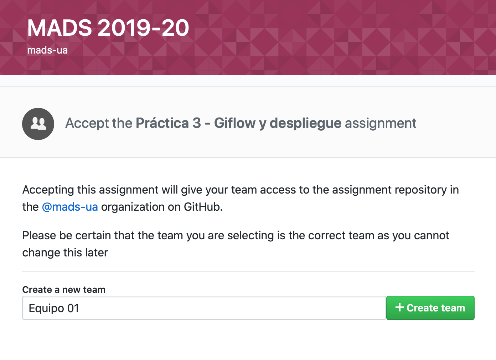
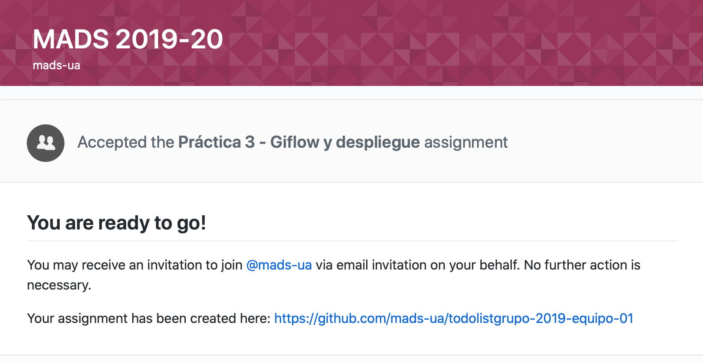
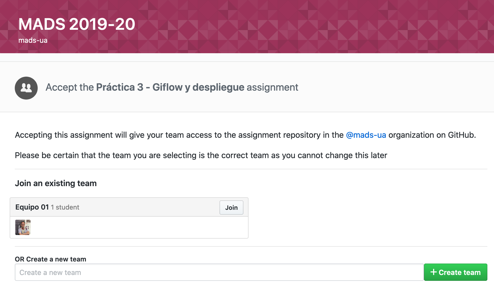
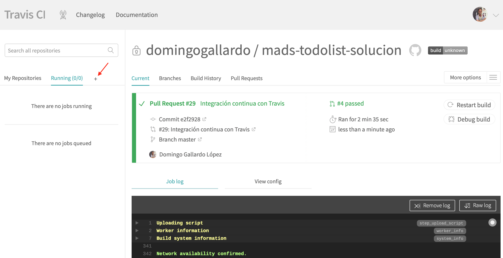

# Práctica 3: Trabajo en equipo con GitFlow y despliegue de la aplicación

## Objetivos y resumen de la práctica ##

En esta práctica se pretende conseguir:

1. Crear los equipos de trabajo en GitHub.
2. Adaptar el flujo de trabajo en Git y GitHub al trabajo en equipo.
    - Implementar GitFlow.
    - Desarrollar nuevas features con GitFlow.
    - Lanzamiento de una versión nueva usando GitFlow.
3. Despliegue en producción de la aplicación, construyendo una imagen
   docker y lanzándola junto con la base de datos con `docker
   compose`.


## Formación de equipos ##

En esta práctica comenzamos a trabajar en equipos de 3 personas (de
forma excepcional podrían ser 2 o 4 personas).

Cada equipo trabajará con un repositorio común seleccionado de uno de
los miembros del equipo. Se formará también un _team_ en la
organización `mads-ua` en el que participarán todos los miembros
del equipo.


Utilizaremos _GitHub Classroom_ para crear el _team_ y el repositorio.

### Roles en el equipo ###

Cada una de las tres personas del equipo tendrá un papel
diferente. 

- **Responsable de GitHub**: encargado de gestionar el flujo de Git y
  de supervisar los pull requests, issues y tablero de GitHub.
- **Resposable de integración continua (devop)**: encargado
  de gestionar Travis, Docker y configuraciones del proyecto.
- **Responsable del producto**: encargado de conocer y gestionar las
  historias de usuario, el tablero Trello y las pruebas de usuario del
  producto. 

Debéis elegir quién va a tener cada papel.


### Pasos a seguir ###

- Debéis formar equipos de **3 personas**. Enviad los componentes al
  foro de Moodle y os asignaré un nombre de equipo. Utilizad después
  el enlace de GitHub Classroom que enviaré al foro de Moodle para
  crear el equipo y apuntaros a él.
  
    El primero que use el enlace debe crear el repositorio,
    escribiendo el nombre del equipo, como se muestra en la siguiente
    imagen.

    

    El equipo trabajará con un repositorio creado por GitHub Classroom
    con el nombre `todolistgrupo-2019-NOMBRE-EQUIPO`. Al igual que en
    la práctica 1, el repositorio se creará en el grupo `mads-ua`.

    

    Una vez que la primera persona ha creado el equipo y el
    repositorio, las siguientes personas que usan el enlace pueden
    unirse al equipo creado o crear un nuevo equipo:
    
    

- Una vez creado el repositorio debéis crear en él un tablero para
  gestionar las tarjetas con los _issues_ y los pull
  requests. Creadlos con las mismas columnas que en las prácticas 1 y 2.

- Escoged el proyecto que vais a usar como punto de partida de estas
  dos últimas prácticas de entre los proyectos de los miembros del
  equipo. Intentad que se un proyecto con código limpio y fácilmente
  ampliable.

    Subidlo al nuevo repositorio, cambiando la URL del `origin` del
    repositorio local y haciendo un push:

        $ git remote set-url origin https://github.com/mads-ua/todolistgrupo-2019-NOMBRE-EQUIPO.git
        $ git push -u origin master

    Por último, los otros miembros del equipo deberán clonar el
    repositorio para que los tres podáis trabajar con él en local.

- Cambiad el nombre del proyecto (en el fichero `POM.xml` y en el
  `about.html` a `mads-todolist-equipo-XX`.

    Haced un commit directamente en `master` con estos cambios.
  
    Para conectar el repositorio con Travis el responsable de
    integración continua debe acceder a su cuenta personal en
    Travis.com y sincronizar el nuevo repositorio `todolistgrupo` en
    la organización `mads-ua`. Puedes acceder a la página para
    sincronizar este nuevo repositorio desde la página principal de
    Travis, pulsando el botón `+`:
    
    


## Nuevo flujo de trabajo para los _issues_ ##

Debemos adaptar el flujo de trabajo en GitHub al trabajo en equipo. En
cuanto a la gestión de los _issues_ y tablero del proyecto cambiaremos
lo siguiente:

- **Selección del _issue_**: Al pasar un _issue_ de `To do`a `In
  progress` se debe asignar un responsable del desarrollo del _issue_.
- **Nueva rama con el _issue_**: El responsable seleccionado será el que abra una
  rama nueva para el desarrollo del ticket y la subirá a
  GitHub.
- **Desarrollo**: Se trabaja en la rama. Cualquier compañero puede
  unirse al ticket y trabajar junto con el responsable, trabajando
  sobre la rama.
- **Pull request**: Cuando el ticket se ha terminado, el responsable
  abre un pull request en GitHub y pone la tarjeta en la columna
  `In pull request`. Se archiva la tarjeta del _issue_.
- **Revisión de código**: Los miembros del equipo revisan el código en
  el pull request (consultar documentación en GitHub: [Reviewing
  proposed changes in a pull
  request](https://help.github.com/articles/reviewing-proposed-changes-in-a-pull-request/)). Al
  menos uno de los miembros del equipo deben dar el OK, añadiendo una
  reacción.
- **Integración del pull request**: Cuando un miembro da el OK, el
  responsable de la tarea integra el pull request.

Para implementar el trabajo en equipo será necesario trabajar sobre
ramas remotas compartidas. A continuación explicamos con más detalle
algunos aspectos comandos de Git necesarios.

### Comandos Git ###

Veamos algunos comandos de Git relacionados con el trabajo compartido
en repositorios y ramas remotas.

- Subir una rama al repositorio remoto:

        $ git checkout -b nueva-rama
        $ git push -u origin nueva-rama

- Descargar una rama del repositorio remoto:

        $ git fetch 
        $ git checkout nueva-rama 

    El comando `git fetch` se descarga todos los cambios pero no los
    mezcla con las ramas locales. Los deja en ramas _remote tracking_ a las
    que les da el nombre del servidor y la rama
    (`origin/nueva-rama`). 

    En el caso del comando anterior, el comando `git checkout
    nueva-rama` es equivalente a `git checkout -b nueva-rama
    origin/nueva-rama`. Se crea una rama local `nueva-rama` conectada
    a la rama `origin/nueva-rama`.

- Actualizar una rama con cambios que otros compañeros han subido al
  repositorio remoto:

        $ git pull

    El comando `git pull` es equivalente a un `git fetch` seguido de
    un `git merge`. El comando `git fetch` actualiza la rama remota
    `origin/nueva-rama`. El comando `git pull` es equivalente a hacer:

        $ git checkout nueva-rama
        $ git fetch
        $ git merge origin/nueva-rama

- Subir cambios de la rama actual:

        (estando en la rama que queremos subir)
        $ git push

    El comando `git push` funcionará correctamente sin más parámetros
    si previamente hemos subido la rama con un `git push -u`.

- Comprobar el estado de las ramas locales y remotas:

        $ git branch -vv

    Este comando no accede directamente al servidor, sino que muestra
    la información de la última vez que se accedió a él. Si queremos
    la información actualizada podemos hacer un `git fetch --all`
    antes:

        $ git fetch --all
        $ git branch -vv

    Es importante recordar que `git fetch` (a diferencia de `git
    pull`) no modifica los repositorios locales, sino que baja las
    ramas remotas cachés locales.

- Información de los repositorios remotos:

        $ git remote show origin

    Proporciona información del repositorio remoto, todas sus ramas,
    del local y de la conexión entre ambos.

        $ git remote -v update

    Proporciona información del estado de las ramas remotas y locales
    (si están actualizadas o hay cambios en algunas no bajadas o
    subidas).

- Borrado de ramas remotas desde el terminar:

        $ git push origin --delete nueva-rama
        $ git remote prune origin

- Si necesitamos en la rama de _feature_ código que se haya añadido en
  la rama `master`.
  
    Podemos hacer un _merge_ de la rama `master` en la rama de
    _feature_ para incorporar los avances de código que se han hecho
    en `master` y que necesitamos en nuestra nueva rama:
    
        $ git checkout nueva-rama
        $ git merge master


- Solución de conflictos en un _pull request_:

    Recordamos lo que hemos visto en teoría sobre la solución de
    conflictos detectados en un _pull request_.
    
    Supongamos que hay un conflicto entre la nueva rama y
    `master`. GitHub detectará el conflicto en la página de _pull
    request_. Para arreglar el conflicto:
    
        $ git checkout master
        $ git pull
        $ git checkout nueva-rama
        $ git merge master
        # arreglar el conflicto
        $ git push
        # ya se puede hacer el merge en GitHub
    
### Pasos a seguir ###

- Probad el nuevo flujo de trabajo en el tablero del proyecto creando
  un nuevo _issue_ denominado `Actualizar la página Acerca de`. En la
  descripción de _issue_ comentad que se debe modificar la página para
  que muestren todos los miembros del equipo y el nuevo número de
  versión de la aplicación (`1.3.0-SNAPSHOT`).

- Escoged una persona del equipo como responsable del _issue_. El
  responsable del _issue_ será el responsable de integrarlo en
  `master` y de solucionar los conflictos que puedan surgir.

- Probad los comandos Git anteriores en una rama en la que se resuelva
  el _issue_. Cada miembro del equipo deberá realizar un commit en el
  que se añada su nombre a la lista de autores de la aplicación,
  indicando también su papel en el equipo.

- Cread el pull request en GitHub, poniendo como responsable del PR al
  mismo responsable del _issue_.

- Provocad un conflicto y arregladlo. Para ello se debe añadir un
  commit en `master` que entre en conflicto con los cambios realizados
  en la rama. Después se arreglará el conflicto y se subirá la
  solución al pull request.

- Por último, revisad el código, aceptadlo e integrad el PR en _master_.


## Configuración de GitFlow ##

El flujo de trabajo Git que vamos a seguir es muy similar al flujo de
trabajo GitFlow (recordad la [clase de
teoría](https://github.com/domingogallardo/apuntes-mads/blob/master/sesiones/07-git-workflows/git-workflows.md)). 

### Ramas de largo recorrido ###

En GitFlow se publican las distintas versiones del proyecto en la rama
_long-lived_ `master` y se hace el desarrollo en la rama
`develop`. A partir de ahora no desarrollaremos directamente en
`master` sino en `develop`.

En la página de configuración del repositorio en GitHub en `Settings >
Branches > Default branch` se puede configurar la rama por defecto
contra la que se realizarán los commits y la que aparecerá en la
página del proyecto. Tendréis que definir `develop`.

### Ramas de feature ###

Desde el comienzo de trabajo con Git en las prácticas 1 y 2 estamos
haciendo un desarrollo basado en ramas de corto recorrido,
equivalentes a las ramas de _features_ de GitFlow. 

Tal y como se comenta en GitFLow estas ramas saldrán de `develop` y se
integrarán en `develop`. La diferencia es que en GitFlow estas ramas
se integran con la rama de desarrollo manualmente haciendo `merge`,
mientras que nosotros las integramos haciendo un pull request.

### Ramas de release ###

Hasta ahora hemos hecho los _releases_ en la rama `master`. A partir
de ahora seguiremos la estrategia de GitFlow y haremos ramas de
_release_ que salen de `develop` y se integran en `master` y en
`develop`.

Haremos también la integración haciendo pull request.

### Pasos a seguir ###

- El **responsable de GitHub** se debe encargar de
crear la rama **`develop`** y configurarla como rama principal del
proyecto en GitHub. Todos los otros miembros deberán descargarla y
moverse a ella en sus repositorios locales. Esta rama pasará a ser la
de desarrollo principal. 

- El **responsable de integración continua** modificará el fichero de
configuración de Travis, para que también se lancen los builds en la
rama `develop` (además de en la rama `master`).

- Haced un PR de prueba en la rama `develop` para comprobar que todo
  funciona bien.

- Cread tres _issues_ distintos, simulando tres nuevas
  funcionalidades. Deben ser issues muy sencillos (cambiar el color de
  algún elemento de la aplicación, cambiar un texto, o algo
  similar). Cada uno de los miembros del equipo será el responsable de
  uno de los issues. 
  
-  El **responsable de GitHub** configurará el repositorio para obligar
  a que cualquier _pull request_ tenga que tener la revisión de una
  persona distinta del responsable del PR.
  
  Desarrollar e integrar los issues en `develop` siguiendo el flujo de
  trabajo planteado anteriormente. El **responsable de GitHub** se
  asegurará de que el tablero de GitHub se actualiza correctamente.

- Por último, vamos a probar el lanzamiento de una release usando el flujo de
  trabajo. Cread un _issue_ con la tarea _Lanzar release 1.3.0_ que
  tendrá como responsable al responsable de GitHub.

- El **responsable de GitHub** deberá **publicar la nueva versión** siguiendo
  los pasos de GitFlow:
  
    - Crear la rama local `release-1.3.0` a partir de `develop`.
    - Realizar en esta rama los cambios específicos de la versión. En
      nuestro caso:
        - Cambiar en la página `Acerca de` "Versión 1.3.0-SNAPSHOT" a
          "Versión 1.3.0" y añadir la fecha de publicación.
        - Cambiar el fichero `pom.xml`.
    - Publicar la rama `release-1.3.0` en GitHub y hacer un pull
      request sobre `master`. Una vez mezclado el PR añadir la
      etiqueta con la nueva versión `1.3.0` en `master` creando la
      página de release en GitHub.
    - Mezclar también la rama de release con `develop` (se puede hacer
      también con un PR).

- Una vez hecho esto ya se puede borrar la rama `release-1.3.0` y las
  ramas `master` y `develop` estarán actualizadas a la nueva
  versión. Hacer por último un commit en `develop` (no hace falta PR)
  cambiando la versión a `1.4.0-SNAPSHOT`.

- La rama `develop` también será integrada por Travis. Debemos
  comprobar que pasan todos los tests de las nuevas características
  que se añaden.

- Por último, deberéis **realizar un _hot fix_**, simulando la resolución
  de un error, siguiendo el flujo de trabajo de GitFlow, y
  actualizando el número de versión a `1.3.1`.


## Despliegue en producción con Docker ##

Pendiente de finalizar.


<!--


### Sobreescribir propiedades desde la línea de comando ###

Hay distintas formas de seleccionar los perfiles cuando lanzamos la
aplicación y los tests. La forma más sencilla es la siguiente:

Para lanzar la aplicación usando como perfil activo el fichero
`application-mysql.properties`:

```
mvn spring-boot:run -Dspring.profiles.active=mysql
```

Para lanzar los tests usando como perfil `mysql`:

```
mvn test -Dspring.profiles.active=mysql
```

La opción `-D` permite sobreescribir una propiedad del fichero de
propiedades. Por ejemplo, podemos lanzar la aplicación modificando el
usuario y la contraseña de una conexión a una base de datos con el
siguiente comando:

```
mvn spring-boot:run -Dspring.datasource.username=root -Dspring.datasource.password=12345678
```

También es posible definir variables en el propio fichero de
propiedades para proporcionar nombres más cortos o reutilizar un mismo
valor en varias propiedades.

Ejemplo de fichero `application.properties`:

```
logging=info
logging.level.org.springframework=${logging}
logging.level.root=${logging}
logging.level.org.hibernate=${logging}
logging.level.sql=${logging}
```

Podríamos entonces modificar el nivel de logs modificando la variable
`logging` al lanzar los tests de la aplicación, para que sólo muestre
los mensajes de error:

```
mvn test -Dloggin=error
```


### Docker ###

`Dockerfile`:

```
```

Para construir la máquina docker:

```
docker build --build-arg JAR_FILE=target/mads-todolist-inicial-1.0.0.jar -t domingogallardo/todolist .
```

Para ejecutar la aplicación:

```
```


### Pasos a seguir ###

- Modifica los ficheros de propiedades de ejecución para que queden de la siguiente:

    **Fichero `src/main/resources/application.properties`**

        spring.application.name = madstodolist
        spring.datasource.url=jdbc:h2:mem:dev
        spring.jpa.properties.hibernate.dialect = org.hibernate.dialect.H2Dialect
        spring.jpa.hibernate.ddl-auto=update
        spring.datasource.data=classpath:datos-dev.sql
        spring.datasource.initialization-mode=always
        spring.h2.console.enabled=true
        spring.h2.console.path=/h2-console


        logging=info
        logging.level.org.springframework=${logging}
        logging.level.root=${logging}
        logging.level.org.hibernate=${logging}
        logging.level.sql=${logging}

    **Fichero `src/main/resources/application-mysql.properties`**

        db_ip=localhost:3306
        db_user=root
        db_passwd=
        spring.datasource.url=jdbc:mysql://${db_ip}/mads
        spring.datasource.username=${db_user}
        spring.datasource.password=${db_passwd}
        spring.jpa.properties.hibernate.dialect = org.hibernate.dialect.MySQL5InnoDBDialect
        spring.jpa.hibernate.ddl-auto=update
        spring.datasource.initialization-mode=never

- Vamos a probar que funcionan bien las variables de
  configuración. Para ello, lanzamos mysql en un puerto distinto, el 3316:
  
        docker run -d -p 3316:3306 --name mysql-otro-puerto -e MYSQL_ALLOW_EMPTY_PASSWORD=yes -e MYSQL_DATABASE=mads mysql:5 
  
    y probamos a lanzar la aplicación modificando la variable `db_ip`
    para que se conecte a ese nuevo puerto:
  
        mvn spring-boot:run -Dspring.profiles.active=mysql -Ddb_ip=localhost:3316

    Por último, borramos el contenendor de prueba creado:
    
         docker container stop mysql-otro-puerto
         docker container rm mysql-otro-puerto

!!! Note "Nota"
    Es posible utilizar la variable `db_ip` para facilitar la conexión
    de la aplicación a un contenedor Docker de MySQL lanzado con _Docker
    Toolbox_. En este caso hay que especificar la dirección IP en la
    que se está ejecutando el contenedor Docker.


## Despliegue ##

El objetivo del despliegue es poner en producción la última versión
lanzada de la aplicación. Como no ha sido posible encontrar ningún
servicio gratuito de hosting que soporte Play Framework (o Docker) y
MySQL, se realizará el despliegue en un ordenador de uno de los
miembros del equipo.

El **responsable de despliegue** deberá desplegar la aplicación docker
correspondiente a la última versión (que se estará publicada en Docker
Hub).  Deberá realizar el despliegue en modo producción, trabajando
con el fichero de configuración `production.conf`, y sobre una base de
datos de producción MySQL que contendrá todos los datos guardados en
todas las ejecuciones de la aplicación en este entorno de producción.

Para que funcione correctamente, se deberá actualizar el esquema de
datos de la base de datos de producción en el caso en que se haya
modificado dicho esquema en el desarrollo.

Vamos a ver primero los elementos que necesitamos para realizar el
despliegue y después enumeraremos paso a paso las actividades a
realizar en la práctica.


### Gestión de la base de datos de producción  ###

La base de datos de producción deberá crearse inicialmente con el
esquema de datos necesario. Después deberá actualizarse con cada nueva
versión que modifique el esquema de datos.

La base de datos de producción contendrá todos los datos introducidos
por distintas pruebas realizadas, simulando usuarios reales que
utilizan la aplicación.

#### Exportación del esquema de datos inicial ####

Para conseguir el esquema de datos inicial de la aplicación podemos
exportarlo una vez creado por la aplicación ejecutándose en modo
develop.
 
Para ello lanzamos la aplicación como lo hemos hecho hasta ahora,
trabajando contra el contenedor MySQL recién arrancado. Al arrancar la
aplicación JPA crea en la base de datos el esquema necesario para que
la aplicación funcione.  No hace falta añadir ningún dato, porque solo
nos interesa el esquema de datos.  

Una incializado el esquema de datos podemos exportarlo con el
siguiente comando `mysqldum` lanzado al contenedor `db-mysql` en
marcha:

```text
$ docker exec db-mysql sh -c 'exec mysqldump --no-data mads -uroot -pmads' > schema.sql
```

El comando anterior ejecuta el comando `mysqldump` en el contenedor
docker. Este comando exporta el esquema de datos (sin los datos
añadidos) y lo graba el fichero `schema.sql` en el directorio
actual. 

El fichero debería ser parecido a este:

```sql
-- MySQL dump 10.13  Distrib 5.7.23, for Linux (x86_64)
--
-- Host: localhost    Database: mads
-- ------------------------------------------------------
-- Server version	5.7.23

/*!40101 SET @OLD_CHARACTER_SET_CLIENT=@@CHARACTER_SET_CLIENT */;
/*!40101 SET @OLD_CHARACTER_SET_RESULTS=@@CHARACTER_SET_RESULTS */;
/*!40101 SET @OLD_COLLATION_CONNECTION=@@COLLATION_CONNECTION */;
/*!40101 SET NAMES utf8 */;
/*!40103 SET @OLD_TIME_ZONE=@@TIME_ZONE */;
/*!40103 SET TIME_ZONE='+00:00' */;
/*!40014 SET @OLD_UNIQUE_CHECKS=@@UNIQUE_CHECKS, UNIQUE_CHECKS=0 */;
/*!40014 SET @OLD_FOREIGN_KEY_CHECKS=@@FOREIGN_KEY_CHECKS, FOREIGN_KEY_CHECKS=0 */;
/*!40101 SET @OLD_SQL_MODE=@@SQL_MODE, SQL_MODE='NO_AUTO_VALUE_ON_ZERO' */;
/*!40111 SET @OLD_SQL_NOTES=@@SQL_NOTES, SQL_NOTES=0 */;

--
-- Table structure for table `Admin`
--

DROP TABLE IF EXISTS `Admin`;
/*!40101 SET @saved_cs_client     = @@character_set_client */;
/*!40101 SET character_set_client = utf8 */;
CREATE TABLE `Admin` (
  `usuario_id` bigint(20) NOT NULL,
  PRIMARY KEY (`usuario_id`),
  CONSTRAINT `FKk02c1a5a0iytp4s5ijsk8i038` FOREIGN KEY (`usuario_id`) REFERENCES `Usuario` (`id`)
) ENGINE=InnoDB DEFAULT CHARSET=latin1;
/*!40101 SET character_set_client = @saved_cs_client */;

--
-- Table structure for table `Equipo`
--

DROP TABLE IF EXISTS `Equipo`;
/*!40101 SET @saved_cs_client     = @@character_set_client */;
/*!40101 SET character_set_client = utf8 */;
CREATE TABLE `Equipo` (
  `id` bigint(20) NOT NULL,
  `nombre` varchar(255) DEFAULT NULL,
  PRIMARY KEY (`id`)
) ENGINE=InnoDB DEFAULT CHARSET=latin1;
/*!40101 SET character_set_client = @saved_cs_client */;

--
-- Table structure for table `Equipo_Usuario`
--

DROP TABLE IF EXISTS `Equipo_Usuario`;
/*!40101 SET @saved_cs_client     = @@character_set_client */;
/*!40101 SET character_set_client = utf8 */;
CREATE TABLE `Equipo_Usuario` (
  `fk_equipo` bigint(20) NOT NULL,
  `fk_usuario` bigint(20) NOT NULL,
  PRIMARY KEY (`fk_equipo`,`fk_usuario`),
  KEY `FKfhluff2qt31bph8boc2xiadfd` (`fk_usuario`),
  CONSTRAINT `FKfhluff2qt31bph8boc2xiadfd` FOREIGN KEY (`fk_usuario`) REFERENCES `Usuario` (`id`),
  CONSTRAINT `FKhiod88sx7eufxk2p9379o37wh` FOREIGN KEY (`fk_equipo`) REFERENCES `Equipo` (`id`)
) ENGINE=InnoDB DEFAULT CHARSET=latin1;
/*!40101 SET character_set_client = @saved_cs_client */;

--
-- Table structure for table `Etiqueta`
--

DROP TABLE IF EXISTS `Etiqueta`;
/*!40101 SET @saved_cs_client     = @@character_set_client */;
/*!40101 SET character_set_client = utf8 */;
CREATE TABLE `Etiqueta` (
  `id` bigint(20) NOT NULL,
  `texto` varchar(255) DEFAULT NULL,
  PRIMARY KEY (`id`)
) ENGINE=InnoDB DEFAULT CHARSET=latin1;
/*!40101 SET character_set_client = @saved_cs_client */;

--
-- Table structure for table `Etiqueta_Tarea`
--

DROP TABLE IF EXISTS `Etiqueta_Tarea`;
/*!40101 SET @saved_cs_client     = @@character_set_client */;
/*!40101 SET character_set_client = utf8 */;
CREATE TABLE `Etiqueta_Tarea` (
  `fk_etiqueta` bigint(20) NOT NULL,
  `fk_tarea` bigint(20) NOT NULL,
  PRIMARY KEY (`fk_etiqueta`,`fk_tarea`),
  KEY `FKpok50kklbh3b9c4h3gyxug37a` (`fk_tarea`),
  CONSTRAINT `FK2x5gddvr7tkl4crl8dgcxiojc` FOREIGN KEY (`fk_etiqueta`) REFERENCES `Etiqueta` (`id`),
  CONSTRAINT `FKpok50kklbh3b9c4h3gyxug37a` FOREIGN KEY (`fk_tarea`) REFERENCES `Tarea` (`id`)
) ENGINE=InnoDB DEFAULT CHARSET=latin1;
/*!40101 SET character_set_client = @saved_cs_client */;

--
-- Table structure for table `Tarea`
--

DROP TABLE IF EXISTS `Tarea`;
/*!40101 SET @saved_cs_client     = @@character_set_client */;
/*!40101 SET character_set_client = utf8 */;
CREATE TABLE `Tarea` (
  `id` bigint(20) NOT NULL,
  `titulo` varchar(255) DEFAULT NULL,
  `usuarioId` bigint(20) DEFAULT NULL,
  PRIMARY KEY (`id`),
  KEY `FKepne2t52y8dmn8l9da0dd7l51` (`usuarioId`),
  CONSTRAINT `FKepne2t52y8dmn8l9da0dd7l51` FOREIGN KEY (`usuarioId`) REFERENCES `Usuario` (`id`)
) ENGINE=InnoDB DEFAULT CHARSET=latin1;
/*!40101 SET character_set_client = @saved_cs_client */;

--
-- Table structure for table `Usuario`
--

DROP TABLE IF EXISTS `Usuario`;
/*!40101 SET @saved_cs_client     = @@character_set_client */;
/*!40101 SET character_set_client = utf8 */;
CREATE TABLE `Usuario` (
  `id` bigint(20) NOT NULL,
  `apellidos` varchar(255) DEFAULT NULL,
  `email` varchar(255) DEFAULT NULL,
  `fechaNacimiento` date DEFAULT NULL,
  `login` varchar(255) DEFAULT NULL,
  `nombre` varchar(255) DEFAULT NULL,
  `password` varchar(255) DEFAULT NULL,
  PRIMARY KEY (`id`)
) ENGINE=InnoDB DEFAULT CHARSET=latin1;
/*!40101 SET character_set_client = @saved_cs_client */;

--
-- Table structure for table `hibernate_sequence`
--

DROP TABLE IF EXISTS `hibernate_sequence`;
/*!40101 SET @saved_cs_client     = @@character_set_client */;
/*!40101 SET character_set_client = utf8 */;
CREATE TABLE `hibernate_sequence` (
  `next_val` bigint(20) DEFAULT NULL
) ENGINE=InnoDB DEFAULT CHARSET=latin1;
/*!40101 SET character_set_client = @saved_cs_client */;
/*!40103 SET TIME_ZONE=@OLD_TIME_ZONE */;

/*!40101 SET SQL_MODE=@OLD_SQL_MODE */;
/*!40014 SET FOREIGN_KEY_CHECKS=@OLD_FOREIGN_KEY_CHECKS */;
/*!40014 SET UNIQUE_CHECKS=@OLD_UNIQUE_CHECKS */;
/*!40101 SET CHARACTER_SET_CLIENT=@OLD_CHARACTER_SET_CLIENT */;
/*!40101 SET CHARACTER_SET_RESULTS=@OLD_CHARACTER_SET_RESULTS */;
/*!40101 SET COLLATION_CONNECTION=@OLD_COLLATION_CONNECTION */;
/*!40111 SET SQL_NOTES=@OLD_SQL_NOTES */;

-- Dump completed on 2018-10-30 10:50:52
```


#### Inicialización de la imagen docker MySQL ####

Para inicializar los datos de la base de datos de producción 
podemos utilizar el directorio `/docker-entrypoint-initdb.d`. Lo
primero que hace el contenedor docker recién inicializado es consultar
ese directorio y ejecutar todos los ficheros con la extensión `.sql`
que encuentre ahí. Los ejecuta en el orden alfabético del nombre de
fichero.

Por ejemplo, si colocamos el fichero `backup.sql` en el directorio
actual, podemos lanzar el contenedor docker de la siguiente forma, para
que cargue este fichero nada más arrancar:

```
$ docker run -d --name db-mysql -v ${PWD}:/docker-entrypoint-initdb.d -e MYSQL_ROOT_PASSWORD=mads -e MYSQL_DATABASE=mads mysql:5
```

De esta forma se lanza MySQL cargando el esquema y los datos que hayamos
incluido en el fichero `backup.sql`.


#### Grabado de los datos ####

Es posible volcar los datos de la base de datos del contenedor
de producción con el siguiente comando:

```
$ docker exec db-mysql sh -c 'exec mysqldump mads -uroot -pmads' > backup.sql
```

De esta forma podemos hacer una copia de seguridad de los datos
añadidos y del esquema de datos actual.


#### Actualización del esquema de datos ####

Cuando se despliegue una nueva versión de la aplicación que contenga un
cambio en el modelo de datos se deberá actualizar el esquema de datos
de la base de datos para que la aplicación funcione
correctamente. Esta actualización deberá hacerse sin modificar los
datos existentes.

Para ello, definiremos un fichero `upgradeXXX.sql` en el que
introduciremos las instrucciones necesarias para actualizar el modelo
de datos. Este fichero `upgradeXXX.sql` lo colocaremos en el mismo
directorio de inicialización junto con el fichero `backup.sql` que
contiene los datos y el esquema anterior. El contenedor cargará ambos
ficheros en el orden correcto (primero `backup.sql` y después
`upgradeXXX.sql`). 

En esta primera versión añadiremos en el fichero `upgrade001.sql` la
inicialización de la tabla de secuencias de Hibernate, necesaria para
que Hibernate genere las claves primarias de las entidades:


```sql
--
-- Dumping data for table `hibernate_sequence`
--

LOCK TABLES `hibernate_sequence` WRITE;
/*!40000 ALTER TABLE `hibernate_sequence` DISABLE KEYS */;
INSERT INTO `hibernate_sequence` VALUES (1),(1);
/*!40000 ALTER TABLE `hibernate_sequence` ENABLE KEYS */;
UNLOCK TABLES;
```

En las siguientes releases, en cada versión nueva que conlleve una
modificación del esquema de datos, deberemos:

1. Grabar los datos en un fichero `backup.sql` y parar y borrar el
   contenedor docker.
2. Colocar ese fichero `backup.sql` junto con el fichero `upgradeXXX.sql`
   que contiene los comandos ALTER TABLE necesarios para la nueva
   versión en el mismo directorio.
3. Volver a arrancar el contenedor docker sobre el directorio en el
   que se encuentran los ficheros `backup.sql` y `upgradeXXX.sql`. Los
   datos se volverán a cargar en la base de datos y se ejecutarán los
   comandos de actualización de las tablas.


### Ejecución de la aplicación en producción ###

En la configuración de producción en lugar de dejar que JPA cree las
tablas de la base de datos, vamos nosotros a inicializar la base de
datos MySQL con los esquemas y datos predefinidos. JPA va a validar
que las tablas se corresponden con el esquema de datos. Para ello
podemos usar el siguiente fichero de configuración
`conf/production.conf`

```text
include "application.conf"

play.crypto.secret="abcdefghijkl"

jpa.default = production

db.default.driver=com.mysql.jdbc.Driver
db.default.url=${?DB_URL}
db.default.username=${?DB_USER_NAME}
db.default.password=${?DB_USER_PASSWD}
```

Este fichero define como unidad de persistencia de JPA la unidad
denominada `default` que está definida en el fichero de configuración
de JPA `conf/META-INF/persistence.xml`:


```text

<persistence-unit name="production" transaction-type="RESOURCE_LOCAL">
   <provider>org.hibernate.jpa.HibernatePersistenceProvider</provider>
   <non-jta-data-source>DBTodoList</non-jta-data-source>
   <class>models.Usuario</class>
   <class>models.Tarea</class>
   <class>models.Equipo</class>
   <class>models.Admin</class>
   <class>models.Etiqueta</class>
   <properties>
      <property name="hibernate.dialect" value="org.hibernate.dialect.MySQL5Dialect"/>
      <property name="hibernate.hbm2ddl.auto" value="validate"/>
   </properties>
</persistence-unit>
```

Vemos que en esta configuración el valor de la propiedad
`hibernate.hbm2ddl.auto` es `validate`. De esta forma JPA validará que
el esquema de base de datos existente se mapea correctamente con las
entidades definidas.

Para ejecutar la aplicación Play en modo producción lanzamos nuestra
imagen definiendo las variables de entorno para que la configuración
se conecte con la BD y usando el fichero `conf/production.conf` como
fichero de inicialización.

```text
$ docker run --link db-mysql --rm -it -p 9000:9000 \
-e DB_URL="jdbc:mysql://db-mysql:3306/mads" -e DB_USER_NAME="root" \
-e DB_USER_PASSWD="mads" -e CONFIG_FILE="conf/production.conf" <usuario>/mads-todolist-equipo-XX
```

El flag `-it` permite visualizar en el terminal de forma interactiva
la salida estándar de la aplicación Play y terminarla haciendo un `CTRL-C`.


Añadir fichero 'schema-latest.sql' en el directorio sql con la
última versión del esquema de datos, tal y como expliqué en clase. 
Por ejemplo, el equipo 12 lo ha hecho así.

https://github.com/mads-ua/todolistgrupo-2018-equipo-12/pull/18/files

### Pasos a seguir ###

- Cread un nuevo _issue_ con el título `Esquema de datos`. El equipo
  escogerá un **responsable de base de datos**, que se encargará de
  este _issue_ abriendo un nuevo PR en `develop`.

- Para resolver el _issue_ se deberá obtener el fichero `schema.sql`
  con el esquema inicial de la aplicación y añadirlo en un nuevo
  directorio `sql` en la raíz del proyecto Play.
  
- Se deberá crear también dentro de ese directorio el fichero
  `upgrade001.sql` con el contenido necesario para actualizar la tabla de
  secuencias de Hibernate.
  
- Lanzad una nueva release `1.3.2` desde `develop` y realizad su
  despliegue en producción. Añadid algunos ejemplos de usuarios,
  tareas y equipos en producción. Una vez añadidos, volcad la base de
  datos resultante y guardadla con el nombre de `bd-producion-1.sql`.

- Añadid un nuevo _issue_ con el título `Prueba actualización bd
  producción`. Abrid un PR desde `develop` y modificad alguna entidad
  (por ejemplo, añadid un atributo de texto `direccion` al usuario) y
  lanzad una nueva release `1.3.3` desde `develop`. 
  
- En la rama de release el responsable de base de datos deberá
  comprobar el esquema de datos que se genera con los cambios
  introducidos en la nueva release y añadir un nuevo fichero
  `upgrade002.sql` para que contemple esos cambios.
  
- Una vez terminado el release el responsable de despliegue actualizar
  la base de datos de producción con los nuevos cambios. Se deberá
  por último añadir algún dato más y volcar la base de datos
  resultante con el nombre de `bd-produccion-2.sql`.

-->

## Entrega y evaluación ##

- La práctica tiene una duración de 3 semanas y debe estar terminada
  el martes 26 de noviembre.
- La calificación de la práctica tiene un peso de un 5% en la nota
  final de la asignatura.
- Para realizar la entrega uno de los miembros del equipo debe subir a
  Moodle un ZIP que contenga todo el proyecto, incluyendo el
  directorio `.git` que contiene la historia Git. Para ello comprime
  tu directorio local del proyecto **después de haber hecho un `mvn
  clean`** para eliminar el directorio `target` que contiene los
  binarios compilados. Debes dejar también en Moodle la URL del
  repositorio en GitHub.

Para la evaluación se tendrá en cuenta:

- Desarrollo continuo (los _commits_ deben realizarse a lo largo de
  las semanas y no dejar todo para la última).
- Correcto desarrollo de la metodología.
- Corrección del código.

