# Práctica 3: Integración continua y trabajo en equipo

- [1. Objetivos y resumen de la práctica](#1-objetivos-y-resumen-de-la-práctica)
- [2. Formación de equipos](#2-formación-de-equipos)
- [3. Configuración máquina Docker](#3-configuración-máquina-docker)
- [4. Conectar el proyecto mads-todolist con Travis](#4-conectar-el-proyecto-mads-todolist-con-travis)
    - [4.1. Cómo darse de alta en Travis y conectar el repositorio](#41-cómo-darse-de-alta-en-travis-y-conectar-el-repositorio)
    - [4.2. Cómo configurar el build en Travis](#42-cómo-configurar-el-build-en-travis)
    - [4.3. Modificación del fichero .travys.yml y pull request](#43-modificación-del-fichero-travisyml-y-pull-request)
    - [4.4. Modificación del README del proyecto](#44-modificación-del-readme-del-proyecto)
- [5. Nuevo flujo de trabajo en GitHub](#5-nuevo-flujo-de-trabajo-en-github)
    - [5.1. Comandos git para el trabajo en equipo](#51-comandos-git-para-el-trabajo-en-equipo)
    - [5.2. Desarrollo de una página Acerca de](#52-desarrollo-de-una-página-acerca-de)
    - [5.3. Configuración de la rama production y publicación de v1.0](#53-configuración-de-la-rama-production-y-publicación-de-v10)
    - [5.4. Publicación automática de nuevas versiones](#54-publicación-automática-de-nuevas-versiones)
- [6. Desarrollo de características adicionales en equipo](#6-desarrollo-de-caracter%C3%ADsticas-adicionales-en-equipo)
    - [6.1. Funcionalidades adicionales](#61-funcionalidades-adicionales)
    - [6.2. Publicación de la versión 1.1](#62-publicación-de-la-versión-11)
- [7. Entrega y evaluación](#7-entrega-y-evaluación)


## 1. Objetivos y resumen de la práctica ##

En esta práctica se pretende conseguir:


1. Formar equipos de trabajo y configurar GitHub para el trabajo
   conjunto.
2. Crear una máquina Docker con nuestra aplicación que sea capaz tanto
   de ejecutar todo tipo de tests (unitarios y de integración) como de
   poner en marcha la aplicación para las pruebas funcionales.
3. Conectar el repositorio GitHub con Travis, un servicio de
   integración continua que cada vez que se suba un cambio a una rama
   (o se active un pull request) realice las siguientes tareas:

   - Construir la máquina Docker con la aplicación
   - Lanzar tests unitarios
   - Lanzar tests de integración
   - Si todo funciona correctamente, publicar la nueva versión de la
     aplicación a DockerHub

4. Adaptar el flujo de trabajo en Git y GitHub al trabajo en equipo.
5. Desarrollar características adicionales en el proyecto siguiendo el
   nuevo flujo de trabajo.

## 2. Formación de equipos  ##

Debéis formar equipos de **3 personas**. Utilizad el enlace de GitHub
Classroom que enviaré al foro de Moodle para crear un equipo nuevo o
escoger un equipo ya existente. El equipo trabajará con un repositorio
creado por GitHub Classroom con el nombre
`todolistgrupo-2017-NOMBRE-GRUPO`. También se creará un equipo en el
grupo `mads-ua`.

Una vez creado el repositorio debéis crear en él un tablero para
gestionar las tarjetas con los _issues_ y los pull requests. Creadlos
con las mismas columnas que en las prácticas 1 y 2.

Escoged el proyecto que vais a usar en estas dos últimas prácticas de
entre los proyectos de los miembros del equipo. Intentad que se un
proyecto con código limpio y fácilmente ampliable.

Subidlo al nuevo repositorio, cambiando la URL del `origin` del
repositorio local y haciendo un push:

```
$ git remote set-url origin https://github.com/mads-ua/todolistgrupo-2017-NOMBRE-EQUIPO.git
$ git push -u origin master
```

Por último, los otros miembros del equipo deberán clonar el
repositorio para que los tres podáis trabajar con él en local.


## 3. Configuración máquina Docker  ##

El objetivo de este apartado es crear una máquina Docker con vuestra
aplicación que sea capaz tanto de ejecutar todo tipo de tests
(unitarios y de integración) como de poner en marcha la aplicación
para las pruebas funcionales.
   
Debéis hacer lo siguiente:

- Crear un nuevo _issue_ denominado `Configuración máquina Docker`,
con el objetivo de construir un fichero `Dockerfile` con el que se
pueda crear la máquina Docker con nuestra aplicación. Uno de los
miembros del equipo deberá ser el responsable de su implementación.

Consultar cómo definir el `Dockerfile` en los apuntes de la sesión de
teoría sobre [integración
continua](https://github.com/domingogallardo/apuntes-mads/blob/master/sesiones/08-integracion-entrega-continua/integracion-entrega-continua.md).

- Crear una rama para resolver el _issue_, como hacíamos en las
primeras prácticas. Cuando el `Dockerfile` esté terminado, hacer un
commit, un push de la rama y crear el pull request.

  Añadir como revisores a los otros dos miembros del equipo, que
  deberán probar en su repositorio local que el `Dockerfile` funciona
  correctamente. 

  Para actualizar el repositorio local con las nuevas ramas que se
  suban al repositorio remoto:

  ```
  $ git fetch

  # Vemos las referencias a las ramas remotas con el nombre origin/RAMA-REMOTA
  $ git branch -vva
  
  # Creamos la rama local que hace tracking de la rama remota y nos
  # movemos a ella
  $ git checkout RAMA-REMOTA
  ```

  Debe probarse que la máquina docker es capaz de ejecutarse
  correctamente trabajando con las siguientes configuraciones:
  
  - Ejecución de tests trabajando con base de datos en memoria.
  - Ejecución de tests de integración, lanzando los tests con una base
  de datos MySQL.
  - Lanzamiento de una ejecución de la aplicación, trabajando con una
    configuración de stage.

- Una vez comprobado que la máquina Docker funciona, se aceptará el
  pull request y se integrará con master.

- Por último, debéis crear una cuenta en [Docker
  Hub](https://hub.docker.com) y subir a ella la máquina con el nombre
  `DOCKER-ID/mads-todolist-2017` y el número de versión 0.2.
  
  Poner en la Wiki del proyecto un enlace a la URL de la máquina
  subida a Docker Hub, en una página llamada `Integración continua`.

## 4. Conectar el proyecto `mads-todolist` con Travis ##

Travis es un servicio de integración continua que se integra
fácilmente con GitHub. Tiene una versión gratuita para proyectos
abiertos y una versión de pago para proyectos privados
([travis-ci.com](https://travis-ci.com)). La cuenta educativa de
GitHub nos da permisos para trabajar en la versión de pago de forma
gratuita.

Travis se conecta con GitHub y lanza un proceso de _build_ síncrono
que descarga, compila y prueba la rama del repositorio en la que se ha
subido un nuevo commit.

Una vez hecha la integración con Travis se podrá comprobar en cada
commit de GitHub si han pasado los tests correctamente:


A su vez, en Travis, podrás acceder y consultar los detalles de cada
build:

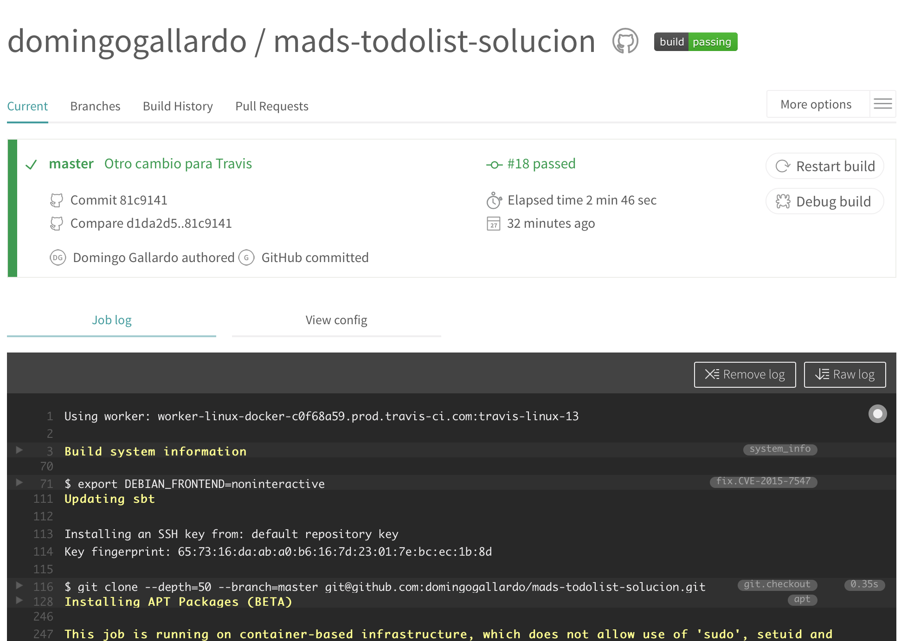

Comienza abriendo un nuevo _issue_ llamado `Integración con Travis` en
el que desarrollarás esta integración.

### 4.1. Cómo darse de alta en Travis y conectar el repositorio

Para darte de alta en Travis debes acceder a
[travis-ci.com](https://travis-ci.com) autentificándote con tu cuenta
de GitHub.

Debes seguir las instrucciones que aparecerán para conectar el
repositorio de la práctica 3 con Travis. 

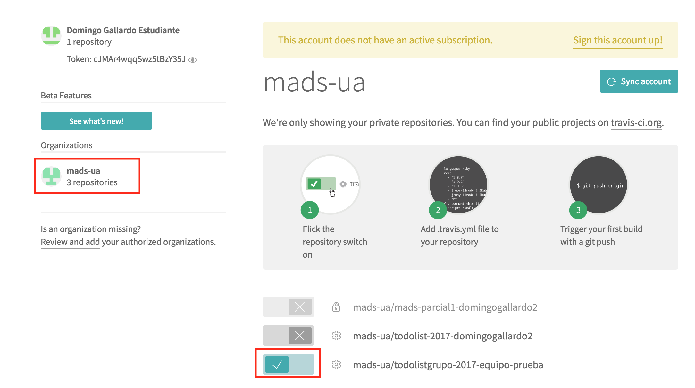

Comprueba en los ajustes que el repositorio se ha conectado
correctamente con Travis:
 
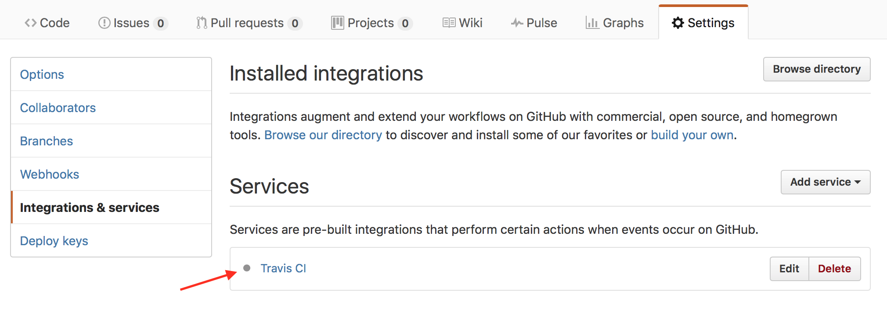

### 4.2. Cómo configurar el build en Travis

El build en Travis se configura con el fichero `.travis.yml` que debe
estar en la raíz del repositorio. En este fichero se incluye las
instrucciones para compilar y ejecutar los tests del proyecto.

Crea un nuevo _issue_ llamado `Integración con Travis` y una rama
nueva en el repositorio local. Añade el siguiente fichero de
configuración `.travis.yml` y sube la rama al repo remoto en GitHub.

**Fichero `.travis.yml`**: 

```
sudo: required

language: bash

branches:
  only:
  - master
  - production

services:
  - docker

before_install:
   - docker build -t DOCKER-ID/mads-todolist-2017:0.2 .

script:
   - docker run --rm DOCKER-ID/mads-todolist-2017:0.2 /bin/bash -c "sbt test"
```

Podéis ver que el fichero de configuración de Travis construye la
máquina Docker y después la ejecuta, lanzando los tests en memoria. Si
pasan todos los tests Travis marcará como correcto el build.

Una vez hecho el push, Travis detectará automáticamente el cambio en
la rama y realizará el build. Podremos ver en tiempo real la ejecución
de los tests, en el frontal de Travis y en
`https://travis-ci.com/USUARIO/REPOSITORIO`.

Cuando pasen correctamente los tests podréis ver el tick en el commit
de GitHub.

### 4.3. Modificación del fichero .travis.yml y pull request ###

- Modifica el fichero `.travis.yml` para incluir como último paso la
ejecución también de los tests de integración ejecutándose contra una
máquina docker MySQL.

- Una vez comprobado que funciona correctamente, crea un pull request en
GitHub para cerrar el issue. 

  Travis lanzará una ejecución del build del pull request, en el que
  mezclará la rama del PR con la rama master. 

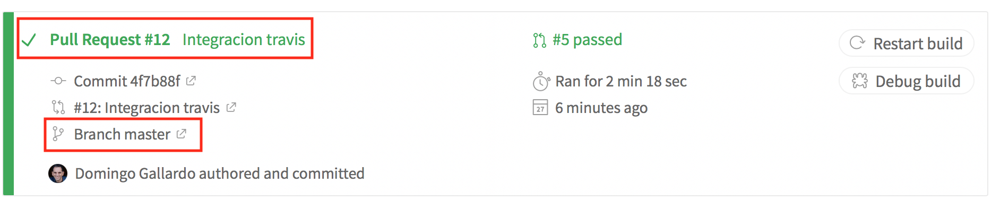

  GitHub nos informará también si los tests pasan correctamente y si
  podemos hacer la integración del pull request sin problemas.

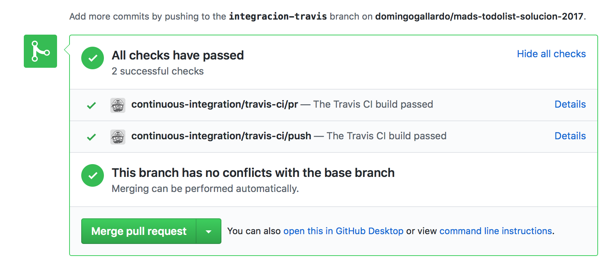

- Realizad el pull request y actualizad los repositorio locales.

### 4.4. Modificación del README del proyecto

Por último, subid un commit a `master` con un cambio en el `README.md`
para incluir en él una imagen que muestre el estado del último build
realizado en Travis. Lo debe hacer un miembro distinto del que ha
hecho el issue anterior. No hace falta crear un _issue_ para esta
modificación.

La imagen final del `README.md` deberá ser similar a la siguiente:

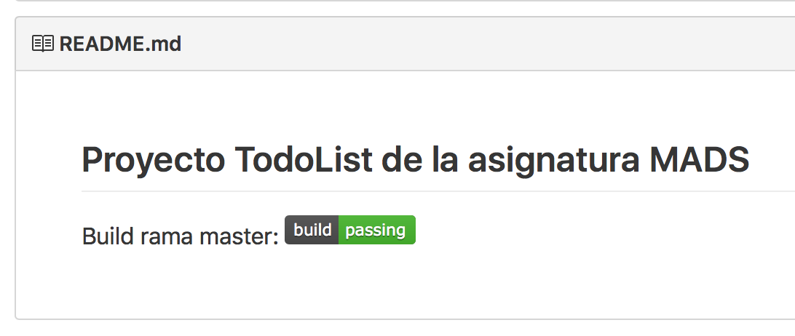

Puedes consultar cómo embeber esta imagen en la página de
documentación de Travis
[Embedding Status
Images](https://docs.travis-ci.com/user/status-images/). Cuidado con
indicar correctamente en la URL la rama de la que se va a obtener el
estado (debe ser `master`).

Comprueba que funciona correctamente subiendo un commit a master con
un fallo en algún test. Y sube después otro commit arreglándolo.


## 5. Nuevo flujo de trabajo en GitHub

Como ya tenemos equipos de trabajo, debemos adaptar el flujo de
trabajo tanto en GitHub a más de una persona.

Cambiaremos lo siguiente:

- **Selección del _issue_**: Al pasar un _issue_ de "Seleccionado" a "En
  marcha" se debe asignar un responsable.
- **Nueva rama con el _issue_**: El responsable será el que abra una
  rama nueva para el desarrollo del ticket y la subirá a
  GitHub.
- **Desarrollo**: Se trabaja en la rama. Cualquier compañero puede
  unirse al ticket y trabajar junto con el responsable.
- **Pull request**: Cuando el ticket se ha terminado, el responsable
  abre un pull request en GitHub y pone la tarjeta en la columna
  `En PR`.
- **Revisión de código**: Los miembros del equipo revisan el código en
  el pull request (consultar documentación en GitHub: [Reviewing
  proposed changes in a pull
  request](https://help.github.com/articles/reviewing-proposed-changes-in-a-pull-request/)). Al
  final, todos los miembros del equipo deben dar el OK, añadiendo una
  reacción.
- **Integración del pull request**: Cuando todos dan el OK, el
  responsable de la tarea integra el pull request en `master`.
- **Actualización de los repositorios locales**: Todos hacen un `pull`
  en `master` para actualizar los cambios del pull request. Y se borra
  la rama local ya integrada.

A continuación explicamos con más detalle algunos aspectos del flujo
de trabajo.

### 5.1. Comandos Git para el trabajo en equipo ###

Veamos algunos comandos de Git relacionados con el trabajo compartido
con repositorios remotos.

- Subir una rama al repositorio remoto:

    ```
    $ git checkout -b nueva-rama
    $ git push -u origin nueva-rama
    ```

- Descargar una rama del repositorio remoto:

    ```
    $ git fetch 
    $ git checkout -b nueva-rama origin/nueva-rama
    ```

    El comando `git fetch` se descarga todos los cambios pero no los
    mezcla con las ramas locales. Los deja en ramas cacheadas a las
    que les da el nombre del servidor y la rama
    (`origin/nueva-rama`). 

    En el caso del comando anterior, una vez cacheada la rama
    `origin/nueva-rama` se crea la `nueva-rama` local con todos sus
    commits.

- Actualizar una rama con cambios que otros compañeros han subido al
  repositorio remoto:

    ```
    $ git checkout nueva-rama
    $ git pull
    ```

    El comando `git pull` es equivalente a un `git fetch` seguido de
    un `git merge`. Algunos recomiendan no usar `git pull`, sino hacer
    siempre el merge manual. Por ejemplo:

    ```
    $ git checkout nueva-rama
    $ git fetch
    $ git merge origin/nueva-rama
    ```

- Subir cambios de la rama actual:

    ```
    (estando en la rama que queremos subir)
    $ git push
    ```

    El comando `git push` funcionará correctamente sin más parámetros
    si previamente hemos subido la rama con un `git push -u`.

- Comprobar el estado de las ramas locales y remotas:

    ```
    $ git branch -vv
    ```

    Este comando no accede directamente al servidor, sino que muestra
    la información de la última vez que se accedió a él. Si queremos
    la información actualizada podemos hacer un `git fetch --all`
    antes:

    ```
    $ git fetch --all
    $ git branch -vv
    ```

    Es importante recordar que `git fetch` (a diferencia de `git
    pull`) no modifica los repositorios locales, sino que baja las
    ramas remotas cachés locales.

- Información de los repositorios remotos:

    ```
    $ git remote show origin
    ```

    Proporciona información del repositorio remoto, todas sus ramas,
    del local y de la conexión entre ambos.

    ```
    git remote -v update
    ```

    Proporciona información del estado de las ramas remotas y locales
    (si están actualizadas o hay cambios en algunas no bajadas o
    subidas).

- Borrado de ramas remotas desde el terminar:

    ```
    $ git push origin --delete nueva-rama
    $ git remote prune origin
    ```

### 5.2. Desarrollo de una página "Acerca de" ###

Probar todos los comandos anteriores en una rama en la que se
implemente la página "Acerca de" en la que se muestre una con los
miembros del equipo y el número de versión de la aplicación
(0.3-SNAPSHOT).

Crear un _issue_ en el que participen todos los miembros del
equipo. Crear una rama en la que desarrollar los cambios. Cada miembro
del equipo deberá realizar un commit en el que se añade su nombre a la lista.

Crear el pull request en GitHub, revisar el código y aceptarlo.

### 5.3. Configuración de la rama production y publicación de v1.0 ###

El flujo de trabajo Git que vamos a seguir es muy similar al flujo de
trabajo GitFlow (recordad la [clase de
teoría](https://github.com/domingogallardo/apuntes-mads/blob/master/sesiones/07-git-workflows/git-workflows.md)). Pero
vamos a introducir alguna variante en la nomenclatura de las ramas.

#### Ramas de largo recorrido ####

En la versión original de GitFlow se publican las distintas versiones
del proyecto en la rama _long-lived_ `master` y se hace el desarrollo en
la rama `develop`. Nosotros vamos a adoptar esta idea, pero cambiando
el nombre de las ramas. La rama de desarrollo será la rama
**`master`** en la que hemos trabajado desde el principio, y la rama
con las versiones lanzadas la llamaremos **`production`**.

#### Ramas de feature ####

Desde el comienzo de trabajo con Git en las prácticas 1 y 2 estamos
haciendo un desarrollo basado en ramas de corto recorrido,
equivalentes a las ramas de _features_ de GitFlow. 

La diferencia es que en GitFlow estas ramas se integran con la rama de
desarrollo manualmente haciendo `merge`, mientras que nosotros las
integramos haciendo un pull request.

#### Configuración paso a paso ####

El equipo elegirá un responsable de integración que se encargue de
crear la rama **`production`** y publicar en ella la primera versión
**v1.0** del proyecto. 

Cread un _issue_ con la tarea `Lanzar release v1.0` que tendrá como
responsable esta persona escogida.

Una vez que se ha integrado en `master` el pull request con la página
"Acerca de" que contiene la lista de desarrolladores del proyecto y el
número de versión "Versión 0.3-SNAPSHOT", el responsable de
integración deberá publicar la nueva versión siguiendo los pasos de GitFlow:

- Crear la rama `production` y publicarla en GitHub.
- Crear la rama local `release-v1.0` a partir de `master`.
- Realizar en esta rama los cambios específicos de la versión. En
  nuestro caso:
  - Cambiar en la página "Acerca de" "Versión 0.3-SNAPSHOT" por
    "Versión 1.0"
  - Añadir en la página la fecha de publicación de la versión.
  - Cambiar la versión en el `build.sbt` a `1.0`.
- Publicar la rama `release-v1.0` en GitHub y hacer un pull request
  sobre `production`.
- Mezclar también la rama de release con `master`.
- Por último, hacer un commit en `master` cambiando el número  de
  versión a `1.1-SNAPSHOT` (en el "Acerca de" y en el `build.sbt`).

Una vez hecho esto ya se puede borrar la rama `release-v1.0` y las
ramas `production` y `master` estarán actualizadas a las nuevas
versiones.

La rama `production` también será integrada por Travis. Debemos
comprobar que pasan todos los tests.

### 5.4. Publicación automática de nuevas versiones ###

Implementad en `master` un nuevo _issue_ en el que hagáis lo siguiente:

   - Modificar el fichero de configuración de Travis para que la
     versión de la máquina docker sea la definida por el número de
     build de Travis (en la variable de entorno
     `TRAVIS_BUILD_NUMBER`).
   - Añadir en la configuración de Travis la publicación de la máquina
     docker en Docker Hub cada vez que se realice un build en la rama
     `master` (consultar en la página de información de Travis [Using
     Docker in
     Builds](https://docs.travis-ci.com/user/docker/)). Deberéis
     publicar dos versiones de la máquina: la versión con el último
     número de build y la versión `latest`. De esta forma, en Docker
     Hub estará siempre actualizada la versión `latest` a última
     versión compilada en `master` y también se tendrá un histórico de
     todas las versiones compilads.

## 6. Desarrollo de características adicionales en equipo ##

En esta parte desarrollaréis tres características (historias de
usuario) adicionales en el proyecto. 

Debéis definir una página en la wiki para cada una de ellas, y crear
la página principal de la wiki con el título **Versión 1.1** y con dos
tablas (_pendientes_ y _terminadas_) que contenga los títulos, enlaces
y una breve descripción de cada una de las características (como hemos
hecho en la wiki en las prácticas 1 y 2).

También igual que en las prácticas 1 y 2, se creará una etiqueta para
cada una de las historias de usuario y se marcarán con ella los
_issues_ que las conforman. Una de historia de usuario puede contener
varios _issues_ o sólo uno.

También se marcarán los issues/pull requests con el `milestone 1.1`, que
será el número de versión definitiva de la aplicación cuando se
termine esta práctica 3.

Cada historia de usuario deberá tener un responsable distinto, que
será se encargará de realizar la formulación de la historia en
la página wiki, descomponerla en issues y de probar que se cumplen las
condiciones de satisfacción antes de darla por terminada. Escribid el
responsable de la historia en su página.

Aunque lo normal es que los issues en los que se descompone una
historia tengan el mismo responsable que la historia, también se
pueden definir otros responsables (por ejemplo, si es un _issue_
orientado a crear las vistas y en el equipo hay una persona que domina
Bootstrap y el diseño de interfaces de usuario).

### 6.1. Funcionalidades adicionales ###

Proponemos tres historias de usuario pequeñas, que se pueden
desarrollar todas en una semana. Para las historias 2 y 3 se deben
realizar tests, como hemos venido haciendo en las prácticas 1
y 2. Aunque no es obligatorio, puedes desarrollarlas usando TDD.

1. Arreglo de la interfaz de usuario de tareas y tableros, definiendo
   una [barra de
   navegación](https://bootstrapdocs.com/v3.3.6/docs/components/#navbar)
   de Bootstrap con las opciones: `TodoList` (título de la aplicación), `Mis tareas`
   (enlace a la página de tareas), `Mis tableros` (enlace a la página de
   tableros) y a la derecha un desplegable con el nombre del usuario y
   las opciones `Perfil` (enlace al perfil, si está implementado) y
   `Salir` (salir y enlace a login).

2. Añadir los siguientes campos adicionales a la tarea :
   `fechaCreacion`. Poner como fecha de creación la fecha y hora en la
   que se crea la tarea (hacerlo de forma automática, sin pedírselo al
   usuario, ni que el usuario pueda modificarlo). Y dejar que el
   usuario introduzca opcionalmente la fecha límite en la página de
   creación/edición de una tarea.
   
   En la tabla con el listado de tareas no mostrar la fecha de
   creación (es un atributo interno, que por ahora no mostramos) pero
   sí la fecha límite.

3. Añadir un campo adicional de `terminado` a las tareas. Añadir una
   acción en el listado de tareas para terminar una tarea. En el
   listado de tareas aparecerán solo las tareas que no se hayan
   terminado. Pon un enlace `Terminadas` para mostrar las tareas terminadas.

Si queréis incluir alguna funcionalidad opcional que hayáis
implementado, podéis hacerlo además de lo anterior. Debéis añadir la
página correspondiente con la funcionalidad en la wiki.

### 6.2. Publicación de la versión 1.1  ###

Una vez terminadas y probadas todas las historias de usuario, se
deberá crear una rama para la versión 1.1 e integrarla en la rama
`production` tal y como se ha hecho con la versión 1.0. 

Realizar en la rama de versión los commits necesarios para el cambio
de versión (en el fichero `build.sbt` y en la página `Acerca de`) y
para actualizar los ficheros relacionados con el esquema de datos (el
fichero `schema.sql` y `upgradeXX.sql`).

Igual que se hizo con la versión 1.0, terminar integrando esta rama
también en `master` y modificando el número de versión a `1.2-SNAPSHOT`.

## 7. Entrega y evaluación ##

- La práctica tiene una duración de 2 semanas y debe estar terminada
  el martes 21 de noviembre.
- La calificación de la práctica tiene un peso de un 7% en la nota
  final de la asignatura.
- Para realizar la entrega uno de los miembros del equipo debe subir a
  Moodle un ZIP que contenga todo el proyecto, incluyendo la historia
  Git. Para ello comprime el directorio local del proyecto **después
  de haber hecho un `clean`**. Debes dejar también en Moodle la URL
  del repositorio en GitHub.

Para la evaluación se tendrá en cuenta:

- Desarrollo continuo (los _commits_ deben realizarse a lo largo de
  las 2 semanas y no dejar todo para la última semana).
- Correcto desarrollo de la metodología.
- Corrección del código.


<!--

## 5. Representación de _features_ en Trello

Una _feature_ (funcionalidad) va a agrupar varios tickets. Vamos a
guardar las _features_ en el mismo tablero, pero usando **etiquetas**
para poder visualizarlas y filtrarlas fácilmente. También utilizaremos
una nomenclatura especial para numerarlas.

Cada funcionalidad en desarrollo tendrá una etiqueta específica, que
pondremos en todos los tickets de esa funcionalidad. De esta forma
podemos filtrar por esa etiqueta y observar rápidamente todos los
tickets asociados.

Todas las funcionalidades (en cualquier estado: en espera, desarrollo
o terminadas) tendrán una etiqueta especial denominada `Feature`
(color amarillo). Sólo se debe asignar esa etiqueta a las
funcionalidades, no a los tickets asociadas. De esta forma podremos
filtrar por esa etiqueta y observar sólo las funcionalidades que hay
en el tablero.

En cuanto a la **nomenclatura**, precederemos el nombre de la
funcionalidad con el prefijo "FT-1", "FT-2", ... (de _FeaTure_). Y los
tickets asociados a cada funcionalidad los numeraremos con dos
números: primero el correspondiente a la funcionalidad y después un
número correlativo correspondiente al número de ticket. Por ejemplo:
"TIC-1.1", "TIC-1.2".

Por ejemplo, podríamos definir la funcionalidad "FT-1 Gestión
básica de tareas" con la descripción:

```
FT-1 Gestión básica de tareas:
Un usuario deberá poder listar, añadir, borrar y modificar tareas,
para poder visualizar las tareas que está realizando
```

Y esta funcionalidad podría tener los siguientes tickets: "TIC-1.1
Entidad tarea", "TIC-1.2 Añadir tarea por usuario", "TIC-1.3 Listar
tareas de un usuario", ...

Las siguientes imágenes muestran un ejemplo.

Suponemos que se ha definido una funcionalidad llamada "FT-1 CRUD
Tareas" y que hemos creado 4 tickets: 

- "TIC-1.1 Listar tareas de usuario" (terminado)
- "TIC-1.2 Añadir tarea a usuario" (en pull request)
- "TIC-1.3 Borrar tarea de un usuario" (en pull request)
- "TIC-1.4 Editar tarea de usuario" (en marcha). 

El tablero se vería de la siguiente forma:

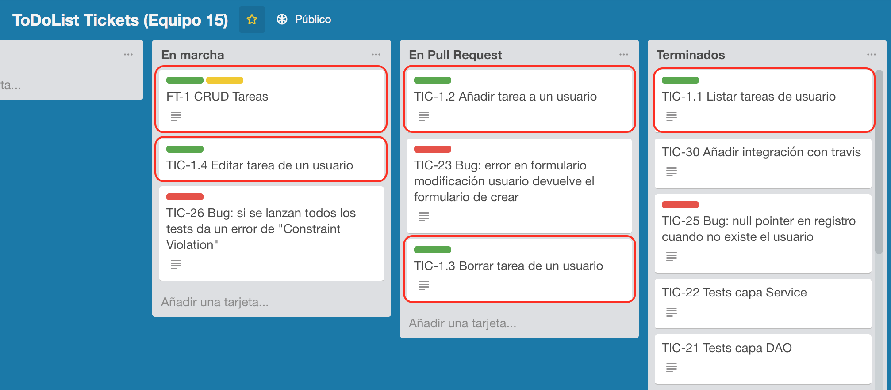

Las etiquetas creadas son las siguientes:

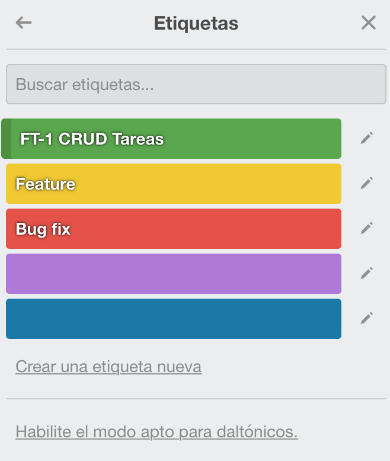

Las etiquetas son muy útiles para filtrar las tarjetas. Por ejemplo,
podemos definir un filtro para mostrar únicamente la etiqueta "CRUD
Tareas" (y sus tickets):

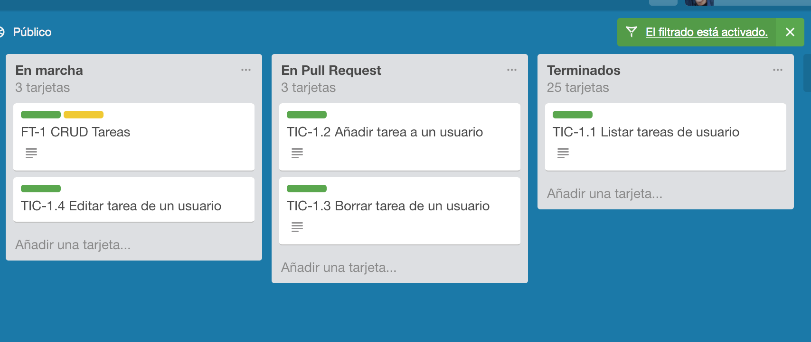

El filtro es el siguiente:

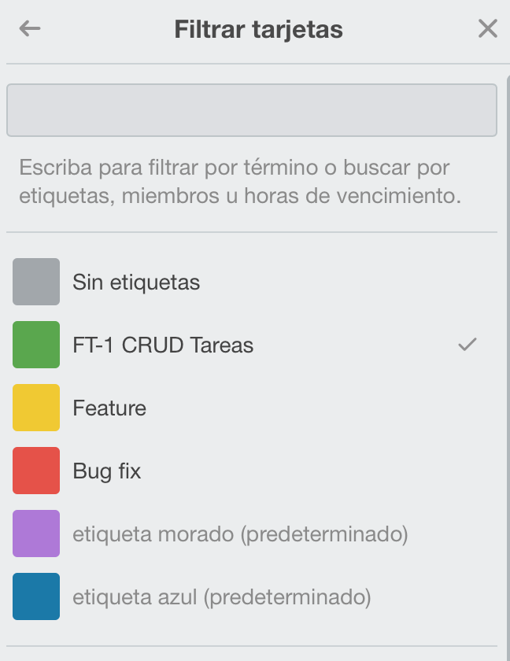

También podríamos ver sólo las tarjetas de tipo _Feature_:

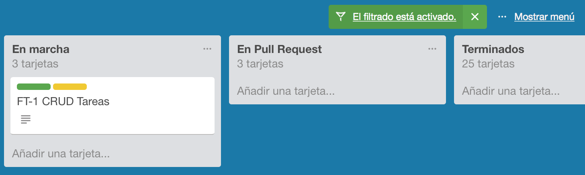

## 6. Desarrollo de 2 features en equipo

Utilizando el flujo de trabajo visto, tenéis que implementar y
documentar dos funcionalidades nuevas.

Junto con cada _feature_ se debe incluir una documentación técnica y
de usuario que explica brevemente los cambios introducidos por la
funcionalidad. En la documentación técnica se debe explicar los
cambios añadidos en cada una de las capas de la aplicación. Y en la
documentación de usuario una breve explicación de la funcionalidad con
alguna imagen explicativa de las pantallas y elementos de interacción
que intervienen.

### 6.1. Feature 1: Login, registro y tamaño estimado de tareas

Tamaño: pequeño.

**Funcionalidad**: Un usuario podrá utilizar la aplicación para
logearse, gestionar sus tareas y sus datos y salir. Se puede asignar
un tamaño estimado a cada tarea. El tamaño puede tener uno de los
siguientes valores: pequeño, mediano o grande.

Las pantallas deben estar organizadas de forma que la navegación por
las distintas opciones sea sencilla y lógica. No gestionaremos la
seguridad (proteger las URLs para que sólo un usuario puede acceder a
sus datos), eso lo dejamos para el futuro.

### 6.2. Feature 2: Proyectos 

Tamaño: mediano.

**Funcionalidad**: Un usuario podrá agrupar las tareas por proyectos
para organizarlas mejor. En principio, un proyecto tendrá únicamente
un nombre.

El usuario podrá crear, cambiar el nombre y borrar proyectos. Deberá
poder asignar tareas a proyectos y presentar de forma organizada las
tareas, ordenadas por proyectos.

### 7. Publicación de la versión 1.1

**Una vez terminada la documentación** (la documentación debe estar
incluida en la release) el responsable de integración abrirá la nueva
rama `release-v1.1`, hará allí los cambios propios de la release (el
número de versión y la fecha de publicación) y realizará el pull
request para publicar la versión en `production`.


## 8. Entrega y evaluación

- La práctica tiene una duración de 3 semanas y debe estar terminada
  el **martes 15 de noviembre**.
- La calificación de la práctica tiene un peso de un 5% en la nota
  final de la asignatura.
- Durante el desarrollo se debe añadir el código en el repositorio en
  GitHub `mads-todolist` compartido con el profesor, y los tickets en
  el tablero Trello compartido con el profesor.
- En la fecha de la entrega se debe subir a Moodle un ZIP que contenga
  todo el proyecto y dejar la URL del repositorio en GitHub

Para la evaluación se tendrá en cuenta:

- Desarrollo contínuo (commits realizados a lo largo de las 3 semanas)
- Buen desarrollo y descripción de los cambios (commits bien
  documentados, ordenados, ramas de características visibles en la
  historia de commits)
- Tablero Trello bien ordenado
- Correcto desarrollo de las funcionalidades de la práctica
- Cuidado en el aspecto de la aplicación, la terminación, control de
  errores
- Características adicionales desarrolladas
- Para cada funcionalidad se debe realizar un documento técnico y un
  pequeño manual de usuario. Escribir una página `.md` para cada
  funcionalidad nueva.


-->
