## Introducción a MADS

<kbd>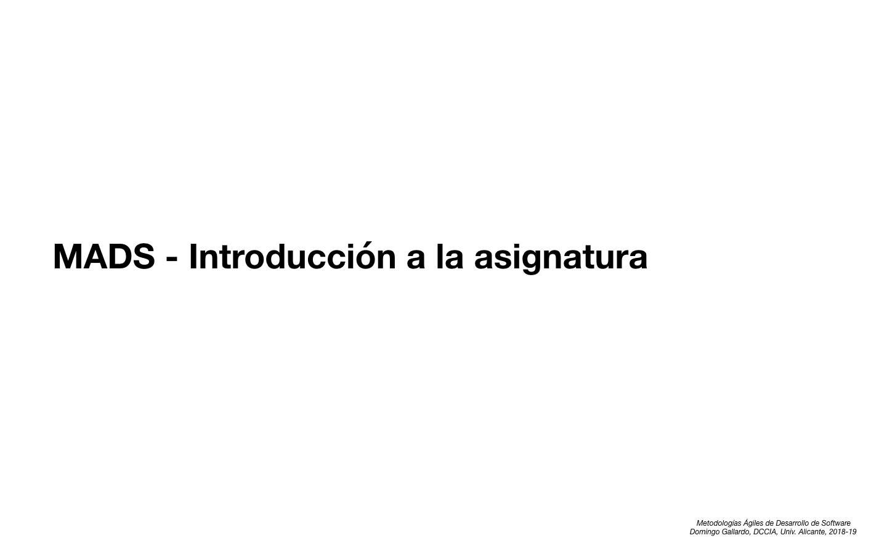</kbd>

<kbd>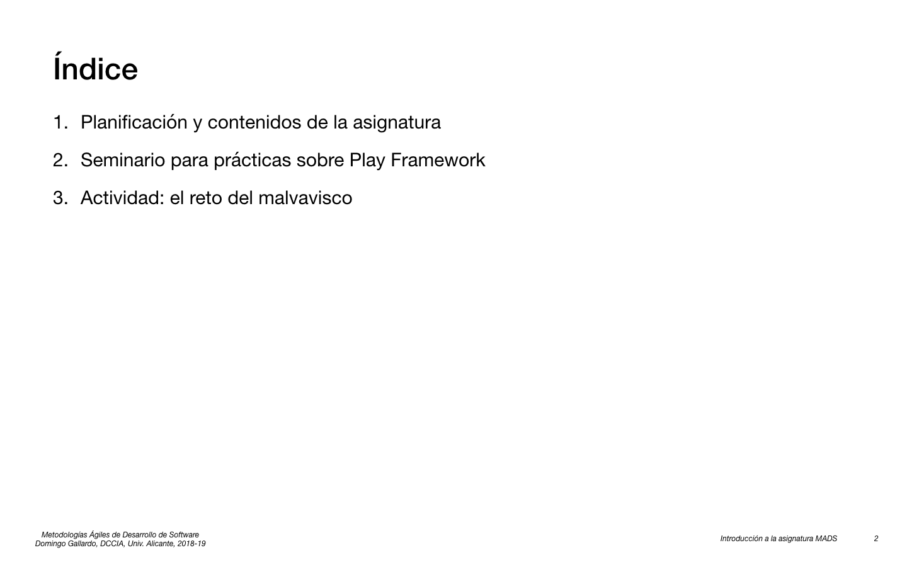</kbd>

<kbd>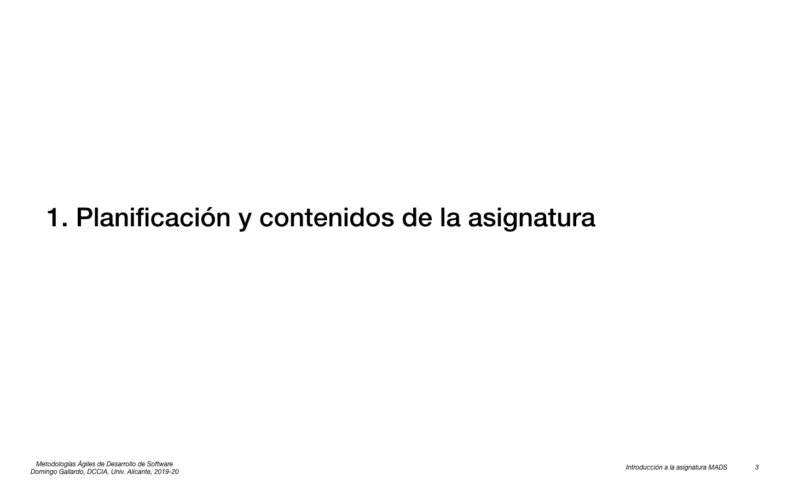</kbd>

<kbd>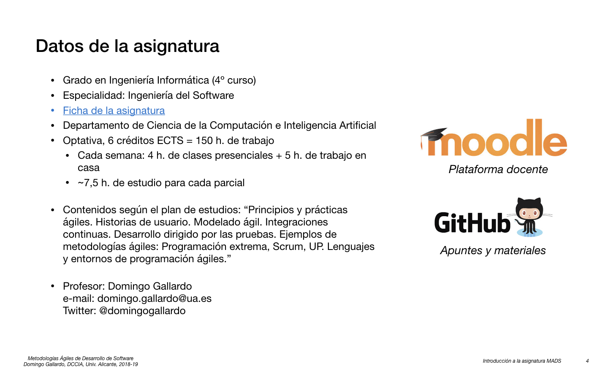</kbd>

Puedes consultar la ficha UA de la asignatura en
[este enlace](http://cv1.cpd.ua.es/ConsPlanesEstudio/cvFichaAsiEEES.asp?wcodasi=34037&wLengua=C&scaca=2019-20).

Herramientas docentes:

- [Moodle](https://moodle2019-20.ua.es/moodle/course/view.php?id=621):
  Utilizaremos Moodle para publicar semana a semana enlaces a los
  materiales en GitHub. También se realizarán las entregas finales de
  las prácticas (que se deberán ir subiendo también a GitHub). Y
  utilizaremos el foro de Moodle para poner en común dudas que os
  puedan surgir cuando estáis realizando los trabajos.

- [Apuntes y materiales en GitHub](https://github.com/domingogallardo/mads-ua):
  Los apuntes consisten en ficheros Markdown con algunas explicaciones
  sobre las diapositivas. Una ventaja de utilizar GitHub es que se
  podrá consultar los últimos cambios que se hayan introducido en los
  materiales.

  Los apuntes de las prácticas están compilados en un [sitio
  web](https://domingogallardo.github.io/practicas-mads/) donde es
  posible realizar búsquedas y navegar por secciones. 

<kbd>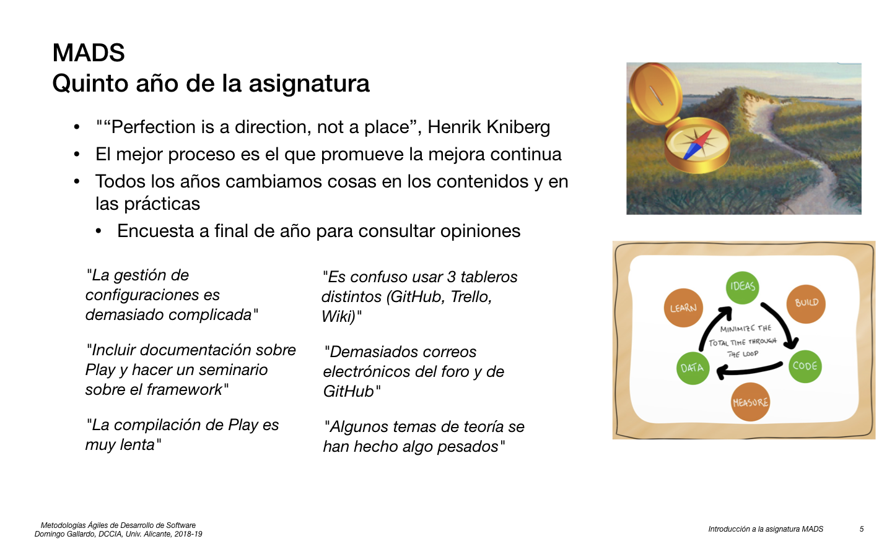</kbd>

- [Henry Kniberg](https://www.crisp.se/konsulter/henrik-kniberg) ha
  sido un importantísimo divulgador de las metodologías ágiles. Ha
  trabajado con grandes empresas como Spotify y Lego para implantar en
  ellas estas metodologías. Le gusta compartir todo lo que
  hace y muchos de los libros que ha escrito están en abierto. Vamos a
  utilizar muchos de sus materiales (diapositivas, vídeos, libros,
  artículos). Muy recomendable su
  [blog](http://blog.crisp.se/author/henrikkniberg).

- El ciclo "-> Ideas -> Code -> Data ->" es una versión del
  ciclo de mejora continua (consultar
  [Kaizen](https://en.wikipedia.org/wiki/Kaizen) en la Wikipedia) de las metodologías _lean_.

<kbd>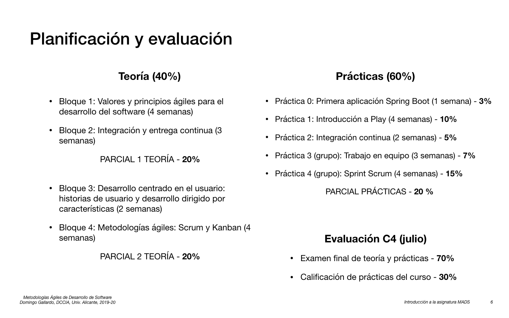</kbd>

- Hay una relación importante entre teoría y práctica:
    - En la metodología de desarrollo de la práctica 1 se introducen
      muchos elementos de integración continua y metodologías ágiles:
      historias de usuario, tablero de _issues_, desarrollo basado en
      ramas o _pull requests_.
    - En las prácticas 2 y 3 se aplican conceptos de pruebas,
      TDD, flujos de trabajo Git e integración continua que se
      imparten en el bloque 2 de teoría.
    - En el bloque 3 y comienzo del bloque 4 de teoría se introducen
      los conceptos de historias de usuario, Scrum y Kanban necesarios
      para la práctica 4.

- Las prácticas tienen un carácter incremental y cada una va
  introduciendo conceptos y técnicas que se van a utilizar en las
  siguientes. Las dos primeras son individuales y las dos siguientes
  serán en grupo. Los grupos deberán tener 3 personas.

- El **primer examen parcial de teoría** se realizará el **miércoles 13
  de noviembre de 2019** en el horario de teoría (de 11 a 13 h.). El segundo
  parcial de teoría y el examen de prácticas coincidirán con la fecha
  oficial del examen de la asignatura (**15 de enero de 2020**).

- En cuanto a la evaluación, el **40% por ciento** de la calificación
  será por la nota en los exámenes de teoría, el **40% por el
  desarrollo de las prácticas** y el **20% por el examen de
  prácticas**por. No hay examen final. Las preguntas de los parciales
  de teoría de tipo test y de respuestas cortas. El examen de
  prácticas se realizará en el laboratorio y consistirá en el
  desarrollo de una pequeña aplicación Spring Boot utilizando las
  tecnologías y metodología vistas en las prácticas.

<kbd>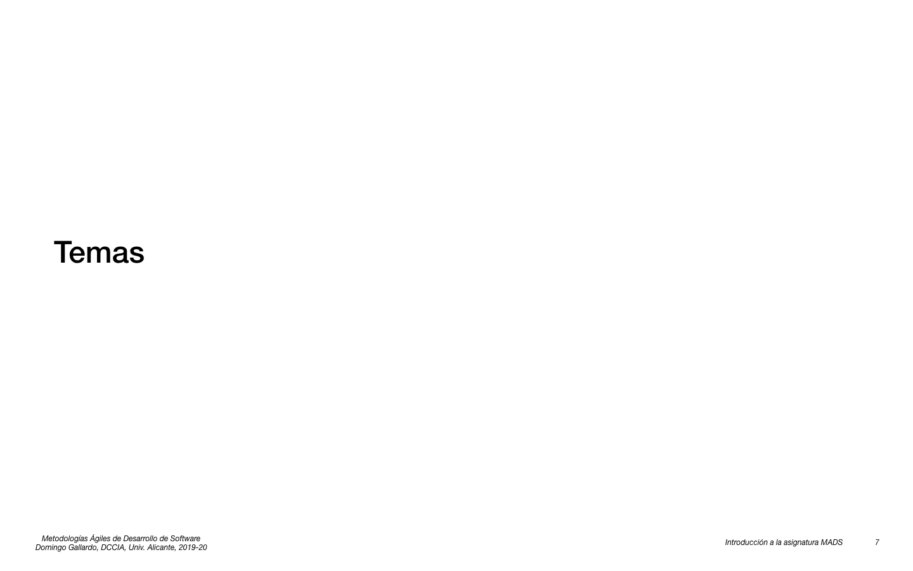</kbd>

<kbd>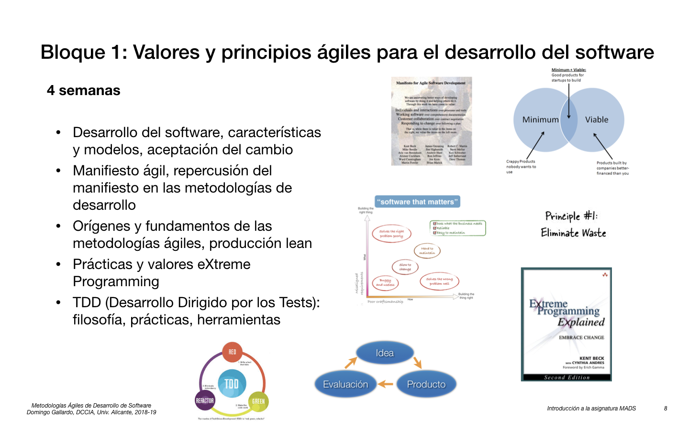</kbd>

<kbd>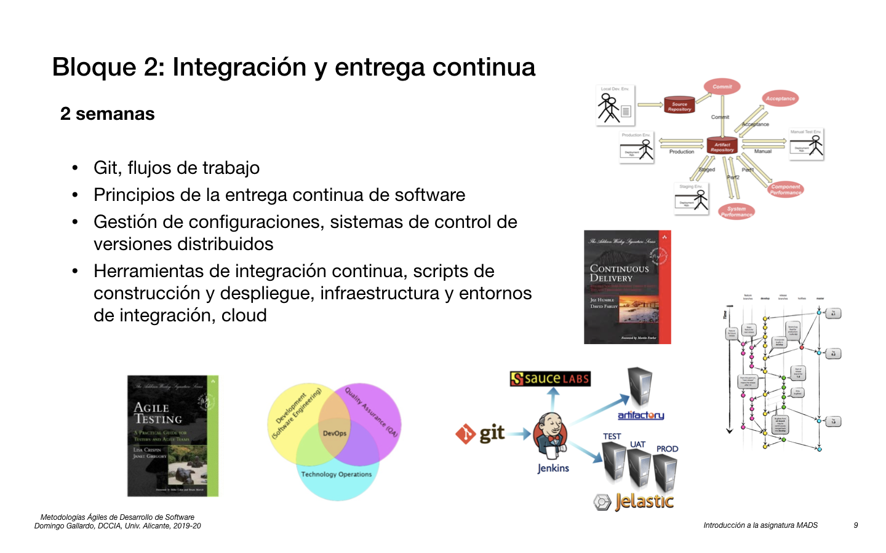</kbd>

<kbd></kbd>

<kbd>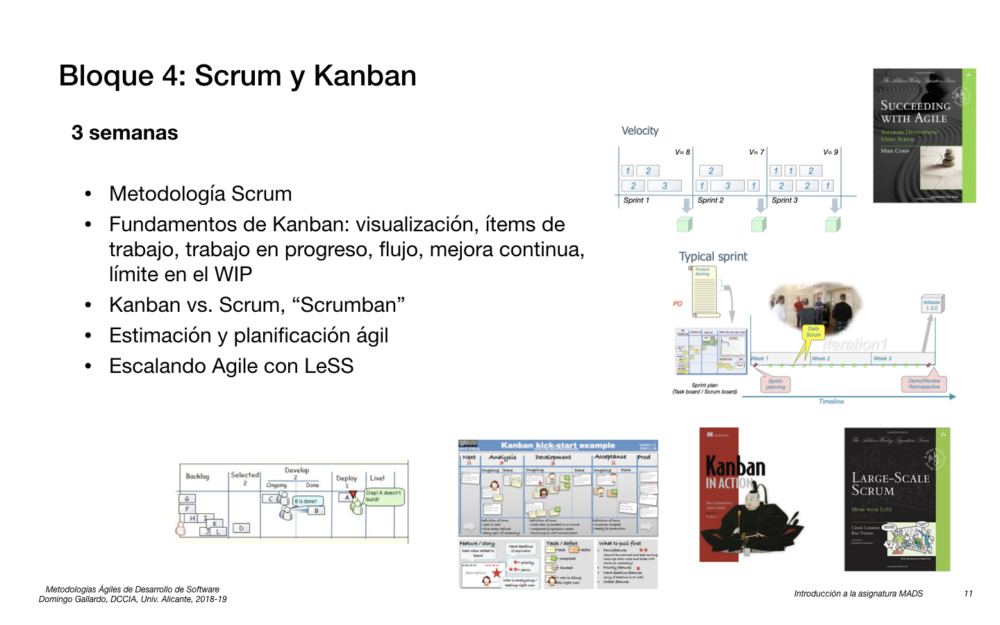</kbd>

<kbd>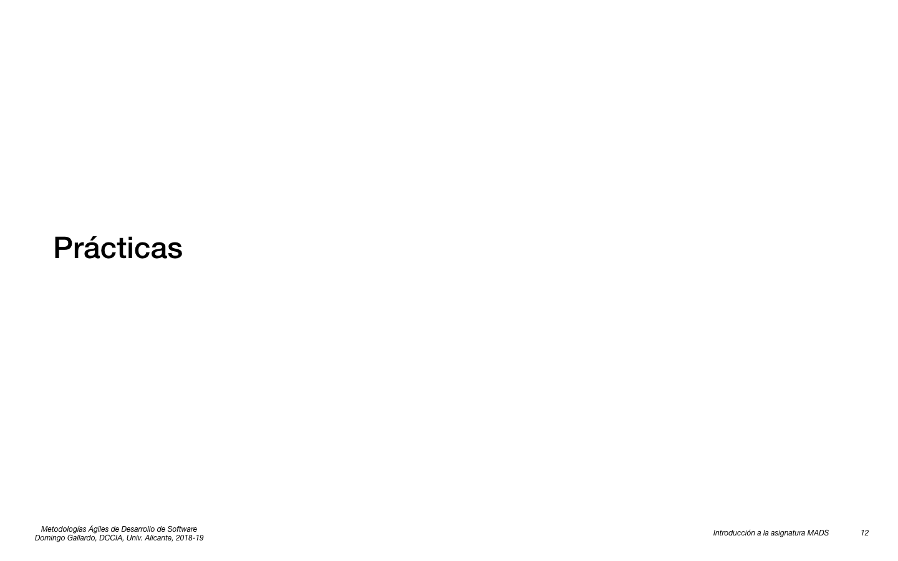</kbd>

<kbd>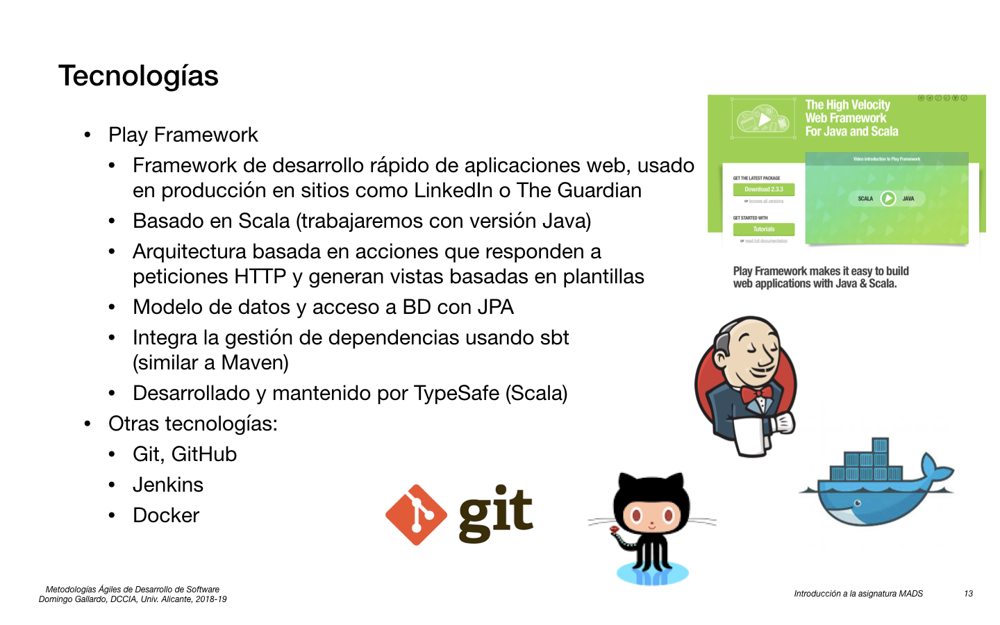</kbd>

Enlaces:

- [Spring Boot](https://spring.io/projects/spring-boot)
- [GitHub](http://github.com)
- [Git](https://git-scm.com/book/en/v2)
- [Travis](https://travis-ci.com)
- [Docker](https://www.docker.com)

<kbd>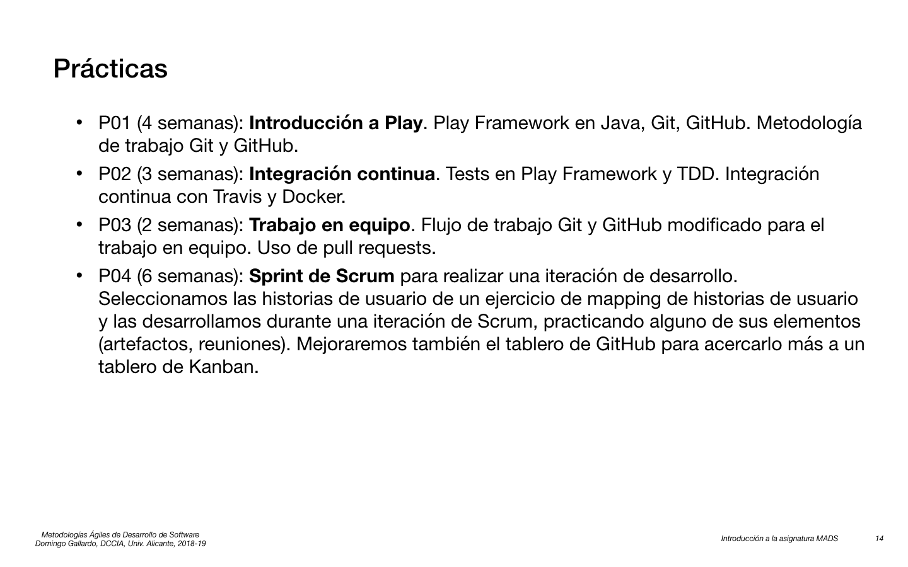</kbd>

<kbd>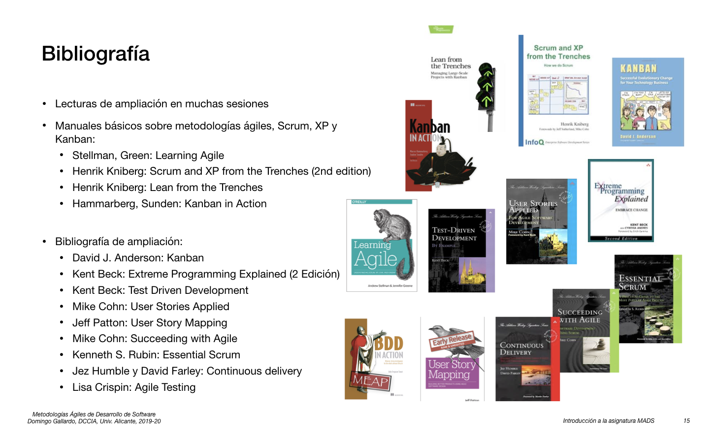</kbd>

Todos los libros se encuentran en la biblioteca (en formato físico y/o
digital), y alguno de ellos están disponibles on-line.

- Stellman, Green: Learning Agile -
  [Biblioteca UA](http://gaudi.ua.es/uhtbin/cgisirsi/0/x/0/05?searchdata1=9781449331924)
- Henrik Kniberg: Scrum and XP from the Trenches (2nd edition) -
  [On-line](https://www.infoq.com/minibooks/scrum-xp-from-the-trenches-2)
- Henrik Kniberg: Lean from the Trenches -
  [On-line](https://www.crisp.se/file-uploads/Lean-from-the-trenches.pdf)
- Hammarberg, Sunden: Kanban in Action -
  [Biblioteca UA](http://gaudi.ua.es/uhtbin/cgisirsi/0/x/0/05?searchdata1=9781617291050)
- David J. Anderson: Kanban -
  [Biblioteca UA](http://gaudi.ua.es/uhtbin/cgisirsi/0/x/0/05?searchdata1=9780984521401)
- Kent Beck: Extreme Programming Explained (2 Edición) -
  [Biblioteca UA](http://gaudi.ua.es/uhtbin/cgisirsi/0/x/0/05?searchdata1=0321278658)
- Kent Beck, Test Driven Development By Example [Biblioteca UA](http://gaudi.ua.es/uhtbin/cgisirsi/0/x/0/05?searchdata1=9780321146533)
- Mike Cohn: User Stories Applied -
  [Biblioteca UA](http://gaudi.ua.es/uhtbin/cgisirsi/0/x/0/05?searchdata1=9780321205681)
- Jeff Patton: User Story Mapping -
  [Biblioteca UA](http://gaudi.ua.es/uhtbin/cgisirsi/0/x/0/05?searchdata1=9781491904909)
- Mike Cohn: Succeeding with Agile -
  [Biblioteca UA](http://gaudi.ua.es/uhtbin/cgisirsi/0/x/0/05?searchdata1=0321579364)
- Kenneth S. Rubin: Essential Scrum -
  [Biblioteca UA](http://gaudi.ua.es/uhtbin/cgisirsi/0/x/0/05?searchdata1=9780137043293)
- Jez Humble y David Farley: Continuous delivery -
  [Biblioteca UA](http://gaudi.ua.es/uhtbin/cgisirsi/0/x/0/05?searchdata1=9780321601919)
- Lisa Crispin: Agile Testing -
  [Biblioteca UA](http://gaudi.ua.es/uhtbin/cgisirsi/0/x/0/05?searchdata1=9780321534460)

<kbd>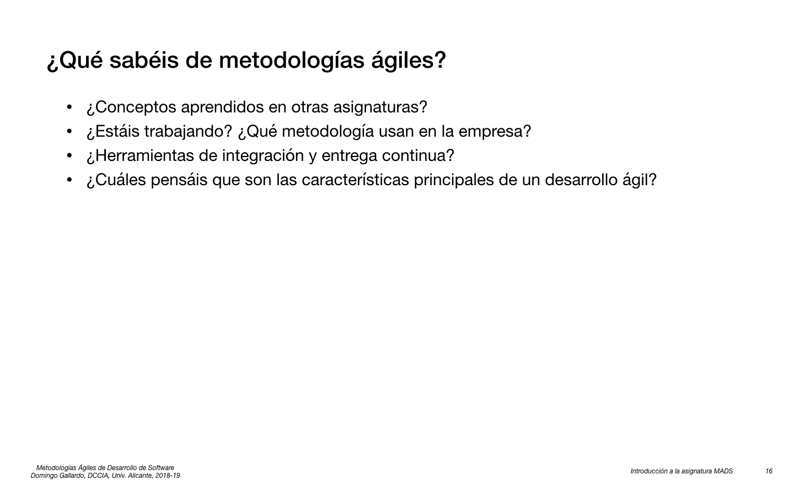</kbd>

- Un pequeño debate sobre qué conocéis a priori de las metodologías
  ágiles. Haremos un resumen en la pizarra.
  
<kbd></kbd>
<kbd>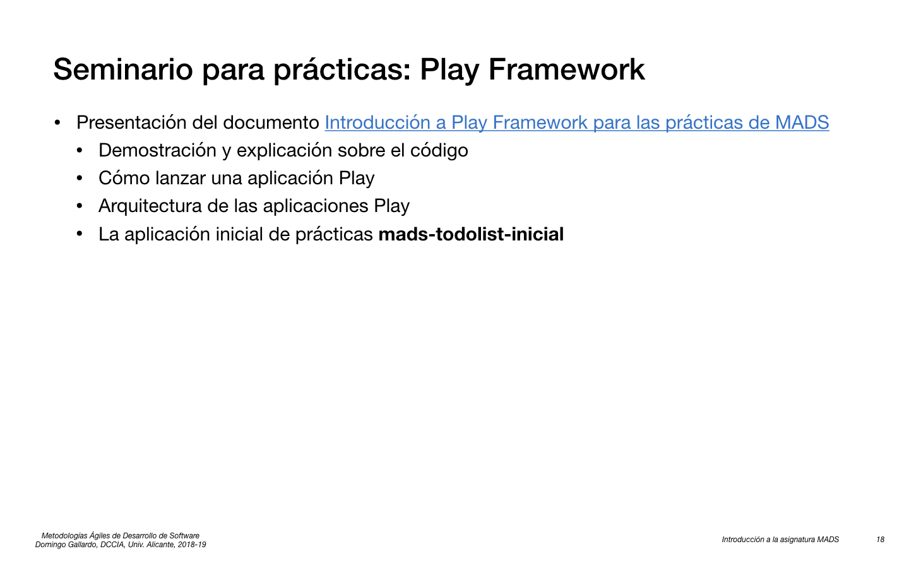</kbd>
<kbd>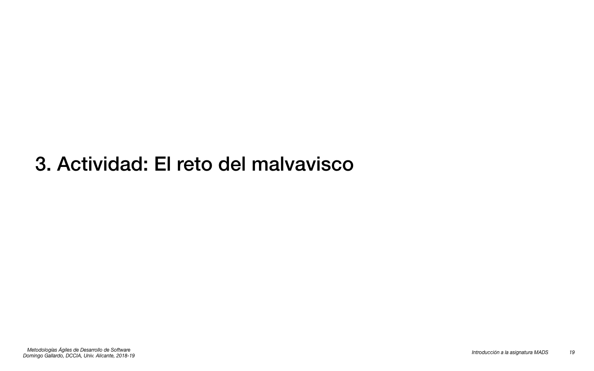</kbd>

<kbd>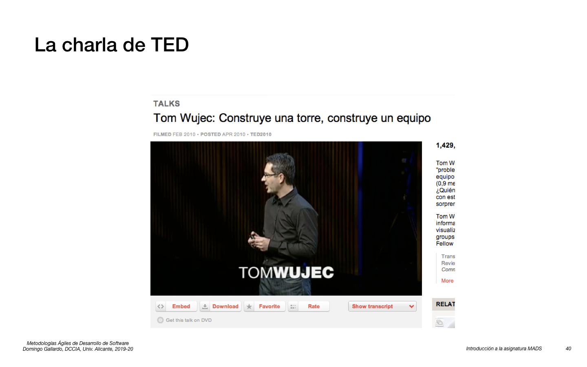</kbd>

- [La charla de TED](https://www.ted.com/talks/tom_wujec_build_a_tower?language=en)

<kbd>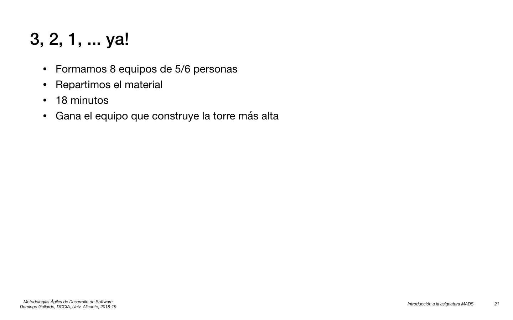</kbd>

