## Manifiesto ágil

<kbd>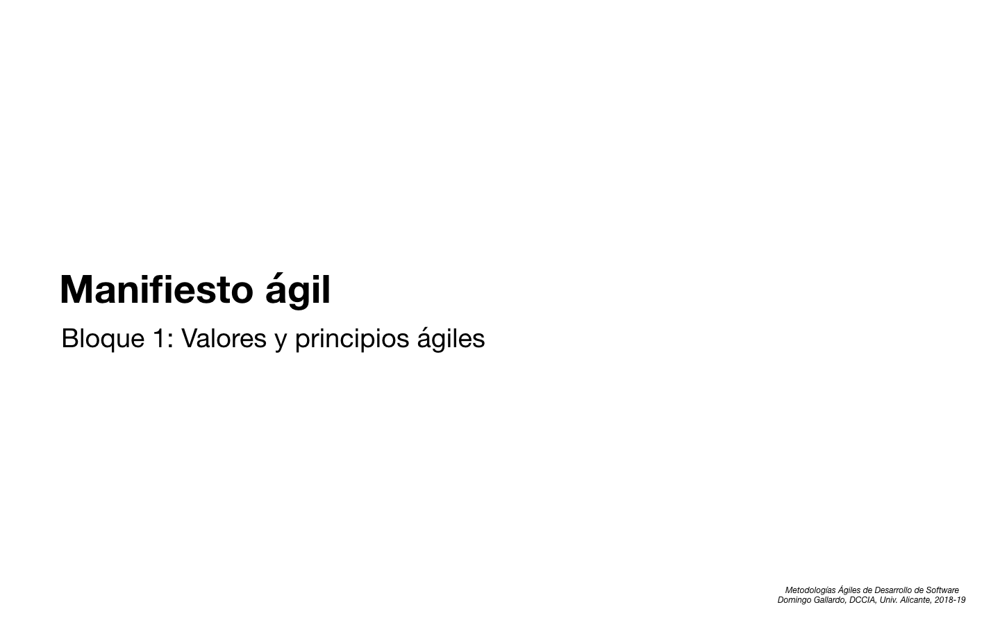</kbd>

<kbd>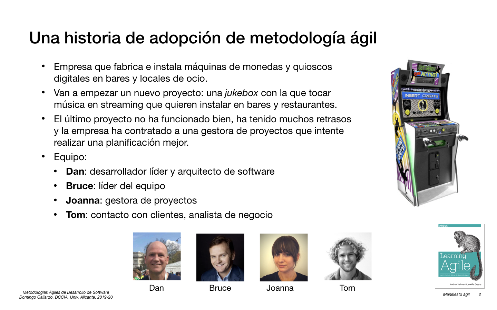</kbd>

- Vamos a ver un ejemplo de la adopción de metodologías ágiles en un
  equipo. Está sacado del libro _Learning Agile_ de Stellman y
  Greene. Suponemos una empresa que desarrolla máquinas de monedas y
  quioscos digitales:
    - Desarrollador líder / arquitecto (_lead developer and architect_)
    - Líder de equipo (_team leader_) un miembro más del equipo, que
      se encarga además de conseguir que el equipo tenga un propósito,
      visión común motivador, espíritu de equipo, atención a los
      individuos y que progrese y obtenga resultados. Objetivo:
      mejorar sus habilidades y comunicaciones.
    - Gestor de proyecto (_project manager_) que hace un seguimiento
      del desarrollo del mismo.
    - Conocedor del negocio y responsable de clientes (_business
      analyst_, _account manager_)

<kbd>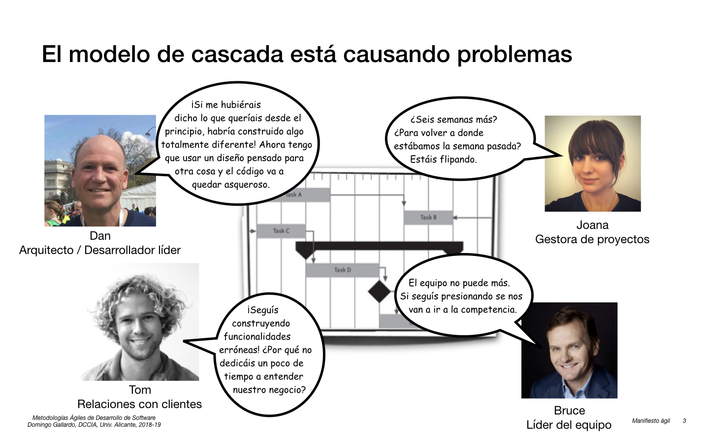</kbd>

- Recordemos que un buen proyecto software es aquel:
    - Que tiene las funcionalidades que necesita el cliente (_doing
      the right thing_)
    - Que tiene un código sin _bugs_, bien diseñado, mantenible, sin
      deuda técnica (_doing the thing right_)

- Hay equipos que si han tenido éxito desarrollando con waterfall
  (ejemplo: software para dispositivos médicos):
    - Los requerimientos están claros y se han completado carpetas
      llenas de documentación que apenas se consulta, porque todo el
      equipo la ha desarrollado y ha resuelto la mayoría de las dudas
      en el proceso de escribirla. La documentación refleja con
      detalle el producto que se tiene que desarrollar.
    - **Buena comunicación**, porque para desarrollar con éxito el
      proyecto el equipo debe hablar continuamente con usuarios,
      gerentes y ejecutivos.
    - **Buenas prácticas**, especialmente las de **revisión de
      código** y **pruebas automatizadas**, que se dirigen a detectar
      _bugs_ pronto en el desarrollo. El equipo reflexiona activamente
      sobre cómo se produjeron estos errores y cómo evitarlos en el
      futuro. En el desarrollo se usan entornos, lenguajes,
      herramientas y técnicas que facilitan la integración continua,
      minimizan los errores y automatizan las tareas repetitivas.

- Sin embargo el proceso de cascada no funciona bien la mayoría de las
  ocasiones:
    - En la mayoría de las ocasiones es muy difícil elaborar un
      documento de especificación (por ejemplo una documentación de un
      API REST) completo desde cero, sin que el cliente interactúe con
      algún tipo de prototipo o demostración.
    - No puede responder al cambio, porque se centra más en la
      documentación que en la colaboración.
    - Al estar los requerimientos y _deadlines_ del proyecto grabados
      en roca y ser inmutables, cualquier cambio de requisitos
      provocará un retraso que hará que el cliente quede descontento.

<kbd>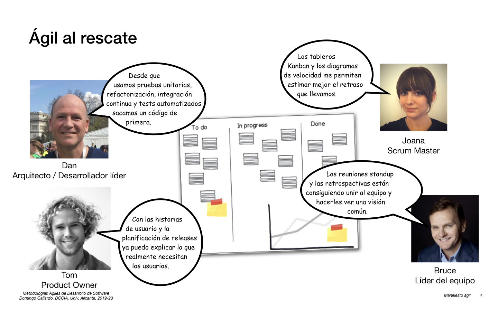</kbd>

- Cambios al introducir metodologías ágiles:
    - Desarrollador leader: introduce **diseño dirigido por los
      tests** (TDD, _Test Driven Design_) en el equipo, define un
      **script automatizado para el build** (_automated build script_)
      y pone en marcha un **servidor de integración** (_build
      server_).
    - Gestor de proyecto: aprende Scrum. Divide el proyecto en
      **iteraciones**, realiza un seguimiento del proyecto en el
      tablero de tareas, usando la **velocidad** del proyecto y
      diagramas de _burndown_.
    - El responsable de clientes empieza a elaborar **historias de
      usuario** para el equipo y ayuda al equipo a definir **planes de
      release** del producto.
    - El lider del equipo empieza a dirigir **reuniones diarias** y de
      **retrospectivas** en las que analizan el desarrollo.

- Por ejemplo, el uso de **historias de usuario** ha mejorado el
  trabajo de todos ellos:
    - Joanna, la gestora de proyecto que se está convirtiendo en una
      Scrum Master, ve una historia de usuario como un **trabajo
      pendiente de hacer**, empaquetar y construir. Es una tarjeta en un
      tablero con una estimación de tiempo y unos responsables, que
      ayuda a mantener a todo el mundo en el camino.
    - Dan, el arquitecto y desarrollador líder, ve una historia de
      usuario como una **pieza pequeña de funcionalidad**, escrita de una
      forma sencilla y fácil de entender. Puede descomponerla en
      tareas, crear una tarjeta para cada una de ellas, y escribir su
      nombre en la tarjeta cuando empieza a trabajar en ella. Cuando
      termina una tarea, la mueve a una sección del tablero reservada
      para las tareas completadas.
    - Tom, el propietario del producto, ve una historia de usuario
      como **valor que retornará a la empresa**, porque le permite ver una
      conexión clara entre lo que el equipo está construyendo y lo que
      los usuarios harán con el software una vez que esté
      terminado. Las historias de usuario le ayudan a hablar con los
      clientes, de forma que puede descubrir lo que buscan en el
      software de la _jukebox_, y se asegura de que cada historio
      representa algo que un usuario realmente necesita.
    - Bruce, el líder del equipo, ve una historia de usuario como un
      objetivo específico alrededor del que **el equipo puede
      organizarse**. Les ayuda a descubrir qué historias deberían
      hacerse a continuación, y usa los avances para mantenerlos
      motivados.

<kbd>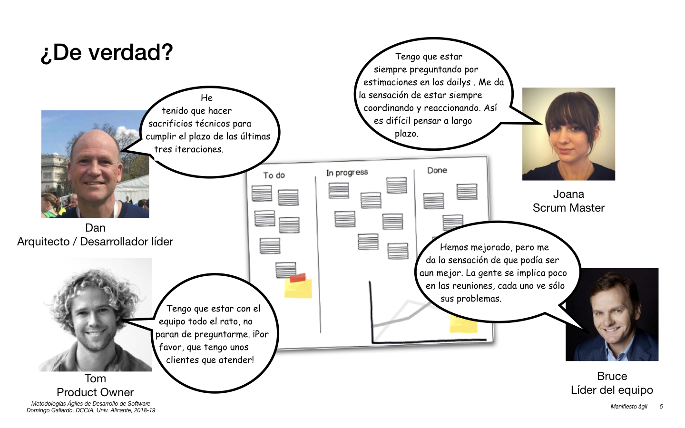</kbd>

- Se produce alguna mejora, pero no es se nota un aumento espectacular
  en la productividad ni en la calidad. El equipo no se ha convertido
  en híper-productivo:
    - Cada persona introduce alguna mejora en su ámbito de actuación.
    - Todos tienen algunas reservas que no les hace sentirse cómodos
      en sus nuevos roles.

<kbd>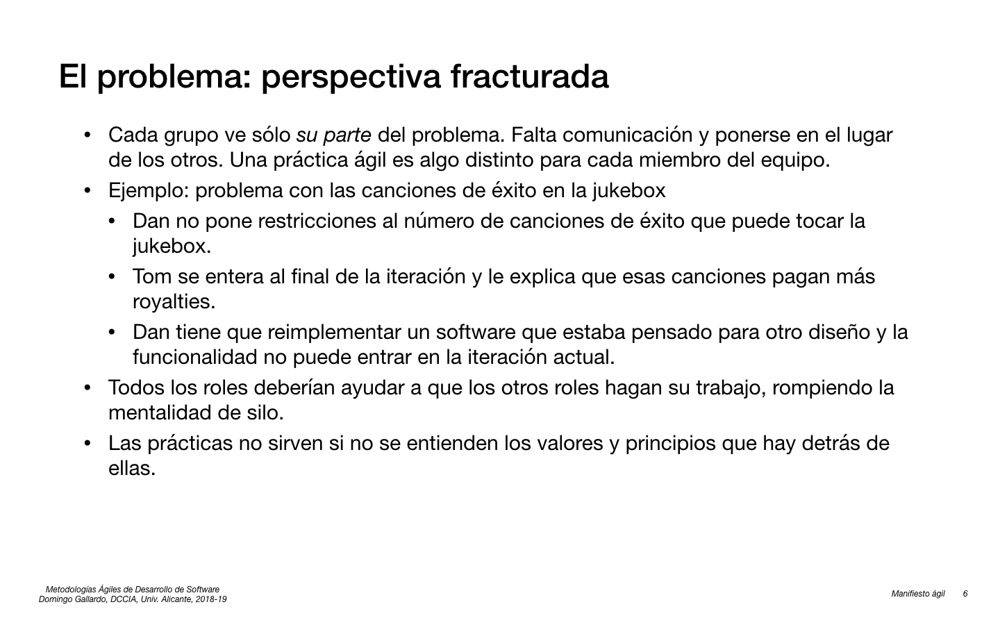</kbd>

- Pero no todo son bondades. Veamos un ejemplo, en el que
  Tom escribe una historia de usuario en la que indica que la
  _jukebox_ debe dar preferencia a los éxitos del momento. 

    - Dan hecha de menos una especificación detallada. La flexibilidad
      puede ser buena, pero también puede conducir a algunos problemas
      en el proyecto. Cuando Dan escribió el código para la historio
      de usuario del "éxito del momento", pensó que se trabaja de
      construir una funcionalidad que permitiera a los dueños del bar
      promocionar el último éxito en la _jukebox_ tan pronto como éste
      estuviera disponible en el servidor, para que los clientes la
      seleccionaran una y otra vez. Pero cuando le hizo una
      demostración a Tom al final de la iteración apareció un gran
      problema. Tom tuvo que explicarle que las canciones de más
      éxito tocadas en la _jukebox_ obligan al dueño del bar a pagar
      más royalties.

    Dan tuvo que reescribir una gran parte del software para poner
    un límite en el número de veces que se promociona una canción,
    dependiendo de los royalties que tiene que pagar. No pudo
    entregarlo al final de iteración, y Tom tuvo que quedar mal con
    los clientes porque esa funcionalidad no estaba implementada.

    Si Dan hubiera entendido todas las implicaciones que tenía
    la historia, y las necesidades y problemas de los clientes, le
    hubiera preguntado más a Tom antes de empezar a codificar. Y al
    revés, si Tom hubiera tomado el tiempo necesario para asegurarse
    de que Dan entendía todos los detalles de la historia antes de que
    empezara a implementarla tampoco hubiera sucedido el problema.

    Pero no tuvieron esa conversación, y el proyecto cayó en el
    mismo tipo de problemas que cuando estaban haciendo _waterfall_:
    desarrolladores que hacen suposiciones incorrectas, que saltan a
    programar y que tienen que hacer cambios en el código que podrían
    haberse evitado y que lo hacen más frágil.

    - Cuando una persona piensa sólo en su trabajo y no se da cuenta
      de lo que representa para el equipo completo (_whole team_) una
      herramienta, técnica o práctica ágil, puede suceder exactamente
      el mismo problema que le ha pasado a Dan y Tom. Este problema se
      denomina **perspectiva fracturada**, porque cada uno tiene una
      visión diferente de la práctica ágil.

    - El problema se denomina también **_silo mentality_** (mentalidad
      de silo): la empresa (o el equipo) se divide en grupos aislados,
      que no se comunican entre si y cada uno intenta maximizar su
      propio interés (local) a pesar de que eso pueda penalizar
      objetivos más globales.

- Solución: entender que tras la práctica hay un conjunto de
  **valores** que le dan significado y que todos deben compartir.

<kbd></kbd>

- [Sitio web](http://agilemanifesto.org) con el manifiesto ágil.

<kbd>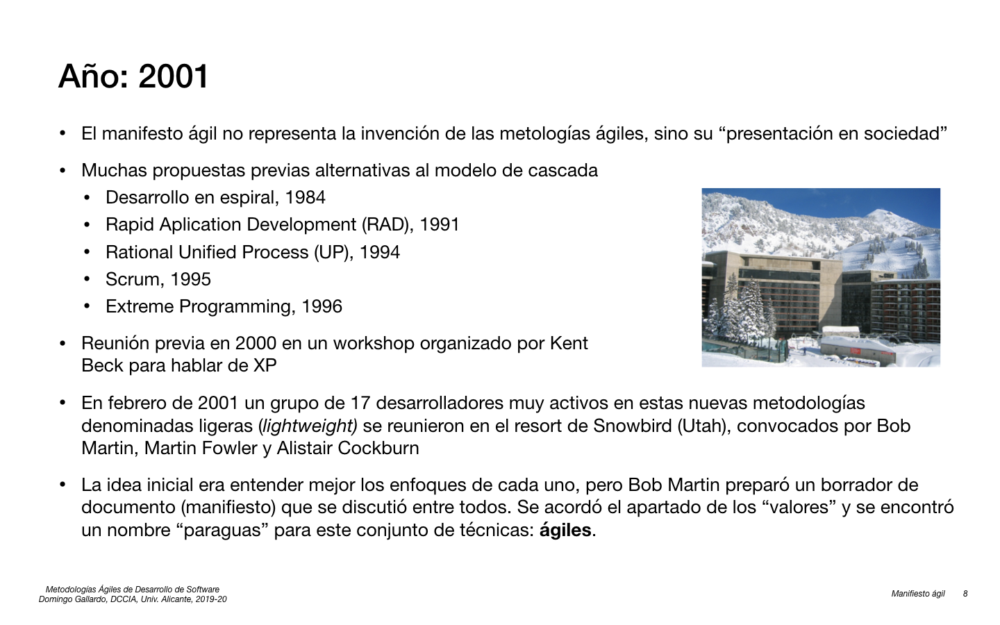</kbd>

<kbd>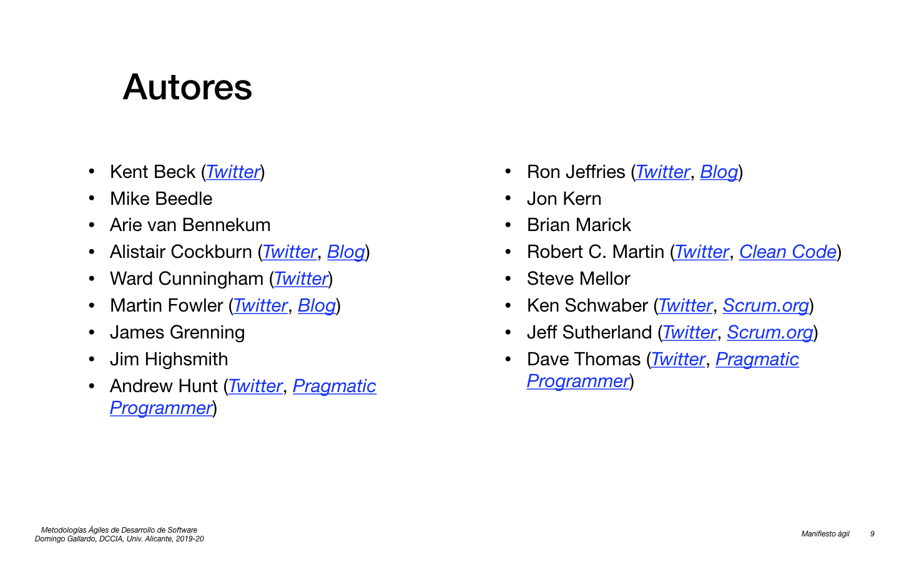</kbd>

- Kent Beck ([Twitter](https://twitter.com/KentBeck))
- Alistair Cockburn ([Twitter](https://twitter.com/TotherAlistair), [Blog](http://alistair.cockburn.us))
- Ward Cunningham ([Twitter](https://twitter.com/WardCunningham))
- Martin Fowler ([Twitter](https://twitter.com/martinfowler), [Blog](http://martinfowler.com))
- Andrew Hunt ([Twitter](https://twitter.com/pragmaticandy), [Pragmatic Programmer](https://pragprog.com))
- Ron Jeffries ([Twitter](https://twitter.com/RonJeffries), [Blog](http://ronjeffries.com))
- Robert C. Martin ([Twitter](https://twitter.com/unclebobmartin), [Clean Code](https://sites.google.com/site/unclebobconsultingllc/))
- Ken Schwaber ([Twitter](https://twitter.com/kschwaber), [Scrum.org](https://www.scrum.org))
- Jeff Sutherland ([Twitter](https://twitter.com/jeffsutherland), [Scrum.org](https://www.scrum.org))
- Dave Thomas ([Twitter](https://twitter.com/pragdave), [Pragmatic Programmer](https://pragprog.com))

<kbd>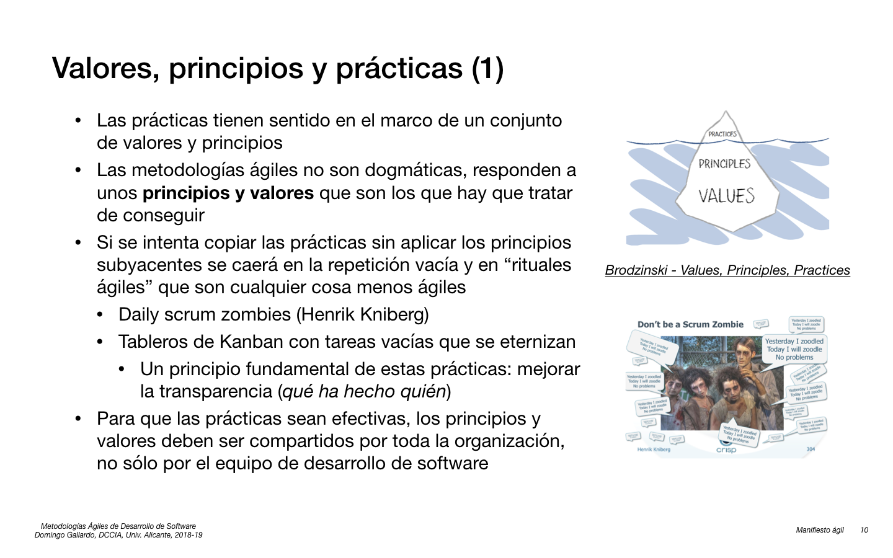</kbd>

- Los objetivos a corto plazo de los individuos a menudo entran en
  conflicto con los objetivos a largo plazo de las sociedades. Las
  sociedades han aprendido a tratar con este problema desarrollando un
  conjunto de de valores compartidos, reforzados por creencias, mitos,
  rituales, premios y castigos.

- Los valores guían las acciones y permiten elegir entre distintas
  opciones posibles. Son muy generales y aplicables a situaciones muy
  diversas.

- En el mundo empresarial, se habla de la **misión** de la empresa, a
  partir de la que se definen una series de **valores**.

Por ejemplo, Starbucks define su
  [misión y valores](http://www.starbucks.com/about-us/company-information/mission-statement)
  de la siguiente forma:

- **Misión**: Inspirar y cuidar el espíritu humano - persona a persona,
      taza a taza y barrio a barrio.

- **Valores**: Con un núcleo formado por nuestros socios, nuestro
      café y nuestros clientes, vivimos estos valores:
    - Crear una cultura de calidez y **de pertenencia**, donde todo el mundo
    es bienvenido.
    - Actuar con **valentía**, enfrentándose al _status quo_ y encontrando
    nuevas formas de hacer crecer nuestra empresa y cada uno de
    nosotros.
    - Estar **presente y conectar** con transparencia, dignidad y respeto.
    - Entregar **lo mejor de nosotros** en todo lo que hacemos,
    pudiendo dar cuenta en todo momento de nuestros resultados.
    - Nuestro motor es el **desempeño**, a través del cristal del humanismo.

- El desarrollo de software es una actividad principalmente humana, y
  el manifiesto ágil define unos **valores** que deben guiar ese
  desarrollo.

- Ejemplo de valor del manifiesto : "Los **individuos y las
  interacciones** están por encima de los procesos y las herramientas"

<kbd>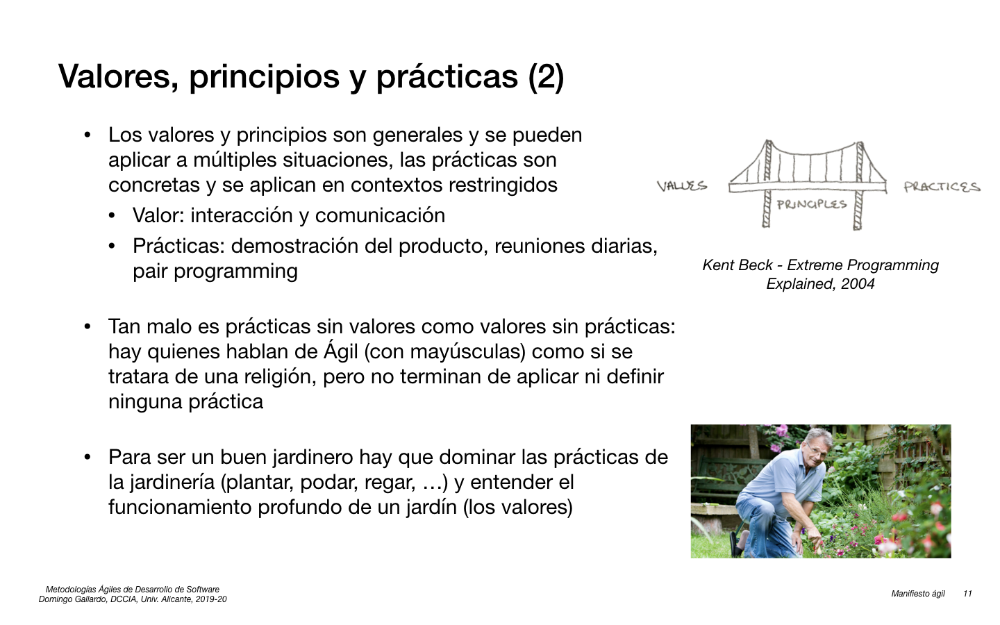</kbd>

<kbd>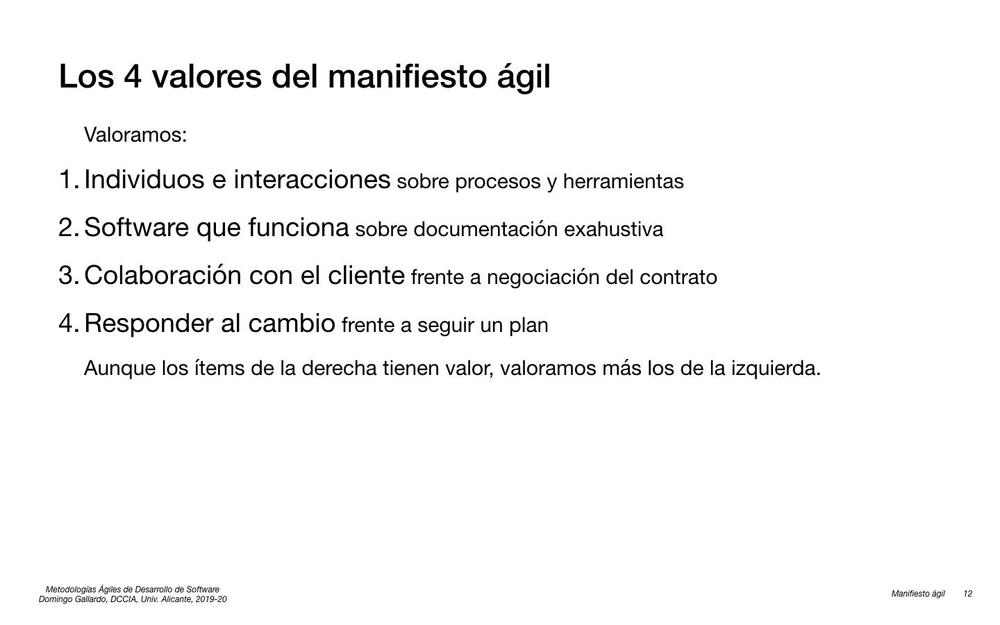</kbd>

**1. Individuos e interacciones** sobre procesos y herramientas:

- Las prácticas pueden usarse bien o mal. Es más importante fijarse en
  los miembros del equipo, sus motivaciones, preferencias e
  interacciones.
- Más importante que una buena documentación es una buena interacción
  (comunicación continua para que todo el equipo esté informado de las
  decisiones, temas abiertos, conceptos de negocio, etc.)
- Cuando no existen problemas de **comunicación** los equipos
  funcionan mucho mejor (en algunos estudios se habla de hasta 50
  veces mejor que la media). Para facilitar la comunicación las
  metodologías ágiles se basan en ciclos frecuentes de
  **inspeccionar-y-adaptar**. Estos ciclos van desde cada pocos
  minutos con el _pair programming_, a cada pocas horas con la
  integración continua, a cada día con las reuniones diarias
  _standup_, a cada iteración con la revisión y la retrospectiva.
- Para que funcione bien la comunicación y los ciclos de
  inspeccionar-y-adaptar es necesario que los miembros del equipo
  muestren bastantes conductas claves:
  
  - respecto por el bienestar de cada persona
  - verdad en cada comunicación
  - transparencia en todos los datos, acciones y decisiones
  - confianza en que cada persona va a apoyar al equipo
  - compromiso al equipo y a los objetivos del equipo

- Para promover este tipo de conducta, se debe facilitar un entorno
  que apoye y sea inclusivo. Se debe buscar de forma deliberada este
  tipo de comportamientos, porque la mayoría de equipos evitan la
  verdad, la transparencia y la confianza debido a normas culturales o
  conflictos previos generados por ser honestos en la
  comunicación. Para combatir estas tendencias, los líderes y los
  miembros del equipo deben facilitar el conflicto positivo. Cuando
  los equipos no esconden el conflicto, sino que se enfrentan a él de
  forma positiva se obtienen muchos beneficios:
  
  - La mejora de los procesos depende en que los equipos generen una
    lista de impedimentos o problemas en la organización, enfrentarse
    a ellos de forma clara priorizándolos y eliminándolos
    sistemáticamente.
  - La innovación sucede únicamente como consecuencia del libre
    intercambio de ideas enfrentadas.
  - La resolución de intereses enfrentados es consecuencia de que los
    equipos se alinean alrededor de objetivos comunes y exponen sus
    preocupaciones y potenciales conflictos.
  - El compromiso del trabajo conjunto sucede sólo cuando la gente se
    pone de acuerdo en objetivos comunes y se esfuerzan en mejorarlos
    tanto individualmente como en equipo.

**2. Software que funciona** sobre documentación exhaustiva:

- Software que funciona es software que proporciona **valor**. En
  muchas ocasiones este valor se puede calcular en forma de
  **dinero**: los clientes ganan más con el software de lo que les ha
  costado comprarlo. Nosotros ganamos más con él de lo nos ha costado
  desarrollarlo.
- Hay mucha documentación necesaria: manuales de usuario,
  documentación técnica que se va a consultar. Hay que **eliminar la
  documentación que no se va a usar** y que no aporta nada a lo que ya
  sabemos. 
- El **código** es la mejor documentación. En desarrollo TDD, primero se
  hacen las pruebas y éstas sirven para validar el sistema y para
  documentar. Los ejemplos de validación hechos por el _product owner_
  y los clientes son otro ejemplo de documentación imprescindible.
- El equipo debe definir lo que considera "software que funciona",
  esto es, definir claramente cuando considera que una determinada
  característica está terminada y lista para salir a producción. En un
  alto nivel, un trozo de funcionalidad está completo cuando sus
  características pasan todos los tests y puede ser utilizado por el
  usuario final. Como mínimo se deben realizar tests unitarios y tests
  a nivel de sitstema. Los mejores equipos incluirán también en la
  definición de terminado tests de integración, tests de eficiencia y
  tests de aceptación por el cliente.
- Es conveniente definir tests de aceptación cuando se está definiendo
  una nueva característica, ejecutarlos tan pronto la característica
  se haya terminado de implementar y corregir _bugs_ identificados
  como de alta prioridad tan pronto como sea posible.

**3. Colaboración con el cliente** frente a negociación de un contrato:

- Esto se aplica también al trabajo dentro de la empresa. Obligar a
  que "me den el encargo de trabajo por escrito" para poder después
  cubrirme las espaldas si hay un error **no es un ejemplo de
  colaboración**. 
- La flexibilidad y apertura de la colaboración permite cometer fallos
  sin que nadie se sienta señalado. El equipo es el responsable porque hay un
  objetivo final en el todos estamos comprometidos.
- Muchas veces no es posible trabajar mano a mano con el cliente final, por
  lo que se crea la figura de un "proxy", llamado en Scrum _Product
  Owner_. Es el encargado de concretar la lista de características que
  debe tener el producto y priorizarlas.
- **La _product owner_** es un miembro más del equipo: participa en las
  reuniones, propone ideas, proporciona ejemplos de prueba y, lo más
  importante, se siente tan autora del producto final como los demás
  miembros del equipo.

**4. Responder al cambio** frente a seguir un plan:

- Habrá un plan general, pero **flexible y adaptable** a los cambios que
  se puedan introducir en el desarrollo (sobre todo si es un proyecto
  largo).
- Hay que dejar de ver los cambios como errores y verlos como
  **oportunidades** de entregar más valor.
- La actitud del gestor del proyecto debe ser la de estar
  continuamente comprobando y reaccionando (sobre todo al final de
  cada iteración), no sólo la de planificar una vez al principio.
- Los planes de los equipos ágiles se centran en entregar primero el
  mayor valor de negocio. Debido a que el 80% del valor reside en el
  20% de las características, los equipos ágiles tienden a tener listo
  pronto un producto mínimo que proporcionará un valor claro al
  cliente. De esta forma se evita el riesgo de no entregar el producto
  en plazo o de tener que cancelarlo.
- Los equipos ágiles se basan el conocimiento de que, para que
  funcionen correctamente, los planes deben cambiar y adaptarse. Por
  eso tienen establecido procesos, como revisiones y retrospectivas,
  que están diseñados específicamente para modificar las prioridades
  de forma regular basándose en la retroalimentación del cliente y en
  el valor de negocio.

<kbd>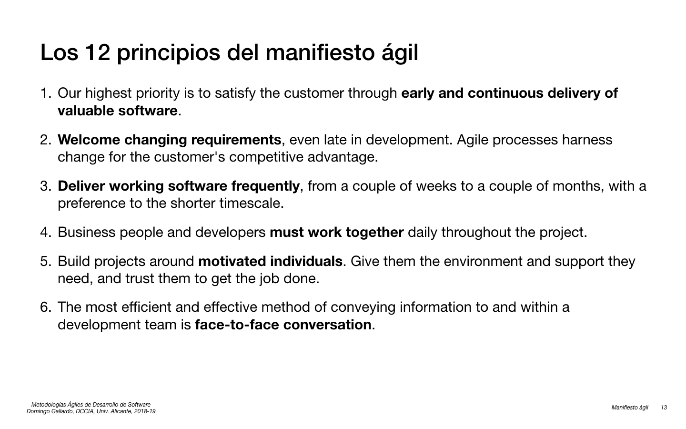</kbd>

**1. Our highest priority is to satisfy the customer through early and
  continuous delivery of valuable software.**

- Tres ideas juntas: lanzar pronto el software, entregar valor
  continuamente y satisfacer al cliente.
- Es difícil entender exactamente cómo va a funcionar el software
  hasta el momento en que **los clientes lo usan**.
- Por otro lado, para una empresa cliente puede ser difícil trabajar
  con software incompleto. La empresa debe aprender a valorar la
  colaboración sobre los contratos. Esto es lo que significa
  **continuous delivery**.

**2. Welcome changing requirements, even late in development. Agile
  processes harness change for the customer's competitive advantage.**

- La mayoría de desarrolladores tienen problemas con este principio:
  **no es fácil** tener que modificar código que ya está hecho. Y menos si
  no es por nuestra culpa.
- Hay que verlo desde la perspectiva del cliente. Para el cliente
  tampoco es fácil pedir un cambio. Muchas veces lo hace por necesidad
  (ventaja competitiva), porque algo ha cambiado en el negocio desde
  que se inició el proyecto. Por ejemplo, ha habido un cambio legal o
  ha surgido alguna nueva tendencia en la sociedad que es interesante
  incorporar al producto.  El producto obtenido después de los cambios
  es mejor que el anterior y tiene características que lo hacen
  destacar frente a los productos de la competencia (que no ha tenido
  tiempo de introducir los cambios en el negocio).
  
- Debemos dejar de pensar en que los cambios son equivocaciones. Son
  **una forma de aprender**.

**3. Deliver working software frequently, from a couple of weeks to a
couple of months, with a preference to the shorter timescale.**

- Ya hemos hablado de las ventajas de las iteraciones pequeñas: hay un
  producto usable al final, todos en el equipo tienen objetivos claros
  para cada iteración, es más fácil planificar iteración a iteración y
  tener una visión de más alto nivel.
- Cuidado, posible problema: perder de vista objetivos a largo plazo y
  características complejas que necesitan más de una iteración.

**4. Business people and developers must work together daily
throughout the project.**

- El problema es que la gente de negocio (los clientes) tienen un
  trabajo que hacer, distinto de ayudar a los desarrolladores. Pero el
  problema es crítico: cada correo electrónico sin contestar retrasa
  el proyecto.
- La gente de negocio debe entender que el equipo va a entregar
  software valioso para la empresa, que va a solucionar parte de sus
  problemas y que va a merecer la pena ayudar, y formar parte del
  equipo (normalmente a través del _product owner_).
- Por eso es importante que el equipo priorice las características de
  más valor.
- Un buen _product owner_ puede ayudar a reducir la cantidad de tiempo
  que la gente de negocio pasa con el equipo. Puede que sea necesario
  que se reúnan diariamente, pero las reuniones deben **estar
  preparadas** y servir principalmente para validar información
  preparada por el _product owner_.

**5. Build projects around motivated individuals. Give them the
environment and support they need, and trust them to get the job
done.**

- Cuidado con "incentivos" que funcionan en contra del equipo como
  premios por el número de bugs encontrados o el número de líneas
  escritas.
- Si cada uno en el equipo intenta cubrirse las espaldas y acusar a
  otros de los problemas, se genera una **atmósfera perniciosa** para
  el desarrollo.
- La motivación por el proyecto que se está desarrollando y la
  **confianza** son valores que hay que fomentar.
- El líder del equipo debe aplicar técnicas de trabajo en grupo para
  conseguir más confianza y sinceridad.

**6. The most efficient and effective method of conveying information
  to and within a development team is face-to-face conversation.**

- Las conversaciones son más valiosas que la documentación.
- **Respeta el tiempo** de los demás y prepara bien la conversación, para
  que sea eficiente.
- El fin último de las conversaciones es crear un **sentimiento de
  comunidad** de forma que haya un montón de conocimiento implícito que
  no sea necesario comunicar una y otra vez.

<kbd>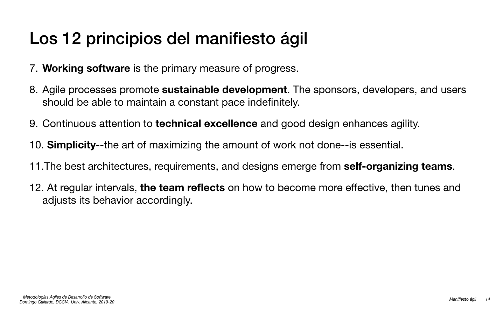</kbd>

**7. Working software is the primary measure of progress.**

- La mejor forma de medir el progreso del proyecto es comprobando la
  cantidad de funcionalidades implementadas y probadas.
- En el momento en que ves el software funcionando, lo
  "pillas". Puedes comprobar lo que se ha hecho y lo que falta por
  hacer.
- Al **probar el software** al final de cada iteración todo el mundo se
  hace una idea mucho mejor del progreso que al leer informes y
  diagramas.

**8. Agile processes promote sustainable development. The sponsors,
developers, and users should be able to maintain a constant pace
indefinitely.**

- No caer en la práctica habitual de las horas extras y los fines de
  semana cuando se acerca la fecha de entrega. A largo plazo esto no
  funciona.
- El desarrollo iterativo es mucho más realista, porque un ritmo de
  desarrollo sostenido durante la iteración nos permite estimar mucho
  más fielmente lo que se va a entregar al final de las dos, cuatro o
  seis semanas que dure la iteración.

**9. Continuous attention to technical excellence and good design
 enhances agility.**

- Es importante resolver los bugs **tan pronto como aparecen**. Cuanto
  más se tarde en eliminar un bug más difícil es hacerlo.
- Hay que utilizar buenas prácticas de diseño, buenas
  herramientas. Pero no sobre-diseñar.

**10. Simplicity--the art of maximizing the amount of work not
 done--is essential.**

- Borrar código no es una operación demasiado destructiva, porque
  siempre lo puedes recuperar del sistema de control de versiones. Es
  peor escribir código de más.
- Cuantas más líneas de código, más dependencias y más difícil
  solucionar los errores, ampliar las funcionalidades y realizar
  cambios.

**11. The best architectures, requirements, and designs emerge from
 self-organizing teams.** 

- Lo contrario de un equipo auto-organizado es un equipo que obedece
  ciegamente los diseños propuestos en un proceso rígido como el de
  cascada. 
- En un equipo ágil todo el equipo comparte la responsabilidad de la
  arquitectura del proyecto.
- En lugar de un gran diseño al principio de todo, el diseño va
  **emergiendo de forma incremental**, conforme se van desarrollando
  historias de usuario (de mayor a menor valor).
- Esto obliga a usar técnicas de diseño que permitan construir el
  sistema poco a poco, ampliando los módulos, esquemas de la base de
  datos, etc.

**12. At regular intervals, the team reflects on how to become more
 effective, then tunes and adjusts its behavior accordingly.**

- El equipo ágil no sólo debe mejora el software de forma continua,
  sino que también debe mejorar la propia **forma de construir el
  software**. 
- Al principio es algo incómodo hablar de errores y cosas que se han
  hecho mal. Pero con el tiempo la gente se acostumbra a ello y se
  convierte en una forma de mejorar a base de hacer críticas
  constructivas (y valorar lo que se ha hecho bien).

<kbd>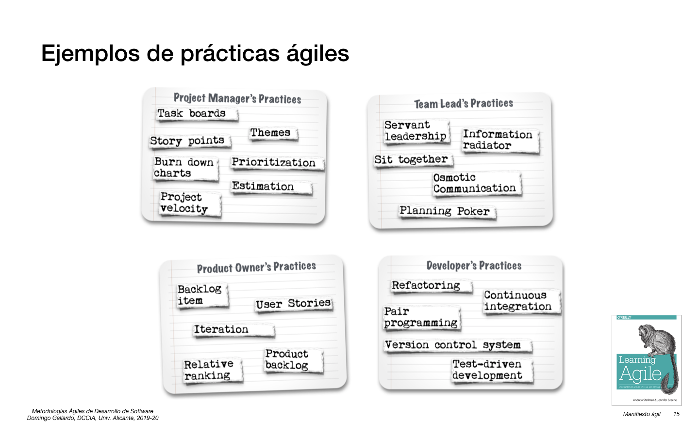</kbd>

Ejemplos de prácticas:

- Prácticas del **gestor de proyectos** :
    - Tableros de tareas
    - Puntos de historia
    - Diagramas de quemado (_burndown charts_)
    - Diagramas de flujo acumulado
    - Velocidad del proyecto
    - Estimación
    - Temas
    - Priorización

- Prácticas del **lider del equipo**:
    - Planning Pocker
    - Retrospectivas
    - Comunicación osmótica
    - Sentarse juntos
    - _Servant leadership_

- Prácticas del **product owner**:
    - _Backlog_ de producto
    - Ítem de _backlog_
    - Historias de usuario
    - _Ranking_ relativo
    - Iteración
    - _Release_

- Prácticas del **desarrollador**:
    - Refactorización
    - Programación por parejas
    - Integración continua
    - Sistemas de control de versiones
    - Desarrollo Dirigido por los Tests (TDD)

- Los valores del manifiesto ágil son comunes a las prácticas
definidas por las distintas metodologías (_Lean_, XP y Scrum):

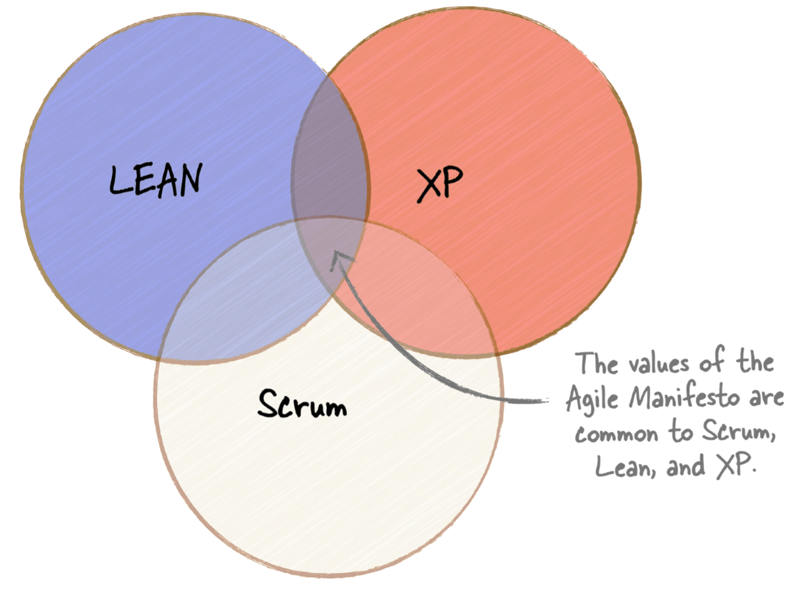

<kbd>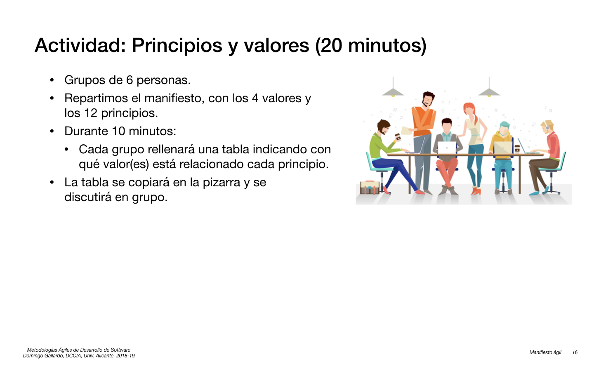</kbd>

<kbd>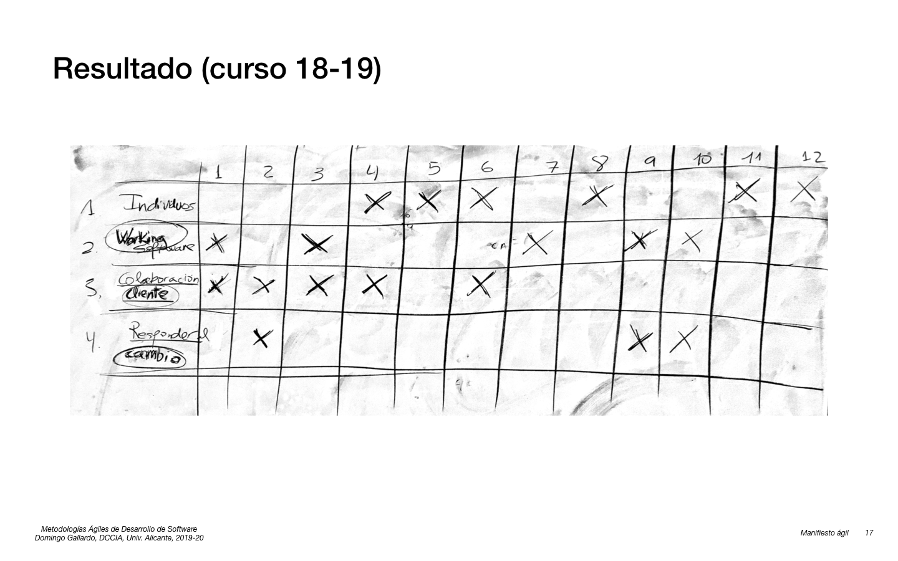</kbd>

En la puesta en común hemos obtenido la tabla anterior.

Resumen de los principios que favorecen cada uno de los valores:

- Individuos frente a procesos: 6 principios (4,5,6,8,11,12)
- Software en funcionamiento frente a documentación: 5 principios (1,3,7,9,10)
- Colaboración con el cliente frente a contratos: 5 principios
  (1,2,3,4,6)
- Responder al cambio frente a seguir un plan: 3 principios (2,9,10)

<kbd>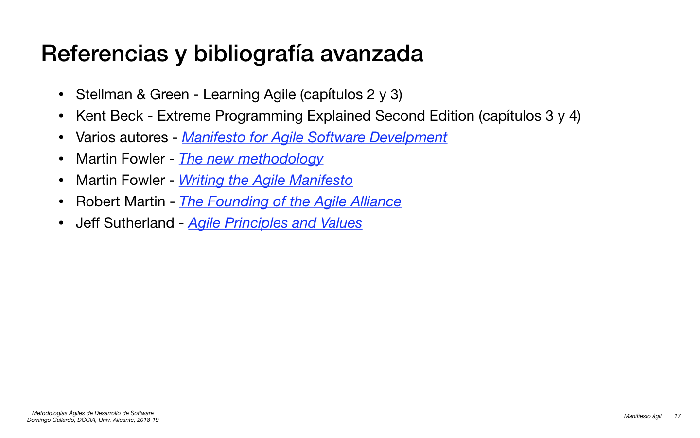</kbd>

- El
[enlace](https://blog.crisp.se/2018/09/26/henrikkniberg/slides-from-kth-agile-intro)
a las diapositivas de la charla de Henrik Kniberg de hace un par de
semanas en el [KTH](https://www.kth.se/en).

<kbd></kbd>

- Enlaces:
    - [Manifesto for Agile Software Development](http://agilemanifesto.org)
    - Martin Fowler - [The New Methodology](http://www.martinfowler.com/articles/newMethodology.html)
    - Martin Fowler - [Writing The Agile Manifesto](http://martinfowler.com/articles/agileStory.html)
    - Robert Martin - [The Founding of the Agile Alliance](https://sites.google.com/site/unclebobconsultingllc/the-founding-of-the-agile-alliance)
    - Jeff Sutherland - [Agile Principles and Values](https://msdn.microsoft.com/en-us/library/dd997578.aspx)

