## Desarrollo lean

<kbd>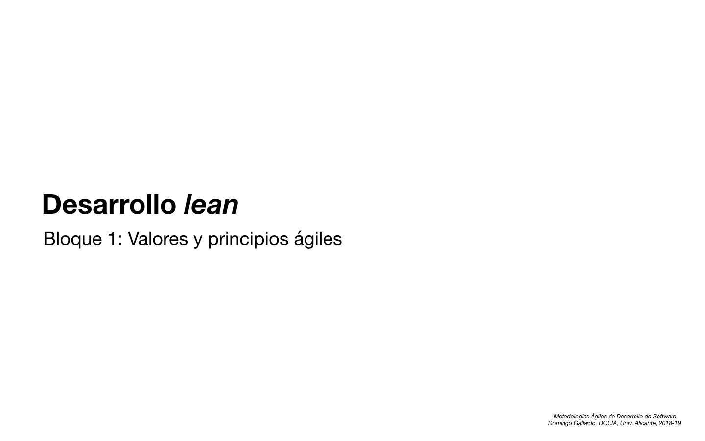</kbd>

<kbd>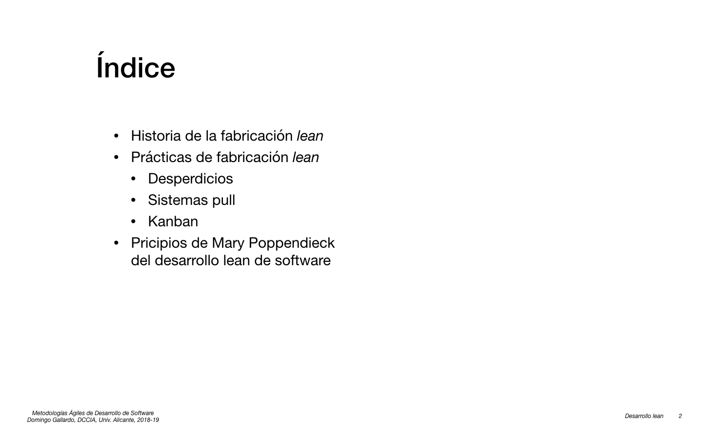</kbd>

<kbd>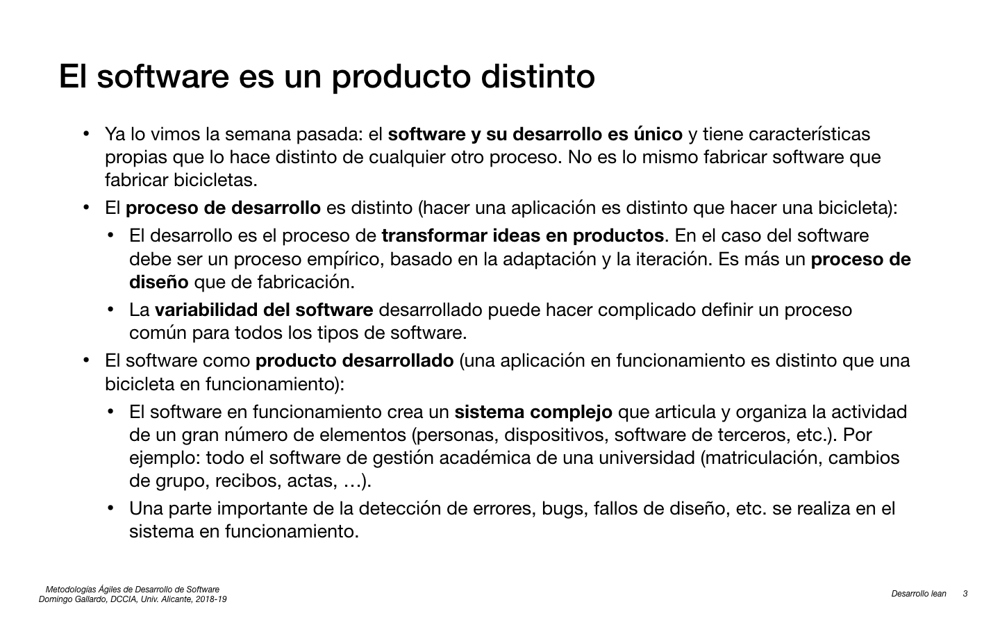</kbd>

- El software es un **producto** muy distinto a los productos
  tradicionales: una aplicación no es una bicicleta, ni un televisor,
  ni un edificio. Tanto su desarrollo como su funcionamiento es
  singular.

- El proceso de desarrollo de software es un **proceso creativo** que
  tiene más elementos de **diseño** que de fabricación.
    - Los procesos de fabricación tradicionales son rígidos. En
      general los planos y características del objeto a producir están
      claramente determinados a priori y hay pocas decisiones que
      tomar.
    - En un proceso de diseño hay muchos **grados de libertad**, se
      deben escoger entre muchas posibles soluciones. El proceso
      intenta obtener la mejor opción, cumpliendo un conjunto de
      **restricciones** necesarias. Por ejemplo: el diseño de nuevo
      móvil, de un automóvil o de un mueble.

- Veremos que la filosofía _lean_ acerca ambos planteamientos: permite
  introducir **flexibilidad** en los procesos de fabricación tradicionales
  y un cierto **orden y método** en un proceso de diseño.

<kbd>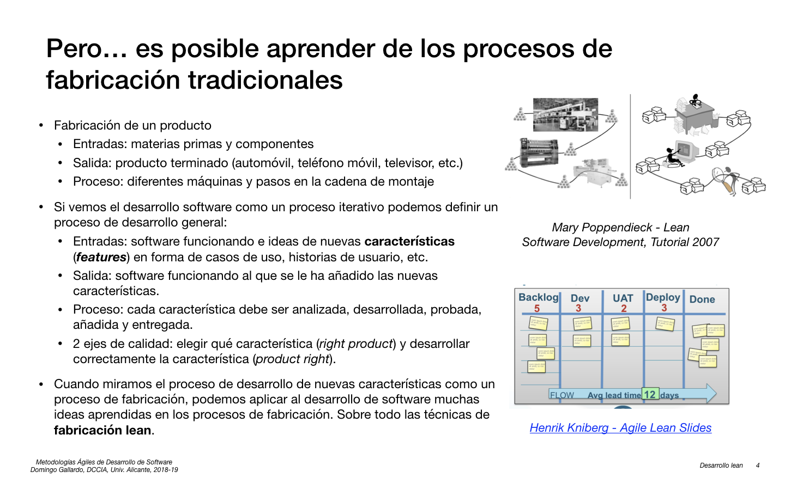</kbd>

- Joel Spolsky (creador de _Stack Overflow_) explica en el artículo
  [Software
  Inventory](https://www.joelonsoftware.com/2012/07/09/software-inventory/)
  de su famoso blog [Joel on Software](https://www.joelonsoftware.com)
  la relación entre el desarrollo de software y un proceso de
  fabricación:
  
  Piensa en las **ideas** a añadir al producto como el **material
  bruto**. Dependiendo del proceso, estas ideas pueden pasar por
  distintos puntos de ensamblaje antes de ser entregadas como
  **_features_ terminadas** al cliente:
  
  - Proceso de toma de decisión (¿deberíamos implementar esta
    _feature_?)
  - Proceso de diseño (especificaciones, pizarras, mockups, etc.)
  - Proceso de implementación (escribir código)
  - Proceso de prueba (encontrar bugs)
  - Proceso de depuración (arreglar bugs)
  - Proceso de despliegue (enviar el código a los clientes, ponerlo en
    el servidor web, etc.)
  
- Ya hemos enlazado alguna otra vez las
  [diapositivas](http://blog.crisp.se/tag/slides)
  de [Henrik Kniberg](https://www.crisp.se/konsulter/henrik-kniberg).

<kbd>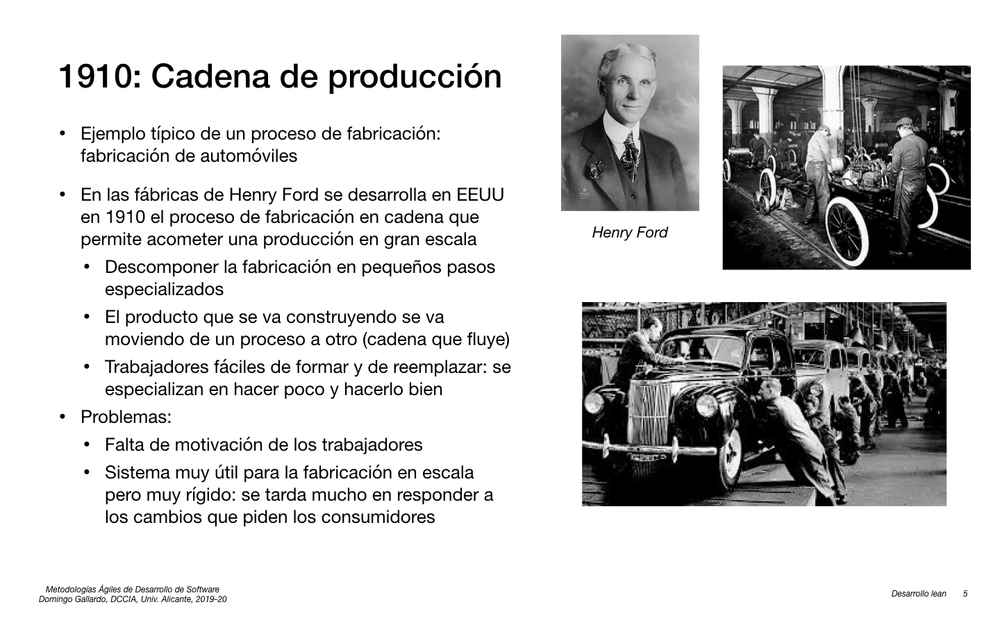</kbd>

<kbd>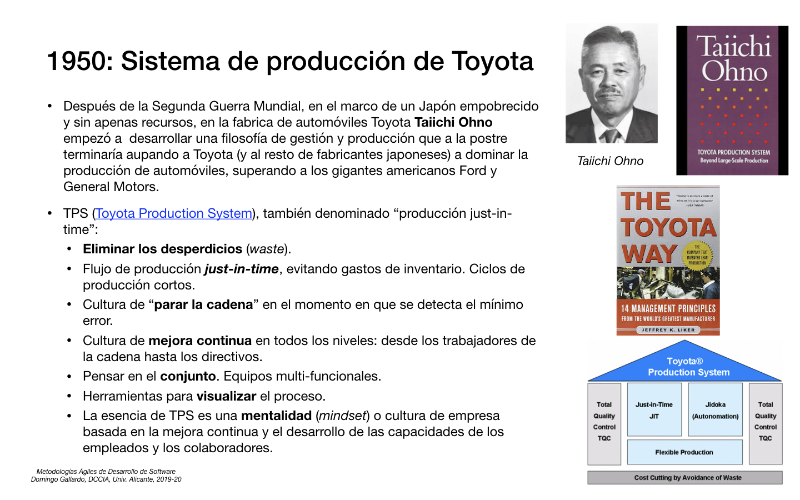</kbd>

- El objetivo de Ohno **no era conseguir producción en masa**. Su
  ideal era fabricar y entregar un producto **inmediatamente después**
  de que el cliente hubiera realizado un pedido. Pensaba que era mejor
  esperar un pedido que construir un inventario en anticipación del
  pedido.

- Uno de los elementos fundamentales del TPS (_Toyota Production
  System_) era identificar y eliminar "desperdicio" (_waste_) en todo
  el proceso de producción de un vehículo. El concepto de "desperdicio"
  (_waste_) es un concepto muy general: es todo aquello que **no crea
  valor al cliente**: piezas que no se usan, elementos innecesarios,
  transporte, movimiento, espera, procesamiento extra, defectos.

- En 1945, bajo la dirección de Ohno, Toyota optimizó el ratio de
  producción de cada sistema, reconsiderando la posición de todas las
  máquinas de forma que la salida de una máquina alimentaba la
  siguiente. Se redujo la velocidad de las máquinas para que todas
  tuvieran la misma cadencia, y sólo se produjo material cuando era
  necesario. Después de optimizar las fábricas de Toyota, Ohno entrenó
  a los proveedores para que la producción completa de un vehículo
  fuera _just-in-time_, transformando la producción en masa en
  producción _lean_. El sistema _pull_ resultante resultó ser fácil de
  reconfigurar, minimizó el inventario y permitió tiempos cortos de
  producción. 

- Toyota también usó el concepto de desperdicio no sólo para
  fabricación, sino también en el **desarrollo del producto**. Cuando
  se comienza un proceso de desarrollo, el objetivo es completarlo tan
  rápidamente como sea posible, porque todo el trabajo que va en
  desarrollo no está añadiendo valor **hasta que el coche sale de la
  línea de producción**. En cierto sentido, los proyectos de
  desarrollo en marcha son idénticos al inventario. Los diseños y los
  prototipos no son útiles a los clientes, reciben valor sólo cuando
  se entrega el nuevo producto.

- Hay estudios que estiman que la aplicación de sistemas similares al
  TPS en empresas automovilísticas de Japón tiene como resultado una
  reducción a la mitad del esfuerzo de ingeniería y **reduce en 1/3 el
  tiempo de desarrollo** comparado con los enfoques tradicionales.

- Una de las características es el desarrollo rápido y concurrente y
  la habilidad de realizar cambios tarde en el ciclo de desarrollo. No
  hay que hacer decisiones irreversibles en primer lugar, hay que
  **retrasar las decisiones** tanto como sea posible, manteniendo
  abiertas distintas opciones, y cuando se realicen, hacerlas con la
  mejor información posible.

- Más información sobre el Toyota Production System (TPS) en la
  [Wikipedia](https://en.wikipedia.org/wiki/Toyota_Production_System).

<kbd>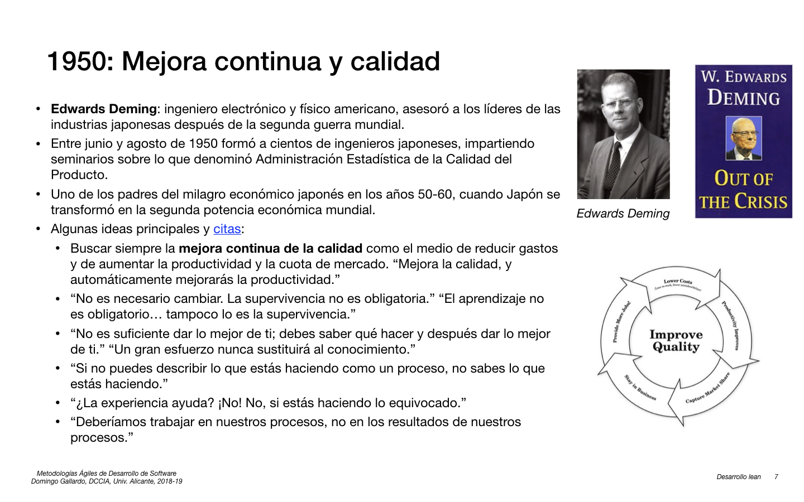</kbd>

- [Citas](https://blog.deming.org/w-edwards-deming-quotes/large-list-of-quotes-by-w-edwards-deming/)
  de Edwards Deming.

<kbd>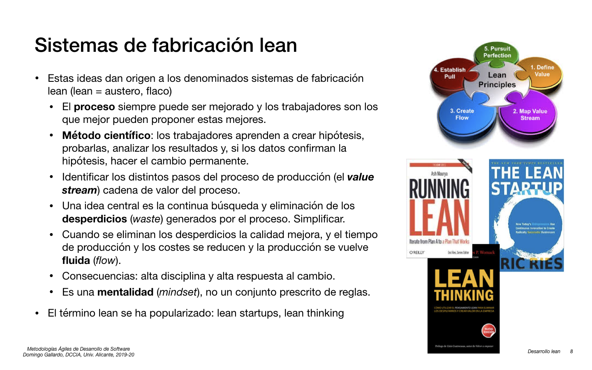</kbd>

- Avanzamos un ejemplo de aplicación de una de estas técnicas al
  desarrollo de software. El **value stream map** (**mapa de flujo de
  valor**) consiste en analizar todas las fases por las que pasa una
  funcionalidad, característica, historia de usuario, tarea,
  etc. desde que se decide desarrollar hasta que se sube a
  producción. Dibujar una caja por cada uno de los pasos y estudiar el
  tiempo de trabajo y tiempo de espera en cada una de las fases. Es
  recomendable hacerlo con características reales, una vez terminadas.

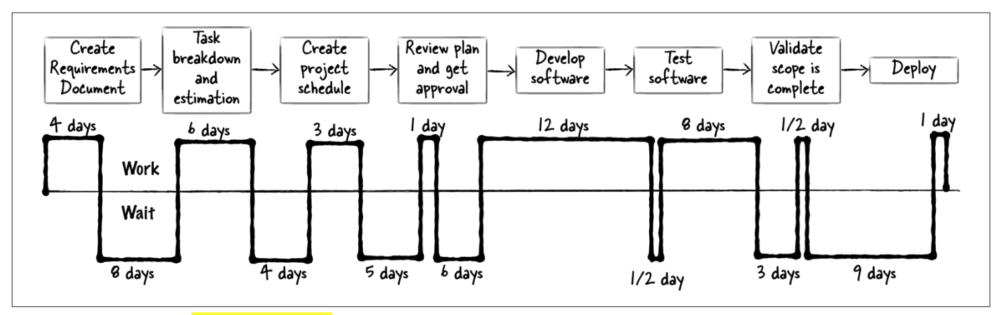

- En el ejemplo anterior las fases serían: (1) crear el documento de requerimiento, (2)
  dividir en tareas y estimar, (3) documento de planificación, (4)
  revisión del plan y obtener visto bueno, (5) desarrollar software,
  (6) pruebas del software, (7) validación del alcance, (8) despliegue.

- Cada empresa, dependiendo de la metodología de desarrollo que use,
  tiene un mapa de flujo de valor distinto. Es una herramienta
  importante para diseñar los tableros kanban.
  
- El enfoque _lean_ consiste en identificar y eliminar _waste_ en el
  _value stream_. Debemos identificar tres tipos de actividades:
  actividades que claramente crean valor; actividades que no crean
  valor para el cliente pero que son necesarias en la actualidad para
  fabricar el producto; y actividades que no crean valor para el
  cliente, son innecesarias y, por lo tanto, deberían ser eliminadas
  inmediatamente (_waste_).

- Un problema importante en el caso del software es la identificación
  de las tareas que van a pasar por el _value stream_. ¿Qué unidades
  son las que hay que analizar? ¿Historias de usuario? ¿Tareas
  técnicas más pequeñas en las que se descomponen las historias de
  usuario?. La recomendación es que sean elementos que no tengan mucha
  variabilidad de tamaño. Un concepto que se suele usar es el de
  **minimal marketable feature** (MMF): el "trozo" más pequeño de
  funcionalidad del producto que los clientes (o el _product owner_)
  puede priorizar. Suelen tomar forma de una historia de usuario, un
  requerimiento o una petición de funcionalidad. En el caso de Scrum,
  son los ítems del backlog.

<kbd>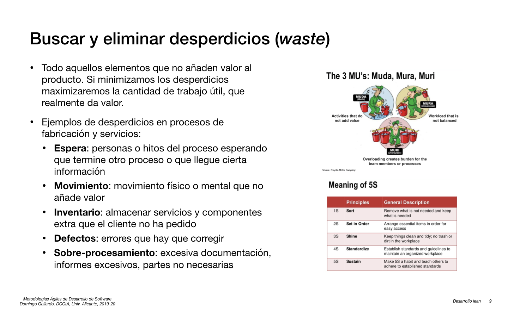</kbd>

En el artículo anteriormente mencionado de Joel Spolsky se mencionan
tres tipos de inventario que se pueden encontrar en el desarrollo de
software que deben minimizarse:

- **Backlog de _features_**: el 90% de las _features_ en el backlog no
  llega a implementarse. **Solución**: limitar el backlog a 1 o 2
  meses. Una vez que esté lleno no se introducirán nuevos ítems si no
  se quita alguno.
- **Base de datos de bugs**: algunas empresas mantienen bases de datos
  con cientos de bugs que nunca llegan a corregirse. **Solución**:
  implementar un sistema de triaje que indique si un bug debe
  corregirse o marcarse como cerrado. No hay que preocuparse en
  equivocarse, los bugs importantes reaparecerán.
- **_Features_ no desplegadas**: _features_ implementadas pero puestas
  en producción por ser el proceso de despliegue muy
  lento. **Solución**: mejorar el proceso de despliegue con
  integración continua.

<kbd></kbd>

- WIP: **Work In Process**, es un término lean que indica el número de
  ítems que están siendo procesados en una determinada celda o fase
  del proceso. En Kanban veremos que para cada una de las fases del
  proceso se define un límite en el WIP, que obliga a no aceptar más
  ítems una vez que se ha llegado al WIP. Cuando algún ítem termine el
  proceso y pase a la fase siguiente, se vuelve a coger un ítem
  nuevo. Pero nunca estaremos procesando más ítems que los definidos
  por el WIP.

- El flujo de trabajo pull, junto con el WIP, garantiza que no se
  produce sobre inventario y permite **detectar** fácilmente **cuellos
  de botella** en el proceso, procesos que consumen demasiado tiempo y
  que obligan a esperas e impiden una cadencia fluida (flujo,
  **flow**). Una fase que tarda demasiado en procesar los ítems hace
  que las fases previas se queden paradas, esperando, porque no pueden
  sobrepasar su WIP. En un sistema push esas fases seguirían
  procesando ítems, que se acumularían.

- El flujo pull y el mapa de flujo de valor permiten **analizar y
  reflexionar** sobre el proceso de producción.

<kbd></kbd>

-
  [Sistema de producción pull](https://www.youtube.com/watch?v=ZIv2e61SH1A) (YouTube)

<kbd>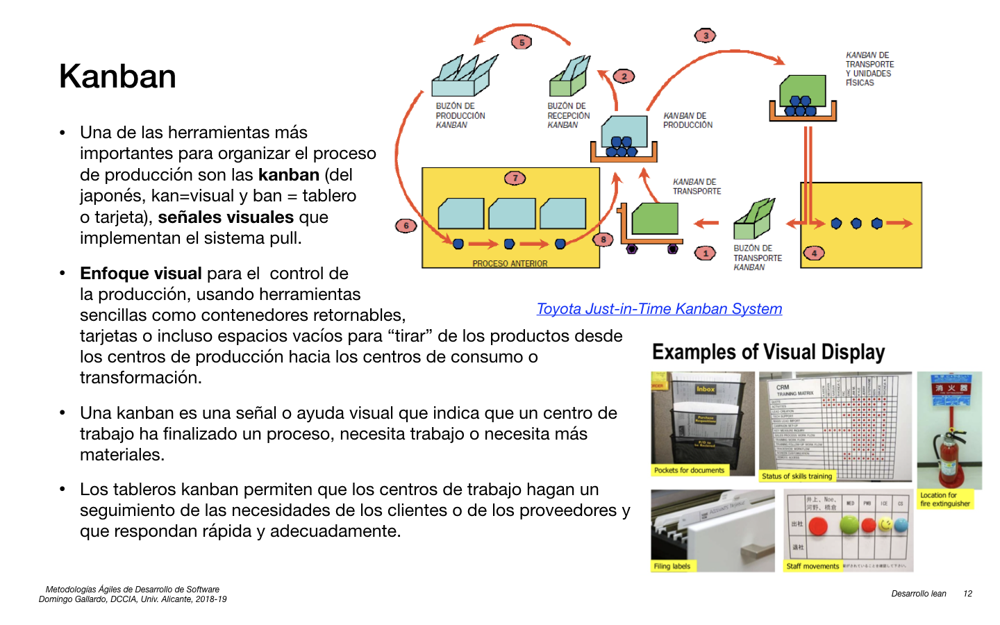</kbd>

- [Toyota just-in-time production system](http://www.toyota-global.com/company/vision_philosophy/toyota_production_system/just-in-time.html)

<kbd>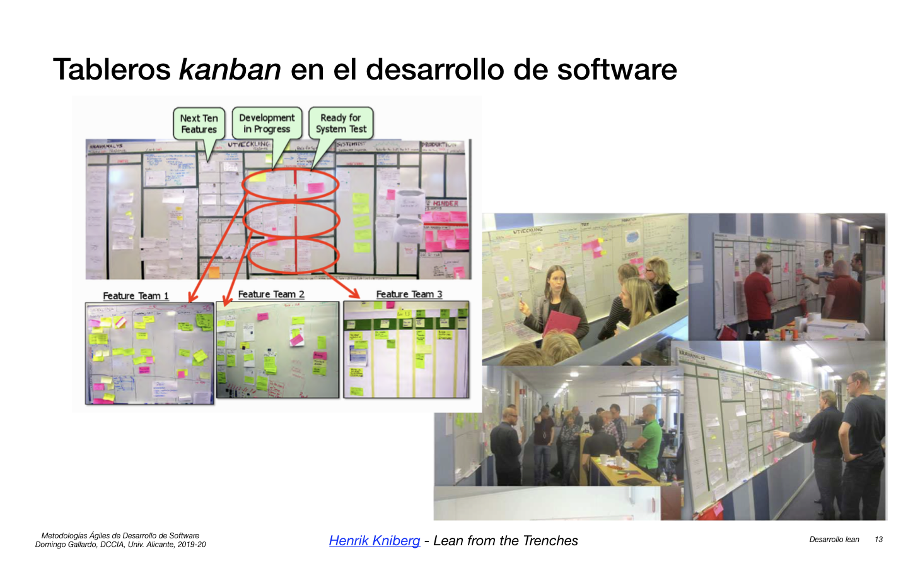</kbd>

- Henrik Kniberg:
  [Lean from the trenches](https://pragprog.com/book/hklean/lean-from-the-trenches)
  ([PDF](https://www.google.es/url?sa=t&rct=j&q=&esrc=s&source=web&cd=1&ved=0ahUKEwie0Pe2gbXPAhUCOxQKHfE_DwkQFggeMAA&url=https%3A%2F%2Fwww.crisp.se%2Ffile-uploads%2FLean-from-the-trenches.pdf&usg=AFQjCNFLq9y4a6bq1CCWa03EfonPhMbV5w))

<kbd>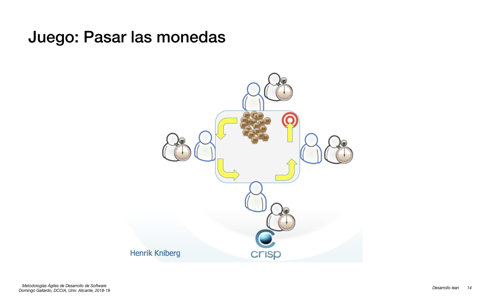</kbd>

Vamos a hacer una nueva actividad en clase. Simulamos un proceso de
fabricación que pasa ítems de trabajo (monedas) por distintas
fases y mediamos el tiempo de entrega al cliente.

Hay que voltear las monedas y pasarlas al siguiente trabajador, hasta
que lleguen al cliente.

- Los trabajadores 1, 3 y 4 usan las dos manos.
- El trabajador 2 usa sólo una mano.

¿Es mejor dividir los trabajos en bloques grandes o pequeños? ¿Hay
diferencia entre los resultados?

**¡¡¡Vamos a comprobarlo!!!**

<kbd>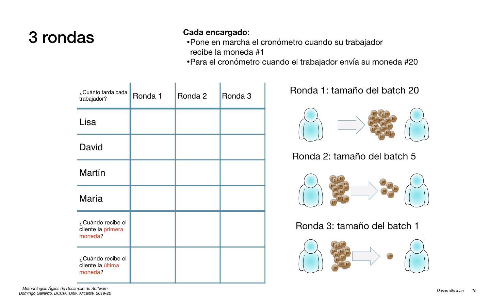</kbd>

<kbd>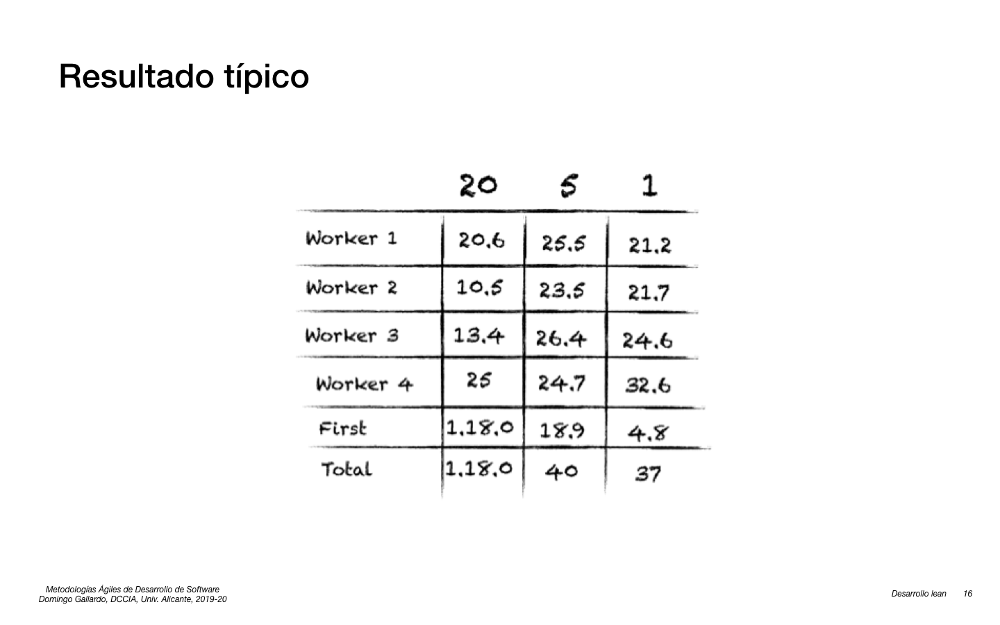</kbd>

<kbd>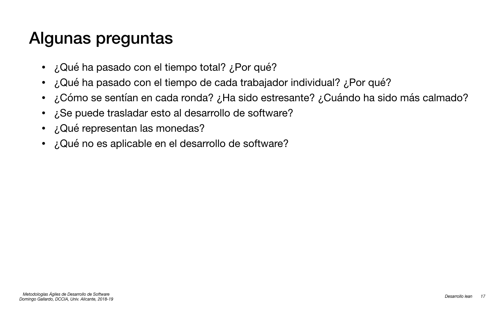</kbd>

Ponemos en común y discutimos los resultados.

<kbd>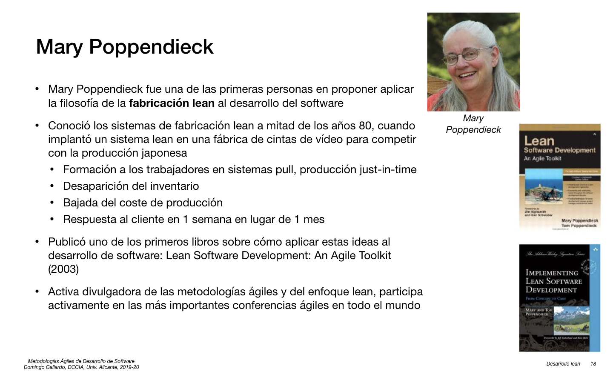</kbd>

<kbd>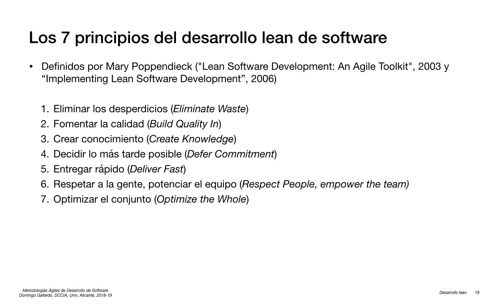</kbd>

<kbd>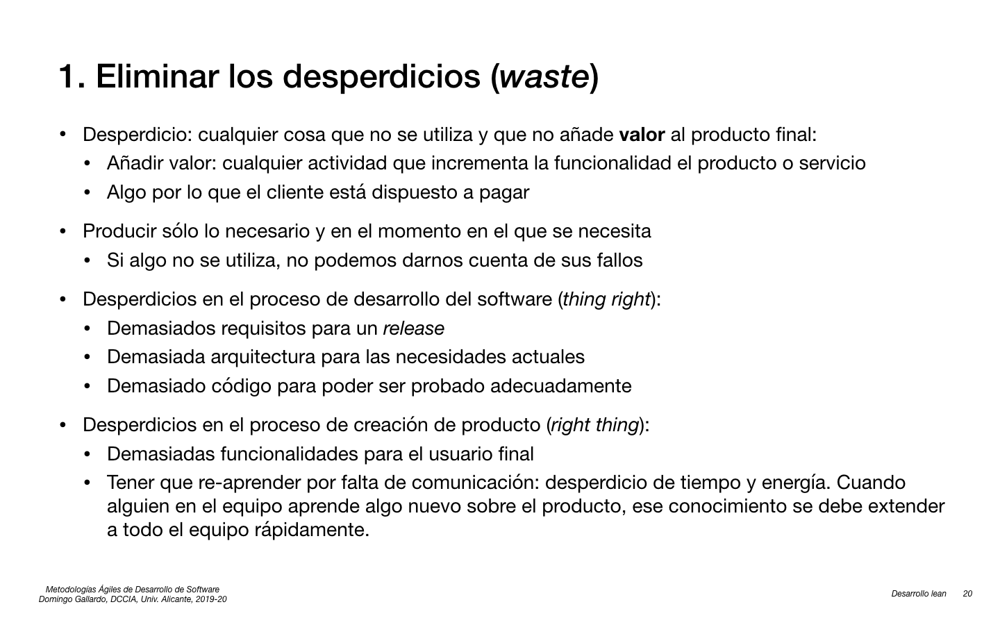</kbd>

Mary Poppendieck propone 7 tipos de _waste_ en el desarrollo del
software:

- **Trabajo parcialmente hecho**: Mientras que el software está
  parcialmente hecho no puede proporcionar feedback de si es útil o
  no. El trabajo parcialmente hecho siempre retrasa el resto del
  trabajo.
  
  Posibles manifestaciones de trabajo parcialmente hecho:
  documentación excesiva no codificada, código no sincronizado en el
  repositorio, código no testeado, código no desplegado.
  
- **Características de más**: Características que no se usan,
  excesivamente complejas o que quedan obsoletas en nuevas versiones.
  
- **Reaprendizaje**: Problemas en la comunicación obliga a varias
  personas a reaprender conceptos del dominio del producto, mala
  planificación de las entrevistas con los expertos del dominio,
  herramientas/frameworks de desarrollo demasiado heterogéneos.

- **Delegación**: Las delegaciones de tareas y trabajos conllevan
  tiempo necesario para explicaciones y son propensas a errores por
  problemas de comunicación. 

- **Retrasos**: Muchos posibles retrasos en el proceso de
  desarrollo. Retraso en la redacción de la historia de usuario o en
  los mockups del diseño. Retraso en que las nuevas features se pongan
  en producción por problemas burocráticos. Retrasos en las pruebas de
  QA por sobrecarga de trabajo.

- **Multi-tarea**: Los cambios de tarea obligan a cambios de contexto
  (que gastan tiempo) y dejan tareas sin terminar.

- **Defectos**: Defectos técnicos que se van acumulando, errores en la
  comprensión de features que producen un producto de poco valor.

<kbd></kbd>

El
[artículo](https://www.researchgate.net/publication/313360479_Software_Development_Waste)
de Todd Sedano, Paul Ralph y Cécile Péraire propone una clasificación
en 9 categorías de posibles tipos de _waste_ en el desarrollo del
software. Algunas de las categorías se corresponden los tipos
originales propuestos por Poppendieck, mientras que otras son nuevas.

Cada desperdicio está relacionado con tensiones o dilemas que se
producen en el proceso de desarrollo y que también se identifican en
el artículo.

- **1. Construir la característica o el producto erróneo**: el coste
  de construir una característica o producto que no resuelve las
  necesidades del usuario o del negocio. 
  
  **Tensión**: necesidades del usuarios versus necesidades del negocio.
  
- **2. Manejar mal el backlog**: el coste de trabajo duplicado,
  entrega de características de poco valor o retraso de arreglos
  necesarios de bugs.
  
  **Tensión**: Escribir historias suficientes versus escribir
  historias que nunca se implementarán.
  
  **Tensión**: Finalizar características versus trabajar en demasiadas
  características simultáneamente.
  
  **Tensión**: Intransigencia a los cambios versus ajustes caprichosos.
  
- **3. Volver a hacer el trabajo**: el coste de modificar trabajo ya
  entregado que debería haberse hecho correctamente pero no lo fue.
    
- **4. Soluciones innecesariamente complejas**: el coste de crear una
  solución más complicada de lo necesario, de perder una oportunidad
  de simplificar características, interfaz de usuario o código.
  
  **Tensión**: Diseño grande desde el principio versus diseño incremental.
  
- **5. Demasiada carga cognitiva**: el coste de gasto innecesario de
  energía mental.
  
- **6. Angustia psicológica**: el coste de quemar el equipo con estrés
  inútil.
  
- **7. Espera/Multi-tarea**: El coste del tiempo de espera, muchas
  veces escondido por la multitarea.
  
  **Tensión**: Esperar versus adivinar (cuando una historia está
  incompleta).

  **Tensión**: Esperar versus cambiar de contexto.

- **8. Pérdida de conocimiento**: El coste de readquirir conocimiento
  que el equipo tuvo en algún momento.

- **9. Comunicación poco efectiva**: El coste de comunicación
  incompleta, incorrecta, engañosa, ineficiente o ausente.

<kbd>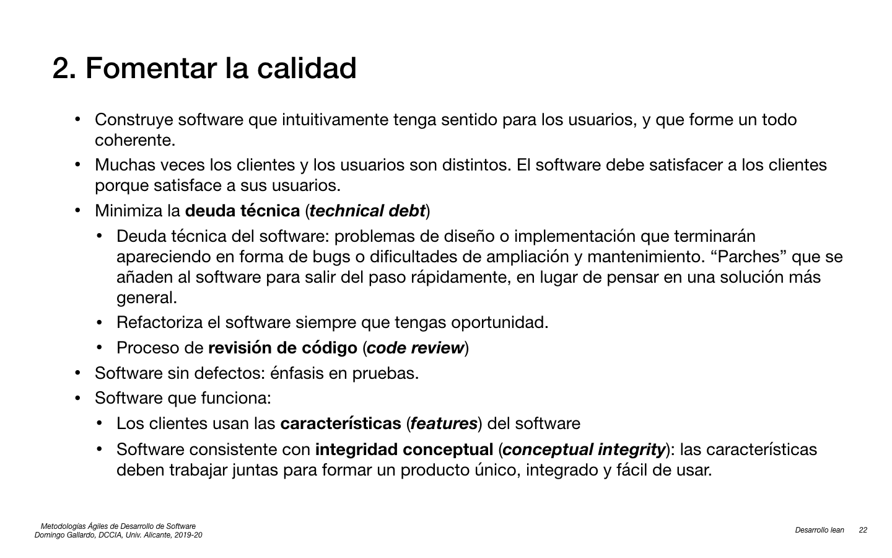</kbd>

<kbd>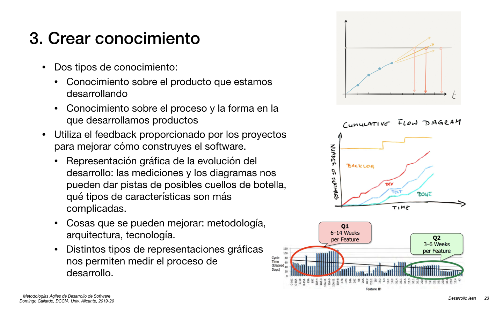</kbd>

- Para hacer un diagrama de flujo acumulado (_cummulative flow
  diagram_) de una fase del desarrollo (columna del tablero Kanban o
  fase del mapa de flujo de valor) vamos contando semana a semana
  cuantos ítems se terminan en esa fase de desarrollo, y anotamos el
  incremento en el diagrama. 

- De esta forma podemos, por ejemplo, hacer el diagrama de flujo
  acumulado de las historias de usuario terminadas. Este diagrama nos
  sirve para estimar una velocidad de desarrollo, lo que nos permite a
  su vez estimar número de historias terminadas en una determinada
  fecha. Suponemos ítems de tamaño similar. Si hay variabilidad en el
  tamaño de los ítems podemos estimar el tamaño de los ítems en
  **puntos de historia** (**_story points_**) y hacer un diagrama en
  el que el eje vertical sean los _story points_ en lugar del número
  de ítems.

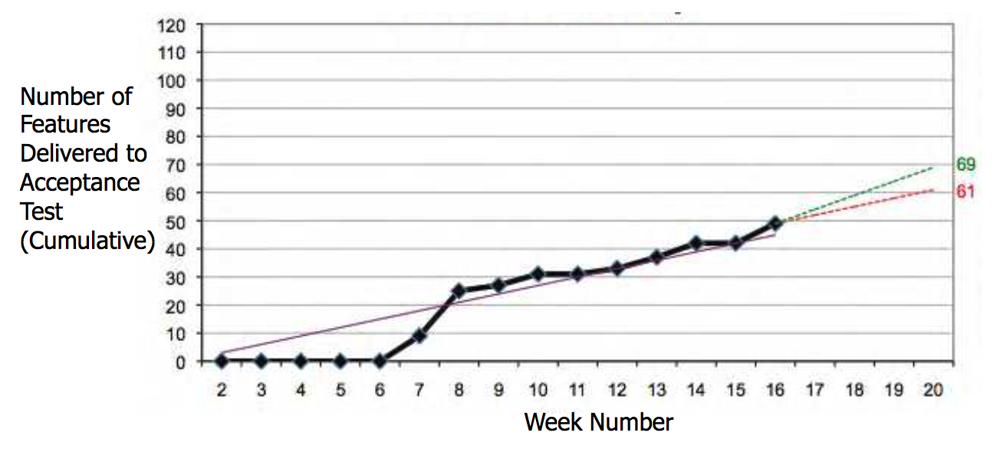

- Se puede hacer un diagrama conjunto de flujo acumulado de las
  distintas fases del desarrollo, para tener una visión de conjunto de
  todo el proceso de desarrollo. Para ello dibujamos varias líneas,
  cada una de un color, correspondientes a las distintas fases (ver
  ejemplo en la diapositiva o en el artículo de Pawel Brodzinski).

- Otro concepto importante es el **cycle time** o **lead time**, el
  tiempo medio en que una funcionalidad tarda en terminarse. Podemos
  representar las distintas funcionalidades terminadas en una gráfica,
  en el orden en el que se van terminando, y hacer un diagrama del
  tiempo transcurrido por cada una de ellas. De esta forma podemos ir
  obteniendo un conocimiento que nos servirá para estimar mejor las
  siguientes historias.

- Los diagramas anteriores están sacados de: 
    - José Manuel Beas: [Burn-up chart](http://jmbeas.es/guias/burn-up-chart/)
    - Pawel Brodzinski: [Cumulative Flow Diagram](http://brodzinski.com/2013/07/cumulative-flow-diagram.html)
    - Henrik Kniberg: [Lean from the trenches](https://pragprog.com/book/hklean/lean-from-the-trenches)

<kbd>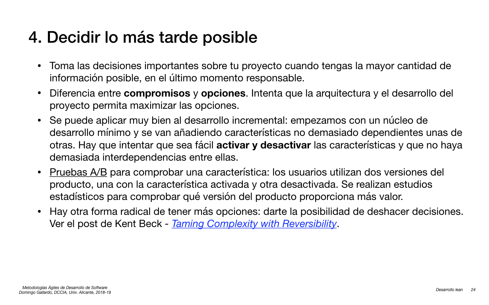</kbd>

- Cuando estamos comenzando a desarrollar las primeras funcionalidades
  del sistema, deberíamos **evitar tomar decisiones** sobre elementos
  críticos del diseño que no tengamos claros y que sean difíciles de
  cambiar en el futuro. En su lugar, debemos probar más de una
  alternativa y dejar abierta la posibilidad de cambio para el
  futuro. Estas alternativas deben incluir **todas las capas del
  desarrollo**: de la interfaz de usuario al _backend_. Serán ejemplos
  mínimos del sistema que se irán ampliando en cada iteración. Es lo
  que se denomina una **_trazer bullet_** (bala trazadora): una
  pequeña funcionalidad o ejemplo que afecta a todas las capas del
  desarrollo y que permite comprobar el funcionamiento de todos los
  elementos del sistema.

- En lugar de un plan fijo con fechas marcadas para entregar cada
  funcionalidad, el compromiso de un equipo ágil es **entregar valor**
  en forma de incremento cada 3 semanas (una buena analogía es una
  publicación periódica, como una revista semanal o mensual, cada
  semana o cada mes debe haber un nuevo ejemplar en los quioscos).

- Una idea importante es la denominada **option thinking**: podemos
  mantener distintas opciones abiertas y tomar la decisión de qué
  entregar lo más tarde posible. Esta idea es muy importante tanto en
  el diseño y el desarrollo del software, como en la selección de
  funcionalidades del _backlog_. Por ejemplo, en el caso del diseño,
  podríamos hacer un diseño que nos permita refactorizar fácilmente
  entre más de una implementación alternativa. En el caso de selección
  de funcionalidades por el _product owner_ hay que considerar el
  _backlog_ del sprint como opciones, no como compromisos. El PO puede
  modificar, añadir o eliminar ítems del sprint actual, asegurándose
  siempre que al final del sprint se entregará un incremento que
  aporte valor adicional.

- En el post de Kent Beck
  [Taming Complexity with Reversibility](https://m.facebook.com/notes/kent-beck/taming-complexity-with-reversibility/1000330413333156),
  se reflexiona sobre la ventaja de poder **deshacer decisiones** tomadas
  e incorporadas al producto, en el contexto de Facebook. En la
  mayoría de las ocasiones no estamos en situaciones irreversibles y
  podemos tomar decisiones que después tengamos que cambiar. Usemos la
  flexibilidad del software para desarrollar y desplegar pensando que
  podemos tener que deshacer lo que ya hemos hecho:
    - Sistema de control de versiones que permita recuperar versiones
      pasadas puestas en producción.
    - Sistema de revisión de código que permita deshacer la
      integración de funcionalidades.
    - Sistema flexible de puesta en producción que permita deshacer
      el último cambio si las métricas caen después de haber sido
      probado por millones de personas.

<kbd>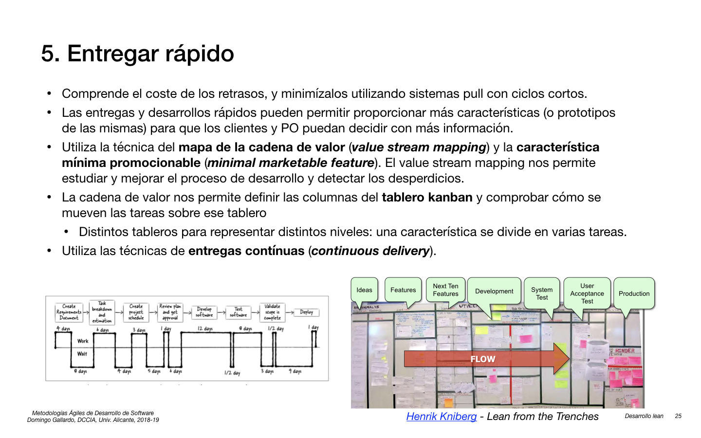</kbd>

<kbd>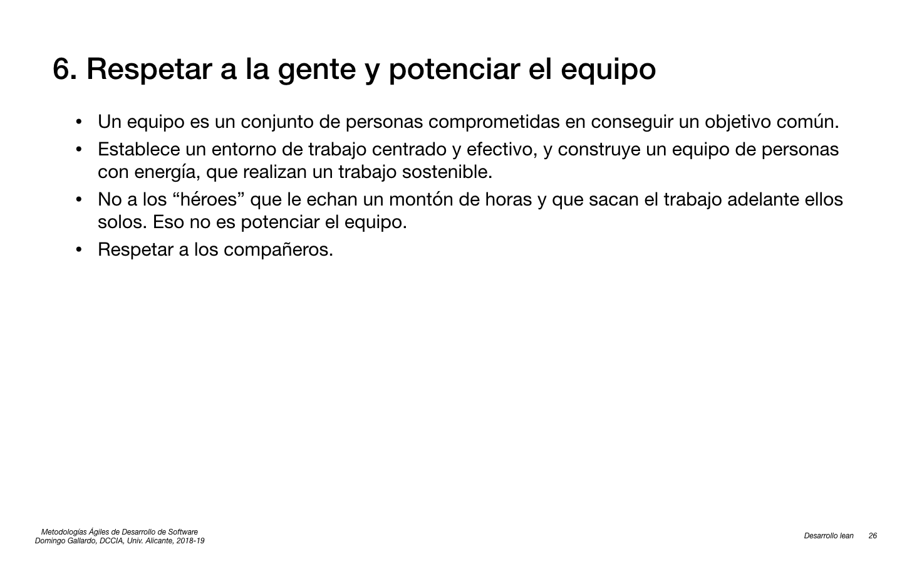</kbd>

<kbd></kbd>

<kbd>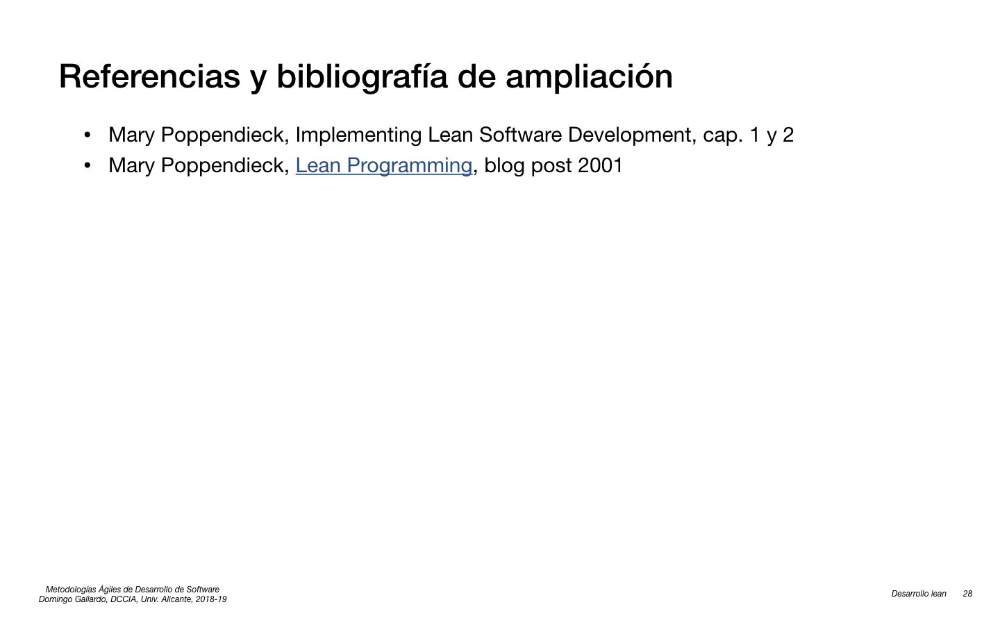</kbd>

- Post de 2001 de Mary Poppendieck: [Lean Programming](http://www.leanessays.com/2010/11/lean-programming.html)
