## Extreme Programming

<kbd>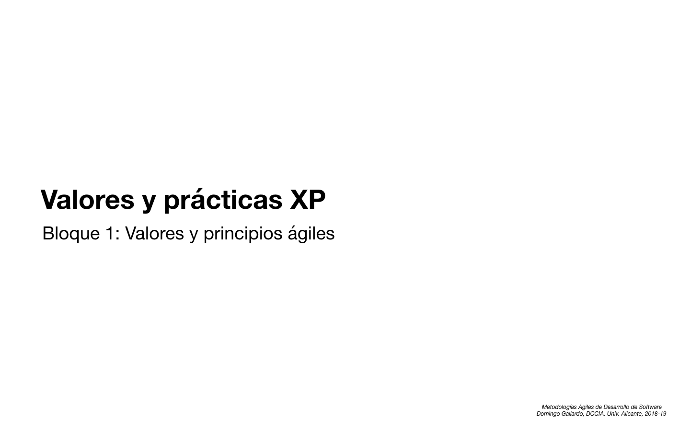</kbd>

<kbd>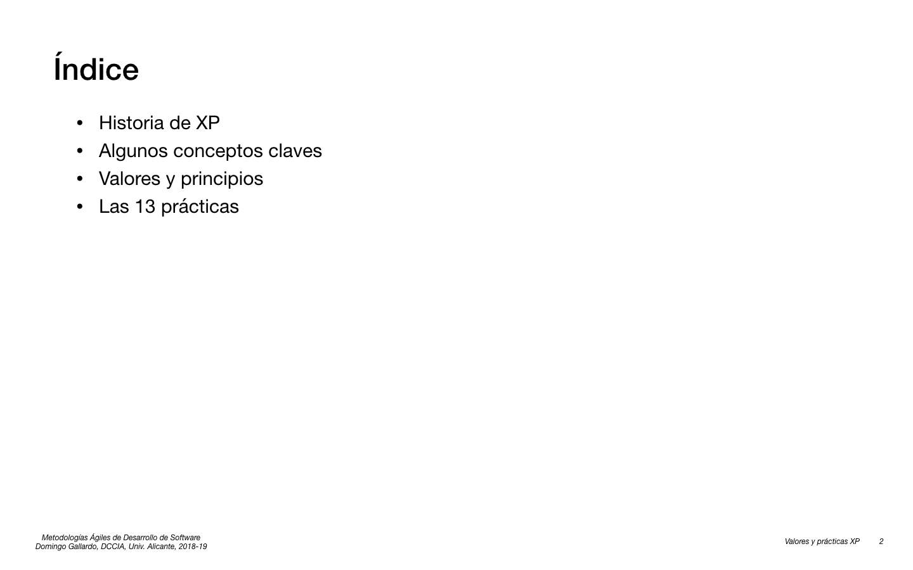</kbd>

<kbd>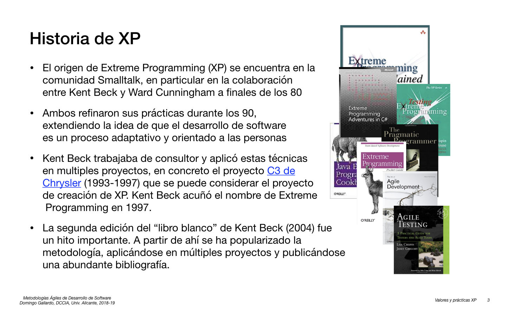</kbd>

- El [proyecto C3](https://www.martinfowler.com/bliki/C3.html)
  (Chrysler Comprehensive Compesation project) de Chrysler fue un
  proyecto de nóminas que se hizo famoso por considerarse el proyecto
  en el que nació XP.
  
  El proyecto fue un intento de reemplazar y unificar numerosos
  sistemas de nóminas _legacy_ basados en COBOL. **Martin Fowler**
  participó en varias ocasiones como consultor desde 1993 y comenzó a
  desarrollarse de forma seria en Smalltalk en 1995. **Kent Beck** tomó la
  dirección del mismo en 1996 y allí puso en acción todas las
  prácticas que después tomaron el nombre de _Extreme Programming_
  (aunque había utilizado enfoques similares en proyectos
  previos). Beck contó también con la colaboración de **Ron Jeffries** en
  el equipo (otro autor del manifiesto ágil).
  
  El software se puso en producción en 1997, realizando la gestión de
  nóminas de alrededor de diez mil personas. El proyecto continuó,
  intentando cubrir al resto de empleados, pero terminó fracasando y
  se detuvo el desarrollo en 1999 (volviéndose a poner en
  funcionamiento el sistema _legacy_ en COBOL). Para esa fecha las
  prácticas XP ya se habían popularizado y habían demostrado su éxito
  en otros proyectos (a pesar de que, paradójicamente, su proyecto
  inicial terminara fracasando).

<kbd>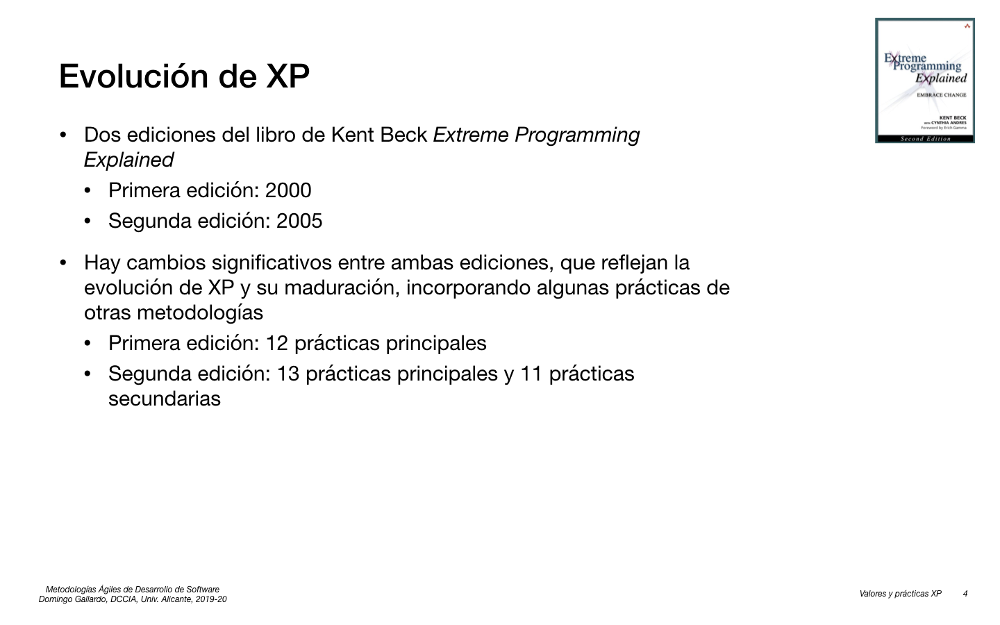</kbd>

<kbd>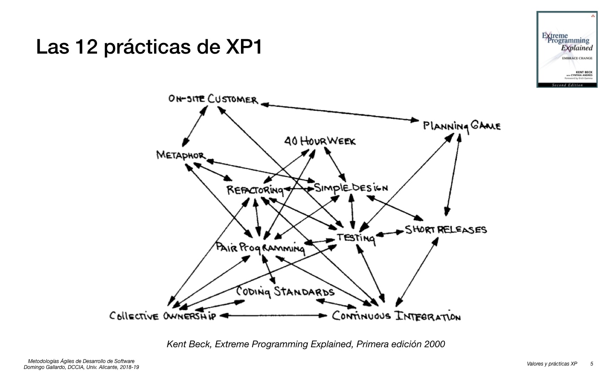</kbd>

<kbd>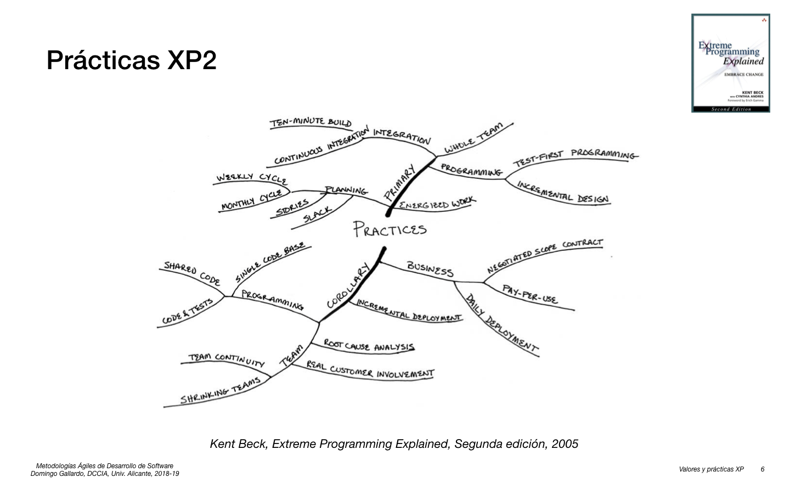</kbd>

- El prefacio de la segunda edición de _Extreme Programming Explained_
  lo firma [Erich Gamma](https://en.wikipedia.org/wiki/Erich_Gamma)
  en 2004. **Erich Gamma** es uno de los _Gang Of Four_, autores del
  famoso libro _Design Patterns_. También es co-autor, junto con Beck,
  de **JUnit**. Y fue líder del equipo que desarrolló inicialmente el
  **proyecto Eclipse**, el popular IDE de desarrollo de Java.
  
  En este prefacio, Gamma comenta que **las prácticas XP son claves en
  el desarrollo de Eclipse**. Al ser un proyecto open source uno de los
  objetivos es realizar una desarrollo completamente transparente, ya
  que si no se sabe hacia dónde va el proyecto no es posible colaborar
  con él ni proporcionar retroalimentación.
  
  Las prácticas que utiliza Gamma en Eclipse son principalmente
  **refactoring**, **tests unitarios** y **feedback inmediato**:
  
  - **Pruebas desde el principio, frecuentes y automatizadas**: más de
    21,000 tests en el proyecto.
  - **Diseño incremental**: se avanza en el diseño día a día, con la
    restricción adicional de que es necesario mantener estable el API.
  - **Despliegue diario**: los componentes despliegan el código al
    menos una vez por día y se desarrolla sobre el código desplegado
    para obtener feedback inmediato y detectar pronto los problemas.
  - **Implicación del cliente**: la comunidad prueba continuamente los
    cambios y proporciona retroalimentación.
  - **Integración continua**: el código se compila y construye cada
    noche (_nightly build_). Una vez a la semana se hace una
    construcción de integración (_integration build_).
  - **Ciclos de desarrollo cortos**: algo más largos que los ciclos de
    una semana de XP. Cada seis semanas se entrega un
    _milestone_. El objetivo de cada milestone es mostrar el progreso
    y obtener feedback.
  - **Planificación incremental**: después de cada _release_ se
    realiza un borrador de plan de lo que se va evolucionar en el
    siguiente release. El plan se publica en la web pronto para que la
    comunidad pueda unirse al diálogo.

<kbd>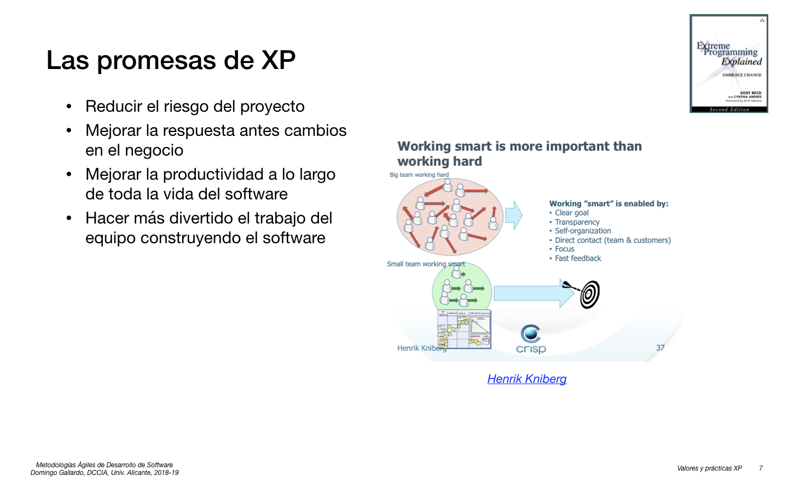</kbd>

- XP es una metodología ligera. En XP sólo se hace lo que es
  necesario para crear valor para el cliente.
- XP es una metodología basada en resolver los problemas surgidos en
  el **desarrollo de software**. No ofrece demasiadas soluciones para
  otras áreas cómo gestión del portfolio, operaciones, marketing o
  ventas.
- XP puede funcionar con equipos de cualquier tamaño.
- XP permite adaptarse a requisitos vagamente formulados o que cambian
  en el tiempo.
- XP es un intento de reconciliar humanidad y productividad. Tan
  importante son las habilidades humanas como las técnicas. Una buena
  técnica promueve relaciones basadas en la confianza. Kent Beck dice
  que su terror a los deadlines desapareció cuando aprendió la
  siguiente lección:

  > "No es mi tarea gestionar las expectativas de otras personas. Es
  > tarea de las otras personas manejar sus propias expectativas. Mi
  > tarea es hacerlo lo mejor posible y comunicar claramente."

- Los equipos XP juegan a ganar y aceptan las consecuencias. En XP no
  hay sitio para conductas como esconder trabajo hecho. Esconder el
  20% del trabajo no me va a hacer sentir mejor si el proyecto
  falla. Si escribo un programa lo mejor posible y a la gente no le
  gusta me puedo seguir sintiendo satisfecho de mi mismo porque he
  dado lo mejor de mi.

- Enlace a la web de [Henrik
  Kniberg](https://www.crisp.se/konsulter/henrik-kniberg) (aunque no
  habla demasiado de XP).

<kbd>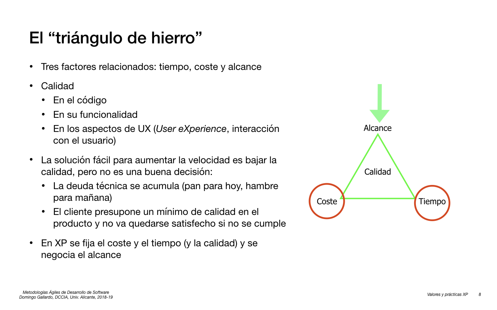</kbd>

- Las cuatro variables. Están todas relacionadas y no es posible
  optimizar las cuatro simultáneamente. 
  
  - **Coste**: El coste de un proyecto incluye el equipo, el consumo y
    el número y dedicación de personas (también llamado
    _man-month_). Sobre todo esto último.

  - **Tiempo**: El tiempo en el que se necesita terminar el
    proyecto. Normalmente está impuesto por necesidades del negocio y
    suele no ser negociable. Está relacionado con el coste, pero no de
    una forma directa. Si pasamos un proyecto de cuatro a ocho
    personas casi nunca terminaremos en la mitad de tiempo. Hay una
    penalización debida al incremento de complejidad de gestionar el
    doble de personas, y el doble de tareas simultáneas.
    
  - **Calidad**: Nivel de atención al detalle en los distintos
    aspectos del producto (aspectos técnicos relacionados con el
    diseño y la facilidad de modificación, interfaz de usuario,
    rendimiento, etc.). 

    Es tentador bajar la calidad para intentar ganar velocidad. Pero
    los problemas terminarán apareciendo a largo plazo.
    
  - **Alcance**: Conjunto de funcionalidades que contiene un
    proyecto. Es la variable que es más fácil de controlar. Lo
    recomendable es priorizar las características más importantes para
    el cliente.
  
- El objetivo final del desarrollo es que **el cliente quede
  satisfecho**. Podría darse el caso de que se optimizan las tres
  variables y el cliente no está satisfecho. Y al contrario, podría
  darse el caso de que no se cumpla ninguna de las tres variables pero
  el cliente quede satisfecho. El cliente queda satisfecho cuando el
  producto que le entregamos le **aporta valor**.

<kbd>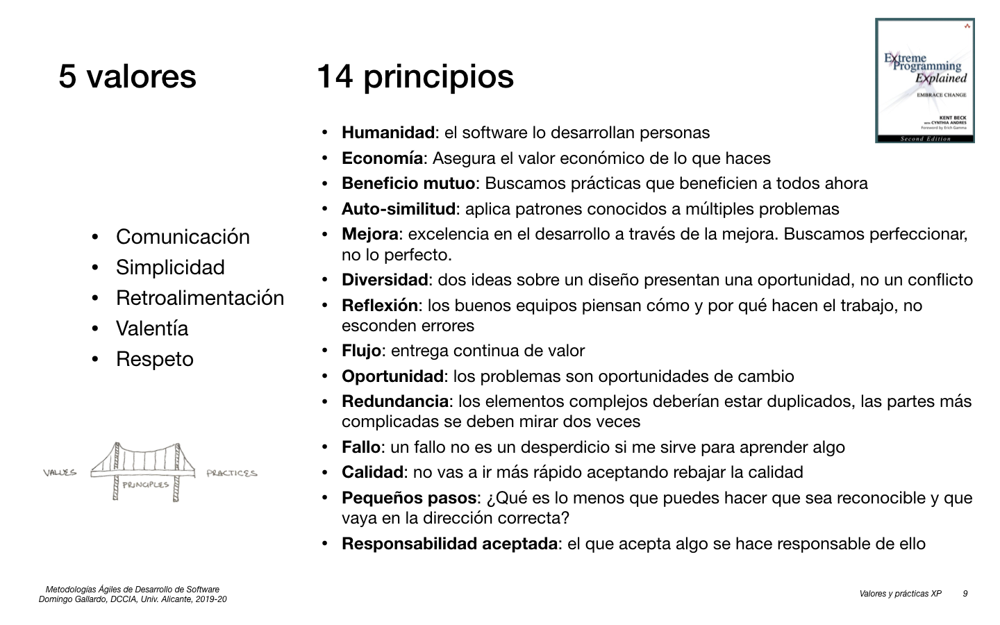</kbd>

Explicación de los cinco valores:

- **Comunicación**: las prácticas de XP promueven comunicación abierta y
  honesta entre el equipo, gerencia y los clientes.

- **Simplicidad**: mantener el código y el diseño tan simple como sea
  posible incrementa la claridad, comprensibilidad, extensibilidad y
  mantenibilidad del sistema.
  
  En el contexto de XP, Kent Beck define un sistema simple como aquel
  que:
  
  - Pasa todos los tests
  - Proporciona todas las funcionalidades
  - No tiene duplicación
  - Usa el mínimo número de clases y métodos

- **Retroalimentación**: sin una retroalimentación continua y honesta
  todo se desmorona. La retroalimentación es lo que mantiene a todo el
  mundo en sintonía. Es lo que permite que los desarrolladores
  entreguen el sistema que el cliente realmente quiere.
  
  En XP la retroalimentación aparece de muchas formas y en muchas
  escalas de tiempo. A nivel de minutos aparece cuando lanzamos los
  tests, después cuando hacemos _pair programming_, diariamente en las
  reuniones diarias o en cada iteración con la retroalimentación de
  los clientes.

- **Valentía**: Valentía es la acción efectiva frente al miedo. El
  miedo es algo que se sufre en el desarrollo de software. ¿Qué miedos
  existen?:

  - Miedo a hacer algo mal, crear bugs. Sobre todo si estás
    escribiendo software que afecta a personas.

  - Miedo a cambiar código, ya sea tuyo o de otros (código _legacy_ o
    heredado).

  - Miedo a no poder terminar un proyecto en el que se ha invertido
    mucho trabajo (por ejemplo, un año) debido a que se cancele o a
    que nadie lo use.
    
  La valentía se debe manifestar a veces en forma de acción, cuando
  conoces la solución a un problema. Otras veces en forma de
  paciencia. Si sabes que hay un problema pero no sabes cuál es, es
  necesario valentía para esperar a que el verdadero problema termine
  apareciendo. 

  La valentía para decir la verdad, sea o no placentera, promueve la
  comunicación y la confianza. La valentía para descartar soluciones
  parciales y buscar otras nuevas promueve la simplicidad. La valentía
  por buscar respuestas reales y concretas crea retroalimentación.
  
- **Respeto**: Los anteriores cuatro valores apuntan a uno subyacente:
  respeto. Si los miembros de un equipo no se preocupan de los otros,
  sobre lo que están haciendo, XP no funcionará. Si los miembros de un
  equipo no se preocupan sobre un proyecto, nada puede salvarlo.

  Nadie es intrínsecamente más valioso que ningún otro. Deben
  respetarse las contribuciones de todos. Yo soy importante y tú
  también. 
  
<kbd>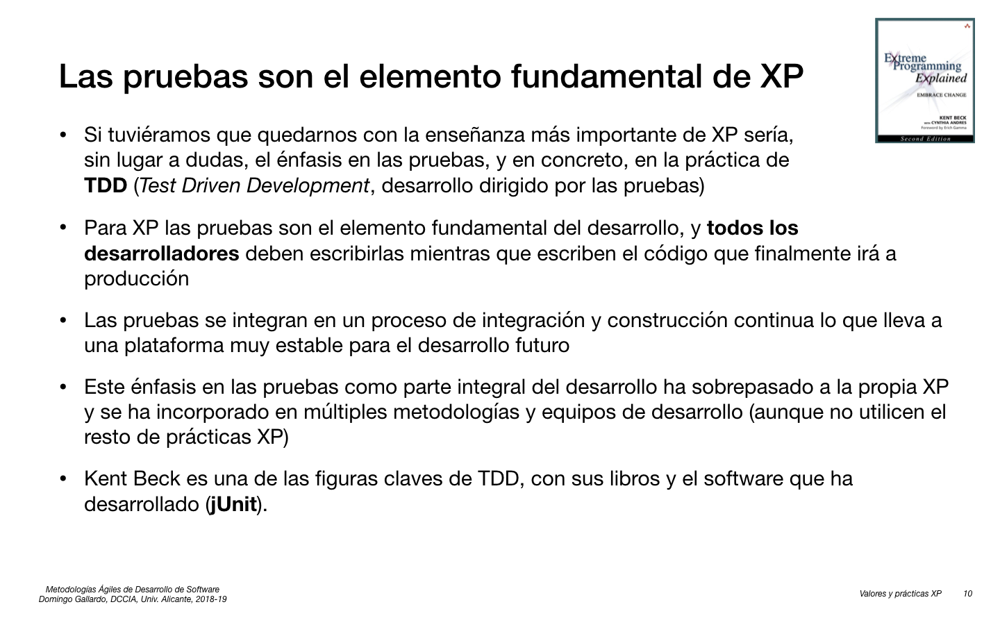</kbd>

- TDD: Test Driven Development. Consiste básicamente en invertir el
  desarrollo habitual de los tests. No hacerlos después de escribir el
  código para comprobar que no hay errores. Sino **hacer el test antes
  de escribir el código**. Y escribir únicamente el código necesario
  para que el test pase.
  
  Esta idea tan simple en apariencia cambia radicalmente la forma de
  enfrentarse al desarrollo. Lo veremos más adelante.
  
<kbd>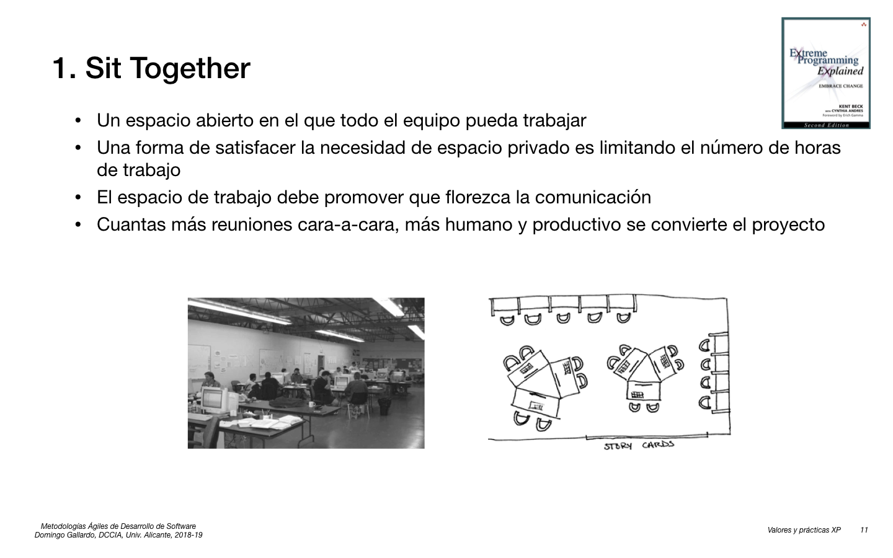</kbd>

<kbd>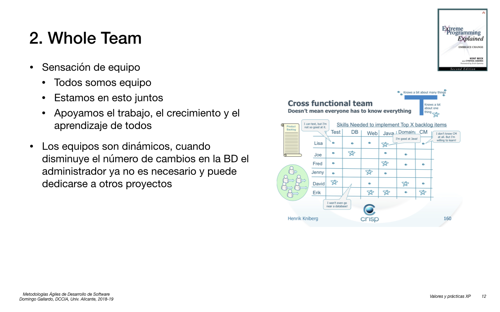</kbd>

<kbd>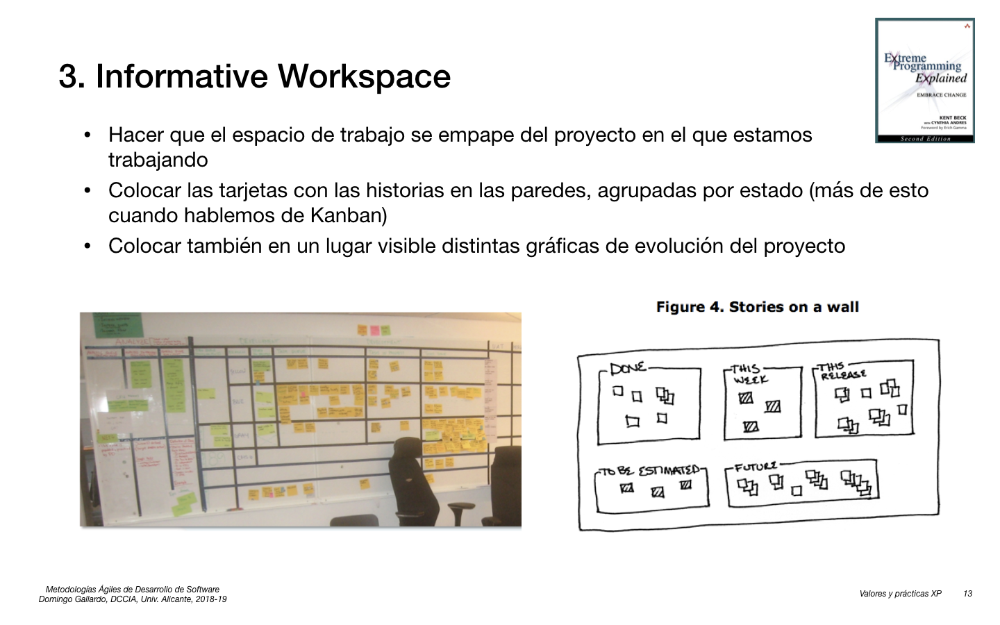</kbd>

<kbd>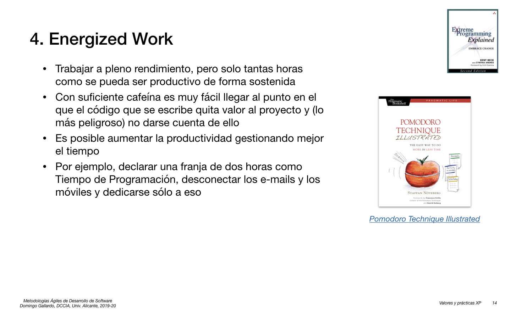</kbd>

- Libro interesante sobre la técnica del Pomodoro [Pomodoro Technique
  Ilustrated](https://pragprog.com/book/snfocus/pomodoro-technique-illustrated).
- La idea original es de Francesco Cirillo. En [esta
  página](https://cirillocompany.de/pages/pomodoro-technique) anuncia
  sus cursos y se puede obtener su libro original.

<kbd>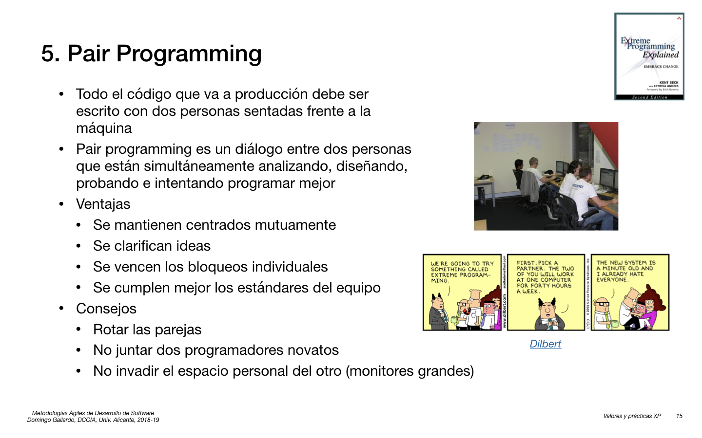</kbd>

- Muy interesante el post [Pair
  programming](http://www.programania.net/desarrollo-agil/pair-programming/)
  de [Luis Artola](https://twitter.com/artolamola):
  - ¿Es más caro el desarrollo con pair programming? Su respuesta es
    que no. El **cuello de botella del desarrollo** no es teclear, es:
       - código poco expresivo difícil de entender
       - diseño no simple (complicado)
       - desconocimiento del dominio
       - cambiar cosas y volver a probarlo todo a mano (o no hacerlo y
         provocar nuevos fallos)

    Yo añadiría un par más, relacionados con problemas técnicos:
    
       - desconocimiento de las herramientas/frameworks/lenguajes con
         los que se trabaja
       - uso de herramientas/frameworks/lenguajes poco apropiados
       
  - La velocidad de desarrollo es cada vez menor: "Al principio voy
    rápido porque hay poco código y con un diseño cualquiera me
    vale. Pero cada vez me cuesta más añadir nuevas funcionalidades
    porque, además, no sé lo que estoy rompiendo.". Para evitar este
    problema es fundamental mantener un diseño simple. TDD y XP ayuda
    a ello.

  - Para que el pair programming resulte realmente eficaz:
    - Dos teclados y dos ratones (¡incluso dos pantallas!), dos sillas
      y la pantalla en medio. Hay que estar cómodo. También es muy
      útil tener a mano un ordenador auxiliar (portátil o tablet) en
      el que poder a veces buscar más información mientras que la otra
      persona programa.
    - Máxima intensidad: pomodoros, y un objetivo (troceado en un
      pequeño log de la sesión de pairing)
    - Máxima concentración: el que no escribe debe mantener la
      atención muy activa, por ejemplo llevando el log y aportando ideas
      todo el rato. Sino: ping pong (ver después).
    - Si un problema que nadie sabe resolver interrumpe la dinámica –>
      es mejor DEJAR DE PAIREAR y buscar la solución.

  -  Algunas malas costumbres:
     - Acceso poco equitativo a teclado o pantalla / dominio de una persona del teclado
     - Matrimonios: parejas que nunca cambian
     - Uno trabaja el otro descansa
     - Dos ordenadores
     - Cada uno hace “su propio trabajo”
     - Los debates duran más de diez minutos sin escribir código nuevo

  - Algunos buenos hábitos:
     - Descansar
     - Ser humilde y receptivo
     - Comunicarte y escuchar
     - Defender tu visión y saber ceder

- Patrón Ping pong (pair programming y TDD)
  - A escribe un test nuevo y lo ve fallar
  - B implementa el código para que el test pase
  - B escribe el nuevo test y lo ve fallar
  - A implementa el código para que el test pase 
  - Y así sucesivamente. El refactoring se hace cuando surge la
    necesidad por el que está escribiendo en ese momento.

- [Un entorno productivo en
  pareja](http://www.programania.net/diseno-de-software/un-entorno-productivo-en-pareja/),
  otro artículo de Luis Artola en el que explica con más detalle el
  entorno de trabajo para un proyecto concreto en el que usaron pair
  programming y añade algunas ideas más sobre cuándo hacer pairing y
  cuando no:
  
  - Hacemos pairing siempre que lo que nos impide avanzar es el
    conocimiento (ya sea técnico o de dominio).
  - Hacemos pairing siempre que se va a tomar una decisión de diseño
    importante en la que se va a basar el proyecto (cómo vamos a
    organizar los componentes, si se va a usar tal o cuál patrón,
    estrategia de testeo, etc…)
  - Siempre que hacemos pairing tenemos una lista preparada con el
    orden del día. Y sí: normalmente hacemos pairing de jornadas
    completas, preparando el entorno previamente para ser productivos
    y tener toda la información disponible y la posibilidad de tener
    discusiones productivas.
  - Es importante no hacer pairing cuando quieres asimilar algo que has aprendido.

<kbd>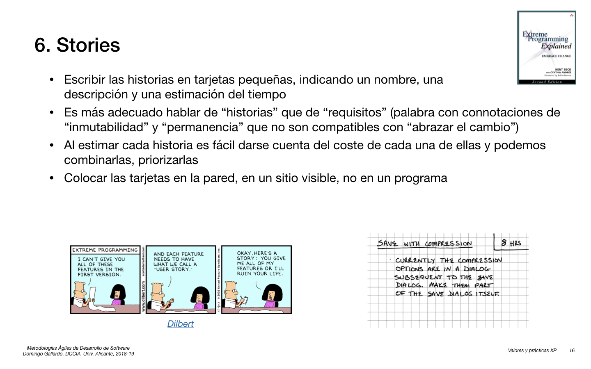</kbd>

<kbd>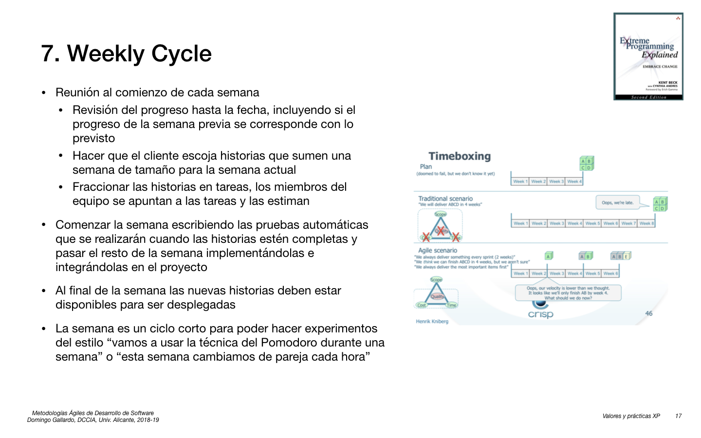</kbd>

<kbd>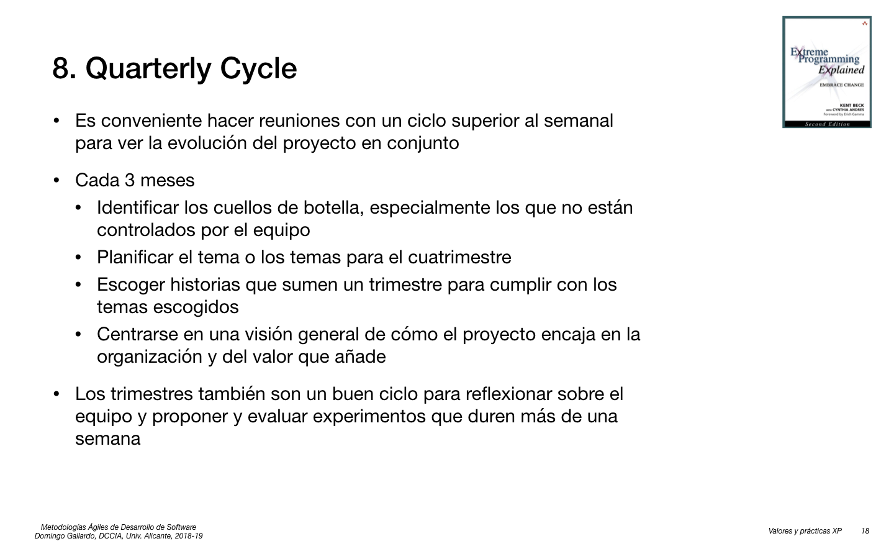</kbd>

<kbd>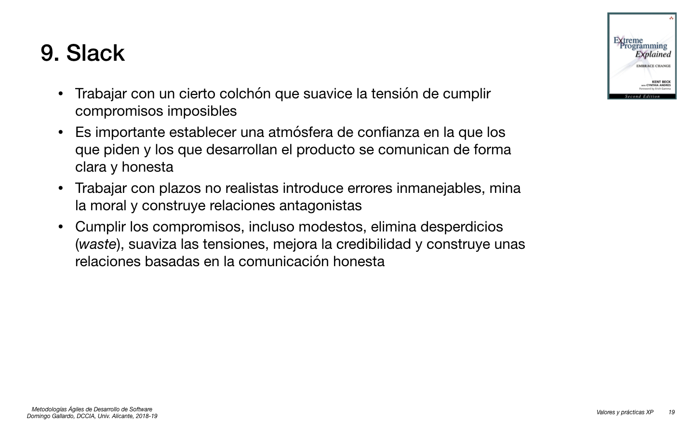</kbd>

<kbd>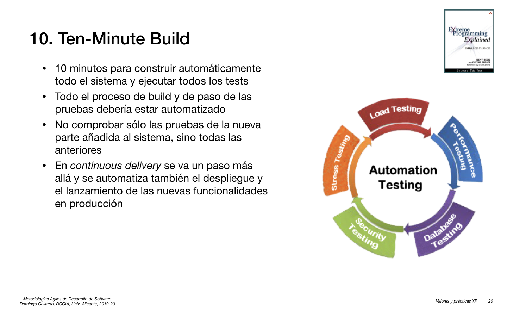</kbd>

<kbd>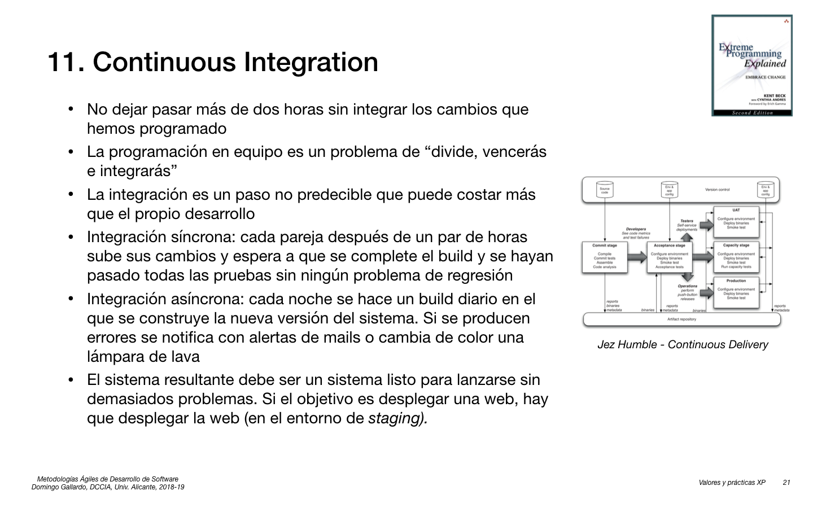</kbd>

<kbd>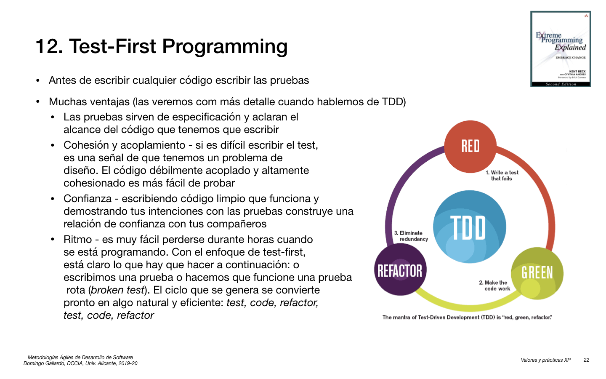</kbd>

<kbd>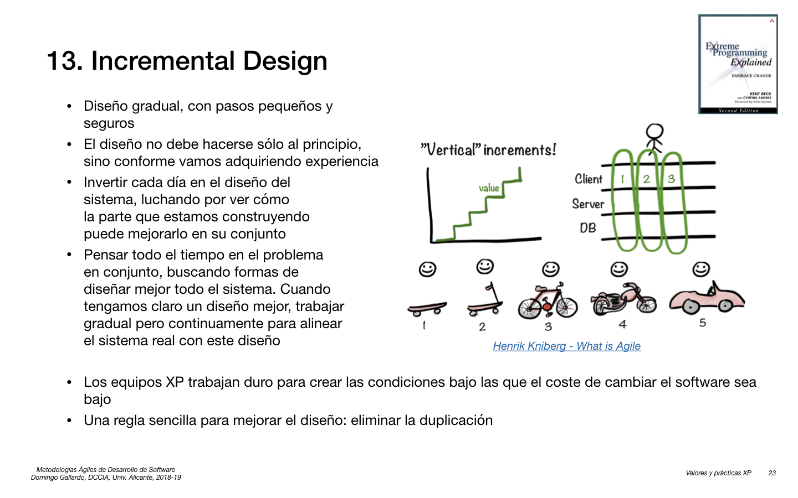</kbd>

<kbd>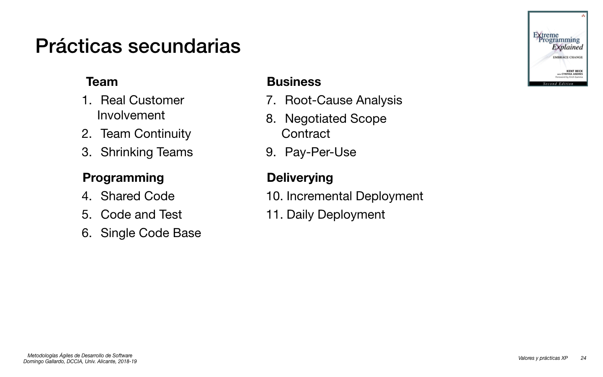</kbd>

<kbd>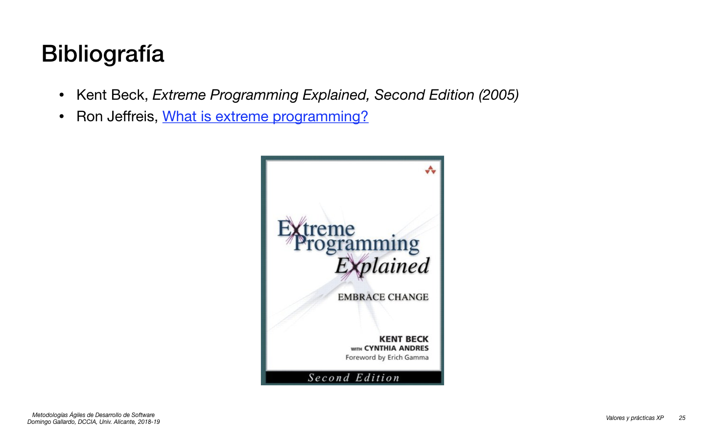</kbd>

- Enlace al libro Kent Beck (acceso digital Biblioteca UA): [Extreme
  Programming Explained, Second Edition](http://proquest.safaribooksonline.com/0321278658?tocview=true)
- Artículo de Ron Jeffries: [What is Extreme Programming?](http://ronjeffries.com/xprog/what-is-extreme-programming/)
