## Ampliación de Scrum

<kbd>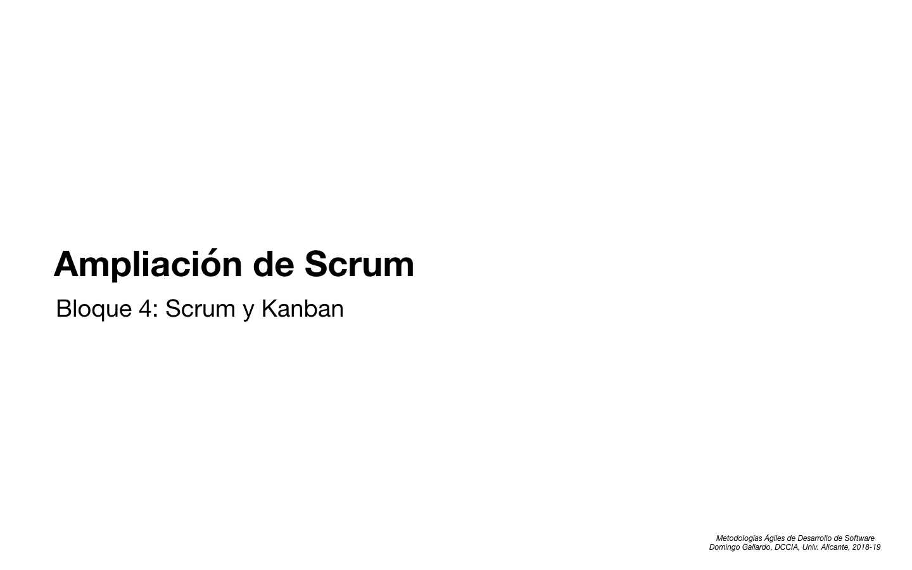</kbd>

<kbd>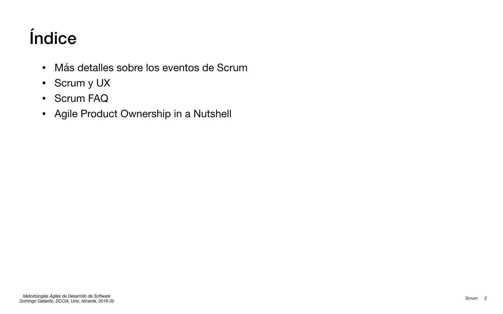</kbd>

<kbd></kbd>

<kbd></kbd>

<kbd></kbd>

<kbd>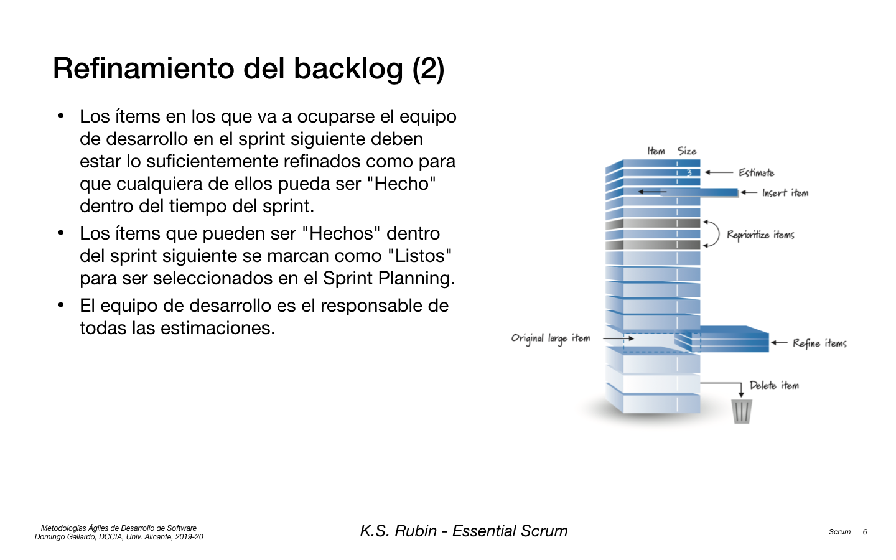</kbd>

<kbd>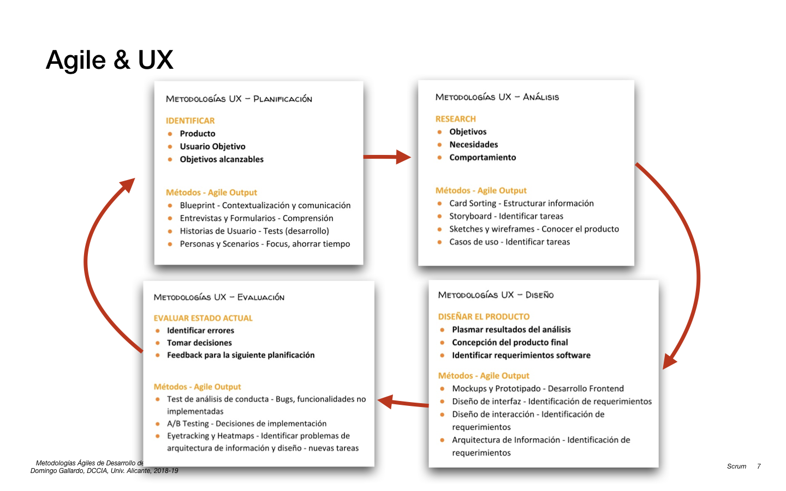</kbd>

<kbd>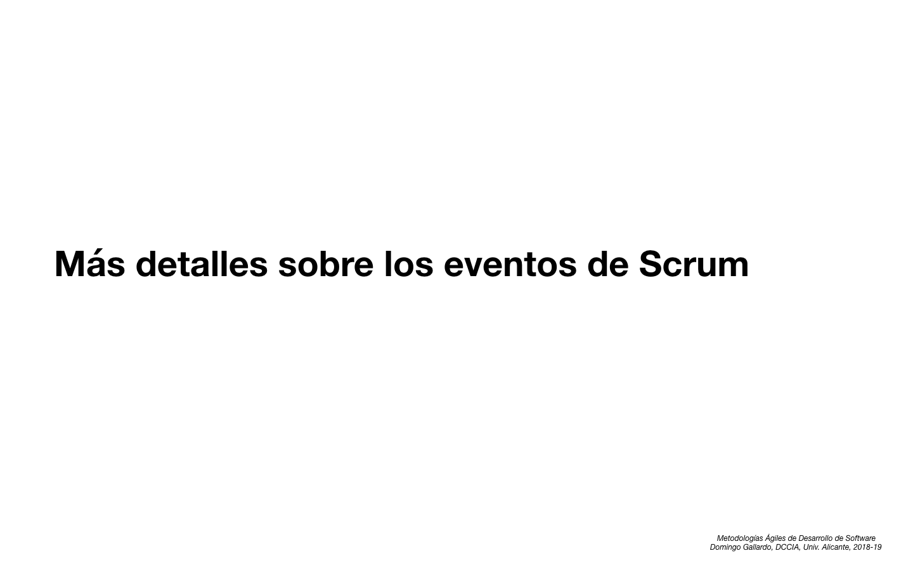</kbd>

<kbd>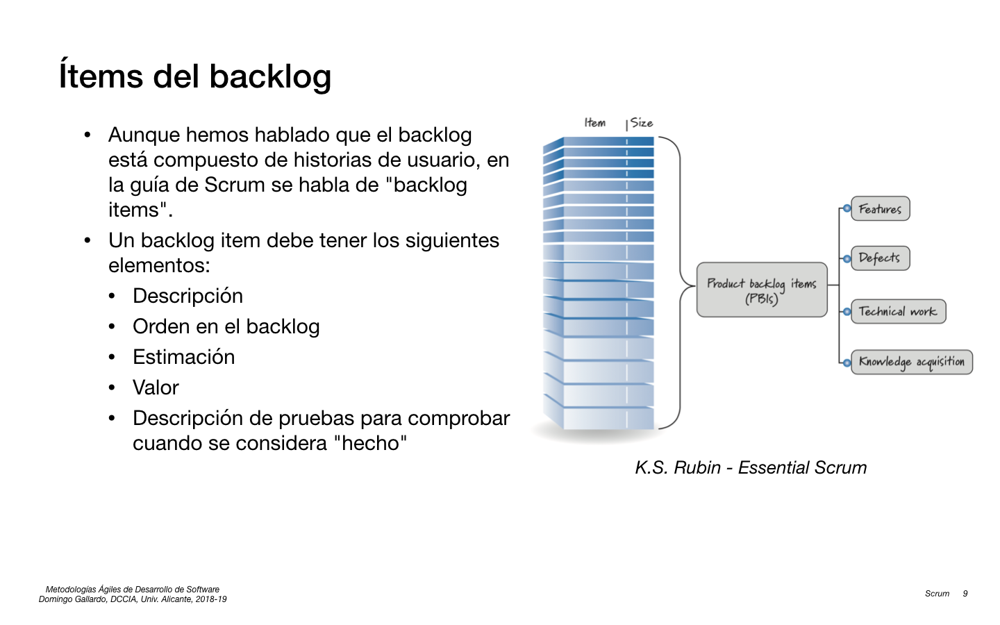</kbd>

[The Graphical art of The Incredibles 2](http://joshholtsclaw.com/blog/2018/3/5/the-graphic-art-of-incredibles-2)

<kbd>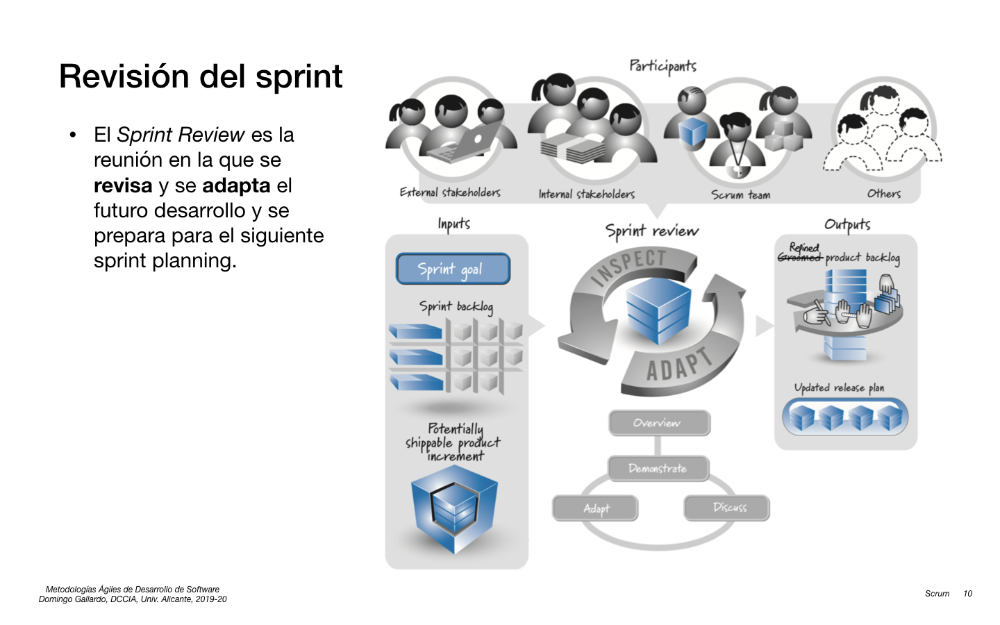</kbd>

<kbd>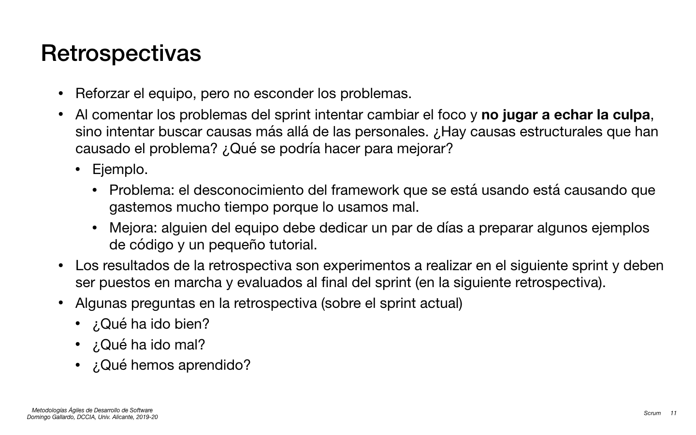</kbd>

<kbd>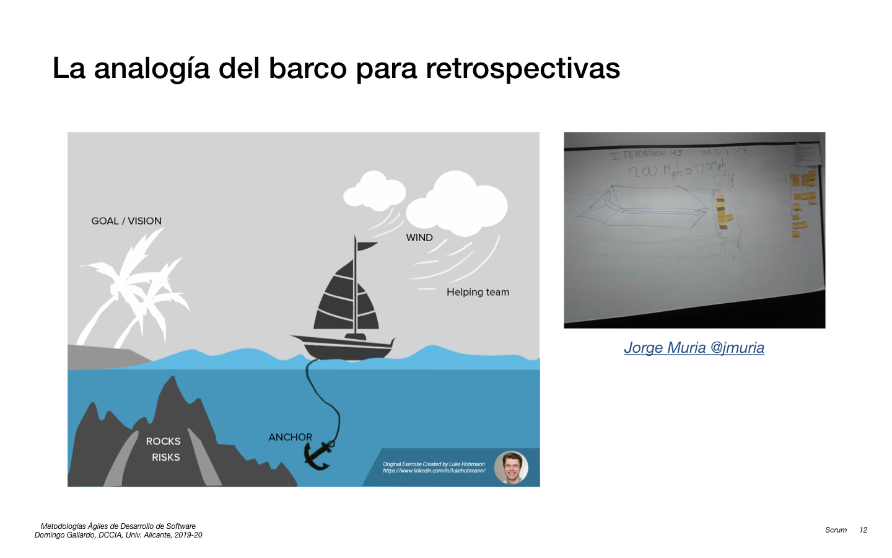</kbd>

[Jorge Muria - Twitter barco](https://twitter.com/jmuria/status/402192009420865537/photo/1)  
[Libro de Luke Hohmann - Innovation Games: Creating Breakthrough Products Through Collaborative Play](https://www.amazon.es/dp/0321437292/?coliid=I2NOA5NAX4JVJP&colid=5GN3K5139LQD&psc=0&ref_=lv_ov_lig_dp_it)

<kbd>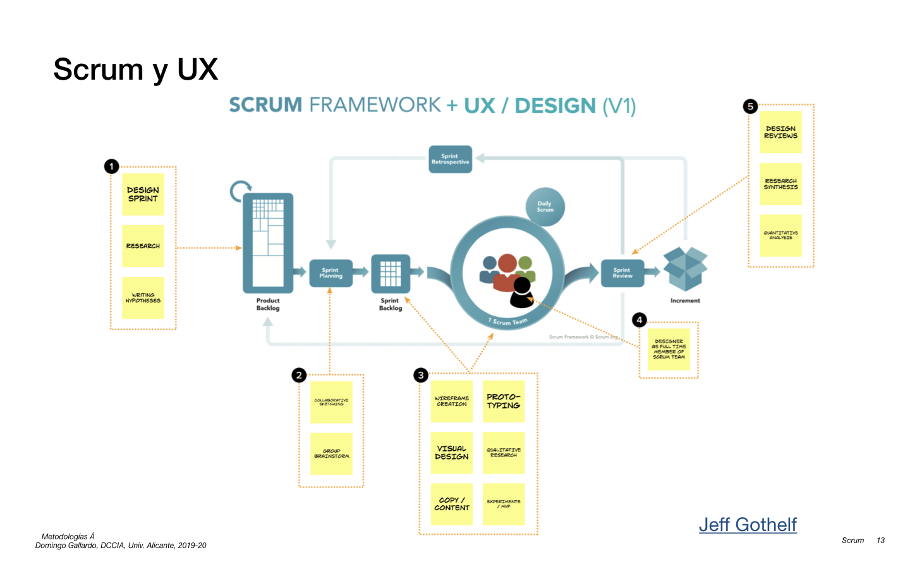</kbd>

[Jeff Gothelf - Here is how UX Design Integrates with Agile and Scrum](https://medium.com/swlh/here-is-how-ux-design-integrates-with-agile-and-scrum-4f3cf8c10e24)  
[Jerónimo Palacios - UX y Scrum](https://mailchi.mp/jeronimopalacios/pqyxgrwa3i-2928097?e=d9abb9eecf)

- **Product Backlog**: El trabajo de UX comienza en los Product Backlog
  Items y es necesario para dotarlos de contexto. Unido a técnicas de
  Specification by Example, Research o Design Sprints (que no son
  Sprints en Scrum) podemos elaborar una lista de Product Backlog
  Items que, cuando se conviertan en Incrementos terminados,
  pueden darnos valor.
  
- **Sprint Planning**: Durante el Sprint Planning se toman decisiones en
  torno a qué se abordará en el Sprint. Aquí el trabajo de la
  diseñadora se centrará en actividades como Sketchnoting colaborativo
  e identificar cuales son las actividades clave, problemas y
  excepciones que podemos encontrar.
  
- **Sprint Backlog** y **Daily Scrum**: Los miembros del equipo de
  desarrollo que trabajen en diseño, deben de formar parte del equipo
  a tiempo completo, igual que pueden hacerlo BAs, Testers u
  Operaciones.  El trabajo específico de diseño debe ir en la lista de
  trabajo del equipo de desarrollo: el Sprint Backlog. La idea es que
  el equipo se autoorganiza para atacar el trabajo de forma que puedan
  trabajar en paralelo de una forma no-lineal.
  
- **Dentro de un Sprint**: Dentro del sprint es fundamental la
  participación del diseño en el proceso de refinamiento del sprint,
  por ejemplo preparando bocetos de las interfaces de las historias
  que se están detallando para futuros sprints.
  
- **Sprint Review**: Es la oportunidad para inspeccionar el trabajo
  realizado, la situación del negocio y así poder adaptar el Product
  Backlog para trabajar en los siguientes ítems de más valor.

<kbd></kbd>

[Colaborative Sketching](https://www.thoughtworks.com/insights/blog/collaborative-sketching-sessions-framework)

- Ejercicio de 90 minutos para proponer alternativas visuales a una
  historia de usuario. Liderado por el diseñador del equipo de
  desarrollo. Participa también el PO.
- Se reparten 2 hojas A4 a y materiales de dibujo a todos los
  participantes.
- Se doblan en 4 y se dibuja en cada cuarto una propuesta de interfaz
  (sketch).
- Los _sketches_ pueden ser de dos tipos:
    - Flujo de pantallas
    - 4 soluciones alternativas para el problema
- Primera ronda:
    - 10 minutos para dibujar los _sketches_
    - Presentar las soluciones
- Segunda ronda: el mismo planteamiento de la primera. Sirve para
  reforzar el consenso.
- Ventajas: tormenta de ideas, todo el equipo está implicado en el diseño.

<kbd>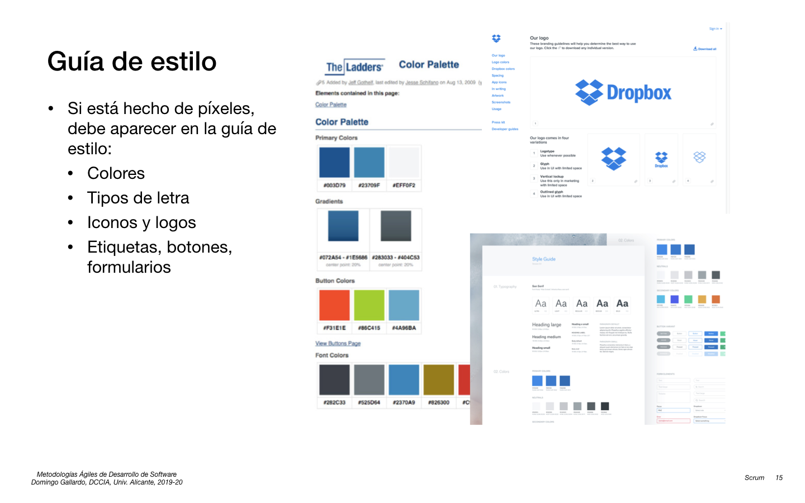</kbd>

<kbd>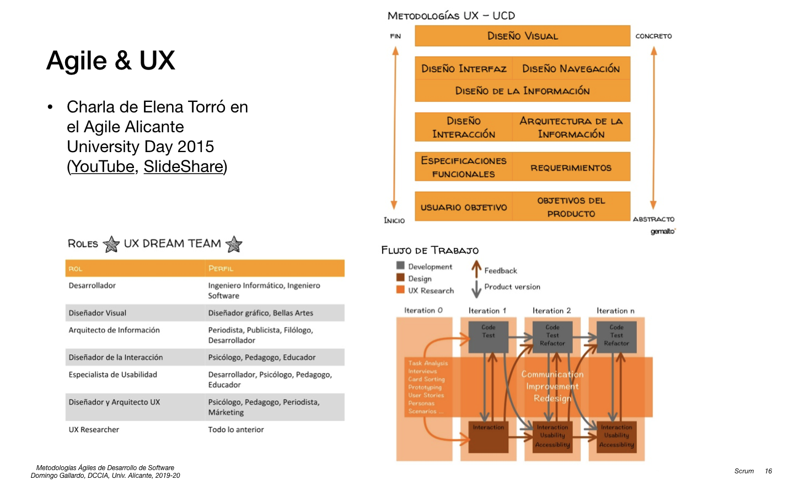</kbd>

- Charla de Elena Torró "Agile & UX" ([YouTube](https://youtu.be/wpIFKJxsutY), [SlideShare](https://www.slideshare.net/ElenaTorro/agile-ux-54232940))

<kbd></kbd>

<kbd>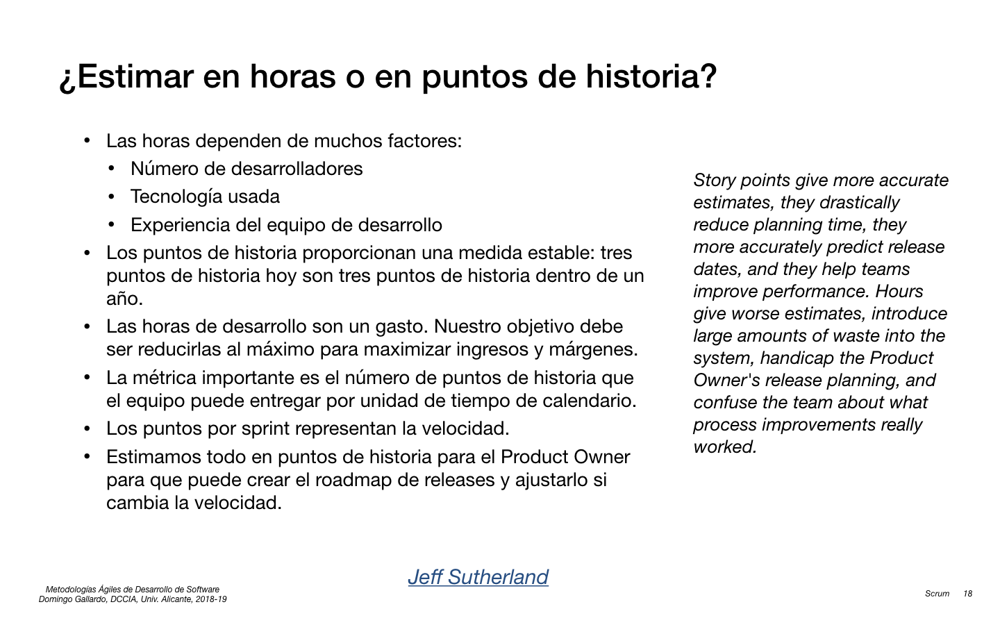</kbd>

<kbd>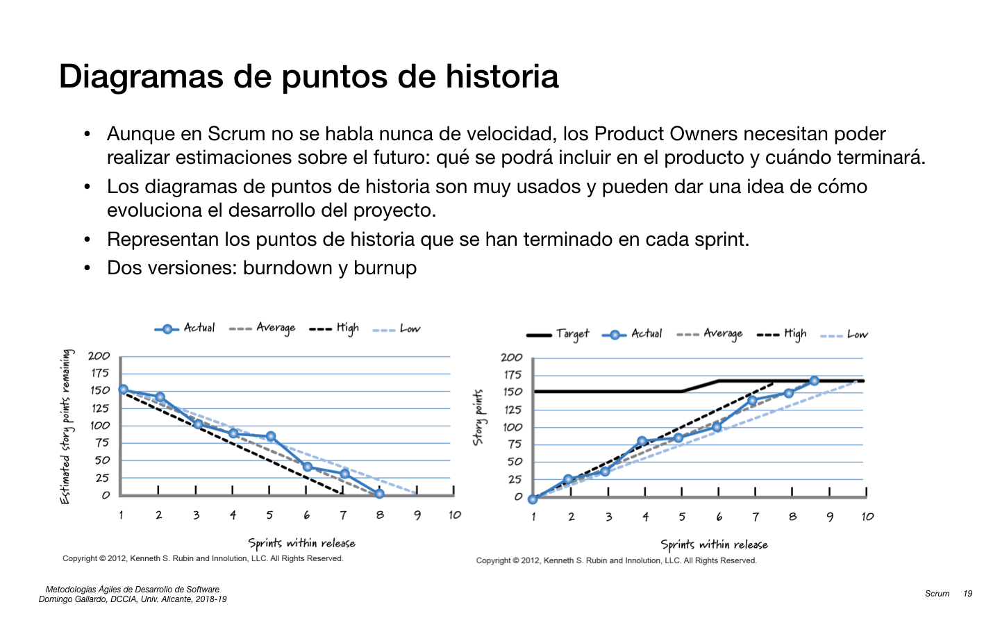</kbd>

[Jeff Sutherland - Story Points: Why are they better than hours?](https://www.scruminc.com/story-points-why-are-they-better-than/)

<kbd>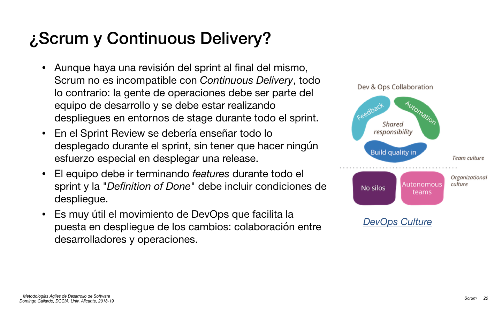</kbd>

<kbd></kbd>

[DevOps Culture](https://martinfowler.com/bliki/DevOpsCulture.html)

